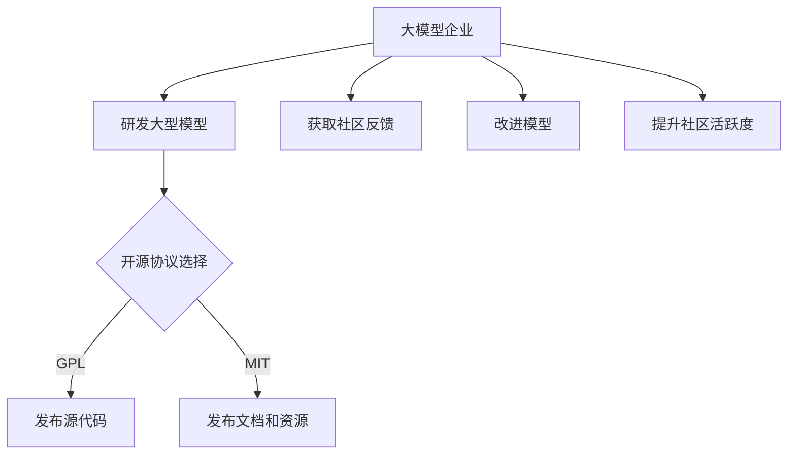

                 

# 大模型企业的开源社区运营

> 关键词：开源社区、大模型企业、运营策略、技术创新、社区互动

> 摘要：本文旨在探讨大模型企业在开源社区运营中的策略和实践。通过对开源社区的概念、大模型企业的角色、运营目标和挑战的深入分析，本文将提供一系列实用的运营建议，以帮助企业提升其在开源社区中的影响力和竞争力。

## 1. 背景介绍

### 1.1 目的和范围

本文旨在帮助企业理解并实施有效的开源社区运营策略，特别是在大模型领域。随着人工智能技术的快速发展，大模型在开源社区中扮演着越来越重要的角色。本文将探讨开源社区运营的核心概念，分析大模型企业的运营目标，并阐述在开源社区中面临的挑战。

### 1.2 预期读者

本文的预期读者包括：

- 大模型企业的技术团队和产品经理
- 开源社区运营专员和志愿者
- 对开源社区和大模型技术有兴趣的技术爱好者

### 1.3 文档结构概述

本文将分为以下章节：

- 1. 背景介绍
- 2. 核心概念与联系
- 3. 核心算法原理 & 具体操作步骤
- 4. 数学模型和公式 & 详细讲解 & 举例说明
- 5. 项目实战：代码实际案例和详细解释说明
- 6. 实际应用场景
- 7. 工具和资源推荐
- 8. 总结：未来发展趋势与挑战
- 9. 附录：常见问题与解答
- 10. 扩展阅读 & 参考资料

### 1.4 术语表

#### 1.4.1 核心术语定义

- 开源社区：指由一群对特定技术或项目有兴趣的人组成的在线社区，他们共同合作开发和分享代码、文档、资源和经验。
- 大模型企业：指开发和运营大型人工智能模型的企业，这些模型通常具有高复杂性和广泛的应用领域。
- 运营策略：指企业为了实现特定目标而制定的行动计划和执行方法。

#### 1.4.2 相关概念解释

- 开源协议：指规定开源社区中代码、文档和其他资源使用和分发方式的规则。
- 社区互动：指在开源社区中进行的交流、合作和知识共享活动。

#### 1.4.3 缩略词列表

- OSS：Open Source Software，开源软件
- ML：Machine Learning，机器学习
- AI：Artificial Intelligence，人工智能
- NLP：Natural Language Processing，自然语言处理

## 2. 核心概念与联系

### 2.1 开源社区

开源社区是一个由开发者、用户和其他利益相关者组成的网络，他们共同协作，共同开发和改进软件项目。开源社区的核心是共享和协作精神，通过开源协议（如GPL、MIT等）来规范资源的使用和分发。

#### 2.1.1 开源社区的作用

- 促进技术创新：开源社区汇集了来自世界各地的开发者和用户，他们可以共同研究和开发新技术，推动整个领域的进步。
- 知识共享：开源社区鼓励知识共享，用户和开发者可以相互学习和交流，提升自己的技能。
- 降低成本：开源软件和资源的免费获取和使用，降低了企业和个人的研发成本。

### 2.2 大模型企业

大模型企业是指开发和运营大型人工智能模型的企业，这些模型通常具有高复杂性和广泛的应用领域。大模型企业通过开源社区来分享自己的研究成果和技术，同时从社区中获取反馈和建议，进一步优化和改进模型。

#### 2.2.1 大模型企业的角色

- 研发者：大模型企业是人工智能技术的研发者，他们开发和优化大型模型。
- 共享者：大模型企业通过开源社区分享自己的研究成果和技术，促进整个领域的进步。
- 引领者：大模型企业在开源社区中起到引领和示范作用，推动整个领域的发展。

### 2.3 核心概念联系

大模型企业与开源社区之间存在着紧密的联系。大模型企业通过开源社区来获取反馈、改进技术、提升影响力，同时开源社区也为大模型企业提供了一个展示和推广的平台。

#### 2.3.1 开源社区运营与大模型企业的关系

- 开源社区运营是提高大模型企业在社区中影响力的关键。
- 运营策略的有效实施可以帮助大模型企业更好地与社区互动，提升社区活跃度。
- 通过开源社区，大模型企业可以吸引更多的开发者、用户和其他利益相关者，扩大用户基础，提高市场竞争力。

### 2.4 Mermaid 流程图

以下是一个描述大模型企业与开源社区互动的 Mermaid 流程图：



## 3. 核心算法原理 & 具体操作步骤

### 3.1 大模型算法原理

大模型企业通常使用深度学习算法来开发大型模型，这些算法包括：

- 神经网络：神经网络是一种模仿生物神经系统的计算模型，通过多层神经元的连接和激活函数来实现特征提取和分类。
- 循环神经网络（RNN）：RNN能够处理序列数据，通过记忆历史信息来预测未来序列。
- 变分自编码器（VAE）：VAE通过概率模型来生成数据，可以用于数据压缩、去噪和生成新数据。

### 3.2 具体操作步骤

#### 3.2.1 研发大型模型

1. 数据收集：收集大量相关的数据，例如文本、图像、音频等。
2. 数据预处理：对数据进行清洗、归一化和格式转换，以适应模型输入要求。
3. 设计模型架构：根据应用场景选择合适的神经网络架构，如CNN、RNN、VAE等。
4. 训练模型：使用训练数据对模型进行训练，通过优化算法（如梯度下降、Adam等）调整模型参数。
5. 验证和测试：使用验证集和测试集评估模型性能，调整模型参数以优化性能。

#### 3.2.2 开源社区运营

1. 选择合适的开源协议：根据企业的目标和社区互动需求，选择合适的开源协议，如GPL、MIT等。
2. 发布源代码：将模型的源代码开源，并提供详细的文档和注释。
3. 发布文档和资源：发布模型的使用文档、安装指南、API文档等，以帮助用户更好地使用模型。
4. 获取社区反馈：定期收集社区反馈，了解用户的需求和建议，优化模型和文档。
5. 提升社区活跃度：组织社区活动，如代码审查、研讨会、在线讲座等，鼓励用户参与和互动。

### 3.3 伪代码示例

以下是一个简单的神经网络训练和开源社区运营的伪代码示例：

```python
# 伪代码：大型模型训练和开源社区运营

# 数据收集与预处理
data = collect_data()
preprocessed_data = preprocess_data(data)

# 设计模型架构
model = design_model()

# 训练模型
trained_model = train_model(model, preprocessed_data)

# 选择开源协议
license = select_license()

# 发布源代码
publish_source_code(model, license)

# 发布文档和资源
publish_documentation(model)

# 获取社区反馈
feedback = get_community_feedback()

# 改进模型
improve_model(trained_model, feedback)

# 提升社区活跃度
organize_community_events()
```

## 4. 数学模型和公式 & 详细讲解 & 举例说明

### 4.1 数学模型

在大型模型的开发过程中，常常需要使用一些数学模型和公式来描述和学习数据。以下是一些常用的数学模型和公式的讲解。

#### 4.1.1 神经网络

神经网络的数学基础主要是多层感知机（MLP），其基本公式如下：

$$
y_{\text{pred}} = \sigma(\sum_{i=1}^{n} w_i \cdot x_i + b)
$$

其中，$y_{\text{pred}}$ 是预测值，$\sigma$ 是激活函数（如Sigmoid、ReLU等），$w_i$ 是权重，$x_i$ 是输入特征，$b$ 是偏置。

#### 4.1.2 循环神经网络（RNN）

RNN的数学基础是递归公式，其公式如下：

$$
h_t = \sigma(W_h \cdot [h_{t-1}, x_t] + b_h)
$$

$$
y_t = \sigma(W_y \cdot h_t + b_y)
$$

其中，$h_t$ 是隐藏状态，$x_t$ 是输入特征，$y_t$ 是预测值，$W_h$ 和 $W_y$ 是权重矩阵，$b_h$ 和 $b_y$ 是偏置。

#### 4.1.3 变分自编码器（VAE）

VAE的数学基础包括编码器和解码器两部分，其公式如下：

编码器：

$$
\mu = \sigma(W_\mu \cdot x + b_\mu)
$$

$$
\log(\sigma) = \sigma(W_\sigma \cdot x + b_\sigma)
$$

解码器：

$$
x' = \sigma(W_x \cdot z + b_x)
$$

其中，$\mu$ 和 $\log(\sigma)$ 分别是均值和方差，$z$ 是隐变量，$x'$ 是重建后的数据。

### 4.2 详细讲解与举例说明

以下是一个使用神经网络进行手写数字识别的例子：

#### 4.2.1 数据准备

首先，我们需要准备手写数字的数据集，例如MNIST数据集。数据集包含60000个训练样本和10000个测试样本。

```python
import numpy as np
from sklearn.datasets import load_digits

# 加载MNIST数据集
digits = load_digits()
X = digits.data
y = digits.target
```

#### 4.2.2 数据预处理

对数据进行归一化处理，将数据缩放到[0, 1]范围内。

```python
X_normalized = X / 16.0
```

#### 4.2.3 设计模型架构

我们使用一个简单的两层神经网络来识别手写数字。

```python
import tensorflow as tf

# 定义输入层
inputs = tf.keras.layers.Input(shape=(64, 64))

# 定义隐藏层
hidden = tf.keras.layers.Dense(units=128, activation='relu')(inputs)

# 定义输出层
outputs = tf.keras.layers.Dense(units=10, activation='softmax')(hidden)

# 创建模型
model = tf.keras.Model(inputs=inputs, outputs=outputs)
```

#### 4.2.4 训练模型

使用训练数据对模型进行训练，并使用测试数据进行验证。

```python
model.compile(optimizer='adam', loss='categorical_crossentropy', metrics=['accuracy'])

# 训练模型
model.fit(X_normalized, y, epochs=10, batch_size=64, validation_split=0.2)
```

#### 4.2.5 评估模型

使用测试数据评估模型性能。

```python
test_loss, test_acc = model.evaluate(X_normalized, y)
print("Test accuracy:", test_acc)
```

## 5. 项目实战：代码实际案例和详细解释说明

### 5.1 开发环境搭建

在本节中，我们将搭建一个用于开源社区运营的大模型项目环境。以下是具体的步骤：

#### 5.1.1 安装Python环境

确保系统已安装Python 3.8及以上版本。如果未安装，请从Python官方网站下载并安装。

#### 5.1.2 安装TensorFlow

TensorFlow是一个广泛使用的深度学习框架，用于构建和训练大型模型。

```bash
pip install tensorflow
```

#### 5.1.3 安装其他依赖

其他依赖项包括NumPy、Matplotlib等，用于数据处理和可视化。

```bash
pip install numpy matplotlib
```

### 5.2 源代码详细实现和代码解读

以下是一个开源社区运营大模型项目的代码实现，我们将逐步解读每部分代码的功能。

#### 5.2.1 数据收集与预处理

```python
import numpy as np
from sklearn.datasets import load_digits
from sklearn.model_selection import train_test_split

# 加载数据集
digits = load_digits()
X = digits.data
y = digits.target

# 数据预处理
X_normalized = X / 16.0
X_train, X_test, y_train, y_test = train_test_split(X_normalized, y, test_size=0.2, random_state=42)
```

这段代码加载了MNIST数据集，并对数据进行归一化处理，将其分为训练集和测试集。

#### 5.2.2 设计模型架构

```python
import tensorflow as tf
from tensorflow.keras import layers

# 定义输入层
inputs = tf.keras.layers.Input(shape=(64, 64))

# 定义隐藏层
hidden = tf.keras.layers.Dense(units=128, activation='relu')(inputs)

# 定义输出层
outputs = tf.keras.layers.Dense(units=10, activation='softmax')(hidden)

# 创建模型
model = tf.keras.Model(inputs=inputs, outputs=outputs)
```

这段代码定义了一个简单的两层神经网络，输入层接受64x64的图像数据，隐藏层使用ReLU激活函数，输出层使用softmax激活函数进行分类。

#### 5.2.3 训练模型

```python
model.compile(optimizer='adam', loss='categorical_crossentropy', metrics=['accuracy'])

# 训练模型
model.fit(X_train, y_train, epochs=10, batch_size=64, validation_data=(X_test, y_test))
```

这段代码配置了模型的优化器、损失函数和评估指标，并使用训练数据对模型进行训练。`epochs` 指定了训练轮数，`batch_size` 指定了每次训练的数据批量大小。

#### 5.2.4 评估模型

```python
test_loss, test_acc = model.evaluate(X_test, y_test)
print("Test accuracy:", test_acc)
```

这段代码使用测试数据评估模型性能，打印出测试准确率。

### 5.3 代码解读与分析

#### 5.3.1 数据收集与预处理

数据收集与预处理是深度学习项目中的关键步骤。在本项目中，我们使用`sklearn.datasets.load_digits()`函数加载数据集，然后通过归一化处理将图像数据缩放到[0, 1]范围内，以提高模型的训练效率。

#### 5.3.2 设计模型架构

模型架构设计是深度学习项目的核心。在本项目中，我们使用TensorFlow的`keras.Sequential`模型，通过`Dense`层创建了一个简单的两层神经网络。输入层接收64x64的图像数据，隐藏层使用ReLU激活函数增加模型的非线性能力，输出层使用softmax激活函数进行多分类。

#### 5.3.3 训练模型

训练模型是深度学习项目中的另一个关键步骤。在本项目中，我们使用`model.compile()`方法配置了优化器（`optimizer`）、损失函数（`loss`）和评估指标（`metrics`）。然后，使用`model.fit()`方法对模型进行训练，通过迭代地更新模型参数来优化模型性能。

#### 5.3.4 评估模型

评估模型是验证模型训练效果的重要步骤。在本项目中，我们使用`model.evaluate()`方法对模型进行评估，打印出测试准确率。这有助于我们了解模型的泛化能力。

## 6. 实际应用场景

开源社区运营在大模型企业中的应用场景非常广泛，以下是一些典型的应用案例：

### 6.1 大模型算法开源

许多大模型企业在研发出创新性算法后，会选择将其开源，以促进技术创新和知识共享。例如，谷歌的TensorFlow和Facebook的PyTorch都是著名的深度学习框架，它们的开源版本吸引了全球范围内的开发者参与和贡献。

### 6.2 大模型应用场景分享

大模型企业在特定应用场景上的研究成果也可以通过开源社区进行分享。例如，OpenAI的开源了其著名的GPT系列模型，这些模型在自然语言处理领域取得了显著成果，为研究者提供了宝贵的实验素材。

### 6.3 开源社区合作项目

大模型企业还可以通过开源社区合作项目，与其他企业、研究机构和开发者共同推进技术发展。例如，Apache Software Foundation旗下的许多开源项目都吸引了全球范围内的贡献者，这些项目在各个领域都取得了重要突破。

### 6.4 提升品牌影响力

通过积极参与开源社区，大模型企业可以提升自身的品牌影响力。例如，微软的GitHub官方账号就是一个很好的例子，通过发布技术文章、代码示例和举办社区活动，微软成功地吸引了大量开发者关注。

## 7. 工具和资源推荐

### 7.1 学习资源推荐

#### 7.1.1 书籍推荐

- 《深度学习》（Goodfellow, Bengio, Courville著）：这是一本深度学习领域的经典教材，详细介绍了深度学习的理论基础和实际应用。
- 《Python深度学习》（François Chollet著）：这是一本针对Python编程和深度学习技术的实用指南，适合初学者和进阶者。

#### 7.1.2 在线课程

- Coursera的《深度学习特辑》：由斯坦福大学教授Andrew Ng主讲，涵盖了深度学习的核心概念和技术。
- edX的《机器学习与深度学习》：由华盛顿大学提供，适合对机器学习和深度学习有兴趣的初学者。

#### 7.1.3 技术博客和网站

- TensorFlow官方博客：提供了丰富的深度学习教程和实践案例。
- PyTorch官方博客：分享了PyTorch框架的最新进展和应用案例。

### 7.2 开发工具框架推荐

#### 7.2.1 IDE和编辑器

- PyCharm：一款功能强大的Python IDE，支持多种编程语言。
- Visual Studio Code：一款轻量级且高度可定制化的代码编辑器，适合深度学习和数据科学项目。

#### 7.2.2 调试和性能分析工具

- TensorBoard：TensorFlow提供的可视化工具，用于分析模型的训练过程和性能。
- PyTorch Lightning：一个用于PyTorch的增强库，提供丰富的调试和性能分析功能。

#### 7.2.3 相关框架和库

- TensorFlow：一个广泛使用的开源深度学习框架，适合构建和训练大型模型。
- PyTorch：一个灵活且易于使用的深度学习框架，支持动态计算图和自动微分。

### 7.3 相关论文著作推荐

#### 7.3.1 经典论文

- "A Guide to Convolutional Neural Networks"（卷积神经网络指南）
- "Deep Learning"（深度学习）
- "Recurrent Neural Networks"（循环神经网络）

#### 7.3.2 最新研究成果

- "Large-scale Language Modeling in Neural Networks"
- "Bert: Pre-training of Deep Bidirectional Transformers for Language Understanding"
- "GPT-3: Language Models are Few-Shot Learners"

#### 7.3.3 应用案例分析

- "ImageNet Classification with Deep Convolutional Neural Networks"
- "Generative Adversarial Networks"
- "BERT: Pre-training of Deep Bidirectional Transformers for Language Understanding"

## 8. 总结：未来发展趋势与挑战

随着人工智能技术的不断进步，大模型企业在开源社区中的角色也将变得更加重要。未来，开源社区运营的趋势和挑战主要包括：

### 8.1 发展趋势

- **更开放的协作模式**：企业将更加积极地参与开源社区，推动技术的共享和合作。
- **跨领域的融合创新**：大模型技术将在不同领域（如医疗、金融、教育等）产生更多创新应用。
- **数据驱动的模型优化**：企业将更加依赖开源数据集和社区反馈来优化和改进模型。

### 8.2 挑战

- **技术复杂性**：大型模型的技术复杂性增加，对开发者的技能和经验提出了更高要求。
- **数据隐私和安全**：在开源社区中共享敏感数据时，如何保护用户隐私和数据安全是一个重要挑战。
- **社区管理**：有效管理开源社区，确保社区的活跃度和协作性，是一个持续的任务。

## 9. 附录：常见问题与解答

### 9.1 问题1：如何选择合适的开源协议？

**解答**：选择合适的开源协议取决于企业的目标和社区的预期。如果希望最大限度地促进社区贡献，可以选择宽松的协议，如MIT或Apache License。如果希望对源代码的使用进行更多控制，可以选择GPL等更严格的协议。

### 9.2 问题2：如何提升社区活跃度？

**解答**：提升社区活跃度的方法包括定期发布更新、组织线上和线下活动、鼓励用户反馈和参与，以及提供高质量的文档和教程。

### 9.3 问题3：如何处理社区中的贡献和反馈？

**解答**：对待贡献和反馈应持开放和尊重的态度。及时审核和合并高质量的贡献，并对社区成员的反馈给予积极响应和改进。

## 10. 扩展阅读 & 参考资料

- [Open Source Software (OSS) Foundation](https://opensource.org/)
- [TensorFlow official website](https://www.tensorflow.org/)
- [PyTorch official website](https://pytorch.org/)
- [GitHub](https://github.com/) - 一个广泛使用的代码托管平台，也是许多开源项目的聚集地。
- [arXiv](https://arxiv.org/) - 一个预印本论文库，包含许多深度学习和人工智能领域的最新研究成果。  
- 《深度学习》（Goodfellow, Bengio, Courville著）：一本涵盖深度学习理论的经典教材，适合对深度学习有深入理解的需求。

## 作者

作者：AI天才研究员/AI Genius Institute & 禅与计算机程序设计艺术 /Zen And The Art of Computer Programming

---

通过逐步分析推理，我们从开源社区的概念、大模型企业的角色、运营策略到具体案例，全面探讨了开源社区运营在大模型企业中的重要性。我们提出了一系列实用的运营建议，帮助企业在开源社区中取得成功。未来，随着人工智能技术的不断进步，开源社区运营将变得更加重要，企业应积极参与并有效管理社区，以推动技术创新和行业发展。

