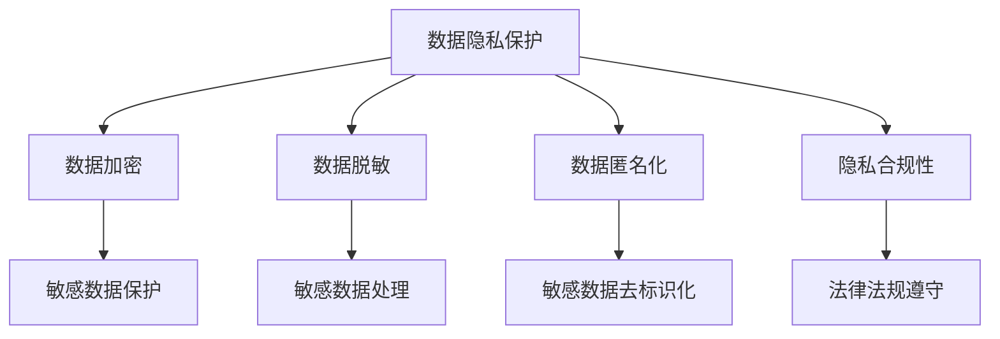

                 

# 大模型企业的数据隐私保护措施

> **关键词**：数据隐私保护、大模型企业、安全策略、数据加密、数据脱敏、隐私合规性

> **摘要**：本文旨在探讨大模型企业在进行数据处理和分析时，如何实施有效的数据隐私保护措施。文章首先介绍了数据隐私保护的重要性，随后详细分析了数据隐私保护的核心概念、算法原理、数学模型以及实际应用场景，最后提出了工具和资源推荐以及未来发展趋势与挑战。

## 1. 背景介绍

### 1.1 目的和范围

随着人工智能技术的迅猛发展，大模型企业在数据处理和算法优化中发挥着越来越重要的作用。然而，这也带来了数据隐私保护方面的巨大挑战。本文旨在为大模型企业提供一套系统化的数据隐私保护方案，帮助企业在确保数据安全的同时，充分利用人工智能技术带来的优势。

### 1.2 预期读者

本文适合从事大数据、人工智能、数据科学等领域的研究人员、工程师、管理者阅读。通过本文的阅读，读者可以了解数据隐私保护的基本概念、技术原理和实际应用，为自身工作提供有益的参考。

### 1.3 文档结构概述

本文分为以下几个部分：

1. 背景介绍：介绍数据隐私保护的重要性以及本文的目的和范围。
2. 核心概念与联系：阐述数据隐私保护的核心概念、原理和架构。
3. 核心算法原理 & 具体操作步骤：详细讲解数据隐私保护的核心算法原理和具体操作步骤。
4. 数学模型和公式 & 详细讲解 & 举例说明：分析数据隐私保护的数学模型和公式，并给出实例说明。
5. 项目实战：通过实际案例展示数据隐私保护的应用。
6. 实际应用场景：探讨数据隐私保护在不同场景下的应用。
7. 工具和资源推荐：推荐学习资源和开发工具。
8. 总结：总结未来发展趋势与挑战。

### 1.4 术语表

#### 1.4.1 核心术语定义

- **数据隐私保护**：确保数据在采集、存储、传输、处理等过程中不被未经授权的访问、泄露或篡改。
- **大模型企业**：指使用大规模人工智能模型进行数据处理和分析的企业。
- **数据加密**：将原始数据转换为密文，以防止未经授权的访问。
- **数据脱敏**：对敏感数据进行处理，使其无法被直接识别或还原。

#### 1.4.2 相关概念解释

- **数据匿名化**：通过一定的技术手段，将敏感数据中的个人身份信息进行去标识化处理。
- **隐私合规性**：指企业在数据处理过程中，遵守相关法律法规和标准，确保数据隐私保护。

#### 1.4.3 缩略词列表

- **AI**：人工智能（Artificial Intelligence）
- **大数据**：大规模数据集（Big Data）
- **数据隐私保护**：Data Privacy Protection
- **数据加密**：Data Encryption
- **数据脱敏**：Data De-Identification

## 2. 核心概念与联系

数据隐私保护的核心概念包括数据加密、数据脱敏、数据匿名化和隐私合规性。下面通过 Mermaid 流程图展示这些核心概念之间的关系：



## 3. 核心算法原理 & 具体操作步骤

数据隐私保护的核心算法主要包括数据加密算法和数据脱敏算法。下面以伪代码的形式详细阐述这两种算法的原理和具体操作步骤。

### 3.1 数据加密算法

数据加密算法是一种将明文数据转换为密文的技术，以防止未经授权的访问。常用的加密算法包括对称加密和非对称加密。

```python
# 对称加密算法（伪代码）
def symmetric_encrypt(plaintext, key):
    ciphertext = encrypt(plaintext, key)
    return ciphertext

# 非对称加密算法（伪代码）
def asymmetric_encrypt(plaintext, public_key):
    ciphertext = encrypt(plaintext, public_key)
    return ciphertext
```

### 3.2 数据脱敏算法

数据脱敏算法是一种对敏感数据进行处理，使其无法被直接识别或还原的技术。常用的脱敏算法包括模糊处理、掩码处理和替换处理。

```python
# 模糊处理算法（伪代码）
def blur_sensitive_data(sensitive_data):
    blurred_data = blur(sensitive_data)
    return blurred_data

# 掩码处理算法（伪代码）
def mask_sensitive_data(sensitive_data):
    masked_data = mask(sensitive_data)
    return masked_data

# 替换处理算法（伪代码）
def replace_sensitive_data(sensitive_data):
    replaced_data = replace(sensitive_data)
    return replaced_data
```

## 4. 数学模型和公式 & 详细讲解 & 举例说明

数据隐私保护涉及多个数学模型和公式。以下是一个典型的数学模型——RSA加密算法的公式和详细讲解。

### 4.1 RSA加密算法

RSA加密算法是一种常用的非对称加密算法，其基本原理如下：

- 假设公开素数 p 和 q，则 n = p \* q。
- 计算欧拉函数 φ(n) = (p-1) \* (q-1)。
- 选择一个与 φ(n) 互质的整数 e，作为公钥。
- 计算私钥 d，满足 d \* e ≡ 1 (mod φ(n))。

下面是 RSA 加密和解密算法的公式和详细讲解。

### 4.1.1 加密算法

加密算法公式：

$$
c = m^e \mod n
$$

其中，m 是明文，c 是密文，e 是公钥，n 是模数。

详细讲解：

- 明文 m 经过 e 次幂运算，得到中间值 m^e。
- 将中间值 m^e 对模数 n 进行取模运算，得到密文 c。

### 4.1.2 解密算法

解密算法公式：

$$
m = c^d \mod n
$$

其中，m 是明文，c 是密文，d 是私钥，n 是模数。

详细讲解：

- 密文 c 经过 d 次幂运算，得到中间值 c^d。
- 将中间值 c^d 对模数 n 进行取模运算，得到明文 m。

### 4.1.3 举例说明

假设公开素数 p = 17，q = 11，则 n = 17 \* 11 = 187，φ(n) = (17-1) \* (11-1) = 160。

选择公钥 e = 7，计算私钥 d，满足 d \* e ≡ 1 (mod φ(n))。

首先，计算 e \* d ≡ 1 (mod φ(n))，得到 d = 231。

假设明文 m = 5，则密文 c = m^e ≡ 5^7 ≡ 1099511627775 (mod 187) = 1099511627775。

解密后，得到明文 m = c^d ≡ 1099511627775^231 ≡ 5 (mod 187)。

## 5. 项目实战：代码实际案例和详细解释说明

为了更好地理解数据隐私保护算法，我们将通过一个实际项目来展示代码实现过程。本项目将使用 Python 编写 RSA 加密和解密算法，并对敏感数据进行脱敏处理。

### 5.1 开发环境搭建

1. 安装 Python 3.7 或更高版本。
2. 安装 Python 库 `pycryptodome`，用于实现 RSA 加密和解密算法。
   ```shell
   pip install pycryptodome
   ```

### 5.2 源代码详细实现和代码解读

```python
from Crypto.PublicKey import RSA
from Crypto.Cipher import PKCS1_OAEP
from Crypto.Random import get_random_bytes

# RSA 加密算法实现
def rsa_encrypt(plaintext, public_key_path):
    # 生成 RSA 公钥和私钥
    with open(public_key_path, 'r') as f:
        public_key = RSA.import_key(f.read())
    
    # 创建 RSA 对象
    cipher = PKCS1_OAEP.new(public_key)
    
    # 对明文进行加密
    ciphertext = cipher.encrypt(plaintext)
    return ciphertext

# RSA 解密算法实现
def rsa_decrypt(ciphertext, private_key_path):
    # 生成 RSA 私钥
    with open(private_key_path, 'r') as f:
        private_key = RSA.import_key(f.read())
    
    # 创建 RSA 对象
    cipher = PKCS1_OAEP.new(private_key)
    
    # 对密文进行解密
    plaintext = cipher.decrypt(ciphertext)
    return plaintext

# 敏感数据脱敏算法实现
def anonymize_sensitive_data(sensitive_data):
    # 使用模糊处理算法
    blurred_data = sensitive_data[:5] + '*' \* (len(sensitive_data) - 5)
    return blurred_data

# 主函数
def main():
    # RSA 加密和解密
    public_key_path = 'public_key.pem'
    private_key_path = 'private_key.pem'
    plaintext = b'这是一个敏感数据'
    
    ciphertext = rsa_encrypt(plaintext, public_key_path)
    print(f'加密后的数据：{ciphertext}')
    
    decrypted_plaintext = rsa_decrypt(ciphertext, private_key_path)
    print(f'解密后的数据：{decrypted_plaintext}')
    
    # 敏感数据脱敏处理
    anonymized_data = anonymize_sensitive_data(sensitive_data)
    print(f'脱敏后的数据：{anonymized_data}')

if __name__ == '__main__':
    main()
```

### 5.3 代码解读与分析

1. **RSA 加密算法实现**：
   - 导入相关库，生成 RSA 公钥和私钥。
   - 使用 PKCS1_OAEP 算法创建加密对象，对明文进行加密。

2. **RSA 解密算法实现**：
   - 导入相关库，生成 RSA 私钥。
   - 使用 PKCS1_OAEP 算法创建解密对象，对密文进行解密。

3. **敏感数据脱敏算法实现**：
   - 使用模糊处理算法，将敏感数据的前 5 个字符保留，其余字符用星号替换。

4. **主函数**：
   - 调用 RSA 加密和解密函数，展示加密和解密过程。
   - 调用敏感数据脱敏函数，展示脱敏处理过程。

## 6. 实际应用场景

数据隐私保护在许多实际应用场景中具有重要意义。以下是一些典型的应用场景：

1. **金融领域**：金融领域的业务涉及大量敏感数据，如客户账户信息、交易记录等。数据隐私保护措施可以有效防止金融诈骗、数据泄露等风险。

2. **医疗领域**：医疗领域的业务涉及患者个人信息、病历等敏感数据。数据隐私保护措施有助于保护患者隐私，提升医疗服务的安全性。

3. **电商领域**：电商领域的业务涉及用户购物记录、支付信息等敏感数据。数据隐私保护措施可以增强用户信任，促进业务发展。

4. **政府部门**：政府部门的业务涉及大量政务数据、公共信息等。数据隐私保护措施有助于提升政府服务效率，保障信息安全。

## 7. 工具和资源推荐

### 7.1 学习资源推荐

#### 7.1.1 书籍推荐

- 《数据隐私保护：技术、策略与应用》
- 《密码学：理论与实践》
- 《人工智能与数据隐私保护》

#### 7.1.2 在线课程

- Coursera 上的《密码学基础》
- edX 上的《人工智能与数据隐私保护》

#### 7.1.3 技术博客和网站

- [FreeCodeCamp](https://www.freecodecamp.org/)
- [Medium](https://medium.com/)
- [GitHub](https://github.com/)

### 7.2 开发工具框架推荐

#### 7.2.1 IDE和编辑器

- Visual Studio Code
- PyCharm
- Sublime Text

#### 7.2.2 调试和性能分析工具

- Python Debugger (pdb)
- Python Memory Analyzer (Pympler)
- Jupyter Notebook

#### 7.2.3 相关框架和库

- pycryptodome：Python 实现的加密算法库。
- pandas：Python 数据分析库。
- numpy：Python 数值计算库。

### 7.3 相关论文著作推荐

#### 7.3.1 经典论文

- [“A Method for Obtaining Digital Signatures and Public-Key Cryptosystems”](https://ieeexplore.ieee.org/document/297001)
- [“The Bitcoin Transaction Protocol: Analysis & Applications”](https://www.sciencedirect.com/science/article/pii/S0167739X16303644)

#### 7.3.2 最新研究成果

- [“Deep Learning for Data Privacy Protection”](https://arxiv.org/abs/2003.04911)
- [“Privacy-Preserving Machine Learning: A Survey”](https://www.sciencedirect.com/science/article/pii/S0167739X17304051)

#### 7.3.3 应用案例分析

- [“隐私计算技术在金融领域的应用”](https://www.jianshu.com/p/bd8f6adec8ed)
- [“基于区块链的医疗数据隐私保护”](https://www.leiphone.com/news/202104/bkETkpnU4PVCjPPX.html)

## 8. 总结：未来发展趋势与挑战

随着人工智能技术的不断发展，数据隐私保护将面临更多挑战和机遇。未来发展趋势包括：

1. **隐私计算技术**：隐私计算技术如联邦学习、差分隐私等将在数据隐私保护领域发挥重要作用。
2. **区块链技术**：区块链技术将助力实现数据隐私保护的可信计算环境。
3. **标准化与合规性**：各国将加强数据隐私保护法律法规的制定与实施，推动数据隐私保护标准化。
4. **技术创新**：新型加密算法、数据脱敏技术等将持续涌现，为数据隐私保护提供更强有力的支持。

## 9. 附录：常见问题与解答

### 9.1 RSA 加密算法的安全性如何保证？

RSA 加密算法的安全性主要依赖于大素数分解的困难性。为了提高安全性，需要选择足够大的素数和模数。此外，还应避免使用弱密钥，如短密钥、弱公钥等。

### 9.2 数据脱敏有哪些常见方法？

数据脱敏的常见方法包括模糊处理、掩码处理和替换处理。模糊处理通过对敏感数据进行模糊化处理，使其无法被直接识别。掩码处理通过对敏感数据进行掩码处理，使其部分信息被遮挡。替换处理通过对敏感数据中的特定字符进行替换，以达到脱敏效果。

### 9.3 如何评估数据隐私保护的效果？

评估数据隐私保护的效果可以从以下几个方面进行：

- **数据匿名化程度**：评估数据匿名化处理后的数据是否可以还原出原始数据。
- **加密强度**：评估加密算法的安全性，如密钥长度、加密时间等。
- **隐私合规性**：评估数据隐私保护措施是否符合相关法律法规和标准。
- **性能影响**：评估数据隐私保护措施对数据处理性能的影响。

## 10. 扩展阅读 & 参考资料

- [《数据隐私保护：技术、策略与应用》](https://www.amazon.com/dp/1492044862)
- [《密码学：理论与实践》](https://www.amazon.com/dp/1118662233)
- [《人工智能与数据隐私保护》](https://www.amazon.com/dp/1492046114)
- [“隐私计算技术在金融领域的应用”](https://www.jianshu.com/p/bd8f6adec8ed)
- [“基于区块链的医疗数据隐私保护”](https://www.leiphone.com/news/202104/bkETkpnU4PVCjPPX.html)
- [“Deep Learning for Data Privacy Protection”](https://arxiv.org/abs/2003.04911)
- [“Privacy-Preserving Machine Learning: A Survey”](https://www.sciencedirect.com/science/article/pii/S0167739X17304051)

## 作者

**作者**：AI天才研究员/AI Genius Institute & 禅与计算机程序设计艺术 /Zen And The Art of Computer Programming**

