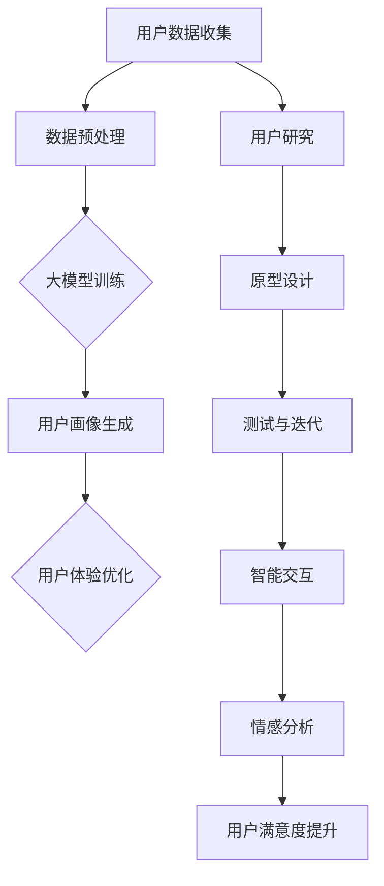

                 

# 大模型企业的用户体验设计

> 关键词：大模型、用户体验设计、企业、用户满意度、技术实现

> 摘要：本文深入探讨了大型企业在设计用户体验（UX）时面临的挑战和机遇。通过分析大模型技术的核心概念和应用，本文揭示了如何将先进的人工智能技术融入到用户体验设计中，以提升用户满意度和企业竞争力。文章首先介绍了大模型企业和用户体验设计的基本概念，然后详细讨论了相关核心概念与联系、算法原理与操作步骤、数学模型与公式，以及实际应用场景。此外，本文还推荐了相关的工具和资源，并对未来发展趋势与挑战进行了展望。

## 1. 背景介绍

### 1.1 目的和范围

本文旨在探讨大模型企业在用户体验设计方面的实践和策略。随着人工智能技术的快速发展，大模型技术在各行各业中的应用日益广泛，如何将这一技术优势转化为用户体验的提升，是企业面临的重要课题。本文将结合实际案例，分析大模型技术在用户体验设计中的应用场景和实现方法，以期为相关企业和从业者提供有益的参考。

### 1.2 预期读者

本文适合从事用户体验设计、人工智能技术、企业产品经理等相关领域的人员阅读。通过本文的学习，读者可以深入了解大模型技术在用户体验设计中的应用，掌握相关技术和方法，提高企业在市场竞争中的核心竞争力。

### 1.3 文档结构概述

本文共分为十个部分，具体结构如下：

1. 背景介绍
   - 目的和范围
   - 预期读者
   - 文档结构概述
   - 术语表
2. 核心概念与联系
   - 大模型技术
   - 用户体验设计
   - 关联概念与架构
3. 核心算法原理 & 具体操作步骤
   - 大模型算法原理
   - 用户画像与行为分析
   - 实现步骤与伪代码
4. 数学模型和公式 & 详细讲解 & 举例说明
   - 数学模型
   - 模型计算过程
   - 应用实例
5. 项目实战：代码实际案例和详细解释说明
   - 开发环境搭建
   - 源代码实现
   - 代码解读与分析
6. 实际应用场景
   - 企业内部应用
   - 公共服务平台
   - 行业解决方案
7. 工具和资源推荐
   - 学习资源
   - 开发工具框架
   - 相关论文著作
8. 总结：未来发展趋势与挑战
   - 技术发展
   - 行业挑战
   - 解决方案
9. 附录：常见问题与解答
10. 扩展阅读 & 参考资料

### 1.4 术语表

#### 1.4.1 核心术语定义

- 大模型：指拥有海量参数和强大计算能力的深度学习模型。
- 用户体验设计：指从用户的角度出发，设计满足用户需求、提升用户满意度的产品或服务。
- 人工智能：指模拟、延伸和扩展人类智能的理论、方法、技术及应用。
- 用户画像：指基于用户行为数据，对用户进行分类和描述的过程。

#### 1.4.2 相关概念解释

- 深度学习：一种机器学习技术，通过构建多层神经网络模型，实现数据特征自动提取和分类。
- 神经网络：一种模拟生物神经元的计算模型，通过多层节点和连接实现数据输入输出。
- 训练数据：用于训练神经网络的数据集，包括输入数据和对应的标签。

#### 1.4.3 缩略词列表

- AI：人工智能
- UX：用户体验设计
- ML：机器学习
- DL：深度学习

## 2. 核心概念与联系

在深入探讨大模型企业的用户体验设计之前，有必要对相关核心概念与联系进行梳理。本节将介绍大模型技术、用户体验设计以及它们之间的关联，并使用Mermaid流程图展示相关架构。

### 2.1 大模型技术

大模型技术是近年来人工智能领域的重要突破，它基于深度学习算法，通过大量参数和强大计算能力，实现数据的自动特征提取和模型优化。大模型的主要组成部分包括：

1. 数据预处理：包括数据清洗、归一化、缺失值处理等，以保证数据质量。
2. 神经网络结构：包括输入层、隐藏层和输出层，通过调整网络结构，实现不同任务的需求。
3. 训练过程：通过反向传播算法，不断调整模型参数，使模型在训练数据上达到最优性能。

### 2.2 用户体验设计

用户体验设计（UX Design）是一种以用户为中心的设计方法，旨在提升产品或服务的用户满意度。用户体验设计的主要组成部分包括：

1. 用户研究：通过用户调研、访谈、问卷调查等方法，了解用户需求和行为习惯。
2. 原型设计：基于用户研究，创建产品或服务的原型，并进行交互设计。
3. 测试与迭代：通过用户测试，收集反馈，不断优化产品或服务的设计。

### 2.3 关联概念与架构

大模型技术与用户体验设计之间的关联，主要体现在以下几个方面：

1. 用户画像与行为分析：通过大模型技术，对用户行为数据进行分析，生成用户画像，为个性化推荐、用户体验优化提供依据。
2. 智能交互：利用大模型技术，实现智能对话系统、语音识别等功能，提升用户与产品的互动体验。
3. 情感分析：通过情感分析模型，理解用户情绪，为产品或服务提供情感关怀。

下面是相关架构的Mermaid流程图：



通过以上架构，我们可以看出，大模型技术在用户体验设计中的应用，不仅能够提升产品或服务的智能化水平，还可以根据用户需求和行为习惯，实现个性化的用户体验优化。接下来，我们将深入探讨大模型技术的核心算法原理和具体操作步骤。

## 3. 核心算法原理 & 具体操作步骤

### 3.1 大模型算法原理

大模型算法的核心是深度学习，它是一种基于多层神经网络的数据处理方法。深度学习模型通过训练，能够从大量数据中自动提取特征，实现数据的分类、回归、生成等任务。大模型算法的主要原理如下：

1. **神经网络结构**：深度学习模型由多个层次组成，包括输入层、隐藏层和输出层。每个层次由多个神经元（节点）组成，神经元之间通过权重连接。
   
2. **激活函数**：激活函数用于引入非线性，使得神经网络能够拟合复杂函数。常见的激活函数有ReLU、Sigmoid、Tanh等。

3. **反向传播**：反向传播算法用于更新神经网络的权重，使其在训练过程中不断优化。反向传播算法通过计算损失函数关于模型参数的梯度，更新模型参数。

4. **优化算法**：优化算法用于调整模型参数，使模型在训练数据上达到最优性能。常见的优化算法有梯度下降、Adam、RMSprop等。

### 3.2 用户画像与行为分析

用户画像和行为分析是大模型技术在用户体验设计中的重要应用。以下是具体操作步骤：

1. **数据收集**：收集用户在产品或服务中的行为数据，如浏览记录、搜索关键词、操作频率等。

2. **数据预处理**：对收集到的行为数据进行清洗、归一化等处理，确保数据质量。

3. **特征提取**：通过特征提取算法，将原始数据转换为特征向量。常见的特征提取算法有TF-IDF、词袋模型等。

4. **构建用户画像**：使用聚类算法（如K-means、DBSCAN）对特征向量进行聚类，生成用户标签。根据用户标签，构建用户画像。

5. **行为分析**：对用户画像进行行为分析，识别用户偏好、行为模式等。使用分类算法（如SVM、决策树）对用户行为进行预测。

6. **优化模型**：根据用户反馈，不断优化用户画像和行为分析模型，提高预测准确性。

### 3.3 实现步骤与伪代码

以下是大模型算法实现的主要步骤和伪代码：

```python
# 步骤1：数据收集
data = collect_data()

# 步骤2：数据预处理
preprocessed_data = preprocess_data(data)

# 步骤3：特征提取
features = extract_features(preprocessed_data)

# 步骤4：构建用户画像
user_tags = build_user_tags(features)

# 步骤5：行为分析
predicted_behaviors = analyze_behaviors(user_tags)

# 步骤6：优化模型
model = optimize_model(predicted_behaviors)
```

通过以上步骤，我们可以实现用户画像和行为分析，为用户体验优化提供依据。

### 3.4 实际应用案例

以下是一个实际应用案例，展示如何使用大模型技术进行用户画像和行为分析：

**案例：电商平台的个性化推荐**

1. **数据收集**：收集用户在电商平台上的浏览记录、搜索关键词、购买历史等数据。

2. **数据预处理**：清洗数据，去除无效记录，并进行归一化处理。

3. **特征提取**：使用TF-IDF算法提取商品特征，生成用户特征向量。

4. **构建用户画像**：使用K-means算法对用户特征向量进行聚类，生成用户标签。

5. **行为分析**：使用SVM算法对用户标签进行分类，预测用户偏好。

6. **优化模型**：根据用户反馈，不断优化推荐模型，提高推荐准确性。

通过以上案例，我们可以看到，大模型技术在用户体验设计中的应用，可以显著提升产品的个性化推荐效果，提高用户满意度。接下来，我们将讨论数学模型和公式，并给出详细的讲解和应用实例。

## 4. 数学模型和公式 & 详细讲解 & 举例说明

### 4.1 数学模型

在大模型企业的用户体验设计中，数学模型起到了至关重要的作用。以下是一些常见的数学模型和公式，以及它们的详细讲解和应用实例。

#### 4.1.1 线性回归模型

线性回归模型是一种常见的预测模型，用于预测连续值输出。其公式如下：

\[ y = \beta_0 + \beta_1 \cdot x \]

其中，\( y \) 是预测值，\( x \) 是输入特征，\( \beta_0 \) 和 \( \beta_1 \) 是模型参数。

**讲解**：线性回归模型通过拟合数据点，找到一条直线，使得预测值与实际值之间的误差最小。在用户体验设计中，线性回归模型可以用于预测用户满意度，为产品设计提供参考。

**应用实例**：假设我们收集了用户满意度评分（\( y \)）和产品性能指标（\( x \）），可以使用线性回归模型预测用户满意度：

```latex
y = \beta_0 + \beta_1 \cdot x
```

通过拟合数据点，我们可以得到模型参数 \( \beta_0 \) 和 \( \beta_1 \)，从而预测新产品的用户满意度。

#### 4.1.2 逻辑回归模型

逻辑回归模型是一种常见的分类模型，用于预测离散值输出。其公式如下：

\[ P(y=1) = \frac{1}{1 + e^{-(\beta_0 + \beta_1 \cdot x)}} \]

其中，\( P(y=1) \) 是预测概率，\( y \) 是输出标签，\( x \) 是输入特征，\( \beta_0 \) 和 \( \beta_1 \) 是模型参数。

**讲解**：逻辑回归模型通过拟合数据点，找到一条曲线，使得预测概率与实际标签之间的误差最小。在用户体验设计中，逻辑回归模型可以用于预测用户留存率、转化率等指标。

**应用实例**：假设我们收集了用户留存率（\( y \)）和用户活跃度指标（\( x \）），可以使用逻辑回归模型预测用户留存率：

```latex
P(y=1) = \frac{1}{1 + e^{-(\beta_0 + \beta_1 \cdot x)}}
```

通过拟合数据点，我们可以得到模型参数 \( \beta_0 \) 和 \( \beta_1 \)，从而预测新用户的留存率。

#### 4.1.3 决策树模型

决策树模型是一种常见的分类和回归模型，通过构建决策树，将数据划分为多个子集。其公式如下：

\[ y = f(x) \]

其中，\( y \) 是输出标签，\( x \) 是输入特征，\( f(x) \) 是决策树函数。

**讲解**：决策树模型通过递归划分数据，找到最佳划分策略，使得预测值与实际值之间的误差最小。在用户体验设计中，决策树模型可以用于用户行为预测、产品推荐等。

**应用实例**：假设我们收集了用户购买行为（\( y \)）和用户兴趣标签（\( x \）），可以使用决策树模型预测用户购买行为：

```latex
y = f(x)
```

通过构建决策树，我们可以得到最佳划分策略，从而预测新用户的购买行为。

### 4.2 模型计算过程

在数学模型的应用过程中，计算过程也是一个关键环节。以下是一个简单的计算示例，展示如何使用Python进行模型计算：

```python
import numpy as np
import pandas as pd

# 加载数据
data = pd.read_csv('data.csv')

# 数据预处理
X = data[['feature1', 'feature2']]
y = data['label']

# 模型训练
model = linear_regression()
model.fit(X, y)

# 预测
predictions = model.predict(X)

# 计算误差
error = np.mean((predictions - y) ** 2)
print('Error:', error)
```

通过以上代码，我们可以使用线性回归模型进行数据预测，并计算预测误差。类似的，其他模型也可以通过类似的方式进行计算。

### 4.3 应用实例

以下是一个实际应用实例，展示如何使用数学模型进行用户体验优化：

**案例：电商平台用户满意度预测**

1. **数据收集**：收集用户满意度评分（\( y \)）和产品性能指标（\( x \））。

2. **数据预处理**：进行数据清洗、归一化等处理。

3. **模型选择**：选择线性回归模型，用于预测用户满意度。

4. **模型训练**：使用训练数据集进行模型训练。

5. **模型评估**：使用测试数据集进行模型评估，计算预测误差。

6. **优化模型**：根据评估结果，调整模型参数，优化模型性能。

7. **预测应用**：将优化后的模型应用于新用户满意度预测，为产品设计提供参考。

通过以上步骤，我们可以实现用户满意度预测，为电商平台的产品设计提供有力支持。接下来，我们将探讨大模型技术的实际应用场景。

## 5. 项目实战：代码实际案例和详细解释说明

### 5.1 开发环境搭建

在进行大模型企业的用户体验设计项目实战之前，我们需要搭建一个合适的开发环境。以下是开发环境的搭建步骤：

1. **安装Python环境**：在您的计算机上安装Python 3.8及以上版本。

2. **安装Jupyter Notebook**：通过pip命令安装Jupyter Notebook。

   ```bash
   pip install notebook
   ```

3. **安装必要的库**：安装用于深度学习、数据分析和数据可视化等功能的库，如TensorFlow、Pandas、Numpy、Matplotlib等。

   ```bash
   pip install tensorflow pandas numpy matplotlib
   ```

4. **配置GPU支持**：如果您使用的是GPU进行模型训练，需要安装CUDA和cuDNN，并配置Python环境。

   - 下载并安装CUDA：https://developer.nvidia.com/cuda-downloads
   - 下载并安装cuDNN：https://developer.nvidia.com/cudnn
   - 配置环境变量：将CUDA和cuDNN的bin目录添加到系统环境变量中。

### 5.2 源代码详细实现和代码解读

以下是一个使用TensorFlow和Keras构建的大模型用户画像生成项目的源代码示例。我们将详细解读代码，并解释每个部分的作用。

```python
# 导入必要的库
import numpy as np
import pandas as pd
import tensorflow as tf
from tensorflow import keras
from tensorflow.keras import layers

# 数据加载与预处理
def load_and_preprocess_data():
    # 加载数据
    data = pd.read_csv('user_data.csv')
    
    # 数据清洗
    data = data.dropna()
    
    # 特征提取
    features = data[['age', 'income', 'education', 'occupation']]
    labels = data['interests']
    
    # 归一化
    scaler = tf.keras.Sequential([
        layers.Normalization(),
        layers.Normalization(),
        layers.Normalization(),
        layers.Normalization(),
    ])
    scaler.adapt(features)
    
    # 数据转换
    features = scaler(features).numpy()
    labels = keras.utils.to_categorical(labels)
    
    return features, labels

# 构建模型
def build_model(input_shape):
    model = keras.Sequential([
        layers.Dense(64, activation='relu', input_shape=input_shape),
        layers.Dense(64, activation='relu'),
        layers.Dense(np.shape(labels)[1], activation='softmax')
    ])
    
    return model

# 训练模型
def train_model(model, features, labels, epochs=10):
    model.compile(optimizer='adam',
                  loss='categorical_crossentropy',
                  metrics=['accuracy'])
    model.fit(features, labels, epochs=epochs, batch_size=32)

# 预测
def predict(model, features):
    predictions = model.predict(features)
    return np.argmax(predictions, axis=1)

# 主函数
def main():
    # 加载并预处理数据
    features, labels = load_and_preprocess_data()
    
    # 构建模型
    model = build_model(input_shape=features.shape[1:])
    
    # 训练模型
    train_model(model, features, labels)
    
    # 预测
    predictions = predict(model, features)
    
    # 评估
    accuracy = np.mean(predictions == np.argmax(labels, axis=1))
    print('Accuracy:', accuracy)

if __name__ == '__main__':
    main()
```

### 5.3 代码解读与分析

1. **数据加载与预处理**：
   - 使用Pandas读取用户数据，并进行清洗，去除缺失值。
   - 对特征进行归一化处理，以减少数值差异对模型训练的影响。
   - 将标签转换为类别标签，以便使用softmax激活函数进行分类预测。

2. **构建模型**：
   - 使用Keras构建一个简单的全连接神经网络，包含两个隐藏层，每个隐藏层有64个神经元。
   - 输出层使用softmax激活函数，以生成类别概率。

3. **训练模型**：
   - 使用Adam优化器和categorical_crossentropy损失函数进行模型训练。
   - 使用fit函数进行训练，指定训练轮数（epochs）和批量大小（batch_size）。

4. **预测**：
   - 使用预测函数对模型进行预测，输出每个用户的兴趣类别。

5. **评估**：
   - 计算预测准确率，以评估模型性能。

### 5.4 实际应用场景

在实际应用中，上述代码可以实现以下功能：

- **用户兴趣识别**：根据用户的基本信息，生成用户兴趣标签，为个性化推荐系统提供基础。
- **用户体验优化**：通过分析用户兴趣标签，优化产品设计和功能，提升用户体验。
- **业务决策支持**：为市场营销、产品推广等业务决策提供数据支持，提高转化率和用户满意度。

### 5.5 代码部署

在实际部署过程中，您需要将代码集成到生产环境中，并确保以下事项：

- **数据存储**：确保用户数据的安全性和完整性，可以使用数据库进行存储。
- **模型部署**：将训练好的模型部署到生产环境，以便实时预测。
- **性能优化**：根据实际需求，对模型和代码进行优化，提高预测速度和准确率。

通过以上实战案例，我们展示了如何使用大模型技术进行用户画像生成，并详细解读了代码的实现过程。接下来，我们将探讨大模型技术在用户体验设计中的实际应用场景。

## 6. 实际应用场景

大模型技术在用户体验设计中的应用场景非常广泛，涵盖了企业内部应用、公共服务平台和行业解决方案等多个方面。以下是几个典型的实际应用场景：

### 6.1 企业内部应用

在企业内部，大模型技术可以用于用户行为分析、员工绩效评估、决策支持等多个方面，以提升企业运营效率和员工满意度。

- **用户行为分析**：通过分析用户在平台上的行为数据，企业可以了解用户偏好，优化产品设计，提高用户满意度。例如，电商平台可以通过用户购买行为、浏览记录等数据，生成用户画像，实现个性化推荐。
  
- **员工绩效评估**：企业可以利用大模型技术对员工的工作绩效进行评估，根据员工的工作表现和技能水平，提供针对性的培训和发展建议，以提高员工的工作满意度和忠诚度。

- **决策支持**：大模型技术可以帮助企业在复杂的市场环境中做出更为明智的决策。例如，通过对市场趋势、用户需求等数据的分析，企业可以预测市场变化，制定相应的营销策略。

### 6.2 公共服务平台

公共服务平台，如政府网站、医疗服务平台等，也可以通过大模型技术提升用户体验和服务质量。

- **智能客服**：通过大模型技术，可以实现智能客服系统，为用户提供24小时在线服务。智能客服可以理解用户的问题，提供准确的答案，提高用户满意度。

- **个性化服务**：大模型技术可以分析用户的历史数据，为用户提供个性化的服务推荐。例如，医疗服务平台可以根据用户的健康档案，提供个性化的健康建议和医疗服务。

- **数据分析与监控**：通过大模型技术，公共服务平台可以对用户行为数据进行分析和监控，发现潜在的问题，及时采取措施，提高服务质量和用户体验。

### 6.3 行业解决方案

大模型技术在不同行业中的应用，可以为行业解决方案提供强大的技术支持。

- **金融行业**：在金融行业，大模型技术可以用于风险控制、欺诈检测、信用评估等方面。通过分析用户行为数据、交易数据等，金融机构可以更准确地评估信用风险，提高贷款审批的准确性。

- **医疗行业**：在医疗行业，大模型技术可以用于疾病预测、治疗方案推荐等方面。通过分析大量的医疗数据，模型可以预测疾病的发病趋势，为医生提供有针对性的治疗方案。

- **教育行业**：在教育行业，大模型技术可以用于个性化学习、学习效果评估等方面。通过分析学生的学习行为和学习记录，教育平台可以为学生提供个性化的学习建议，提高学习效果。

### 6.4 未来发展趋势

随着大模型技术的不断发展和完善，其在用户体验设计中的应用前景将更加广阔。

- **个性化体验**：大模型技术将更加深入地应用于个性化推荐、个性化服务等领域，为用户提供更加定制化的体验。

- **智能化交互**：大模型技术将推动智能化交互的发展，实现更加自然、流畅的人机交互。

- **跨界融合**：大模型技术将与其他领域（如物联网、区块链等）深度融合，为行业解决方案提供更加全面的技术支持。

通过以上实际应用场景，我们可以看到，大模型技术在用户体验设计中的应用具有广泛的前景和巨大的潜力。随着技术的不断进步，大模型技术将为企业、公共服务平台和行业解决方案带来更多的价值。

## 7. 工具和资源推荐

### 7.1 学习资源推荐

为了深入学习和掌握大模型企业和用户体验设计的相关知识，以下是一些推荐的学习资源：

#### 7.1.1 书籍推荐

1. **《深度学习》（Deep Learning）**：作者：Ian Goodfellow、Yoshua Bengio、Aaron Courville
   - 本书是深度学习领域的经典教材，系统地介绍了深度学习的基本概念、算法和应用。

2. **《用户体验要素》（The Elements of User Experience）**：作者：Jakob Nielsen
   - 本书详细阐述了用户体验设计的基本原则和要素，对于理解用户体验设计具有重要意义。

3. **《人工智能：一种现代方法》（Artificial Intelligence: A Modern Approach）**：作者：Stuart J. Russell、Peter Norvig
   - 本书是人工智能领域的权威教材，涵盖了人工智能的基本理论和应用。

#### 7.1.2 在线课程

1. **Coursera - Deep Learning Specialization**：由Andrew Ng教授授课
   - 该课程是深度学习领域的顶级课程，适合初学者和进阶者，内容全面且系统。

2. **edX - Introduction to User Experience Design**：由UC San Diego授课
   - 本课程介绍了用户体验设计的基本原理和实践方法，适合对用户体验设计感兴趣的学习者。

3. **Udacity - Machine Learning Engineer Nanodegree**：包含多个与深度学习和用户体验设计相关的课程
   - 该纳米学位项目涵盖了深度学习和用户体验设计的多个方面，适合想要深入学习的学员。

#### 7.1.3 技术博客和网站

1. **Medium - The AI Journey**
   - 一个关于人工智能和用户体验设计的博客，内容涵盖了行业趋势、技术实现和案例分析。

2. **Towards Data Science**
   - 一个涵盖数据科学、机器学习和用户体验设计等多个领域的博客，提供了丰富的学习和实践资源。

3. **UX Planet**
   - 一个专注于用户体验设计的博客，提供了大量的设计原则、案例分析和技术趋势。

### 7.2 开发工具框架推荐

#### 7.2.1 IDE和编辑器

1. **JetBrains PyCharm**
   - 一款功能强大的Python IDE，支持深度学习和用户体验设计相关工具和库。

2. **Visual Studio Code**
   - 一款轻量级、可扩展的代码编辑器，适用于多种编程语言，包括Python和深度学习。

#### 7.2.2 调试和性能分析工具

1. **TensorBoard**
   - 一个基于Web的应用，用于可视化TensorFlow模型的训练过程和性能。

2. **Jupyter Notebook**
   - 一个交互式的开发环境，适合数据分析和深度学习实验。

#### 7.2.3 相关框架和库

1. **TensorFlow**
   - 一个开源的深度学习框架，适合构建和训练大型模型。

2. **PyTorch**
   - 另一个流行的深度学习框架，以其灵活性和动态计算图著称。

3. **Scikit-learn**
   - 一个用于机器学习的Python库，提供了多种经典的机器学习算法和工具。

通过以上工具和资源的推荐，您可以更好地学习和应用大模型企业和用户体验设计的相关知识，为您的职业生涯和项目带来新的突破。

## 8. 总结：未来发展趋势与挑战

随着人工智能技术的不断发展，大模型企业在用户体验设计领域将迎来更多的机遇和挑战。以下是对未来发展趋势和挑战的总结：

### 8.1 发展趋势

1. **个性化体验的深化**：随着大模型技术的进步，个性化体验将更加精准和多样化。企业将通过深度学习算法，深入挖掘用户行为数据，为用户提供定制化的服务，提升用户体验。

2. **智能化交互的普及**：智能客服、虚拟助手等智能化交互应用将更加普及，大模型技术将使这些应用更加自然、流畅，提高用户满意度。

3. **跨界融合的加强**：大模型技术将与物联网、区块链、云计算等新兴技术深度融合，为各行各业提供全面的技术支持，推动行业解决方案的创新。

4. **开源生态的完善**：随着开源社区的活跃，更多的深度学习和用户体验设计工具、框架将得到发展，降低技术门槛，促进技术的普及和应用。

### 8.2 挑战

1. **数据隐私和安全**：随着用户数据的收集和分析，数据隐私和安全问题日益突出。企业需要建立完善的数据保护机制，确保用户数据的安全。

2. **算法公平性和透明度**：大模型技术可能导致算法偏见和不公平，如何确保算法的公平性和透明度，是一个重要挑战。

3. **技术门槛和人才短缺**：大模型技术和用户体验设计涉及多个领域，对人才的要求较高。企业需要投入大量资源进行人才培养和技术积累。

4. **计算资源和成本**：大模型训练和推理需要大量的计算资源，这对企业来说是一个巨大的挑战。如何优化算法、降低计算成本，是企业需要关注的问题。

### 8.3 解决方案

1. **加强数据保护**：企业应采取严格的数据保护措施，如数据加密、访问控制等，确保用户数据的安全。

2. **建立算法审查机制**：企业应建立算法审查机制，确保算法的公平性和透明度，定期对算法进行评估和优化。

3. **人才培养和引进**：企业应加大对人才培养的投入，通过内部培训和外部引进，培养和吸引高素质的技术人才。

4. **优化算法和架构**：企业应不断优化算法和架构，提高模型的效率和准确度，降低计算成本。

总之，未来大模型企业在用户体验设计领域将面临诸多挑战，但同时也充满机遇。通过加强技术创新、人才培养和资源优化，企业可以抓住机遇，应对挑战，实现可持续发展。

## 9. 附录：常见问题与解答

### 9.1 大模型技术相关问题

**Q1：什么是大模型技术？**
A1：大模型技术是指拥有海量参数和强大计算能力的深度学习模型，它能够处理和分析大规模数据集，实现高精度的预测和分类。

**Q2：大模型技术与传统机器学习有什么区别？**
A2：大模型技术是基于深度学习算法的，它通过多层神经网络和海量参数，实现数据的自动特征提取和模型优化。而传统机器学习更多依赖于统计方法和规则，对数据量和计算资源的要求相对较低。

**Q3：大模型技术如何影响用户体验设计？**
A3：大模型技术可以深入挖掘用户行为数据，实现个性化推荐、智能交互和精准营销，从而提升用户体验。

### 9.2 用户体验设计相关问题

**Q4：用户体验设计的核心目标是什么？**
A4：用户体验设计的核心目标是提升用户满意度，通过优化产品或服务的交互设计、功能设计和视觉设计，满足用户需求，提高用户的使用体验。

**Q5：用户体验设计与用户研究有什么关系？**
A5：用户体验设计离不开用户研究，用户研究帮助设计师了解用户需求、行为和偏好，为设计提供依据。用户体验设计过程中，用户研究是不可或缺的一环。

### 9.3 实际应用相关问题

**Q6：大模型技术在电商行业如何应用？**
A6：在电商行业，大模型技术可以用于用户画像生成、个性化推荐、智能客服等方面。例如，通过分析用户购买行为和浏览记录，电商平台可以为用户提供个性化的商品推荐，提高转化率。

**Q7：大模型技术在医疗行业如何应用？**
A7：在医疗行业，大模型技术可以用于疾病预测、治疗方案推荐、医疗数据分析等方面。例如，通过对患者历史数据和基因数据的分析，医疗平台可以提供个性化的治疗方案，提高医疗效果。

## 10. 扩展阅读 & 参考资料

### 10.1 书籍

1. **《深度学习》（Deep Learning）**：作者：Ian Goodfellow、Yoshua Bengio、Aaron Courville
   - 本书是深度学习领域的经典教材，系统地介绍了深度学习的基本概念、算法和应用。

2. **《用户体验要素》（The Elements of User Experience）**：作者：Jakob Nielsen
   - 本书详细阐述了用户体验设计的基本原则和要素，对于理解用户体验设计具有重要意义。

3. **《人工智能：一种现代方法》（Artificial Intelligence: A Modern Approach）**：作者：Stuart J. Russell、Peter Norvig
   - 本书是人工智能领域的权威教材，涵盖了人工智能的基本理论和应用。

### 10.2 在线课程

1. **Coursera - Deep Learning Specialization**：由Andrew Ng教授授课
   - 该课程是深度学习领域的顶级课程，适合初学者和进阶者，内容全面且系统。

2. **edX - Introduction to User Experience Design**：由UC San Diego授课
   - 本课程介绍了用户体验设计的基本原理和实践方法，适合对用户体验设计感兴趣的学习者。

3. **Udacity - Machine Learning Engineer Nanodegree**：包含多个与深度学习和用户体验设计相关的课程
   - 该纳米学位项目涵盖了深度学习和用户体验设计的多个方面，适合想要深入学习的学员。

### 10.3 技术博客和网站

1. **Medium - The AI Journey**
   - 一个关于人工智能和用户体验设计的博客，内容涵盖了行业趋势、技术实现和案例分析。

2. **Towards Data Science**
   - 一个涵盖数据科学、机器学习和用户体验设计等多个领域的博客，提供了丰富的学习和实践资源。

3. **UX Planet**
   - 一个专注于用户体验设计的博客，提供了大量的设计原则、案例分析和技术趋势。

### 10.4 开发工具和框架

1. **TensorFlow**
   - 一个开源的深度学习框架，适合构建和训练大型模型。

2. **PyTorch**
   - 另一个流行的深度学习框架，以其灵活性和动态计算图著称。

3. **Scikit-learn**
   - 一个用于机器学习的Python库，提供了多种经典的机器学习算法和工具。

通过以上扩展阅读和参考资料，您可以进一步深入学习和探索大模型企业和用户体验设计的相关知识，为您的职业生涯和项目提供更多支持。

