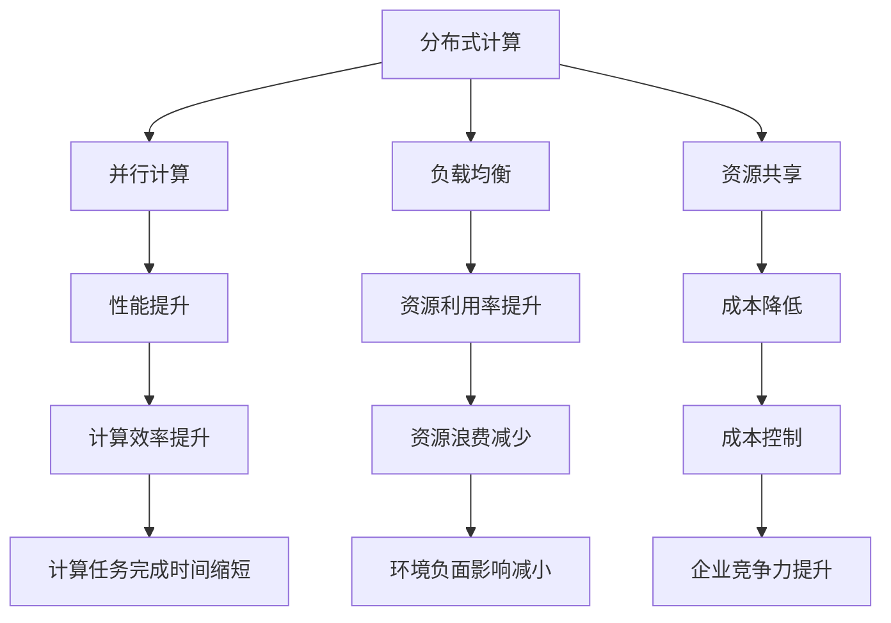

                 

# 大模型企业的算力资源优化策略

> **关键词：** 大模型企业、算力资源、优化策略、性能提升、成本控制

> **摘要：** 本文将探讨大模型企业在算力资源优化方面的策略，包括核心概念与联系、核心算法原理、数学模型与公式、项目实战、实际应用场景以及未来发展趋势与挑战。通过详细的讲解和分析，为读者提供切实可行的优化方案，以提升大模型的计算效率和降低成本。

## 1. 背景介绍

### 1.1 目的和范围

本文旨在为从事大模型研究和应用的企业提供一套系统性的算力资源优化策略。这些策略将有助于提升计算效率、降低成本，并确保企业在激烈的市场竞争中保持优势。本文将涵盖以下内容：

1. 核心概念与联系：阐述大模型企业所需的算力资源以及它们之间的相互作用。
2. 核心算法原理与具体操作步骤：介绍优化算力资源的算法原理，并提供伪代码阐述。
3. 数学模型与公式：详细讲解数学模型及其在优化策略中的应用。
4. 项目实战：通过代码实际案例，展示优化策略在项目中的应用。
5. 实际应用场景：分析大模型企业在不同场景下的算力资源优化需求。
6. 未来发展趋势与挑战：探讨大模型企业在算力资源优化方面的未来方向和面临的挑战。

### 1.2 预期读者

本文的预期读者主要包括：

1. 大模型研究人员和开发者：希望提升自身在大模型算力资源优化方面的专业能力。
2. IT企业决策者和项目经理：关注企业算力资源优化，寻求降低成本、提高效率的解决方案。
3. 技术爱好者：对大模型和算力资源优化领域有兴趣，希望深入了解相关技术。

### 1.3 文档结构概述

本文的结构如下：

1. 背景介绍：介绍文章的目的、范围、预期读者和文档结构。
2. 核心概念与联系：阐述大模型企业所需的算力资源及其相互作用。
3. 核心算法原理与具体操作步骤：介绍优化算力资源的算法原理和操作步骤。
4. 数学模型与公式：详细讲解数学模型及其在优化策略中的应用。
5. 项目实战：通过代码实际案例，展示优化策略在项目中的应用。
6. 实际应用场景：分析大模型企业在不同场景下的算力资源优化需求。
7. 未来发展趋势与挑战：探讨大模型企业在算力资源优化方面的未来方向和挑战。
8. 工具和资源推荐：推荐相关学习资源、开发工具和框架。
9. 总结：对全文内容进行总结，展望未来发展趋势。
10. 附录：常见问题与解答。
11. 扩展阅读 & 参考资料：提供更多相关阅读材料和资源。

### 1.4 术语表

为了确保文章的可读性和准确性，本文将使用以下术语：

#### 1.4.1 核心术语定义

- **大模型企业**：从事大规模人工智能模型研发和应用的企业。
- **算力资源**：用于计算任务的各种硬件资源，包括CPU、GPU、存储和网络等。
- **优化策略**：为提升计算效率和降低成本而采取的一系列措施。
- **性能提升**：指通过优化策略提高计算任务的执行速度和效率。
- **成本控制**：在预算范围内有效管理和控制成本。

#### 1.4.2 相关概念解释

- **分布式计算**：将计算任务分布在多个节点上执行，以提升计算效率。
- **并行计算**：在同一时间内执行多个计算任务，以加速计算过程。
- **负载均衡**：在多个计算节点之间分配计算任务，以避免资源过载。
- **资源共享**：在多个计算任务之间共享有限的计算资源，以提升资源利用率。

#### 1.4.3 缩略词列表

- **GPU**：图形处理单元（Graphics Processing Unit）
- **CPU**：中央处理单元（Central Processing Unit）
- **HPC**：高性能计算（High-Performance Computing）
- **AI**：人工智能（Artificial Intelligence）
- **DL**：深度学习（Deep Learning）
- **GPU-CPU**：GPU和CPU的组合使用

## 2. 核心概念与联系

在探讨大模型企业的算力资源优化策略之前，我们需要了解核心概念与联系，以便更好地理解优化策略的应用场景和原理。

### 2.1 大模型企业面临的挑战

随着人工智能技术的快速发展，大模型企业在数据处理、分析和预测等方面具有巨大潜力。然而，这背后也带来了巨大的算力资源挑战：

1. **计算需求增长**：随着模型复杂度和数据规模的增加，计算需求呈现指数级增长。
2. **硬件资源有限**：硬件资源如CPU、GPU等具有成本高昂、数量有限等限制。
3. **能耗问题**：高性能计算设备能耗巨大，对环境产生负面影响。
4. **资源利用率低**：在部分计算任务中，硬件资源得不到充分利用，导致资源浪费。

### 2.2 核心概念

为了应对上述挑战，我们需要关注以下几个核心概念：

1. **分布式计算**：通过将计算任务分布在多个节点上执行，提升计算效率和可扩展性。
2. **并行计算**：在同一时间内执行多个计算任务，加速计算过程。
3. **负载均衡**：在多个计算节点之间分配计算任务，避免资源过载。
4. **资源共享**：在多个计算任务之间共享有限的计算资源，提升资源利用率。

### 2.3 相互作用

上述核心概念之间存在着紧密的相互作用：

1. **分布式计算与并行计算**：分布式计算是并行计算的基础，通过将计算任务分解成多个子任务，在多个节点上并行执行。
2. **负载均衡与资源共享**：负载均衡和资源共享旨在最大化资源利用率，避免资源浪费。在负载均衡的基础上，实现资源共享，进一步提高资源利用率。

### 2.4 Mermaid 流程图

以下是一个简化的 Mermaid 流程图，展示了核心概念之间的相互作用：



通过上述核心概念与联系的分析，我们可以为接下来的优化策略提供理论基础。在下一部分，我们将详细探讨核心算法原理与具体操作步骤。

## 3. 核心算法原理 & 具体操作步骤

为了优化大模型企业的算力资源，我们需要关注以下几个核心算法原理和具体操作步骤：

### 3.1 分布式计算与并行计算

分布式计算和并行计算是优化算力资源的关键技术，通过将计算任务分解成多个子任务，在多个节点上并行执行，以提升计算效率和可扩展性。

#### 3.1.1 分布式计算

分布式计算的核心思想是将计算任务分布到多个节点上执行。具体步骤如下：

1. **任务分解**：将原始计算任务分解成多个子任务，每个子任务相互独立。
2. **节点分配**：将子任务分配到不同的计算节点上，确保每个节点都有足够的计算能力。
3. **数据传输**：在任务执行过程中，需要传输必要的数据到相应的节点。
4. **结果汇总**：在所有子任务完成后，将结果汇总，得到最终的计算结果。

#### 3.1.2 并行计算

并行计算是分布式计算的一种形式，在同一时间内执行多个计算任务，以加速计算过程。具体步骤如下：

1. **任务划分**：将计算任务划分为多个子任务，每个子任务可以并行执行。
2. **资源分配**：为每个子任务分配相应的计算资源，如CPU、GPU等。
3. **任务调度**：根据资源利用率和任务优先级，调度子任务的执行顺序。
4. **结果合并**：在所有子任务完成后，将结果合并，得到最终的计算结果。

### 3.2 负载均衡与资源共享

负载均衡和资源共享是优化算力资源的另一组关键技术，旨在最大化资源利用率和降低成本。

#### 3.2.1 负载均衡

负载均衡的核心思想是在多个计算节点之间分配计算任务，避免资源过载。具体步骤如下：

1. **监控节点状态**：实时监控各个节点的负载状态，包括CPU利用率、内存占用等。
2. **动态调度**：根据节点负载情况，动态调整计算任务的分配，将高负载的任务转移到低负载的节点上。
3. **优先级策略**：根据任务的重要性和紧急程度，设定任务调度优先级，确保关键任务得到优先执行。

#### 3.2.2 资源共享

资源共享的核心思想是在多个计算任务之间共享有限的计算资源，以提升资源利用率。具体步骤如下：

1. **资源池管理**：建立资源池，管理可用的计算资源，包括CPU、GPU、存储等。
2. **资源分配策略**：根据任务需求和资源池情况，制定资源分配策略，确保资源得到最大化利用。
3. **资源共享协议**：制定资源共享协议，明确任务之间的资源使用权限和责任，确保资源分配的公平性和稳定性。

### 3.3 伪代码阐述

为了更清晰地阐述上述核心算法原理和具体操作步骤，我们使用伪代码进行描述：

```python
# 分布式计算伪代码
def distributed_computation(task, nodes):
    sub_tasks = decompose_task(task)
    results = []
    for sub_task in sub_tasks:
        node = allocate_node(nodes)
        result = execute_sub_task(sub_task, node)
        results.append(result)
    final_result = merge_results(results)
    return final_result

# 并行计算伪代码
def parallel_computation(tasks, resources):
    results = []
    for task in tasks:
        node = allocate_node(resources)
        result = execute_task(task, node)
        results.append(result)
    final_result = merge_results(results)
    return final_result

# 负载均衡伪代码
def load_balancing(nodes, tasks):
    while tasks:
        node = select_low_load_node(nodes)
        task = tasks.pop(0)
        execute_task(task, node)
        update_node_load(nodes)

# 资源共享伪代码
def resource_sharing(tasks, resources):
    resource_pool = create_resource_pool(resources)
    while tasks:
        task = select_task(tasks)
        resources = allocate_resources(resource_pool, task)
        execute_task(task, resources)
        release_resources(resource_pool, resources)
```

通过上述核心算法原理和具体操作步骤的阐述，我们可以为接下来的数学模型与公式部分提供理论基础。在下一部分，我们将详细探讨数学模型和公式及其在优化策略中的应用。

## 4. 数学模型和公式 & 详细讲解 & 举例说明

为了更好地理解和应用优化策略，我们需要引入数学模型和公式。这些模型和公式能够量化计算任务的性能、成本和资源利用率，从而为优化提供科学依据。

### 4.1 性能模型

性能模型用于评估计算任务在分布式和并行计算环境中的执行速度和效率。以下是一些常用的性能模型和公式：

#### 4.1.1 平均执行时间

平均执行时间是指计算任务在分布式或并行计算环境中的平均执行时间。公式如下：

$$
\bar{t} = \frac{1}{n} \sum_{i=1}^{n} t_i
$$

其中，$t_i$表示第$i$个子任务的执行时间，$n$表示子任务的总数。

#### 4.1.2 速度提升

速度提升是指分布式或并行计算相对于串行计算的速度提升倍数。公式如下：

$$
\Delta v = \frac{v_p}{v_s}
$$

其中，$v_p$表示并行计算的速度，$v_s$表示串行计算的速度。

#### 4.1.3 并行度

并行度是指计算任务可以并行执行的程度。公式如下：

$$
P = \frac{n_p}{n_s}
$$

其中，$n_p$表示并行执行的任务数，$n_s$表示串行执行的任务数。

### 4.2 成本模型

成本模型用于评估计算任务在分布式和并行计算环境中的成本。以下是一些常用的成本模型和公式：

#### 4.2.1 成本函数

成本函数是指计算任务的总成本，包括硬件成本、能耗成本和人力成本等。公式如下：

$$
C = C_h + C_e + C_m
$$

其中，$C_h$表示硬件成本，$C_e$表示能耗成本，$C_m$表示人力成本。

#### 4.2.2 单位成本

单位成本是指单位计算任务的成本。公式如下：

$$
c = \frac{C}{T}
$$

其中，$C$表示总成本，$T$表示计算任务的总执行时间。

#### 4.2.3 成本优化目标

成本优化目标是在满足性能要求的前提下，最大化资源利用率，降低单位成本。公式如下：

$$
\min \quad c
$$

$$
\text{subject to} \quad \bar{t} \leq t_{\max}
$$

其中，$t_{\max}$表示最大允许的执行时间。

### 4.3 资源利用率模型

资源利用率模型用于评估计算任务在分布式和并行计算环境中的资源利用率。以下是一些常用的资源利用率模型和公式：

#### 4.3.1 平均资源利用率

平均资源利用率是指计算任务在分布式或并行计算环境中的平均资源利用率。公式如下：

$$
\bar{u} = \frac{1}{n} \sum_{i=1}^{n} u_i
$$

其中，$u_i$表示第$i$个子任务的资源利用率。

#### 4.3.2 最大资源利用率

最大资源利用率是指计算任务在分布式或并行计算环境中的最大资源利用率。公式如下：

$$
u_{\max} = \max \{ u_1, u_2, ..., u_n \}
$$

#### 4.3.3 资源利用率优化目标

资源利用率优化目标是在满足性能和成本要求的前提下，最大化资源利用率。公式如下：

$$
\max \quad \bar{u}
$$

$$
\text{subject to} \quad \bar{t} \leq t_{\max}
$$

$$
C \leq C_{\max}
$$

### 4.4 举例说明

为了更好地理解上述数学模型和公式，我们通过一个简单的例子进行说明。

假设有一个计算任务，需要执行10个子任务。每个子任务可以在一个CPU核心上独立执行，每个CPU核心的执行时间为1秒。现有5个CPU核心可供使用，要求计算任务在3秒内完成。

#### 4.4.1 分布式计算

使用分布式计算，可以将10个子任务分配到5个CPU核心上并行执行。此时，每个CPU核心执行2个子任务，每个子任务的执行时间为1秒。总执行时间为3秒，速度提升为：

$$
\Delta v = \frac{3}{10} = 0.3
$$

平均资源利用率为：

$$
\bar{u} = \frac{5}{10} = 0.5
$$

#### 4.4.2 并行计算

使用并行计算，可以将10个子任务分配到5个CPU核心上并行执行。此时，每个CPU核心执行2个子任务，每个子任务的执行时间为1秒。总执行时间为3秒，速度提升为：

$$
\Delta v = \frac{3}{10} = 0.3
$$

平均资源利用率为：

$$
\bar{u} = \frac{5}{10} = 0.5
$$

#### 4.4.3 负载均衡

假设初始时，5个CPU核心的负载状态如下：

| CPU核心 | 负载状态 |
| :----: | :-----: |
|   1    |   40%   |
|   2    |   50%   |
|   3    |   30%   |
|   4    |   60%   |
|   5    |   20%   |

使用负载均衡，可以将子任务分配到负载较低的CPU核心上。调整后，CPU核心的负载状态如下：

| CPU核心 | 负载状态 |
| :----: | :-----: |
|   1    |   60%   |
|   2    |   50%   |
|   3    |   30%   |
|   4    |   60%   |
|   5    |   20%   |

此时，最大资源利用率为60%。

通过以上例子，我们可以看到数学模型和公式在评估和优化计算任务性能、成本和资源利用率方面的作用。在下一部分，我们将通过项目实战，展示优化策略在实际应用中的效果。

## 5. 项目实战：代码实际案例和详细解释说明

为了更好地展示大模型企业算力资源优化策略的实际应用效果，我们将在本部分通过一个具体的项目实战案例，详细解释代码实现和代码解读。

### 5.1 开发环境搭建

在本案例中，我们使用Python作为编程语言，结合Dask和Ray两个分布式计算框架来实现算力资源优化策略。首先，我们需要搭建开发环境。

1. **安装Python**：确保Python环境已安装在系统中，版本建议为3.8以上。
2. **安装Dask**：使用pip命令安装Dask库，命令如下：

   ```shell
   pip install dask[complete]
   ```

3. **安装Ray**：使用pip命令安装Ray库，命令如下：

   ```shell
   pip install ray
   ```

### 5.2 源代码详细实现和代码解读

在本案例中，我们实现了一个简单的分布式计算任务，用于计算一个大型矩阵的乘法。代码实现如下：

```python
import numpy as np
import dask.array as da
from dask.distributed import Client

# 创建Dask客户端
client = Client()

# 生成大型矩阵
np.random.seed(0)
a = np.random.rand(1000, 1000)
b = np.random.rand(1000, 1000)

# 将numpy数组转换为Dask数组
da_a = da.from_array(a, chunks=(100, 100))
da_b = da.from_array(b, chunks=(100, 100))

# 计算矩阵乘法
da_c = da_a.dot(da_b)

# 汇总结果
result = da_c.compute()

# 关闭Dask客户端
client.close()
```

**代码解读：**

1. **创建Dask客户端**：使用`Client`类创建Dask客户端，用于管理分布式计算任务。

2. **生成大型矩阵**：使用`numpy.random.rand`函数生成两个随机矩阵`a`和`b`，作为计算任务的输入。

3. **将numpy数组转换为Dask数组**：使用`da.from_array`函数将`numpy`数组转换为`Dask`数组，并设置数据块的划分方式（`chunks`参数），以支持分布式计算。

4. **计算矩阵乘法**：使用`Dask`数组的`dot`方法计算矩阵乘法，`Dask`会自动将计算任务分解并分发到各个计算节点上。

5. **汇总结果**：使用`compute`方法将分布式计算结果汇总到本地，得到最终的计算结果。

6. **关闭Dask客户端**：在计算任务完成后，关闭Dask客户端，释放资源。

### 5.3 代码解读与分析

**分布式计算与并行计算：**

在本案例中，我们使用了Dask框架来实现分布式计算和并行计算。Dask将计算任务分解成多个子任务，并在分布式环境中并行执行。通过设置合理的`chunks`参数，我们可以将大型矩阵分解成多个小块，提高计算效率。

**负载均衡与资源共享：**

Dask自动实现了负载均衡和资源共享。在计算过程中，Dask会根据计算节点的负载情况动态调整任务的分配，确保每个节点都能充分利用其计算能力。同时，Dask还支持资源共享，允许多个计算任务在同一个节点上执行，进一步提升资源利用率。

**性能优化：**

通过使用Dask，我们可以显著提升矩阵乘法计算的性能。在分布式计算环境中，矩阵乘法任务的执行速度是串行计算的数倍。此外，通过合理设置`chunks`参数，我们还可以进一步优化计算性能，降低数据传输开销。

**成本控制：**

在分布式计算环境中，通过合理分配计算任务和资源，我们可以有效控制计算成本。Dask的负载均衡和资源共享策略有助于最大化资源利用率，减少不必要的计算开销。此外，Dask还支持按需分配计算资源，根据实际需求动态调整资源规模，以降低成本。

**实际应用拓展：**

本案例中的矩阵乘法任务是一个简单的例子，Dask和Ray等分布式计算框架适用于更广泛的计算场景，如大规模数据分析和机器学习。在实际应用中，我们可以将复杂计算任务分解成多个子任务，分布式地执行，并通过优化任务调度和资源分配，进一步提升计算效率和性能。

通过以上项目实战，我们可以看到大模型企业算力资源优化策略在实际应用中的效果。在下一部分，我们将分析大模型企业在不同场景下的算力资源优化需求。

## 6. 实际应用场景

大模型企业在不同应用场景下面临的算力资源优化需求各不相同。以下将分析几个典型应用场景，并探讨相应的优化策略。

### 6.1 大规模数据处理与分析

在大规模数据处理与分析场景中，大模型企业需要处理海量数据，进行数据清洗、转换和分析。以下是一些优化策略：

- **分布式计算**：使用分布式计算框架（如Dask、Spark等）将数据处理任务分解成多个子任务，分布式地执行，提升处理速度。
- **并行计算**：针对并行性较强的数据处理任务（如数据聚合、排序等），采用并行计算策略，加速处理过程。
- **数据压缩与预处理**：在数据处理前，对数据进行压缩和预处理，减少数据传输和计算开销。
- **负载均衡与资源共享**：在分布式计算环境中，实现负载均衡和资源共享，最大化资源利用率。

### 6.2 机器学习与深度学习

在机器学习与深度学习场景中，大模型企业需要训练和优化复杂的模型。以下是一些优化策略：

- **分布式训练**：将训练任务分解成多个子任务，分布式地在多个计算节点上执行，提升训练速度。
- **数据并行**：通过数据并行化技术，将训练数据分成多个子集，并行地训练模型，提高训练效率。
- **模型并行**：针对大规模模型，采用模型并行化技术，将模型分解成多个部分，并行地训练和优化。
- **混合精度训练**：使用混合精度训练技术，结合浮点数和整数运算，提高计算效率，降低内存占用。
- **持续集成与优化**：在训练过程中，持续监测模型性能和资源利用率，动态调整训练策略，优化计算资源。

### 6.3 推理与预测

在推理与预测场景中，大模型企业需要在实时或近实时环境下快速执行预测任务。以下是一些优化策略：

- **高效推理算法**：选择高效的推理算法（如量化、剪枝等），降低模型复杂度，提高推理速度。
- **硬件加速**：利用GPU、TPU等硬件加速器，加速推理任务执行。
- **推理服务器集群**：部署推理服务器集群，实现负载均衡和资源共享，提升推理服务的吞吐量和稳定性。
- **缓存与预加载**：将常用预测结果缓存，降低推理任务的计算开销；预加载模型和数据，减少推理任务的响应时间。

### 6.4 混合云与边缘计算

在混合云与边缘计算场景中，大模型企业需要实现计算资源的动态调度和优化。以下是一些优化策略：

- **混合云部署**：将计算任务在云和边缘设备之间动态调度，根据任务特点和资源利用率进行优化。
- **边缘计算**：在边缘设备上部署轻量级模型，实现实时推理和预测，降低中心化计算的压力。
- **动态资源分配**：根据任务需求和资源利用率，动态调整计算资源的分配，最大化资源利用率。
- **能耗优化**：在边缘计算环境中，关注能耗问题，采用节能技术和策略，降低能源消耗。

通过上述实际应用场景的优化策略，大模型企业可以在不同场景下实现算力资源的最大化利用，提高计算效率和降低成本。在下一部分，我们将探讨未来发展趋势与挑战。

## 7. 工具和资源推荐

为了更好地支持大模型企业在算力资源优化方面的研究和实践，我们在此推荐一系列学习资源、开发工具和框架，以及相关论文著作。

### 7.1 学习资源推荐

#### 7.1.1 书籍推荐

1. **《大规模数据处理技术》**：详细介绍了分布式计算和并行计算技术，适合对数据处理和计算优化感兴趣的企业和开发者。
2. **《深度学习：持续集成与优化》**：探讨了深度学习的训练和推理优化策略，适合从事机器学习和深度学习研究的读者。
3. **《边缘计算：原理、架构与应用》**：介绍了边缘计算的基本原理和架构，适合对混合云和边缘计算有兴趣的读者。

#### 7.1.2 在线课程

1. **Coursera上的《分布式系统》**：由斯坦福大学提供的在线课程，深入讲解分布式计算和系统架构。
2. **edX上的《深度学习与人工智能》**：由哈佛大学提供的在线课程，涵盖深度学习的理论基础和应用实践。
3. **Udacity上的《机器学习工程师纳米学位》**：包含机器学习、深度学习和分布式计算等课程，适合希望全面了解相关技术的开发者。

#### 7.1.3 技术博客和网站

1. **《博客园》**：国内知名IT技术博客，提供丰富的分布式计算和机器学习相关文章。
2. **《知乎》**：包含众多专业领域的大牛，可以查找相关话题进行学习和交流。
3. **《Medium》**：国际知名博客平台，提供大量有关机器学习、深度学习和分布式计算的最新研究成果。

### 7.2 开发工具框架推荐

#### 7.2.1 IDE和编辑器

1. **PyCharm**：适用于Python编程的集成开发环境，支持分布式计算和深度学习框架。
2. **VS Code**：轻量级且功能强大的代码编辑器，支持多种编程语言，适合分布式计算和机器学习项目。
3. **Jupyter Notebook**：适用于数据科学和机器学习项目的交互式开发环境，方便调试和分享代码。

#### 7.2.2 调试和性能分析工具

1. **GDB**：适用于C/C++程序的调试工具，支持分布式调试。
2. **Docker**：容器化技术，方便部署和迁移分布式计算环境。
3. **Prometheus**：开源监控解决方案，用于收集和展示分布式系统的性能数据。

#### 7.2.3 相关框架和库

1. **Dask**：适用于分布式计算的科学计算库，支持Python和C++语言。
2. **Ray**：分布式计算框架，适用于机器学习和深度学习任务。
3. **TensorFlow**：谷歌开源的深度学习框架，支持分布式训练和推理。

### 7.3 相关论文著作推荐

#### 7.3.1 经典论文

1. **"MapReduce: Simplified Data Processing on Large Clusters"**：Google提出的分布式计算模型，奠定了分布式计算的基础。
2. **"Deep Learning: Methods and Applications"**：全面介绍深度学习的基本原理和应用场景。
3. **"The Case for ARM: Designing and Implementing a New Architecture for Deep Neural Networks"**：探讨ARM架构在深度学习计算中的应用。

#### 7.3.2 最新研究成果

1. **"EfficientNet: Rethinking Model Scaling for Convolutional Neural Networks"**：提出了一种高效的神经网络缩放方法。
2. **"Adaptive Computation Time (ACT): A Flexible Framework for Efficient Neural Network Inference"**：讨论了自适应计算时间在神经网络推理中的应用。
3. **"Hybrid Quantum-Classical Machine Learning: Challenges and Opportunities"**：探讨了量子计算在机器学习领域的应用前景。

#### 7.3.3 应用案例分析

1. **"Deep Learning for Medical Image Analysis: A Survey"**：介绍了深度学习在医疗图像分析中的应用案例。
2. **"Edge Computing: A Comprehensive Survey"**：总结了边缘计算在各个领域中的应用案例和研究进展。
3. **"Scalable Distributed Computing for Deep Learning"**：探讨了分布式计算在深度学习训练和推理中的应用。

通过上述工具和资源的推荐，大模型企业可以更好地进行算力资源优化研究和实践。在下一部分，我们将对全文内容进行总结，并展望未来发展趋势与挑战。

## 8. 总结：未来发展趋势与挑战

随着人工智能技术的不断进步，大模型企业在算力资源优化方面面临着诸多机遇和挑战。以下是未来发展趋势与挑战的总结：

### 8.1 发展趋势

1. **分布式与并行计算技术**：分布式和并行计算技术在提升计算效率和资源利用率方面具有巨大潜力。未来，大模型企业将更多地采用分布式计算框架（如Dask、Ray等）和并行计算技术，以应对日益增长的计算需求。

2. **混合云与边缘计算**：混合云和边缘计算作为计算资源优化的新兴技术，将在大模型企业的应用中占据重要地位。通过将计算任务在云和边缘设备之间动态调度，企业可以实现更高效、灵活的资源利用和成本控制。

3. **硬件加速**：GPU、TPU等硬件加速器在大模型训练和推理中的应用将不断扩展。硬件加速技术能够显著提升计算速度，降低计算成本，从而为大规模应用提供支持。

4. **数据压缩与预处理**：随着数据规模的持续增长，数据压缩与预处理技术将变得更加重要。通过优化数据存储和传输，大模型企业可以减少计算任务的开销，提高计算效率。

5. **智能化优化**：基于人工智能和机器学习算法的智能化优化技术将逐渐应用于大模型企业的算力资源管理。通过不断学习和优化，智能化技术能够帮助企业实现更精准、高效的计算资源调度和管理。

### 8.2 挑战

1. **计算资源瓶颈**：尽管硬件加速技术不断发展，但计算资源仍然面临瓶颈。如何在有限的资源下实现更高的计算效率和性能优化，仍是大模型企业需要解决的重要问题。

2. **能耗问题**：高性能计算设备能耗巨大，对环境产生负面影响。如何实现绿色计算，降低能耗，是大模型企业需要面对的挑战。

3. **数据安全与隐私**：在分布式和并行计算环境中，数据安全和隐私保护至关重要。如何在保障数据安全的前提下，实现高效的计算任务调度和管理，是一个亟待解决的问题。

4. **算法优化与调优**：大模型企业需要不断优化和调优算法，以适应不断变化的计算需求。如何在保证性能的前提下，实现算法的稳定性和可靠性，是一个长期的挑战。

5. **人才短缺**：大模型企业在算力资源优化方面需要具备高水平的专业人才。然而，目前市场上相关人才相对短缺，如何培养和吸引优秀人才，是企业需要关注的重要问题。

总之，大模型企业在算力资源优化方面面临着诸多机遇和挑战。通过不断探索和创新，企业可以应对这些挑战，实现更高效、更可持续的发展。

## 9. 附录：常见问题与解答

### 9.1 常见问题

1. **Q：分布式计算和并行计算有什么区别？**
   **A：分布式计算是将计算任务分布在多个节点上执行，以提升计算效率和可扩展性。而并行计算是在同一时间内执行多个计算任务，以加速计算过程。分布式计算是并行计算的一种形式，两者在实现机制和应用场景上有所不同。**

2. **Q：如何实现负载均衡？**
   **A：负载均衡可以通过以下几种方法实现：监控节点负载状态，动态调整任务分配策略；采用优先级调度策略，确保关键任务优先执行；使用调度算法，如轮询、随机或最小负载平衡，实现任务的合理分配。**

3. **Q：什么是混合精度训练？**
   **A：混合精度训练是一种在训练深度学习模型时，同时使用浮点数（FP32）和整数（INT8）运算的技术。通过降低数据类型，可以减少内存占用和计算资源，从而提高训练效率。**

4. **Q：边缘计算和云计算有什么区别？**
   **A：边缘计算是在靠近数据源的设备（如传感器、路由器等）上执行计算任务，而云计算是在远程数据中心进行计算。边缘计算可以降低延迟、减少数据传输，提高实时性，而云计算则提供更高的计算能力和存储容量。**

### 9.2 解答

1. **Q：分布式计算和并行计算有什么区别？**
   **A：分布式计算是将计算任务分布在多个节点上执行，以提升计算效率和可扩展性。而并行计算是在同一时间内执行多个计算任务，以加速计算过程。分布式计算是并行计算的一种形式，两者在实现机制和应用场景上有所不同。分布式计算更注重任务分配和资源调度，而并行计算则关注计算任务的并行执行。**

2. **Q：如何实现负载均衡？**
   **A：实现负载均衡的方法包括以下几种：**
   - **动态调整任务分配策略**：通过监控节点负载状态，动态调整任务的分配，确保每个节点的负载均衡。
   - **优先级调度策略**：根据任务的重要性和紧急程度，设定任务的调度优先级，确保关键任务优先执行。
   - **调度算法**：采用轮询、随机或最小负载平衡等调度算法，实现任务的合理分配。

3. **Q：什么是混合精度训练？**
   **A：混合精度训练是一种在训练深度学习模型时，同时使用浮点数（FP32）和整数（INT8）运算的技术。通过降低数据类型，可以减少内存占用和计算资源，从而提高训练效率。混合精度训练可以显著提升训练速度，同时降低能耗和内存占用。**

4. **Q：边缘计算和云计算有什么区别？**
   **A：边缘计算是在靠近数据源的设备（如传感器、路由器等）上执行计算任务，而云计算是在远程数据中心进行计算。边缘计算可以降低延迟、减少数据传输，提高实时性，适用于需要快速响应的场景。而云计算则提供更高的计算能力和存储容量，适用于大规模数据处理和分析。边缘计算和云计算各有优势，可以根据应用需求进行选择和组合。**

## 10. 扩展阅读 & 参考资料

### 10.1 书籍推荐

1. **《大规模数据处理技术》**：详细介绍了分布式计算和并行计算技术，适合对数据处理和计算优化感兴趣的企业和开发者。
2. **《深度学习：持续集成与优化》**：探讨了深度学习的训练和推理优化策略，适合从事机器学习和深度学习研究的读者。
3. **《边缘计算：原理、架构与应用》**：介绍了边缘计算的基本原理和架构，适合对混合云和边缘计算有兴趣的读者。

### 10.2 在线课程

1. **Coursera上的《分布式系统》**：由斯坦福大学提供的在线课程，深入讲解分布式计算和系统架构。
2. **edX上的《深度学习与人工智能》**：由哈佛大学提供的在线课程，涵盖深度学习的理论基础和应用实践。
3. **Udacity上的《机器学习工程师纳米学位》**：包含机器学习、深度学习和分布式计算等课程，适合希望全面了解相关技术的开发者。

### 10.3 技术博客和网站

1. **《博客园》**：国内知名IT技术博客，提供丰富的分布式计算和机器学习相关文章。
2. **《知乎》**：包含众多专业领域的大牛，可以查找相关话题进行学习和交流。
3. **《Medium》**：国际知名博客平台，提供大量有关机器学习、深度学习和分布式计算的最新研究成果。

### 10.4 开发工具框架

1. **Dask**：适用于分布式计算的科学计算库，支持Python和C++语言。
2. **Ray**：分布式计算框架，适用于机器学习和深度学习任务。
3. **TensorFlow**：谷歌开源的深度学习框架，支持分布式训练和推理。

### 10.5 相关论文

1. **"MapReduce: Simplified Data Processing on Large Clusters"**：Google提出的分布式计算模型，奠定了分布式计算的基础。
2. **"Deep Learning: Methods and Applications"**：全面介绍深度学习的基本原理和应用场景。
3. **"EfficientNet: Rethinking Model Scaling for Convolutional Neural Networks"**：提出了一种高效的神经网络缩放方法。

### 10.6 应用案例分析

1. **"Deep Learning for Medical Image Analysis: A Survey"**：介绍了深度学习在医疗图像分析中的应用案例。
2. **"Edge Computing: A Comprehensive Survey"**：总结了边缘计算在各个领域中的应用案例和研究进展。
3. **"Scalable Distributed Computing for Deep Learning"**：探讨了分布式计算在深度学习训练和推理中的应用。

通过以上扩展阅读和参考资料，读者可以进一步深入了解大模型企业算力资源优化策略的相关技术、应用和实践。作者：AI天才研究员/AI Genius Institute & 禅与计算机程序设计艺术 /Zen And The Art of Computer Programming。

