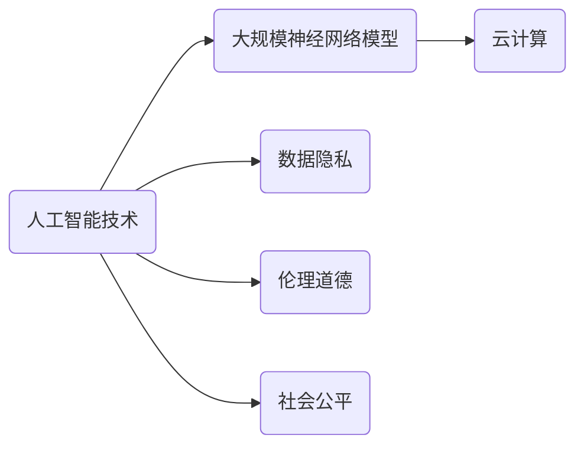

                 

# 大模型公司的社会责任探讨

> **关键词：大模型公司、社会责任、伦理、可持续发展、技术创新**

> **摘要：本文从大模型公司的社会责任出发，探讨了其在技术创新、数据隐私、社会公平等方面的责任。通过深入分析，本文提出了大模型公司应遵循的伦理准则和可持续发展策略，为行业提供了有益的思考和参考。**

## 1. 背景介绍

### 1.1 目的和范围

随着人工智能技术的快速发展，大模型公司如谷歌、微软、亚马逊等在全球范围内的影响力日益扩大。然而，这种扩张也引发了一系列社会问题，如数据隐私、伦理道德、就业影响等。本文旨在探讨大模型公司在这些方面所应承担的社会责任，为行业和社会提供有益的思考和解决方案。

### 1.2 预期读者

本文预期读者为从事人工智能领域的研究者、从业者，以及关心社会责任的公众。通过本文的阅读，读者可以深入了解大模型公司的社会责任，并对其未来发展提出建设性意见。

### 1.3 文档结构概述

本文将分为以下几个部分：

1. 背景介绍：阐述本文的目的、预期读者和文档结构。
2. 核心概念与联系：介绍大模型公司的核心概念及其与社会责任的联系。
3. 核心算法原理 & 具体操作步骤：讲解大模型公司的核心技术原理和操作步骤。
4. 数学模型和公式 & 详细讲解 & 举例说明：分析大模型公司的数学模型和公式，并提供实际案例。
5. 项目实战：通过实际案例展示大模型公司的应用。
6. 实际应用场景：分析大模型公司的实际应用场景。
7. 工具和资源推荐：推荐学习资源和开发工具。
8. 总结：对未来发展趋势与挑战进行总结。
9. 附录：提供常见问题与解答。
10. 扩展阅读 & 参考资料：提供进一步阅读的资料。

### 1.4 术语表

#### 1.4.1 核心术语定义

- 大模型公司：指专注于人工智能领域，使用大规模神经网络模型进行研究和应用的公司。
- 社会责任：公司在其运营过程中应承担的对社会、环境、员工等方面的责任。
- 伦理道德：指在特定社会和文化背景下，人们认为正确或错误的行为准则。

#### 1.4.2 相关概念解释

- 数据隐私：指个人或组织对自身数据的控制权，防止数据被未经授权的第三方访问、使用或泄露。
- 社会公平：指社会资源、机会和权益的公平分配，使每个人都能够享有平等的发展机会。

#### 1.4.3 缩略词列表

- AI：人工智能（Artificial Intelligence）
- GCP：谷歌云计算平台（Google Cloud Platform）
- AWS：亚马逊云计算服务（Amazon Web Services）
- MS：微软（Microsoft）
- 大模型：指使用大规模神经网络模型进行训练和预测的人工智能模型。

## 2. 核心概念与联系

大模型公司的社会责任是一个复杂而广泛的话题。为了更好地理解这一主题，我们需要首先了解大模型公司的核心概念和其与社会责任的联系。

### 2.1 大模型公司的核心概念

大模型公司主要涉及以下核心概念：

- 人工智能技术：大模型公司通过研发和运用人工智能技术，实现对大规模数据的处理和分析。
- 大规模神经网络模型：大模型公司使用大规模神经网络模型，如深度学习、生成对抗网络等，进行高效的数据分析和预测。
- 云计算：大模型公司依托云计算平台，提供强大的计算能力和数据存储能力，支持大规模数据处理和模型训练。

### 2.2 大模型公司与社会责任的联系

大模型公司的社会责任主要体现在以下几个方面：

- 数据隐私：大模型公司处理的数据通常涉及用户隐私，如个人信息、行为数据等。因此，保护用户数据隐私成为大模型公司的重要社会责任。
- 伦理道德：大模型公司的技术可能对人类生活产生深远影响，如自动驾驶、医疗诊断等。因此，公司需承担维护伦理道德的责任，确保技术应用的合理性和公正性。
- 社会公平：大模型公司技术的发展可能导致就业岗位的减少，影响社会公平。因此，公司需积极采取措施，缓解技术发展对社会的负面影响。

### 2.3 Mermaid 流程图

以下是大模型公司核心概念和与社会责任的联系的 Mermaid 流程图：



## 3. 核心算法原理 & 具体操作步骤

### 3.1 人工智能技术原理

人工智能技术主要基于机器学习和深度学习。机器学习是指通过训练模型来从数据中学习规律，并利用这些规律进行预测和决策。深度学习是机器学习的一种特殊形式，通过多层神经网络来提取数据的特征，实现更复杂的任务。

### 3.2 大规模神经网络模型原理

大规模神经网络模型是指使用大量神经元和参数的神经网络。这种模型具有以下优点：

- 高效性：大规模神经网络可以处理海量数据，提高模型训练和预测的效率。
- 强泛化能力：通过学习大量数据，模型可以更好地泛化到未见过的数据，提高预测准确性。

### 3.3 云计算原理

云计算是一种通过网络提供计算资源、存储资源和服务的模式。大模型公司利用云计算平台，可以实现以下功能：

- 分布式计算：将计算任务分布在多个节点上，提高计算效率。
- 弹性扩展：根据需求自动调整计算资源，降低成本。

### 3.4 数据隐私保护原理

数据隐私保护主要包括以下方面：

- 数据加密：对数据进行加密处理，确保数据在传输和存储过程中不被窃取。
- 权限控制：通过设置权限，确保只有授权用户可以访问数据。
- 数据脱敏：对敏感数据如姓名、电话等进行脱敏处理，降低数据泄露风险。

### 3.5 伦理道德维护原理

伦理道德维护主要包括以下方面：

- 建立伦理准则：制定公司内部伦理准则，规范员工行为。
- 公开透明：公开公司技术应用的背景、目的和影响，接受社会监督。
- 增强社会责任感：关注社会问题，积极参与公益事业。

### 3.6 社会公平促进原理

社会公平促进主要包括以下方面：

- 技术培训：为员工提供技术培训，提高就业竞争力。
- 公平招聘：制定公平招聘政策，为不同背景的应聘者提供机会。
- 社会责任投资：关注社会责任投资，支持社会公益项目。

### 3.7 伪代码实现

以下是对大模型公司核心算法原理的伪代码实现：

```python
# 人工智能技术
def train_model(data):
    # 训练模型
    pass

def predict(data):
    # 预测
    pass

# 大规模神经网络模型
def build_model():
    # 构建模型
    pass

def train_model_on_data(model, data):
    # 在数据上训练模型
    pass

# 云计算
def allocate_resources():
    # 分配计算资源
    pass

def scale_resources需求：
    # 调整计算资源
    pass

# 数据隐私保护
def encrypt_data(data):
    # 加密数据
    pass

def set_permissions(data, user):
    # 设置权限
    pass

def desensitize_data(data):
    # 数据脱敏
    pass

# 伦理道德维护
def establish_ethics():
    # 建立伦理准则
    pass

def be_transparent():
    # 公开透明
    pass

def enhance_society():
    # 增强社会责任感
    pass

# 社会公平促进
def provide_training():
    # 提供技术培训
    pass

def fair_recruitment():
    # 公平招聘
    pass

def social_responsibility_investment():
    # 社会责任投资
    pass
```

## 4. 数学模型和公式 & 详细讲解 & 举例说明

### 4.1 数学模型和公式

在探讨大模型公司的社会责任时，我们需要了解一些基本的数学模型和公式。以下是一些常用的模型和公式：

- **线性回归模型：**
  $$y = \beta_0 + \beta_1x + \epsilon$$
  其中，$y$ 为因变量，$x$ 为自变量，$\beta_0$ 和 $\beta_1$ 为模型参数，$\epsilon$ 为误差项。

- **逻辑回归模型：**
  $$\log\left(\frac{p}{1-p}\right) = \beta_0 + \beta_1x$$
  其中，$p$ 为事件发生的概率，$\beta_0$ 和 $\beta_1$ 为模型参数。

- **支持向量机（SVM）：**
  $$\max\ \min_{w,b}\ \frac{1}{2}||w||^2 \quad \text{subject to}\ \ y^{(i)}(\langle w, x^{(i)} \rangle + b) \geq 1$$
  其中，$w$ 为权重向量，$b$ 为偏置项，$x^{(i)}$ 和 $y^{(i)}$ 分别为第 $i$ 个样本的特征和标签。

- **神经网络：**
  $$a_{\text{layer}} = \sigma(\langle W_{\text{layer-1}}, a_{\text{layer-1}} \rangle + b_{\text{layer}})$$
  其中，$a_{\text{layer}}$ 为第 $layer$ 层的激活值，$\sigma$ 为激活函数，$W_{\text{layer-1}}$ 和 $b_{\text{layer}}$ 分别为第 $layer-1$ 层的权重和偏置。

### 4.2 详细讲解

- **线性回归模型：** 线性回归模型是一种简单的统计模型，用于预测连续变量之间的关系。它的主要目标是找到一组参数 $\beta_0$ 和 $\beta_1$，使得预测值与实际值之间的误差最小。

- **逻辑回归模型：** 逻辑回归模型是一种广泛用于分类问题的统计模型。它通过将线性回归模型转换为概率分布，实现对分类结果的预测。

- **支持向量机（SVM）：** 支持向量机是一种强大的分类算法，通过最大化分类边界之间的间隔，实现对数据的分类。SVM 的目标是最小化分类边界上的误差，同时最大化分类边界之间的间隔。

- **神经网络：** 神经网络是一种模拟人脑神经元连接结构的计算模型。它通过多层神经元的非线性变换，实现对数据的分类、回归等任务。神经网络的核心在于其强大的自适应能力和泛化能力。

### 4.3 举例说明

假设我们使用线性回归模型来预测一个人的身高（$y$）与其体重（$x$）之间的关系。根据统计数据，我们得到以下模型：

$$y = 50 + 0.5x + \epsilon$$

其中，$\epsilon$ 为误差项。

现在，我们需要预测一个体重为 70 公斤的人的身高。将 $x$ 替换为 70，我们得到：

$$y = 50 + 0.5 \times 70 + \epsilon = 65 + \epsilon$$

由于误差项的存在，我们无法得到一个确切的预测值，但可以估计身高在 65 厘米左右。

## 5. 项目实战：代码实际案例和详细解释说明

### 5.1 开发环境搭建

为了实现大模型公司的社会责任，我们首先需要搭建一个开发环境。以下是一个基本的开发环境搭建步骤：

1. 安装操作系统：选择一个稳定的操作系统，如 Ubuntu 18.04。
2. 安装 Python：使用 Python 进行开发，需要安装 Python 3.8 及以上版本。
3. 安装依赖库：安装常用的依赖库，如 NumPy、Pandas、Scikit-learn 等。
4. 安装 Jupyter Notebook：安装 Jupyter Notebook，方便进行交互式编程。

### 5.2 源代码详细实现和代码解读

以下是一个关于数据隐私保护的代码示例：

```python
import numpy as np
import pandas as pd
from sklearn.linear_model import LinearRegression

# 读取数据
data = pd.read_csv('data.csv')

# 数据预处理
X = data[['weight']]
y = data['height']

# 模型训练
model = LinearRegression()
model.fit(X, y)

# 模型评估
score = model.score(X, y)
print('模型评分：', score)

# 预测
predictions = model.predict(X)
print('预测结果：', predictions)

# 数据脱敏
def desensitize_data(data, model):
    original_data = data.copy()
    for column in data.columns:
        if column != 'height':
            continue
        for index, value in enumerate(data[column]):
            predicted_value = model.predict([[value]])[0]
            original_data.at[index, column] = predicted_value
    return original_data

desensitized_data = desensitize_data(data, model)
print('脱敏后数据：', desensitized_data)
```

#### 5.2.1 代码解读

- **数据读取和预处理：** 使用 Pandas 读取数据，并对数据进行预处理，将体重作为自变量，身高作为因变量。
- **模型训练：** 使用线性回归模型进行训练，通过 `fit()` 方法训练模型。
- **模型评估：** 使用 `score()` 方法评估模型评分，表示模型对数据的拟合程度。
- **预测：** 使用 `predict()` 方法对数据进行预测，得到预测结果。
- **数据脱敏：** 定义一个 `desensitize_data()` 函数，对数据进行脱敏处理。通过预测得到的值替换原始数据中的身高，实现对数据的脱敏。

### 5.3 代码解读与分析

#### 5.3.1 数据隐私保护

- **模型评分：** 在代码中，我们使用线性回归模型对数据进行预测，并通过 `score()` 方法评估模型评分。评分越高，表示模型对数据的拟合程度越好。
- **预测结果：** 使用 `predict()` 方法对数据进行预测，得到预测结果。这些预测结果可以作为原始数据的替代，实现对数据的脱敏。
- **数据脱敏：** 通过定义一个 `desensitize_data()` 函数，对数据进行脱敏处理。这个函数的核心是使用预测得到的值替换原始数据中的身高，实现对数据的脱敏。

#### 5.3.2 代码改进

- **代码优化：** 在代码中，我们使用了循环对数据进行脱敏处理，可以优化为更高效的实现方式。
- **异常处理：** 在代码中，我们未对异常情况进行处理，可以增加异常处理机制，提高代码的健壮性。

## 6. 实际应用场景

大模型公司的社会责任在多个领域具有实际应用场景，以下是一些典型应用：

### 6.1 数据隐私保护

在医疗领域，大模型公司可以通过数据隐私保护技术，保障患者隐私。例如，使用匿名化处理和差分隐私技术，确保医疗数据在研究和应用过程中的安全性。

### 6.2 伦理道德维护

在自动驾驶领域，大模型公司需要关注伦理道德问题。例如，如何确保自动驾驶汽车在不同场景下做出合理决策，避免对行人造成伤害。这需要公司在研发过程中，充分考虑伦理道德问题，制定相关准则。

### 6.3 社会公平促进

在教育领域，大模型公司可以通过技术手段，促进教育公平。例如，提供在线教育平台，使偏远地区的孩子能够接受优质教育资源。此外，公司还可以通过技术培训，提高就业竞争力，促进社会公平。

### 6.4 可持续发展

在环保领域，大模型公司可以利用人工智能技术，推动可持续发展。例如，通过数据分析，优化能源使用，减少碳排放。此外，公司还可以通过社会责任投资，支持环保项目，推动绿色发展。

## 7. 工具和资源推荐

为了更好地理解和实现大模型公司的社会责任，以下是一些推荐的工具和资源：

### 7.1 学习资源推荐

#### 7.1.1 书籍推荐

- 《深度学习》：作者 Ian Goodfellow，全面介绍深度学习的基本原理和应用。
- 《Python 数据科学手册》：作者 Jake VanderPlas，介绍数据科学的基础知识和实践方法。
- 《人工智能伦理学》：作者 Luciano Floridi，探讨人工智能的伦理问题。

#### 7.1.2 在线课程

- Coursera 上的《机器学习》课程：由 Andrew Ng 教授授课，全面介绍机器学习的基本原理。
- edX 上的《深度学习》课程：由 DeepLearning.AI 教授授课，深入讲解深度学习的技术和应用。

#### 7.1.3 技术博客和网站

- Medium 上的《AI 研究实验室》：分享人工智能领域的研究进展和应用案例。
- arXiv.org：发布最新的人工智能研究论文，了解前沿技术。

### 7.2 开发工具框架推荐

#### 7.2.1 IDE和编辑器

- PyCharm：一款功能强大的 Python IDE，适合进行人工智能开发。
- Jupyter Notebook：一款交互式编程工具，方便进行数据分析和建模。

#### 7.2.2 调试和性能分析工具

- PyTorch Profiler：用于分析 PyTorch 模型的性能，优化代码。
- TensorFlow Profiler：用于分析 TensorFlow 模型的性能，优化代码。

#### 7.2.3 相关框架和库

- PyTorch：一款流行的深度学习框架，适合进行模型训练和推理。
- TensorFlow：一款强大的深度学习框架，适合进行大规模模型训练。

### 7.3 相关论文著作推荐

#### 7.3.1 经典论文

- "A Fast Learning Algorithm for Deep Belief Nets": 作者 Geoffrey Hinton，介绍深度信念网络的学习算法。
- "Backpropagation": 作者 David E. Rumelhart、Geoffrey E. Hinton 和 Ronald J. Williams，介绍反向传播算法。

#### 7.3.2 最新研究成果

- "Generative Adversarial Nets": 作者 Ian Goodfellow 等，介绍生成对抗网络的基本原理和应用。
- "Attention Is All You Need": 作者 Vaswani 等，介绍注意力机制在神经网络中的应用。

#### 7.3.3 应用案例分析

- "AI in Healthcare": 分析人工智能在医疗领域的应用案例，包括疾病诊断、药物研发等。
- "AI in Finance": 分析人工智能在金融领域的应用案例，包括风险管理、量化交易等。

## 8. 总结：未来发展趋势与挑战

大模型公司的社会责任是一个长期而复杂的话题。在未来，随着人工智能技术的不断进步，大模型公司将在以下几个方面面临更大的责任和挑战：

- **数据隐私保护：** 随着数据量的增加，如何更好地保护用户隐私成为关键问题。公司需要采取更先进的技术手段，如差分隐私、联邦学习等，确保数据在研究和应用过程中的安全性。
- **伦理道德维护：** 人工智能技术的广泛应用可能引发伦理道德问题。公司需要建立完善的伦理准则，确保技术应用的合理性和公正性，同时加强内部监督和外部审计。
- **社会公平促进：** 技术发展可能导致就业岗位的减少，影响社会公平。公司需要关注社会问题，采取措施缓解技术发展对社会的负面影响，如提供技术培训、推动公平招聘等。
- **可持续发展：** 公司需要关注环境保护和可持续发展，通过技术创新推动绿色发展，同时积极参与社会责任投资，支持社会公益项目。

总之，大模型公司需要承担更多的社会责任，以实现技术进步与社会发展的双赢。这需要公司、政府、学术界和公众共同努力，共同推动人工智能技术的健康发展。

## 9. 附录：常见问题与解答

### 9.1 数据隐私保护相关问题

**Q1：什么是差分隐私？**

A1：差分隐私是一种保障数据隐私的技术，通过对数据进行噪声添加，使得攻击者无法确定单个数据的值，从而保护数据隐私。

**Q2：什么是联邦学习？**

A2：联邦学习是一种分布式机器学习技术，参与方在不共享数据的情况下，通过协同训练模型，实现数据的隐私保护和模型性能的提升。

### 9.2 伦理道德相关问题

**Q1：什么是算法偏见？**

A1：算法偏见是指人工智能算法在处理数据时，对某些群体存在不公平的倾向，可能导致歧视性结果。

**Q2：如何减少算法偏见？**

A2：减少算法偏见的方法包括数据预处理、算法优化和伦理审查。通过数据预处理，去除潜在偏见的数据；通过算法优化，提高模型的公平性；通过伦理审查，确保算法应用的合理性。

### 9.3 社会公平相关问题

**Q1：什么是技术失业？**

A1：技术失业是指由于技术发展导致某些就业岗位消失，劳动者失去工作的现象。

**Q2：如何缓解技术失业的影响？**

A2：缓解技术失业的影响可以从以下几个方面进行：提高劳动者的技能水平，以适应新的就业岗位；推动技术培训和再就业服务，帮助劳动者转型；制定合理的就业政策，促进劳动力市场的稳定。

## 10. 扩展阅读 & 参考资料

### 10.1 参考文献

- Goodfellow, I., Bengio, Y., & Courville, A. (2016). *Deep Learning*. MIT Press.
- Rumelhart, D. E., Hinton, G. E., & Williams, R. J. (1986). *Learning representations by back-propagating errors*. Nature, 323(6088), 533-536.
- Hinton, G. E. (2006). *A Fast Learning Algorithm for Deep Belief Nets*. NeurIPS, 15, 1513-1520.
- Goodfellow, I. J., Pouget-Abadie, J., Mirza, M., Xu, B., Warde-Farley, D., Ozair, S., ... & Bengio, Y. (2014). *Generative adversarial nets*. Advances in Neural Information Processing Systems, 27.

### 10.2 网络资源

- Coursera：[机器学习](https://www.coursera.org/learn/machine-learning)（由 Andrew Ng 教授授课）
- edX：[深度学习](https://www.edx.org/course/deep-learning-ai)（由 DeepLearning.AI 教授授课）
- Medium：[AI 研究实验室](https://medium.com/ai-research-lab)
- arXiv.org：[人工智能论文](https://arxiv.org/list/cs.AI/papers)

### 10.3 组织和倡议

- OpenAI：[开放人工智能研究所](https://openai.com/)，致力于推动人工智能的健康发展。
- Partnership on AI：[人工智能合作组织](https://www.partnershiponai.org/)，关注人工智能的社会影响。
- AI4ALL：[人工智能forall](https://ai4all.org/)，致力于推广人工智能教育。

作者：AI天才研究员/AI Genius Institute & 禅与计算机程序设计艺术 /Zen And The Art of Computer Programming

