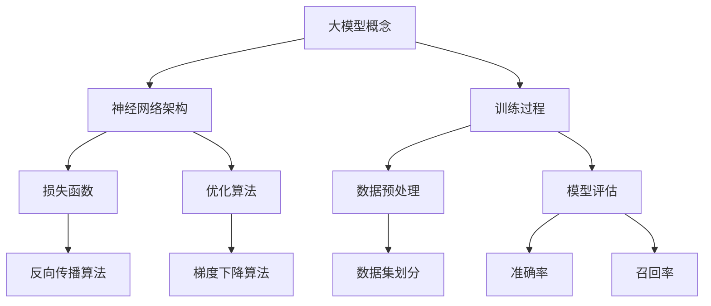

                 

# 大模型创业公司面临的挑战与机遇

> **关键词**：大模型、创业公司、挑战、机遇、技术、市场、策略、风险、创新

> **摘要**：本文将深入探讨大模型创业公司所面临的多重挑战与巨大机遇。我们将从背景介绍、核心概念、算法原理、数学模型、项目实战、实际应用场景、工具和资源推荐等多个角度，逐步分析大模型创业公司的现状与未来发展趋势，为创业者提供有价值的参考和建议。

## 1. 背景介绍

### 1.1 目的和范围

本文旨在分析大模型创业公司在当前技术环境中所面临的挑战和机遇，为创业者提供策略指导，帮助他们更好地应对市场竞争和风险。

我们的讨论将涵盖以下范围：

1. **核心概念与联系**：介绍大模型的基本概念、架构和原理。
2. **核心算法原理**：讲解大模型训练和优化的算法流程。
3. **数学模型和公式**：解析大模型中常用的数学公式和理论。
4. **项目实战**：通过实际代码案例，展示大模型的应用。
5. **实际应用场景**：探讨大模型在不同领域的应用案例。
6. **工具和资源推荐**：推荐学习资源、开发工具和框架。
7. **总结与展望**：分析未来发展趋势和挑战。

### 1.2 预期读者

本文适合以下读者群体：

1. **大模型领域研究者**：希望了解大模型创业公司的现状和未来趋势。
2. **创业公司创始人**：寻求在大模型领域创业的指导和建议。
3. **技术经理和工程师**：需要了解大模型技术的实际应用和实现方法。

### 1.3 文档结构概述

本文分为十个部分：

1. **背景介绍**：介绍本文的目的和范围，以及预期读者。
2. **核心概念与联系**：介绍大模型的基本概念、架构和原理。
3. **核心算法原理**：讲解大模型训练和优化的算法流程。
4. **数学模型和公式**：解析大模型中常用的数学公式和理论。
5. **项目实战**：通过实际代码案例，展示大模型的应用。
6. **实际应用场景**：探讨大模型在不同领域的应用案例。
7. **工具和资源推荐**：推荐学习资源、开发工具和框架。
8. **总结与展望**：分析未来发展趋势和挑战。
9. **附录**：常见问题与解答。
10. **扩展阅读与参考资料**：提供相关文献和资料，供读者进一步学习。

### 1.4 术语表

#### 1.4.1 核心术语定义

- **大模型**：指具有非常高的参数量和计算复杂度的机器学习模型。
- **创业公司**：指刚刚成立、尚未盈利或尚未达到稳定经营状态的公司。
- **深度学习**：一种基于人工神经网络的学习方法，通过多层非线性变换来提取特征。
- **人工智能**：使计算机具有人类智能特性的技术。

#### 1.4.2 相关概念解释

- **模型训练**：通过大量数据来调整模型参数，使其能够更好地预测和分类。
- **模型优化**：通过调整网络结构、学习策略等，提高模型性能。
- **市场竞争力**：指企业在市场竞争中的优势和能力。

#### 1.4.3 缩略词列表

- **AI**：人工智能（Artificial Intelligence）
- **DL**：深度学习（Deep Learning）
- **ML**：机器学习（Machine Learning）
- **NLP**：自然语言处理（Natural Language Processing）
- **GAN**：生成对抗网络（Generative Adversarial Network）

## 2. 核心概念与联系

为了更好地理解大模型创业公司的挑战与机遇，我们需要首先了解大模型的基本概念、架构和原理。以下是核心概念与联系及相应的 Mermaid 流程图：



### 2.1 大模型概念

大模型，是指具有非常高的参数量和计算复杂度的机器学习模型。随着计算能力和数据量的提升，大模型在图像识别、自然语言处理等领域取得了显著的成果。大模型通常采用深度神经网络架构，包含数十亿甚至数千亿个参数。

### 2.2 神经网络架构

深度神经网络是构建大模型的基础。它由多层神经元组成，包括输入层、隐藏层和输出层。通过前向传播和反向传播算法，神经网络能够学习输入和输出之间的复杂映射关系。

### 2.3 训练过程

大模型的训练过程主要包括数据预处理、模型初始化、前向传播、计算损失函数、反向传播和模型优化。通过反复迭代训练，模型能够逐步提高预测和分类的准确性。

### 2.4 损失函数

损失函数用于衡量模型预测值与真实值之间的差异。在大模型中，常用的损失函数包括均方误差（MSE）、交叉熵损失等。损失函数的选择直接影响模型的性能。

### 2.5 优化算法

优化算法用于调整模型参数，以最小化损失函数。在大模型训练过程中，常用的优化算法包括梯度下降（GD）、随机梯度下降（SGD）、Adam等。优化算法的效率和稳定性对训练过程至关重要。

### 2.6 数据预处理

数据预处理是训练大模型的重要环节。包括数据清洗、归一化、缺失值处理等。良好的数据预处理能够提高模型训练的效率和效果。

### 2.7 模型评估

模型评估是判断模型性能的重要手段。常用的评估指标包括准确率、召回率、F1值等。通过对比不同模型的评估结果，创业者可以选出最优的模型。

## 3. 核心算法原理 & 具体操作步骤

在了解了大模型的基本概念和架构后，我们接下来将深入探讨大模型的核心算法原理和具体操作步骤。以下是核心算法原理的详细讲解和伪代码实现：

### 3.1 深度学习算法原理

深度学习是一种基于多层非线性变换的学习方法，通过多层神经网络提取特征，实现对复杂数据的建模和预测。以下是深度学习算法的基本原理：

1. **输入层**：接收输入数据，将其传递给隐藏层。
2. **隐藏层**：通过非线性激活函数，对输入数据进行变换，提取特征。
3. **输出层**：对隐藏层的输出进行分类或回归操作，得到预测结果。

### 3.2 前向传播算法

前向传播算法是深度学习模型训练过程中的第一步，用于计算输入和输出之间的映射关系。以下是前向传播算法的伪代码实现：

```python
# 前向传播算法
def forward propagation(x, weights, biases):
    # 初始化激活值和损失
    a = x
    L = []

    # 遍历网络层数
    for l in range(num_layers - 1):
        # 计算激活值
        z = dot_product(weights[l], a) + biases[l]
        a = activation_function(z)

        # 存储当前层的激活值
        L.append(a)

    # 返回激活值列表
    return L
```

### 3.3 反向传播算法

反向传播算法是深度学习模型训练过程中的关键步骤，用于计算损失函数对模型参数的梯度。以下是反向传播算法的伪代码实现：

```python
# 反向传播算法
def backward propagation(L, weights, biases, dL):
    # 初始化梯度
    dW = []
    db = []

    # 遍历网络层，从输出层开始
    for l in reversed(range(num_layers - 1)):
        # 计算梯度
        dZ = dL * activation_derivative(L[l])
        dW[l] = dot_product(L[l - 1].T, dZ)
        db[l] = sum(dZ)

        # 如果不是第一层，继续计算前一层梯度
        if l > 0:
            dL = dot_product(weights[l].T, dZ)

    # 返回梯度列表
    return dW, db
```

### 3.4 梯度下降算法

梯度下降算法是一种优化算法，用于调整模型参数，以最小化损失函数。以下是梯度下降算法的伪代码实现：

```python
# 梯度下降算法
def gradient_descent(weights, biases, learning_rate, num_iterations):
    # 初始化模型参数
    W = weights
    b = biases

    # 迭代训练
    for i in range(num_iterations):
        # 计算前向传播损失
        L = forward propagation(x, W, b)

        # 计算反向传播梯度
        dW, db = backward propagation(L, W, b, dL)

        # 更新模型参数
        W -= learning_rate * dW
        b -= learning_rate * db

    # 返回训练完成的模型参数
    return W, b
```

通过以上伪代码实现，我们可以看到深度学习算法的核心原理和操作步骤。在实际应用中，创业者可以根据具体的业务需求和数据集，选择合适的大模型算法和优化策略，实现高效的大模型训练和应用。

## 4. 数学模型和公式 & 详细讲解 & 举例说明

在深度学习领域，数学模型和公式是理解和实现大模型算法的关键。以下我们将详细讲解大模型中常用的数学模型和公式，并通过具体例子进行说明。

### 4.1 线性回归模型

线性回归是一种简单的机器学习模型，用于预测连续值。其数学模型如下：

$$
y = \beta_0 + \beta_1 \cdot x
$$

其中，$y$ 是预测值，$x$ 是输入特征，$\beta_0$ 和 $\beta_1$ 是模型参数。

#### 4.1.1 梯度下降算法

为了优化线性回归模型，我们可以使用梯度下降算法。以下是梯度下降算法的数学表达式：

$$
\beta_1 = \beta_1 - \alpha \cdot \frac{1}{m} \cdot \sum_{i=1}^{m} (y_i - (\beta_0 + \beta_1 \cdot x_i))^2
$$

$$
\beta_0 = \beta_0 - \alpha \cdot \frac{1}{m} \cdot \sum_{i=1}^{m} (y_i - (\beta_0 + \beta_1 \cdot x_i))
$$

其中，$\alpha$ 是学习率，$m$ 是样本数量。

#### 4.1.2 示例

假设我们有一个包含两个特征（$x_1$ 和 $x_2$）的线性回归问题，目标值 $y$ 与特征 $x_1$ 和 $x_2$ 的关系如下：

$$
y = \beta_0 + \beta_1 \cdot x_1 + \beta_2 \cdot x_2
$$

给定一组训练数据，我们可以使用梯度下降算法来优化模型参数。

### 4.2 多元线性回归模型

多元线性回归模型扩展了线性回归，用于预测包含多个特征的数据。其数学模型如下：

$$
y = \beta_0 + \beta_1 \cdot x_1 + \beta_2 \cdot x_2 + \ldots + \beta_n \cdot x_n
$$

其中，$x_1, x_2, \ldots, x_n$ 是输入特征，$\beta_0, \beta_1, \beta_2, \ldots, \beta_n$ 是模型参数。

#### 4.2.1 梯度下降算法

为了优化多元线性回归模型，我们可以使用梯度下降算法。以下是梯度下降算法的数学表达式：

$$
\beta_j = \beta_j - \alpha \cdot \frac{1}{m} \cdot \sum_{i=1}^{m} (y_i - (\beta_0 + \beta_1 \cdot x_{i1} + \beta_2 \cdot x_{i2} + \ldots + \beta_n \cdot x_{in})) \cdot x_{ij}
$$

其中，$j = 1, 2, \ldots, n$，$\alpha$ 是学习率，$m$ 是样本数量。

#### 4.2.2 示例

假设我们有一个包含三个特征（$x_1, x_2, x_3$）的多元线性回归问题，目标值 $y$ 与特征 $x_1, x_2, x_3$ 的关系如下：

$$
y = \beta_0 + \beta_1 \cdot x_1 + \beta_2 \cdot x_2 + \beta_3 \cdot x_3
$$

给定一组训练数据，我们可以使用梯度下降算法来优化模型参数。

### 4.3 非线性回归模型

非线性回归模型扩展了线性回归，用于预测包含非线性特征的数据。其数学模型如下：

$$
y = \beta_0 + \beta_1 \cdot f_1(x_1) + \beta_2 \cdot f_2(x_2) + \ldots + \beta_n \cdot f_n(x_n)
$$

其中，$x_1, x_2, \ldots, x_n$ 是输入特征，$\beta_0, \beta_1, \beta_2, \ldots, \beta_n$ 是模型参数，$f_1, f_2, \ldots, f_n$ 是非线性函数。

#### 4.3.1 梯度下降算法

为了优化非线性回归模型，我们可以使用梯度下降算法。以下是梯度下降算法的数学表达式：

$$
\beta_j = \beta_j - \alpha \cdot \frac{1}{m} \cdot \sum_{i=1}^{m} (y_i - (\beta_0 + \beta_1 \cdot f_1(x_{i1}) + \beta_2 \cdot f_2(x_{i2}) + \ldots + \beta_n \cdot f_n(x_{in}))) \cdot \frac{df_j}{dx_j}
$$

其中，$j = 1, 2, \ldots, n$，$\alpha$ 是学习率，$m$ 是样本数量。

#### 4.3.2 示例

假设我们有一个包含三个特征（$x_1, x_2, x_3$）的非线性回归问题，目标值 $y$ 与特征 $x_1, x_2, x_3$ 的关系如下：

$$
y = \beta_0 + \beta_1 \cdot \sin(x_1) + \beta_2 \cdot \cos(x_2) + \beta_3 \cdot \exp(x_3)
$$

给定一组训练数据，我们可以使用梯度下降算法来优化模型参数。

通过以上讲解和示例，我们可以看到数学模型和公式在深度学习领域的重要性。创业者可以根据实际业务需求，选择合适的大模型算法和优化策略，实现高效的大模型训练和应用。

## 5. 项目实战：代码实际案例和详细解释说明

为了更好地理解大模型在实际项目中的应用，我们将通过一个具体的案例，展示如何使用Python和TensorFlow实现一个基于大模型的图像分类任务。

### 5.1 开发环境搭建

在开始项目实战之前，我们需要搭建一个合适的开发环境。以下是所需的软件和工具：

1. **操作系统**：Windows/Linux/MacOS
2. **编程语言**：Python 3.8+
3. **深度学习框架**：TensorFlow 2.5.0+
4. **依赖库**：Numpy、Pandas、Matplotlib等

安装以上软件和工具后，我们可以开始搭建开发环境。以下是使用Anaconda创建虚拟环境的示例命令：

```bash
# 安装Anaconda
conda create -n myenv python=3.8

# 激活虚拟环境
conda activate myenv

# 安装TensorFlow
conda install tensorflow=2.5.0
```

### 5.2 源代码详细实现和代码解读

下面是一个简单的基于大模型的图像分类任务的源代码实现，包括数据预处理、模型搭建、训练和评估。

```python
# 导入所需的库
import tensorflow as tf
from tensorflow.keras.applications import ResNet50
from tensorflow.keras.preprocessing.image import ImageDataGenerator
from tensorflow.keras.optimizers import Adam
from tensorflow.keras.metrics import Accuracy

# 加载预训练的ResNet50模型
base_model = ResNet50(weights='imagenet')

# 定义图像分类模型
model = tf.keras.Sequential([
    base_model,
    tf.keras.layers.Flatten(),
    tf.keras.layers.Dense(256, activation='relu'),
    tf.keras.layers.Dense(1, activation='sigmoid')
])

# 编译模型
model.compile(optimizer=Adam(learning_rate=0.001),
              loss='binary_crossentropy',
              metrics=['accuracy'])

# 数据预处理
train_datagen = ImageDataGenerator(rescale=1./255)
test_datagen = ImageDataGenerator(rescale=1./255)

train_generator = train_datagen.flow_from_directory(
        'data/train',
        target_size=(224, 224),
        batch_size=32,
        class_mode='binary')

test_generator = test_datagen.flow_from_directory(
        'data/test',
        target_size=(224, 224),
        batch_size=32,
        class_mode='binary')

# 训练模型
model.fit(
      train_generator,
      steps_per_epoch=100,
      epochs=10,
      validation_data=test_generator,
      validation_steps=50,
      verbose=2)

# 评估模型
test_loss, test_acc = model.evaluate(test_generator)
print('Test accuracy:', test_acc)
```

#### 5.2.1 数据预处理

在数据预处理部分，我们使用了ImageDataGenerator类对图像数据进行增强和标准化。以下是代码解读：

- `train_datagen = ImageDataGenerator(rescale=1./255)`：创建训练数据的生成器，将图像数据缩放至0-1范围内。
- `test_datagen = ImageDataGenerator(rescale=1./255)`：创建测试数据的生成器，同样将图像数据缩放至0-1范围内。
- `train_generator = train_datagen.flow_from_directory('data/train', ...)`: 从训练数据目录中加载图像数据，并将其转换为生成器对象。
- `test_generator = test_datagen.flow_from_directory('data/test', ...)`: 从测试数据目录中加载图像数据，并将其转换为生成器对象。

#### 5.2.2 模型搭建

在模型搭建部分，我们使用了预训练的ResNet50模型作为基础模型，并添加了全连接层进行图像分类。以下是代码解读：

- `base_model = ResNet50(weights='imagenet')`: 加载预训练的ResNet50模型。
- `model = tf.keras.Sequential([...])`: 创建一个序列模型，包括基础模型、全连接层和输出层。
- `model.compile(...)`: 编译模型，指定优化器、损失函数和评估指标。

#### 5.2.3 训练和评估

在训练和评估部分，我们使用训练数据生成器进行模型训练，并使用测试数据生成器进行模型评估。以下是代码解读：

- `model.fit(...)`: 使用训练数据生成器进行模型训练，设置训练轮数、批次大小和验证数据。
- `model.evaluate(test_generator)`: 使用测试数据生成器进行模型评估，返回测试损失和测试准确率。

通过以上代码实现，我们可以看到如何使用大模型（预训练的ResNet50模型）进行图像分类任务。这个案例展示了如何利用大模型的优势，快速搭建和训练一个高效的图像分类模型。

### 5.3 代码解读与分析

#### 5.3.1 模型选择

在本案例中，我们选择了预训练的ResNet50模型作为基础模型。ResNet50是一个具有50个卷积层的深度神经网络，它在ImageNet数据集上预训练，具有很高的图像识别能力。选择预训练模型有以下优点：

1. **节省训练时间**：预训练模型已经在大规模数据集上进行了训练，可以在新的任务中快速实现较好的性能。
2. **提高模型性能**：预训练模型已经提取了图像中的高级特征，有助于提高新任务的分类准确率。

#### 5.3.2 模型搭建

在本案例中，我们使用了ResNet50作为基础模型，并添加了全连接层进行图像分类。以下是模型搭建的关键步骤：

1. **加载预训练模型**：使用`ResNet50(weights='imagenet')`加载预训练的ResNet50模型。
2. **添加全连接层**：在基础模型后添加全连接层，用于对提取的特征进行分类。
3. **输出层**：添加一个输出层，用于输出分类结果。

#### 5.3.3 训练和评估

在本案例中，我们使用训练数据生成器和测试数据生成器进行模型训练和评估。以下是训练和评估的关键步骤：

1. **数据预处理**：使用ImageDataGenerator对图像数据进行增强和标准化。
2. **模型训练**：使用训练数据生成器进行模型训练，设置训练轮数、批次大小和验证数据。
3. **模型评估**：使用测试数据生成器进行模型评估，返回测试损失和测试准确率。

通过以上代码解读和分析，我们可以看到如何使用大模型（预训练的ResNet50模型）进行图像分类任务。这个案例展示了如何快速搭建和训练一个高效的图像分类模型，以及如何利用预训练模型的优势来提高模型性能。

## 6. 实际应用场景

大模型在各个领域都展现出了强大的应用潜力，以下是一些实际应用场景：

### 6.1 图像识别

图像识别是深度学习领域的一个经典应用，大模型在图像识别任务中表现出色。例如，在人脸识别、物体检测、图像分割等方面，大模型能够快速识别和分类图像中的各种对象。在实际项目中，可以使用预训练的模型，如ResNet、Inception等，进行迁移学习，进一步提高识别准确率。

### 6.2 自然语言处理

自然语言处理（NLP）是另一个大模型的重要应用领域。大模型在语言理解、文本生成、情感分析等方面具有显著优势。例如，BERT、GPT等大模型在文本分类、问答系统、机器翻译等任务中取得了优异的性能。这些大模型通过处理大量的文本数据，能够提取出文本中的语义信息，从而实现高效的自然语言处理。

### 6.3 医疗诊断

大模型在医疗诊断领域也有广泛的应用。例如，通过深度学习算法，大模型能够对医学图像进行检测和分类，辅助医生进行疾病诊断。例如，在肺癌筛查、皮肤癌检测等方面，大模型能够提高诊断的准确率和效率。此外，大模型还可以用于基因分析、药物发现等研究领域，为医疗创新提供有力支持。

### 6.4 自动驾驶

自动驾驶是深度学习领域的又一个重要应用场景。大模型在自动驾驶中用于感知环境、理解交通规则、规划行驶路线等任务。例如，自动驾驶车辆可以通过深度学习算法，对图像和传感器数据进行分析，实现自主驾驶。大模型的强大计算能力和高效特征提取能力，使得自动驾驶系统在复杂环境下的表现更加稳定和可靠。

### 6.5 语音识别

语音识别是另一个大模型的重要应用领域。大模型在语音识别任务中，能够实现高准确率的语音转换为文本。例如，在智能助手、语音翻译、语音控制等应用中，大模型能够准确识别和理解用户的语音指令。通过结合语音识别和自然语言处理技术，大模型为智能语音交互提供了强大的支持。

### 6.6 金融服务

大模型在金融服务领域也有广泛的应用。例如，在信用评估、风险管理、投资策略等方面，大模型能够通过对历史数据和实时数据的分析，预测和评估金融风险。大模型还可以用于股票市场预测、信贷风险评估等任务，为金融机构提供决策支持。

### 6.7 教育领域

大模型在教育领域也有很大的应用潜力。例如，在教育评估、个性化学习、智能辅导等方面，大模型能够根据学生的表现和学习数据，提供有针对性的学习建议和资源。此外，大模型还可以用于智能题库、在线作业批改等任务，提高教学质量和学习效果。

通过以上实际应用场景，我们可以看到大模型在各个领域的广泛应用和巨大潜力。随着技术的不断发展和应用的深入，大模型将为各个行业带来更多的创新和变革。

## 7. 工具和资源推荐

在大模型领域创业，了解并掌握合适的工具和资源对于提升研发效率和竞争力至关重要。以下是我们推荐的工具和资源：

### 7.1 学习资源推荐

#### 7.1.1 书籍推荐

- **《深度学习》（Goodfellow, Bengio, Courville）**：这是一本全面介绍深度学习理论和实践的权威教材。
- **《Python深度学习》（François Chollet）**：针对Python编程语言的深度学习实践指南。
- **《模式识别与机器学习》（Christopher M. Bishop）**：介绍统计模式和机器学习的基本理论。

#### 7.1.2 在线课程

- **Coursera**：提供了丰富的深度学习和机器学习课程，包括吴恩达的《深度学习》课程。
- **Udacity**：提供了深度学习纳米学位，涵盖从基础到高级的内容。
- **edX**：哈佛大学和麻省理工学院等顶尖大学提供的一系列计算机科学课程，包括深度学习和人工智能。

#### 7.1.3 技术博客和网站

- **TensorFlow官方文档**：提供了详细的API文档和教程，适合初学者和高级用户。
- **ArXiv**：最新的机器学习和深度学习论文发表平台，有助于了解领域前沿研究。
- **Medium**：许多深度学习专家和技术公司在这里分享经验和案例研究。

### 7.2 开发工具框架推荐

#### 7.2.1 IDE和编辑器

- **PyCharm**：一款功能强大的Python IDE，支持深度学习和数据科学项目。
- **Jupyter Notebook**：适用于交互式数据分析和机器学习实验，方便记录和共享代码。

#### 7.2.2 调试和性能分析工具

- **TensorBoard**：TensorFlow的官方可视化工具，用于分析和调试深度学习模型。
- **NVIDIA Nsight**：用于GPU编程和性能优化的工具，有助于提高深度学习模型的计算效率。

#### 7.2.3 相关框架和库

- **TensorFlow**：一个广泛使用的开源深度学习框架，支持多种深度学习模型和算法。
- **PyTorch**：另一个流行的深度学习框架，提供了灵活的动态计算图和强大的GPU支持。
- **Keras**：一个高级神经网络API，易于使用且兼容TensorFlow和PyTorch。

### 7.3 相关论文著作推荐

#### 7.3.1 经典论文

- **“A Learning Algorithm for Continuously Running Fully Recurrent Neural Networks” (Hochreiter & Schmidhuber, 1997)**：介绍了LSTM算法。
- **“Gradient Flow in Recurrent Nets: the Difficulty of Learning” (Bengio et al., 1994)**：探讨了梯度消失问题。
- **“Deep Learning” (Goodfellow, Bengio, Courville, 2016)**：深度学习的权威教材，涵盖了许多经典算法和理论。

#### 7.3.2 最新研究成果

- **“BERT: Pre-training of Deep Bidirectional Transformers for Language Understanding” (Devlin et al., 2019)**：介绍了BERT算法，为自然语言处理带来了革命性进展。
- **“Generative Adversarial Nets” (Goodfellow et al., 2014)**：介绍了GAN算法，开创了生成模型的新时代。
- **“Attention is All You Need” (Vaswani et al., 2017)**：介绍了Transformer算法，彻底改变了序列建模的方法。

#### 7.3.3 应用案例分析

- **“Applying Deep Learning to Time Series Classification” (Paszke et al., 2019)**：介绍了深度学习在时间序列分类中的应用。
- **“Deep Learning for Medical Imaging” (Litjens et al., 2017)**：探讨了深度学习在医学图像分析中的应用。
- **“Deep Learning in Automated Driving” (Fong et al., 2017)**：介绍了深度学习在自动驾驶系统中的应用。

通过以上工具和资源的推荐，创业者可以更好地了解大模型领域的最新技术和研究成果，为创业项目提供有力支持。

## 8. 总结：未来发展趋势与挑战

大模型创业公司正处在技术革命的风口浪尖，面临着前所未有的机遇和挑战。在接下来的部分，我们将总结大模型创业公司的未来发展趋势与面临的挑战。

### 8.1 发展趋势

1. **计算能力的提升**：随着硬件技术的进步，特别是GPU和TPU的广泛应用，大模型的训练和推理速度将显著提高。这将有助于创业公司更快地实现模型迭代和优化。

2. **数据量的增长**：随着互联网和物联网的普及，数据量呈指数级增长。大量的数据将为大模型提供丰富的训练素材，有助于提高模型性能和泛化能力。

3. **跨学科融合**：大模型的应用将不断拓展，跨越图像识别、自然语言处理、医疗诊断、金融科技等多个领域。跨学科的合作将推动大模型在更多场景中的应用和创新。

4. **开源生态的成熟**：越来越多的开源工具和框架（如TensorFlow、PyTorch）将不断优化和完善，为创业者提供便捷的开发平台和丰富的资源。

### 8.2 面临的挑战

1. **数据隐私和安全**：随着数据量的增加，数据隐私和安全问题日益突出。创业公司需要确保数据的安全和合规性，以避免潜在的法律风险。

2. **算法透明性和可解释性**：大模型的决策过程往往不透明，难以解释。这可能导致用户对模型的信任度下降。创业公司需要开发可解释性强的算法，以提高用户信任。

3. **计算资源需求**：大模型的训练和推理需要大量的计算资源，这对创业公司的硬件设备和预算提出了高要求。如何高效利用计算资源，降低成本，是创业公司需要面对的重要问题。

4. **伦理和社会影响**：大模型的应用可能会带来伦理和社会影响，如偏见、歧视等。创业公司需要关注并积极解决这些问题，确保技术应用对社会有益。

### 8.3 应对策略

1. **技术创新**：持续关注技术前沿，积极采用最新算法和工具，提升模型性能和应用效果。

2. **数据治理**：建立完善的数据治理机制，确保数据的安全和合规性。同时，加强数据清洗和标注，提高数据质量。

3. **合作与开放**：与学术界和产业界建立合作关系，共享资源和知识。通过开源和合作，推动技术进步和产业应用。

4. **社会责任**：关注算法的透明性和可解释性，积极参与伦理讨论，确保技术应用符合社会道德标准。

通过以上策略，大模型创业公司可以更好地应对未来发展趋势和挑战，实现可持续发展和商业成功。

## 9. 附录：常见问题与解答

### 9.1 问题1：如何选择合适的大模型？

**解答**：选择合适的大模型需要考虑以下几个因素：

1. **任务类型**：不同的任务需要不同类型的大模型。例如，图像识别任务可以选择卷积神经网络（CNN），自然语言处理任务可以选择Transformer模型。
2. **数据量**：数据量越大，大模型的效果越好。选择大模型时，需要确保有足够的数据支持。
3. **计算资源**：大模型的训练需要大量的计算资源。选择模型时，需要考虑可用的计算资源，如GPU、TPU等。
4. **模型复杂度**：模型复杂度越高，训练时间和计算资源需求也越大。选择模型时，需要平衡模型复杂度和训练时间。

### 9.2 问题2：大模型训练过程中的常见问题有哪些？

**解答**：大模型训练过程中可能遇到以下问题：

1. **梯度消失/爆炸**：由于网络深度较深，梯度在反向传播过程中可能消失或爆炸，导致模型难以训练。
2. **过拟合**：模型在训练数据上表现很好，但在测试数据上表现较差，即模型对训练数据过于拟合。
3. **收敛速度慢**：大模型的训练需要大量时间和计算资源，可能导致收敛速度慢。
4. **资源不足**：大模型的训练需要大量的计算资源和存储资源，可能导致资源不足。

解决方案：

1. **使用梯度裁剪**：通过限制梯度的大小，防止梯度消失或爆炸。
2. **使用正则化技术**：如Dropout、L2正则化等，减少过拟合。
3. **增加训练数据**：增加训练数据量，有助于提高模型泛化能力。
4. **使用高效算法和框架**：选择高效的大模型训练算法和框架，如Adam优化器、TensorFlow等。

### 9.3 问题3：如何评估大模型的效果？

**解答**：评估大模型的效果可以从以下几个方面进行：

1. **准确率**：用于衡量模型在分类任务中的准确度。
2. **召回率**：用于衡量模型在分类任务中召回的样本比例。
3. **F1值**：综合考虑准确率和召回率，用于衡量模型的整体性能。
4. **ROC曲线和AUC值**：用于评估二分类模型的性能，特别是当类别不平衡时。
5. **模型泛化能力**：通过在测试集上的表现，评估模型在未知数据上的泛化能力。

### 9.4 问题4：大模型创业公司的盈利模式有哪些？

**解答**：大模型创业公司的盈利模式可以从以下几个方面考虑：

1. **提供服务**：为企业提供定制化的模型服务，如图像识别、自然语言处理等。
2. **销售产品**：开发基于大模型的软件产品，如智能助手、自动驾驶系统等。
3. **数据服务**：提供高质量的数据集和标注服务，为企业提供数据支持。
4. **技术培训**：提供大模型相关的技术培训，帮助企业提升技术能力。
5. **投资合作**：与其他企业进行投资合作，共享技术和市场资源。

通过以上问题的解答，希望对大模型创业公司的发展有所帮助。

## 10. 扩展阅读 & 参考资料

为了深入了解大模型创业公司的挑战与机遇，以下是扩展阅读和参考资料的建议：

### 10.1 扩展阅读

- **《深度学习》（Goodfellow, Bengio, Courville）**：深入讲解深度学习的基本原理和应用。
- **《机器学习实战》（ Harrington）**：通过实际案例展示如何应用机器学习技术。
- **《深度学习与计算机视觉》（ Simonyan & Zisserman）**：介绍深度学习在计算机视觉领域的应用。
- **《自然语言处理综述》（Jurafsky & Martin）**：全面介绍自然语言处理的基本概念和技术。

### 10.2 参考资料

- **TensorFlow官方文档**：[https://www.tensorflow.org/](https://www.tensorflow.org/)
- **PyTorch官方文档**：[https://pytorch.org/](https://pytorch.org/)
- **Keras官方文档**：[https://keras.io/](https://keras.io/)
- **ArXiv论文数据库**：[https://arxiv.org/](https://arxiv.org/)
- **Medium技术博客**：[https://medium.com/](https://medium.com/)

通过以上扩展阅读和参考资料，读者可以进一步深入了解大模型创业公司的相关技术和应用，为创业项目提供有力支持。希望本文对读者有所启发和帮助。

