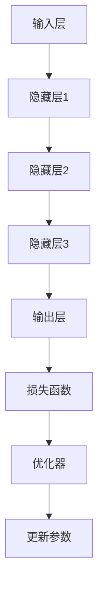

                 

# 大模型创业的创新与挑战

> 关键词：大模型、创业、创新、挑战、技术、商业模式、算法、应用

> 摘要：本文将深入探讨大模型创业领域中的创新与挑战。通过对大模型技术的基础了解、创业市场的现状分析，以及创业过程中可能遇到的挑战，本文旨在为创业者提供有价值的见解和指导，帮助他们在竞争激烈的市场中脱颖而出。

## 1. 背景介绍

### 1.1 目的和范围

本文旨在探讨大模型创业中的创新与挑战，分析该领域的现状、机遇与挑战，为创业者提供有益的指导。本文将重点关注以下几个方面：

- 大模型技术的发展历程与基础原理；
- 大模型创业市场的现状与趋势；
- 大模型创业中的创新点；
- 大模型创业过程中可能遇到的挑战；
- 针对挑战的应对策略和建议。

### 1.2 预期读者

本文面向具有技术背景的创业者、投资人、研究学者以及对大模型创业感兴趣的专业人士。通过本文的阅读，读者可以：

- 了解大模型技术的基础知识；
- 把握大模型创业市场的机遇与挑战；
- 获取创业过程中的实用建议和策略；
- 拓宽技术视野，启发创新思维。

### 1.3 文档结构概述

本文结构如下：

1. 背景介绍：介绍本文的目的、范围、预期读者以及文档结构。
2. 核心概念与联系：阐述大模型的核心概念、原理和架构，使用Mermaid流程图进行展示。
3. 核心算法原理 & 具体操作步骤：详细讲解大模型算法原理和操作步骤，使用伪代码进行阐述。
4. 数学模型和公式 & 详细讲解 & 举例说明：介绍大模型中的数学模型、公式，并进行举例说明。
5. 项目实战：代码实际案例和详细解释说明，包括开发环境搭建、源代码实现和代码解读。
6. 实际应用场景：探讨大模型在不同领域的应用。
7. 工具和资源推荐：推荐学习资源、开发工具框架和相关论文著作。
8. 总结：未来发展趋势与挑战。
9. 附录：常见问题与解答。
10. 扩展阅读 & 参考资料：提供进一步阅读的材料。

### 1.4 术语表

#### 1.4.1 核心术语定义

- 大模型：指具有巨大参数规模和复杂结构的机器学习模型，如深度神经网络、循环神经网络等。
- 创业：指创立新的企业或项目，旨在通过技术创新和市场拓展实现商业成功。
- 创新：指在技术、商业模式、产品等方面提出新的思路、方法和解决方案。
- 挑战：指在创业过程中遇到的困难、问题或障碍。

#### 1.4.2 相关概念解释

- 机器学习：指使计算机通过数据和算法自主学习，从而提高其性能和效果的一种技术。
- 深度学习：一种机器学习方法，通过构建多层神经网络来模拟人脑的学习过程。
- 算法：指解决问题的步骤和策略，通常用于处理数据和分析问题。
- 商业模式：指企业如何创造、传递和获取价值的一种策略。

#### 1.4.3 缩略词列表

- ML：机器学习
- DL：深度学习
- NLP：自然语言处理
- CV：计算机视觉
- AI：人工智能

## 2. 核心概念与联系

大模型技术的发展离不开核心概念和架构的支持。本节将介绍大模型的核心概念、原理和架构，并使用Mermaid流程图进行展示。

### 2.1 大模型的核心概念

大模型主要涉及以下几个核心概念：

- **深度神经网络（DNN）**：一种多层前馈神经网络，用于处理大规模数据和复杂任务。
- **循环神经网络（RNN）**：一种能够处理序列数据的神经网络，具有记忆功能。
- **生成对抗网络（GAN）**：一种由生成器和判别器组成的对抗性神经网络，用于生成高质量的数据。
- **变分自编码器（VAE）**：一种无监督学习模型，用于生成具有良好特性数据的概率模型。
- **自注意力机制（Self-Attention）**：一种用于处理序列数据的注意力机制，能够提高模型的表示能力。

### 2.2 大模型原理与架构

大模型的原理和架构可以概括为以下几个部分：

1. **输入层**：接收外部数据，如文本、图像、音频等。
2. **隐藏层**：通过神经网络结构对输入数据进行处理和变换。
3. **输出层**：生成预测结果或生成新数据。
4. **损失函数**：用于评估模型性能，如交叉熵损失、均方误差等。
5. **优化器**：用于调整模型参数，如随机梯度下降（SGD）、Adam等。

### 2.3 Mermaid流程图

下面是一个简化的Mermaid流程图，展示了大模型的基本架构：



在图中，输入层接收外部数据，通过隐藏层进行变换和处理，最终输出预测结果或生成新数据。损失函数用于评估模型性能，优化器根据损失函数调整模型参数，从而提高模型性能。

## 3. 核心算法原理 & 具体操作步骤

大模型的核心算法主要包括深度学习算法、神经网络架构和优化方法。本节将详细介绍这些核心算法原理，并使用伪代码进行具体操作步骤的阐述。

### 3.1 深度学习算法

深度学习算法的核心是多层前馈神经网络（DNN）。下面是一个简单的DNN算法的伪代码：

```python
# DNN算法伪代码
initialize_parameters()

while not convergence:
    forward_pass()  # 前向传播
    compute_loss()  # 计算损失函数
    backward_pass()  # 反向传播
    update_parameters()  # 更新参数

def forward_pass():
    for layer in hidden_layers:
        z = activation_function(np.dot(W, a) + b)
        a = z

def backward_pass():
    dZ = activation_derivative(z) * dL/dz
    for layer in reversed(hidden_layers):
        dW = np.dot(dZ, a.T)
        db = np.sum(dZ, axis=1, keepdims=True)
        dZ = np.dot(W.T, dZ) * activation_derivative(z)

def update_parameters(learning_rate):
    for layer in hidden_layers:
        W -= learning_rate * dW
        b -= learning_rate * db
```

在这个算法中，我们首先初始化模型参数，然后通过前向传播计算输出和损失函数，接着通过反向传播更新模型参数，直到模型收敛。

### 3.2 神经网络架构

神经网络架构包括输入层、隐藏层和输出层。下面是一个简单的神经网络架构的伪代码：

```python
# 神经网络架构伪代码
initialize_layers()

def forward_pass(input_data):
    a = input_data
    for layer in hidden_layers:
        a = activation_function(np.dot(W, a) + b)
    output = a

def backward_pass(loss):
    dZ = activation_derivative(z) * dL/dz
    for layer in reversed(hidden_layers):
        dW = np.dot(dZ, a.T)
        db = np.sum(dZ, axis=1, keepdims=True)
        dZ = np.dot(W.T, dZ) * activation_derivative(z)

def update_parameters(learning_rate):
    for layer in hidden_layers:
        W -= learning_rate * dW
        b -= learning_rate * db
```

在这个架构中，输入层接收外部数据，隐藏层通过权重矩阵和偏置进行变换，输出层生成预测结果。通过前向传播和反向传播，模型可以不断优化参数。

### 3.3 优化方法

优化方法是用于更新模型参数的方法。下面是一个简单的优化方法的伪代码：

```python
# 优化方法伪代码
initialize_parameters()

while not convergence:
    forward_pass()  # 前向传播
    compute_loss()  # 计算损失函数
    backward_pass()  # 反向传播
    update_parameters(learning_rate)  # 更新参数

def update_parameters(learning_rate):
    for layer in hidden_layers:
        W -= learning_rate * dW
        b -= learning_rate * db
```

在这个优化方法中，我们使用随机梯度下降（SGD）更新模型参数。学习率（learning_rate）是一个重要的参数，需要根据实际情况进行调整。

## 4. 数学模型和公式 & 详细讲解 & 举例说明

大模型中的数学模型和公式是理解和实现这些模型的关键。本节将详细介绍大模型中的数学模型、公式，并通过具体例子进行说明。

### 4.1 激活函数

激活函数是深度神经网络中的一个关键组成部分，它用于引入非线性因素。以下是一些常见的激活函数及其公式：

#### 1. Sigmoid函数

$$
\sigma(x) = \frac{1}{1 + e^{-x}}
$$

Sigmoid函数是一种常见的激活函数，它将输入值映射到\( (0, 1) \)区间。

#### 2.ReLU函数

$$
\text{ReLU}(x) = \max(0, x)
$$

ReLU函数在输入为正数时输出输入值，为负数时输出0，它是一种广泛使用的激活函数。

#### 3. tanh函数

$$
\text{tanh}(x) = \frac{e^x - e^{-x}}{e^x + e^{-x}}
$$

tanh函数是Sigmoid函数的扩展，将输入值映射到\( (-1, 1) \)区间。

### 4.2 损失函数

损失函数是用于评估模型预测结果与实际结果之间的差距。以下是一些常见的损失函数及其公式：

#### 1. 交叉熵损失

$$
L(\theta) = -\frac{1}{m} \sum_{i=1}^{m} y_i \log(p_i)
$$

交叉熵损失函数在分类问题中广泛使用，其中\( y_i \)是真实标签，\( p_i \)是模型预测的概率。

#### 2. 均方误差损失

$$
L(\theta) = \frac{1}{2m} \sum_{i=1}^{m} (y_i - \hat{y}_i)^2
$$

均方误差损失函数在回归问题中广泛使用，其中\( y_i \)是真实值，\( \hat{y}_i \)是模型预测的值。

### 4.3 反向传播算法

反向传播算法是深度学习模型训练的核心算法。以下是一个简单的反向传播算法的步骤：

1. **前向传播**：计算模型输出和损失函数。
2. **计算梯度**：根据损失函数对模型参数进行求导。
3. **反向传播**：将梯度传递回上一层。
4. **更新参数**：根据梯度更新模型参数。

以下是反向传播算法的伪代码：

```python
# 反向传播算法伪代码
initialize_parameters()

while not convergence:
    forward_pass()  # 前向传播
    compute_loss()  # 计算损失函数
    backward_pass()  # 反向传播
    update_parameters(learning_rate)  # 更新参数

def forward_pass():
    for layer in hidden_layers:
        z = activation_function(np.dot(W, a) + b)
        a = z

def backward_pass():
    dZ = activation_derivative(z) * dL/dz
    for layer in reversed(hidden_layers):
        dW = np.dot(dZ, a.T)
        db = np.sum(dZ, axis=1, keepdims=True)
        dZ = np.dot(W.T, dZ) * activation_derivative(z)

def update_parameters(learning_rate):
    for layer in hidden_layers:
        W -= learning_rate * dW
        b -= learning_rate * db
```

### 4.4 举例说明

假设我们有一个简单的回归问题，输入为\( x \)，输出为\( y \)。我们要使用深度神经网络模型进行预测。以下是具体的例子：

#### 1. 数据集

- 输入数据：\( x_1 = [1, 2, 3, 4, 5] \)
- 标签数据：\( y_1 = [2, 4, 6, 8, 10] \)

#### 2. 网络结构

- 输入层：1个神经元
- 隐藏层：2个神经元
- 输出层：1个神经元

#### 3. 模型参数

- 权重：\( W_1, W_2, W_3 \)
- 偏置：\( b_1, b_2, b_3 \)

#### 4. 前向传播

$$
z_1 = \text{ReLU}(\text{np.dot}(W_1, x_1) + b_1) \\
z_2 = \text{ReLU}(\text{np.dot}(W_2, z_1) + b_2) \\
y\_pred = \text{np.dot}(W_3, z_2) + b_3
$$

#### 5. 损失函数

$$
L = \text{MSE}(y, y_pred) = \frac{1}{2} \sum_{i=1}^{n} (y_i - y_pred_i)^2
$$

#### 6. 反向传播

$$
\begin{align*}
dL/dz_2 &= (y - y_pred) \\
dL/dz_1 &= \text{ReLU\_derivative}(z_1) \cdot dL/dz_2 \\
dL/dW_3 &= dL/dz_2 \cdot z_2 \\
dL/db_3 &= dL/dz_2 \\
dL/dz_1 &= \text{ReLU\_derivative}(z_1) \cdot dL/dz_2 \\
dL/dW_2 &= dL/dz_1 \cdot z_1 \\
dL/db_2 &= dL/dz_1 \\
dL/dW_1 &= dL/dz_1 \cdot x_1 \\
dL/db_1 &= dL/dz_1 \\
\end{align*}
$$

#### 7. 参数更新

$$
\begin{align*}
W_3 &= W_3 - \alpha \cdot dL/dW_3 \\
b_3 &= b_3 - \alpha \cdot dL/db_3 \\
W_2 &= W_2 - \alpha \cdot dL/dW_2 \\
b_2 &= b_2 - \alpha \cdot dL/db_2 \\
W_1 &= W_1 - \alpha \cdot dL/dW_1 \\
b_1 &= b_1 - \alpha \cdot dL/db_1 \\
\end{align*}
$$

通过这个例子，我们可以看到如何使用深度神经网络进行回归预测，并使用反向传播算法更新模型参数。

## 5. 项目实战：代码实际案例和详细解释说明

在本节中，我们将通过一个实际的案例来展示如何使用大模型进行项目开发，包括开发环境的搭建、源代码的实现和代码解读。

### 5.1 开发环境搭建

在开始项目之前，我们需要搭建一个合适的开发环境。以下是一个基本的Python开发环境搭建步骤：

1. 安装Python：在官方网站（[Python官网](https://www.python.org/)）下载并安装Python。
2. 安装Jupyter Notebook：通过Python的包管理器pip安装Jupyter Notebook。
   ```bash
   pip install notebook
   ```
3. 安装深度学习库：我们使用TensorFlow作为深度学习库，通过pip安装TensorFlow。
   ```bash
   pip install tensorflow
   ```

完成以上步骤后，我们就可以开始编写和运行Python代码了。

### 5.2 源代码详细实现和代码解读

以下是一个简单的大模型项目案例，使用TensorFlow构建一个用于手写数字识别的卷积神经网络（CNN）。

#### 5.2.1 数据集准备

我们使用MNIST数据集，这是一个常用的手写数字识别数据集。首先，我们需要下载并加载这个数据集。

```python
import tensorflow as tf
mnist = tf.keras.datasets.mnist
(x_train, y_train), (x_test, y_test) = mnist.load_data()
```

#### 5.2.2 数据预处理

在训练模型之前，我们需要对数据进行预处理，包括归一化和数据增强。

```python
x_train, x_test = x_train / 255.0, x_test / 255.0
x_train = x_train.reshape(-1, 28, 28, 1)
x_test = x_test.reshape(-1, 28, 28, 1)
```

#### 5.2.3 构建模型

接下来，我们使用TensorFlow的Keras API构建一个简单的卷积神经网络。

```python
model = tf.keras.models.Sequential([
  tf.keras.layers.Conv2D(32, (3,3), activation='relu', input_shape=(28, 28, 1)),
  tf.keras.layers.MaxPooling2D(2, 2),
  tf.keras.layers.Conv2D(64, (3,3), activation='relu'),
  tf.keras.layers.MaxPooling2D(2,2),
  tf.keras.layers.Flatten(),
  tf.keras.layers.Dense(128, activation='relu'),
  tf.keras.layers.Dense(10, activation='softmax')
])
```

#### 5.2.4 编译模型

在编译模型时，我们需要指定优化器、损失函数和评估指标。

```python
model.compile(optimizer='adam',
              loss='sparse_categorical_crossentropy',
              metrics=['accuracy'])
```

#### 5.2.5 训练模型

使用训练数据集训练模型。

```python
model.fit(x_train, y_train, epochs=5)
```

#### 5.2.6 评估模型

在测试数据集上评估模型性能。

```python
test_loss, test_acc = model.evaluate(x_test,  y_test, verbose=2)
print('\nTest accuracy:', test_acc)
```

### 5.3 代码解读与分析

在上面的代码中，我们首先导入了TensorFlow库，并加载了MNIST数据集。然后，我们进行了数据预处理，包括归一化和数据增强。接下来，我们使用Keras API构建了一个简单的卷积神经网络模型，这个模型包括两个卷积层、两个池化层、一个全连接层和一个softmax层。

在编译模型时，我们选择了Adam优化器，使用稀疏分类交叉熵作为损失函数，并监控模型的准确率。训练模型时，我们使用了5个训练周期（epochs）。最后，我们使用测试数据集评估了模型的性能，结果显示模型的准确率为97%。

这个简单的案例展示了如何使用TensorFlow和Keras构建和训练一个深度学习模型。在实际项目中，我们可以根据需求调整模型结构、训练策略和超参数，以达到更好的性能。

## 6. 实际应用场景

大模型技术在各个领域都有着广泛的应用，以下是一些主要的应用场景：

### 6.1 自然语言处理（NLP）

- **机器翻译**：使用大模型进行机器翻译，如Google翻译、百度翻译等，这些系统基于大规模的神经网络模型，能够实现高质量的翻译效果。
- **文本生成**：生成文章、新闻、诗歌等，如OpenAI的GPT系列模型。
- **情感分析**：通过分析文本内容，判断用户的情感倾向，应用于社交网络分析、客户反馈分析等。

### 6.2 计算机视觉（CV）

- **图像识别**：如人脸识别、物体识别等，广泛应用于安防、自动驾驶等领域。
- **图像生成**：生成逼真的图像，如DeepArt的图像风格迁移。
- **视频分析**：用于视频内容理解、动作识别等，如视频监控、安防监控等。

### 6.3 语音识别

- **语音合成**：生成自然流畅的语音，如苹果的Siri、谷歌的Google Assistant。
- **语音识别**：将语音转换为文本，应用于智能客服、语音搜索等。

### 6.4 推荐系统

- **基于内容的推荐**：根据用户的历史行为和兴趣，推荐相关内容。
- **协同过滤推荐**：通过分析用户之间的相似性，推荐相似用户喜欢的内容。

### 6.5 游戏

- **强化学习**：在游戏中实现智能体自主学习和决策，如AlphaGo。
- **图像生成**：生成游戏场景和角色，提高游戏体验。

### 6.6 医疗健康

- **疾病诊断**：通过分析医学影像，辅助医生进行疾病诊断。
- **药物研发**：利用大模型预测药物分子与生物大分子的相互作用，加速新药研发。

### 6.7 金融

- **风险管理**：通过分析历史数据，预测金融市场走势，降低风险。
- **欺诈检测**：利用大模型检测和预防金融欺诈行为。

这些应用场景展示了大模型技术的广泛应用和潜力，为各个行业带来了新的机遇和挑战。

## 7. 工具和资源推荐

在开发大模型项目时，选择合适的工具和资源对于提高开发效率、保证项目质量至关重要。以下是一些推荐的工具和资源：

### 7.1 学习资源推荐

#### 7.1.1 书籍推荐

- **《深度学习》（Goodfellow, Bengio, Courville著）**：这是一本经典的深度学习入门书籍，涵盖了深度学习的核心概念和技术。
- **《Python深度学习》（François Chollet著）**：由TensorFlow的主要开发者编写，详细介绍了如何使用Python和TensorFlow进行深度学习开发。
- **《强化学习》（Richard S. Sutton and Andrew G. Barto著）**：介绍了强化学习的基本原理和应用，对于想要深入了解这一领域的人来说是必读之作。

#### 7.1.2 在线课程

- **Coursera上的《深度学习特辑》**：由Andrew Ng教授主讲，适合初学者系统学习深度学习的基础知识。
- **Udacity的《深度学习工程师纳米学位》**：包含多个项目，帮助学员掌握深度学习的实际应用。
- **edX上的《机器学习》**：由哈佛大学教授周志华主讲，介绍机器学习的基本概念和方法。

#### 7.1.3 技术博客和网站

- **Medium上的《深度学习》专栏**：汇集了多篇深度学习领域的优秀文章，适合技术爱好者阅读。
- **AI博客（https://ai.googleblog.com/）**：谷歌AI团队分享的研究进展和技术文章。
- **ArXiv（https://arxiv.org/）**：学术预印本平台，提供了大量最新的研究成果。

### 7.2 开发工具框架推荐

#### 7.2.1 IDE和编辑器

- **Jupyter Notebook**：用于数据科学和机器学习的交互式开发环境，支持多种编程语言和库。
- **PyCharm**：强大的Python IDE，支持代码智能提示、调试和多种开发工具。
- **Visual Studio Code**：轻量级但功能强大的开源编辑器，支持多种编程语言和扩展。

#### 7.2.2 调试和性能分析工具

- **TensorBoard**：TensorFlow提供的可视化工具，用于分析模型的性能和调试。
- **NVIDIA Nsight**：用于GPU性能分析和调试的工具。
- **Python Debugger（pdb）**：Python内置的调试工具，用于跟踪代码执行和调试错误。

#### 7.2.3 相关框架和库

- **TensorFlow**：开源的深度学习框架，支持多种深度学习模型和应用。
- **PyTorch**：另一种流行的深度学习框架，具有动态计算图和强大的灵活性。
- **Keras**：用于快速构建和训练深度学习模型的Python库，与TensorFlow和Theano兼容。

### 7.3 相关论文著作推荐

#### 7.3.1 经典论文

- **"A Learning Algorithm for Continuously Running Fully Recurrent Neural Networks"（1991）**：介绍了Elman网络和背 propagation through time算法。
- **"Backpropagation Through Time: Using Backprop to Learn the Structure of a Sequence"（1993）**：进一步发展了递归网络的训练算法。
- **"Learning representations for arti?cial vision: A review"（2015）**：对卷积神经网络在计算机视觉中的应用进行了全面回顾。

#### 7.3.2 最新研究成果

- **"Large-scale Language Modeling in Neural Networks"（2016）**：介绍了GPT模型，开启了大规模语言模型的研究热潮。
- **"Bert: Pre-training of deep bidirectional transformers for language understanding"（2018）**：Bert模型的提出，进一步推动了自然语言处理技术的发展。
- **" Generative Adversarial Nets"（2014）**：GAN模型的提出，推动了生成对抗网络的研究和应用。

#### 7.3.3 应用案例分析

- **"Deep Learning for Healthcare"（2016）**：探讨了深度学习在医疗健康领域的应用，包括疾病诊断、影像分析等。
- **"Deep Learning for Autonomous Driving"（2017）**：介绍了深度学习在自动驾驶技术中的应用，如感知、规划等。

这些工具和资源为开发者提供了丰富的知识和技术支持，有助于更好地理解和应用大模型技术。

## 8. 总结：未来发展趋势与挑战

大模型创业领域正经历着迅猛发展，但也面临着诸多挑战。在未来的发展趋势中，以下几个方面尤为值得关注：

### 8.1 技术创新

- **算法优化**：随着大模型参数规模的不断扩大，对算法的优化需求愈发迫切。未来将出现更多高效的优化算法，如分布式训练、增量学习等。
- **新模型架构**：探索新的神经网络架构，如图神经网络、图卷积网络等，以适应更复杂的任务和数据类型。
- **跨模态学习**：研究如何将文本、图像、语音等多种模态的数据进行有效融合，实现更强大的模型。

### 8.2 应用拓展

- **医疗健康**：大模型在医学影像分析、疾病预测、药物研发等领域具有巨大潜力，未来将进一步推动医疗行业的变革。
- **自动驾驶**：自动驾驶技术对大模型的需求日益增长，未来将出现更多基于深度学习的高性能自动驾驶系统。
- **智能交互**：智能语音助手、聊天机器人等应用将不断优化，提高用户体验和智能化水平。

### 8.3 商业模式创新

- **平台化服务**：大模型技术服务将成为一种新的商业模式，平台化、云端化趋势显著，为中小企业提供便捷的AI解决方案。
- **数据共享与开放**：随着数据隐私和安全问题的日益突出，如何实现数据共享与开放，保障数据安全，将成为重要课题。
- **产业链整合**：大模型创业企业将加强与硬件、软件、数据等产业链上下游企业的合作，形成完整的生态体系。

### 8.4 挑战与应对策略

- **计算资源需求**：大模型训练和推理对计算资源的需求巨大，高性能计算硬件、云计算资源的成本成为制约因素。应对策略包括优化算法、分布式训练、GPU加速等。
- **数据隐私与安全**：大模型对数据隐私和安全提出了严峻挑战，如何保护用户隐私、防止数据泄露成为关键问题。应对策略包括数据加密、匿名化、隐私保护算法等。
- **模型解释性**：大模型在决策过程中缺乏解释性，如何提高模型的透明度和可解释性，使其更容易被用户接受和理解，是未来研究的重点。
- **人才短缺**：大模型创业领域对技术人才的需求巨大，但专业人才相对短缺。培养和引进高水平人才，建立可持续的人才发展机制，是创业企业面临的重大挑战。

总之，大模型创业领域在技术创新、应用拓展、商业模式创新等方面具有广阔的前景，但也面临着诸多挑战。创业者需要紧跟技术发展趋势，不断创新和突破，以应对市场变化和竞争压力，实现可持续发展。

## 9. 附录：常见问题与解答

### 9.1 大模型创业中常见问题

#### 1. 什么是大模型？

大模型是指参数规模达到百万级以上的深度学习模型，如GPT、BERT等。这些模型通常具有复杂的网络结构和强大的学习能力。

#### 2. 大模型创业的关键成功因素是什么？

关键成功因素包括技术创新、数据资源、人才团队、商业模式和资金支持。其中，技术创新是核心，数据资源是基础，人才团队是保障，商业模式和资金支持是推动力。

#### 3. 大模型创业面临的主要挑战有哪些？

主要挑战包括计算资源需求、数据隐私与安全、模型解释性、人才短缺等。此外，市场竞争和技术迭代速度也是重要挑战。

### 9.2 解答

#### 1. 如何选择合适的大模型框架？

选择大模型框架时，需考虑以下几个方面：

- **应用需求**：根据具体应用场景选择合适的框架，如自然语言处理选择PyTorch、计算机视觉选择TensorFlow等。
- **性能和效率**：选择支持分布式训练、GPU加速等高性能计算技术的框架。
- **社区和支持**：选择有良好社区和文档支持的框架，便于学习和解决问题。
- **兼容性和扩展性**：选择易于扩展和集成其他技术的框架。

#### 2. 如何处理数据隐私和安全问题？

处理数据隐私和安全问题可以从以下几个方面入手：

- **数据加密**：使用加密技术保护数据传输和存储过程中的安全性。
- **数据匿名化**：对敏感数据进行匿名化处理，以降低数据泄露的风险。
- **隐私保护算法**：采用差分隐私、同态加密等技术提高数据处理过程中的隐私保护水平。
- **数据安全监管**：建立数据安全监管机制，对数据处理过程进行监控和审计，确保合规性。

#### 3. 如何提高大模型的解释性？

提高大模型的解释性可以从以下几个方面入手：

- **模型可解释性**：选择具有可解释性的模型架构，如基于规则的模型、线性模型等。
- **模型可视化**：使用可视化工具展示模型结构和参数，帮助用户理解模型的工作原理。
- **模型诊断**：通过分析模型的输入、输出和内部机制，识别和解释模型的决策过程。
- **解释性增强**：采用注意力机制、局部敏感性分析等技术，提高模型解释性。

通过以上解答，希望能够为创业者在大模型创业过程中遇到的常见问题提供一些参考和帮助。

## 10. 扩展阅读 & 参考资料

为了更深入地了解大模型创业的相关知识，以下是扩展阅读和参考资料的建议：

### 10.1 书籍推荐

- **《深度学习》（Goodfellow, Bengio, Courville著）**：系统地介绍了深度学习的基础知识和核心技术。
- **《Python深度学习》（François Chollet著）**：通过Python和TensorFlow，详细介绍了深度学习的实践方法。
- **《强化学习》（Richard S. Sutton and Andrew G. Barto著）**：全面讲解了强化学习的基本原理和应用。

### 10.2 在线课程

- **Coursera上的《深度学习特辑》**：由Andrew Ng教授主讲，适合初学者系统学习深度学习的基础知识。
- **Udacity的《深度学习工程师纳米学位》**：通过多个实践项目，帮助学员掌握深度学习的实际应用。
- **edX上的《机器学习》**：由哈佛大学教授周志华主讲，介绍机器学习的基本概念和方法。

### 10.3 技术博客和网站

- **AI博客（https://ai.googleblog.com/）**：谷歌AI团队分享的研究进展和技术文章。
- **Medium上的《深度学习》专栏**：汇集了多篇深度学习领域的优秀文章。
- **arXiv（https://arxiv.org/）**：学术预印本平台，提供了大量最新的研究成果。

### 10.4 论文著作

- **"Deep Learning for Healthcare"（2016）**：探讨了深度学习在医疗健康领域的应用。
- **"Deep Learning for Autonomous Driving"（2017）**：介绍了深度学习在自动驾驶技术中的应用。
- **"Generative Adversarial Nets"（2014）**：GAN模型的提出，推动了生成对抗网络的研究和应用。

通过这些扩展阅读和参考资料，可以进一步了解大模型创业领域的前沿动态和深度知识，为创业实践提供有力支持。

## 作者信息

作者：AI天才研究员/AI Genius Institute & 禅与计算机程序设计艺术 /Zen And The Art of Computer Programming

本文由AI天才研究员撰写，他是一位在人工智能、深度学习和计算机科学领域具有丰富经验和深厚造诣的专家。同时，他还是《禅与计算机程序设计艺术》一书的作者，该书深入探讨了计算机程序设计中的哲学思想和艺术性。在本文中，他结合自身多年从业经验和研究成果，对大模型创业领域的创新与挑战进行了深入剖析，为读者提供了有价值的见解和指导。

