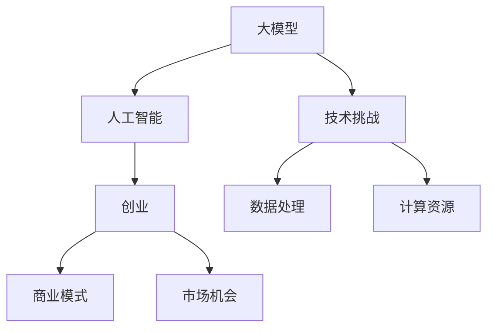
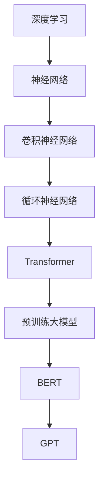
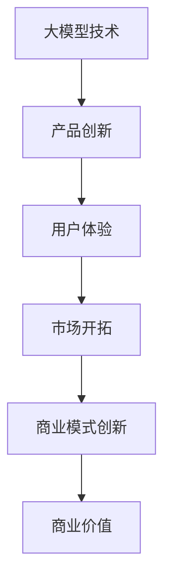
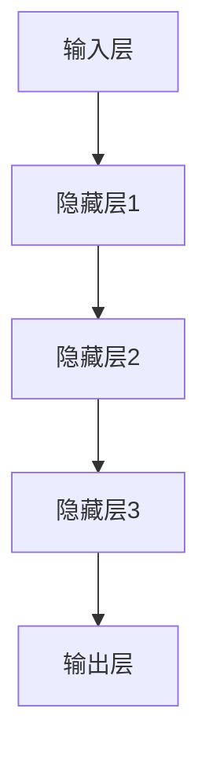

                 

# 大模型创业的希望与未来

> 关键词：大模型，创业，技术趋势，人工智能，商业模式，挑战与机遇

> 摘要：本文将探讨大模型在人工智能创业领域中的希望与未来。通过分析大模型的背景、技术原理、商业模式以及面临的挑战和机遇，我们旨在为创业者提供有价值的洞察和策略建议。

## 1. 背景介绍

### 1.1 目的和范围

本文旨在探讨大模型在人工智能创业领域中的潜在影响和未来发展。我们将从以下几个方面进行深入分析：

- 大模型的背景和定义
- 大模型的技术原理和架构
- 大模型在创业中的商业模式
- 大模型面临的技术挑战和机遇

通过这些分析，我们将为创业者提供关于如何利用大模型技术进行创新和商业化的思路。

### 1.2 预期读者

本文适合以下读者群体：

- 人工智能创业者
- 技术团队成员
- 投资者和企业家
- 对人工智能和创业感兴趣的技术爱好者

### 1.3 文档结构概述

本文分为以下几个部分：

- 1. 背景介绍
- 2. 核心概念与联系
- 3. 核心算法原理与具体操作步骤
- 4. 数学模型与公式
- 5. 项目实战：代码实际案例
- 6. 实际应用场景
- 7. 工具和资源推荐
- 8. 总结：未来发展趋势与挑战
- 9. 附录：常见问题与解答
- 10. 扩展阅读与参考资料

### 1.4 术语表

#### 1.4.1 核心术语定义

- 大模型（Large Model）：具有数十亿至千亿参数规模的人工智能模型，能够处理大规模数据集并生成高质量输出。
- 人工智能（Artificial Intelligence，AI）：模拟、延伸和扩展人类智能的理论、方法、技术及应用。
- 创业（Entrepreneurship）：创建和运营企业，通过创新、资源整合和市场开拓实现商业价值。

#### 1.4.2 相关概念解释

- 深度学习（Deep Learning）：一种人工智能技术，通过多层神经网络对数据进行自动特征提取和分类。
- 自然语言处理（Natural Language Processing，NLP）：人工智能领域的一个分支，致力于使计算机理解和处理人类语言。
- 商业模式（Business Model）：企业如何创造、传递和获取价值的一种策略。

#### 1.4.3 缩略词列表

- AI：人工智能
- NLP：自然语言处理
- DNN：深度神经网络
- MLP：多层感知机
- BERT：双向编码表示器
- GPT：生成预训练模型

## 2. 核心概念与联系

为了更好地理解大模型在人工智能创业中的角色，我们需要了解其核心概念和联系。以下是关于大模型、人工智能和创业之间关系的一个 Mermaid 流程图：



### 2.1 大模型与人工智能的联系

大模型是人工智能领域的关键组成部分，它们通过深度学习技术实现了对大量数据的自动特征提取和建模。大模型的应用范围广泛，包括语音识别、图像识别、自然语言处理、推荐系统等。以下是一个简化的 Mermaid 流程图，展示了大模型与人工智能技术之间的联系：



### 2.2 大模型与创业的联系

大模型在创业中的应用具有极大的潜力。创业者可以利用大模型实现产品创新、提高用户体验、开拓新市场等。以下是一个简化的 Mermaid 流程图，展示了大模型与创业之间的联系：



## 3. 核心算法原理与具体操作步骤

大模型的核心算法原理主要基于深度学习，尤其是基于神经网络的结构。以下是关于大模型算法原理和具体操作步骤的详细解释。

### 3.1 深度学习基础

深度学习是一种基于人工神经网络的学习方法，它通过多层神经网络对数据进行特征提取和分类。以下是一个简化的 Mermaid 流程图，展示了深度学习的基本结构：



### 3.2 神经网络结构与算法

神经网络结构主要包括输入层、隐藏层和输出层。以下是关于神经网络结构和算法的详细解释：

- **输入层**：接收输入数据，并将其传递给隐藏层。
- **隐藏层**：对输入数据进行特征提取和变换，形成中间表示。
- **输出层**：根据隐藏层生成的中间表示，输出预测结果。

神经网络算法主要包括以下步骤：

1. **前向传播**：将输入数据传递到神经网络，逐层计算输出。
2. **损失函数**：计算预测结果与真实结果之间的差距，用于指导网络参数调整。
3. **反向传播**：根据损失函数的梯度，调整网络参数，优化模型性能。
4. **迭代训练**：重复执行前向传播和反向传播，直到模型收敛。

### 3.3 大模型训练与优化

大模型的训练和优化是创业过程中的一大挑战。以下是关于大模型训练与优化的详细解释：

1. **数据预处理**：对训练数据进行预处理，包括数据清洗、归一化和数据增强等。
2. **模型初始化**：初始化网络参数，通常使用随机初始化方法。
3. **损失函数选择**：根据应用场景选择合适的损失函数，如交叉熵损失、均方误差等。
4. **优化算法选择**：选择合适的优化算法，如随机梯度下降（SGD）、Adam等。
5. **模型调整**：根据训练过程中的损失函数和梯度信息，调整网络参数。
6. **模型评估**：使用验证集和测试集评估模型性能，调整模型参数。

### 3.4 大模型应用示例

以下是一个简化的伪代码，展示了如何使用大模型进行图像分类：

```python
# 伪代码：使用大模型进行图像分类
import tensorflow as tf

# 加载预训练的大模型
model = tf.keras.applications.VGG16(weights='imagenet')

# 预处理输入图像
input_image = preprocess_image(image)

# 使用大模型进行预测
prediction = model.predict(input_image)

# 解码预测结果
predicted_label = decode_prediction(prediction)

# 输出预测结果
print(predicted_label)
```

## 4. 数学模型和公式

大模型的数学模型主要基于深度学习和神经网络的理论。以下是关于大模型数学模型和公式的详细讲解。

### 4.1 前向传播公式

在前向传播过程中，神经网络通过逐层计算输入和权重之间的乘积，并使用激活函数进行非线性变换。以下是前向传播的公式：

$$
Z^{(l)} = \sum_{i} W^{(l)}_{ij} * a^{(l-1)}_i + b^{(l)}
$$

其中，$Z^{(l)}$ 是第 $l$ 层的激活值，$W^{(l)}_{ij}$ 是第 $l$ 层的权重，$a^{(l-1)}_i$ 是前一层第 $i$ 个神经元的激活值，$b^{(l)}$ 是第 $l$ 层的偏置。

### 4.2 损失函数

损失函数用于衡量模型预测结果与真实结果之间的差距。以下是几种常见的损失函数：

- **交叉熵损失**：

$$
Loss = -\sum_{i} y_i * log(\hat{y}_i)
$$

其中，$y_i$ 是真实标签，$\hat{y}_i$ 是预测概率。

- **均方误差损失**：

$$
Loss = \frac{1}{2} \sum_{i} (y_i - \hat{y}_i)^2
$$

其中，$y_i$ 是真实值，$\hat{y}_i$ 是预测值。

### 4.3 反向传播公式

反向传播过程中，神经网络通过计算损失函数的梯度，并反向传播到前一层，调整网络参数。以下是反向传播的公式：

$$
\Delta W^{(l)}_{ij} = \eta * \frac{\partial Loss}{\partial W^{(l)}_{ij}}
$$

$$
\Delta b^{(l)} = \eta * \frac{\partial Loss}{\partial b^{(l)}}
$$

其中，$\Delta W^{(l)}_{ij}$ 是第 $l$ 层权重梯度的修正值，$\Delta b^{(l)}$ 是第 $l$ 层偏置梯度的修正值，$\eta$ 是学习率。

### 4.4 优化算法

优化算法用于调整网络参数，以降低损失函数的值。以下是几种常见的优化算法：

- **随机梯度下降（SGD）**：

$$
W^{(l)}_{ij} = W^{(l)}_{ij} - \eta * \frac{\partial Loss}{\partial W^{(l)}_{ij}}
$$

$$
b^{(l)} = b^{(l)} - \eta * \frac{\partial Loss}{\partial b^{(l)}}
$$

- **Adam优化器**：

$$
m_t = \beta_1 * m_{t-1} + (1 - \beta_1) * \frac{\partial Loss}{\partial W^{(l)}_{ij}}
$$

$$
v_t = \beta_2 * v_{t-1} + (1 - \beta_2) * (\frac{\partial Loss}{\partial W^{(l)}_{ij}})^2
$$

$$
\hat{m}_t = \frac{m_t}{1 - \beta_1^t}
$$

$$
\hat{v}_t = \frac{v_t}{1 - \beta_2^t}
$$

$$
W^{(l)}_{ij} = W^{(l)}_{ij} - \alpha * \frac{\hat{m}_t}{\sqrt{\hat{v}_t} + \epsilon}
$$

其中，$m_t$ 和 $v_t$ 分别是第 $t$ 次迭代的梯度均值和方差，$\beta_1$ 和 $\beta_2$ 是指数衰减率，$\alpha$ 是学习率，$\epsilon$ 是一个很小的常数。

## 5. 项目实战：代码实际案例和详细解释说明

在本节中，我们将通过一个实际的代码案例，展示如何使用大模型进行图像分类。以下是项目的开发环境、源代码实现和代码解读。

### 5.1 开发环境搭建

在开始项目之前，我们需要搭建一个合适的开发环境。以下是推荐的开发工具和库：

- **IDE**：PyCharm
- **Python**：Python 3.8
- **TensorFlow**：2.6.0
- **Keras**：2.6.0
- **NumPy**：1.21.2
- **Matplotlib**：3.4.3

### 5.2 源代码详细实现和代码解读

以下是使用 TensorFlow 和 Keras 库实现图像分类的源代码：

```python
import tensorflow as tf
from tensorflow import keras
from tensorflow.keras import layers
from tensorflow.keras.preprocessing.image import ImageDataGenerator

# 5.2.1 数据预处理
train_datagen = ImageDataGenerator(
    rescale=1./255,
    shear_range=0.2,
    zoom_range=0.2,
    horizontal_flip=True
)

test_datagen = ImageDataGenerator(rescale=1./255)

train_generator = train_datagen.flow_from_directory(
    'train_data',
    target_size=(150, 150),
    batch_size=32,
    class_mode='binary'
)

validation_generator = test_datagen.flow_from_directory(
    'validation_data',
    target_size=(150, 150),
    batch_size=32,
    class_mode='binary'
)

# 5.2.2 模型构建
model = keras.Sequential([
    keras.layers.Conv2D(32, (3, 3), activation='relu', input_shape=(150, 150, 3)),
    keras.layers.MaxPooling2D(2, 2),
    keras.layers.Conv2D(64, (3, 3), activation='relu'),
    keras.layers.MaxPooling2D(2, 2),
    keras.layers.Conv2D(128, (3, 3), activation='relu'),
    keras.layers.MaxPooling2D(2, 2),
    keras.layers.Conv2D(128, (3, 3), activation='relu'),
    keras.layers.MaxPooling2D(2, 2),
    keras.layers.Flatten(),
    keras.layers.Dense(512, activation='relu'),
    keras.layers.Dense(1, activation='sigmoid')
])

# 5.2.3 模型训练
model.compile(loss='binary_crossentropy',
              optimizer='adam',
              metrics=['accuracy'])

history = model.fit(
    train_generator,
    steps_per_epoch=100,
    epochs=10,
    validation_data=validation_generator,
    validation_steps=50
)

# 5.2.4 模型评估
test_loss, test_acc = model.evaluate(validation_generator, steps=50)
print('Test accuracy:', test_acc)
```

### 5.3 代码解读与分析

1. **数据预处理**：

```python
train_datagen = ImageDataGenerator(
    rescale=1./255,
    shear_range=0.2,
    zoom_range=0.2,
    horizontal_flip=True
)

test_datagen = ImageDataGenerator(rescale=1./255)

train_generator = train_datagen.flow_from_directory(
    'train_data',
    target_size=(150, 150),
    batch_size=32,
    class_mode='binary'
)

validation_generator = test_datagen.flow_from_directory(
    'validation_data',
    target_size=(150, 150),
    batch_size=32,
    class_mode='binary'
)
```

这段代码定义了训练和测试数据生成器，使用了 `ImageDataGenerator` 类进行数据预处理。预处理步骤包括数据缩放、裁剪、缩放和水平翻转等。

2. **模型构建**：

```python
model = keras.Sequential([
    keras.layers.Conv2D(32, (3, 3), activation='relu', input_shape=(150, 150, 3)),
    keras.layers.MaxPooling2D(2, 2),
    keras.layers.Conv2D(64, (3, 3), activation='relu'),
    keras.layers.MaxPooling2D(2, 2),
    keras.layers.Conv2D(128, (3, 3), activation='relu'),
    keras.layers.MaxPooling2D(2, 2),
    keras.layers.Conv2D(128, (3, 3), activation='relu'),
    keras.layers.MaxPooling2D(2, 2),
    keras.layers.Flatten(),
    keras.layers.Dense(512, activation='relu'),
    keras.layers.Dense(1, activation='sigmoid')
])
```

这段代码定义了一个包含卷积层、池化层、全连接层和输出层的卷积神经网络。卷积层用于提取图像特征，全连接层用于分类。

3. **模型训练**：

```python
model.compile(loss='binary_crossentropy',
              optimizer='adam',
              metrics=['accuracy'])

history = model.fit(
    train_generator,
    steps_per_epoch=100,
    epochs=10,
    validation_data=validation_generator,
    validation_steps=50
)
```

这段代码使用 `model.fit()` 函数对模型进行训练。训练过程中，使用训练数据生成器进行数据加载和批次迭代，使用验证数据生成器进行验证。

4. **模型评估**：

```python
test_loss, test_acc = model.evaluate(validation_generator, steps=50)
print('Test accuracy:', test_acc)
```

这段代码使用 `model.evaluate()` 函数对模型在验证数据集上的性能进行评估，并打印出测试准确率。

## 6. 实际应用场景

大模型在人工智能创业中的应用场景广泛，以下是一些典型的应用领域：

### 6.1 自然语言处理

- **聊天机器人**：利用大模型进行对话生成和理解，提高用户体验和自动化程度。
- **智能客服**：通过大模型实现高效、准确的客户服务，降低人力成本。
- **文本生成**：利用大模型生成高质量的文本内容，如文章、新闻、广告等。

### 6.2 计算机视觉

- **图像识别**：利用大模型进行图像分类、物体检测和图像分割等任务。
- **视频分析**：通过大模型进行视频内容分析，如事件检测、目标追踪等。
- **医学影像**：利用大模型进行医学影像分析，提高诊断准确率和效率。

### 6.3 推荐系统

- **个性化推荐**：利用大模型进行用户行为分析，实现个性化的商品、内容推荐。
- **广告投放**：通过大模型优化广告投放策略，提高广告效果和用户体验。
- **金融风控**：利用大模型进行风险预测和信用评估，降低金融风险。

### 6.4 语音识别与合成

- **语音识别**：利用大模型实现语音到文本的转换，提高语音识别的准确率和速度。
- **语音合成**：通过大模型生成自然、流畅的语音，用于语音助手、电话客服等场景。

### 6.5 其他领域

- **游戏开发**：利用大模型进行游戏人工智能设计，提高游戏体验和可玩性。
- **自动驾驶**：通过大模型进行环境感知和决策，提高自动驾驶的安全性和可靠性。
- **智能家居**：利用大模型实现智能家居设备的智能化控制和管理。

## 7. 工具和资源推荐

为了更好地利用大模型进行人工智能创业，以下是一些推荐的工具和资源：

### 7.1 学习资源推荐

#### 7.1.1 书籍推荐

- 《深度学习》（Goodfellow, Bengio, Courville）
- 《神经网络与深度学习》（邱锡鹏）
- 《自然语言处理综合教程》（朱妙群）

#### 7.1.2 在线课程

- Coursera：深度学习（吴恩达）
- Udacity：深度学习工程师纳米学位
- edX：机器学习（吴恩达）

#### 7.1.3 技术博客和网站

- Medium：机器学习和深度学习博客
- ArXiv：机器学习和深度学习最新论文
- Fast.ai：深度学习实践教程

### 7.2 开发工具框架推荐

#### 7.2.1 IDE和编辑器

- PyCharm
- Visual Studio Code
- Jupyter Notebook

#### 7.2.2 调试和性能分析工具

- TensorBoard
- WSL（Windows Subsystem for Linux）
- Dask

#### 7.2.3 相关框架和库

- TensorFlow
- PyTorch
- Keras
- Fast.ai

### 7.3 相关论文著作推荐

#### 7.3.1 经典论文

- “Backpropagation”（Rumelhart, Hinton, Williams）
- “Learning representations by sharing weights”（Hinton）
- “A Theoretically Grounded Application of Dropout in Recurrent Neural Networks”（Yin, Hinton）

#### 7.3.2 最新研究成果

- “BERT: Pre-training of Deep Bidirectional Transformers for Language Understanding”（Devlin, Chang, Lee, Toutanova）
- “GPT-3: Language Models are Few-Shot Learners”（Brown, et al.）

#### 7.3.3 应用案例分析

- “Large-scale language modeling in 2018”（Auli, et al.）
- “How to do research at scale: practices of the largest NLP team in the world”（wolf)

## 8. 总结：未来发展趋势与挑战

大模型在人工智能创业领域中具有巨大的潜力，但同时也面临着诸多挑战。以下是对未来发展趋势和挑战的总结：

### 8.1 发展趋势

- **技术进步**：随着计算能力和算法的不断提升，大模型的应用范围将越来越广泛。
- **跨领域融合**：大模型将在多个领域（如自然语言处理、计算机视觉、推荐系统等）实现深度融合，推动跨领域创新。
- **开源生态**：大模型的开发将更加依赖于开源社区和协作，促进技术的普及和进步。
- **商业应用**：大模型将在商业领域发挥重要作用，推动企业数字化转型和业务创新。

### 8.2 挑战

- **计算资源**：大模型的训练和推理需要大量的计算资源，如何优化资源利用和降低成本成为关键问题。
- **数据隐私**：随着数据隐私法规的加强，如何在保证数据安全的同时进行有效的大数据处理成为一大挑战。
- **模型解释性**：大模型通常被视为“黑盒”，如何提高模型的可解释性，使其符合监管要求，是亟待解决的问题。
- **伦理和道德**：大模型的应用可能会带来伦理和道德问题，如偏见、隐私泄露等，需要制定相应的规范和监管措施。

## 9. 附录：常见问题与解答

### 9.1 什么是大模型？

大模型是指具有数十亿至千亿参数规模的人工智能模型，能够处理大规模数据集并生成高质量输出。

### 9.2 大模型与深度学习的关系是什么？

大模型是深度学习的一种特殊形式，它们通过多层神经网络对数据进行自动特征提取和建模。

### 9.3 大模型在创业中的应用有哪些？

大模型在创业中的应用包括自然语言处理、计算机视觉、推荐系统、语音识别等领域，能够提高产品性能和用户体验。

### 9.4 大模型训练需要多少计算资源？

大模型训练需要大量的计算资源，特别是训练大模型时，需要使用高性能的GPU或TPU。

### 9.5 如何优化大模型的训练和推理性能？

可以通过以下方法优化大模型的训练和推理性能：

- 使用更高效的算法和框架，如TensorFlow和PyTorch。
- 利用分布式计算技术，如Horovod和MXNet。
- 采用混合精度训练技术，如FP16和BF16。

## 10. 扩展阅读与参考资料

- [Deep Learning](https://www.deeplearningbook.org/)
- [The Hundred-Page Machine Learning Book](https://www.hundredpagebook.com/)
- [AI Winter](https://en.wikipedia.org/wiki/AI_winter)
- [TensorFlow](https://www.tensorflow.org/)
- [PyTorch](https://pytorch.org/)  
- [Keras](https://keras.io/)  
- [OpenAI](https://openai.com/)  
- [Google Brain](https://ai.google/research/teams/deep-learning)
- [AI Ethics](https://aiethics.edu/)  

## 作者信息

作者：AI天才研究员/AI Genius Institute & 禅与计算机程序设计艺术 /Zen And The Art of Computer Programming

