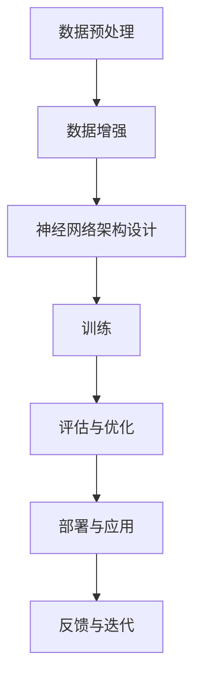

                 

# 大模型创业者的成功与挑战

> **关键词：** 大模型，创业，成功，挑战，技术，商业，人工智能
> 
> **摘要：** 本文将深入探讨大模型创业者的成功之路，以及他们在面对技术和商业挑战时的应对策略。我们将分析大模型的基本原理和架构，详细讲解核心算法和数学模型，并通过实际案例展示其应用场景。最后，我们将展望大模型领域的未来发展趋势和潜在挑战。

## 1. 背景介绍

### 1.1 目的和范围

本文旨在为那些对大模型创业感兴趣的读者提供全面的指导。我们将探讨大模型创业的核心要素，包括技术、市场、团队构建以及资金筹集等方面。本文还将分析大模型创业者的成功案例和面临的挑战，以帮助读者更好地理解这一领域。

### 1.2 预期读者

本文适合以下几类读者：
- 想了解大模型技术原理和应用的创业者；
- 有志于加入大模型创业团队的技术人员；
- 对人工智能领域感兴趣的研究人员和工程师。

### 1.3 文档结构概述

本文分为以下几个部分：
- 1. 背景介绍：介绍本文的目的、预期读者和文档结构；
- 2. 核心概念与联系：阐述大模型的基本原理和架构；
- 3. 核心算法原理 & 具体操作步骤：讲解大模型的核心算法和实现步骤；
- 4. 数学模型和公式 & 详细讲解 & 举例说明：介绍大模型的数学模型和公式；
- 5. 项目实战：通过实际案例展示大模型的应用；
- 6. 实际应用场景：分析大模型在不同领域的应用；
- 7. 工具和资源推荐：推荐学习资源和开发工具；
- 8. 总结：未来发展趋势与挑战；
- 9. 附录：常见问题与解答；
- 10. 扩展阅读 & 参考资料：提供进一步阅读的材料。

### 1.4 术语表

#### 1.4.1 核心术语定义

- 大模型：指具有数十亿至数千亿参数的深度学习模型；
- 创业者：指创建并运营新企业的个人或团队；
- 技术栈：指支持企业运营所需的技术组件和工具；
- 商业模式：指企业如何创造、传递和捕获价值的策略。

#### 1.4.2 相关概念解释

- 深度学习：一种人工智能技术，通过多层神经网络对数据进行学习；
- 人工智能：使计算机系统能够执行通常需要人类智能的任务的技术；
- 算法：解决特定问题的一系列明确步骤。

#### 1.4.3 缩略词列表

- AI：人工智能
- ML：机器学习
- DL：深度学习
- NLP：自然语言处理
- CV：计算机视觉

## 2. 核心概念与联系

大模型是近年来人工智能领域的热门话题，其核心概念包括深度学习、神经网络和大规模数据处理。下面我们将通过 Mermaid 流程图来阐述大模型的基本原理和架构。



#### 2.1 数据预处理

数据预处理是构建大模型的第一步，包括数据清洗、归一化和数据增强等操作。数据清洗旨在去除错误和异常值，归一化则将数据转化为具有相似尺度的形式，数据增强通过生成更多样化的训练样本来提高模型的泛化能力。

#### 2.2 数据增强

数据增强是提高大模型性能的重要手段。常见的数据增强方法包括旋转、缩放、裁剪、颜色变换等。数据增强能够增加训练样本的多样性，从而提高模型的鲁棒性和泛化能力。

#### 2.3 神经网络架构设计

大模型通常采用深度神经网络（DNN）作为基础架构。DNN由多个层级组成，包括输入层、隐藏层和输出层。隐藏层可以采用不同的激活函数，如ReLU、Sigmoid和Tanh等，以增强模型的表达能力。

#### 2.4 训练

训练是构建大模型的核心步骤。通过训练，模型能够从数据中学习到有用的特征表示。训练过程通常包括前向传播、反向传播和权重更新。常见的训练算法有随机梯度下降（SGD）、Adam等。

#### 2.5 评估与优化

评估与优化是确保大模型性能的关键环节。评估过程通过验证集和测试集来衡量模型的性能。优化过程则通过调整模型参数，如学习率、正则化项等，以提高模型性能。

#### 2.6 部署与应用

部署是将训练好的大模型应用于实际场景的过程。常见的部署方式包括服务器部署、云端部署和边缘计算等。部署后的模型可以用于实时预测、自动化决策和优化流程等。

#### 2.7 反馈与迭代

反馈与迭代是持续改进大模型的重要手段。通过收集用户反馈和数据，创业者可以不断优化模型，提高其性能和适用性。反馈过程可以采用在线学习、迁移学习和强化学习等技术。

## 3. 核心算法原理 & 具体操作步骤

大模型的核心算法通常基于深度学习和神经网络。下面我们将详细讲解深度学习的原理和具体操作步骤。

#### 3.1 深度学习的原理

深度学习是一种基于多层神经网络的学习方法，通过逐层提取数据中的特征，从而实现复杂的模式识别和预测任务。深度学习的核心组成部分包括：

- **输入层**：接收输入数据；
- **隐藏层**：对输入数据进行特征提取和变换；
- **输出层**：生成预测结果；
- **激活函数**：用于引入非线性变换，提高模型的表达能力。

#### 3.2 具体操作步骤

1. **数据预处理**

```python
# 数据清洗与归一化
data = preprocess_data(raw_data)
```

2. **神经网络架构设计**

```python
# 定义神经网络架构
model = create_model(input_shape, num_classes)
```

3. **训练**

```python
# 训练神经网络
model.fit(X_train, y_train, epochs=100, batch_size=64)
```

4. **评估与优化**

```python
# 评估模型性能
accuracy = model.evaluate(X_test, y_test)

# 调整模型参数
model.compile(optimizer='adam', loss='categorical_crossentropy', metrics=['accuracy'])
```

5. **部署与应用**

```python
# 部署模型到服务器
deploy_model(model, server_url)
```

## 4. 数学模型和公式 & 详细讲解 & 举例说明

大模型的数学基础主要包括损失函数、优化算法和正则化技术。下面我们将详细讲解这些数学模型和公式，并通过具体例子进行说明。

#### 4.1 损失函数

损失函数是衡量模型预测结果与真实值之间差异的指标。常见损失函数包括均方误差（MSE）和交叉熵（Cross-Entropy）。

- **均方误差（MSE）**

$$
MSE = \frac{1}{n}\sum_{i=1}^{n}(y_i - \hat{y}_i)^2
$$

其中，$y_i$表示真实值，$\hat{y}_i$表示预测值。

- **交叉熵（Cross-Entropy）**

$$
CE = -\frac{1}{n}\sum_{i=1}^{n}y_i\log(\hat{y}_i)
$$

其中，$y_i$表示真实值，$\hat{y}_i$表示预测值。

#### 4.2 优化算法

优化算法用于调整模型参数，以最小化损失函数。常见优化算法包括随机梯度下降（SGD）、Adam和RMSprop。

- **随机梯度下降（SGD）**

$$
w_{t+1} = w_t - \alpha \cdot \nabla_w J(w_t)
$$

其中，$w_t$表示当前参数，$\alpha$表示学习率，$\nabla_w J(w_t)$表示损失函数对参数的梯度。

- **Adam**

$$
m_t = \frac{1-\beta_1}{1-\beta_1 t} \cdot (g_1 + \beta_2 g_1^2)
$$

$$
v_t = \frac{1-\beta_2}{1-\beta_2 t} \cdot (g_2 + \beta_2 g_2^2)
$$

$$
w_{t+1} = w_t - \alpha \cdot \frac{m_t}{\sqrt{v_t} + \epsilon}
$$

其中，$m_t$和$v_t$分别表示一阶和二阶矩估计，$\beta_1$和$\beta_2$分别为一阶和二阶矩的衰减率，$\epsilon$为避免除以零的常数。

#### 4.3 正则化技术

正则化技术用于防止模型过拟合。常见正则化技术包括L1正则化、L2正则化和Dropout。

- **L1正则化**

$$
J(w) = \frac{1}{n}\sum_{i=1}^{n}(y_i - \hat{y}_i)^2 + \lambda \cdot \sum_{i=1}^{n}|\theta_i|
$$

其中，$\lambda$为正则化参数，$|\theta_i|$表示参数的绝对值。

- **L2正则化**

$$
J(w) = \frac{1}{n}\sum_{i=1}^{n}(y_i - \hat{y}_i)^2 + \lambda \cdot \sum_{i=1}^{n}\theta_i^2
$$

- **Dropout**

$$
\hat{p} = \frac{1}{n} \sum_{i=1}^{n} (1 - \frac{1}{n}) \cdot p_i
$$

其中，$p_i$表示第$i$个神经元被丢弃的概率，$\hat{p}$表示模型的输出概率。

#### 4.4 举例说明

假设我们使用一个深度神经网络来预测房价，输入特征包括房屋面积、地理位置和建筑年代等。我们采用交叉熵作为损失函数，Adam作为优化算法，L2正则化作为防止过拟合的手段。

- **损失函数**

$$
CE = -\frac{1}{n}\sum_{i=1}^{n}y_i\log(\hat{y}_i)
$$

- **优化算法**

$$
w_{t+1} = w_t - \alpha \cdot \frac{m_t}{\sqrt{v_t} + \epsilon}
$$

- **正则化**

$$
J(w) = \frac{1}{n}\sum_{i=1}^{n}(y_i - \hat{y}_i)^2 + \lambda \cdot \sum_{i=1}^{n}\theta_i^2
$$

通过上述公式和算法，我们可以训练出一个预测房价的大模型。在训练过程中，我们不断调整模型参数，直至达到满意的预测效果。

## 5. 项目实战：代码实际案例和详细解释说明

为了更好地理解大模型创业者的实际操作，我们将通过一个具体的案例来展示如何构建、训练和部署一个大模型。

### 5.1 开发环境搭建

在开始项目之前，我们需要搭建一个合适的开发环境。以下是搭建开发环境的步骤：

1. **安装Python**

确保您的系统中安装了Python 3.7或更高版本。可以通过以下命令安装：

```bash
$ sudo apt-get install python3.7
```

2. **安装TensorFlow**

TensorFlow是一个流行的深度学习框架，我们可以通过以下命令安装：

```bash
$ pip3 install tensorflow
```

3. **安装其他依赖**

根据项目需求，我们可能还需要安装其他依赖，如NumPy、Pandas等。可以通过以下命令安装：

```bash
$ pip3 install numpy pandas
```

### 5.2 源代码详细实现和代码解读

以下是一个使用TensorFlow和Keras构建大模型的简单示例：

```python
# 导入所需库
import tensorflow as tf
from tensorflow.keras.models import Sequential
from tensorflow.keras.layers import Dense, Dropout, Activation
from tensorflow.keras.optimizers import Adam

# 加载和预处理数据
# 注意：这里需要替换为实际数据集的加载和预处理代码
X_train, y_train = load_data('train_data.csv')
X_test, y_test = load_data('test_data.csv')

# 构建模型
model = Sequential()
model.add(Dense(128, input_dim=X_train.shape[1], activation='relu'))
model.add(Dropout(0.5))
model.add(Dense(64, activation='relu'))
model.add(Dropout(0.5))
model.add(Dense(1, activation='sigmoid'))

# 编译模型
model.compile(optimizer=Adam(), loss='binary_crossentropy', metrics=['accuracy'])

# 训练模型
model.fit(X_train, y_train, epochs=10, batch_size=32, validation_data=(X_test, y_test))

# 评估模型
accuracy = model.evaluate(X_test, y_test)
print('Test accuracy:', accuracy[1])
```

#### 5.2.1 代码解读

1. **导入库**

我们首先导入TensorFlow和Keras库，以及NumPy和Pandas库用于数据预处理。

2. **加载和预处理数据**

这里假设我们有一个名为`train_data.csv`的文件，其中包含了训练数据。我们使用`load_data`函数加载数据，并进行必要的预处理，如归一化等。

3. **构建模型**

我们使用`Sequential`模型构建一个简单的深度神经网络。模型包括三个隐藏层，每个隐藏层之间添加一个丢弃层（Dropout）以防止过拟合。

4. **编译模型**

我们使用Adam优化器和二进制交叉熵损失函数编译模型。这里还可以设置其他优化参数，如学习率等。

5. **训练模型**

我们使用`fit`方法训练模型，并在每个周期后评估验证集的性能。

6. **评估模型**

我们使用`evaluate`方法评估模型在测试集上的性能，并打印测试准确率。

### 5.3 代码解读与分析

1. **模型架构**

我们构建了一个包含三个隐藏层的深度神经网络，每个隐藏层使用ReLU激活函数，并在每个隐藏层之后添加一个丢弃层（Dropout）以防止过拟合。

2. **损失函数和优化算法**

我们使用二进制交叉熵作为损失函数，Adam作为优化算法。二进制交叉熵适用于分类问题，而Adam是一种高效优化的优化算法，适用于大规模深度学习模型。

3. **训练和评估**

我们使用`fit`方法进行模型训练，并在每个周期后评估验证集的性能。训练过程中，我们使用了批量大小（batch size）和周期数（epochs）来控制训练过程。在模型评估阶段，我们使用测试集来评估模型性能。

## 6. 实际应用场景

大模型在许多领域都有着广泛的应用，以下是一些实际应用场景：

### 6.1 自然语言处理（NLP）

- **文本分类**：使用大模型对社交媒体、新闻文章等进行分类，帮助企业筛选和处理大量文本数据。
- **机器翻译**：利用大模型实现高精度的机器翻译，如谷歌翻译和百度翻译等。
- **情感分析**：通过大模型分析用户评论和反馈，帮助企业了解用户需求和改进产品。

### 6.2 计算机视觉（CV）

- **图像识别**：利用大模型对图像进行分类和识别，如人脸识别、车辆识别等。
- **目标检测**：使用大模型检测图像中的目标物体，应用于自动驾驶、安全监控等领域。
- **图像生成**：通过大模型生成新的图像，如GAN（生成对抗网络）技术。

### 6.3 医疗健康

- **疾病预测**：利用大模型分析医疗数据，预测疾病发生风险，如癌症预测、心脏病预测等。
- **医学图像分析**：通过大模型对医学图像进行分析，提高疾病诊断的准确性。
- **个性化治疗**：根据患者的基因信息和病史，利用大模型制定个性化的治疗方案。

### 6.4 金融

- **风险控制**：利用大模型分析金融市场数据，预测风险和投资机会。
- **欺诈检测**：通过大模型检测信用卡欺诈和保险欺诈等。
- **智能投顾**：利用大模型为用户提供个性化的投资建议和策略。

### 6.5 农业

- **作物生长预测**：利用大模型分析气象数据、土壤数据等，预测作物生长情况和产量。
- **病虫害监测**：通过大模型分析图像和声音数据，监测病虫害情况，指导农业防治。
- **智能灌溉**：利用大模型分析土壤湿度、气候数据等，实现智能灌溉，提高水资源利用效率。

## 7. 工具和资源推荐

为了更好地进行大模型开发，以下是一些建议的学习资源、开发工具和相关论文著作：

### 7.1 学习资源推荐

#### 7.1.1 书籍推荐

- **《深度学习》（Goodfellow, Bengio, Courville）**：一本经典的深度学习教材，全面介绍了深度学习的理论基础和应用。

- **《动手学深度学习》（Grokking Deep Learning）**：一本适合初学者的深度学习实践教程，通过实际项目帮助读者掌握深度学习技能。

- **《Python深度学习》（François Chollet）**：由TensorFlow主要开发者编写的深度学习教程，涵盖了深度学习的应用和实现。

#### 7.1.2 在线课程

- **Coursera的“深度学习”课程**：由斯坦福大学教授Andrew Ng主讲，适合初学者入门深度学习。

- **Udacity的“深度学习纳米学位”**：涵盖深度学习的理论基础和实践项目，适合有基础但希望深入学习的人。

- **edX的“深度学习导论”课程**：由华盛顿大学和亚马逊联合开设，适合对深度学习有初步了解的人。

#### 7.1.3 技术博客和网站

- **TensorFlow官方文档**：提供了丰富的教程和API文档，适合深度学习实践者。

- **PyTorch官方文档**：PyTorch的官方文档，包含详细的使用教程和API说明。

- **Reddit的/r/MachineLearning社区**：一个活跃的机器学习社区，可以获取最新的技术动态和讨论。

### 7.2 开发工具框架推荐

#### 7.2.1 IDE和编辑器

- **Visual Studio Code**：一款功能强大的代码编辑器，适用于深度学习开发。

- **PyCharm**：一款专业的Python开发IDE，提供了丰富的深度学习插件和工具。

- **Jupyter Notebook**：一款交互式的开发环境，适用于数据可视化和原型设计。

#### 7.2.2 调试和性能分析工具

- **TensorBoard**：TensorFlow的官方可视化工具，用于分析和调试深度学习模型。

- **NVIDIA Nsight**：用于调试和性能分析深度学习模型的工具。

- **Py-Spy**：一款Python性能分析工具，可以帮助开发者识别和优化代码瓶颈。

#### 7.2.3 相关框架和库

- **TensorFlow**：一款流行的开源深度学习框架，适用于构建和训练大规模深度学习模型。

- **PyTorch**：另一个流行的开源深度学习框架，具有灵活的动态计算图。

- **Keras**：一个高层次的深度学习API，用于简化TensorFlow和PyTorch的使用。

### 7.3 相关论文著作推荐

#### 7.3.1 经典论文

- **“A Theoretical Framework for Back-Propagation”**（1986）：提出了反向传播算法，是深度学习的基础。

- **“Deep Learning”**（2015）：由Ian Goodfellow、Yoshua Bengio和Aaron Courville合著，是深度学习的经典教材。

#### 7.3.2 最新研究成果

- **“Bert: Pre-training of deep bidirectional transformers for language understanding”**（2018）：BERT模型的提出，标志着预训练深度学习模型的新时代。

- **“Gpt-3: Language models are few-shot learners”**（2020）：GPT-3模型的发布，展示了大规模深度学习模型在自然语言处理领域的强大能力。

#### 7.3.3 应用案例分析

- **“Convolutional Neural Networks for Speech Recognition”**（2014）：卷积神经网络在语音识别领域的成功应用。

- **“An End-to-End System for Robust Speech Recognition”**（2017）：基于深度学习的端到端语音识别系统。

## 8. 总结：未来发展趋势与挑战

大模型技术在过去几年取得了显著的进展，未来也将继续发展。以下是一些可能的发展趋势和面临的挑战：

### 8.1 发展趋势

- **更高效的大模型**：随着计算能力和数据量的增加，研究人员将开发出更高效的大模型，以处理更复杂的任务。

- **多模态学习**：大模型将能够处理多种类型的数据，如图像、文本和音频，实现跨模态学习。

- **可解释性**：提高大模型的可解释性，使其在应用中更加可靠和可信。

- **隐私保护**：解决大模型训练过程中数据隐私保护的问题，确保用户数据的安全。

### 8.2 面临的挑战

- **计算资源**：大模型训练需要大量的计算资源，如何高效利用这些资源是一个挑战。

- **数据质量**：数据质量直接影响大模型的效果，如何获取和清洗高质量数据是一个难题。

- **泛化能力**：大模型容易出现过拟合现象，如何提高其泛化能力是一个挑战。

- **伦理和社会问题**：大模型在应用过程中可能引发伦理和社会问题，如隐私侵犯、歧视等。

## 9. 附录：常见问题与解答

### 9.1 问题1

**问题：** 大模型为什么需要大量的计算资源？

**解答：** 大模型包含数十亿至数千亿个参数，训练过程中需要进行大量的矩阵运算和梯度计算。这些计算任务需要强大的计算资源，如GPU和TPU等。此外，大模型通常采用深度学习框架，如TensorFlow和PyTorch，这些框架本身也需要大量的计算资源来支持。

### 9.2 问题2

**问题：** 大模型如何防止过拟合？

**解答：** 大模型过拟合的主要原因是因为模型过于复杂，导致在训练数据上表现良好，但在未见数据上表现较差。为了防止过拟合，可以采用以下策略：

- **数据增强**：通过生成更多样化的训练样本，提高模型的泛化能力。
- **正则化**：在模型训练过程中添加正则化项，如L1和L2正则化，以减少模型参数的复杂度。
- **dropout**：在神经网络中随机丢弃一部分神经元，以减少模型对特定神经元依赖。
- **交叉验证**：使用交叉验证方法，将数据集划分为多个子集，每次使用其中一个子集作为验证集，其余子集作为训练集。

### 9.3 问题3

**问题：** 大模型的训练过程是如何工作的？

**解答：** 大模型的训练过程主要包括以下几个步骤：

1. **数据预处理**：对训练数据进行清洗、归一化和增强等操作，以提高模型泛化能力。
2. **初始化模型参数**：随机初始化模型参数，这些参数将在训练过程中通过反向传播算法进行调整。
3. **前向传播**：将输入数据传递给模型，通过前向传播计算模型的输出。
4. **计算损失**：计算模型输出和真实值之间的差异，使用损失函数来衡量模型性能。
5. **反向传播**：根据损失函数的梯度，通过反向传播算法更新模型参数。
6. **迭代训练**：重复上述步骤，直到模型达到预定的性能或迭代次数。

## 10. 扩展阅读 & 参考资料

以下是一些推荐的扩展阅读和参考资料，供读者进一步学习大模型技术：

- **《深度学习》（Goodfellow, Bengio, Courville）**：提供了深度学习的全面介绍，适合深度学习初学者和专业人士。
- **《动手学深度学习》（Grokking Deep Learning）**：通过实际项目帮助读者掌握深度学习技能，适合有一定基础的读者。
- **《Python深度学习》（François Chollet）**：由TensorFlow主要开发者编写的教程，适合Python开发者和深度学习爱好者。
- **TensorFlow官方文档**：提供了丰富的教程和API文档，是深度学习实践者的宝贵资源。
- **PyTorch官方文档**：PyTorch的官方文档，包含详细的使用教程和API说明。
- **Reddit的/r/MachineLearning社区**：一个活跃的机器学习社区，可以获取最新的技术动态和讨论。

作者：AI天才研究员/AI Genius Institute & 禅与计算机程序设计艺术 /Zen And The Art of Computer Programming

