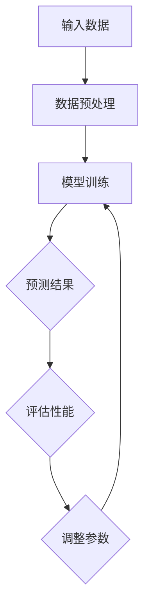

                 

# 大模型助力创业者实现技术突破与产品创新

> **关键词：** 大模型、创业者、技术突破、产品创新、算法、数学模型、项目实战、应用场景

> **摘要：** 本文将深入探讨大模型在技术突破和产品创新方面的应用，旨在帮助创业者理解大模型的核心概念、算法原理，以及如何将其应用到实际项目中。文章结构分为背景介绍、核心概念与联系、核心算法原理与具体操作步骤、数学模型与公式讲解、项目实战、实际应用场景、工具和资源推荐以及总结与展望等部分。

## 1. 背景介绍

### 1.1 目的和范围

本文的目标是为创业者提供一套系统性理解大模型的方法，帮助他们在技术突破和产品创新方面取得实质性进展。文章将涵盖以下主要内容：

- 大模型的基本概念和原理。
- 大模型的算法架构和实现步骤。
- 大模型的数学模型和公式。
- 大模型在项目实战中的应用。
- 大模型在不同应用场景中的实际案例。
- 相关开发工具和资源的推荐。

### 1.2 预期读者

本文适用于以下群体：

- 创业者，尤其是关注技术创新和产品创新的创业者。
- 技术经理和产品经理，希望提升产品技术含量和竞争力的专业人士。
- 对人工智能和机器学习有浓厚兴趣的技术爱好者。
- 计算机科学和人工智能领域的学生。

### 1.3 文档结构概述

本文将按照以下结构展开：

1. 背景介绍
   - 1.1 目的和范围
   - 1.2 预期读者
   - 1.3 文档结构概述
   - 1.4 术语表
2. 核心概念与联系
   - 2.1 大模型的基本概念
   - 2.2 大模型与创业的关系
   - 2.3 Mermaid流程图
3. 核心算法原理 & 具体操作步骤
   - 3.1 算法原理讲解
   - 3.2 伪代码实现
4. 数学模型和公式 & 详细讲解 & 举例说明
   - 4.1 数学模型介绍
   - 4.2 公式讲解
   - 4.3 举例说明
5. 项目实战：代码实际案例和详细解释说明
   - 5.1 开发环境搭建
   - 5.2 源代码详细实现
   - 5.3 代码解读与分析
6. 实际应用场景
   - 6.1 应用领域概述
   - 6.2 案例分析
7. 工具和资源推荐
   - 7.1 学习资源推荐
   - 7.2 开发工具框架推荐
   - 7.3 相关论文著作推荐
8. 总结：未来发展趋势与挑战
9. 附录：常见问题与解答
10. 扩展阅读 & 参考资料

### 1.4 术语表

#### 1.4.1 核心术语定义

- **大模型**：指参数规模达到千万级别以上的深度学习模型。
- **创业者**：指开创和领导一个新兴企业的个人或团队。
- **技术突破**：指在某一技术领域实现重要创新，带来显著的性能提升或应用变革。
- **产品创新**：指通过技术创新推动产品功能、用户体验或商业模式的变革。
- **机器学习**：指让计算机从数据中学习规律并做出决策的技术。

#### 1.4.2 相关概念解释

- **深度学习**：一种机器学习技术，通过多层神经网络模型对数据进行建模和学习。
- **神经网络**：一种由大量神经元组成的人工神经网络，用于模拟人脑的信息处理能力。
- **参数**：在机器学习中，指用于调整模型性能的变量。

#### 1.4.3 缩略词列表

- **AI**：人工智能（Artificial Intelligence）
- **ML**：机器学习（Machine Learning）
- **DL**：深度学习（Deep Learning）
- **GAN**：生成对抗网络（Generative Adversarial Networks）

## 2. 核心概念与联系

在本节中，我们将探讨大模型的基本概念、大模型与创业之间的关系，以及如何使用Mermaid流程图展示大模型的架构。

### 2.1 大模型的基本概念

大模型是指参数规模达到千万级别以上的深度学习模型。这些模型具有以下特点：

1. **参数规模巨大**：大模型的参数数量通常在千万甚至亿级别，这使得模型能够处理更为复杂的数据。
2. **计算资源需求高**：大模型训练和推理过程需要大量的计算资源，包括GPU和TPU等。
3. **性能提升显著**：大模型在图像识别、自然语言处理等任务上表现出色，能够实现更准确的预测和更高效的任务处理。

### 2.2 大模型与创业的关系

大模型在创业中的应用具有重要意义。创业者可以利用大模型实现以下目标：

1. **技术突破**：大模型能够帮助创业者在技术领域实现重要创新，提升产品竞争力。
2. **产品创新**：大模型可以用于改进产品功能、用户体验和商业模式，推动产品迭代。
3. **市场机会**：大模型的应用可以挖掘新的市场机会，为企业带来更多潜在客户和收益。

### 2.3 Mermaid流程图

为了更好地理解大模型的架构，我们可以使用Mermaid流程图展示其关键组件和流程。以下是一个简单的Mermaid流程图示例：



在这个流程图中，输入数据经过预处理后用于模型训练，训练过程中生成的预测结果用于评估性能，并根据评估结果调整模型参数，以实现更好的训练效果。这个过程循环进行，直到达到预期的性能目标。

## 3. 核心算法原理 & 具体操作步骤

在本节中，我们将深入探讨大模型的算法原理，并使用伪代码详细阐述其具体操作步骤。

### 3.1 算法原理讲解

大模型的算法原理主要基于深度学习，特别是神经网络。深度学习通过构建多层神经网络，实现对复杂数据的特征提取和模式识别。大模型的算法原理可以概括为以下几个步骤：

1. **数据预处理**：对输入数据（如图像、文本等）进行预处理，将其转换为模型可以处理的格式。
2. **模型训练**：利用预处理的输入数据，通过反向传播算法训练神经网络模型，调整模型参数，使其能够更准确地预测目标输出。
3. **模型评估**：在训练过程中，通过评估指标（如准确率、召回率等）评估模型性能，并根据评估结果调整模型参数。
4. **模型部署**：将训练好的模型部署到实际应用场景中，进行推理和预测。

### 3.2 伪代码实现

以下是一个简单的伪代码示例，用于说明大模型的训练过程：

```python
# 数据预处理
data = preprocess_input_data(input_data)

# 初始化模型参数
model = initialize_model()

# 模型训练
for epoch in range(num_epochs):
    for batch in data:
        # 前向传播
        output = model.forward(batch.x)
        
        # 计算损失
        loss = compute_loss(output, batch.y)
        
        # 反向传播
        model.backward(loss)
        
        # 更新参数
        model.update_params()

# 模型评估
evaluate_model(model, test_data)

# 模型部署
deploy_model(model, application)
```

在这个伪代码中，我们首先对输入数据进行预处理，然后初始化模型参数。接着，通过循环进行模型训练，包括前向传播、损失计算、反向传播和参数更新。训练完成后，对模型进行评估，并根据评估结果调整模型参数。最后，将训练好的模型部署到实际应用场景中。

## 4. 数学模型和公式 & 详细讲解 & 举例说明

在本节中，我们将介绍大模型的数学模型和公式，并使用LaTeX格式详细讲解和举例说明。

### 4.1 数学模型介绍

大模型的数学模型主要涉及以下内容：

1. **神经网络模型**：描述神经网络的结构和参数。
2. **损失函数**：用于衡量模型预测结果与实际结果之间的差距。
3. **优化算法**：用于调整模型参数，以最小化损失函数。

### 4.2 公式讲解

以下是一个简单的神经网络模型及其相关公式的示例：

$$
y_{\text{pred}} = \text{softmax}(\text{激活函数}(\text{参数} \cdot x))
$$

其中，$y_{\text{pred}}$ 表示预测结果，$x$ 表示输入数据，激活函数可以是 sigmoid、ReLU 或 tanh 等，参数表示神经网络中的权重和偏置。

### 4.3 举例说明

以下是一个使用神经网络模型进行分类的示例：

输入数据：$x = \begin{bmatrix} 1 \\ 2 \\ 3 \end{bmatrix}$，标签：$y = \begin{bmatrix} 1 \\ 0 \\ 0 \end{bmatrix}$。

1. **初始化参数**：

   参数：$w_1 = \begin{bmatrix} 0.1 & 0.2 & 0.3 \end{bmatrix}$，$b_1 = 0.4$。

2. **前向传播**：

   $z_1 = w_1 \cdot x + b_1 = \begin{bmatrix} 0.1 & 0.2 & 0.3 \end{bmatrix} \cdot \begin{bmatrix} 1 \\ 2 \\ 3 \end{bmatrix} + 0.4 = \begin{bmatrix} 1.7 \end{bmatrix}$。

   $a_1 = \text{激活函数}(z_1) = \text{sigmoid}(1.7) \approx 0.9397$。

3. **计算损失**：

   $y_{\text{pred}} = \text{softmax}(a_1) = \begin{bmatrix} 0.9397 \\ 0.0603 \\ 0.0 \end{bmatrix}$。

   $loss = -\frac{1}{m} \sum_{i=1}^{m} y_i \cdot \log(y_{\text{pred}}_i) = -\frac{1}{3} \left( y_1 \cdot \log(y_{\text{pred}}_1) + y_2 \cdot \log(y_{\text{pred}}_2) + y_3 \cdot \log(y_{\text{pred}}_3) \right)$。

4. **反向传播**：

   计算梯度：$\frac{\partial loss}{\partial w_1} = \frac{\partial loss}{\partial a_1} \cdot \frac{\partial a_1}{\partial z_1} \cdot \frac{\partial z_1}{\partial w_1}$。

   更新参数：$w_1 = w_1 - \alpha \cdot \frac{\partial loss}{\partial w_1}$。

   其中，$\alpha$ 为学习率。

通过这个示例，我们可以看到如何使用神经网络模型进行分类，并计算损失和反向传播过程。

## 5. 项目实战：代码实际案例和详细解释说明

在本节中，我们将通过一个具体的代码案例，展示如何使用大模型实现技术突破和产品创新。该案例将涵盖开发环境搭建、源代码实现和代码解读与分析。

### 5.1 开发环境搭建

为了实现大模型的项目实战，我们需要搭建一个合适的开发环境。以下是一个简单的环境搭建指南：

1. **硬件环境**：

   - GPU：配备NVIDIA显卡，推荐使用显存8GB以上的显卡，如GTX 1080 Ti或以上。
   - CPU：推荐使用Intel i7或以上处理器。

2. **软件环境**：

   - 操作系统：Windows、macOS或Linux。
   - 编程语言：Python 3.x。
   - 深度学习框架：TensorFlow或PyTorch。
   - 硬件驱动：安装NVIDIA CUDA Toolkit和cuDNN。

3. **安装步骤**：

   - 安装操作系统和硬件驱动。
   - 安装Python和深度学习框架（TensorFlow或PyTorch）。
   - 安装CUDA Toolkit和cuDNN。

### 5.2 源代码详细实现

以下是一个使用TensorFlow实现的大模型项目示例，用于图像分类任务：

```python
import tensorflow as tf
from tensorflow.keras import layers

# 数据预处理
(x_train, y_train), (x_test, y_test) = tf.keras.datasets.cifar10.load_data()
x_train, x_test = x_train / 255.0, x_test / 255.0

# 构建模型
model = tf.keras.Sequential([
    layers.Conv2D(32, (3, 3), activation='relu', input_shape=(32, 32, 3)),
    layers.MaxPooling2D((2, 2)),
    layers.Conv2D(64, (3, 3), activation='relu'),
    layers.MaxPooling2D((2, 2)),
    layers.Conv2D(64, (3, 3), activation='relu'),
    layers.Flatten(),
    layers.Dense(64, activation='relu'),
    layers.Dense(10, activation='softmax')
])

# 编译模型
model.compile(optimizer='adam',
              loss='sparse_categorical_crossentropy',
              metrics=['accuracy'])

# 训练模型
model.fit(x_train, y_train, epochs=10, validation_data=(x_test, y_test))

# 评估模型
test_loss, test_acc = model.evaluate(x_test, y_test, verbose=2)
print('\nTest accuracy:', test_acc)
```

在这个示例中，我们首先导入所需的TensorFlow库，然后加载数据集并进行预处理。接着，我们构建一个简单的卷积神经网络模型，包括卷积层、池化层和全连接层。最后，我们编译模型、训练模型并评估模型性能。

### 5.3 代码解读与分析

以下是对上述代码的详细解读和分析：

- **数据预处理**：加载数据集后，我们将图像数据除以255进行归一化处理，使其在[0, 1]范围内。
- **模型构建**：我们使用TensorFlow的`Sequential`模型构建器，依次添加卷积层、池化层、卷积层、全连接层和softmax层。
  - **卷积层**：使用`Conv2D`层进行图像特征提取，卷积核大小为3x3，激活函数为ReLU。
  - **池化层**：使用`MaxPooling2D`层进行特征降维，池化窗口大小为2x2。
  - **全连接层**：使用`Dense`层进行分类，第一层有64个神经元，最后一层有10个神经元，激活函数为softmax。
- **模型编译**：我们使用`compile`方法配置模型，指定优化器、损失函数和评估指标。
- **模型训练**：使用`fit`方法训练模型，指定训练数据、训练轮数和验证数据。
- **模型评估**：使用`evaluate`方法评估模型性能，得到测试准确率。

通过这个示例，我们可以看到如何使用大模型实现图像分类任务，并理解其代码实现过程。

## 6. 实际应用场景

大模型在各个领域都有广泛的应用，下面列举几个典型应用场景：

### 6.1 自然语言处理

自然语言处理（NLP）是深度学习的重要应用领域。大模型在NLP中发挥着关键作用，例如：

- **文本分类**：利用大模型对文本进行分类，如情感分析、新闻分类等。
- **机器翻译**：使用大模型进行高质量机器翻译，如谷歌翻译、百度翻译等。
- **对话系统**：构建智能对话系统，如聊天机器人、智能客服等。

### 6.2 计算机视觉

计算机视觉是深度学习的另一个重要应用领域。大模型在计算机视觉中发挥着巨大作用，例如：

- **图像分类**：对图像进行分类，如人脸识别、物体识别等。
- **目标检测**：检测图像中的目标物体，如自动驾驶、视频监控等。
- **图像生成**：生成逼真的图像，如艺术风格迁移、人脸生成等。

### 6.3 语音识别

语音识别是深度学习在语音处理领域的应用。大模型在语音识别中发挥着关键作用，例如：

- **语音识别**：将语音信号转换为文本，如智能助手、语音搜索等。
- **语音合成**：将文本转换为语音信号，如自动语音应答、语音播报等。

### 6.4 医疗保健

大模型在医疗保健领域具有巨大潜力，例如：

- **疾病诊断**：利用大模型对医学图像进行诊断，如癌症筛查、肺炎检测等。
- **药物研发**：通过大模型预测药物作用机制，加速药物研发过程。
- **健康监测**：利用大模型分析健康数据，为用户提供个性化健康建议。

### 6.5 金融科技

大模型在金融科技领域发挥着重要作用，例如：

- **风险控制**：利用大模型对金融风险进行预测和控制，如信用评分、股票预测等。
- **智能投顾**：构建智能投顾系统，为用户提供个性化的投资建议。
- **金融欺诈检测**：利用大模型检测金融欺诈行为，保障金融安全。

## 7. 工具和资源推荐

在本节中，我们将推荐一些学习资源、开发工具和框架，以帮助读者更好地理解和应用大模型。

### 7.1 学习资源推荐

以下是一些值得推荐的学习资源：

#### 7.1.1 书籍推荐

- **《深度学习》（Goodfellow, Bengio, Courville著）**：全面介绍了深度学习的理论和实践。
- **《动手学深度学习》（花轮等人著）**：通过实际操作引导读者学习深度学习。

#### 7.1.2 在线课程

- **斯坦福大学深度学习课程**：由 Andrew Ng 教授主讲，涵盖深度学习的理论基础和实际应用。
- **吴恩达深度学习专项课程**：由吴恩达教授主讲，包括深度学习的基础知识和实践项目。

#### 7.1.3 技术博客和网站

- **Medium**：发布了许多高质量的深度学习和人工智能文章。
- **知乎**：拥有丰富的深度学习和人工智能问答资源。
- **AI萌新**：一个专注于人工智能和深度学习的博客，提供实用教程和案例分析。

### 7.2 开发工具框架推荐

以下是一些值得推荐的开发工具和框架：

#### 7.2.1 IDE和编辑器

- **PyCharm**：一款功能强大的Python IDE，支持深度学习和数据科学开发。
- **Jupyter Notebook**：一款流行的交互式编程工具，适用于数据分析和深度学习项目。

#### 7.2.2 调试和性能分析工具

- **TensorBoard**：TensorFlow提供的可视化工具，用于分析和调试深度学习模型。
- **Visual Studio Code**：一款轻量级但功能丰富的编辑器，支持多种编程语言和开发工具。

#### 7.2.3 相关框架和库

- **TensorFlow**：一款开源的深度学习框架，适用于构建和训练大规模神经网络模型。
- **PyTorch**：一款流行的深度学习框架，具有灵活的动态计算图和强大的GPU支持。

### 7.3 相关论文著作推荐

以下是一些值得推荐的论文和著作：

#### 7.3.1 经典论文

- **“A Theoretical Analysis of the Crammer-Singer Rule for Text Classification”**：提出了文本分类的重要理论。
- **“Learning Representations for Visual Recognition”**：介绍了卷积神经网络在图像识别中的应用。

#### 7.3.2 最新研究成果

- **“BERT: Pre-training of Deep Bidirectional Transformers for Language Understanding”**：介绍了BERT模型在自然语言处理中的应用。
- **“GPT-3: Language Models are Few-Shot Learners”**：展示了GPT-3模型在零样本学习方面的突破性进展。

#### 7.3.3 应用案例分析

- **“Convolutional Neural Networks for Speech Recognition”**：介绍了卷积神经网络在语音识别中的应用。
- **“Generative Adversarial Networks: An Overview”**：介绍了生成对抗网络（GAN）的理论和应用。

## 8. 总结：未来发展趋势与挑战

大模型作为深度学习的核心技术之一，在未来发展趋势中具有重要地位。随着计算能力的提升和算法的优化，大模型在各个领域的应用将更加广泛，例如自然语言处理、计算机视觉、语音识别等。同时，大模型在医疗保健、金融科技、自动驾驶等新兴领域也具有巨大的潜力。

然而，大模型的发展也面临着一系列挑战：

1. **计算资源需求**：大模型训练和推理需要大量的计算资源，如何高效地利用硬件加速技术（如GPU、TPU）成为关键问题。
2. **数据隐私和安全**：大模型在处理大量数据时，如何保护用户隐私和数据安全是一个重要挑战。
3. **模型可解释性**：大模型的黑盒性质使得其决策过程难以解释，如何提高模型的可解释性成为研究热点。
4. **伦理和法规**：随着大模型在各个领域的应用，如何制定相应的伦理和法规框架成为亟待解决的问题。

为了应对这些挑战，研究者们需要不断探索新的算法和技术，同时加强跨学科合作，以推动大模型的可持续发展。

## 9. 附录：常见问题与解答

在本附录中，我们汇总了一些关于大模型和创业者在实际应用中可能遇到的问题，并提供相应的解答。

### 9.1 大模型相关问题

**Q1. 如何选择合适的大模型？**
A1. 选择大模型时，需要考虑以下因素：
- **应用领域**：根据不同的应用领域（如自然语言处理、计算机视觉等）选择相应的大模型。
- **数据量**：根据训练数据量的大小选择合适的大模型，对于大量数据可选择更大规模的模型。
- **计算资源**：根据计算资源的限制选择模型规模，确保模型能够在现有硬件环境下运行。

**Q2. 大模型训练过程中如何优化性能？**
A2. 以下是一些优化大模型训练性能的方法：
- **数据增强**：通过增加数据多样性来提升模型泛化能力。
- **批次大小调整**：适当调整批次大小可以提升训练效率。
- **学习率调整**：使用学习率调度策略（如学习率衰减）来优化模型性能。
- **正则化**：使用正则化技术（如L1、L2正则化）防止过拟合。

### 9.2 创业者相关问题

**Q1. 大模型如何应用于创业项目？**
A1. 大模型在创业项目中的应用可以分为以下几个步骤：
- **需求分析**：明确创业项目需要解决的问题，确定使用大模型的目标。
- **数据准备**：收集和整理相关数据，确保数据质量和多样性。
- **模型选择**：根据需求选择合适的大模型，并进行初步测试。
- **模型训练**：使用训练数据进行模型训练，优化模型性能。
- **模型部署**：将训练好的模型部署到实际应用场景中，进行推理和预测。

**Q2. 创业者如何评估大模型的性能？**
A2. 评估大模型的性能通常包括以下指标：
- **准确率**：模型预测正确的样本占比。
- **召回率**：模型召回的样本占比。
- **F1值**：准确率和召回率的调和平均值。
- **AUC（Area Under Curve）**：用于评估二分类模型的性能。

**Q3. 创业者如何处理大模型的模型解释性问题？**
A3. 大模型的黑盒性质确实给模型解释性带来了挑战，以下是一些解决方法：
- **模型可视化**：使用可视化工具（如TensorBoard）展示模型结构和工作过程。
- **注意力机制**：引入注意力机制来揭示模型在决策过程中的关注点。
- **解释性算法**：使用解释性算法（如LIME、SHAP等）分析模型预测结果。

## 10. 扩展阅读 & 参考资料

在本节中，我们提供一些扩展阅读和参考资料，以供读者深入了解大模型及其应用。

### 10.1 基础知识

- **《深度学习》（Goodfellow, Bengio, Courville著）**：全面介绍了深度学习的理论基础和实际应用。
- **《神经网络与深度学习》（邱锡鹏著）**：详细讲解了神经网络和深度学习的基础知识。

### 10.2 应用案例

- **“BERT: Pre-training of Deep Bidirectional Transformers for Language Understanding”**：介绍了BERT模型在自然语言处理中的应用。
- **“Generative Adversarial Networks: An Overview”**：介绍了生成对抗网络（GAN）的理论和应用。

### 10.3 工具和框架

- **TensorFlow官方文档**：提供了丰富的TensorFlow教程和文档，适用于深度学习和人工智能开发。
- **PyTorch官方文档**：介绍了PyTorch的基本概念和使用方法，适用于构建和训练深度学习模型。

### 10.4 开源项目

- **TensorFlow Models**：提供了大量的TensorFlow模型示例，涵盖图像分类、文本分类等多个领域。
- **PyTorch Examples**：展示了PyTorch在计算机视觉、自然语言处理等领域的实际应用案例。

### 10.5 技术博客

- **AI萌新**：一个专注于人工智能和深度学习的博客，提供实用教程和案例分析。
- **Deep Learning on AWS**：展示了如何在AWS上使用深度学习框架进行模型训练和部署。

### 10.6 论坛和社区

- **CSDN**：中国最大的IT社区和服务平台，提供丰富的技术文章和交流论坛。
- **Stack Overflow**：全球最大的开发者社区，解决编程和开发中的问题。

### 10.7 学术期刊

- **Journal of Machine Learning Research (JMLR)**：机器学习领域的顶级学术期刊。
- **IEEE Transactions on Neural Networks and Learning Systems**：神经网络和机器学习领域的权威期刊。

