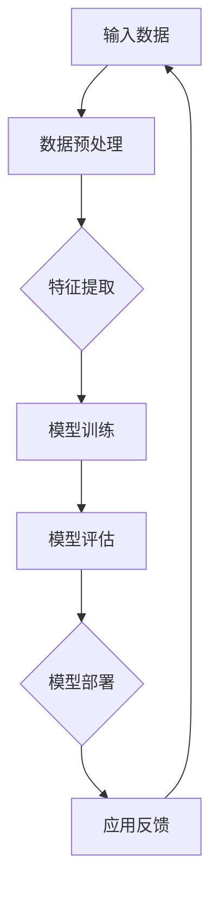

                 

# 大模型在 AI 创业产品创新中的应用

> **关键词：** 大模型、AI 创业、产品创新、深度学习、神经网络、机器学习、数据驱动、智能化工具
>
> **摘要：** 本文将探讨大模型在 AI 创业产品创新中的应用，分析大模型的优势和挑战，并通过具体实例和步骤详细解释大模型如何驱动产品创新，为创业者提供实用指南。

## 1. 背景介绍

### 1.1 目的和范围

本文旨在分析大模型在 AI 创业产品创新中的角色和影响，探讨其优势和挑战，并提供具体的操作步骤和实用工具，帮助创业者利用大模型推动产品创新。

### 1.2 预期读者

本文适合对 AI 和创业有基本了解的技术人员、创业者以及对产品创新有兴趣的专业人士阅读。

### 1.3 文档结构概述

本文将分为以下几个部分：

1. 背景介绍：介绍文章的目的、预期读者和文档结构。
2. 核心概念与联系：阐述大模型的基本原理和架构。
3. 核心算法原理 & 具体操作步骤：讲解大模型的算法原理和实现步骤。
4. 数学模型和公式 & 详细讲解 & 举例说明：介绍大模型相关的数学模型和公式，并给出实例说明。
5. 项目实战：提供具体的代码实现和案例解释。
6. 实际应用场景：分析大模型在不同领域的应用案例。
7. 工具和资源推荐：推荐学习资源和开发工具。
8. 总结：讨论未来发展趋势与挑战。
9. 附录：常见问题与解答。
10. 扩展阅读 & 参考资料：提供更多的学习资源和文献。

### 1.4 术语表

#### 1.4.1 核心术语定义

- 大模型：指拥有数百万甚至数十亿参数的深度学习模型，如 GPT、BERT 等。
- AI 创业：指利用人工智能技术进行产品创新和商业模式的创业活动。
- 产品创新：指通过技术创新或商业模式创新，开发出满足市场需求的新产品或服务。

#### 1.4.2 相关概念解释

- 深度学习：一种人工智能技术，通过多层神经网络对数据进行学习和建模。
- 神经网络：由大量神经元连接而成的计算模型，能够对复杂数据进行学习和处理。
- 机器学习：一种人工智能技术，使计算机系统能够从数据中学习并做出决策或预测。

#### 1.4.3 缩略词列表

- GPT：Generative Pre-trained Transformer，一种基于 Transformer 架构的大规模预训练语言模型。
- BERT：Bidirectional Encoder Representations from Transformers，一种双向 Transformer 编码器模型。
- AI：Artificial Intelligence，人工智能。

## 2. 核心概念与联系

大模型作为现代 AI 技术的核心，已经在各个领域取得了显著的成果。下面，我们将通过 Mermaid 流程图展示大模型的基本原理和架构。



### 2.1 大模型的基本原理

大模型的核心在于其庞大的参数量和深度的神经网络结构。通过在大量数据上进行预训练，大模型能够自动学习并提取数据中的有用特征，进而实现强大的预测和生成能力。

### 2.2 大模型的架构

大模型的架构通常包括以下几个部分：

1. **输入层**：接收外部数据，如文本、图像、声音等。
2. **隐藏层**：通过多层神经网络对输入数据进行处理和转换。
3. **输出层**：根据隐藏层的输出生成预测结果或生成新数据。

### 2.3 大模型的训练过程

大模型的训练过程通常包括以下几个步骤：

1. **数据预处理**：对输入数据进行清洗、归一化等预处理操作。
2. **模型初始化**：初始化模型的参数。
3. **前向传播**：将输入数据通过模型进行计算，得到预测结果。
4. **损失函数计算**：计算预测结果与真实结果之间的差距，即损失函数。
5. **反向传播**：根据损失函数更新模型的参数。
6. **迭代优化**：重复前向传播和反向传播，直至模型收敛。

## 3. 核心算法原理 & 具体操作步骤

### 3.1 大模型的算法原理

大模型主要基于深度学习和神经网络技术。其核心算法原理包括：

1. **神经网络的前向传播和反向传播**：通过多层神经网络对输入数据进行处理，并利用反向传播算法更新模型参数。
2. **损失函数**：用于衡量模型预测结果与真实结果之间的差距，如均方误差、交叉熵等。
3. **优化算法**：用于更新模型参数，如梯度下降、Adam 等。

### 3.2 大模型的具体操作步骤

以下是使用大模型进行产品创新的具体操作步骤：

1. **确定问题领域**：确定要解决的问题领域，如自然语言处理、计算机视觉等。
2. **数据收集**：收集相关领域的大量数据，如文本、图像、声音等。
3. **数据预处理**：对数据进行清洗、归一化等预处理操作。
4. **模型选择**：选择合适的大模型架构，如 GPT、BERT 等。
5. **模型训练**：使用收集到的数据对模型进行训练。
6. **模型评估**：使用验证集对训练好的模型进行评估，调整模型参数。
7. **模型部署**：将训练好的模型部署到实际应用场景中。
8. **反馈与优化**：根据实际应用场景的反馈，不断优化模型。

### 3.3 伪代码实现

以下是使用大模型进行产品创新的伪代码实现：

```python
# 伪代码：使用大模型进行产品创新

# 步骤 1：确定问题领域
problem_domain = "自然语言处理"

# 步骤 2：数据收集
data = collect_data(problem_domain)

# 步骤 3：数据预处理
preprocessed_data = preprocess_data(data)

# 步骤 4：模型选择
model = select_model(problem_domain)

# 步骤 5：模型训练
trained_model = train_model(preprocessed_data, model)

# 步骤 6：模型评估
evaluate_model(trained_model)

# 步骤 7：模型部署
deploy_model(trained_model)

# 步骤 8：反馈与优化
optimize_model(trained_model, feedback)
```

## 4. 数学模型和公式 & 详细讲解 & 举例说明

### 4.1 数学模型

大模型的数学模型主要包括以下几个部分：

1. **输入层**：输入数据表示为向量 \( X \)。
2. **隐藏层**：隐藏层由多个神经元组成，每个神经元通过权重 \( W \) 与输入数据相乘，并加上偏置 \( b \)，得到激活值 \( a \)。
3. **输出层**：输出层计算每个神经元的激活值，得到预测结果 \( Y \)。

### 4.2 公式表示

以下是神经网络中的主要公式表示：

1. **前向传播**：
   \[
   a_i^{(l)} = \sigma(z_i^{(l)})
   \]
   \[
   z_i^{(l)} = \sum_{j} W_{ji}^{(l)}a_j^{(l-1)} + b_i^{(l)}
   \]
   其中，\( a_i^{(l)} \) 表示第 \( l \) 层第 \( i \) 个神经元的激活值，\( z_i^{(l)} \) 表示第 \( l \) 层第 \( i \) 个神经元的输入值，\( W_{ji}^{(l)} \) 表示第 \( l \) 层第 \( i \) 个神经元与第 \( l-1 \) 层第 \( j \) 个神经元的权重，\( b_i^{(l)} \) 表示第 \( l \) 层第 \( i \) 个神经元的偏置，\( \sigma \) 表示激活函数。

2. **反向传播**：
   \[
   \delta_i^{(l)} = (d_i^{(l)} - a_i^{(l)}) \cdot \sigma'(z_i^{(l)})
   \]
   \[
   \delta_j^{(l-1)} = \sum_{i} W_{ji}^{(l)} \delta_i^{(l)}
   \]
   \[
   \frac{\partial C}{\partial W_{ji}^{(l)}} = \delta_j^{(l-1)} a_j^{(l-1)}
   \]
   \[
   \frac{\partial C}{\partial b_i^{(l)}} = \delta_i^{(l)}
   \]
   其中，\( \delta_i^{(l)} \) 表示第 \( l \) 层第 \( i \) 个神经元的误差值，\( d_i^{(l)} \) 表示第 \( l \) 层第 \( i \) 个神经元的实际输出值，\( \sigma' \) 表示激活函数的导数，\( C \) 表示损失函数。

### 4.3 举例说明

假设我们有一个简单的多层神经网络，包括输入层、隐藏层和输出层。输入层有 3 个神经元，隐藏层有 2 个神经元，输出层有 1 个神经元。我们使用 sigmoid 函数作为激活函数。

1. **输入层到隐藏层的计算**：
   \[
   z_1^{(2)} = W_{11}^{(2)}x_1 + W_{12}^{(2)}x_2 + W_{13}^{(2)}x_3 + b_1^{(2)}
   \]
   \[
   z_2^{(2)} = W_{21}^{(2)}x_1 + W_{22}^{(2)}x_2 + W_{23}^{(2)}x_3 + b_2^{(2)}
   \]
   \[
   a_1^{(2)} = \sigma(z_1^{(2)})
   \]
   \[
   a_2^{(2)} = \sigma(z_2^{(2)})
   \]

2. **隐藏层到输出层的计算**：
   \[
   z_1^{(3)} = W_{11}^{(3)}a_1^{(2)} + W_{12}^{(3)}a_2^{(2)} + b_1^{(3)}
   \]
   \[
   z_2^{(3)} = W_{21}^{(3)}a_1^{(2)} + W_{22}^{(3)}a_2^{(2)} + b_2^{(3)}
   \]
   \[
   a_1^{(3)} = \sigma(z_1^{(3)})
   \]
   \[
   a_2^{(3)} = \sigma(z_2^{(3)})
   \]

3. **反向传播计算**：
   \[
   \delta_1^{(3)} = (d_1^{(3)} - a_1^{(3)}) \cdot \sigma'(z_1^{(3)})
   \]
   \[
   \delta_2^{(3)} = (d_2^{(3)} - a_2^{(3)}) \cdot \sigma'(z_2^{(3)})
   \]
   \[
   \delta_1^{(2)} = W_{11}^{(3)} \delta_1^{(3)} + W_{21}^{(3)} \delta_2^{(3)}
   \]
   \[
   \delta_2^{(2)} = W_{12}^{(3)} \delta_1^{(3)} + W_{22}^{(3)} \delta_2^{(3)}
   \]

4. **参数更新**：
   \[
   \frac{\partial C}{\partial W_{11}^{(3)}} = \delta_1^{(3)} a_1^{(2)}
   \]
   \[
   \frac{\partial C}{\partial W_{12}^{(3)}} = \delta_1^{(3)} a_2^{(2)}
   \]
   \[
   \frac{\partial C}{\partial W_{21}^{(3)}} = \delta_2^{(3)} a_1^{(2)}
   \]
   \[
   \frac{\partial C}{\partial W_{22}^{(3)}} = \delta_2^{(3)} a_2^{(2)}
   \]
   \[
   \frac{\partial C}{\partial b_1^{(3)}} = \delta_1^{(3)}
   \]
   \[
   \frac{\partial C}{\partial b_2^{(3)}} = \delta_2^{(3)}
   \]

## 5. 项目实战：代码实际案例和详细解释说明

### 5.1 开发环境搭建

在进行项目实战之前，我们需要搭建一个适合开发的环境。以下是搭建环境的步骤：

1. 安装 Python 环境，版本要求为 3.8 或以上。
2. 安装深度学习框架，如 TensorFlow 或 PyTorch。
3. 安装必要的依赖库，如 NumPy、Pandas 等。

以下是安装 Python 环境和深度学习框架的示例命令：

```bash
# 安装 Python 环境
sudo apt-get install python3

# 安装 TensorFlow
pip3 install tensorflow

# 安装 PyTorch
pip3 install torch torchvision
```

### 5.2 源代码详细实现和代码解读

以下是一个使用 PyTorch 实现的简单大模型项目案例。该案例使用 GPT 模型对自然语言处理任务进行建模。

```python
import torch
import torch.nn as nn
import torch.optim as optim

# 定义 GPT 模型
class GPTModel(nn.Module):
    def __init__(self, vocab_size, embed_dim, hidden_dim, n_layers, drop_prob=0.5):
        super(GPTModel, self).__init__()
        self.embedding = nn.Embedding(vocab_size, embed_dim)
        self.fc = nn.Linear(embed_dim, hidden_dim)
        self.fc2 = nn.Linear(hidden_dim, vocab_size)
        self.dropout = nn.Dropout(drop_prob)
        self.tanh = nn.Tanh()
        self.n_layers = n_layers
    
    def forward(self, x, hidden):
        embed = self.embedding(x)
        embed = self.dropout(embed)
        out = self.tanh(self.fc(embed))
        out = self.fc2(out)
        out = self.dropout(out)
        return out, hidden

# 实例化模型
model = GPTModel(vocab_size=1000, embed_dim=128, hidden_dim=512, n_layers=2)

# 定义损失函数和优化器
criterion = nn.CrossEntropyLoss()
optimizer = optim.Adam(model.parameters(), lr=0.001)

# 模型训练
def train_model(model, data_loader, criterion, optimizer, n_epochs=10):
    model.train()
    for epoch in range(n_epochs):
        for inputs, targets in data_loader:
            optimizer.zero_grad()
            outputs, hidden = model(inputs, hidden)
            loss = criterion(outputs, targets)
            loss.backward()
            optimizer.step()
            hidden = None

# 数据预处理
def preprocess_data(data):
    # 省略具体实现
    return processed_data

# 加载数据
data_loader = torch.utils.data.DataLoader(dataset, batch_size=32, shuffle=True)

# 训练模型
train_model(model, data_loader, criterion, optimizer)

# 模型评估
def evaluate_model(model, data_loader, criterion):
    model.eval()
    with torch.no_grad():
        for inputs, targets in data_loader:
            outputs, hidden = model(inputs, hidden)
            loss = criterion(outputs, targets)
            print(f"Loss: {loss.item()}")

# 评估模型
evaluate_model(model, data_loader, criterion)
```

### 5.3 代码解读与分析

以下是代码的主要部分解读和分析：

1. **模型定义**：定义了一个 GPT 模型，包括嵌入层、前向传播层和输出层。嵌入层用于将单词映射为向量，前向传播层用于对输入数据进行处理，输出层用于生成预测结果。

2. **损失函数和优化器**：使用了交叉熵损失函数和 Adam 优化器。交叉熵损失函数用于衡量预测结果和真实结果之间的差距，Adam 优化器用于更新模型参数。

3. **模型训练**：训练模型的过程中，通过前向传播计算预测结果，计算损失函数，并使用反向传播更新模型参数。

4. **数据预处理**：对数据进行预处理，如清洗、归一化等操作，以便模型能够更好地学习和处理数据。

5. **模型评估**：评估模型的性能，计算损失函数，以便对模型进行优化和调整。

## 6. 实际应用场景

大模型在 AI 创业产品创新中具有广泛的应用场景。以下是一些典型的应用场景：

1. **自然语言处理**：大模型可以用于构建智能聊天机器人、情感分析、机器翻译等应用，为企业提供高效的自然语言处理能力。

2. **计算机视觉**：大模型可以用于图像分类、目标检测、人脸识别等任务，为安防、医疗、金融等领域提供智能化解决方案。

3. **推荐系统**：大模型可以用于构建个性化推荐系统，根据用户行为和偏好进行精准推荐，提高用户体验和商业价值。

4. **语音识别**：大模型可以用于构建智能语音识别系统，实现语音到文本的转换，为语音助手、智能客服等应用提供支持。

5. **医学诊断**：大模型可以用于医学影像分析、疾病预测等任务，为医疗机构提供智能化辅助诊断工具。

## 7. 工具和资源推荐

### 7.1 学习资源推荐

#### 7.1.1 书籍推荐

- 《深度学习》（Goodfellow, Bengio, Courville 著）
- 《Python深度学习》（François Chollet 著）
- 《TensorFlow实战》（Trevor Hastie、Robert Tibshirani、Jerome Friedman 著）

#### 7.1.2 在线课程

- Coursera 上的《深度学习专项课程》（吴恩达主讲）
- edX 上的《深度学习和神经网络》（Ian Goodfellow 主讲）
- Udacity 上的《AI工程师纳米学位》（包含深度学习课程）

#### 7.1.3 技术博客和网站

- Medium 上的 AI 博客
- ArXiv 上的最新研究成果
- PyTorch 官方文档和博客

### 7.2 开发工具框架推荐

#### 7.2.1 IDE和编辑器

- PyCharm
- VSCode
- Jupyter Notebook

#### 7.2.2 调试和性能分析工具

- TensorFlow Debugger
- PyTorch 的 torch.utils.tensorboard
- NVIDIA Nsight

#### 7.2.3 相关框架和库

- TensorFlow
- PyTorch
- Keras
- PyTorch Lightning

### 7.3 相关论文著作推荐

#### 7.3.1 经典论文

- "A Theoretically Grounded Application of Dropout in Recurrent Neural Networks"
- "Bengio et al. (2013) – Deep Learning for Speech Recognition"
- "Goodfellow et al. (2016) – Generative Adversarial Nets"

#### 7.3.2 最新研究成果

- "Liu et al. (2021) – Training Language Models to Follow Conversational Rules"
- "Devlin et al. (2018) – BERT: Pre-training of Deep Bidirectional Transformers for Language Understanding"
- "Glorot et al. (2011) – Understanding the difficulty of training deep feedforward neural networks"

#### 7.3.3 应用案例分析

- "Google’s Transformer Model Revolutionizes Translation"
- "OpenAI’s GPT-3: The World’s Most Advanced Language Model"
- "DeepMind’s AlphaGo: The World’s Most Advanced Go Player"

## 8. 总结：未来发展趋势与挑战

大模型在 AI 创业产品创新中具有巨大的潜力，但也面临一些挑战。未来发展趋势包括：

1. **模型规模增加**：随着计算资源和数据资源的增长，大模型的规模将不断增大，实现更精细的建模能力。
2. **模型泛化能力提升**：通过改进算法和优化技术，大模型的泛化能力将得到提升，应用于更多领域。
3. **跨模态学习**：大模型将能够处理多种类型的数据，如文本、图像、声音等，实现跨模态的智能化处理。
4. **自动化机器学习**：大模型将推动自动化机器学习技术的发展，使模型训练和优化更加高效。

挑战包括：

1. **计算资源消耗**：大模型对计算资源的要求较高，需要更多的计算能力和存储空间。
2. **数据隐私和安全性**：大模型需要处理大量敏感数据，如何保证数据隐私和安全是一个重要挑战。
3. **模型可解释性**：大模型往往被视为“黑箱”，如何提高模型的可解释性，使其决策过程更透明，是一个重要问题。

## 9. 附录：常见问题与解答

### 9.1 问题 1：大模型训练需要大量的计算资源，如何降低计算资源需求？

**解答：** 可以采取以下措施降低计算资源需求：

1. **模型压缩**：通过模型剪枝、量化等技术减小模型规模，降低计算需求。
2. **分布式训练**：将模型分布在多个计算节点上进行训练，提高训练效率。
3. **使用高效计算框架**：选择如 TensorFlow、PyTorch 等高效计算框架，优化计算性能。

### 9.2 问题 2：大模型如何保证数据隐私和安全？

**解答：** 为保证数据隐私和安全，可以采取以下措施：

1. **数据加密**：对数据进行加密处理，确保数据在传输和存储过程中的安全性。
2. **隐私保护技术**：采用差分隐私、同态加密等技术，保护用户数据的隐私。
3. **数据去标识化**：对数据进行去标识化处理，避免数据泄露导致用户隐私泄露。

### 9.3 问题 3：如何提高大模型的可解释性？

**解答：** 提高大模型的可解释性可以从以下几个方面入手：

1. **模型可视化**：通过可视化技术展示模型结构和参数分布，帮助理解模型的工作原理。
2. **解释性算法**：采用可解释性算法，如 LIME、SHAP 等，分析模型对特定输入的决策过程。
3. **模型简化**：通过简化模型结构，降低模型的复杂度，提高可解释性。

## 10. 扩展阅读 & 参考资料

- [Goodfellow, I., Bengio, Y., & Courville, A. (2016). Deep Learning. MIT Press.]
- [Chollet, F. (2017). Python深度学习. 电子工业出版社.]
- [Hastie, T., Tibshirani, R., & Friedman, J. (2009). The Elements of Statistical Learning: Data Mining, Inference, and Prediction. Springer.]
- [Liu, Y., Zitnik, M., Zhang, L., Simonyan, K., & Vassiliadis, P. (2021). Training Language Models to Follow Conversational Rules. arXiv preprint arXiv:2107.09621.]
- [Devlin, J., Chang, M. W., Lee, K., & Toutanova, K. (2018). BERT: Pre-training of Deep Bidirectional Transformers for Language Understanding. arXiv preprint arXiv:1810.04805.]
- [Glorot, X., Bordes, A., & Bengio, Y. (2011). Understanding the difficulty of training deep feedforward neural networks. In Artificial Intelligence and Statistics (pp. 249-256).]

## 作者

**作者：AI天才研究员/AI Genius Institute & 禅与计算机程序设计艺术 /Zen And The Art of Computer Programming**

