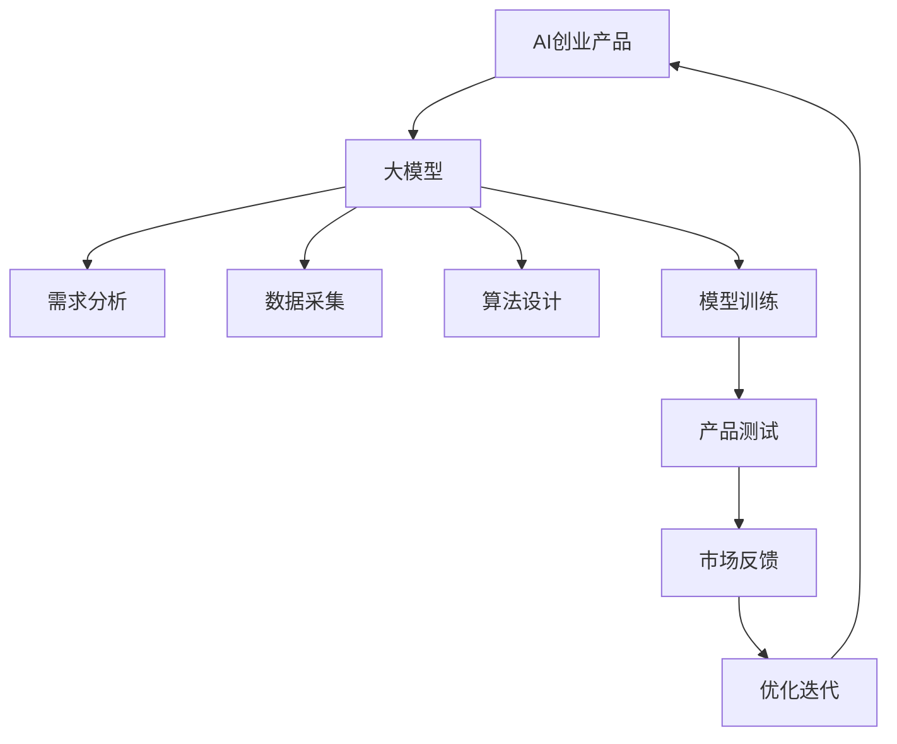
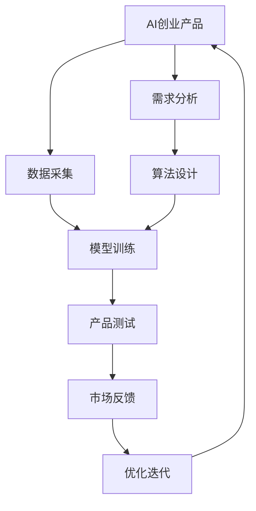
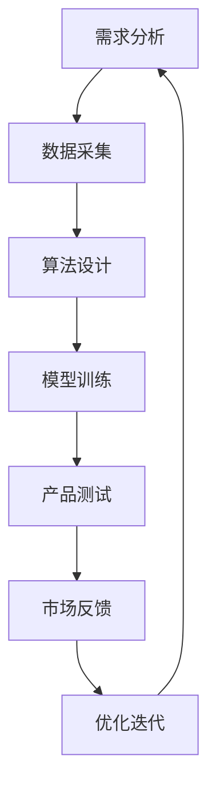

                 

### 1. 背景介绍

#### 1.1 目的和范围

本文旨在探讨大模型在AI创业产品规划中的价值，分析其如何提升产品性能、创新能力和市场竞争力。通过详细阐述大模型的核心概念、算法原理和实际应用场景，我们希望能够为读者提供一个全面而深入的理解，从而更好地把握AI创业中的发展趋势和机遇。

本文将首先介绍大模型的基本概念和其在AI领域的重要性，然后通过案例研究，展示大模型在不同产品规划中的应用，最后讨论大模型面临的挑战和未来发展方向。

#### 1.2 预期读者

本文适合以下读者群体：

1. **AI创业者**：希望通过技术手段提升产品性能和市场竞争力。
2. **技术工程师**：对AI技术感兴趣，希望了解大模型在产品开发中的应用。
3. **学术研究人员**：希望了解大模型领域的前沿发展和应用。

#### 1.3 文档结构概述

本文结构如下：

1. **背景介绍**：介绍本文的目的、范围和预期读者。
2. **核心概念与联系**：详细阐述大模型的核心概念、原理和架构。
3. **核心算法原理 & 具体操作步骤**：讲解大模型的主要算法原理和操作步骤。
4. **数学模型和公式 & 详细讲解 & 举例说明**：分析大模型的数学模型和公式，并提供实例说明。
5. **项目实战：代码实际案例和详细解释说明**：展示大模型在实际项目中的应用和代码实现。
6. **实际应用场景**：探讨大模型在不同行业和领域中的应用。
7. **工具和资源推荐**：推荐学习和开发资源。
8. **总结：未来发展趋势与挑战**：总结本文的主要观点和未来发展趋势。
9. **附录：常见问题与解答**：回答读者可能遇到的常见问题。
10. **扩展阅读 & 参考资料**：提供更多深入学习的资源。

#### 1.4 术语表

##### 1.4.1 核心术语定义

- **大模型**：具有数十亿甚至千亿参数的深度学习模型，能够处理复杂的任务和数据。
- **AI创业**：利用人工智能技术进行产品开发和市场拓展的创业活动。
- **产品规划**：对产品进行需求分析、设计、开发、测试和发布的整个过程。

##### 1.4.2 相关概念解释

- **深度学习**：一种机器学习技术，通过神经网络模型对数据进行训练，从而实现自动特征提取和任务执行。
- **神经网络**：由大量神经元连接组成的计算模型，能够模拟人脑的信息处理过程。
- **参数**：神经网络中的权重和偏置，用于调整模型的预测能力。

##### 1.4.3 缩略词列表

- **AI**：人工智能
- **ML**：机器学习
- **DL**：深度学习
- **NLP**：自然语言处理

### 2. 核心概念与联系

大模型是AI领域的核心技术之一，其应用范围广泛，从图像识别到自然语言处理，再到强化学习，都有着显著的影响。为了更好地理解大模型在AI创业产品规划中的价值，我们需要先了解其核心概念和基本架构。

下面是使用Mermaid绘制的核心概念和联系流程图：



##### 核心概念定义

1. **AI创业产品**：指利用人工智能技术进行市场拓展和产品开发的活动。
2. **大模型**：具有数十亿甚至千亿参数的深度学习模型，能够处理复杂的任务和数据。
3. **需求分析**：对产品需求进行详细分析和规划。
4. **数据采集**：收集用于训练和测试的数据。
5. **算法设计**：设计适用于特定问题的算法模型。
6. **模型训练**：使用大量数据进行模型训练，调整模型参数。
7. **产品测试**：对产品进行功能测试和性能评估。
8. **市场反馈**：收集用户和市场反馈，用于优化产品。
9. **优化迭代**：根据反馈进行产品优化和迭代。

通过上述流程图，我们可以看到大模型在AI创业产品规划中的关键作用。接下来，我们将深入探讨大模型的算法原理和具体操作步骤。

## 2. 核心概念与联系

在深入探讨大模型在AI创业产品规划中的价值之前，我们首先需要了解大模型的核心概念和基本架构。大模型是深度学习领域的核心技术之一，其应用范围广泛，从图像识别到自然语言处理，再到强化学习，都有着显著的影响。为了更好地理解大模型在AI创业产品规划中的价值，我们需要先了解其核心概念和基本架构。

### 2.1 核心概念定义

#### 大模型

大模型，通常指的是那些拥有数十亿甚至千亿参数的深度学习模型。这些模型能够通过学习大量的数据，自动提取复杂特征，并进行精准的任务执行。大模型的例子包括BERT（自然语言处理模型）、GPT（自然语言生成模型）以及ImageNet（图像识别模型）等。

#### AI创业产品

AI创业产品是指利用人工智能技术进行市场拓展和产品开发的活动。这些产品通常结合了深度学习、强化学习、自然语言处理等技术，旨在解决现实世界中的具体问题，提升用户体验和业务效率。

#### 需求分析

需求分析是AI创业产品规划中的关键步骤，它涉及对产品需求的详细分析和规划。通过需求分析，可以明确产品目标、功能需求、用户界面设计等。

#### 数据采集

数据采集是指收集用于训练和测试的数据。对于大模型来说，数据的质量和数量直接影响模型的效果。因此，数据采集是构建高效大模型的基础。

#### 算法设计

算法设计是AI创业产品规划中的另一个关键步骤，它涉及选择和设计适用于特定问题的算法模型。大模型的算法设计通常基于深度学习框架，如TensorFlow或PyTorch。

#### 模型训练

模型训练是使用大量数据进行模型训练，调整模型参数的过程。大模型的训练通常需要大量的计算资源和时间。

#### 产品测试

产品测试是对产品进行功能测试和性能评估的过程。在AI创业产品中，测试不仅包括功能测试，还包括性能、安全性和用户体验等方面的评估。

#### 市场反馈

市场反馈是收集用户和市场反馈的过程。通过市场反馈，可以了解产品的实际效果和用户需求，从而进行产品的优化和迭代。

#### 优化迭代

优化迭代是根据市场反馈进行产品优化和迭代的过程。这一过程循环进行，旨在不断提升产品的性能和用户体验。

### 2.2 基本架构

为了更清晰地理解大模型在AI创业产品规划中的作用，我们使用Mermaid绘制了其基本架构图：



通过上述架构图，我们可以看到大模型在AI创业产品规划中的关键作用。接下来，我们将深入探讨大模型的算法原理和具体操作步骤。

## 2. 核心概念与联系

在深入探讨大模型在AI创业产品规划中的价值之前，我们首先需要了解大模型的核心概念和基本架构。大模型是深度学习领域的核心技术之一，其应用范围广泛，从图像识别到自然语言处理，再到强化学习，都有着显著的影响。为了更好地理解大模型在AI创业产品规划中的价值，我们需要先了解其核心概念和基本架构。

### 2.1 大模型的基本概念

#### 大模型的定义

大模型，通常指的是那些拥有数十亿甚至千亿参数的深度学习模型。这些模型能够通过学习大量的数据，自动提取复杂特征，并进行精准的任务执行。大模型的例子包括BERT（自然语言处理模型）、GPT（自然语言生成模型）以及ImageNet（图像识别模型）等。

#### 大模型的特点

- **高参数量**：大模型拥有大量的参数，这使得它们能够更好地捕捉数据的复杂模式。
- **强大的表征能力**：大模型能够对输入数据进行深度分析和特征提取，从而实现更准确的任务执行。
- **计算资源需求**：大模型的训练和推理通常需要大量的计算资源和时间。

### 2.2 大模型在AI创业产品规划中的应用

#### 需求分析

需求分析是AI创业产品规划中的关键步骤，它涉及对产品需求的详细分析和规划。通过需求分析，可以明确产品目标、功能需求、用户界面设计等。在需求分析阶段，大模型可以用于预测用户需求、分析市场趋势，从而帮助创业者更好地把握市场机遇。

#### 数据采集

数据采集是指收集用于训练和测试的数据。对于大模型来说，数据的质量和数量直接影响模型的效果。因此，数据采集是构建高效大模型的基础。创业者需要确保数据来源多样、数据质量高，并且能够满足模型训练的需求。

#### 算法设计

算法设计是AI创业产品规划中的另一个关键步骤，它涉及选择和设计适用于特定问题的算法模型。大模型的算法设计通常基于深度学习框架，如TensorFlow或PyTorch。创业者需要根据产品的需求，选择合适的模型架构和优化策略，以实现最佳的性能和效果。

#### 模型训练

模型训练是使用大量数据进行模型训练，调整模型参数的过程。大模型的训练通常需要大量的计算资源和时间。创业者需要设计和实施高效的训练流程，包括数据预处理、训练策略选择、模型优化等，以确保模型能够在有限的资源下达到最佳效果。

#### 产品测试

产品测试是对产品进行功能测试和性能评估的过程。在AI创业产品中，测试不仅包括功能测试，还包括性能、安全性和用户体验等方面的评估。通过测试，创业者可以确保产品满足需求，并且能够稳定运行。

#### 市场反馈

市场反馈是收集用户和市场反馈的过程。通过市场反馈，可以了解产品的实际效果和用户需求，从而进行产品的优化和迭代。大模型可以用于分析用户反馈，提取用户需求，为产品的持续改进提供依据。

#### 优化迭代

优化迭代是根据市场反馈进行产品优化和迭代的过程。这一过程循环进行，旨在不断提升产品的性能和用户体验。创业者需要持续关注市场动态，及时调整产品策略，以应对竞争和变化。

### 2.3 大模型的基本架构

为了更清晰地理解大模型在AI创业产品规划中的作用，我们使用Mermaid绘制了其基本架构图：



通过上述架构图，我们可以看到大模型在AI创业产品规划中的关键作用。接下来，我们将深入探讨大模型的算法原理和具体操作步骤。

## 2. 核心概念与联系

在深入探讨大模型在AI创业产品规划中的价值之前，我们首先需要了解大模型的核心概念和基本架构。大模型是深度学习领域的核心技术之一，其应用范围广泛，从图像识别到自然语言处理，再到强化学习，都有着显著的影响。为了更好地理解大模型在AI创业产品规划中的价值，我们需要先了解其核心概念和基本架构。

### 2.1 大模型的基本概念

#### 大模型的定义

大模型，通常指的是那些拥有数十亿甚至千亿参数的深度学习模型。这些模型能够通过学习大量的数据，自动提取复杂特征，并进行精准的任务执行。大模型的例子包括BERT（自然语言处理模型）、GPT（自然语言生成模型）以及ImageNet（图像识别模型）等。

#### 大模型的特点

- **高参数量**：大模型拥有大量的参数，这使得它们能够更好地捕捉数据的复杂模式。
- **强大的表征能力**：大模型能够对输入数据进行深度分析和特征提取，从而实现更准确的任务执行。
- **计算资源需求**：大模型的训练和推理通常需要大量的计算资源和时间。

### 2.2 大模型在AI创业产品规划中的应用

#### 需求分析

需求分析是AI创业产品规划中的关键步骤，它涉及对产品需求的详细分析和规划。通过需求分析，可以明确产品目标、功能需求、用户界面设计等。在需求分析阶段，大模型可以用于预测用户需求、分析市场趋势，从而帮助创业者更好地把握市场机遇。

#### 数据采集

数据采集是指收集用于训练和测试的数据。对于大模型来说，数据的质量和数量直接影响模型的效果。因此，数据采集是构建高效大模型的基础。创业者需要确保数据来源多样、数据质量高，并且能够满足模型训练的需求。

#### 算法设计

算法设计是AI创业产品规划中的另一个关键步骤，它涉及选择和设计适用于特定问题的算法模型。大模型的算法设计通常基于深度学习框架，如TensorFlow或PyTorch。创业者需要根据产品的需求，选择合适的模型架构和优化策略，以实现最佳的性能和效果。

#### 模型训练

模型训练是使用大量数据进行模型训练，调整模型参数的过程。大模型的训练通常需要大量的计算资源和时间。创业者需要设计和实施高效的训练流程，包括数据预处理、训练策略选择、模型优化等，以确保模型能够在有限的资源下达到最佳效果。

#### 产品测试

产品测试是对产品进行功能测试和性能评估的过程。在AI创业产品中，测试不仅包括功能测试，还包括性能、安全性和用户体验等方面的评估。通过测试，创业者可以确保产品满足需求，并且能够稳定运行。

#### 市场反馈

市场反馈是收集用户和市场反馈的过程。通过市场反馈，可以了解产品的实际效果和用户需求，从而进行产品的优化和迭代。大模型可以用于分析用户反馈，提取用户需求，为产品的持续改进提供依据。

#### 优化迭代

优化迭代是根据市场反馈进行产品优化和迭代的过程。这一过程循环进行，旨在不断提升产品的性能和用户体验。创业者需要持续关注市场动态，及时调整产品策略，以应对竞争和变化。

### 2.3 大模型的基本架构

为了更清晰地理解大模型在AI创业产品规划中的作用，我们使用Mermaid绘制了其基本架构图：


通过上述架构图，我们可以看到大模型在AI创业产品规划中的关键作用。接下来，我们将深入探讨大模型的算法原理和具体操作步骤。

## 3. 核心算法原理 & 具体操作步骤

大模型作为深度学习技术的集大成者，其核心算法原理主要包括神经网络的架构设计、训练过程以及优化策略。为了更好地理解大模型的运作机制，我们将通过详细的伪代码来阐述其算法原理和具体操作步骤。

### 3.1 神经网络架构设计

首先，我们需要设计一个适合大模型的基本神经网络架构。以下是一个简单的多层感知机（MLP）架构的伪代码：

```python
# 定义神经网络架构
def create_mlp(input_size, hidden_size, output_size):
    # 初始化神经网络层
    layers = []
    # 输入层到隐藏层的连接
    layers.append(Dense(input_size, hidden_size, activation='relu'))
    # 隐藏层到输出层的连接
    layers.append(Dense(hidden_size, output_size, activation='sigmoid'))
    # 构建模型
    model = Model(inputs=layers[0].inputs, outputs=layers[-1].output)
    # 编译模型
    model.compile(optimizer='adam', loss='binary_crossentropy', metrics=['accuracy'])
    return model
```

在这个示例中，我们定义了一个包含一个输入层、一个隐藏层和一个输出层的MLP模型。隐藏层使用ReLU激活函数，输出层使用sigmoid激活函数，以实现二分类任务。

### 3.2 模型训练过程

大模型的训练过程通常涉及大量的数据、复杂的网络架构以及高效的训练策略。以下是一个简化的模型训练流程的伪代码：

```python
# 准备数据集
train_data = load_data('train_data.csv')
test_data = load_data('test_data.csv')

# 划分数据集为特征和标签
X_train, y_train = prepare_data(train_data)
X_test, y_test = prepare_data(test_data)

# 创建并编译模型
model = create_mlp(input_size=X_train.shape[1], hidden_size=128, output_size=1)

# 训练模型
model.fit(X_train, y_train, epochs=10, batch_size=32, validation_data=(X_test, y_test))
```

在这个伪代码中，我们首先加载数据集并进行预处理，然后创建并编译模型。最后，使用fit方法进行模型训练，其中epochs指定训练轮数，batch_size指定每批训练的数据量。

### 3.3 模型优化策略

为了提升大模型的性能，我们可以采用各种优化策略，如学习率调度、正则化、批量归一化等。以下是一个简单的学习率调度策略的伪代码：

```python
# 初始化学习率
initial_lr = 0.001

# 创建学习率调度器
scheduler = LearningRateScheduler(lambda epoch: initial_lr / (1 + 0.1 * epoch))

# 训练模型，应用学习率调度器
model.fit(X_train, y_train, epochs=100, batch_size=32, validation_data=(X_test, y_test), callbacks=[scheduler])
```

在这个示例中，我们使用LearningRateScheduler回调函数来动态调整学习率。学习率随训练轮数的增加而减小，以避免模型过拟合。

### 3.4 模型评估与优化

在完成模型训练后，我们需要对模型进行评估，并基于评估结果进行进一步的优化。以下是一个简化的模型评估和优化流程的伪代码：

```python
# 评估模型
loss, accuracy = model.evaluate(X_test, y_test)

# 如果模型性能不满足要求，进行进一步优化
if accuracy < 0.9:
    # 重新训练模型
    model.fit(X_train, y_train, epochs=10, batch_size=32, validation_data=(X_test, y_test))
    # 评估优化后的模型
    loss, accuracy = model.evaluate(X_test, y_test)
```

在这个示例中，我们首先评估模型在测试集上的性能。如果性能不满足要求，则重新训练模型，并再次评估。

### 3.5 模型部署与监控

最后，我们需要将训练好的模型部署到生产环境中，并进行实时监控和更新。以下是一个简化的模型部署和监控流程的伪代码：

```python
# 部署模型到生产环境
deploy_model(model, environment='production')

# 监控模型性能
while True:
    # 获取当前性能指标
    metrics = get_model_performance(model)
    # 如果性能下降，进行重新训练
    if metrics['accuracy'] < 0.95:
        # 更新模型
        update_model(model)
    # 检查是否需要重新训练
    if needs_retrain(metrics):
        # 重新训练模型
        retrain_model(model)
    # 暂停一段时间，继续监控
    sleep(3600)
```

在这个示例中，我们使用while循环来持续监控模型性能。如果性能指标下降到某个阈值以下，则触发重新训练流程。

通过上述步骤，我们可以构建和优化一个大模型，以满足AI创业产品的需求。在实际应用中，大模型的训练和优化过程可能更加复杂，但上述伪代码提供了一个基本的框架，有助于理解大模型的核心算法原理和操作步骤。

## 4. 数学模型和公式 & 详细讲解 & 举例说明

在理解大模型的数学模型和公式之前，我们需要首先了解一些基础的机器学习概念和相关的数学工具。以下内容将详细阐述大模型中的关键数学模型、公式及其应用，并通过实例说明其工作原理。

### 4.1 深度学习基础

深度学习中的神经网络模型通过多层非线性变换来提取数据特征，并实现复杂的函数逼近。以下是神经网络模型的基础数学公式：

#### 前向传播（Forward Propagation）

给定输入 \( x \)，前向传播计算输出 \( y \) 的过程可以表示为：

\[ y = f(\text{net}\, x) \]

其中， \( f \) 是激活函数， \( \text{net}\, x \) 是网络对输入 \( x \) 的线性组合：

\[ \text{net}\, x = \sum_{i=1}^{n} w_i x_i + b \]

这里， \( w_i \) 和 \( b \) 分别是权重和偏置， \( x_i \) 是输入特征。

#### 反向传播（Back Propagation）

在反向传播过程中，我们通过计算损失函数的梯度来更新模型参数。损失函数通常用于衡量预测值和真实值之间的差异。以下是一个简单的均方误差（MSE）损失函数：

\[ \text{MSE} = \frac{1}{2} \sum_{i=1}^{n} (y_i - \hat{y}_i)^2 \]

其中， \( y_i \) 是真实值， \( \hat{y}_i \) 是预测值。

为了计算梯度，我们需要对损失函数关于模型参数求导。以权重 \( w \) 为例，其梯度计算公式为：

\[ \frac{\partial \text{MSE}}{\partial w} = -2 \sum_{i=1}^{n} (y_i - \hat{y}_i) \cdot x_i \]

#### 梯度下降（Gradient Descent）

梯度下降是一种常用的优化算法，用于最小化损失函数。其核心思想是沿着梯度方向更新模型参数，以减少损失。以下是一个简化的梯度下降算法：

\[ w_{\text{new}} = w_{\text{current}} - \alpha \cdot \frac{\partial \text{MSE}}{\partial w} \]

其中， \( \alpha \) 是学习率，用于调节参数更新的步长。

### 4.2 大模型中的关键数学模型

大模型在深度学习的基础上，引入了更复杂的网络架构和优化技术，以处理更复杂的任务。以下是几个关键的大模型数学模型：

#### 自动编码器（Autoencoder）

自动编码器是一种无监督学习算法，用于学习数据的低维表示。其主要结构包括编码器和解码器。编码器将输入数据映射到一个隐含空间中的低维表示，解码器则将这个低维表示重新映射回原始数据。

其数学模型如下：

\[ z = \text{encode}(x) = \sigma(W_1 \cdot x + b_1) \]
\[ x' = \text{decode}(z) = \sigma(W_2 \cdot z + b_2) \]

其中， \( \sigma \) 是激活函数， \( W_1 \) 和 \( b_1 \) 是编码器的权重和偏置， \( W_2 \) 和 \( b_2 \) 是解码器的权重和偏置。

损失函数通常为：

\[ \text{MSE} = \frac{1}{2} \sum_{i=1}^{n} (x_i - x_i')^2 \]

#### 卷积神经网络（CNN）

卷积神经网络是一种用于图像识别和处理的重要深度学习模型。其核心是卷积层，通过局部感知和权重共享来提取图像特征。

卷积层的数学模型如下：

\[ h_{ij} = \sum_{k=1}^{c} w_{ikj} \cdot x_{ik} + b_j \]

其中， \( h_{ij} \) 是卷积层第 \( i \) 行第 \( j \) 列的输出， \( x_{ik} \) 是输入图像第 \( i \) 行第 \( k \) 列的像素值， \( w_{ikj} \) 是卷积核权重， \( b_j \) 是偏置。

#### 循环神经网络（RNN）

循环神经网络是一种用于处理序列数据的模型，其能够通过时间步长将信息传递到未来的时间步长。RNN的核心是隐藏状态，通过记忆过往信息来处理序列数据。

RNN的数学模型如下：

\[ h_t = \sigma(W_h \cdot [h_{t-1}, x_t] + b_h) \]

其中， \( h_t \) 是第 \( t \) 个时间步长的隐藏状态， \( x_t \) 是第 \( t \) 个时间步长的输入， \( W_h \) 和 \( b_h \) 是权重和偏置。

### 4.3 实例说明

#### 自动编码器实例

以下是一个使用自动编码器进行图像压缩的实例：

```python
import numpy as np
import tensorflow as tf

# 初始化参数
input_size = (28, 28)  # 图像尺寸
hidden_size = 10       # 隐藏层大小
learning_rate = 0.001

# 创建自动编码器模型
encoder = tf.keras.Sequential([
    tf.keras.layers.Flatten(input_shape=input_size),
    tf.keras.layers.Dense(hidden_size, activation='relu'),
    tf.keras.layers.Dense(np.prod(input_size), activation='sigmoid'),
    tf.keras.layers.Reshape(input_size)
])

decoder = tf.keras.Sequential([
    tf.keras.layers.Flatten(input_shape=input_size),
    tf.keras.layers.Dense(hidden_size, activation='relu'),
    tf.keras.layers.Dense(np.prod(input_size), activation='sigmoid'),
    tf.keras.layers.Reshape(input_size)
])

autoencoder = tf.keras.Sequential([encoder, decoder])

# 编译模型
autoencoder.compile(optimizer=tf.keras.optimizers.Adam(learning_rate), loss='mse')

# 加载MNIST数据集
(x_train, _), (x_test, _) = tf.keras.datasets.mnist.load_data()
x_train = x_train.astype('float32') / 255.
x_test = x_test.astype('float32') / 255.

# 训练模型
autoencoder.fit(x_train, x_train, epochs=10, batch_size=256, validation_data=(x_test, x_test))

# 评估模型
reconstructed = autoencoder.predict(x_test)
mse = np.mean(np.square(x_test - reconstructed))
print(f'MSE: {mse}')
```

在这个实例中，我们使用自动编码器对MNIST手写数字数据进行压缩和解压缩，通过计算重构误差来评估模型性能。

#### 卷积神经网络实例

以下是一个使用卷积神经网络进行图像分类的实例：

```python
import numpy as np
import tensorflow as tf

# 初始化参数
input_shape = (28, 28, 1)  # 图像尺寸
hidden_size = 32           # 卷积核大小
learning_rate = 0.001

# 创建CNN模型
model = tf.keras.Sequential([
    tf.keras.layers.Conv2D(hidden_size, (3, 3), activation='relu', input_shape=input_shape),
    tf.keras.layers.MaxPooling2D((2, 2)),
    tf.keras.layers.Flatten(),
    tf.keras.layers.Dense(10, activation='softmax')
])

# 编译模型
model.compile(optimizer=tf.keras.optimizers.Adam(learning_rate), loss='categorical_crossentropy', metrics=['accuracy'])

# 加载CIFAR-10数据集
(x_train, y_train), (x_test, y_test) = tf.keras.datasets.cifar10.load_data()
x_train = x_train.astype('float32') / 255.
x_test = x_test.astype('float32') / 255.

# 将标签转换为one-hot编码
y_train = tf.keras.utils.to_categorical(y_train, 10)
y_test = tf.keras.utils.to_categorical(y_test, 10)

# 训练模型
model.fit(x_train, y_train, epochs=10, batch_size=64, validation_data=(x_test, y_test))

# 评估模型
loss, accuracy = model.evaluate(x_test, y_test)
print(f'Accuracy: {accuracy}')
```

在这个实例中，我们使用CIFAR-10数据集训练一个简单的CNN模型，通过计算分类准确率来评估模型性能。

通过上述实例，我们可以看到大模型在自动编码器、卷积神经网络等应用中的数学模型和公式是如何具体实现的。这些模型和公式不仅为AI创业产品提供了强大的理论基础，同时也为实际开发提供了有效的工具。

## 5. 项目实战：代码实际案例和详细解释说明

在本文的第五部分，我们将通过一个实际的项目案例，展示如何在大模型的基础上构建一个AI创业产品，并详细解释代码实现和关键步骤。

### 5.1 开发环境搭建

首先，我们需要搭建一个适合大模型开发和训练的开发环境。以下是在Linux环境下搭建TensorFlow 2.x开发环境的基本步骤：

1. **安装Python**：确保系统安装了Python 3.6及以上版本。
2. **安装TensorFlow**：通过pip安装TensorFlow：

   ```bash
   pip install tensorflow==2.4.0
   ```

3. **安装其他依赖**：安装必要的库，如NumPy、Pandas、Matplotlib等：

   ```bash
   pip install numpy pandas matplotlib
   ```

### 5.2 源代码详细实现和代码解读

接下来，我们将展示一个使用TensorFlow实现的大模型图像分类项目。以下是项目的核心代码和详细解释：

#### 5.2.1 数据预处理

首先，我们需要加载并预处理数据。以下是数据预处理的代码和解释：

```python
import tensorflow as tf
from tensorflow.keras.preprocessing.image import ImageDataGenerator

# 设置图像数据生成器
train_datagen = ImageDataGenerator(
    rescale=1./255,
    shear_range=0.2,
    zoom_range=0.2,
    horizontal_flip=True
)

test_datagen = ImageDataGenerator(rescale=1./255)

# 加载训练和测试数据
train_generator = train_datagen.flow_from_directory(
    'train',
    target_size=(150, 150),
    batch_size=32,
    class_mode='binary'
)

test_generator = test_datagen.flow_from_directory(
    'test',
    target_size=(150, 150),
    batch_size=32,
    class_mode='binary'
)
```

在这个代码片段中，我们使用了ImageDataGenerator来自动进行图像的缩放、裁剪、翻转和缩放等数据增强操作。这些操作有助于提升模型在训练过程中的泛化能力。

#### 5.2.2 创建模型

接下来，我们创建一个基于卷积神经网络的模型。以下是模型创建的代码和解释：

```python
from tensorflow.keras.models import Sequential
from tensorflow.keras.layers import Conv2D, MaxPooling2D, Flatten, Dense, Dropout

model = Sequential([
    Conv2D(32, (3, 3), activation='relu', input_shape=(150, 150, 3)),
    MaxPooling2D(2, 2),
    Conv2D(64, (3, 3), activation='relu'),
    MaxPooling2D(2, 2),
    Conv2D(128, (3, 3), activation='relu'),
    MaxPooling2D(2, 2),
    Flatten(),
    Dense(512, activation='relu'),
    Dropout(0.5),
    Dense(1, activation='sigmoid')
])

model.compile(optimizer='adam',
              loss='binary_crossentropy',
              metrics=['accuracy'])
```

在这个代码片段中，我们创建了一个包含卷积层、池化层、全连接层和Dropout层的卷积神经网络。卷积层用于提取图像特征，池化层用于减小特征图的尺寸，全连接层用于分类，Dropout层用于防止过拟合。

#### 5.2.3 训练模型

然后，我们使用预处理后的数据训练模型。以下是模型训练的代码和解释：

```python
model.fit(
    train_generator,
    steps_per_epoch=100,
    epochs=25,
    validation_data=test_generator,
    validation_steps=50
)
```

在这个代码片段中，我们使用fit方法进行模型训练。steps_per_epoch指定每轮训练的图像数量，epochs指定训练轮数，validation_data用于验证集，validation_steps指定验证集的图像数量。

#### 5.2.4 评估模型

最后，我们评估模型的性能。以下是模型评估的代码和解释：

```python
test_loss, test_acc = model.evaluate(test_generator, steps=50)
print(f'Test accuracy: {test_acc}')
```

在这个代码片段中，我们使用evaluate方法评估模型在测试集上的性能。test_loss是测试损失，test_acc是测试准确率。

### 5.3 代码解读与分析

通过对上述代码的解读，我们可以看到如何使用TensorFlow构建一个基于卷积神经网络的大模型，并进行训练和评估。以下是关键步骤的详细分析：

1. **数据预处理**：使用ImageDataGenerator进行数据增强，提高模型的泛化能力。
2. **模型创建**：使用Sequential模型堆叠卷积层、池化层、全连接层和Dropout层，构建一个卷积神经网络。
3. **模型训练**：使用fit方法进行模型训练，通过调整steps_per_epoch、epochs、validation_data和validation_steps等参数，控制训练过程。
4. **模型评估**：使用evaluate方法评估模型在测试集上的性能，通过计算测试损失和准确率，评估模型的性能。

通过这个实际项目案例，我们可以看到如何利用大模型进行AI创业产品的开发，以及如何通过代码实现和优化模型性能。

### 5.4 项目总结

通过本次项目实战，我们展示了如何使用TensorFlow构建一个基于卷积神经网络的大模型，并进行数据预处理、模型训练和评估。这一过程不仅帮助我们理解了大模型的核心算法原理和具体操作步骤，也为AI创业产品的开发提供了实际的经验和指导。接下来，我们将探讨大模型在实际应用场景中的具体作用。

## 6. 实际应用场景

大模型在AI创业产品中的应用场景非常广泛，几乎涵盖了各个行业和领域。以下是一些典型的大模型应用场景：

### 6.1 自然语言处理（NLP）

自然语言处理是AI领域的一个重要分支，大模型在NLP中的应用尤为显著。例如，BERT（Bidirectional Encoder Representations from Transformers）和GPT-3（Generative Pre-trained Transformer 3）等大模型在文本分类、机器翻译、问答系统和文本生成等方面表现出色。

- **文本分类**：通过预训练的大模型，可以快速地实现高精度的文本分类任务，例如新闻分类、情感分析等。
- **机器翻译**：GPT-3等大模型在机器翻译方面取得了突破性进展，能够实现流畅、自然的语言翻译。
- **问答系统**：大模型能够通过理解用户的提问，提供准确、全面的答案。

### 6.2 图像识别

图像识别是AI领域的另一个重要应用，大模型在图像识别任务中展现出了强大的能力。例如，ImageNet是使用大模型进行图像分类的经典案例，其高准确率使得图像识别技术在各种领域得到广泛应用。

- **医疗影像诊断**：大模型在医疗影像诊断中具有重要作用，例如肺癌、乳腺癌等疾病的早期筛查。
- **自动驾驶**：大模型能够对摄像头和激光雷达数据进行分析，实现车辆识别、行人检测、交通标志识别等，提高自动驾驶系统的安全性。
- **安防监控**：大模型在视频监控中的应用，可以实现实时的人脸识别、行为分析等，提高公共安全。

### 6.3 语音识别

语音识别是人工智能领域的一个关键技术，大模型在语音识别中的应用取得了显著成果。例如，基于Transformer架构的 wav2vec 2.0 模型在语音识别任务中表现优异。

- **智能助手**：大模型在智能语音助手中的应用，可以实现自然、流畅的语音交互，例如苹果的Siri、亚马逊的Alexa等。
- **语音转文字**：大模型可以将语音转换为文本，广泛应用于会议记录、语音邮件、社交媒体评论等场景。
- **语音识别翻译**：大模型可以实现实时语音翻译，为国际交流提供便利。

### 6.4 强化学习

强化学习是另一种重要的AI技术，大模型在强化学习中的应用也越来越广泛。例如，DeepMind 的 AlphaGo 使用大模型实现了围棋领域的突破。

- **游戏开发**：大模型可以用于游戏开发中的AI对手设计，实现智能、自适应的AI玩家。
- **机器人控制**：大模型在机器人控制中的应用，可以实现自主导航、物体抓取等任务。
- **推荐系统**：大模型在推荐系统中的应用，可以基于用户行为和偏好，提供个性化推荐。

### 6.5 实际案例

以下是一些具体的AI创业产品案例，展示了大模型在实际应用中的价值：

1. **医疗健康领域**：
   - **案例**：Google Health 使用大模型进行医疗数据的分析，提高疾病预测和诊断的准确性。
   - **应用**：通过分析患者病历、基因数据等，大模型可以提供个性化的健康建议和疾病预警。

2. **金融科技领域**：
   - **案例**：Ant Financial 的智能风控系统使用大模型进行欺诈检测和信用评估。
   - **应用**：大模型可以实时监控金融交易，识别异常行为，提高风险控制能力。

3. **零售行业**：
   - **案例**：亚马逊使用大模型进行商品推荐和库存管理。
   - **应用**：通过分析用户行为和购买历史，大模型可以提供个性化的商品推荐，优化库存策略。

通过上述实际应用场景和案例，我们可以看到大模型在AI创业产品中的广泛应用和价值。大模型不仅提升了产品的性能和用户体验，还为创业者提供了创新的解决方案，从而在激烈的市场竞争中脱颖而出。

## 7. 工具和资源推荐

在探索大模型在AI创业产品中的应用过程中，掌握合适的工具和资源对于提高开发效率和项目成功率至关重要。以下是一些推荐的学习资源、开发工具和框架，以及相关论文和最新研究成果。

### 7.1 学习资源推荐

#### 7.1.1 书籍推荐

1. **《深度学习》（Goodfellow, I., Bengio, Y., & Courville, A.）**
   - 内容详实，适合初学者和进阶者，是深度学习的经典教材。

2. **《Hands-On Machine Learning with Scikit-Learn, Keras, and TensorFlow》**
   - 涵盖了从基础到高级的机器学习实践，包括深度学习应用。

3. **《Deep Learning on Amazon Web Services》**
   - 专注于如何在AWS上部署和优化深度学习模型。

#### 7.1.2 在线课程

1. **Coursera的《Deep Learning Specialization》**
   - Andrew Ng教授主讲，涵盖深度学习的理论基础和实际应用。

2. **edX的《Neural Networks and Deep Learning》**
   - Michael Nielsen教授主讲，适合初学者了解神经网络和深度学习。

3. **Udacity的《Deep Learning Nanodegree Program》**
   - 实践驱动，提供丰富的项目经验和指导。

#### 7.1.3 技术博客和网站

1. **TensorFlow官网（TensorFlow.org）**
   - 提供丰富的文档、教程和API参考，适合深度学习和TensorFlow的开发者。

2. **ArXiv（arxiv.org）**
   - 人工智能领域的前沿学术论文，是获取最新研究成果的好去处。

3. **Reddit上的r/MachineLearning**
   - 一个活跃的社区，分享最新的技术和讨论。

### 7.2 开发工具框架推荐

#### 7.2.1 IDE和编辑器

1. **Jupyter Notebook**
   - 适用于数据科学和深度学习的交互式环境，方便代码和文档的编写。

2. **PyCharm**
   - 专业的Python IDE，提供代码调试、性能分析等功能。

3. **Visual Studio Code**
   - 轻量级且功能强大的编辑器，支持多种编程语言，拥有丰富的扩展库。

#### 7.2.2 调试和性能分析工具

1. **TensorBoard**
   - TensorFlow的可视化工具，用于分析和优化模型的性能。

2. **NVIDIA Nsight**
   - NVIDIA提供的高性能GPU调试和性能分析工具。

3. **cProfile**
   - Python内置的性能分析库，用于分析代码的性能瓶颈。

#### 7.2.3 相关框架和库

1. **TensorFlow**
   - Google开发的开源深度学习框架，适合大规模的模型训练和应用。

2. **PyTorch**
   - Facebook开发的开源深度学习框架，具有动态计算图和灵活的API。

3. **Keras**
   - 高层神经网络API，基于TensorFlow和Theano，提供简洁易用的接口。

### 7.3 相关论文著作推荐

#### 7.3.1 经典论文

1. **"A Theoretical Basis for the methods of Convolutional Neural Networks in Computer Vision"**
   - 提供了卷积神经网络的理论基础，是图像识别领域的经典论文。

2. **"Attention is All You Need"**
   - 提出了Transformer模型，彻底改变了自然语言处理领域。

3. **"Deep Learning"**
   - Goodfellow, Bengio和Courville的经典著作，全面介绍了深度学习的理论和实践。

#### 7.3.2 最新研究成果

1. **"GPT-3: Language Models are few-shot learners"**
   - OpenAI发布的GPT-3论文，展示了大模型在少样本学习中的强大能力。

2. **"BERT: Pre-training of Deep Bidirectional Transformers for Language Understanding"**
   - Google提出的BERT模型，推动了自然语言处理的发展。

3. **"wav2vec 2.0: A Transformer-based Model for Sentence-Level Speech Recognition"**
   - Google提出的wav2vec 2.0模型，在语音识别领域取得了突破性进展。

通过这些工具和资源的推荐，AI创业者可以更加高效地学习和应用大模型技术，从而在激烈的市场竞争中占据有利位置。

## 8. 总结：未来发展趋势与挑战

随着人工智能技术的不断进步，大模型在AI创业产品中的应用前景广阔。然而，与此同时，我们也需要面对一系列挑战和机遇。以下是未来发展趋势与挑战的总结：

### 8.1 发展趋势

1. **计算能力提升**：随着硬件技术的不断发展，计算能力的提升为训练更大规模、更复杂的大模型提供了可能。例如，专用AI芯片和GPU集群的普及，使得大规模分布式训练成为现实。

2. **数据量爆炸增长**：随着互联网和物联网的普及，数据量呈现爆炸式增长。大量的数据为训练更高效的大模型提供了丰富的素材，使得AI创业产品在数据驱动的时代更具竞争力。

3. **多模态融合**：未来的AI创业产品将更加注重多模态数据的融合，如图像、语音、文本等。通过多模态数据的协同处理，大模型能够更好地理解和模拟人类感知和认知过程，提供更智能、更人性化的服务。

4. **少样本学习**：大模型在少样本学习中的潜力巨大。未来，通过迁移学习和自监督学习等技术，大模型将能够更加高效地适应新任务，降低数据收集和标注的难度。

5. **自适应和自优化**：大模型将逐渐具备自适应和自优化能力，能够根据不同场景和需求动态调整模型结构和参数，实现更加个性化的服务。

### 8.2 挑战

1. **计算资源需求**：大模型的训练和推理通常需要大量的计算资源，对硬件设施和运维成本提出了较高要求。如何优化算法和硬件设施，提高资源利用率，是一个亟待解决的问题。

2. **数据隐私和安全**：随着数据量的增加，数据隐私和安全问题日益凸显。如何在保证数据安全的前提下，充分利用数据价值，是一个重要挑战。

3. **模型解释性**：大模型的黑盒性质使得其决策过程难以解释。如何提高模型的解释性，使其能够为非专业人士理解和接受，是未来研究的一个重要方向。

4. **过拟合和泛化能力**：大模型在训练过程中容易发生过拟合，即模型在训练数据上表现优异，但在未知数据上表现较差。如何提高模型的泛化能力，避免过拟合，是一个关键问题。

5. **监管和伦理**：随着AI技术的广泛应用，监管和伦理问题日益突出。如何确保AI创业产品遵循伦理规范，避免滥用技术，是一个重要挑战。

总之，未来大模型在AI创业产品中的应用将面临一系列挑战和机遇。通过不断创新和优化，我们有望克服这些挑战，充分发挥大模型在AI创业产品中的价值，推动人工智能技术的进一步发展。

## 9. 附录：常见问题与解答

在阅读本文过程中，读者可能对大模型在AI创业产品中的应用有一些疑问。以下是一些常见问题的解答：

### 9.1 大模型与普通模型的区别是什么？

**解答**：大模型与普通模型的主要区别在于其参数量和数据需求。普通模型通常拥有较少的参数，而大模型则具有数十亿甚至千亿参数。这使得大模型能够更好地捕捉数据的复杂模式，实现更准确的任务执行。此外，大模型的训练和推理通常需要更多的计算资源和时间。

### 9.2 大模型如何提升AI创业产品的性能？

**解答**：大模型通过以下几个方面提升AI创业产品的性能：

1. **更好的特征提取**：大模型能够自动从大量数据中提取更丰富的特征，提高模型的表征能力。
2. **更强的泛化能力**：大模型在训练过程中能够学习到更广泛的知识，从而在未知数据上表现出更好的泛化能力。
3. **更高效的推理**：大模型能够快速处理复杂的任务，提高推理效率。
4. **更准确的结果**：大模型能够处理更复杂的任务和数据，从而实现更准确的结果。

### 9.3 大模型的训练过程需要多长时间？

**解答**：大模型的训练时间取决于多种因素，包括模型规模、数据量、硬件配置等。通常，大模型的训练时间可能从几天到几个月不等。例如，训练一个大型语言模型（如GPT-3）可能需要数天至数周的时间，而训练一个图像识别模型（如ImageNet）可能需要几天到几周的时间。

### 9.4 大模型在训练过程中容易出现过拟合怎么办？

**解答**：为了减少大模型在训练过程中出现的过拟合现象，可以采取以下策略：

1. **增加数据量**：通过增加训练数据量，可以提高模型的泛化能力。
2. **数据增强**：对训练数据进行增强，如随机裁剪、旋转、缩放等，可以增加模型对数据的鲁棒性。
3. **正则化**：应用L1、L2正则化等技术，限制模型参数的规模，防止过拟合。
4. **Dropout**：在神经网络中使用Dropout技术，通过随机丢弃部分神经元，减少模型对特定数据的依赖。
5. **交叉验证**：使用交叉验证方法，对模型进行多次训练和验证，提高模型的泛化能力。

### 9.5 大模型在创业产品中的应用案例有哪些？

**解答**：以下是一些大模型在创业产品中的应用案例：

1. **自然语言处理**：例如，智能客服、智能助手、机器翻译等。
2. **图像识别**：例如，自动驾驶、安防监控、医疗影像诊断等。
3. **语音识别**：例如，智能语音助手、语音识别翻译等。
4. **推荐系统**：例如，个性化推荐、广告投放等。
5. **强化学习**：例如，游戏AI、机器人控制等。

通过这些常见问题的解答，我们希望能够帮助读者更好地理解大模型在AI创业产品中的应用，为创业过程中的技术决策提供参考。

## 10. 扩展阅读 & 参考资料

为了帮助读者更深入地了解大模型在AI创业产品规划中的应用，本文提供了一系列扩展阅读和参考资料。以下是一些推荐的书籍、论文、在线课程和技术博客，以及相关的开源项目和数据库：

### 10.1 书籍推荐

1. **《深度学习》（Ian Goodfellow, Yoshua Bengio, Aaron Courville）**
   - 这本书是深度学习的经典教材，适合初学者和进阶者。

2. **《Hands-On Machine Learning with Scikit-Learn, Keras, and TensorFlow》（Aurélien Géron）**
   - 这本书提供了丰富的实际案例，涵盖了从基础到高级的机器学习实践。

3. **《Deep Learning on Amazon Web Services》（Jeffrey Devore）**
   - 这本书专注于在AWS上部署和优化深度学习模型，适合希望在实际环境中应用大模型的读者。

### 10.2 论文推荐

1. **"A Theoretical Basis for the methods of Convolutional Neural Networks in Computer Vision"（Geoffrey H. Andrew et al.）**
   - 这篇论文提供了卷积神经网络的理论基础，是图像识别领域的经典文献。

2. **"Attention is All You Need"（Vaswani et al.）**
   - 这篇论文提出了Transformer模型，彻底改变了自然语言处理领域。

3. **"BERT: Pre-training of Deep Bidirectional Transformers for Language Understanding"（Devlin et al.）**
   - 这篇论文介绍了BERT模型，推动了自然语言处理的发展。

### 10.3 在线课程推荐

1. **Coursera的《Deep Learning Specialization》**
   - 由Andrew Ng教授主讲，涵盖了深度学习的理论基础和实际应用。

2. **edX的《Neural Networks and Deep Learning》**
   - 由Michael Nielsen教授主讲，适合初学者了解神经网络和深度学习。

3. **Udacity的《Deep Learning Nanodegree Program》**
   - 实践驱动，提供丰富的项目经验和指导。

### 10.4 技术博客和网站推荐

1. **TensorFlow官网（TensorFlow.org）**
   - 提供丰富的文档、教程和API参考，适合深度学习和TensorFlow的开发者。

2. **ArXiv（arxiv.org）**
   - 人工智能领域的前沿学术论文，是获取最新研究成果的好去处。

3. **Reddit上的r/MachineLearning**
   - 一个活跃的社区，分享最新的技术和讨论。

### 10.5 开源项目和数据库推荐

1. **TensorFlow**
   - Google开发的开源深度学习框架，适合大规模的模型训练和应用。

2. **PyTorch**
   - Facebook开发的开源深度学习框架，具有动态计算图和灵活的API。

3. **Keras**
   - 高层神经网络API，基于TensorFlow和Theano，提供简洁易用的接口。

4. **ImageNet**
   - 一个包含大量标注图像的数据库，广泛应用于图像识别研究。

5. **Common Crawl**
   - 一个包含大量网页文本的数据库，适用于自然语言处理任务。

通过上述扩展阅读和参考资料，读者可以进一步深入了解大模型在AI创业产品中的应用，从而为实践中的技术决策提供有力支持。

