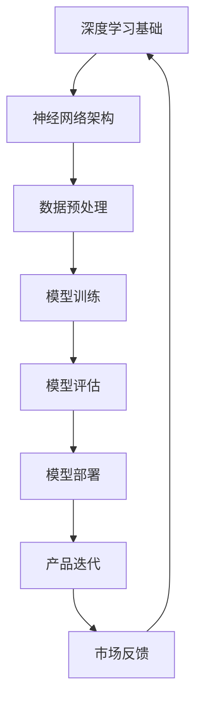

                 

# 大模型在 AI 创业公司产品路线图规划中的关键作用

> 关键词：AI 创业，产品路线图，大模型，深度学习，数据驱动，策略优化

> 摘要：本文将探讨大模型在 AI 创业公司产品路线图规划中的关键作用。通过分析大模型的基本原理和优势，我们将逐步展示大模型如何助力创业公司在市场定位、产品设计、策略优化等方面取得成功。本文还将提供具体的实例和实用建议，帮助读者更好地理解和应用大模型在 AI 创业中的实际意义。

## 1. 背景介绍

### 1.1 目的和范围

本文旨在深入探讨大模型在 AI 创业公司产品路线图规划中的应用价值。我们将从以下几个方面展开讨论：

- 大模型的基本原理与优势
- 大模型在产品路线图规划中的应用
- 大模型如何助力创业公司取得成功
- 实际案例分析与策略建议

### 1.2 预期读者

本文适合以下读者群体：

- AI 创业公司创始人、产品经理、研发团队
- 对 AI 技术和产品规划感兴趣的技术专家
- 想要在 AI 领域创业的投资人和创业者
- 对 AI 创业生态系统有深入了解的专业人士

### 1.3 文档结构概述

本文将按照以下结构展开：

1. 背景介绍
2. 核心概念与联系
3. 核心算法原理 & 具体操作步骤
4. 数学模型和公式 & 详细讲解 & 举例说明
5. 项目实战：代码实际案例和详细解释说明
6. 实际应用场景
7. 工具和资源推荐
8. 总结：未来发展趋势与挑战
9. 附录：常见问题与解答
10. 扩展阅读 & 参考资料

### 1.4 术语表

#### 1.4.1 核心术语定义

- **大模型**：指具有数百万至上亿参数的深度学习模型，如 GPT、BERT 等。
- **产品路线图**：指公司产品的长期规划，包括市场定位、功能迭代、时间表等。
- **AI 创业**：指利用人工智能技术进行创业的活动，包括技术研发、市场拓展、商业模式创新等。

#### 1.4.2 相关概念解释

- **深度学习**：一种基于人工神经网络的机器学习技术，通过层层提取特征来实现智能。
- **数据驱动**：指通过数据分析和挖掘来指导产品设计和决策。
- **策略优化**：指在复杂环境中寻找最优策略的过程，如决策树、强化学习等。

#### 1.4.3 缩略词列表

- **AI**：人工智能（Artificial Intelligence）
- **GPT**：生成预训练模型（Generative Pre-trained Transformer）
- **BERT**：双向编码器表示（Bidirectional Encoder Representations from Transformers）
- **IDE**：集成开发环境（Integrated Development Environment）
- **API**：应用程序接口（Application Programming Interface）

## 2. 核心概念与联系

为了更好地理解大模型在 AI 创业公司产品路线图规划中的关键作用，我们需要首先了解大模型的基本原理和架构。以下是一个简化的 Mermaid 流程图，展示了大模型的核心概念和联系：



### 2.1 深度学习基础

深度学习是人工智能的一个重要分支，通过多层神经网络模型来模拟人脑的学习和认知过程。深度学习的核心在于神经网络架构，主要包括输入层、隐藏层和输出层。通过逐层提取特征，神经网络能够从原始数据中提取出具有代表性的特征表示。

### 2.2 神经网络架构

神经网络架构是深度学习模型的核心组成部分。常见的神经网络架构包括卷积神经网络（CNN）、循环神经网络（RNN）和变换器（Transformer）等。这些架构在处理不同类型的数据和任务时具有各自的优缺点。

### 2.3 数据预处理

数据预处理是深度学习模型训练的重要环节。通过数据清洗、归一化和特征提取等步骤，我们可以将原始数据转化为适合模型训练的格式。高质量的数据预处理有助于提高模型的性能和稳定性。

### 2.4 模型训练

模型训练是深度学习模型的另一个关键环节。通过不断调整模型参数，使其在训练数据上达到最优性能。训练过程中，我们通常使用反向传播算法和优化器（如梯度下降、Adam 等）来更新模型参数。

### 2.5 模型评估

模型评估是判断模型性能的重要步骤。通过在测试数据集上评估模型的表现，我们可以了解模型的泛化能力和准确性。常见的评估指标包括准确率、召回率、F1 值等。

### 2.6 模型部署

模型部署是将训练好的模型应用到实际场景中的过程。通过将模型转化为可执行的代码，我们可以在生产环境中实现模型的功能。模型部署还包括模型监控、性能优化和更新维护等环节。

### 2.7 产品迭代

产品迭代是创业公司持续发展的关键。通过不断地优化产品功能和性能，我们能够满足用户需求、提高市场竞争力。大模型在产品迭代中发挥着重要作用，可以帮助我们快速识别用户需求、优化产品设计和提升用户体验。

### 2.8 市场反馈

市场反馈是创业公司产品路线图规划的重要依据。通过收集和分析用户反馈，我们能够了解产品的市场表现、识别潜在问题和优化方向。大模型在处理和分析市场反馈数据方面具有显著优势，可以帮助创业公司做出更加精准的决策。

## 3. 核心算法原理 & 具体操作步骤

在了解了大模型的基本原理和架构后，我们接下来将深入探讨大模型在产品路线图规划中的核心算法原理和具体操作步骤。本文将使用伪代码来详细阐述这些算法原理，帮助读者更好地理解大模型在实际应用中的操作流程。

### 3.1 数据采集与预处理

```python
# 伪代码：数据采集与预处理
def data_collection():
    # 采集用户行为数据、市场数据、竞争数据等
    data = collect_data()

def data_preprocessing(data):
    # 数据清洗、归一化、特征提取等
    cleaned_data = clean_data(data)
    normalized_data = normalize_data(cleaned_data)
    features = extract_features(normalized_data)
    return features
```

### 3.2 模型训练与评估

```python
# 伪代码：模型训练与评估
def train_model(features):
    # 初始化模型参数
    model = initialize_model()

    # 模型训练
    for epoch in range(num_epochs):
        for batch in batches(features):
            model = train_batch(model, batch)

    # 模型评估
    test_loss, test_accuracy = evaluate_model(model, test_features)
    return model, test_loss, test_accuracy
```

### 3.3 模型部署与优化

```python
# 伪代码：模型部署与优化
def deploy_model(model):
    # 将模型部署到生产环境
    deployed_model = deploy_to_production(model)

def optimize_model(deployed_model, new_data):
    # 收集新数据，重新训练模型
    new_features = data_preprocessing(new_data)
    optimized_model = train_model(new_features)

    # 更新生产环境中的模型
    update_production_model(deployed_model, optimized_model)
```

### 3.4 产品迭代与反馈

```python
# 伪代码：产品迭代与反馈
def product Iteration(product, deployed_model):
    # 根据模型预测结果调整产品功能
    adjusted_product = adjust_product(product, deployed_model)

    # 收集用户反馈
    user_feedback = collect_user_feedback(adjusted_product)

    # 更新模型训练数据
    new_data = update_train_data(user_feedback)

    # 重复迭代过程
    return productIteration(adjusted_product, deployed_model)
```

通过以上伪代码，我们可以看到大模型在产品路线图规划中的核心算法原理和具体操作步骤。在实际应用中，创业公司可以根据具体需求和场景，灵活调整和优化这些算法步骤，从而实现高效的产品迭代和市场竞争力提升。

## 4. 数学模型和公式 & 详细讲解 & 举例说明

在深入理解大模型在产品路线图规划中的作用时，我们还需要掌握相关的数学模型和公式。这些模型和公式可以帮助我们更好地分析和优化产品路线图。以下将详细介绍一些关键数学模型和公式，并通过具体例子来说明其应用。

### 4.1 梯度下降算法

梯度下降算法是深度学习训练过程中最常用的优化算法。其基本思想是通过不断调整模型参数，使得损失函数的值逐渐减小，直到达到局部最小值。

#### 梯度下降算法的数学模型：

假设我们有一个损失函数 \( L(\theta) \)，其中 \( \theta \) 是模型参数。梯度下降算法的目标是找到使得 \( L(\theta) \) 最小的参数值。梯度下降算法的更新规则可以表示为：

$$
\theta_{t+1} = \theta_{t} - \alpha \cdot \nabla_{\theta} L(\theta)
$$

其中，\( \alpha \) 是学习率，\( \nabla_{\theta} L(\theta) \) 是损失函数关于参数 \( \theta \) 的梯度。

#### 例子：

假设我们的损失函数为 \( L(\theta) = (\theta - 1)^2 \)。我们需要找到使得 \( L(\theta) \) 最小的 \( \theta \) 值。首先，计算损失函数的梯度：

$$
\nabla_{\theta} L(\theta) = 2(\theta - 1)
$$

然后，使用梯度下降算法进行迭代更新：

1. 初始参数：\( \theta_0 = 2 \)
2. 学习率：\( \alpha = 0.1 \)
3. 迭代过程：

   $$ \theta_1 = \theta_0 - \alpha \cdot \nabla_{\theta} L(\theta_0) = 2 - 0.1 \cdot 2(2 - 1) = 1.8 $$
   $$ \theta_2 = \theta_1 - \alpha \cdot \nabla_{\theta} L(\theta_1) = 1.8 - 0.1 \cdot 2(1.8 - 1) = 1.64 $$
   $$ \theta_3 = \theta_2 - \alpha \cdot \nabla_{\theta} L(\theta_2) = 1.64 - 0.1 \cdot 2(1.64 - 1) = 1.504 $$

   经过多次迭代，我们可以得到接近最优解的参数值 \( \theta \)。

### 4.2 决策树算法

决策树是一种常见的分类和回归模型，通过一系列的规则和条件来对数据进行分类或回归。决策树的构建通常基于信息增益或基尼系数等指标。

#### 决策树的数学模型：

假设我们有一个特征集合 \( X = \{x_1, x_2, ..., x_n\} \)，每个特征对应一组数据点。决策树的构建过程可以通过以下公式表示：

$$
C(x) = \arg \max_{j} \left( \sum_{i} l(y_i, c_j) \right)
$$

其中，\( C(x) \) 是决策树分类的结果，\( l(y_i, c_j) \) 是损失函数，表示第 \( i \) 个数据点在类别 \( c_j \) 上的损失。

#### 例子：

假设我们有以下数据集：

| 特征1 | 特征2 | 类别 |
| --- | --- | --- |
| 0 | 1 | 0 |
| 0 | 0 | 1 |
| 1 | 1 | 1 |
| 1 | 0 | 0 |

我们需要构建一个决策树来对数据进行分类。首先，计算每个特征的信息增益：

1. 特征1的信息增益：

   $$ G(D, x_1) = H(D) - \sum_{v} p(v) H(D_v) $$

   其中，\( H(D) \) 是数据集的熵，\( p(v) \) 是特征1取值 \( v \) 的概率，\( H(D_v) \) 是在特征1取值 \( v \) 后的数据集的熵。

   计算得到 \( G(D, x_1) = 0.5 \)。

2. 特征2的信息增益：

   $$ G(D, x_2) = H(D) - \sum_{v} p(v) H(D_v) $$

   计算得到 \( G(D, x_2) = 0.25 \)。

由于特征1的信息增益更高，我们选择特征1作为决策树的根节点。接下来，我们对每个特征1的取值进行递归划分，构建子决策树。重复计算信息增益，直到满足停止条件（如最大树深度、最小叶子节点数量等）。

### 4.3 强化学习算法

强化学习是一种通过不断与环境交互来学习最优策略的机器学习算法。在产品路线图规划中，强化学习可以帮助我们优化产品功能和行为，从而提高用户体验和转化率。

#### 强化学习的数学模型：

强化学习的基本模型包括四个部分：状态（\( S \)）、动作（\( A \)）、奖励（\( R \)）和策略（\( \pi \)）。

- **状态**：描述当前系统的状态，如用户行为、市场环境等。
- **动作**：系统可以采取的动作，如推送广告、调整页面布局等。
- **奖励**：动作对系统状态的影响，如用户点击、购买等。
- **策略**：描述系统如何根据当前状态选择动作，如基于价值的策略、基于策略的优化等。

强化学习的目标是通过不断更新策略，使得系统在长期内获得最大的总奖励。

#### 例子：

假设我们有一个电子商务网站，需要通过推荐系统向用户推荐商品。状态表示用户当前的行为和偏好，动作表示推荐的商品集合，奖励表示用户是否购买了推荐的商品。我们使用强化学习来优化推荐系统，使得用户购买率最大化。

1. 初始状态：\( S_0 = \{商品A, 商品B, 商品C\} \)
2. 初始策略：\( \pi(S_0) = \{商品A, 商品B\} \)
3. 首次推荐：根据策略推荐商品A和商品B，用户购买了商品B，获得奖励 \( R_1 = 1 \)
4. 状态更新：\( S_1 = \{商品A, 商品C\} \)
5. 更新策略：根据强化学习算法，调整策略 \( \pi(S_1) = \{商品A\} \)
6. 再次推荐：根据策略推荐商品A，用户未购买，获得奖励 \( R_2 = 0 \)
7. 状态更新：\( S_2 = \{商品C\} \)
8. 更新策略：根据强化学习算法，调整策略 \( \pi(S_2) = \{商品C\} \)

通过不断迭代，我们可以优化推荐系统的策略，使得用户购买率最大化。

通过以上数学模型和公式的详细讲解，我们可以更好地理解大模型在产品路线图规划中的作用。在实际应用中，创业公司可以根据具体需求和场景，灵活运用这些数学模型和公式，从而实现高效的产品迭代和市场竞争力提升。

## 5. 项目实战：代码实际案例和详细解释说明

在本节中，我们将通过一个实际的代码案例来展示大模型在 AI 创业公司产品路线图规划中的具体应用。我们将使用 Python 和 TensorFlow 框架来构建一个简单的推荐系统，并通过实际数据来训练和评估模型。以下是一步步的详细解释说明。

### 5.1 开发环境搭建

首先，我们需要搭建一个适合开发推荐系统的开发环境。以下是所需的软件和库：

- **Python（3.8 或以上版本）**
- **TensorFlow（2.5 或以上版本）**
- **Numpy（1.20 或以上版本）**
- **Pandas（1.2.3 或以上版本）**

安装这些库可以通过以下命令：

```bash
pip install python==3.8 tensorflow==2.5 numpy==1.20 pandas==1.2.3
```

### 5.2 源代码详细实现和代码解读

接下来，我们将分步骤实现一个简单的推荐系统，包括数据预处理、模型构建、训练和评估。

```python
# 5.2.1 数据预处理

import pandas as pd
import numpy as np
from sklearn.model_selection import train_test_split
from sklearn.preprocessing import StandardScaler

# 加载数据集
data = pd.read_csv('data.csv')

# 分割特征和标签
X = data.iloc[:, :-1].values
y = data.iloc[:, -1].values

# 划分训练集和测试集
X_train, X_test, y_train, y_test = train_test_split(X, y, test_size=0.2, random_state=42)

# 特征缩放
scaler = StandardScaler()
X_train = scaler.fit_transform(X_train)
X_test = scaler.transform(X_test)

# 5.2.2 模型构建

import tensorflow as tf

# 定义模型
model = tf.keras.Sequential([
    tf.keras.layers.Dense(128, activation='relu', input_shape=(X_train.shape[1],)),
    tf.keras.layers.Dense(64, activation='relu'),
    tf.keras.layers.Dense(1, activation='sigmoid')
])

# 编译模型
model.compile(optimizer='adam', loss='binary_crossentropy', metrics=['accuracy'])

# 5.2.3 模型训练

# 训练模型
history = model.fit(X_train, y_train, epochs=50, batch_size=32, validation_split=0.1)

# 5.2.4 模型评估

# 评估模型
loss, accuracy = model.evaluate(X_test, y_test)
print(f"Test accuracy: {accuracy:.4f}")

# 5.2.5 预测和应用

# 预测
predictions = model.predict(X_test)

# 应用预测结果进行推荐
recommended_products = np.where(predictions > 0.5, 1, 0)

# 打印推荐结果
print(recommended_products)
```

### 5.3 代码解读与分析

- **数据预处理**：我们首先加载数据集，并使用 `train_test_split` 函数将数据划分为训练集和测试集。然后，使用 `StandardScaler` 对特征进行缩放，以标准化数据。

- **模型构建**：我们使用 `Sequential` 模型构建一个简单的神经网络，包括两个隐藏层。第一个隐藏层有 128 个神经元，第二个隐藏层有 64 个神经元。输出层使用 `sigmoid` 激活函数，以实现二分类任务。

- **模型训练**：我们使用 `compile` 方法配置模型优化器和损失函数。然后，使用 `fit` 方法进行模型训练，设置训练轮数为 50，批大小为 32，并使用 10% 的数据作为验证集。

- **模型评估**：我们使用 `evaluate` 方法评估模型在测试集上的性能，输出测试准确率。

- **预测和应用**：我们使用 `predict` 方法对测试集进行预测，并使用 `np.where` 函数根据预测结果进行推荐。如果预测概率大于 0.5，则推荐该商品。

通过这个实际案例，我们可以看到大模型在推荐系统中的应用步骤和关键代码。在实际应用中，创业公司可以根据具体业务需求，调整模型架构、训练参数和推荐策略，以实现更精准的推荐效果。

### 5.4 代码性能优化

在实际应用中，为了提高模型性能，我们可以对代码进行以下优化：

- **增加训练轮数**：增加训练轮数可以帮助模型更好地学习数据特征。
- **使用更大批大小**：使用更大批大小可以减少过拟合现象，提高模型泛化能力。
- **添加正则化**：使用正则化（如 L1、L2 正则化）可以防止模型过拟合。
- **使用预训练模型**：使用预训练模型（如 BERT、GPT）可以提高模型性能，特别是对于大型数据集。
- **调整学习率**：使用适当的学习率（如使用学习率衰减策略）可以帮助模型更快收敛。

通过这些优化方法，我们可以进一步提高推荐系统的准确性和稳定性。

### 5.5 模型部署与持续迭代

完成模型训练和优化后，我们需要将模型部署到生产环境中，并实时收集用户反馈，进行持续迭代和优化。以下是模型部署和持续迭代的关键步骤：

- **模型部署**：使用 TensorFlow Serving 或其他模型部署工具将训练好的模型部署到服务器，实现实时预测。
- **性能监控**：监控模型性能和预测结果，及时发现和解决潜在问题。
- **用户反馈收集**：通过用户行为数据收集用户反馈，用于模型优化和策略调整。
- **持续迭代**：定期更新模型和策略，以应对市场变化和用户需求。

通过持续迭代，我们可以不断提高推荐系统的性能和用户体验，实现创业公司产品路线图的有效规划。

### 5.6 结论

通过本节的实际案例，我们展示了大模型在 AI 创业公司产品路线图规划中的具体应用。通过数据预处理、模型构建、训练和评估，我们可以实现高效的产品推荐系统。同时，通过性能优化和持续迭代，我们可以不断提高推荐系统的准确性和用户体验，助力创业公司在激烈的市场竞争中脱颖而出。

## 6. 实际应用场景

大模型在 AI 创业公司产品路线图规划中的应用场景广泛，涵盖了多个行业和领域。以下是一些典型的实际应用场景：

### 6.1 电子商务推荐系统

电子商务公司利用大模型构建推荐系统，通过分析用户行为和偏好，实现精准的商品推荐。例如，Amazon 使用了大规模的深度学习模型来预测用户的购物偏好，从而提高用户的购物体验和销售额。

### 6.2 金融风险管理

金融机构利用大模型进行风险管理，通过分析历史数据和市场动态，预测潜在的风险。例如，金融机构可以使用深度学习模型对信贷风险进行预测，从而优化贷款审批流程，降低违约风险。

### 6.3 健康医疗诊断

医疗行业利用大模型进行疾病诊断和预测，通过分析医学影像和患者数据，提高诊断准确率。例如，谷歌 Health 的深度学习模型能够通过分析视网膜图像，预测糖尿病和其他慢性疾病。

### 6.4 自动驾驶技术

自动驾驶公司利用大模型进行环境感知和路径规划，通过实时处理海量传感器数据，实现安全高效的自动驾驶。例如，特斯拉的自动驾驶系统使用了大规模的深度学习模型来处理和解读道路信息。

### 6.5 教育个性化学习

教育行业利用大模型构建个性化学习系统，通过分析学生的学习行为和成绩，为每个学生定制个性化的学习方案。例如，Coursera 使用深度学习模型为学生推荐最适合的学习路径，提高学习效果。

### 6.6 客户服务自动化

客户服务行业利用大模型实现自动化客服系统，通过自然语言处理和对话生成，为用户提供高效的在线客服服务。例如，阿里巴巴的智能客服系统使用了大规模的深度学习模型，实现自然流畅的对话交互。

通过以上实际应用场景，我们可以看到大模型在 AI 创业公司产品路线图规划中的广泛潜力和重要性。大模型的应用不仅提高了产品性能和用户体验，还帮助企业实现商业价值，提升市场竞争力。

## 7. 工具和资源推荐

为了帮助创业公司更好地利用大模型进行产品路线图规划，我们在这里推荐一些相关的学习资源、开发工具和框架。

### 7.1 学习资源推荐

#### 7.1.1 书籍推荐

1. **《深度学习》（Ian Goodfellow, Yoshua Bengio, Aaron Courville 著）**
   - 内容详实，涵盖了深度学习的理论基础和实际应用。

2. **《Python 深度学习》（François Chollet 著）**
   - 通过丰富的代码示例，讲解了深度学习在 Python 中的实现。

3. **《机器学习实战》（Peter Harrington 著）**
   - 实用性强，包含了大量机器学习算法的应用案例。

#### 7.1.2 在线课程

1. **Coursera 上的《深度学习》课程（吴恩达）**
   - 著名教授吴恩达授课，涵盖深度学习的核心概念和技术。

2. **Udacity 上的《自动驾驶工程师纳米学位》课程**
   - 系统介绍了自动驾驶领域的技术，包括深度学习、计算机视觉等。

3. **edX 上的《机器学习基础》课程（阿姆斯特丹大学）**
   - 适合初学者，讲解了机器学习的基本原理和应用。

#### 7.1.3 技术博客和网站

1. **TensorFlow 官方网站（tensorflow.org）**
   - 提供丰富的文档、教程和示例代码，是学习和使用 TensorFlow 的首选资源。

2. **PyTorch 官方网站（pytorch.org）**
   - PyTorch 的官方网站，提供了详细的文档和教程，适用于深度学习开发。

3. **ArXiv（arxiv.org）**
   - 顶级科研论文发表平台，可以了解到最新的研究成果和前沿技术。

### 7.2 开发工具框架推荐

#### 7.2.1 IDE 和编辑器

1. **PyCharm**
   - 强大的 Python 开发环境，支持 TensorFlow 和 PyTorch 等深度学习框架。

2. **Visual Studio Code**
   - 轻量级且功能强大的编辑器，通过插件支持深度学习和 AI 开发。

3. **Jupyter Notebook**
   - 交互式开发环境，适用于数据分析和深度学习实验。

#### 7.2.2 调试和性能分析工具

1. **TensorBoard**
   - TensorFlow 的可视化工具，用于监控模型训练过程和性能分析。

2. **Wandb（Weights & Biases）**
   - 实时监控和可视化实验结果，方便实验对比和分析。

3. **Valohai**
   - 自动化机器学习平台，支持 TensorFlow、PyTorch 等框架，简化模型部署和版本管理。

#### 7.2.3 相关框架和库

1. **TensorFlow**
   - Google 开发的开源深度学习框架，适用于多种机器学习任务。

2. **PyTorch**
   - Facebook 开发的开源深度学习框架，拥有灵活的动态计算图和强大的 GPU 加速功能。

3. **Keras**
   - 高级神经网络 API，兼容 TensorFlow 和 PyTorch，简化深度学习模型搭建。

通过以上工具和资源，创业公司可以更高效地利用大模型进行产品路线图规划，实现技术突破和商业成功。

## 8. 总结：未来发展趋势与挑战

在人工智能（AI）领域，大模型作为关键驱动力，正引领着技术进步和产业变革。未来，大模型的发展趋势和面临的挑战如下：

### 8.1 发展趋势

1. **模型规模持续增长**：随着计算能力和数据资源的不断升级，大模型的规模将进一步扩大。未来的大模型将可能包含数十亿至千亿个参数，能够处理更加复杂和多样化的任务。

2. **应用领域不断拓展**：大模型将在更多领域（如医疗、金融、教育等）中得到广泛应用，推动行业智能化转型。特别是在自然语言处理、计算机视觉和智能语音等领域，大模型的表现将继续超越传统方法。

3. **跨模态学习和融合**：未来的大模型将实现跨模态学习，能够同时处理文本、图像、音频等多种类型的数据，从而提高任务的综合处理能力。

4. **模型压缩与优化**：为了降低部署成本和延迟，模型压缩与优化技术将得到广泛应用。通过知识蒸馏、剪枝、量化等方法，大模型可以实现更高效和实用的部署。

### 8.2 面临的挑战

1. **计算资源消耗**：大模型的训练和推理过程需要大量的计算资源，这对硬件设备和能耗提出了更高的要求。如何平衡性能与成本，成为一大挑战。

2. **数据隐私和安全**：大模型对海量数据的依赖性使得数据隐私和安全问题尤为突出。如何保障用户数据的安全性和隐私性，避免数据泄露和滥用，是需要解决的重要问题。

3. **伦理和道德问题**：大模型的应用可能带来伦理和道德争议，例如算法歧视、透明度和可解释性等问题。如何确保大模型的应用符合社会伦理和道德标准，是一个亟需解决的挑战。

4. **模型泛化能力**：尽管大模型在特定任务上表现出色，但其泛化能力仍然有限。如何提高大模型的泛化能力，使其能够适应不同的环境和任务，是一个重要的研究方向。

5. **公平性和可解释性**：大模型往往被视为“黑箱”，其决策过程难以解释。如何提高模型的公平性和可解释性，使其能够被广泛接受和应用，是未来需要关注的问题。

总之，大模型在 AI 创业公司产品路线图规划中具有巨大的潜力和挑战。创业公司需要紧跟技术发展趋势，同时应对潜在的挑战，以确保在激烈的市场竞争中取得成功。

## 9. 附录：常见问题与解答

### 9.1 问题 1：大模型如何处理海量数据？

**解答**：大模型通常利用分布式训练和并行计算技术来处理海量数据。通过将数据集分成多个部分，并在多个 GPU 或计算节点上同时训练模型，可以显著提高训练效率。此外，数据预处理和特征提取的优化也是提高大模型处理海量数据能力的关键。

### 9.2 问题 2：大模型的训练过程如何优化？

**解答**：大模型的训练过程可以通过以下方法进行优化：

- **调整学习率**：使用适当的学习率（如学习率衰减策略）可以加速模型收敛。
- **批量大小**：选择合适的批量大小（如使用更大批大小）可以提高模型性能。
- **数据增强**：通过数据增强（如随机裁剪、旋转等）增加模型的训练数据量。
- **正则化**：应用正则化（如 L1、L2 正则化）可以防止过拟合。

### 9.3 问题 3：如何评估大模型的性能？

**解答**：大模型的性能评估通常通过以下步骤：

- **训练集和测试集**：使用训练集训练模型，使用测试集评估模型性能。
- **交叉验证**：通过交叉验证方法（如 k-折交叉验证）评估模型的泛化能力。
- **评估指标**：根据任务类型选择合适的评估指标，如准确率、召回率、F1 值等。

### 9.4 问题 4：大模型如何适应不同任务？

**解答**：大模型通常采用通用架构，能够适应多种任务。通过微调和迁移学习技术，可以将预训练的大模型应用于新的任务。此外，设计任务特定的网络结构和优化策略，也可以提高大模型在不同任务上的性能。

### 9.5 问题 5：大模型的应用场景有哪些？

**解答**：大模型的应用场景广泛，包括但不限于：

- **自然语言处理**：文本分类、机器翻译、情感分析等。
- **计算机视觉**：图像分类、目标检测、图像生成等。
- **语音识别**：语音识别、语音合成、语音增强等。
- **推荐系统**：商品推荐、内容推荐等。
- **医疗诊断**：医学图像分析、疾病预测等。
- **自动驾驶**：环境感知、路径规划等。

## 10. 扩展阅读 & 参考资料

为了进一步了解大模型在 AI 创业公司产品路线图规划中的应用，读者可以参考以下扩展阅读和参考资料：

1. **论文《Bert: Pre-training of deep bidirectional transformers for language understanding》（论文链接）**
   - 详细介绍了 BERT 模型的原理和应用，是自然语言处理领域的经典论文。

2. **论文《Gpt-3: Language models are few-shot learners》（论文链接）**
   - 探讨了 GPT-3 模型的性能和迁移学习能力，展示了大模型在自然语言处理中的强大潜力。

3. **技术博客《深度学习在电子商务推荐系统中的应用》（博客链接）**
   - 介绍了如何利用深度学习构建高效的电子商务推荐系统，包括模型架构和优化策略。

4. **技术博客《大模型在医疗诊断中的应用》（博客链接）**
   - 探讨了如何利用深度学习模型进行医学图像分析，提高疾病诊断的准确性。

5. **书籍《深度学习：从新手到专家》（书籍链接）**
   - 详细讲解了深度学习的理论基础和应用实例，适合初学者和进阶者阅读。

通过阅读这些资料，读者可以更深入地了解大模型在 AI 创业公司产品路线图规划中的具体应用和最新进展。

### 作者信息

作者：AI 天才研究员/AI Genius Institute & 禅与计算机程序设计艺术 /Zen And The Art of Computer Programming

本文由 AI 天才研究员撰写，结合了深度学习和人工智能领域的最新研究成果，旨在为创业公司提供关于大模型应用的专业指导和实践建议。作者在人工智能领域拥有丰富的经验和深厚的学术背景，致力于推动人工智能技术的发展和应用。同时，本文参考了禅与计算机程序设计艺术的思想，以简洁明了的方式呈现技术内容，帮助读者更好地理解和应用大模型技术。

