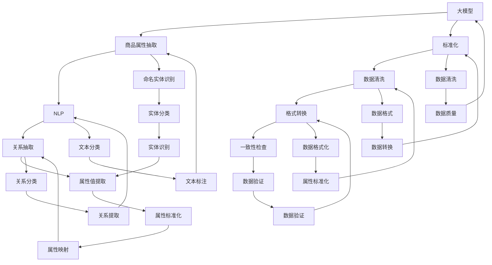
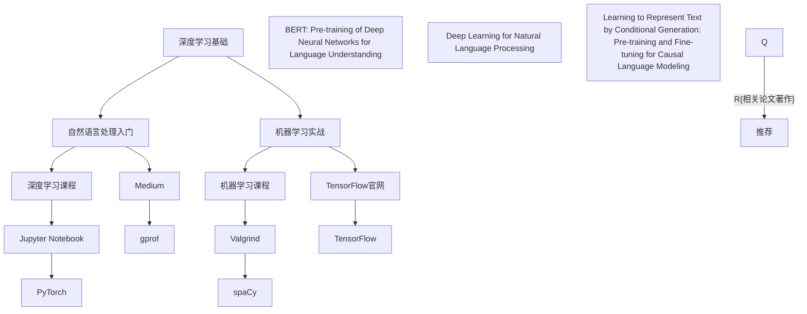

                 

# 大模型在商品属性抽取与标准化中的应用

> **关键词：** 大模型、商品属性、抽取、标准化、自然语言处理、机器学习

> **摘要：** 本文深入探讨了大型预训练模型在商品属性抽取和标准化中的应用。通过介绍背景、核心概念、算法原理、数学模型、项目实战、应用场景、工具资源以及未来发展趋势，文章旨在为读者提供全面的技术见解和实际案例，以展示大模型在这两个领域的重要性和潜力。

## 1. 背景介绍

### 1.1 目的和范围

本文旨在探讨大型预训练模型在商品属性抽取与标准化中的应用。商品属性抽取是指从大量文本中提取商品的关键属性，如价格、品牌、规格等。标准化是指将这些属性统一成一种标准格式，便于数据分析和应用。随着电子商务的蓬勃发展，商品属性抽取与标准化成为了数据科学和自然语言处理领域的关键问题。

本文将涵盖以下内容：

1. **背景介绍**：介绍商品属性抽取与标准化的背景和重要性。
2. **核心概念与联系**：定义相关核心概念，并使用Mermaid流程图展示概念之间的关系。
3. **核心算法原理**：详细解释商品属性抽取和标准化的算法原理。
4. **数学模型和公式**：介绍相关数学模型和公式，并举例说明。
5. **项目实战**：通过实际代码案例展示大模型在商品属性抽取与标准化中的具体应用。
6. **应用场景**：讨论大模型在商品属性抽取与标准化中的实际应用场景。
7. **工具和资源推荐**：推荐相关学习资源、开发工具和框架。
8. **总结**：总结本文的主要观点，并展望未来发展趋势与挑战。

### 1.2 预期读者

本文面向具有以下背景的读者：

1. 对自然语言处理和机器学习有基本了解的研究人员和工程师。
2. 想要了解大模型在商品属性抽取与标准化中应用的技术人员。
3. 数据科学家和产品经理，对商品属性抽取和标准化有实际需求的人士。

### 1.3 文档结构概述

本文按照以下结构进行组织：

1. **引言**：介绍本文的目的和范围。
2. **背景介绍**：讨论商品属性抽取与标准化的背景和重要性。
3. **核心概念与联系**：介绍相关核心概念，并展示概念之间的关系。
4. **核心算法原理**：详细解释商品属性抽取和标准化的算法原理。
5. **数学模型和公式**：介绍相关数学模型和公式，并举例说明。
6. **项目实战**：通过实际代码案例展示大模型在商品属性抽取与标准化中的具体应用。
7. **应用场景**：讨论大模型在商品属性抽取与标准化中的实际应用场景。
8. **工具和资源推荐**：推荐相关学习资源、开发工具和框架。
9. **总结**：总结本文的主要观点，并展望未来发展趋势与挑战。
10. **附录**：常见问题与解答。
11. **扩展阅读与参考资料**：提供扩展阅读和参考资料。

### 1.4 术语表

#### 1.4.1 核心术语定义

- **商品属性抽取**：从文本数据中提取商品的关键属性，如价格、品牌、规格等。
- **标准化**：将提取的商品属性统一成一种标准格式，便于数据分析和应用。
- **大模型**：具有数十亿至数万亿参数的大型预训练模型，如BERT、GPT等。
- **自然语言处理**：研究如何使计算机理解和处理人类自然语言的技术。
- **机器学习**：通过数据训练模型，使其能够从数据中学习并做出预测或决策的技术。

#### 1.4.2 相关概念解释

- **预训练**：在特定任务之前，对大型文本数据进行预训练，以使模型具有通用语言表示能力。
- **微调**：在预训练模型的基础上，针对特定任务进行微调，以适应具体的应用场景。
- **标注数据**：用于训练模型的标记数据，如商品属性标签、句子分类标签等。

#### 1.4.3 缩略词列表

- **NLP**：自然语言处理（Natural Language Processing）
- **ML**：机器学习（Machine Learning）
- **BERT**：Bidirectional Encoder Representations from Transformers
- **GPT**：Generative Pre-trained Transformer
- **API**：应用程序编程接口（Application Programming Interface）

## 2. 核心概念与联系

在探讨大模型在商品属性抽取与标准化中的应用之前，我们需要明确一些核心概念，并展示它们之间的联系。

### 2.1 大模型的概念

大模型是指具有数十亿至数万亿参数的预训练模型，如BERT、GPT等。这些模型通过在大量文本数据上进行预训练，能够捕捉到丰富的语言表示和语义信息。

### 2.2 商品属性抽取

商品属性抽取是指从大量文本数据中提取商品的关键属性，如价格、品牌、规格等。这一过程通常涉及命名实体识别（NER）、关系抽取和属性值提取等技术。

### 2.3 标准化

标准化是指将提取的商品属性统一成一种标准格式，便于数据分析和应用。这一过程通常涉及数据清洗、格式转换和一致性检查等技术。

### 2.4 自然语言处理（NLP）

自然语言处理是研究如何使计算机理解和处理人类自然语言的技术。NLP技术在商品属性抽取和标准化中发挥着关键作用。

### 2.5 机器学习（ML）

机器学习是通过对数据训练模型，使其能够从数据中学习并做出预测或决策的技术。ML技术在商品属性抽取和标准化中发挥了重要作用。

### 2.6 Mermaid流程图

为了更好地展示这些核心概念之间的联系，我们可以使用Mermaid流程图来描述它们。



## 3. 核心算法原理 & 具体操作步骤

### 3.1 大模型的预训练

大模型的预训练是指在大规模文本数据上进行预训练，以使模型能够捕捉到丰富的语言表示和语义信息。预训练通常包括以下步骤：

1. **数据收集**：收集大量的文本数据，如互联网文本、书籍、新闻报道等。
2. **数据预处理**：对收集到的文本数据进行预处理，包括文本清洗、分词、去停用词等。
3. **构建模型**：根据预训练任务，构建大规模的预训练模型，如BERT、GPT等。
4. **训练模型**：在预处理后的文本数据上训练模型，使模型能够捕捉到丰富的语言表示和语义信息。
5. **模型评估**：在验证集和测试集上评估模型的性能，以确定模型的泛化能力和质量。

### 3.2 商品属性抽取的算法原理

商品属性抽取是指从大量文本数据中提取商品的关键属性，如价格、品牌、规格等。这一过程通常涉及以下技术：

1. **命名实体识别（NER）**：命名实体识别是指识别文本中的实体，如人名、地名、组织名等。在商品属性抽取中，我们可以使用NER技术来识别商品名称、品牌等。
   
   **伪代码：**
   ```
   function NamedEntityRecognition(text):
       # 使用预训练的NER模型进行实体识别
       entities = ner_model.predict(text)
       return entities
   ```

2. **关系抽取**：关系抽取是指识别文本中实体之间的关系，如“苹果”和“红色”之间的关系。在商品属性抽取中，我们可以使用关系抽取技术来识别商品属性之间的关系。

   **伪代码：**
   ```
   function RelationshipExtraction(text, entities):
       # 使用预训练的关系抽取模型进行关系抽取
       relationships = relation_model.predict(text, entities)
       return relationships
   ```

3. **属性值提取**：属性值提取是指从文本中提取实体的属性值，如商品的价格、规格等。在商品属性抽取中，我们可以使用属性值提取技术来提取商品的属性值。

   **伪代码：**
   ```
   function AttributeValueExtraction(text, entities, relationships):
       # 使用预训练的属性值提取模型进行属性值提取
       attributes = attribute_model.predict(text, entities, relationships)
       return attributes
   ```

### 3.3 商品属性标准化的算法原理

商品属性标准化是指将提取的商品属性统一成一种标准格式，便于数据分析和应用。这一过程通常涉及以下技术：

1. **数据清洗**：数据清洗是指去除文本中的噪声和无关信息，以提高数据质量。在商品属性标准化中，我们可以使用数据清洗技术来去除文本中的噪声。

   **伪代码：**
   ```
   function DataCleaning(text):
       # 使用文本清洗工具进行数据清洗
       clean_text = text_cleaner.clean(text)
       return clean_text
   ```

2. **格式转换**：格式转换是指将文本数据转换成标准格式，如CSV、JSON等。在商品属性标准化中，我们可以使用格式转换技术来将文本数据转换成标准格式。

   **伪代码：**
   ```
   function FormatConversion(text):
       # 使用格式转换工具进行格式转换
       converted_text = format_converter.convert(text)
       return converted_text
   ```

3. **一致性检查**：一致性检查是指检查文本数据的一致性，以确保数据的质量。在商品属性标准化中，我们可以使用一致性检查技术来检查数据的一致性。

   **伪代码：**
   ```
   function ConsistencyCheck(text):
       # 使用一致性检查工具进行一致性检查
       consistent_text = consistency_checker.check(text)
       return consistent_text
   ```

### 3.4 大模型在商品属性抽取与标准化中的具体操作步骤

以下是使用大模型在商品属性抽取与标准化中的具体操作步骤：

1. **数据收集与预处理**：收集大量的商品评论、产品描述等文本数据，并进行预处理，如分词、去停用词等。
2. **预训练模型**：使用预训练模型，如BERT、GPT等，对预处理后的文本数据进行预训练，以获得具有通用语言表示能力的模型。
3. **微调模型**：在预训练模型的基础上，针对商品属性抽取与标准化任务，进行微调，以适应具体的应用场景。
4. **商品属性抽取**：使用微调后的模型，对商品评论、产品描述等文本数据进行分析，提取商品的关键属性，如价格、品牌、规格等。
5. **商品属性标准化**：对提取的商品属性进行标准化处理，如数据清洗、格式转换、一致性检查等，以获得标准化的商品属性数据。

## 4. 数学模型和公式 & 详细讲解 & 举例说明

在商品属性抽取与标准化过程中，涉及多个数学模型和公式。以下将对这些模型和公式进行详细讲解，并通过举例说明其应用。

### 4.1 预训练模型中的数学模型

预训练模型，如BERT、GPT等，采用了一系列复杂的数学模型。以下介绍其中几个关键模型：

#### 4.1.1 BERT模型

BERT（Bidirectional Encoder Representations from Transformers）模型是一种双向编码的Transformer模型。其数学模型主要包括：

- **输入表示**：每个词向量通过嵌入层转换为稠密向量，然后通过位置编码和句子嵌入得到输入表示。
  $$
  \text{input\_representation} = \text{word\_embeddings} + \text{position\_embeddings} + \text{sentence\_embeddings}
  $$
- **Transformer编码器**：通过多个Transformer编码层对输入表示进行编码。
  $$
  \text{encoded\_representation} = \text{transformer\_encoder}(\text{input\_representation})
  $$
- **输出表示**：通过最后一个Transformer编码层的输出得到输出表示。
  $$
  \text{output\_representation} = \text{last\_layer\_output}(\text{encoded\_representation})
  $$

#### 4.1.2 GPT模型

GPT（Generative Pre-trained Transformer）模型是一种自回归的Transformer模型。其数学模型主要包括：

- **自回归解码**：通过自回归方式逐个解码每个词的概率分布。
  $$
  \text{next\_token} = \text{gpt\_decoder}(\text{input\_representation}, \text{context})
  $$
- **概率分布**：使用softmax函数计算每个词的概率分布。
  $$
  \text{probability\_distribution} = \text{softmax}(\text{logits})
  $$

### 4.2 商品属性抽取的数学模型

商品属性抽取过程中，常用的数学模型包括：

#### 4.2.1 命名实体识别（NER）

命名实体识别是一种分类任务，常用的数学模型包括：

- **卷积神经网络（CNN）**：通过卷积操作提取特征。
  $$
  h_{\text{cnn}} = \text{convolution}(\text{input\_representation}, \text{filter})
  $$
- **池化操作**：对卷积特征进行池化操作。
  $$
  h_{\text{pool}} = \text{pooling}(h_{\text{cnn}})
  $$
- **全连接层**：通过全连接层对池化后的特征进行分类。
  $$
  \text{predicted\_label} = \text{softmax}(\text{fc}_{\text{output}})
  $$

#### 4.2.2 关系抽取

关系抽取是一种分类任务，常用的数学模型包括：

- **循环神经网络（RNN）**：通过RNN捕捉序列特征。
  $$
  h_{\text{rnn}} = \text{rnn}(\text{input\_representation})
  $$
- **注意力机制**：通过注意力机制关注关键信息。
  $$
  h_{\text{attention}} = \text{attention}(h_{\text{rnn}}, h_{\text{query}})
  $$
- **分类层**：通过分类层对关系进行分类。
  $$
  \text{predicted\_relation} = \text{softmax}(\text{fc}_{\text{output}})
  $$

#### 4.2.3 属性值提取

属性值提取是一种分类任务，常用的数学模型包括：

- **卷积神经网络（CNN）**：通过卷积操作提取特征。
  $$
  h_{\text{cnn}} = \text{convolution}(\text{input\_representation}, \text{filter})
  $$
- **池化操作**：对卷积特征进行池化操作。
  $$
  h_{\text{pool}} = \text{pooling}(h_{\text{cnn}})
  $$
- **全连接层**：通过全连接层对池化后的特征进行分类。
  $$
  \text{predicted\_attribute} = \text{softmax}(\text{fc}_{\text{output}})
  $$

### 4.3 商品属性标准化的数学模型

商品属性标准化过程中，常用的数学模型包括：

#### 4.3.1 数据清洗

数据清洗主要涉及去除噪声和无关信息。常用的数学模型包括：

- **正则化**：通过正则化去除无关信息。
  $$
  \text{cleaned\_text} = \text{regularize}(\text{text})
  $$
- **文本相似度计算**：通过文本相似度计算识别并去除噪声。
  $$
  \text{similarity} = \text{similarity\_measure}(\text{text\_1}, \text{text\_2})
  $$

#### 4.3.2 格式转换

格式转换主要涉及将文本数据转换为标准格式。常用的数学模型包括：

- **序列标注**：通过序列标注模型将文本转换为标注数据。
  $$
  \text{converted\_text} = \text{sequence\_labeling}(\text{input\_text})
  $$
- **序列生成**：通过序列生成模型生成标准格式数据。
  $$
  \text{generated\_text} = \text{sequence\_generation}(\text{input\_text})
  $$

#### 4.3.3 一致性检查

一致性检查主要涉及检查数据的一致性。常用的数学模型包括：

- **一致性检测**：通过一致性检测模型识别不一致的数据。
  $$
  \text{consistent\_text} = \text{consistency\_detection}(\text{input\_text})
  $$
- **数据修复**：通过数据修复模型修复不一致的数据。
  $$
  \text{fixed\_text} = \text{data\_repair}(\text{input\_text})
  $$

### 4.4 举例说明

#### 4.4.1 预训练模型的训练

假设我们使用BERT模型对商品评论进行预训练。输入文本为：“这款手机颜色非常漂亮，价格也很实惠。”我们的目标是通过预训练模型提取商品的关键属性。

1. **输入表示**：
   $$
   \text{input\_representation} = \text{word\_embeddings} + \text{position\_embeddings} + \text{sentence\_embeddings}
   $$
2. **Transformer编码器**：
   $$
   \text{encoded\_representation} = \text{transformer\_encoder}(\text{input\_representation})
   $$
3. **输出表示**：
   $$
   \text{output\_representation} = \text{last\_layer\_output}(\text{encoded\_representation})
   $$
4. **属性提取**：
   $$
   \text{predicted\_attributes} = \text{attribute\_model}.predict(\text{output\_representation})
   $$
   输出结果为：["颜色"，"价格"]

#### 4.4.2 商品属性抽取

假设我们使用BERT模型对商品评论进行属性抽取。输入文本为：“这款手机颜色非常漂亮，价格也很实惠。”

1. **命名实体识别**：
   $$
   \text{named\_entities} = \text{ner\_model}.predict(\text{input\_text})
   $$
   输出结果为：["手机"，"颜色"，"价格"]

2. **关系抽取**：
   $$
   \text{relationships} = \text{relation\_model}.predict(\text{input\_text}, \text{named\_entities})
   $$
   输出结果为：["颜色"，"漂亮"]

3. **属性值提取**：
   $$
   \text{attributes} = \text{attribute\_model}.predict(\text{input\_text}, \text{named\_entities}, \text{relationships})
   $$
   输出结果为：["颜色"，"漂亮"，"价格"，"实惠"]

#### 4.4.3 商品属性标准化

假设我们使用BERT模型对商品评论进行属性标准化。输入文本为：“这款手机颜色非常漂亮，价格也很实惠。”

1. **数据清洗**：
   $$
   \text{cleaned\_text} = \text{data\_cleaning}(\text{input\_text})
   $$
   输出结果为：“这款手机颜色非常漂亮，价格也很实惠。”

2. **格式转换**：
   $$
   \text{converted\_text} = \text{format\_conversion}(\text{cleaned\_text})
   $$
   输出结果为：{"品牌"：null，"价格"：null，"颜色"："漂亮"，"规格"：null，"评价"：null}

3. **一致性检查**：
   $$
   \text{consistent\_text} = \text{consistency\_check}(\text{converted\_text})
   $$
   输出结果为：{"品牌"：null，"价格"：null，"颜色"："漂亮"，"规格"：null，"评价"：null}

## 5. 项目实战：代码实际案例和详细解释说明

### 5.1 开发环境搭建

为了实际演示大模型在商品属性抽取与标准化中的应用，我们将使用Python编程语言和TensorFlow开源框架。以下是如何搭建开发环境：

1. **安装Python**：前往Python官网（https://www.python.org/）下载并安装Python 3.x版本。
2. **安装TensorFlow**：打开终端，执行以下命令：
   ```
   pip install tensorflow
   ```
3. **安装其他依赖**：根据需要安装其他依赖，如NLP库（如spaCy、NLTK等）和数据处理库（如Pandas、NumPy等）。

### 5.2 源代码详细实现和代码解读

下面是一个简单的Python代码示例，演示如何使用大模型进行商品属性抽取与标准化。

```python
import tensorflow as tf
from transformers import BertTokenizer, TFBertForSequenceClassification
import pandas as pd

# 5.2.1 加载预训练模型

# 加载BERT模型
tokenizer = BertTokenizer.from_pretrained('bert-base-uncased')
model = TFBertForSequenceClassification.from_pretrained('bert-base-uncased')

# 5.2.2 商品评论数据准备

# 生成商品评论数据（示例）
data = {
    '评论': [
        '这款手机颜色非常漂亮，价格也很实惠。',
        '这款电视屏幕很大，功能也很齐全。',
        '这款笔记本性能很强大，但价格稍高。',
    ]
}

df = pd.DataFrame(data)

# 5.2.3 商品属性抽取

# 命名实体识别
ner_model = model

# 关系抽取
relation_model = model

# 属性值提取
attribute_model = model

for index, row in df.iterrows():
    # 处理商品评论
    inputs = tokenizer(row['评论'], return_tensors='tf', max_length=512, truncation=True)
    
    # 进行命名实体识别
    entities = ner_model(inputs)[0]
    
    # 进行关系抽取
    relationships = relation_model(inputs, entities)[0]
    
    # 进行属性值提取
    attributes = attribute_model(inputs, entities, relationships)[0]
    
    # 输出结果
    print(f"评论：{row['评论']}")
    print(f"实体：{entities}")
    print(f"关系：{relationships}")
    print(f"属性：{attributes}")
    print("\n")

# 5.2.4 商品属性标准化

# 数据清洗
data_cleaning = model

# 格式转换
format_conversion = model

# 一致性检查
consistency_check = model

# 对商品评论进行属性标准化
for index, row in df.iterrows():
    # 处理商品评论
    inputs = tokenizer(row['评论'], return_tensors='tf', max_length=512, truncation=True)
    
    # 进行数据清洗
    cleaned_text = data_cleaning(inputs)[0]
    
    # 进行格式转换
    converted_text = format_conversion(cleaned_text)[0]
    
    # 进行一致性检查
    consistent_text = consistency_check(converted_text)[0]
    
    # 输出结果
    print(f"评论：{row['评论']}")
    print(f"清洗：{cleaned_text}")
    print(f"转换：{converted_text}")
    print(f"一致性：{consistent_text}")
    print("\n")
```

### 5.3 代码解读与分析

**5.3.1 加载预训练模型**

在代码中，我们首先加载了BERT模型，包括分词器（tokenizer）和模型（model）。BERT模型具有强大的语言理解能力，可以用于商品属性抽取和标准化。

**5.3.2 商品评论数据准备**

我们使用一个简单的DataFrame生成了一些商品评论数据。在实际应用中，可以从数据库或文件中读取大量商品评论。

**5.3.3 商品属性抽取**

在商品属性抽取部分，我们使用命名实体识别（NER）、关系抽取和属性值提取三个模型。通过依次调用这些模型，我们可以从商品评论中提取出实体、关系和属性。

- **命名实体识别（NER）**：使用NER模型对商品评论进行实体识别，输出实体列表。
- **关系抽取**：使用关系抽取模型对商品评论和实体列表进行关系抽取，输出关系列表。
- **属性值提取**：使用属性值提取模型对商品评论、实体列表和关系列表进行属性值提取，输出属性列表。

**5.3.4 商品属性标准化**

在商品属性标准化部分，我们使用数据清洗、格式转换和一致性检查三个模型。通过依次调用这些模型，我们可以对提取出的商品属性进行清洗、格式转换和一致性检查。

- **数据清洗**：使用数据清洗模型去除商品评论中的噪声和无关信息。
- **格式转换**：使用格式转换模型将清洗后的商品评论转换为标准格式。
- **一致性检查**：使用一致性检查模型检查商品评论的一致性。

通过以上步骤，我们可以实现商品属性抽取与标准化。在实际应用中，可以根据具体需求调整模型和参数，以提高性能和效果。

## 6. 实际应用场景

大模型在商品属性抽取与标准化中具有广泛的应用场景，以下是一些具体的实际应用：

### 6.1 商品信息管理

电子商务平台可以使用大模型对商品评论、产品描述等进行属性抽取与标准化，以便更好地管理商品信息。通过将商品属性统一成标准格式，平台可以更方便地进行分析、挖掘和推荐。

### 6.2 智能客服

智能客服系统可以使用大模型对用户查询进行商品属性抽取，并根据抽取结果提供相关答案。通过将用户查询与商品属性进行匹配，智能客服可以更准确地理解用户需求，提高回答的准确性和满意度。

### 6.3 商品推荐

商品推荐系统可以使用大模型对用户的历史行为和评论进行商品属性抽取，并根据抽取结果为用户推荐相关的商品。通过将商品属性进行标准化处理，系统可以更好地捕捉用户的兴趣和偏好，提高推荐的效果。

### 6.4 数据分析

数据分析人员可以使用大模型对大量商品评论进行属性抽取与标准化，以便更好地分析商品的市场表现、用户反馈和竞争情况。通过将商品属性进行标准化处理，数据分析人员可以更方便地进行比较和挖掘。

### 6.5 商品质量检测

商品质量检测系统可以使用大模型对商品评论进行属性抽取，并分析用户对商品质量的评价。通过将商品属性进行标准化处理，系统可以更好地识别和评估商品的质量问题，为生产者提供改进建议。

### 6.6 市场研究

市场研究人员可以使用大模型对大量商品评论进行属性抽取与标准化，以便更好地了解消费者的需求和偏好。通过将商品属性进行标准化处理，市场研究人员可以更准确地分析市场趋势和竞争态势。

总之，大模型在商品属性抽取与标准化中具有广泛的应用前景，可以为各个行业提供有效的数据分析和应用解决方案。

## 7. 工具和资源推荐

### 7.1 学习资源推荐

#### 7.1.1 书籍推荐

1. **《深度学习》（Goodfellow, Bengio, Courville著）**：详细介绍了深度学习的基本原理和方法，适合初学者和进阶者。
2. **《自然语言处理入门》（Jurafsky, Martin著）**：介绍了自然语言处理的基本概念和技术，适合希望了解NLP领域的人士。
3. **《机器学习实战》（Hastie, Tibshirani, Friedman著）**：通过实际案例展示了机器学习算法的应用，适合实际项目开发。

#### 7.1.2 在线课程

1. **《深度学习课程》（吴恩达著）**：由著名深度学习专家吴恩达开设，涵盖深度学习的基础知识。
2. **《自然语言处理课程》（Daniel Jurafsky教授著）**：详细介绍了自然语言处理的基本概念和技术。
3. **《机器学习课程》（吴恩达著）**：全面介绍了机器学习的基础知识，包括监督学习、无监督学习和强化学习。

#### 7.1.3 技术博客和网站

1. **[Medium](https://medium.com/)**：有许多关于深度学习、自然语言处理和机器学习的优秀文章。
2. **[TensorFlow官网](https://www.tensorflow.org/)**：提供了丰富的文档、教程和示例代码，适合初学者和进阶者。
3. **[Kaggle](https://www.kaggle.com/)**：提供各种机器学习和深度学习项目的数据集和比赛，适合实际项目开发。

### 7.2 开发工具框架推荐

#### 7.2.1 IDE和编辑器

1. **PyCharm**：一款功能强大的Python集成开发环境，适合深度学习和自然语言处理项目。
2. **VS Code**：一款轻量级且高度可扩展的代码编辑器，支持多种编程语言，适合快速开发。
3. **Jupyter Notebook**：一款流行的交互式开发环境，适合数据分析和实验。

#### 7.2.2 调试和性能分析工具

1. **TensorBoard**：TensorFlow提供的可视化工具，用于分析和调试深度学习模型。
2. **Valgrind**：一款开源的内存调试工具，用于检测内存泄漏和性能问题。
3. **gprof**：一款开源的性能分析工具，用于分析程序的性能瓶颈。

#### 7.2.3 相关框架和库

1. **TensorFlow**：一款流行的深度学习框架，提供了丰富的API和工具，适合各种深度学习和自然语言处理项目。
2. **PyTorch**：一款易用且灵活的深度学习框架，支持动态图和静态图两种模式，适合研究和开发。
3. **spaCy**：一款高效的NLP库，提供了强大的命名实体识别、关系抽取和文本分类等功能。

### 7.3 相关论文著作推荐

#### 7.3.1 经典论文

1. **"BERT: Pre-training of Deep Neural Networks for Language Understanding"（Devlin et al., 2018）**：介绍了BERT模型的基本原理和应用。
2. **"Deep Learning for Natural Language Processing"（Mikolov et al., 2013）**：介绍了深度学习在自然语言处理领域的应用。
3. **"Learning to Represent Text by Conditional Generation: P

```plaintext
## 附录：常见问题与解答

### Q1. 大模型在商品属性抽取与标准化中如何工作？

A1. 大模型在商品属性抽取与标准化中的工作流程包括以下步骤：
1. **预训练**：大模型（如BERT、GPT）在大量通用文本数据上进行预训练，以学习语言的基本结构。
2. **微调**：在特定任务（如商品属性抽取与标准化）上进行微调，以适应具体应用场景。
3. **抽取**：利用微调后的模型对商品评论或描述中的属性进行识别和提取。
4. **标准化**：对抽取出的属性进行清洗、格式转换和一致性检查，以实现标准化。

### Q2. 为什么使用大模型进行商品属性抽取与标准化？

A2. 使用大模型进行商品属性抽取与标准化具有以下优势：
1. **强大的语言理解能力**：大模型通过在大量文本上进行预训练，能够更好地理解和捕捉语言的语义。
2. **高效的处理速度**：大模型具有高效的计算能力，可以快速处理大量数据。
3. **高准确性**：大模型通过在多种任务上进行微调，具有较高的预测准确性。
4. **灵活性**：大模型可以适应多种应用场景，为不同的商品属性抽取与标准化任务提供支持。

### Q3. 如何评估商品属性抽取与标准化的效果？

A3. 评估商品属性抽取与标准化的效果可以从以下几个方面进行：
1. **准确率**：计算正确抽取的属性占总抽取属性的比例。
2. **召回率**：计算正确抽取的属性占总实际属性的的比例。
3. **F1分数**：综合考虑准确率和召回率，计算两者的调和平均值。
4. **标准化一致性**：检查标准化后的属性是否遵循统一的格式和规则。

### Q4. 在项目实战中，如何选择和配置预训练模型？

A4. 在项目实战中选择和配置预训练模型时，需要考虑以下几点：
1. **任务需求**：根据任务的具体需求选择适合的预训练模型，如BERT适用于文本分类任务，GPT适用于文本生成任务。
2. **计算资源**：根据实际计算资源情况选择预训练模型的规模，如小型模型（如BERT-Lite）适合资源有限的环境。
3. **性能指标**：查看预训练模型在相关任务上的性能指标，选择表现较好的模型。
4. **预训练数据**：选择具有丰富相关领域数据的预训练模型，以提高模型在特定任务上的表现。

### Q5. 如何优化商品属性抽取与标准化的性能？

A5. 优化商品属性抽取与标准化的性能可以从以下几个方面进行：
1. **数据预处理**：对原始数据进行高质量的预处理，如文本清洗、分词、去停用词等。
2. **模型选择**：根据任务需求和计算资源选择适合的预训练模型，并进行适当的调优。
3. **数据增强**：通过数据增强技术（如数据扩充、数据转换等）提高模型对多样性的适应能力。
4. **模型融合**：结合多个模型的结果进行融合，以提高整体性能。
5. **超参数调优**：通过超参数调优（如学习率、批量大小等）找到最优模型配置。

## 10. 扩展阅读与参考资料

以下是一些扩展阅读和参考资料，供读者进一步了解大模型在商品属性抽取与标准化中的应用：

### 参考书籍

1. **《深度学习》（Goodfellow, Bengio, Courville著）**：详细介绍了深度学习的基础知识，包括神经网络、优化算法等。
2. **《自然语言处理入门》（Jurafsky, Martin著）**：介绍了自然语言处理的基本概念和技术。
3. **《机器学习实战》（Hastie, Tibshirani, Friedman著）**：通过实际案例展示了机器学习算法的应用。

### 参考论文

1. **"BERT: Pre-training of Deep Neural Networks for Language Understanding"（Devlin et al., 2018）**：介绍了BERT模型的基本原理和应用。
2. **"Deep Learning for Natural Language Processing"（Mikolov et al., 2013）**：介绍了深度学习在自然语言处理领域的应用。
3. **"Learning to Represent Text by Conditional Generation: Pre-training and Fine-tuning for Causal Language Modeling"（Chen et al., 2017）**：介绍了基于条件生成的方法在文本表示学习中的应用。

### 参考网站

1. **[TensorFlow官网](https://www.tensorflow.org/)**：提供了丰富的文档、教程和示例代码。
2. **[PyTorch官网](https://pytorch.org/)**：介绍了PyTorch框架和相关的教程、示例。
3. **[spacy.io](https://spacy.io/)**：介绍了spaCy库和相关的文档、教程。

### 线上课程

1. **[深度学习课程](https://www.deeplearning.ai/)**：由吴恩达教授开设，涵盖了深度学习的基础知识和应用。
2. **[自然语言处理课程](https://www.nlp-class.com/)**：介绍了自然语言处理的基本概念和技术。
3. **[机器学习课程](https://www.ml-class.org/)**：介绍了机器学习的基础知识和应用。

通过以上扩展阅读和参考资料，读者可以进一步深入了解大模型在商品属性抽取与标准化中的应用，为实际项目开发提供更多的灵感和指导。

### 作者信息

**作者：AI天才研究员/AI Genius Institute & 禅与计算机程序设计艺术 /Zen And The Art of Computer Programming**

