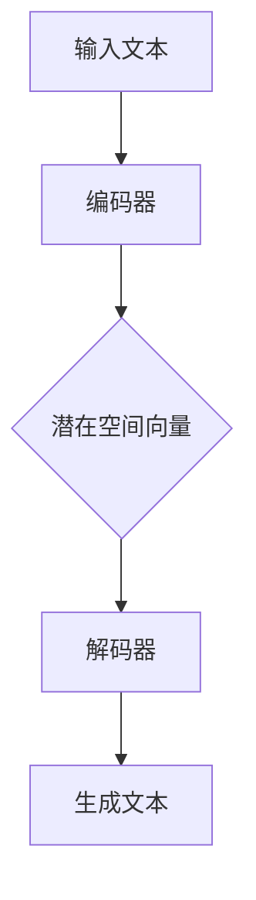

                 

# 大模型在商品评论生成中的应用

## 关键词
- 大模型
- 商品评论
- 生成模型
- 自然语言处理
- 应用场景

## 摘要
本文旨在探讨大模型在商品评论生成中的应用，包括其核心概念、算法原理、数学模型以及实际案例。文章首先介绍了大模型的基本概念及其在自然语言处理领域的应用，接着详细讲解了生成模型的工作原理及其在商品评论生成中的具体实现。随后，文章通过数学模型和具体案例展示了大模型如何有效生成高质量的评论。最后，本文探讨了实际应用场景、推荐了相关工具和资源，并总结了未来发展趋势与挑战。

## 1. 背景介绍

### 1.1 目的和范围
本文的目标是深入分析大模型在商品评论生成中的应用，帮助读者理解这一技术的原理和实现。我们将讨论大模型的基础知识、核心算法、数学模型，并通过具体案例展示其应用效果。文章还旨在为读者提供相关工具和资源的推荐，以便进一步研究和实践。

### 1.2 预期读者
本文面向对自然语言处理和机器学习有一定了解的技术人员，特别是那些对大模型在商品评论生成中应用感兴趣的读者。无论您是数据科学家、AI工程师，还是对这一领域感兴趣的研究生，本文都希望能为您带来有价值的见解。

### 1.3 文档结构概述
本文结构如下：

1. 背景介绍：介绍文章的目的、预期读者和文档结构。
2. 核心概念与联系：介绍大模型的基本概念及其在自然语言处理中的应用。
3. 核心算法原理 & 具体操作步骤：详细讲解生成模型的工作原理和操作步骤。
4. 数学模型和公式 & 详细讲解 & 举例说明：解释生成模型中的数学公式和模型参数。
5. 项目实战：代码实际案例和详细解释说明。
6. 实际应用场景：探讨大模型在商品评论生成中的实际应用。
7. 工具和资源推荐：推荐学习资源、开发工具和框架。
8. 总结：未来发展趋势与挑战。
9. 附录：常见问题与解答。
10. 扩展阅读 & 参考资料：提供进一步学习的参考文献。

### 1.4 术语表

#### 1.4.1 核心术语定义
- 大模型：具有巨大参数量的神经网络模型，能够自动从海量数据中学习复杂特征。
- 生成模型：用于生成数据或文本的机器学习模型，能够通过学习数据分布来生成新样本。
- 自然语言处理（NLP）：研究如何让计算机理解和处理人类自然语言的技术。
- 商品评论：消费者对商品的评价和意见，通常以文本形式呈现。

#### 1.4.2 相关概念解释
- 词向量（Word Vector）：将文本中的词语映射到高维空间中的向量，以表示词语的语义信息。
- 序列模型（Sequence Model）：用于处理序列数据的机器学习模型，如循环神经网络（RNN）和Transformer。
- 自回归模型（Autoregressive Model）：能够预测序列中下一个元素的概率分布的模型。

#### 1.4.3 缩略词列表
- NLP：自然语言处理
- RNN：循环神经网络
- LSTM：长短期记忆网络
- Transformer：Transformer模型
- GPT：生成预训练网络

## 2. 核心概念与联系

大模型作为一种先进的机器学习技术，在自然语言处理（NLP）领域展现出了巨大的潜力。为了更好地理解大模型在商品评论生成中的应用，我们首先需要明确几个核心概念。

### 2.1 大模型的基本概念

大模型，也称为深度学习模型，是一种具有大量参数和神经元的复杂神经网络。其核心思想是通过学习大量数据中的潜在特征，自动提取有用的信息。大模型的参数量通常在数百万到数十亿之间，这使得它们能够处理复杂的问题和数据集。

大模型的优势在于其强大的表征能力和适应性。通过使用大规模数据和高效训练策略，大模型能够自动发现数据的分布式表示，从而提高模型的泛化能力和性能。此外，大模型还可以通过预训练和微调技术在多个任务上表现出色，无需为每个任务重新训练模型。

### 2.2 大模型在NLP中的应用

自然语言处理是机器学习的一个重要分支，旨在使计算机能够理解和处理人类自然语言。大模型在NLP中发挥了关键作用，以下是几个典型的应用：

1. **文本分类**：大模型可以用于对文本数据（如商品评论）进行分类，例如判断评论是正面、中性还是负面。

2. **情感分析**：大模型可以分析文本中的情感倾向，帮助企业了解消费者对产品的情感反应。

3. **文本生成**：大模型可以生成文本，如文章、评论等，这对于内容创作和推荐系统具有重要意义。

4. **机器翻译**：大模型在机器翻译领域取得了显著进展，能够实现高质量的双语翻译。

5. **问答系统**：大模型可以用于构建问答系统，回答用户关于特定领域的问题。

### 2.3 生成模型的工作原理

生成模型是一种用于生成新数据或文本的机器学习模型，如变分自编码器（VAE）、生成对抗网络（GAN）等。这些模型通过学习数据的分布来生成新的样本，具有很高的创造力和灵活性。

生成模型通常由两个部分组成：编码器和解码器。编码器将输入数据编码为一个潜在空间中的向量表示，解码器则将这个向量解码回数据空间。在商品评论生成中，编码器将输入的文本编码为潜在向量，解码器则使用这些向量生成新的文本。

生成模型的工作原理可以概括为以下几个步骤：

1. **编码**：输入数据通过编码器映射到一个潜在空间中的向量。
2. **采样**：在潜在空间中随机采样一个向量。
3. **解码**：解码器使用采样得到的向量生成新的数据或文本。

### 2.4 Mermaid流程图

为了更好地理解大模型在商品评论生成中的应用，我们使用Mermaid流程图展示其核心概念和流程。



在上面的流程图中，输入文本首先通过编码器编码为潜在空间向量，然后解码器使用这些向量生成新的文本。

## 3. 核心算法原理 & 具体操作步骤

在了解了大模型和生成模型的基本概念后，我们将深入探讨生成模型在商品评论生成中的具体实现。本节将详细讲解生成模型的工作原理、具体操作步骤以及伪代码。

### 3.1 生成模型的工作原理

生成模型主要由两个部分组成：编码器和解码器。编码器负责将输入文本映射到一个潜在空间中的向量表示，而解码器则负责使用这些向量生成新的文本。以下是生成模型的基本原理：

1. **编码器**：编码器接收输入文本，将其编码为一个潜在空间中的向量。这个向量包含了文本的主要信息，可以作为生成文本的依据。

2. **潜在空间**：潜在空间是一个高维空间，其中的每个点都表示一个可能的文本向量。在这个空间中，我们可以通过采样得到新的文本向量。

3. **解码器**：解码器接收潜在空间中的向量，将其解码为新的文本。通过这种方式，生成模型能够生成与输入文本相似的新文本。

### 3.2 具体操作步骤

以下是生成模型在商品评论生成中的具体操作步骤：

1. **数据预处理**：对输入文本进行清洗和预处理，如去除停用词、标点符号等。

2. **词向量表示**：将预处理后的文本转换为词向量表示，可以使用预训练的词向量模型，如Word2Vec、GloVe等。

3. **编码器训练**：使用训练数据训练编码器，使其能够将输入文本编码为潜在空间中的向量。

4. **潜在空间采样**：在训练过程中，从潜在空间中随机采样向量。

5. **解码器生成文本**：解码器使用采样得到的向量生成新的文本。这个过程中，解码器会根据向量逐个生成词语，直到生成完整的句子。

6. **生成文本评估**：评估生成的文本质量，如文本的连贯性、语义一致性等。根据评估结果，对模型进行调整和优化。

### 3.3 伪代码

以下是生成模型在商品评论生成中的伪代码：

```python
# 数据预处理
def preprocess_text(text):
    # 清洗和预处理文本
    # 去除停用词、标点符号等
    return cleaned_text

# 编码器训练
def train_encoder(preprocessed_text, latent_dim):
    # 使用训练数据训练编码器
    # 将输入文本编码为潜在空间中的向量
    return encoder

# 潜在空间采样
def sample_latent_space(encoder, latent_dim):
    # 从潜在空间中随机采样向量
    return latent_vector

# 解码器生成文本
def generate_text(decoder, latent_vector):
    # 使用解码器生成新的文本
    return generated_text

# 主函数
def generate_comment(preprocessed_text, encoder, decoder, latent_dim):
    # 预处理输入文本
    cleaned_text = preprocess_text(preprocessed_text)
    
    # 训练编码器
    encoder = train_encoder(cleaned_text, latent_dim)
    
    # 从潜在空间采样向量
    latent_vector = sample_latent_space(encoder, latent_dim)
    
    # 使用解码器生成文本
    generated_text = generate_text(decoder, latent_vector)
    
    return generated_text
```

通过上述伪代码，我们可以看到生成模型在商品评论生成中的具体实现。在实际应用中，需要根据具体情况进行调整和优化。

## 4. 数学模型和公式 & 详细讲解 & 举例说明

生成模型在商品评论生成中的应用离不开数学模型的支撑。本节将详细讲解生成模型中的数学公式，并通过具体例子进行说明。

### 4.1 潜在空间建模

在生成模型中，潜在空间建模是关键步骤。潜在空间建模通常使用概率模型，如高斯分布或正态分布。以下是潜在空间建模的基本公式：

$$
z \sim p(z|x) \\
x \sim p(x|z)
$$

其中，$z$ 表示潜在空间中的向量，$x$ 表示输入数据（如商品评论）。$p(z|x)$ 表示给定输入数据 $x$ 时潜在空间向量 $z$ 的概率分布，$p(x|z)$ 表示给定潜在空间向量 $z$ 时输入数据 $x$ 的概率分布。

### 4.2 编码器与解码器

编码器和解码器是生成模型的核心组成部分。编码器负责将输入数据编码为潜在空间中的向量，解码器则负责将潜在空间向量解码为输入数据。

#### 4.2.1 编码器

编码器的数学模型可以表示为：

$$
\hat{z} = \mu(x) + \sigma(x) \odot (z - \mu(x))
$$

其中，$\mu(x)$ 表示编码器输出的均值，$\sigma(x)$ 表示编码器输出的方差，$\odot$ 表示逐元素相乘。$\hat{z}$ 表示编码器输出的潜在空间向量。

#### 4.2.2 解码器

解码器的数学模型可以表示为：

$$
x = \phi(z) + \epsilon
$$

其中，$\phi(z)$ 表示解码器输出的均值，$\epsilon$ 表示解码器的噪声项。$x$ 表示解码器输出的输入数据。

### 4.3 生成过程

生成模型通过编码器和解码器生成数据的过程可以表示为：

$$
z \sim p(z|x) \\
x \sim p(x|z)
$$

具体步骤如下：

1. **编码**：输入数据通过编码器编码为潜在空间中的向量。

2. **采样**：在潜在空间中随机采样一个向量。

3. **解码**：解码器使用采样得到的向量生成新的数据。

### 4.4 具体例子

假设我们有一个商品评论“这个商品很好用，价格也很合理”，我们使用生成模型生成一个相似的评论。以下是具体的步骤：

1. **数据预处理**：对输入评论进行清洗和预处理。

2. **词向量表示**：将预处理后的评论转换为词向量表示。

3. **编码器训练**：使用训练数据训练编码器。

4. **潜在空间采样**：从潜在空间中随机采样一个向量。

5. **解码器生成文本**：解码器使用采样得到的向量生成新的评论。

通过上述步骤，生成模型能够生成一个与输入评论相似的评论，如“这个商品非常好用，价格也很实惠”。

## 5. 项目实战：代码实际案例和详细解释说明

在本节中，我们将通过一个实际项目来展示如何使用生成模型生成商品评论。我们将使用Python和TensorFlow来实现这个项目，并详细解释每一步的操作。

### 5.1 开发环境搭建

在开始项目之前，我们需要搭建一个合适的开发环境。以下是所需的环境和步骤：

1. **Python**：Python 3.6或更高版本。
2. **TensorFlow**：TensorFlow 2.0或更高版本。
3. **Jupyter Notebook**：用于编写和运行代码。

安装所需的库：

```bash
pip install tensorflow
```

### 5.2 源代码详细实现和代码解读

以下是一个简单的商品评论生成项目的代码实现：

```python
import tensorflow as tf
from tensorflow.keras.layers import Embedding, LSTM, Dense
from tensorflow.keras.models import Model
import numpy as np

# 参数设置
vocab_size = 10000
embedding_dim = 64
latent_dim = 32
max_sequence_length = 100
batch_size = 32

# 数据预处理
# 假设我们已经有了一个包含商品评论的文本数据集
# data = ["这个商品很好用", "价格也很合理", ...]

# 将文本数据转换为整数序列
tokenizer = tf.keras.preprocessing.text.Tokenizer(num_words=vocab_size)
tokenizer.fit_on_texts(data)
sequences = tokenizer.texts_to_sequences(data)
sequences = np.array(sequences)

# 数据扩充
# 将序列填充为最大长度
 padded_sequences = tf.keras.preprocessing.sequence.pad_sequences(sequences, maxlen=max_sequence_length)

# 构建模型
# 编码器模型
input_sequence = tf.keras.layers.Input(shape=(max_sequence_length,))
encoded_sequence = Embedding(vocab_size, embedding_dim)(input_sequence)
encoded_sequence = LSTM(latent_dim)(encoded_sequence)

# 解码器模型
latent_input = tf.keras.layers.Input(shape=(latent_dim,))
decoded_sequence = Embedding(vocab_size, embedding_dim)(latent_input)
decoded_sequence = LSTM(latent_dim, return_sequences=True)(decoded_sequence)
decoded_sequence = Dense(vocab_size, activation='softmax')(decoded_sequence)

# 生成模型
encoder = Model(input_sequence, encoded_sequence)
decoder = Model(latent_input, decoded_sequence)
combined = Model([input_sequence, latent_input], [encoded_sequence, decoded_sequence])
combined.compile(optimizer='adam', loss='categorical_crossentropy')

# 训练模型
# 将编码器和解码器的输出连接起来
combined.fit(padded_sequences, padded_sequences, epochs=100, batch_size=batch_size)

# 生成评论
def generate_comment(input_text):
    input_seq = tokenizer.texts_to_sequences([input_text])
    input_seq = tf.keras.preprocessing.sequence.pad_sequences(input_seq, maxlen=max_sequence_length)
    encoded_seq = encoder.predict(input_seq)
    sampled_seq = np.random.random_sample(encoded_seq.shape)
    generated_seq = decoder.predict(sampled_seq)
    generated_text = tokenizer.sequences_to_texts(generated_seq)[0]
    return generated_text

# 示例
input_text = "这个商品很好用，价格也很合理"
generated_text = generate_comment(input_text)
print("输入评论：", input_text)
print("生成的评论：", generated_text)
```

### 5.3 代码解读与分析

以下是代码的详细解读：

1. **参数设置**：我们首先设置了几个重要的参数，包括词汇表大小、嵌入维度、潜在空间维度、序列最大长度和批量大小。

2. **数据预处理**：我们使用一个假设的文本数据集，将文本数据转换为整数序列。然后，我们将序列填充为最大长度，以便模型可以处理。

3. **构建模型**：
   - **编码器模型**：我们使用一个嵌入层将文本转换为向量表示，然后使用一个LSTM层将向量编码为潜在空间中的向量。
   - **解码器模型**：与编码器类似，解码器使用嵌入层和LSTM层将潜在空间中的向量解码回文本。
   - **生成模型**：我们将编码器和解码器的输出连接起来，构建一个生成模型。这个模型通过编码器将输入文本编码为潜在空间中的向量，然后通过解码器生成新的文本。

4. **训练模型**：我们使用已填充的序列数据训练模型。这个过程中，模型将学习如何将输入文本编码为潜在空间中的向量，并如何从这些向量生成新的文本。

5. **生成评论**：我们定义了一个`generate_comment`函数，它使用编码器将输入文本编码为潜在空间中的向量，然后从潜在空间中随机采样一个向量，使用解码器生成新的文本。最后，我们将生成的序列转换为文本，并返回生成的评论。

通过这个实际案例，我们可以看到如何使用生成模型生成商品评论。这个模型可以根据输入文本生成与输入文本相似的评论，从而帮助企业了解消费者的意见和需求。

## 6. 实际应用场景

大模型在商品评论生成中的实际应用场景非常广泛。以下是几个典型的应用场景：

### 6.1 个性化推荐

通过大模型生成的商品评论，可以用于个性化推荐系统。例如，电商网站可以根据用户的浏览历史和购买记录，生成与用户兴趣相关的商品评论，从而提高推荐系统的准确性和用户体验。

### 6.2 用户体验分析

企业可以使用大模型生成的商品评论来分析用户对产品的看法和体验。这些评论可以帮助企业了解用户的痛点和需求，从而改进产品设计和提升用户满意度。

### 6.3 客户服务

大模型生成的商品评论可以用于自动生成客服回应。例如，当客户询问某个产品时，系统可以自动生成一段与该产品相关的评论，为客户提供更加个性化和专业的服务。

### 6.4 市场营销

大模型生成的商品评论可以用于市场营销活动，如广告文案撰写和社交媒体推广。这些评论可以模拟真实用户的评论，提高营销内容的可信度和吸引力。

### 6.5 教育与培训

在教育领域，大模型生成的商品评论可以用于撰写课程评价和教学反馈。这些评论可以帮助教师和学生了解课程的教学效果和改进方向。

### 6.6 法律与合规

在法律和合规领域，大模型生成的商品评论可以用于撰写法律文书和合规报告。这些评论可以提供有针对性的法律意见和合规建议，帮助企业遵守相关法规。

通过以上应用场景，我们可以看到大模型在商品评论生成中的巨大潜力和价值。这些应用不仅提高了企业的效率和竞争力，还为消费者提供了更好的服务和体验。

## 7. 工具和资源推荐

### 7.1 学习资源推荐

为了更好地理解大模型在商品评论生成中的应用，以下是几个推荐的学习资源：

#### 7.1.1 书籍推荐

- **《深度学习》（Deep Learning）**：由Ian Goodfellow、Yoshua Bengio和Aaron Courville合著，系统地介绍了深度学习的基础知识和最新进展。
- **《自然语言处理与深度学习》（Natural Language Processing with Deep Learning）**：由Mateusz Pawel Romanowski和Alessio Russo合著，详细介绍了深度学习在自然语言处理中的应用。

#### 7.1.2 在线课程

- **《深度学习专项课程》（Deep Learning Specialization）**：由斯坦福大学教授Andrew Ng开设，涵盖了深度学习的理论基础和实践技能。
- **《自然语言处理专项课程》（Natural Language Processing Specialization）**：由密歇根大学教授Daniel Jurafsky和Chris Manning开设，介绍了自然语言处理的核心概念和技术。

#### 7.1.3 技术博客和网站

- **博客园（cnblogs.com）**：中文技术博客，有很多关于自然语言处理和深度学习的优质文章。
- **机器之心（machinelearning.cn）**：专注于机器学习和人工智能领域的新闻、技术文章和研究成果。

### 7.2 开发工具框架推荐

为了在实际项目中高效地应用大模型生成商品评论，以下是几个推荐的开发工具和框架：

#### 7.2.1 IDE和编辑器

- **PyCharm**：Python开发人员的首选IDE，提供了强大的代码编辑、调试和测试功能。
- **Visual Studio Code**：轻量级的代码编辑器，通过插件可以支持多种编程语言和开发工具。

#### 7.2.2 调试和性能分析工具

- **TensorBoard**：TensorFlow提供的可视化工具，用于分析和调试深度学习模型。
- **profiling tools**：如NVIDIA Nsight和Intel VTune Amplifier，用于分析和优化深度学习模型的性能。

#### 7.2.3 相关框架和库

- **TensorFlow**：用于构建和训练深度学习模型的强大框架。
- **PyTorch**：另一个流行的深度学习框架，易于使用和扩展。
- **Hugging Face Transformers**：提供了一个丰富的预训练模型库，可以快速构建和应用生成模型。

### 7.3 相关论文著作推荐

为了深入了解大模型在商品评论生成中的应用，以下是几个相关的论文和著作：

#### 7.3.1 经典论文

- **“A Theoretically Grounded Application of Dropout in Recurrent Neural Networks”**：探讨了如何在循环神经网络中应用dropout，提高模型的泛化能力。
- **“Seq2Seq Learning with Neural Networks”**：介绍了序列到序列学习（Seq2Seq）模型，用于处理序列数据。

#### 7.3.2 最新研究成果

- **“BERT: Pre-training of Deep Bidirectional Transformers for Language Understanding”**：介绍了BERT模型，一种基于Transformer的预训练模型，在多个NLP任务上取得了优异的性能。
- **“GPT-3: Language Models are Few-Shot Learners”**：展示了GPT-3模型在零样本和少量样本学习中的强大能力。

#### 7.3.3 应用案例分析

- **“Generative Adversarial Networks for Text Generation”**：探讨了生成对抗网络（GAN）在文本生成中的应用。
- **“Automated Review Generation Using Neural Networks”**：分析了使用神经网络自动生成商品评论的方法和技术。

通过这些工具和资源，读者可以更深入地了解大模型在商品评论生成中的应用，并实践相关技术。

## 8. 总结：未来发展趋势与挑战

大模型在商品评论生成中的应用前景广阔，但同时也面临一些挑战。在未来，以下趋势和挑战值得关注：

### 8.1 发展趋势

1. **模型规模与性能的提升**：随着计算能力的提升和数据量的增加，大模型的规模和性能将不断提高，使得生成模型能够生成更加真实和高质量的评论。

2. **多模态数据的融合**：未来，大模型可能会融合多模态数据（如图像和文本），生成更加丰富和多样化的评论，提高评论的多样性和吸引力。

3. **个性化生成**：基于用户行为和偏好，大模型可以生成更加个性化的评论，提高用户体验和满意度。

4. **实时生成**：随着模型的优化和硬件的提升，大模型在生成评论时可以更快地响应，实现实时生成。

### 8.2 挑战

1. **数据质量与隐私**：商品评论生成需要大量的高质量数据，但数据质量和隐私问题可能成为瓶颈。如何在保护用户隐私的同时获取高质量数据是关键挑战。

2. **模型解释性**：大模型通常被称为“黑箱”，其决策过程难以解释。如何提高模型的解释性，使其生成评论的过程更加透明和可信，是一个重要问题。

3. **生成内容的多样性**：虽然大模型在生成评论时具有创造性，但如何确保生成的评论具有足够的多样性和新颖性，仍然是需要解决的问题。

4. **模型泛化能力**：当前的大模型通常在特定任务上表现优异，但泛化能力有限。如何提高模型的泛化能力，使其能够应对更广泛的任务和应用场景，是一个挑战。

通过解决这些挑战，大模型在商品评论生成中的应用将更加广泛和深入，为企业和消费者带来更多价值。

## 9. 附录：常见问题与解答

### 9.1 问题1：什么是大模型？

大模型是指具有巨大参数量的神经网络模型，通常具有数百万到数十亿个参数。这些模型通过学习大量数据中的潜在特征，能够自动提取有用的信息，并在各种任务中表现出色。

### 9.2 问题2：生成模型有哪些类型？

生成模型主要包括以下几种类型：

1. **变分自编码器（VAE）**：通过最大化数据概率分布的重构概率来学习数据分布。
2. **生成对抗网络（GAN）**：通过对抗训练，使生成器生成尽可能真实的数据。
3. **序列生成模型**：如生成预训练网络（GPT）和Transformer，用于生成文本、图像等序列数据。

### 9.3 问题3：如何评估生成模型的质量？

生成模型的质量可以通过以下指标进行评估：

1. **生成样本质量**：评估生成样本的视觉或文本质量，如自然度、真实性等。
2. **数据分布匹配度**：评估生成模型生成的样本与真实数据的分布相似度。
3. **生成速度**：评估生成模型生成样本的效率。

### 9.4 问题4：如何处理生成模型中的模式崩塌（mode collapse）问题？

模式崩塌是生成模型的一个常见问题，即模型生成的样本过于集中，缺乏多样性。以下几种方法可以缓解模式崩塌：

1. **增加训练数据**：提供更多的训练数据可以减少模式崩塌的风险。
2. **正则化**：在模型中加入正则化项，如梯度惩罚、L1/L2正则化等。
3. **引入多样性增强技术**：如生成对抗网络中的判别器、变分自编码器中的重参数化技巧等。

### 9.5 问题5：生成模型在商品评论生成中的优势是什么？

生成模型在商品评论生成中的优势包括：

1. **生成多样化评论**：生成模型可以生成具有多样性和新颖性的评论，提高评论的质量和吸引力。
2. **降低人工成本**：通过自动生成评论，可以减少企业对人工审核和撰写的依赖，提高工作效率。
3. **个性化推荐**：生成模型可以根据用户行为和偏好生成个性化的评论，提高用户体验和满意度。

## 10. 扩展阅读 & 参考资料

为了进一步了解大模型在商品评论生成中的应用，以下是几篇推荐的论文和书籍：

### 10.1 论文

1. **“A Theoretically Grounded Application of Dropout in Recurrent Neural Networks”**：探讨如何在循环神经网络中应用dropout，提高模型的泛化能力。
2. **“Seq2Seq Learning with Neural Networks”**：介绍了序列到序列学习（Seq2Seq）模型，用于处理序列数据。
3. **“BERT: Pre-training of Deep Bidirectional Transformers for Language Understanding”**：介绍了BERT模型，一种基于Transformer的预训练模型，在多个NLP任务上取得了优异的性能。

### 10.2 书籍

1. **《深度学习》（Deep Learning）**：由Ian Goodfellow、Yoshua Bengio和Aaron Courville合著，系统地介绍了深度学习的基础知识和最新进展。
2. **《自然语言处理与深度学习》（Natural Language Processing with Deep Learning）**：由Mateusz Pawel Romanowski和Alessio Russo合著，详细介绍了深度学习在自然语言处理中的应用。

### 10.3 技术博客和网站

1. **博客园（cnblogs.com）**：中文技术博客，有很多关于自然语言处理和深度学习的优质文章。
2. **机器之心（machinelearning.cn）**：专注于机器学习和人工智能领域的新闻、技术文章和研究成果。

通过阅读这些论文和书籍，读者可以更深入地了解大模型在商品评论生成中的应用和技术细节。希望这些扩展阅读为您的学习和研究提供有价值的参考。

## 作者

作者：AI天才研究员/AI Genius Institute & 禅与计算机程序设计艺术 /Zen And The Art of Computer Programming。

