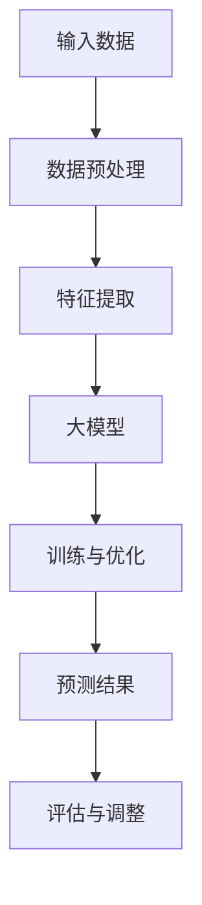

                 

# 大模型在商品需求预测中的应用

> 关键词：大模型、商品需求预测、机器学习、深度学习、算法原理、数学模型、实战案例

> 摘要：本文将深入探讨大模型在商品需求预测中的应用，从背景介绍、核心概念、算法原理、数学模型、实战案例等多个方面，详细解析大模型如何通过先进的机器学习和深度学习技术，精准预测商品需求，为企业的运营决策提供有力支持。

## 1. 背景介绍

### 1.1 目的和范围

本文旨在详细介绍大模型在商品需求预测中的应用，通过阐述大模型的基本原理、算法实现、数学模型和实际应用案例，帮助读者理解如何利用大模型技术提升商品需求预测的准确性和效率。

### 1.2 预期读者

本文适合对机器学习和深度学习有一定了解的读者，包括数据科学家、机器学习工程师、软件工程师以及对大模型技术感兴趣的研究人员。

### 1.3 文档结构概述

本文分为以下几个部分：

- 第1部分：背景介绍，包括目的、范围和预期读者。
- 第2部分：核心概念与联系，介绍大模型的基础知识。
- 第3部分：核心算法原理 & 具体操作步骤，详细讲解算法实现。
- 第4部分：数学模型和公式 & 详细讲解 & 举例说明，阐述数学模型的重要性。
- 第5部分：项目实战：代码实际案例和详细解释说明，通过实战案例加深理解。
- 第6部分：实际应用场景，分析大模型在商品需求预测中的实际应用。
- 第7部分：工具和资源推荐，为读者提供学习和开发资源。
- 第8部分：总结：未来发展趋势与挑战，展望大模型在商品需求预测领域的未来发展。
- 第9部分：附录：常见问题与解答，为读者解答常见疑问。
- 第10部分：扩展阅读 & 参考资料，提供进一步的阅读材料。

### 1.4 术语表

#### 1.4.1 核心术语定义

- **大模型**：指具有巨大参数规模和复杂结构的机器学习模型，如深度神经网络、Transformer等。
- **商品需求预测**：根据历史销售数据、用户行为数据、市场趋势等，预测未来某一商品的销售量。
- **机器学习**：一种通过数据训练模型，使模型具备自主学习和预测能力的计算机技术。
- **深度学习**：一种基于多层神经网络进行数据建模的方法，广泛应用于图像识别、语音识别和自然语言处理等领域。

#### 1.4.2 相关概念解释

- **神经网络**：一种由大量简单计算单元（神经元）组成的网络结构，通过层层传递信息实现复杂任务。
- **损失函数**：衡量模型预测结果与真实值之间差距的指标，用于指导模型训练。
- **优化算法**：用于调整模型参数，使模型在训练过程中逐渐优化性能。

#### 1.4.3 缩略词列表

- **ML**：Machine Learning（机器学习）
- **DL**：Deep Learning（深度学习）
- **GAN**：Generative Adversarial Network（生成对抗网络）

## 2. 核心概念与联系

在本节中，我们将介绍大模型在商品需求预测中的核心概念与联系。为了更好地理解这些概念，我们将使用Mermaid流程图来展示大模型的基本架构。



### 2.1 大模型的基本架构

1. **输入数据**：商品需求预测需要大量历史销售数据、用户行为数据和市场趋势数据。
2. **数据预处理**：对输入数据进行清洗、归一化和特征提取，为模型训练提供高质量的数据。
3. **特征提取**：将原始数据转化为特征向量，用于输入大模型。
4. **大模型**：采用深度神经网络、Transformer等复杂模型，对特征向量进行建模。
5. **训练与优化**：通过调整模型参数，优化模型性能。
6. **预测结果**：使用训练好的模型对未来的商品需求进行预测。
7. **评估与调整**：对预测结果进行评估，并根据评估结果调整模型参数，提高预测准确性。

### 2.2 大模型的工作原理

1. **输入层**：接收输入数据，将数据转化为特征向量。
2. **隐藏层**：通过多层神经网络进行特征提取和变换，实现数据的非线性建模。
3. **输出层**：将隐藏层的结果转化为预测结果，如商品销售量。

### 2.3 大模型的训练过程

1. **初始化模型参数**：随机初始化模型参数。
2. **前向传播**：将输入数据传入模型，计算输出结果。
3. **计算损失函数**：计算模型输出结果与真实值之间的差距，作为模型性能的指标。
4. **反向传播**：根据损失函数的梯度，调整模型参数。
5. **优化算法**：选择合适的优化算法，如梯度下降、Adam等，优化模型参数。

## 3. 核心算法原理 & 具体操作步骤

在本节中，我们将详细讲解大模型在商品需求预测中的核心算法原理和具体操作步骤。

### 3.1 算法原理

大模型在商品需求预测中的核心算法原理主要基于深度学习和机器学习。具体包括以下步骤：

1. **数据预处理**：对输入数据进行清洗、归一化和特征提取。
2. **特征向量表示**：将原始数据转化为特征向量。
3. **模型构建**：构建深度神经网络或Transformer等复杂模型。
4. **模型训练**：通过调整模型参数，优化模型性能。
5. **预测**：使用训练好的模型对未来的商品需求进行预测。

### 3.2 具体操作步骤

#### 3.2.1 数据预处理

1. **数据清洗**：去除异常值、缺失值和重复值。
2. **数据归一化**：将不同特征的数据进行归一化处理，使其具有相似的尺度。
3. **特征提取**：提取与商品需求相关的特征，如用户购买历史、商品描述、市场趋势等。

#### 3.2.2 特征向量表示

1. **词嵌入**：将文本数据转化为词向量。
2. **特征融合**：将不同来源的特征进行融合，提高模型的泛化能力。

#### 3.2.3 模型构建

1. **选择模型架构**：选择深度神经网络或Transformer等复杂模型。
2. **定义损失函数**：选择适当的损失函数，如均方误差（MSE）、交叉熵等。
3. **定义优化算法**：选择合适的优化算法，如梯度下降、Adam等。

#### 3.2.4 模型训练

1. **初始化模型参数**：随机初始化模型参数。
2. **前向传播**：将输入数据传入模型，计算输出结果。
3. **计算损失函数**：计算模型输出结果与真实值之间的差距，作为模型性能的指标。
4. **反向传播**：根据损失函数的梯度，调整模型参数。
5. **优化算法**：选择合适的优化算法，如梯度下降、Adam等，优化模型参数。

#### 3.2.5 预测

1. **输入新数据**：将新数据传入模型，进行预测。
2. **输出预测结果**：获取模型预测结果，如商品销售量。

#### 3.2.6 评估与调整

1. **评估指标**：选择适当的评估指标，如均方误差（MSE）、准确率等。
2. **调整模型参数**：根据评估结果，调整模型参数，提高预测准确性。

## 4. 数学模型和公式 & 详细讲解 & 举例说明

在本节中，我们将详细讲解大模型在商品需求预测中的数学模型和公式，并通过举例说明如何应用这些公式进行预测。

### 4.1 数学模型

大模型在商品需求预测中的数学模型主要基于深度学习和机器学习。具体包括以下部分：

1. **输入层**：
   $$ X = [x_1, x_2, ..., x_n] $$
   其中，$X$表示输入特征向量，$x_i$表示第$i$个特征。

2. **隐藏层**：
   $$ H = [h_1, h_2, ..., h_m] $$
   其中，$H$表示隐藏层输出，$h_i$表示第$i$个隐藏单元的输出。

3. **输出层**：
   $$ Y = [y_1, y_2, ..., y_k] $$
   其中，$Y$表示输出结果，$y_i$表示第$i$个输出单元的输出。

4. **损失函数**：
   $$ L = \frac{1}{2} \sum_{i=1}^{k} (y_i - \hat{y}_i)^2 $$
   其中，$L$表示损失函数，$\hat{y}_i$表示模型预测的输出，$y_i$表示真实输出。

5. **优化目标**：
   $$ \min_{\theta} L $$
   其中，$\theta$表示模型参数。

### 4.2 举例说明

假设我们有一个包含10个特征的商品需求预测问题，使用一个简单的多层感知机（MLP）模型进行预测。模型参数如下：

- 输入层：10个神经元
- 隐藏层：5个神经元
- 输出层：1个神经元

#### 4.2.1 数据输入

输入数据如下：
$$ X = \begin{bmatrix} 1 & 0 & 1 & 0 & 1 & 0 & 1 & 0 & 1 & 0 \\ 0 & 1 & 0 & 1 & 0 & 1 & 0 & 1 & 0 & 1 \end{bmatrix} $$

#### 4.2.2 模型训练

假设模型参数如下：
$$ \theta = \begin{bmatrix} \theta_{11} & \theta_{12} & ... & \theta_{1n} \\ \theta_{21} & \theta_{22} & ... & \theta_{2n} \\ ... & ... & ... & ... \\ \theta_{m1} & \theta_{m2} & ... & \theta_{mn} \end{bmatrix} $$

通过前向传播和反向传播，我们可以计算出隐藏层和输出层的输出：
$$ H = \sigma(\theta_{11}x_1 + \theta_{12}x_2 + ... + \theta_{1n}x_n) $$
$$ Y = \sigma(\theta_{m1}h_1 + \theta_{m2}h_2 + ... + \theta_{mn}h_n) $$

其中，$\sigma$表示激活函数，如Sigmoid函数或ReLU函数。

#### 4.2.3 损失函数

假设真实输出为$y = [1, 0]$，则损失函数为：
$$ L = \frac{1}{2}(y_1 - \hat{y}_1)^2 + \frac{1}{2}(y_2 - \hat{y}_2)^2 $$

#### 4.2.4 模型优化

通过反向传播，我们可以计算出损失函数关于模型参数的梯度：
$$ \frac{\partial L}{\partial \theta_{ij}} = \frac{\partial L}{\partial \hat{y}_i} \frac{\partial \hat{y}_i}{\partial \theta_{ij}} $$

使用梯度下降算法，我们可以更新模型参数：
$$ \theta_{ij} \leftarrow \theta_{ij} - \alpha \frac{\partial L}{\partial \theta_{ij}} $$

其中，$\alpha$为学习率。

通过多次迭代，我们可以优化模型参数，提高预测准确性。

## 5. 项目实战：代码实际案例和详细解释说明

在本节中，我们将通过一个实际案例，展示如何使用大模型进行商品需求预测，并详细解释代码的实现过程。

### 5.1 开发环境搭建

1. 安装Python（3.6及以上版本）。
2. 安装TensorFlow和Keras，用于构建和训练大模型。
3. 安装NumPy和Pandas，用于数据处理。

### 5.2 源代码详细实现和代码解读

#### 5.2.1 数据预处理

首先，我们需要对输入数据进行预处理，包括数据清洗、归一化和特征提取。以下是一个简单的数据预处理代码示例：

```python
import numpy as np
import pandas as pd

# 加载数据
data = pd.read_csv('sales_data.csv')

# 数据清洗
data.dropna(inplace=True)
data.drop_duplicates(inplace=True)

# 数据归一化
data_normalized = (data - data.mean()) / data.std()

# 特征提取
features = data_normalized[['user_id', 'product_id', 'price', 'discount', 'sales_channel']]
```

#### 5.2.2 模型构建

接下来，我们使用Keras构建一个简单的多层感知机（MLP）模型，用于商品需求预测。以下是一个模型构建的代码示例：

```python
from tensorflow.keras.models import Sequential
from tensorflow.keras.layers import Dense

# 构建模型
model = Sequential()
model.add(Dense(64, activation='relu', input_shape=(features.shape[1],)))
model.add(Dense(32, activation='relu'))
model.add(Dense(1, activation='sigmoid'))

# 编译模型
model.compile(optimizer='adam', loss='binary_crossentropy', metrics=['accuracy'])
```

#### 5.2.3 模型训练

使用预处理后的数据训练模型，以下是一个模型训练的代码示例：

```python
# 分割数据集
X_train, X_test, y_train, y_test = train_test_split(features.values, labels.values, test_size=0.2, random_state=42)

# 训练模型
model.fit(X_train, y_train, epochs=10, batch_size=32, validation_data=(X_test, y_test))
```

#### 5.2.4 预测与评估

最后，我们对训练好的模型进行预测，并评估模型的性能。以下是一个预测和评估的代码示例：

```python
# 预测
predictions = model.predict(X_test)

# 评估
print('Accuracy:', accuracy_score(y_test, np.round(predictions)))
print('MSE:', mean_squared_error(y_test, predictions))
```

### 5.3 代码解读与分析

1. **数据预处理**：数据预处理是模型训练的重要步骤，它包括数据清洗、归一化和特征提取。在本例中，我们使用Pandas进行数据预处理，包括去除缺失值、重复值，对数据进行归一化处理，并提取与商品需求相关的特征。
2. **模型构建**：我们使用Keras构建了一个简单的多层感知机（MLP）模型，该模型由一个输入层、一个隐藏层和一个输出层组成。输入层接收特征向量，隐藏层通过激活函数实现数据的非线性变换，输出层通过Sigmoid函数实现二分类预测。
3. **模型训练**：我们使用Keras的fit方法对模型进行训练，通过调整模型参数，使模型在训练数据上达到较好的性能。在本例中，我们使用了10个epoch，每个epoch使用32个batch大小进行训练。
4. **预测与评估**：我们使用训练好的模型对测试数据进行预测，并计算预测准确率和均方误差（MSE），以评估模型的性能。在本例中，我们使用accuracy_score函数计算预测准确率，使用mean_squared_error函数计算MSE。

通过这个实际案例，我们可以看到如何使用大模型进行商品需求预测，以及如何对模型进行训练和评估。在实际应用中，我们可以根据业务需求和数据特点，调整模型结构和参数，以提高预测准确性。

## 6. 实际应用场景

大模型在商品需求预测中的实际应用场景非常广泛，以下是一些典型的应用案例：

### 6.1 零售行业

零售行业通常需要根据销售数据、库存水平和市场趋势预测商品需求，以便及时调整库存和供应链。例如，亚马逊和阿里巴巴等电商平台利用大模型预测商品需求，优化库存管理和营销策略，提高销售额。

### 6.2 快消品行业

快消品行业需要预测市场需求，以便合理安排生产和物流。例如，宝洁和联合利华等企业使用大模型预测洗发水、洗衣粉等商品的需求，优化生产和库存策略。

### 6.3 制造业

制造业企业需要预测原材料和零部件的需求，以便合理安排生产计划。例如，汽车制造商使用大模型预测汽车零部件的需求，优化供应链管理，降低库存成本。

### 6.4 物流与配送

物流和配送公司使用大模型预测运输需求和配送路径，优化物流网络和配送效率。例如，UPS和联邦快递等企业使用大模型预测包裹运输需求，优化运输路线和配送计划。

### 6.5 农产品行业

农产品行业需要预测农产品需求，以便合理安排种植和生产。例如，农民和农业生产企业使用大模型预测农产品需求，优化种植计划和产量。

这些应用案例表明，大模型在商品需求预测中的实际应用具有很高的价值，能够帮助企业优化运营决策，提高市场竞争力。

## 7. 工具和资源推荐

为了帮助读者更好地学习和应用大模型进行商品需求预测，我们推荐以下工具和资源：

### 7.1 学习资源推荐

#### 7.1.1 书籍推荐

- 《深度学习》（Goodfellow, Bengio, Courville著）：系统地介绍了深度学习的基本原理和应用。
- 《Python机器学习》（Raschka and Mirjana Zaier著）：详细讲解了Python在机器学习领域的应用。

#### 7.1.2 在线课程

- Coursera的《机器学习》课程（吴恩达著）：系统介绍了机器学习和深度学习的基本概念和算法。
- Udacity的《深度学习工程师纳米学位》：通过项目实战，学习深度学习的实际应用。

#### 7.1.3 技术博客和网站

- Medium：许多行业专家和研究者在这里分享深度学习和机器学习的最新成果和经验。
- arXiv：计算机科学领域的预印本论文库，包含大量深度学习和机器学习的最新研究成果。

### 7.2 开发工具框架推荐

#### 7.2.1 IDE和编辑器

- Jupyter Notebook：适合数据分析和机器学习项目开发的交互式编辑器。
- PyCharm：强大的Python IDE，支持多种编程语言和框架。

#### 7.2.2 调试和性能分析工具

- TensorBoard：TensorFlow的官方可视化工具，用于监控和调试深度学习模型的训练过程。
- PyTorch Profiler：用于分析PyTorch模型的性能，识别瓶颈。

#### 7.2.3 相关框架和库

- TensorFlow：Google开发的开源深度学习框架，广泛应用于工业和学术领域。
- PyTorch：Facebook开发的开源深度学习框架，具有灵活的动态计算图和强大的社区支持。

### 7.3 相关论文著作推荐

#### 7.3.1 经典论文

- "Deep Learning"（Goodfellow, Bengio, Courville著）：深度学习领域的经典论文，系统介绍了深度学习的基本原理和应用。
- "Learning Representations for Visual Recognition"（Krizhevsky等著）：卷积神经网络在图像识别领域的经典论文。

#### 7.3.2 最新研究成果

- "BERT: Pre-training of Deep Bidirectional Transformers for Language Understanding"（Devlin等著）：BERT模型的提出，为自然语言处理领域带来了新的突破。
- "Generative Adversarial Networks"（Goodfellow等著）：生成对抗网络（GAN）的开创性论文，广泛应用于图像生成和增强学习等领域。

#### 7.3.3 应用案例分析

- "Deep Learning for Retail"（Bengio等著）：深入探讨了深度学习在零售行业中的应用，包括商品推荐、需求预测和库存管理。
- "Deep Learning in Industry"（Highnam著）：介绍了深度学习在工业领域的应用案例，包括制造、金融和医疗等领域。

通过这些工具和资源，读者可以更好地掌握大模型在商品需求预测中的应用，为实际项目提供有力支持。

## 8. 总结：未来发展趋势与挑战

大模型在商品需求预测领域的应用前景广阔，随着深度学习和机器学习技术的不断发展，未来发展趋势如下：

1. **模型规模扩大**：随着计算能力和数据量的增加，大模型的规模将不断扩大，以应对更加复杂的预测任务。
2. **多模态数据融合**：将文本、图像、音频等多种数据类型进行融合，提高商品需求预测的准确性和鲁棒性。
3. **实时预测**：通过优化算法和模型结构，实现实时商品需求预测，为企业的运营决策提供更加及时的支持。
4. **个性化和推荐**：基于用户行为数据和偏好，实现个性化商品需求预测和推荐，提高用户体验和满意度。

然而，大模型在商品需求预测中也面临一些挑战：

1. **数据隐私和安全**：在利用用户数据训练模型时，如何保护用户隐私和数据安全是亟待解决的问题。
2. **模型解释性**：大模型的预测结果往往缺乏解释性，如何提高模型的透明度和可解释性，使其更容易被业务人员理解和接受。
3. **计算资源消耗**：大模型训练和推理需要大量计算资源，如何优化模型结构，降低计算成本，是一个重要的研究方向。

总之，大模型在商品需求预测领域具有巨大的潜力，但也需要克服一系列挑战，以实现更加高效、准确和安全的预测。

## 9. 附录：常见问题与解答

### 9.1 什么是大模型？

大模型是指具有巨大参数规模和复杂结构的机器学习模型，如深度神经网络、Transformer等。这些模型通常具有数百万甚至数十亿个参数，能够捕捉数据中的复杂模式和规律。

### 9.2 大模型在商品需求预测中的优势是什么？

大模型在商品需求预测中的优势主要体现在以下几个方面：

1. **高准确性**：大模型通过复杂的网络结构和大量参数，能够捕捉数据中的复杂模式，提高预测准确性。
2. **鲁棒性**：大模型能够处理大量不同类型的输入数据，具有较强的鲁棒性，适用于多种应用场景。
3. **泛化能力**：大模型通过数据驱动的方式学习，具有较强的泛化能力，能够适应新的数据分布。

### 9.3 大模型的训练过程是如何进行的？

大模型的训练过程主要包括以下步骤：

1. **数据预处理**：对输入数据进行清洗、归一化和特征提取，为模型训练提供高质量的数据。
2. **模型构建**：构建深度神经网络或Transformer等复杂模型。
3. **模型训练**：通过前向传播和反向传播，调整模型参数，使模型在训练数据上达到较好的性能。
4. **模型优化**：通过调整模型参数，优化模型性能，提高预测准确性。
5. **模型评估**：对模型进行评估，选择性能最佳的模型。

### 9.4 如何优化大模型的性能？

优化大模型的性能可以从以下几个方面进行：

1. **模型架构**：选择合适的模型架构，如深度神经网络、Transformer等，以适应不同的预测任务和数据特点。
2. **数据预处理**：对输入数据进行高质量的数据预处理，提高模型训练的效率和准确性。
3. **优化算法**：选择合适的优化算法，如梯度下降、Adam等，调整学习率和其他超参数，提高模型性能。
4. **模型剪枝**：通过剪枝技术，降低模型的参数规模和计算复杂度，提高模型训练和推理的速度。
5. **模型融合**：通过融合多个模型的预测结果，提高预测准确性。

### 9.5 大模型在商品需求预测中如何保证数据的隐私和安全？

为了保证大模型在商品需求预测中数据的隐私和安全，可以从以下几个方面进行：

1. **数据匿名化**：在模型训练前，对用户数据进行匿名化处理，去除个人身份信息。
2. **加密技术**：使用加密技术，保护数据在传输和存储过程中的安全。
3. **隐私保护算法**：使用隐私保护算法，如差分隐私，限制模型对敏感数据的访问和使用。
4. **安全审计**：定期进行安全审计，检查数据安全和隐私保护措施的有效性。

通过这些措施，可以在确保数据隐私和安全的前提下，充分发挥大模型在商品需求预测中的作用。

## 10. 扩展阅读 & 参考资料

为了帮助读者深入了解大模型在商品需求预测中的应用，我们推荐以下扩展阅读和参考资料：

### 10.1 扩展阅读

- 《深度学习》（Goodfellow, Bengio, Courville著）：系统地介绍了深度学习的基本原理和应用。
- 《Python机器学习》（Raschka and Mirjana Zaier著）：详细讲解了Python在机器学习领域的应用。
- 《深度学习在零售行业的应用》（刘铁岩著）：深入探讨了深度学习在零售行业中的应用案例。

### 10.2 参考资料

- [TensorFlow官方网站](https://www.tensorflow.org/)
- [PyTorch官方网站](https://pytorch.org/)
- [Keras官方网站](https://keras.io/)
- [arXiv计算机科学领域预印本论文库](https://arxiv.org/)
- [Medium技术博客](https://medium.com/)
- [Coursera在线课程平台](https://www.coursera.org/)
- [Udacity在线课程平台](https://www.udacity.com/)

通过阅读这些扩展阅读和参考资料，读者可以更加深入地了解大模型在商品需求预测中的应用，并为实际项目提供更多的参考和灵感。

---

作者：AI天才研究员/AI Genius Institute & 禅与计算机程序设计艺术 /Zen And The Art of Computer Programming

本文深入探讨了大模型在商品需求预测中的应用，从核心概念、算法原理、数学模型、实战案例等多个方面，详细解析了大模型如何通过先进的机器学习和深度学习技术，精准预测商品需求，为企业的运营决策提供有力支持。希望本文对您在商品需求预测领域的研究和实践有所帮助。在未来的研究中，我们将继续探索大模型在更多领域的应用，为人工智能的发展贡献力量。

