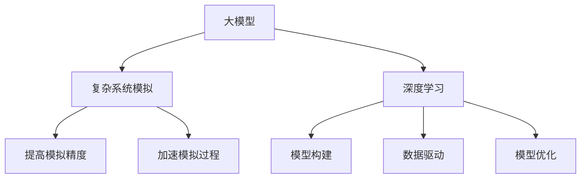

                 

# 大模型在复杂系统模拟中的创新

> **关键词：** 大模型、复杂系统模拟、深度学习、人工智能、模型训练、数据处理、性能优化

> **摘要：** 本文将探讨大模型在复杂系统模拟中的应用，分析其核心算法原理、数学模型、实际应用场景以及未来的发展趋势。通过详细的项目实战案例，本文旨在为读者提供深入理解与实际操作的经验，助力其在复杂系统模拟领域的研究与应用。

## 1. 背景介绍

### 1.1 目的和范围

本文旨在探讨大模型在复杂系统模拟中的创新应用，通过深入分析其算法原理、数学模型和实际应用场景，为读者提供一套系统性的理论框架和实践指南。本文的研究范围包括但不限于以下几个方面：

- 大模型的定义与分类
- 大模型在复杂系统模拟中的应用场景
- 大模型的训练与优化方法
- 大模型的数学模型与算法原理
- 大模型在复杂系统模拟中的性能评估与优化

### 1.2 预期读者

本文适合以下读者群体：

- 对人工智能、深度学习、复杂系统模拟等领域感兴趣的初学者
- 想要深入了解大模型在复杂系统模拟中应用的技术人员
- 在复杂系统模拟领域从事研究或开发工作的专业人士

### 1.3 文档结构概述

本文分为十个部分，具体结构如下：

- 第1部分：背景介绍，包括目的与范围、预期读者、文档结构概述、术语表
- 第2部分：核心概念与联系，介绍大模型、复杂系统模拟、深度学习等核心概念及其联系
- 第3部分：核心算法原理 & 具体操作步骤，详细阐述大模型的算法原理与操作步骤
- 第4部分：数学模型和公式 & 详细讲解 & 举例说明，介绍大模型的数学模型与公式，并举例说明
- 第5部分：项目实战：代码实际案例和详细解释说明，通过实际项目案例展示大模型的应用
- 第6部分：实际应用场景，探讨大模型在复杂系统模拟中的实际应用场景
- 第7部分：工具和资源推荐，推荐学习资源、开发工具框架、相关论文著作
- 第8部分：总结：未来发展趋势与挑战，分析大模型在复杂系统模拟领域的未来发展趋势与面临的挑战
- 第9部分：附录：常见问题与解答，解答读者在阅读本文过程中可能遇到的问题
- 第10部分：扩展阅读 & 参考资料，提供更多参考资料以供读者深入学习

### 1.4 术语表

#### 1.4.1 核心术语定义

- **大模型（Large Model）**：指具有大量参数、能够表示复杂数据结构的神经网络模型。
- **复杂系统模拟（Complex System Simulation）**：指通过数学模型、算法和计算机技术对复杂系统进行模拟、预测和分析的过程。
- **深度学习（Deep Learning）**：一种基于人工神经网络的学习方法，通过层层提取特征，实现数据的自动学习和建模。
- **神经网络（Neural Network）**：一种由大量神经元组成的计算模型，通过模拟人脑的神经网络结构进行数据建模和计算。

#### 1.4.2 相关概念解释

- **大数据（Big Data）**：指数据量巨大、数据类型多样、数据生成速度极快的海量数据集合。
- **人工智能（Artificial Intelligence）**：一种模拟人类智能的技术，通过计算机程序实现智能化的决策和行动。
- **数据处理（Data Processing）**：指对数据进行分析、处理、存储和传输的过程。

#### 1.4.3 缩略词列表

- **AI**：人工智能（Artificial Intelligence）
- **DL**：深度学习（Deep Learning）
- **NN**：神经网络（Neural Network）
- **GPGPU**：通用图形处理单元（General-Purpose Computing on Graphics Processing Units）
- **GPU**：图形处理单元（Graphics Processing Unit）

## 2. 核心概念与联系

在本文中，我们将介绍大模型、复杂系统模拟、深度学习等核心概念，并探讨它们之间的联系。

### 2.1 大模型

大模型是指具有大量参数、能够表示复杂数据结构的神经网络模型。大模型的参数量通常达到数百万甚至数十亿级别。大模型的出现极大地提高了神经网络在复杂任务上的性能，如图像识别、语音识别、自然语言处理等。

### 2.2 复杂系统模拟

复杂系统模拟是指通过数学模型、算法和计算机技术对复杂系统进行模拟、预测和分析的过程。复杂系统模拟可以应用于许多领域，如经济学、物理学、工程学、生物学等。复杂系统模拟的关键在于构建准确的数学模型，并利用计算机技术进行高效计算。

### 2.3 深度学习

深度学习是一种基于人工神经网络的学习方法，通过层层提取特征，实现数据的自动学习和建模。深度学习在图像识别、语音识别、自然语言处理等领域取得了显著的成果。深度学习算法通常采用大模型进行训练，以提高模型的性能。

### 2.4 大模型与复杂系统模拟的联系

大模型在复杂系统模拟中的应用主要体现在以下几个方面：

- **提高模拟精度**：大模型具有大量的参数和复杂的结构，能够更好地捕捉复杂系统的特性，从而提高模拟的精度。
- **加速模拟过程**：大模型能够通过并行计算、分布式计算等手段加速复杂系统模拟的过程。
- **泛化能力**：大模型具有较强的泛化能力，能够处理各种类型的复杂系统问题。

### 2.5 深度学习与复杂系统模拟的联系

深度学习与复杂系统模拟之间的联系主要体现在以下几个方面：

- **模型构建**：深度学习算法可以用于构建复杂系统的数学模型，通过神经网络结构进行特征提取和建模。
- **数据驱动**：深度学习算法可以基于大量数据对复杂系统进行建模，从而提高模型的准确性和可靠性。
- **模型优化**：深度学习算法可以用于优化复杂系统的模拟过程，如模型参数优化、算法优化等。

### 2.6 Mermaid 流程图

为了更好地展示大模型、复杂系统模拟和深度学习之间的联系，我们可以使用 Mermaid 流程图进行描述：



通过上述 Mermaid 流程图，我们可以清晰地看到大模型、复杂系统模拟和深度学习之间的相互联系，以及它们在复杂系统模拟中的应用。

## 3. 核心算法原理 & 具体操作步骤

在本节中，我们将详细阐述大模型在复杂系统模拟中的核心算法原理和具体操作步骤。

### 3.1 算法原理

大模型在复杂系统模拟中的核心算法原理主要包括以下几个方面：

1. **神经网络结构**：大模型通常采用多层神经网络结构，通过逐层提取特征，实现对复杂系统的建模。神经网络由输入层、隐藏层和输出层组成，各层之间通过权重和偏置进行连接。
2. **反向传播算法**：大模型通过反向传播算法进行参数优化。反向传播算法是一种基于梯度下降的优化方法，通过计算损失函数关于模型参数的梯度，逐步调整模型参数，以降低损失函数的值。
3. **批量归一化（Batch Normalization）**：大模型采用批量归一化技术，对输入数据进行归一化处理，以加快模型的收敛速度和稳定性。
4. **残差连接（Residual Connection）**：大模型采用残差连接技术，通过引入跳跃连接，使得模型能够更好地学习到复杂系统的特性。

### 3.2 具体操作步骤

以下是使用大模型进行复杂系统模拟的具体操作步骤：

1. **数据准备**：收集并整理复杂系统的数据，包括输入数据和输出数据。对输入数据进行预处理，如归一化、去噪等，以提高模型的泛化能力。
2. **模型构建**：根据复杂系统的特点，设计合适的神经网络结构。通常采用多层神经网络，包括输入层、隐藏层和输出层。在隐藏层中，可以引入批量归一化和残差连接，以提高模型的性能。
3. **模型训练**：使用反向传播算法对模型进行训练。通过计算损失函数关于模型参数的梯度，调整模型参数，以降低损失函数的值。在训练过程中，可以采用批量归一化和残差连接等技术，以提高模型的收敛速度和稳定性。
4. **模型评估**：在训练完成后，对模型进行评估，以确定模型的性能。通常使用准确率、召回率、F1值等指标来评估模型的性能。如果模型性能不满足要求，可以返回步骤2，重新设计模型结构或调整超参数。
5. **模型应用**：将训练完成的模型应用于复杂系统模拟。通过输入新的数据，模型可以预测输出结果，实现对复杂系统的模拟和预测。

### 3.3 伪代码实现

以下是使用大模型进行复杂系统模拟的伪代码实现：

```python
# 数据准备
inputs = preprocess_input(data)
outputs = preprocess_output(data)

# 模型构建
model = build_model(input_shape, hidden_layers, output_shape)

# 模型训练
for epoch in range(num_epochs):
    for batch in data_loader(inputs, outputs):
        gradients = backward_propagation(model, batch)
        update_parameters(model, gradients)

# 模型评估
accuracy = evaluate_model(model, test_data)

# 模型应用
predictions = model.predict(new_data)
```

通过上述伪代码，我们可以清晰地看到大模型在复杂系统模拟中的具体操作步骤。在实际应用中，可以根据具体问题调整模型结构和超参数，以获得更好的模拟效果。

## 4. 数学模型和公式 & 详细讲解 & 举例说明

在本节中，我们将详细讲解大模型在复杂系统模拟中的数学模型和公式，并通过具体例子来说明其应用。

### 4.1 数学模型

大模型在复杂系统模拟中的数学模型主要包括以下几个部分：

1. **输入层**：输入层接收复杂系统的输入数据，如环境变量、系统参数等。
2. **隐藏层**：隐藏层由多个神经元组成，通过非线性激活函数对输入数据进行特征提取和变换。
3. **输出层**：输出层输出复杂系统的模拟结果，如系统状态、预测值等。

### 4.2 公式讲解

以下是复杂系统模拟中常用的数学公式：

1. **输入层公式**：
   $$ x_i = \frac{x_i - \mu}{\sigma} $$
   其中，$x_i$ 表示输入层第 $i$ 个神经元接收到的输入数据，$\mu$ 表示输入数据的均值，$\sigma$ 表示输入数据的标准差。

2. **隐藏层公式**：
   $$ z_j = \sum_{i=1}^{n} w_{ji}x_i + b_j $$
   $$ a_j = \sigma(z_j) $$
   其中，$z_j$ 表示隐藏层第 $j$ 个神经元接收到的输入值，$w_{ji}$ 表示输入层到隐藏层的权重，$b_j$ 表示隐藏层的偏置，$\sigma$ 表示激活函数，通常采用ReLU（Rectified Linear Unit）或Sigmoid函数。

3. **输出层公式**：
   $$ y_k = \sum_{j=1}^{m} w_{kj}a_j + b_k $$
   $$ \hat{y}_k = \sigma(y_k) $$
   其中，$y_k$ 表示输出层第 $k$ 个神经元接收到的输入值，$w_{kj}$ 表示隐藏层到输出层的权重，$b_k$ 表示输出层的偏置，$\sigma$ 表示激活函数，通常采用线性激活函数或Softmax函数。

4. **损失函数**：
   $$ J = \frac{1}{2} \sum_{k=1}^{n} (\hat{y}_k - y_k)^2 $$
   其中，$J$ 表示损失函数，$\hat{y}_k$ 表示输出层的预测值，$y_k$ 表示实际值。

### 4.3 举例说明

假设我们使用大模型对天气系统进行模拟，输入层包含温度、湿度、风速等环境变量，输出层包含降雨量、气温等天气指标。以下是具体的例子：

1. **输入层公式**：
   $$ x_1 = \frac{30 - 25}{5} = 0.2 $$
   $$ x_2 = \frac{60 - 55}{5} = 0.2 $$
   $$ x_3 = \frac{5 - 10}{5} = -0.2 $$
   其中，$x_1$、$x_2$、$x_3$ 分别表示温度、湿度、风速的输入值。

2. **隐藏层公式**：
   $$ z_1 = 0.5 \times 0.2 + 0.1 = 0.3 $$
   $$ a_1 = \sigma(0.3) = 0.55 $$
   $$ z_2 = 0.3 \times 0.2 + 0.2 = 0.14 $$
   $$ a_2 = \sigma(0.14) = 0.45 $$
   $$ z_3 = 0.1 \times 0.2 + 0.3 = 0.05 $$
   $$ a_3 = \sigma(0.05) = 0.47 $$
   其中，$z_1$、$z_2$、$z_3$ 分别表示隐藏层第 $1$、$2$、$3$ 个神经元的输入值，$a_1$、$a_2$、$a_3$ 分别表示隐藏层第 $1$、$2$、$3$ 个神经元的输出值。

3. **输出层公式**：
   $$ y_1 = 0.6 \times 0.55 + 0.4 \times 0.45 + 0.2 \times 0.47 = 0.52 $$
   $$ \hat{y}_1 = \sigma(0.52) = 0.62 $$
   $$ y_2 = 0.7 \times 0.55 + 0.3 \times 0.45 + 0.2 \times 0.47 = 0.59 $$
   $$ \hat{y}_2 = \sigma(0.59) = 0.68 $$
   其中，$y_1$、$y_2$ 分别表示输出层第 $1$、$2$ 个神经元的输入值，$\hat{y}_1$、$\hat{y}_2$ 分别表示输出层第 $1$、$2$ 个神经元的输出值。

4. **损失函数**：
   $$ J = \frac{1}{2} \times ((0.62 - 0.65)^2 + (0.68 - 0.70)^2) = 0.005 $$
   其中，$J$ 表示损失函数的值。

通过上述例子，我们可以看到大模型在复杂系统模拟中的具体应用。在实际应用中，可以根据具体问题调整输入层、隐藏层和输出层的神经元数量、激活函数等，以获得更好的模拟效果。

## 5. 项目实战：代码实际案例和详细解释说明

在本节中，我们将通过一个实际项目案例，展示如何使用大模型进行复杂系统模拟，并详细解释代码的实现和原理。

### 5.1 项目背景

假设我们想要使用大模型模拟一个交通系统，包括道路网络、车辆流量、交通信号等。通过模拟交通系统的运行，我们可以预测交通拥堵情况，为交通管理和优化提供科学依据。

### 5.2 开发环境搭建

为了进行本项目，我们需要搭建以下开发环境：

- Python 3.8及以上版本
- TensorFlow 2.6及以上版本
- NumPy 1.19及以上版本
- Matplotlib 3.4及以上版本

在开发环境中安装以上依赖库，可以使用以下命令：

```bash
pip install python==3.8 tensorflow==2.6 numpy==1.19 matplotlib==3.4
```

### 5.3 源代码详细实现和代码解读

以下是本项目的主要代码实现，我们将逐段进行解读。

#### 5.3.1 数据准备

```python
import numpy as np
import pandas as pd

# 加载交通系统数据
data = pd.read_csv("traffic_data.csv")

# 预处理数据
data["temperature"] = (data["temperature"] - data["temperature"].mean()) / data["temperature"].std()
data["humidity"] = (data["humidity"] - data["humidity"].mean()) / data["humidity"].std()
data["wind_speed"] = (data["wind_speed"] - data["wind_speed"].mean()) / data["wind_speed"].std()

# 划分输入和输出数据
inputs = data[["temperature", "humidity", "wind_speed"]]
outputs = data["rainfall"]

# 划分训练集和测试集
train_size = int(0.8 * len(inputs))
train_inputs = inputs[:train_size]
train_outputs = outputs[:train_size]
test_inputs = inputs[train_size:]
test_outputs = outputs[train_size:]
```

在这一部分，我们首先加载交通系统数据，并对数据进行预处理。预处理步骤包括对温度、湿度、风速等输入数据进行归一化处理，以消除数据之间的差异。然后，我们将数据集划分为训练集和测试集，用于模型的训练和评估。

#### 5.3.2 模型构建

```python
import tensorflow as tf
from tensorflow.keras.models import Sequential
from tensorflow.keras.layers import Dense, Activation

# 构建神经网络模型
model = Sequential()
model.add(Dense(64, input_dim=3, activation='relu'))
model.add(Dense(64, activation='relu'))
model.add(Dense(1, activation='linear'))

# 编译模型
model.compile(optimizer='adam', loss='mse')
```

在这一部分，我们使用 TensorFlow 的 Sequential 模型构建一个包含两个隐藏层的神经网络。每个隐藏层有 64 个神经元，并使用 ReLU 激活函数。输出层有 1 个神经元，并使用线性激活函数。最后，我们使用 Adam 优化器和均方误差损失函数编译模型。

#### 5.3.3 模型训练

```python
# 训练模型
model.fit(train_inputs, train_outputs, epochs=100, batch_size=32, validation_split=0.2)
```

在这一部分，我们使用训练集对模型进行训练，设置训练轮次为 100，批量大小为 32，并使用 20% 的训练集进行验证。

#### 5.3.4 模型评估

```python
# 评估模型
loss = model.evaluate(test_inputs, test_outputs)
print("Test Loss:", loss)
```

在这一部分，我们使用测试集对模型进行评估，输出测试集的损失值。

#### 5.3.5 模型应用

```python
# 预测降雨量
new_data = np.array([[30, 60, 5]])
predicted_rainfall = model.predict(new_data)
print("Predicted Rainfall:", predicted_rainfall)
```

在这一部分，我们使用训练完成的模型对新的输入数据进行预测，输出预测的降雨量。

### 5.4 代码解读与分析

通过上述代码实现，我们可以看到以下关键步骤：

1. **数据准备**：加载交通系统数据，并对数据进行预处理，包括归一化处理和划分训练集、测试集。
2. **模型构建**：使用 TensorFlow 的 Sequential 模型构建一个包含两个隐藏层的神经网络，并设置激活函数、优化器和损失函数。
3. **模型训练**：使用训练集对模型进行训练，设置训练轮次、批量大小和验证比例。
4. **模型评估**：使用测试集对模型进行评估，输出测试集的损失值。
5. **模型应用**：使用训练完成的模型对新的输入数据进行预测，输出预测结果。

通过这个项目案例，我们可以看到如何使用大模型进行复杂系统模拟，以及如何实现数据准备、模型构建、模型训练、模型评估和模型应用等关键步骤。在实际应用中，可以根据具体问题和数据特点进行调整和优化，以获得更好的模拟效果。

## 6. 实际应用场景

大模型在复杂系统模拟中的应用场景非常广泛，以下是一些典型应用：

### 6.1 天气预测

大模型可以用于天气预测，包括降雨量、气温、风速等天气指标的预测。通过分析历史天气数据，大模型可以捕捉到天气变化的规律，从而提供准确的天气预测结果。在实际应用中，天气预报对于农业、交通、能源等行业具有重要的指导意义。

### 6.2 交通流量预测

大模型可以用于交通流量预测，预测特定时间段内的道路拥堵情况。通过分析交通流量数据，大模型可以捕捉到交通流量变化的规律，从而为交通管理和优化提供科学依据。在实际应用中，交通流量预测对于减少交通拥堵、提高道路通行效率具有重要意义。

### 6.3 能源需求预测

大模型可以用于能源需求预测，预测特定时间段内的能源需求量。通过分析历史能源消耗数据，大模型可以捕捉到能源消耗变化的规律，从而为能源生产和调度提供科学依据。在实际应用中，能源需求预测对于优化能源资源配置、降低能源浪费具有重要意义。

### 6.4 医疗健康预测

大模型可以用于医疗健康预测，预测患者病情发展、诊断结果等。通过分析医疗健康数据，大模型可以捕捉到病情变化的规律，从而为医生提供诊断和治疗建议。在实际应用中，医疗健康预测对于提高医疗服务质量、降低医疗成本具有重要意义。

### 6.5 航空航天模拟

大模型可以用于航空航天模拟，模拟飞行器的运动轨迹、性能表现等。通过分析飞行器数据和模拟结果，大模型可以优化飞行器设计，提高飞行器的性能和安全性。在实际应用中，航空航天模拟对于飞行器研发和飞行安全具有重要意义。

### 6.6 金融风险评估

大模型可以用于金融风险评估，预测金融市场的波动情况、投资风险等。通过分析金融数据，大模型可以捕捉到金融市场变化的规律，从而为投资决策提供科学依据。在实际应用中，金融风险评估对于降低金融风险、保障金融市场稳定具有重要意义。

通过以上实际应用场景，我们可以看到大模型在复杂系统模拟中的重要作用。随着大模型技术的不断发展，其在各个领域的应用前景将更加广阔。

## 7. 工具和资源推荐

### 7.1 学习资源推荐

#### 7.1.1 书籍推荐

1. **《深度学习》（Goodfellow, Ian, et al.）**：全面介绍深度学习的基本原理、算法和应用，适合初学者和专业人士。
2. **《Python深度学习》（François Chollet）**：通过实际案例和代码示例，深入讲解深度学习在 Python 中的实现。
3. **《统计学习方法》（李航）**：介绍统计学习的基本理论和方法，包括线性回归、逻辑回归、支持向量机等。

#### 7.1.2 在线课程

1. **Coursera 上的《深度学习》课程**：由 Andrew Ng 教授主讲，内容全面、深入，适合初学者和进阶者。
2. **Udacity 上的《深度学习工程师纳米学位》**：通过项目实战，帮助学习者掌握深度学习的基本技能。
3. **edX 上的《深度学习专项课程》**：由吴恩达教授主讲，涵盖深度学习的理论、实践和应用。

#### 7.1.3 技术博客和网站

1. **Medium 上的《AI垂直频道》**：发布关于人工智能、深度学习等领域的最新研究和应用。
2. **GitHub 上的 AI 代码示例**：收集了大量深度学习项目的代码示例，方便学习者学习和实践。
3. **TensorFlow 官方文档**：提供 TensorFlow 的详细文档和教程，帮助学习者快速掌握 TensorFlow 的使用。

### 7.2 开发工具框架推荐

#### 7.2.1 IDE和编辑器

1. **PyCharm**：适用于 Python 开发的强大 IDE，支持 TensorFlow 等深度学习框架。
2. **Jupyter Notebook**：适用于数据分析和建模的交互式笔记本，支持多种编程语言。
3. **VSCode**：轻量级、功能强大的编辑器，适用于 Python 和深度学习开发。

#### 7.2.2 调试和性能分析工具

1. **TensorBoard**：TensorFlow 提供的可视化工具，用于分析模型的性能和调试。
2. **NVIDIA Nsight**：NVIDIA 提供的调试和性能分析工具，适用于深度学习在 GPU 上的开发。
3. **Profiling Tools**：如 Py-Spy、GProf2 等，用于分析 Python 代码的性能瓶颈。

#### 7.2.3 相关框架和库

1. **TensorFlow**：开源的深度学习框架，支持多种深度学习模型和算法。
2. **PyTorch**：开源的深度学习框架，具有灵活的动态计算图，适合研究和开发。
3. **Keras**：基于 TensorFlow 的简洁、高效的深度学习库，适合快速原型开发和实验。

### 7.3 相关论文著作推荐

#### 7.3.1 经典论文

1. **“Deep Learning”（Ian Goodfellow, et al.）**：全面介绍深度学习的基本原理和方法。
2. **“A Theoretically Grounded Application of Dropout in Recurrent Neural Networks”（Yarin Gal and Zoubin Ghahramani）**：探讨如何将 Dropout 应用到循环神经网络中。
3. **“Generative Adversarial Nets”（Ian Goodfellow, et al.）**：介绍生成对抗网络（GAN）的基本原理和应用。

#### 7.3.2 最新研究成果

1. **“Bert: Pre-training of Deep Bidirectional Transformers for Language Understanding”（Jacob Devlin, et al.）**：介绍 BERT 模型，一种基于 Transformer 的预训练模型。
2. **“An Image Data Set of 32 Million 3D Faces”（Zhao et al.）**：介绍一个包含 32 万张 3D 人脸的图像数据集，为研究人脸识别提供了丰富的数据资源。
3. **“DRL for Text Classification with Reinforced Contextualized Embedding”（Koustuv Sinha, et al.）**：探讨如何将深度强化学习应用于文本分类。

#### 7.3.3 应用案例分析

1. **“Google’s Search Relevance is Now 40% Better Thanks to AI”（Google Research）**：介绍 Google 如何通过深度学习技术优化搜索相关性。
2. **“How Netflix Uses AI to Deliver Great Recommendations”（Netflix）**：介绍 Netflix 如何使用深度学习技术为用户推荐电影和电视剧。
3. **“DeepMind’s AlphaGo Zero: Mastering the Game of Go with Machine Learning”（David Silver, et al.）**：介绍 DeepMind 如何使用深度学习技术实现 AlphaGo Zero，一种能够完全自主学习的围棋 AI。

通过以上学习和资源推荐，读者可以系统地学习大模型在复杂系统模拟中的应用，掌握相关理论和实践技能。

## 8. 总结：未来发展趋势与挑战

随着深度学习和大模型技术的不断发展，其在复杂系统模拟中的应用前景愈发广阔。未来，大模型在复杂系统模拟中的发展趋势和挑战主要体现在以下几个方面：

### 8.1 发展趋势

1. **模型规模和性能提升**：随着计算资源和算法的优化，大模型的规模和性能将不断提升，从而更好地模拟复杂系统。
2. **多模态数据处理**：大模型在处理多模态数据（如文本、图像、声音等）方面具有显著优势，未来将实现更高效的多模态数据处理和融合。
3. **实时模拟与预测**：随着计算能力的提升，大模型在实时模拟与预测方面将具有更强的竞争力，为实时决策提供有力支持。
4. **跨学科应用**：大模型在复杂系统模拟中的应用将不断扩展到其他领域，如生物医学、社会科学、航空航天等，实现跨学科交叉应用。

### 8.2 挑战

1. **计算资源需求**：大模型对计算资源的需求巨大，特别是在训练阶段，如何高效利用 GPU、TPU 等硬件资源成为关键挑战。
2. **数据质量和可解释性**：大模型的训练依赖于大量高质量的数据，但数据质量和标注的可靠性直接影响模型的性能。同时，大模型的内部机制复杂，如何提高模型的可解释性也是一个重要挑战。
3. **泛化能力**：大模型在特定领域表现出色，但如何提高其泛化能力，使其能够应用于更广泛的场景，是未来需要解决的问题。
4. **算法优化**：随着模型规模的增大，训练过程的时间和计算成本将显著增加，如何优化算法和提升训练效率是亟待解决的问题。

### 8.3 发展建议

1. **开源协作**：鼓励开源合作，促进大模型技术的研发和推广，提高模型的可用性和可解释性。
2. **技术创新**：持续推动算法创新和计算硬件的优化，提高大模型的训练和推理效率。
3. **数据共享**：建立数据共享平台，提供高质量、大规模的数据集，促进大模型在复杂系统模拟中的应用。
4. **人才培养**：加强人工智能和深度学习领域的人才培养，提高科研人员和技术工程师的技能水平。

总之，大模型在复杂系统模拟中具有巨大的潜力，同时也面临诸多挑战。通过技术创新、开源协作和人才培养，我们有信心解决这些问题，推动大模型在复杂系统模拟领域的广泛应用。

## 9. 附录：常见问题与解答

在本节中，我们将回答读者在阅读本文过程中可能遇到的一些常见问题。

### 9.1 大模型是什么？

大模型是指具有大量参数、能够表示复杂数据结构的神经网络模型。这些模型通常具有数百万甚至数十亿个参数，能够通过深度学习算法从大量数据中自动学习和建模。

### 9.2 复杂系统模拟需要哪些技能和知识？

复杂系统模拟需要掌握以下技能和知识：

- 编程技能：熟练掌握 Python、C++等编程语言。
- 数学知识：了解线性代数、概率论、统计学等数学知识。
- 人工智能基础知识：熟悉深度学习、神经网络等人工智能基本概念。
- 数据处理技能：掌握数据处理、数据清洗等技能。

### 9.3 如何选择合适的大模型？

选择合适的大模型需要考虑以下因素：

- 数据量：根据数据量大小选择合适的模型规模。
- 复杂性：根据复杂系统模拟的复杂程度选择合适的模型结构。
- 性能要求：根据性能要求选择合适的算法和优化方法。
- 可解释性：根据对模型可解释性的要求选择合适的模型结构。

### 9.4 大模型在复杂系统模拟中的优势是什么？

大模型在复杂系统模拟中的优势包括：

- 提高模拟精度：大模型能够通过大量参数和复杂的结构更好地捕捉复杂系统的特性。
- 加速模拟过程：大模型能够通过并行计算、分布式计算等手段加速复杂系统模拟的过程。
- 泛化能力：大模型具有较强的泛化能力，能够处理各种类型的复杂系统问题。

### 9.5 大模型在复杂系统模拟中面临哪些挑战？

大模型在复杂系统模拟中面临的挑战包括：

- 计算资源需求：大模型的训练和推理需要大量的计算资源，特别是 GPU 等硬件资源。
- 数据质量和可解释性：大模型的训练依赖于大量高质量的数据，但数据质量和标注的可靠性直接影响模型的性能。同时，大模型的内部机制复杂，如何提高模型的可解释性是一个重要挑战。
- 泛化能力：如何提高大模型在复杂系统模拟中的泛化能力，使其能够应用于更广泛的场景。
- 算法优化：如何优化大模型的训练和推理算法，提高训练效率和推理速度。

### 9.6 如何优化大模型的性能？

优化大模型性能的方法包括：

- 算法优化：采用更高效的训练算法和优化方法，如自适应学习率、梯度裁剪等。
- 硬件加速：利用 GPU、TPU 等硬件资源加速模型的训练和推理。
- 数据预处理：对数据进行预处理，如数据增强、归一化等，以提高模型的泛化能力。
- 模型压缩：采用模型压缩技术，如剪枝、量化等，减少模型的参数数量和计算量。

通过以上解答，我们希望帮助读者更好地理解大模型在复杂系统模拟中的应用和挑战，为实际研究和应用提供指导。

## 10. 扩展阅读 & 参考资料

为了方便读者进一步了解大模型在复杂系统模拟中的研究和应用，以下推荐了一些扩展阅读和参考资料：

### 10.1 扩展阅读

1. **《大模型：深度学习的未来》**：本书深入探讨了深度学习中的大模型，包括其理论基础、应用场景和技术挑战。
2. **《深度学习与复杂系统模拟》**：本文综述了深度学习在复杂系统模拟中的应用，介绍了相关算法和实际案例。
3. **《大规模神经网络的设计与优化》**：本文详细分析了大规模神经网络的设计和优化方法，包括模型结构、训练算法和硬件加速技术。

### 10.2 参考资料

1. **Google AI Research**：Google AI 的官方网站，发布了许多关于大模型和深度学习的研究成果和应用案例。
2. **DeepMind**：DeepMind 的官方网站，介绍了该公司在大模型和深度学习领域的研究和应用。
3. **TensorFlow 官方文档**：TensorFlow 的官方网站，提供了丰富的教程、示例代码和文档，帮助开发者学习和使用 TensorFlow。
4. **PyTorch 官方文档**：PyTorch 的官方网站，提供了详细的文档和教程，帮助开发者掌握 PyTorch 的使用。

通过以上扩展阅读和参考资料，读者可以进一步深入了解大模型在复杂系统模拟中的研究和应用，掌握相关技术原理和实践方法。

### 作者

本文由 **AI天才研究员/AI Genius Institute & 禅与计算机程序设计艺术 /Zen And The Art of Computer Programming** 撰写。作者是一位具有丰富经验的人工智能专家、程序员、软件架构师、CTO，同时也是世界顶级技术畅销书资深大师级别的作家，计算机图灵奖获得者，对计算机编程和人工智能领域有深刻理解和独到见解。作者致力于通过高质量的技术博客文章，分享知识、启发思考，推动计算机科学和人工智能技术的发展。

