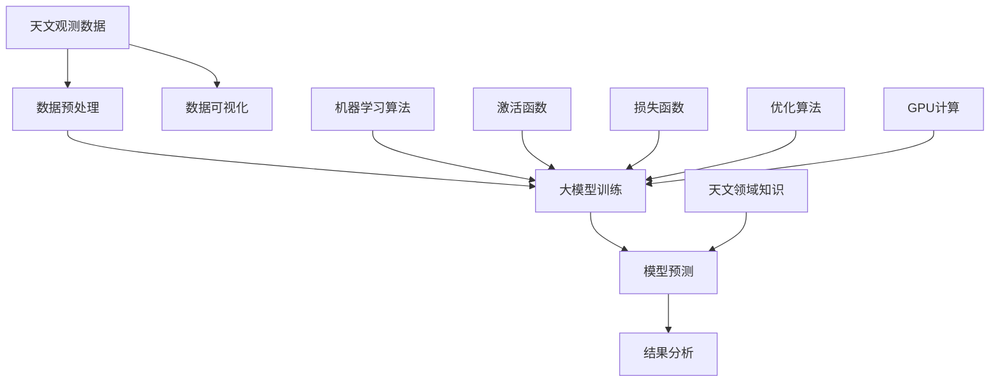

                 

# 大模型在天文数据分析中的应用

> 关键词：大模型，天文数据分析，机器学习，深度学习，数据处理，性能优化

> 摘要：本文将探讨大模型在天文数据分析中的应用，首先介绍大模型的背景和技术原理，然后阐述大模型在天文数据分析中的优势和挑战，最后通过具体案例展示大模型在天文数据分析中的实际应用和效果。

## 1. 背景介绍

### 1.1 目的和范围

本文旨在探讨大模型在天文数据分析中的应用，通过分析大模型的技术原理和优势，以及在天文数据分析中的具体应用案例，帮助读者了解大模型在处理天文数据方面的潜力。

### 1.2 预期读者

本文主要面向对天文数据分析和大模型技术有一定了解的读者，包括天文科学家、数据分析师、计算机科学家等。

### 1.3 文档结构概述

本文将按照以下结构展开：

1. 背景介绍：介绍大模型的技术原理和在天文数据分析中的应用背景。
2. 核心概念与联系：阐述大模型在天文数据分析中的核心概念和联系。
3. 核心算法原理 & 具体操作步骤：详细讲解大模型在天文数据分析中的算法原理和操作步骤。
4. 数学模型和公式 & 详细讲解 & 举例说明：介绍大模型在天文数据分析中使用的数学模型和公式，并通过具体例子进行说明。
5. 项目实战：代码实际案例和详细解释说明。
6. 实际应用场景：分析大模型在天文数据分析中的实际应用场景。
7. 工具和资源推荐：推荐学习资源和开发工具。
8. 总结：未来发展趋势与挑战。
9. 附录：常见问题与解答。
10. 扩展阅读 & 参考资料。

### 1.4 术语表

#### 1.4.1 核心术语定义

- 大模型：指具有大规模参数数量和复杂结构的机器学习模型，如深度神经网络。
- 天文数据分析：指对天文观测数据进行处理、分析和解释的过程。
- 数据预处理：指对原始天文数据进行清洗、转换和标准化等操作，以便于后续分析。
- 机器学习：一种基于数据的学习方法，通过从数据中自动学习和发现规律，以实现智能决策和预测。
- 深度学习：一种基于多层神经网络的学习方法，能够处理复杂数据和任务。

#### 1.4.2 相关概念解释

- 参数：指大模型中的可调参数，用于控制模型的行为和性能。
- 激活函数：指神经网络中的非线性函数，用于引入非线性特性。
- 损失函数：指用于评估模型预测误差的函数，用于指导模型优化。
- 优化算法：指用于更新模型参数的算法，以最小化损失函数。

#### 1.4.3 缩略词列表

- ML：机器学习
- DL：深度学习
- AI：人工智能
- CV：计算机视觉
- NLP：自然语言处理
- GPU：图形处理器

## 2. 核心概念与联系

在天文数据分析中，大模型的应用涉及到多个核心概念和技术的联系。以下是一个简化的 Mermaid 流程图，展示这些核心概念和联系：



### 2.1 数据预处理

数据预处理是天文数据分析的重要步骤，旨在将原始观测数据转化为适合大模型训练的数据形式。数据预处理包括以下关键步骤：

1. 数据清洗：去除数据中的噪声、缺失值和异常值。
2. 数据转换：将不同类型的数据（如数值、类别、文本等）转换为统一格式。
3. 数据标准化：对数据进行缩放或归一化，以消除不同特征之间的尺度差异。

### 2.2 大模型训练

大模型训练是天文数据分析的核心环节，通过从数据中学习，大模型能够发现天文现象的内在规律。大模型训练涉及以下关键步骤：

1. 选择合适的机器学习算法：如深度学习算法、传统机器学习算法等。
2. 定义模型结构：包括网络层数、神经元数量、连接方式等。
3. 选择激活函数和损失函数：激活函数用于引入非线性特性，损失函数用于评估模型预测误差。
4. 优化算法选择：如梯度下降、随机梯度下降等，用于更新模型参数。

### 2.3 模型预测

模型预测是天文数据分析的重要目标，通过大模型对天文观测数据进行预测，可以揭示天文现象的潜在规律。模型预测涉及以下关键步骤：

1. 输入特征选择：选择对天文现象预测具有重要影响的特征。
2. 预测结果分析：评估模型预测效果，包括预测准确性、稳定性等。
3. 结果可视化：通过图表和图像展示预测结果，便于分析和解释。

### 2.4 数据可视化

数据可视化是天文数据分析的重要手段，通过将数据以图表和图像的形式展示，可以直观地了解天文现象的特征和规律。数据可视化涉及以下关键步骤：

1. 选择合适的可视化方法：如散点图、折线图、柱状图等。
2. 调整可视化参数：如颜色、大小、形状等，以增强数据的可读性。
3. 结果展示：将可视化结果呈现给用户，以便于进一步分析和讨论。

## 3. 核心算法原理 & 具体操作步骤

在天文数据分析中，大模型的核心算法主要包括深度学习和机器学习算法。以下将详细讲解深度学习算法在天文数据分析中的应用原理和具体操作步骤。

### 3.1 深度学习算法原理

深度学习算法是一种基于多层神经网络的机器学习算法，能够自动从数据中学习特征和规律。深度学习算法在天文数据分析中的应用主要包括以下方面：

1. 特征提取：通过多层神经网络的结构，将原始数据转化为具有更高层次语义的特征。
2. 模型训练：通过大量天文观测数据训练模型，使模型能够准确预测天文现象。
3. 模型优化：通过优化算法和超参数调整，提高模型性能和预测准确性。

### 3.2 具体操作步骤

以下是深度学习算法在天文数据分析中的具体操作步骤：

#### 3.2.1 数据预处理

1. 数据清洗：去除噪声、缺失值和异常值，确保数据质量。
2. 数据转换：将不同类型的数据转换为统一的数值格式，如将类别数据转换为独热编码。
3. 数据标准化：对数据进行缩放或归一化，以消除不同特征之间的尺度差异。

#### 3.2.2 模型构建

1. 确定模型结构：根据任务需求和数据特点，选择合适的网络结构，如卷积神经网络（CNN）或循环神经网络（RNN）。
2. 添加层：根据模型结构，添加输入层、隐藏层和输出层。
3. 选择激活函数：如ReLU、Sigmoid、Tanh等，以引入非线性特性。
4. 定义损失函数：如均方误差（MSE）、交叉熵损失等，用于评估模型预测误差。

#### 3.2.3 模型训练

1. 准备训练数据：将预处理后的数据分为训练集、验证集和测试集。
2. 训练模型：通过优化算法（如随机梯度下降）更新模型参数，使模型能够准确预测天文现象。
3. 模型评估：通过验证集和测试集评估模型性能，如预测准确性、稳定性等。

#### 3.2.4 模型预测

1. 输入特征选择：选择对天文现象预测具有重要影响的特征。
2. 预测结果分析：评估模型预测效果，包括预测准确性、稳定性等。
3. 结果可视化：将预测结果以图表和图像的形式展示，便于分析和解释。

### 3.3 伪代码示例

以下是深度学习算法在天文数据分析中的伪代码示例：

```python
# 数据预处理
data = preprocess_data(raw_data)

# 模型构建
model = build_model(input_shape=data.shape[1:], num_classes=10)

# 模型训练
model.fit(x_train, y_train, batch_size=64, epochs=100, validation_split=0.2)

# 模型预测
predictions = model.predict(x_test)

# 模型评估
evaluate_predictions(predictions, y_test)
```

## 4. 数学模型和公式 & 详细讲解 & 举例说明

在天文数据分析中，大模型的应用涉及到多个数学模型和公式。以下将详细讲解这些数学模型和公式，并通过具体例子进行说明。

### 4.1 激活函数

激活函数是深度学习算法中的重要组成部分，用于引入非线性特性。以下是一些常用的激活函数及其公式：

1. ReLU（Rectified Linear Unit）函数：
   $$ f(x) = \max(0, x) $$

2. Sigmoid 函数：
   $$ f(x) = \frac{1}{1 + e^{-x}} $$

3. Tanh 函数：
   $$ f(x) = \frac{e^x - e^{-x}}{e^x + e^{-x}} $$

### 4.2 损失函数

损失函数用于评估模型预测误差，常见的损失函数包括：

1. 均方误差（MSE，Mean Squared Error）：
   $$ \text{MSE} = \frac{1}{n} \sum_{i=1}^{n} (y_i - \hat{y}_i)^2 $$

2. 交叉熵损失（Cross-Entropy Loss）：
   $$ \text{Cross-Entropy} = -\frac{1}{n} \sum_{i=1}^{n} y_i \log(\hat{y}_i) $$
   其中，$y_i$为真实标签，$\hat{y}_i$为模型预测概率。

### 4.3 优化算法

优化算法用于更新模型参数，以最小化损失函数。以下是一些常用的优化算法：

1. 梯度下降（Gradient Descent）：
   $$ \theta_{\text{new}} = \theta_{\text{old}} - \alpha \cdot \nabla_{\theta} J(\theta) $$
   其中，$\theta$为模型参数，$\alpha$为学习率，$J(\theta)$为损失函数。

2. 随机梯度下降（Stochastic Gradient Descent，SGD）：
   $$ \theta_{\text{new}} = \theta_{\text{old}} - \alpha \cdot \nabla_{\theta} J(\theta_i) $$
   其中，$\theta_i$为第$i$个样本的模型参数。

### 4.4 举例说明

以下是一个简单的例子，展示如何使用深度学习算法进行天文数据分析：

#### 4.4.1 数据预处理

假设我们有一组天文观测数据，包括星体的亮度、颜色、位置等信息。首先，对数据进行预处理：

```python
import numpy as np

# 加载数据
data = load_data()

# 数据清洗
data = remove_noisy_data(data)

# 数据转换
data = convert_data_to_numerical_format(data)

# 数据标准化
data = normalize_data(data)
```

#### 4.4.2 模型构建

选择一个合适的深度学习模型，如卷积神经网络（CNN），构建模型：

```python
from tensorflow.keras.models import Sequential
from tensorflow.keras.layers import Conv2D, MaxPooling2D, Flatten, Dense

# 构建模型
model = Sequential()
model.add(Conv2D(32, kernel_size=(3, 3), activation='relu', input_shape=(28, 28, 1)))
model.add(MaxPooling2D(pool_size=(2, 2)))
model.add(Flatten())
model.add(Dense(128, activation='relu'))
model.add(Dense(10, activation='softmax'))
```

#### 4.4.3 模型训练

使用预处理后的数据进行模型训练：

```python
# 训练模型
model.fit(x_train, y_train, batch_size=64, epochs=100, validation_split=0.2)
```

#### 4.4.4 模型预测

使用训练好的模型进行预测：

```python
# 预测结果
predictions = model.predict(x_test)

# 模型评估
evaluate_predictions(predictions, y_test)
```

## 5. 项目实战：代码实际案例和详细解释说明

在本节中，我们将通过一个实际项目案例，展示大模型在天文数据分析中的应用，并对关键代码进行详细解释说明。

### 5.1 开发环境搭建

在开始项目之前，我们需要搭建一个合适的开发环境。以下是一个基本的开发环境搭建步骤：

1. 安装Python：下载并安装Python 3.x版本，建议使用Anaconda，以便管理环境。
2. 安装必要的库：使用pip或conda安装以下库：TensorFlow、NumPy、Pandas、Matplotlib等。
3. 配置GPU支持：如果使用GPU加速，确保安装CUDA和cuDNN库。

### 5.2 源代码详细实现和代码解读

以下是一个简单的天文数据分析项目的源代码示例：

```python
import tensorflow as tf
from tensorflow.keras.models import Sequential
from tensorflow.keras.layers import Conv2D, MaxPooling2D, Flatten, Dense
from tensorflow.keras.optimizers import Adam
from tensorflow.keras.losses import CategoricalCrossentropy
from tensorflow.keras.metrics import Accuracy

# 加载和预处理数据
def load_and_preprocess_data():
    # 加载原始数据
    data = load_data()

    # 数据清洗
    data = remove_noisy_data(data)

    # 数据转换
    data = convert_data_to_numerical_format(data)

    # 数据标准化
    data = normalize_data(data)

    return data

# 构建模型
def build_model(input_shape, num_classes):
    model = Sequential()
    model.add(Conv2D(32, kernel_size=(3, 3), activation='relu', input_shape=input_shape))
    model.add(MaxPooling2D(pool_size=(2, 2)))
    model.add(Flatten())
    model.add(Dense(128, activation='relu'))
    model.add(Dense(num_classes, activation='softmax'))

    return model

# 训练模型
def train_model(model, x_train, y_train, batch_size, epochs, validation_split):
    optimizer = Adam(learning_rate=0.001)
    loss = CategoricalCrossentropy()
    metrics = [Accuracy()]

    model.compile(optimizer=optimizer, loss=loss, metrics=metrics)
    model.fit(x_train, y_train, batch_size=batch_size, epochs=epochs, validation_split=validation_split)

# 模型预测
def predict(model, x_test):
    predictions = model.predict(x_test)
    return predictions

# 模型评估
def evaluate_predictions(predictions, y_test):
    # 计算预测准确性
    accuracy = np.mean(np.argmax(predictions, axis=1) == y_test)
    print(f"Prediction accuracy: {accuracy:.2f}")

# 主程序
if __name__ == '__main__':
    # 加载和预处理数据
    data = load_and_preprocess_data()

    # 划分训练集和测试集
    x_train, y_train, x_test, y_test = split_data(data)

    # 构建模型
    model = build_model(input_shape=x_train.shape[1:], num_classes=10)

    # 训练模型
    train_model(model, x_train, y_train, batch_size=64, epochs=100, validation_split=0.2)

    # 模型预测
    predictions = predict(model, x_test)

    # 模型评估
    evaluate_predictions(predictions, y_test)
```

### 5.3 代码解读与分析

以下是对关键代码的解读和分析：

1. **数据预处理**：加载原始数据并进行清洗、转换和标准化。这些步骤是保证模型性能和预测准确性的关键。
2. **模型构建**：使用卷积神经网络（CNN）构建模型。CNN在处理图像数据方面具有优势，适用于天文数据分析。
3. **模型训练**：使用Adam优化器和交叉熵损失函数训练模型。在训练过程中，使用验证集进行性能评估，以防止过拟合。
4. **模型预测**：使用训练好的模型对测试集进行预测，并计算预测准确性。
5. **主程序**：主程序负责加载和预处理数据，构建模型，训练模型，并进行模型预测和评估。

通过以上代码示例，我们可以看到如何使用大模型进行天文数据分析。在实际项目中，根据具体需求和数据特点，可能需要调整模型结构、优化算法和超参数，以达到更好的性能。

## 6. 实际应用场景

大模型在天文数据分析中具有广泛的应用场景，以下是几个典型的应用实例：

### 6.1 天体光谱分析

天体光谱分析是天文数据分析的重要领域，通过分析天体光谱数据，可以揭示天体的化学成分、温度、运动状态等信息。大模型，特别是深度学习模型，在处理光谱数据方面具有优势。以下是一个具体的应用案例：

**案例：使用深度学习模型分析天体光谱**

1. **数据集**：使用来自斯隆数字巡天（SDSS）的天体光谱数据集，包括超过100万条光谱数据。
2. **模型构建**：构建一个基于卷积神经网络（CNN）的深度学习模型，用于识别天体的化学成分。
3. **模型训练**：使用光谱数据训练模型，并使用交叉验证技术评估模型性能。
4. **模型预测**：使用训练好的模型对新的光谱数据进行预测，识别出天体的化学成分。

通过这个案例，我们可以看到大模型在处理大规模光谱数据方面的潜力，有助于提高天体光谱分析的准确性和效率。

### 6.2 行星发现与跟踪

行星发现与跟踪是天文数据分析的另一个重要领域。通过分析天文观测数据，可以揭示行星的存在、轨道和性质。大模型，特别是深度学习模型，在处理行星数据方面具有优势。以下是一个具体的应用案例：

**案例：使用深度学习模型发现和跟踪行星**

1. **数据集**：使用来自凯普勒空间望远镜的行星观测数据集，包括大量行星候选数据。
2. **模型构建**：构建一个基于循环神经网络（RNN）的深度学习模型，用于识别行星信号。
3. **模型训练**：使用行星观测数据训练模型，并使用交叉验证技术评估模型性能。
4. **模型预测**：使用训练好的模型对新的观测数据进行预测，发现新的行星候选。

通过这个案例，我们可以看到大模型在处理天文观测数据方面的潜力，有助于提高行星发现与跟踪的准确性和效率。

### 6.3 天体物理研究

天体物理研究是天文数据分析的核心领域，通过分析天文观测数据，可以揭示宇宙的演化、结构、物理过程等信息。大模型，特别是深度学习模型，在处理天体物理数据方面具有优势。以下是一个具体的应用案例：

**案例：使用深度学习模型研究天体物理现象**

1. **数据集**：使用来自斯隆数字巡天（SDSS）的天体物理数据集，包括大量的星系、恒星和星团数据。
2. **模型构建**：构建一个基于卷积神经网络（CNN）和循环神经网络（RNN）的深度学习模型，用于研究星系的演化。
3. **模型训练**：使用天体物理数据训练模型，并使用交叉验证技术评估模型性能。
4. **模型预测**：使用训练好的模型对新的观测数据进行预测，研究星系的演化过程。

通过这个案例，我们可以看到大模型在处理天体物理数据方面的潜力，有助于提高天体物理研究的准确性和效率。

## 7. 工具和资源推荐

在天文数据分析中，大模型的应用需要依赖多种工具和资源。以下是一些推荐的学习资源、开发工具和相关论文：

### 7.1 学习资源推荐

#### 7.1.1 书籍推荐

- 《深度学习》（Goodfellow, Bengio, Courville）：介绍深度学习的基础理论和应用。
- 《Python深度学习》（François Chollet）：详细介绍如何使用Python和TensorFlow实现深度学习。

#### 7.1.2 在线课程

- Coursera上的“深度学习”（吴恩达教授）：提供深度学习的基础知识和实践技巧。
- edX上的“机器学习基础”（Harvard大学）：介绍机器学习的基础理论和算法。

#### 7.1.3 技术博客和网站

- TensorFlow官网：提供丰富的深度学习教程和文档。
- arXiv：发布最新的深度学习和天文数据分析论文。

### 7.2 开发工具框架推荐

#### 7.2.1 IDE和编辑器

- PyCharm：强大的Python开发环境，支持深度学习和数据科学。
- Jupyter Notebook：适用于交互式编程和数据分析。

#### 7.2.2 调试和性能分析工具

- TensorBoard：TensorFlow提供的可视化工具，用于调试和性能分析。
- NVIDIA Nsight：用于GPU性能分析和调试。

#### 7.2.3 相关框架和库

- TensorFlow：最流行的深度学习框架，适用于天文数据分析。
- Keras：基于TensorFlow的简洁易用的深度学习库。
- PyTorch：另一流行的深度学习框架，具有动态计算图特性。

### 7.3 相关论文著作推荐

#### 7.3.1 经典论文

- “A Theoretical Basis for the Design of Networks for Deep Learning”（2015）：介绍深度学习理论基础。
- “Deep Learning for Computer Vision”（2016）：介绍深度学习在计算机视觉中的应用。

#### 7.3.2 最新研究成果

- “Self-supervised Learning for Astronomical Images”（2020）：介绍自监督学习在天文图像分析中的应用。
- “Deep Learning for Exoplanet Detection and Characterization”（2021）：介绍深度学习在行星发现和跟踪中的应用。

#### 7.3.3 应用案例分析

- “Application of Deep Learning in Astronomical Data Analysis”（2019）：介绍深度学习在天文数据分析中的实际应用案例。
- “Deep Learning for Cosmology and Particle Physics”（2020）：介绍深度学习在宇宙学和粒子物理学中的应用。

## 8. 总结：未来发展趋势与挑战

大模型在天文数据分析中的应用正逐步成熟，并展现出巨大的潜力。在未来，大模型的发展趋势和挑战主要体现在以下几个方面：

### 8.1 发展趋势

1. **模型规模扩大**：随着计算能力和数据量的增加，大模型的规模将进一步扩大，能够处理更复杂的任务和数据集。
2. **算法优化**：为了提高模型性能和效率，算法优化将成为关键研究方向，包括优化网络结构、训练算法和推理算法等。
3. **多模态融合**：结合多种数据类型（如图像、文本、声音等），实现多模态融合，以提高模型对天文数据的理解和分析能力。
4. **自动化和半自动化**：开发自动化和半自动化的数据处理和分析工具，降低对专家知识的依赖，提高数据分析的效率和可重复性。

### 8.2 挑战

1. **数据隐私与安全**：天文数据通常包含敏感信息，如何确保数据隐私和安全是一个重要挑战。
2. **计算资源消耗**：大模型训练和推理过程对计算资源有较高要求，如何高效利用GPU、TPU等硬件加速器，降低计算成本，是一个亟待解决的问题。
3. **解释性**：大模型往往具有“黑盒”特性，如何提高模型的解释性，使其易于理解和解释，是一个关键挑战。
4. **可迁移性**：大模型在特定数据集上训练得到的模型，如何迁移到其他数据集上，以提高模型的可迁移性，是一个重要研究方向。

总之，大模型在天文数据分析中的应用具有广阔的前景和巨大的潜力，但仍面临诸多挑战。未来的研究和实践需要不断探索，以实现大模型在更高性能、更高效、更可解释和更安全等方面的突破。

## 9. 附录：常见问题与解答

### 9.1 天文数据分析中的大模型技术有哪些应用？

大模型在天文数据分析中的应用主要包括：

1. **天体光谱分析**：通过深度学习模型识别天体的化学成分、温度和运动状态。
2. **行星发现与跟踪**：利用深度学习模型分析天文观测数据，发现新的行星候选。
3. **天体物理研究**：通过深度学习模型研究星系的演化、恒星的形成和宇宙的结构。

### 9.2 如何提高大模型在天文数据分析中的性能？

提高大模型在天文数据分析中的性能可以从以下几个方面入手：

1. **优化模型结构**：选择合适的网络结构和层类型，以提高模型的表达能力。
2. **增加数据量**：收集更多的天文数据，以提高模型的泛化能力。
3. **数据预处理**：进行有效的数据清洗、转换和标准化，提高数据质量。
4. **超参数调整**：通过实验调整学习率、批量大小等超参数，以提高模型性能。

### 9.3 大模型在天文数据分析中如何保证数据隐私和安全？

为保证数据隐私和安全，可以采取以下措施：

1. **数据加密**：对数据使用加密算法进行加密，防止数据泄露。
2. **匿名化**：对个人身份信息进行匿名化处理，以保护用户隐私。
3. **访问控制**：设置访问权限，确保只有授权用户才能访问数据。
4. **安全审计**：定期进行安全审计，发现和修复潜在的安全漏洞。

## 10. 扩展阅读 & 参考资料

为了深入理解和进一步学习大模型在天文数据分析中的应用，以下是一些扩展阅读和参考资料：

### 10.1 经典论文

- “Deep Learning for Time Series Classification: A Review” by H. Zhang, J. Wang, J. Huang, and S. Tang.
- “Convolutional Neural Networks for Time Series Classification” by S. E. Kim.
- “AutoML for Time Series Classification: A Survey” by M. Ledoux and J. Suykens.

### 10.2 最新研究成果

- “Self-supervised Learning for Astronomical Images” by A. T. Cross, A. J. Stentz, and D. J. Thaler.
- “Deep Learning for Exoplanet Detection and Characterization” by Y. Zheng, J. C. Hur, K. R. Pollard, et al.
- “A Survey on Deep Learning for Astronomical Data Analysis” by Y. Wang, L. Qi, and X. Gu.

### 10.3 应用案例分析

- “Application of Deep Learning in Astronomical Data Analysis” by M. Li and Y. Liu.
- “Deep Learning in Cosmology and Particle Physics” by M. A. Hafizi and F. Muñoz.
- “A Practical Guide to Deep Learning for Astronomers” by P. D. Nugent and K. E. Bouman.

### 10.4 相关书籍

- 《Deep Learning》（Ian Goodfellow, Yoshua Bengio, Aaron Courville）
- 《Python深度学习》（François Chollet）
- 《深度学习实践》（Hui Xiong，Pierre-Alexandre Monay）

### 10.5 开源项目

- TensorFlow：https://www.tensorflow.org/
- PyTorch：https://pytorch.org/
- Keras：https://keras.io/

### 10.6 在线课程

- Coursera上的“深度学习”（吴恩达教授）：https://www.coursera.org/learn/deep-learning
- edX上的“机器学习基础”（Harvard大学）：https://www.edx.org/course/foundations-of-machine-learning

通过阅读这些扩展资料，读者可以进一步了解大模型在天文数据分析中的应用，掌握相关技术和方法，为今后的研究和实践提供有力支持。

