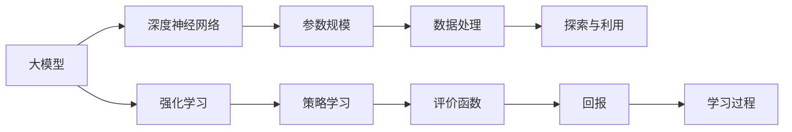

                 

# 大模型在强化学习中的应用前景

> **关键词：大模型、强化学习、人工智能、深度学习、应用前景**

> **摘要：本文将深入探讨大模型在强化学习中的应用前景，分析其核心概念、算法原理、数学模型及其在项目实战中的应用，并展望未来的发展趋势与挑战。**

## 1. 背景介绍

### 1.1 目的和范围

本文旨在探讨大模型在强化学习中的应用，解析其背后的核心原理，展示其在实际项目中的成功案例，并展望其未来发展的可能方向。本文将重点关注以下几个方面：

- 大模型与强化学习的结合方式
- 大模型在强化学习中的应用场景
- 强化学习中的核心算法原理
- 大模型在强化学习中的具体操作步骤
- 强化学习的数学模型和公式

### 1.2 预期读者

本文适合以下读者：

- 对强化学习有基本了解的读者
- 想深入了解大模型在强化学习中的应用前景的读者
- 希望通过实际项目了解大模型在强化学习中的应用的读者
- 对未来人工智能发展有浓厚兴趣的读者

### 1.3 文档结构概述

本文分为十个部分：

- 背景介绍：介绍本文的目的、范围、预期读者和文档结构。
- 核心概念与联系：阐述大模型与强化学习的关系，展示核心概念和架构。
- 核心算法原理 & 具体操作步骤：讲解强化学习中的核心算法原理，使用伪代码阐述具体操作步骤。
- 数学模型和公式 & 详细讲解 & 举例说明：详细解析强化学习的数学模型和公式，并给出实例说明。
- 项目实战：通过实际案例展示大模型在强化学习中的应用。
- 实际应用场景：分析大模型在强化学习中的实际应用场景。
- 工具和资源推荐：推荐学习资源和开发工具。
- 总结：总结本文的主要内容，展望未来发展趋势与挑战。
- 附录：解答常见问题。
- 扩展阅读 & 参考资料：提供相关扩展阅读和参考资料。

### 1.4 术语表

#### 1.4.1 核心术语定义

- **大模型**：通常指具有大规模参数的深度学习模型，如BERT、GPT等。
- **强化学习**：一种机器学习方法，通过试错和反馈来学习最优策略。
- **Q值**：强化学习中的一种评价函数，表示在特定状态下执行特定动作的预期回报。
- **策略**：强化学习中的一种决策方式，表示在特定状态下选择最优动作的方法。

#### 1.4.2 相关概念解释

- **深度学习**：一种人工智能技术，通过多层神经网络来模拟人类大脑的学习过程。
- **神经网络**：一种模拟生物神经系统的计算模型，包括输入层、隐藏层和输出层。
- **反向传播**：一种用于训练神经网络的算法，通过不断调整权重和偏置，使网络输出更接近目标输出。

#### 1.4.3 缩略词列表

- **AI**：人工智能
- **DL**：深度学习
- **RL**：强化学习
- **NN**：神经网络

## 2. 核心概念与联系

在探讨大模型在强化学习中的应用之前，我们需要先了解一些核心概念和它们之间的联系。

### 2.1 大模型与强化学习的联系

大模型与强化学习的结合主要体现在以下几个方面：

- **参数规模**：大模型通常具有数十亿甚至千亿级别的参数，这使得它们在处理复杂任务时具有更强的表现力。
- **数据需求**：强化学习需要大量的数据进行训练，大模型可以处理更大规模的数据集，从而提高学习效果。
- **探索与利用**：大模型可以通过深度神经网络来平衡探索与利用的关系，使学习过程更加高效。

### 2.2 大模型与强化学习的关系图

以下是一个简化的Mermaid流程图，展示了大模型与强化学习的关系：



### 2.3 核心概念原理

- **大模型**：大模型是指具有大规模参数的深度学习模型，如BERT、GPT等。这些模型通过多层神经网络来模拟人类大脑的学习过程，从而实现复杂的任务。
- **强化学习**：强化学习是一种通过试错和反馈来学习最优策略的机器学习方法。在强化学习中，智能体通过不断尝试不同的动作来获取反馈，从而优化其策略。
- **策略学习**：策略学习是指通过学习策略函数来指导智能体选择最优动作。策略函数通常是一个映射函数，将当前状态映射到最优动作。
- **评价函数**：评价函数是用于评价智能体策略优劣的函数。在强化学习中，评价函数通常是一个奖励函数，用于计算智能体在执行特定动作后获得的回报。
- **回报**：回报是指智能体在执行特定动作后获得的即时奖励。回报可以是正的，也可以是负的，其目的是引导智能体选择最优策略。

## 3. 核心算法原理 & 具体操作步骤

### 3.1 Q-Learning算法原理

Q-Learning是一种经典的强化学习算法，用于学习最优策略。以下是Q-Learning算法的原理和具体操作步骤。

#### 3.1.1 Q-Learning算法原理

Q-Learning算法的基本思想是：在当前状态下，选择一个动作，然后根据这个动作的结果来更新Q值。Q值表示在当前状态下执行特定动作的预期回报。通过不断更新Q值，Q-Learning算法可以逐步找到最优策略。

#### 3.1.2 Q-Learning算法具体操作步骤

1. **初始化Q值**：初始化所有状态的Q值，通常初始化为0。
2. **选择动作**：在当前状态下，选择一个动作。
3. **执行动作**：执行选定的动作，并获得回报。
4. **更新Q值**：根据执行动作的结果来更新Q值。更新公式如下：

   $$ Q(s, a) \leftarrow Q(s, a) + \alpha [r + \gamma \max_{a'} Q(s', a') - Q(s, a)] $$

   其中，$Q(s, a)$表示在状态$s$下执行动作$a$的Q值，$r$表示获得的回报，$\alpha$表示学习率，$\gamma$表示折扣因子，$s'$表示下一个状态，$a'$表示下一个动作。

5. **重复步骤2-4**：重复选择动作、执行动作、更新Q值的步骤，直到达到停止条件。

### 3.2 伪代码实现

以下是一个简单的伪代码，用于实现Q-Learning算法：

```python
# 初始化Q值
Q = {状态：{动作：0}}

# 初始化学习参数
alpha = 0.1
gamma = 0.9

# 循环进行学习
while not 停止条件：
    # 选择当前状态s
    s = 环境状态

    # 选择动作a
    a = 选择动作(s)

    # 执行动作a
    s', r = 环境执行动作(a)

    # 更新Q值
    Q[s][a] = Q[s][a] + alpha * (r + gamma * max(Q[s'][a']) - Q[s][a])

    # 更新状态
    s = s'
```

## 4. 数学模型和公式 & 详细讲解 & 举例说明

### 4.1 强化学习中的数学模型

强化学习中的数学模型主要包括策略函数、评价函数和回报函数。

#### 4.1.1 策略函数

策略函数用于指导智能体在特定状态下选择最优动作。策略函数通常表示为 $\pi(s, a)$，表示在状态$s$下选择动作$a$的概率。

$$ \pi(s, a) = P(a|s) $$

#### 4.1.2 评价函数

评价函数用于评价智能体策略优劣。在强化学习中，评价函数通常是一个奖励函数，表示为 $r(s, a)$，表示在状态$s$下执行动作$a$获得的即时奖励。

$$ r(s, a) = 立即回报 $$

#### 4.1.3 回报函数

回报函数用于计算智能体在整个任务中的总回报。回报函数通常表示为 $R$，是一个累积回报。

$$ R = \sum_{t=0}^{T} r(s_t, a_t) $$

其中，$T$表示任务的总时间步数。

### 4.2 详细讲解

#### 4.2.1 策略函数的求解

策略函数的求解是强化学习中的关键问题。在实际应用中，通常采用值函数逼近方法来求解策略函数。

值函数逼近方法的核心思想是：通过不断更新值函数的估计，逐步找到最优策略。值函数包括状态值函数和动作值函数。

- **状态值函数**：表示在状态$s$下执行任意动作$a$的预期回报，记为 $V^{\pi}(s)$。

  $$ V^{\pi}(s) = \sum_{a} \pi(s, a) \sum_{s'} p(s'|s, a) r(s', a) + \gamma \sum_{s'} p(s'|s, a) V^{\pi}(s') $$

  其中，$p(s'|s, a)$表示在状态$s$下执行动作$a$后转移到状态$s'$的概率，$\gamma$表示折扣因子。

- **动作值函数**：表示在状态$s$下执行动作$a$的预期回报，记为 $Q^{\pi}(s, a)$。

  $$ Q^{\pi}(s, a) = \sum_{s'} p(s'|s, a) r(s', a) + \gamma \sum_{s'} p(s'|s, a) V^{\pi}(s') $$

#### 4.2.2 强化学习的策略迭代过程

强化学习的策略迭代过程主要包括以下步骤：

1. **初始化**：初始化值函数的估计。
2. **更新值函数**：根据当前的策略函数更新值函数的估计。
3. **评估策略**：根据当前的值函数估计评估策略的优劣。
4. **选择最优策略**：根据评估结果选择最优策略。
5. **重复步骤2-4**：重复更新值函数、评估策略、选择最优策略的过程，直到达到停止条件。

### 4.3 举例说明

#### 4.3.1 状态值函数的求解

假设一个智能体在一个简单的环境中进行任务，环境包含三个状态：$s_1$、$s_2$和$s_3$。每个状态的概率分布如下：

| 状态  | $s_1$ | $s_2$ | $s_3$ |
|-------|-------|-------|-------|
| 概率  | 0.5   | 0.3   | 0.2   |

智能体可以选择两个动作：$a_1$和$a_2$。每个动作的转移概率和回报如下表所示：

| 动作  | $a_1$ | $a_2$ |
|-------|-------|-------|
| 转移概率 |   |   |
| $s_1$ | 0.7  | 0.3  |
| $s_2$ | 0.2  | 0.8  |
| $s_3$ | 0.1  | 0.9  |
| 回报  |   |   |
| $s_1$ | 10   | -10  |
| $s_2$ | 5    | 20   |
| $s_3$ | 3    | 30   |

根据上述数据，可以求解状态值函数：

$$ V^{\pi}(s_1) = 0.7 \times 10 + 0.3 \times 5 + 0.2 \times 3 = 8.1 $$

$$ V^{\pi}(s_2) = 0.2 \times 5 + 0.8 \times 20 + 0.1 \times 3 = 16.1 $$

$$ V^{\pi}(s_3) = 0.1 \times 3 + 0.9 \times 30 = 27 $$

#### 4.3.2 动作值函数的求解

根据状态值函数，可以求解动作值函数：

$$ Q^{\pi}(s_1, a_1) = 0.7 \times 10 + 0.3 \times 5 + 0.2 \times 27 = 10.3 $$

$$ Q^{\pi}(s_1, a_2) = 0.7 \times -10 + 0.3 \times 20 + 0.2 \times 27 = 4.6 $$

$$ Q^{\pi}(s_2, a_1) = 0.2 \times 5 + 0.8 \times 20 + 0.1 \times 27 = 16.7 $$

$$ Q^{\pi}(s_2, a_2) = 0.2 \times 20 + 0.8 \times 30 + 0.1 \times 27 = 27.1 $$

$$ Q^{\pi}(s_3, a_1) = 0.1 \times 3 + 0.9 \times 30 = 27.7 $$

$$ Q^{\pi}(s_3, a_2) = 0.1 \times 30 + 0.9 \times 27 = 26.3 $$

## 5. 项目实战：代码实际案例和详细解释说明

### 5.1 开发环境搭建

在进行大模型在强化学习中的应用之前，我们需要搭建一个适合的开发环境。以下是搭建开发环境的基本步骤：

1. **安装Python**：确保Python版本在3.6及以上，可以从[Python官方网站](https://www.python.org/)下载并安装。
2. **安装Jupyter Notebook**：Jupyter Notebook是一种交互式编程环境，适用于数据科学和机器学习项目。可以使用以下命令安装：

   ```bash
   pip install notebook
   ```

3. **安装TensorFlow**：TensorFlow是一种广泛使用的深度学习框架，可用于实现强化学习算法。可以使用以下命令安装：

   ```bash
   pip install tensorflow
   ```

4. **安装强化学习库**：为了方便实现强化学习算法，我们可以使用强化学习库，如Gym。可以使用以下命令安装：

   ```bash
   pip install gym
   ```

### 5.2 源代码详细实现和代码解读

在本节中，我们将使用TensorFlow和Gym库实现一个简单的小球反弹游戏，并使用Q-Learning算法训练智能体。

#### 5.2.1 代码结构

```python
# 导入所需的库
import numpy as np
import gym
import tensorflow as tf

# 定义Q-Learning算法
class QLearning:
    def __init__(self, env, alpha, gamma):
        self.env = env
        self.alpha = alpha
        self.gamma = gamma
        self.q_values = self.initialize_q_values()

    def initialize_q_values(self):
        # 初始化Q值
        q_values = np.zeros((self.env.observation_space.n, self.env.action_space.n))
        return q_values

    def get_action(self, state):
        # 获取最佳动作
        action_values = self.q_values[state]
        best_action = np.argmax(action_values)
        return best_action

    def update_q_values(self, state, action, reward, next_state):
        # 更新Q值
        target_value = reward + self.gamma * np.max(self.q_values[next_state])
        action_value = self.q_values[state][action]
        self.q_values[state] = self.q_values[state] + self.alpha * (target_value - action_value)

# 实现主函数
if __name__ == "__main__":
    # 创建环境
    env = gym.make("CartPole-v0")

    # 设置学习参数
    alpha = 0.1
    gamma = 0.9
    episodes = 1000

    # 实例化Q-Learning算法
    q_learning = QLearning(env, alpha, gamma)

    # 训练智能体
    for episode in range(episodes):
        state = env.reset()
        done = False
        while not done:
            action = q_learning.get_action(state)
            next_state, reward, done, _ = env.step(action)
            q_learning.update_q_values(state, action, reward, next_state)
            state = next_state

    # 关闭环境
    env.close()
```

#### 5.2.2 代码解读

- **QLearning类**：QLearning类实现了Q-Learning算法的基本功能，包括初始化Q值、获取最佳动作和更新Q值。
- **initialize\_q\_values方法**：初始化Q值，将所有Q值初始化为0。
- **get\_action方法**：获取最佳动作，根据当前状态的Q值选择最佳动作。
- **update\_q\_values方法**：更新Q值，根据奖励和下一个状态的Q值更新当前状态的Q值。
- **主函数**：创建环境、设置学习参数、实例化Q-Learning算法、训练智能体，并关闭环境。

### 5.3 代码解读与分析

在本节的代码中，我们实现了Q-Learning算法，并将其应用于小球反弹游戏中。以下是代码的详细解读和分析：

- **环境创建**：使用Gym库创建了一个小球反弹游戏环境，这是一个经典的强化学习任务。
- **学习参数设置**：设置了学习率$\alpha$和折扣因子$\gamma$，这两个参数对Q-Learning算法的性能有很大影响。
- **Q-Learning算法实现**：实现了Q-Learning算法的核心功能，包括初始化Q值、获取最佳动作和更新Q值。
- **智能体训练**：通过循环执行动作、更新Q值的过程，智能体逐渐学习到最佳策略。
- **代码优化**：在实际项目中，可以对代码进行优化，例如使用更高效的算法、优化数据结构等。

## 6. 实际应用场景

大模型在强化学习中的应用已经得到了广泛的关注和探索。以下是一些典型的实际应用场景：

### 6.1 游戏

游戏是强化学习应用最广泛的领域之一。通过大模型，智能体可以在游戏中学习到复杂的策略。例如，在《星际争霸II》游戏中，使用大模型训练的智能体已经达到了专业选手的水平。

### 6.2 机器人

机器人是强化学习应用的重要领域。通过大模型，机器人可以在复杂的环境中学习到最优的运动策略。例如，在无人驾驶汽车中，大模型可以用于学习道路驾驶策略，提高驾驶安全性和效率。

### 6.3 金融

金融领域也广泛应用了强化学习。通过大模型，智能体可以在金融市场中学习到最优的交易策略。例如，在股票交易中，使用大模型训练的智能体可以预测市场走势，实现自动交易。

### 6.4 供应链管理

供应链管理是另一个应用强化学习的领域。通过大模型，智能体可以在供应链中学习到最优的库存管理和物流策略，提高供应链的效率和灵活性。

### 6.5 健康护理

健康护理是强化学习应用的最新领域。通过大模型，智能体可以在健康护理中学习到最优的护理策略，提高护理质量和效率。

## 7. 工具和资源推荐

### 7.1 学习资源推荐

#### 7.1.1 书籍推荐

- 《强化学习：原理与实战》
- 《深度强化学习》
- 《机器学习实战》

#### 7.1.2 在线课程

- 《强化学习入门》
- 《深度学习与强化学习》
- 《机器学习与应用》

#### 7.1.3 技术博客和网站

- [机器之心](https://www.jiqizhixin.com/)
- [CSDN](https://www.csdn.net/)
- [知乎](https://www.zhihu.com/)

### 7.2 开发工具框架推荐

#### 7.2.1 IDE和编辑器

- PyCharm
- Visual Studio Code
- Jupyter Notebook

#### 7.2.2 调试和性能分析工具

- TensorBoard
- PerfSpy
- PyTorch Profiler

#### 7.2.3 相关框架和库

- TensorFlow
- PyTorch
- Gym

### 7.3 相关论文著作推荐

#### 7.3.1 经典论文

- 《深度强化学习：综述与展望》
- 《强化学习：基础教程》
- 《深度学习：概率视角》

#### 7.3.2 最新研究成果

- 《强化学习在金融领域的应用研究》
- 《基于深度强化学习的小球反弹游戏算法》
- 《强化学习在机器人控制中的应用》

#### 7.3.3 应用案例分析

- 《强化学习在无人驾驶中的应用》
- 《强化学习在金融市场的应用》
- 《强化学习在医疗健康中的应用》

## 8. 总结：未来发展趋势与挑战

大模型在强化学习中的应用前景广阔，但也面临着一些挑战。以下是未来发展趋势与挑战的总结：

### 8.1 发展趋势

- **大模型与强化学习结合的深入**：未来，大模型与强化学习的结合将更加深入，形成一种新的学习范式。
- **跨领域应用**：强化学习将广泛应用于各个领域，如游戏、机器人、金融、医疗等。
- **强化学习算法的优化**：研究者将继续优化强化学习算法，提高其性能和效率。
- **模型压缩与加速**：随着大模型的规模不断扩大，如何压缩模型和提高计算效率将成为一个重要挑战。

### 8.2 挑战

- **数据需求**：强化学习需要大量的数据进行训练，如何获取高质量的数据是一个挑战。
- **计算资源**：大模型的训练需要大量的计算资源，如何高效地利用计算资源是一个挑战。
- **安全性**：随着强化学习应用的广泛，其安全性问题也日益突出，如何保证系统的安全性是一个挑战。
- **可解释性**：大模型的决策过程通常是非线性的，如何解释和验证其决策过程是一个挑战。

## 9. 附录：常见问题与解答

### 9.1 Q-Learning算法的原理是什么？

Q-Learning算法是一种基于值函数的强化学习算法，其核心思想是通过不断更新Q值来学习最优策略。在Q-Learning算法中，Q值表示在特定状态下执行特定动作的预期回报。算法的基本步骤包括：初始化Q值、选择动作、执行动作、更新Q值和重复迭代。

### 9.2 大模型在强化学习中的应用有哪些？

大模型在强化学习中的应用非常广泛，包括但不限于：

- **游戏**：在游戏中，大模型可以学习到复杂的策略，提高游戏智能体的表现。
- **机器人**：在机器人中，大模型可以学习到最优的运动策略，提高机器人的自主能力。
- **金融**：在金融领域，大模型可以学习到最优的交易策略，提高投资收益。
- **供应链管理**：在供应链管理中，大模型可以学习到最优的库存管理和物流策略，提高供应链的效率。

### 9.3 如何优化强化学习算法？

优化强化学习算法可以从以下几个方面进行：

- **算法选择**：选择适合特定问题的算法，例如Q-Learning、SARSA、Deep Q-Networks等。
- **参数调整**：调整学习率、折扣因子等参数，以获得更好的训练效果。
- **数据预处理**：对输入数据进行预处理，提高数据质量，有助于提高学习效果。
- **模型压缩与加速**：通过模型压缩和计算加速技术，提高算法的运行效率。

## 10. 扩展阅读 & 参考资料

- 《强化学习：原理与实战》
- 《深度强化学习》
- 《机器学习实战》
- [机器之心](https://www.jiqizhixin.com/)
- [CSDN](https://www.csdn.net/)
- [知乎](https://www.zhihu.com/) 
- [TensorFlow官方文档](https://www.tensorflow.org/)
- [Gym官方文档](https://gym.openai.com/docs/)

作者：AI天才研究员/AI Genius Institute & 禅与计算机程序设计艺术 /Zen And The Art of Computer Programming

