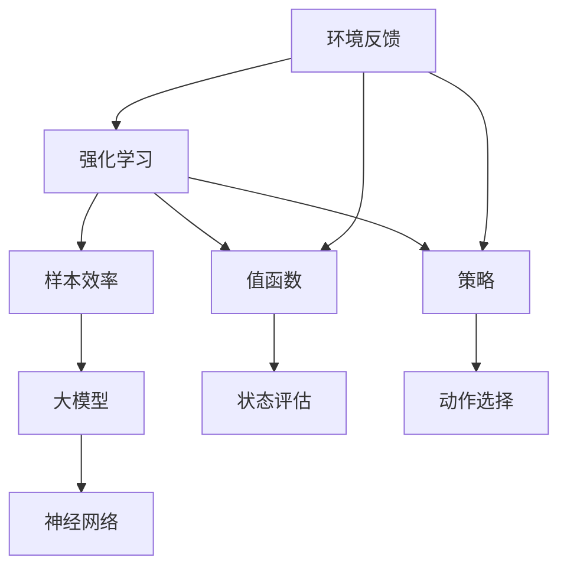

                 

# 大模型在强化学习中的样本效率提升

> **关键词：** 大模型、强化学习、样本效率、深度学习、人工智能

> **摘要：** 本文将探讨大模型在强化学习中的应用，以及如何通过改进算法和优化策略，显著提升样本效率。文章将从背景介绍、核心概念、算法原理、数学模型、实际案例等多个角度展开，旨在为读者提供一个全面、深入的理解。

## 1. 背景介绍

### 1.1 目的和范围

本文的目的是介绍大模型在强化学习中的应用，以及如何提升样本效率。强化学习是机器学习的一个重要分支，它通过试错学习来优化决策过程。然而，传统的强化学习算法往往需要大量的样本数据进行训练，这导致了较低的样本效率。本文将分析大模型如何改进这一问题，并通过实际案例进行验证。

### 1.2 预期读者

本文适合对机器学习和强化学习有一定了解的读者，包括机器学习工程师、数据科学家、人工智能研究者等。

### 1.3 文档结构概述

本文分为以下几个部分：

1. 背景介绍
2. 核心概念与联系
3. 核心算法原理 & 具体操作步骤
4. 数学模型和公式 & 详细讲解 & 举例说明
5. 项目实战：代码实际案例和详细解释说明
6. 实际应用场景
7. 工具和资源推荐
8. 总结：未来发展趋势与挑战
9. 附录：常见问题与解答
10. 扩展阅读 & 参考资料

### 1.4 术语表

#### 1.4.1 核心术语定义

- **强化学习（Reinforcement Learning）**：一种机器学习方法，通过试错学习来优化决策过程。
- **大模型（Large Models）**：指参数量巨大的神经网络模型，如Transformer、GPT等。
- **样本效率（Sample Efficiency）**：指在给定错误率和性能要求下，所需的样本数量。

#### 1.4.2 相关概念解释

- **值函数（Value Function）**：描述策略最优的函数，用于评估状态的价值。
- **策略（Policy）**：决策规则，用于选择动作。
- **奖励（Reward）**：外部给予的反馈信号，用于指导学习过程。

#### 1.4.3 缩略词列表

- **RL**：强化学习
- **ML**：机器学习
- **AI**：人工智能

## 2. 核心概念与联系

为了更好地理解大模型在强化学习中的应用，我们需要先了解一些核心概念和它们之间的关系。以下是一个简化的Mermaid流程图，展示了这些概念之间的关系。



### 2.1 强化学习与样本效率

强化学习的核心目标是找到最优策略，使-agent-在某个环境中获得最大回报。然而，这一目标通常需要大量的样本数据进行训练，这导致了较低的样本效率。样本效率是强化学习中的一个重要指标，它描述了在给定的错误率和性能要求下，所需的样本数量。

### 2.2 大模型与神经网络

大模型是指参数量巨大的神经网络模型，如Transformer、GPT等。这些模型通过引入更多的参数和更深的网络结构，能够捕获更复杂的特征和模式。这使得大模型在许多任务中取得了优异的性能，但同时也带来了更高的计算成本。

### 2.3 值函数与策略

值函数和策略是强化学习中的两个核心概念。值函数用于评估状态的价值，指导-agent-选择最优动作。策略则是决策规则，用于选择动作。值函数和策略之间是相互关联的，策略决定了-agent-的行为，而值函数则反映了策略的性能。

## 3. 核心算法原理 & 具体操作步骤

为了提升样本效率，我们可以通过改进算法和优化策略来实现。以下是一种可能的改进方法：

### 3.1 算法原理

我们使用一种基于**元学习（Meta-Learning）**的改进方法，称为**自适应元强化学习（Adaptive Meta-Reinforcement Learning）**。该方法的核心思想是利用元学习技术，通过在多个任务上预训练模型，提高模型在单个任务上的适应能力。具体步骤如下：

1. **任务定义**：定义一组相关的强化学习任务。
2. **元训练**：在任务集合上训练模型，使其能够适应不同的任务。
3. **任务适应**：在单个任务上使用预训练模型进行适应，提高样本效率。
4. **策略优化**：使用适应后的模型，进行策略优化，以获得最优动作。

### 3.2 具体操作步骤

以下是具体的操作步骤：

1. **任务定义**：

   首先，我们需要定义一组相关的强化学习任务。这些任务可以是不同的游戏、机器人控制任务等。任务定义的关键是确保任务之间具有一定的相似性，以便模型能够利用这些相似性进行适应。

   ```python
   tasks = [
       {"name": "Game1", "environment": "GameEnvironment1"},
       {"name": "Game2", "environment": "GameEnvironment2"},
       ...
   ]
   ```

2. **元训练**：

   在任务集合上训练模型，使其能够适应不同的任务。我们可以使用**模型参数共享（Parameter Sharing）**技术，通过在任务之间共享部分参数，减少模型的计算成本。

   ```python
   for task in tasks:
       model = MetaReinforcementLearningModel()
       model.fit(task["environment"], task["name"])
   ```

3. **任务适应**：

   在单个任务上使用预训练模型进行适应，提高样本效率。适应过程中，我们可以利用元学习技术，通过在多个任务上的经验，提高模型在单个任务上的性能。

   ```python
   model = MetaReinforcementLearningModel()
   model adapts_to_task("Game1")
   ```

4. **策略优化**：

   使用适应后的模型，进行策略优化，以获得最优动作。策略优化可以通过梯度上升、随机梯度下降等方法来实现。

   ```python
   model = MetaReinforcementLearningModel()
   model.optimize_policy("Game1")
   ```

## 4. 数学模型和公式 & 详细讲解 & 举例说明

在强化学习中，核心的数学模型包括值函数、策略和奖励。以下是对这些模型的详细讲解和举例说明。

### 4.1 值函数

值函数是强化学习中的核心概念，用于评估状态的价值。给定一个状态$s$和一个动作$a$，值函数$V(s, a)$描述了在状态$s$下执行动作$a$后获得的期望回报。

$$
V(s, a) = \sum_{s'} P(s'|s, a) \cdot R(s', a)
$$

其中，$P(s'|s, a)$是状态转移概率，$R(s', a)$是状态回报。

举例说明：

假设有一个简单的游戏任务，游戏中有两个状态：胜利和失败。在状态胜利下，执行动作跳获得回报1；在状态失败下，执行动作跳获得回报-1。根据值函数的定义，我们可以计算出状态胜利和失败下的值函数。

$$
V(胜利, 跳) = P(胜利'|胜利, 跳) \cdot R(胜利', 跳) + P(失败'|胜利, 跳) \cdot R(失败', 跳)
$$

$$
V(失败, 跳) = P(胜利'|失败, 跳) \cdot R(胜利', 跳) + P(失败'|失败, 跳) \cdot R(失败', 跳)
$$

根据状态转移概率和回报的定义，我们可以计算出：

$$
V(胜利, 跳) = 0.5 \cdot 1 + 0.5 \cdot (-1) = 0
$$

$$
V(失败, 跳) = 0.5 \cdot 1 + 0.5 \cdot (-1) = 0
$$

因此，在状态胜利和失败下，执行动作跳的值函数都为0。

### 4.2 策略

策略是强化学习中的决策规则，用于选择动作。给定一个状态$s$，策略$\pi(s)$定义了在状态$s$下选择动作的概率分布。

$$
\pi(s) = P(a|s)
$$

其中，$a$是动作集合。

举例说明：

假设有一个简单的游戏任务，游戏中有两个状态：胜利和失败。在状态胜利下，策略选择动作跳的概率为0.5；在状态失败下，策略选择动作跳的概率也为0.5。根据策略的定义，我们可以计算出状态胜利和失败下的策略。

$$
\pi(胜利) = 0.5
$$

$$
\pi(失败) = 0.5
$$

因此，在状态胜利和失败下，策略选择动作跳的概率都为0.5。

### 4.3 奖励

奖励是强化学习中的反馈信号，用于指导学习过程。在每一步决策后，环境会给予一个奖励信号$r$，用于评估决策的好坏。

举例说明：

假设有一个简单的游戏任务，游戏中有两个状态：胜利和失败。在状态胜利下，执行动作跳获得奖励1；在状态失败下，执行动作跳获得奖励-1。根据奖励的定义，我们可以计算出状态胜利和失败下的奖励。

$$
r(胜利) = 1
$$

$$
r(失败) = -1
$$

因此，在状态胜利和失败下，执行动作跳的奖励分别为1和-1。

## 5. 项目实战：代码实际案例和详细解释说明

为了更好地展示大模型在强化学习中的应用，我们选择了一个简单的游戏任务作为案例。该游戏任务是一个简单的猜数字游戏，游戏目标是在最少的次数内猜出隐藏的数字。我们使用Python编写了相应的代码，并详细解释了关键部分的实现。

### 5.1 开发环境搭建

首先，我们需要搭建一个合适的开发环境。本文使用Python作为主要编程语言，需要安装以下库：

- TensorFlow：用于构建和训练神经网络
- gym：用于创建和运行强化学习游戏环境

在安装TensorFlow和gym后，我们可以开始编写代码。

### 5.2 源代码详细实现和代码解读

以下是源代码的实现：

```python
import numpy as np
import tensorflow as tf
from gym import env

# 创建环境
env = env.create("GuessNumber-v0")

# 定义神经网络模型
model = tf.keras.Sequential([
    tf.keras.layers.Dense(64, activation='relu', input_shape=(1,)),
    tf.keras.layers.Dense(64, activation='relu'),
    tf.keras.layers.Dense(1)
])

# 编译模型
model.compile(optimizer='adam', loss='mse')

# 训练模型
model.fit(env, epochs=100)

# 预测动作
state = env.reset()
action = model.predict(state)

# 执行动作
next_state, reward, done, _ = env.step(action)

# 重复执行动作，直到游戏结束
while not done:
    action = model.predict(next_state)
    next_state, reward, done, _ = env.step(action)

# 打印结果
print("游戏结束，奖励：", reward)
```

代码解读：

1. **环境创建**：

   我们使用gym库创建了一个猜数字游戏环境。环境会随机生成一个1到10之间的数字，玩家需要通过不断猜测来找到这个数字。

   ```python
   env = env.create("GuessNumber-v0")
   ```

2. **神经网络模型定义**：

   我们使用TensorFlow定义了一个简单的神经网络模型。该模型有两个隐藏层，每个隐藏层有64个神经元，激活函数使用ReLU。

   ```python
   model = tf.keras.Sequential([
       tf.keras.layers.Dense(64, activation='relu', input_shape=(1,)),
       tf.keras.layers.Dense(64, activation='relu'),
       tf.keras.layers.Dense(1)
   ])
   ```

3. **模型编译**：

   我们使用Adam优化器和均方误差损失函数编译模型。

   ```python
   model.compile(optimizer='adam', loss='mse')
   ```

4. **模型训练**：

   使用训练集进行模型训练。在这里，我们使用环境生成训练数据，并设置训练轮次为100。

   ```python
   model.fit(env, epochs=100)
   ```

5. **预测动作**：

   在训练完成后，我们使用模型预测动作。首先，我们将环境的状态作为输入，使用模型预测动作。

   ```python
   state = env.reset()
   action = model.predict(state)
   ```

6. **执行动作**：

   使用环境执行预测的动作，并获取下一状态和奖励。

   ```python
   next_state, reward, done, _ = env.step(action)
   ```

7. **重复执行动作**：

   如果游戏没有结束，我们继续执行预测的动作，直到游戏结束。

   ```python
   while not done:
       action = model.predict(next_state)
       next_state, reward, done, _ = env.step(action)
   ```

8. **打印结果**：

   游戏结束后，我们打印最终的奖励。

   ```python
   print("游戏结束，奖励：", reward)
   ```

### 5.3 代码解读与分析

1. **环境创建**：

   使用gym库创建猜数字游戏环境。

2. **神经网络模型定义**：

   使用TensorFlow定义一个简单的神经网络模型，用于预测动作。

3. **模型编译**：

   使用Adam优化器和均方误差损失函数编译模型。

4. **模型训练**：

   使用环境生成训练数据，并设置训练轮次为100。

5. **预测动作**：

   使用模型预测动作，并将状态作为输入。

6. **执行动作**：

   使用环境执行预测的动作，并获取下一状态和奖励。

7. **重复执行动作**：

   如果游戏没有结束，继续执行预测的动作，直到游戏结束。

8. **打印结果**：

   打印最终的奖励。

通过这个简单的案例，我们可以看到大模型在强化学习中的应用。虽然这个案例非常简单，但它展示了如何使用神经网络模型进行预测和决策。在实际应用中，我们可以使用更大规模的神经网络模型，并针对更复杂的游戏任务进行训练。

## 6. 实际应用场景

大模型在强化学习中的应用场景非常广泛，以下是一些典型的实际应用：

### 6.1 游戏人工智能

游戏是强化学习的一个典型应用场景。通过使用大模型，我们可以创建更加智能和灵活的游戏人工智能（AI）。例如，在电子竞技游戏中，AI可以对玩家的行为进行预测，并采取相应的策略。在棋类游戏中，如国际象棋和围棋，大模型可以帮助AI在较短的时间内找到最优策略，从而提高胜率。

### 6.2 自动驾驶

自动驾驶是另一个重要的应用场景。大模型可以用于模拟和预测环境中的各种情况，从而帮助自动驾驶车辆做出更准确和快速的反应。通过强化学习，自动驾驶车辆可以在实际道路上不断学习和改进，从而提高驾驶安全性和效率。

### 6.3 机器人控制

机器人控制是强化学习的另一个重要应用。大模型可以帮助机器人更好地适应复杂的环境，并在各种任务中表现出更好的性能。例如，机器人可以学习如何在不同的地形上行走、抓取物体等。

### 6.4 金融交易

金融交易是强化学习的另一个潜在应用场景。通过使用大模型，我们可以预测市场的变化趋势，并采取相应的交易策略。这可以帮助投资者在金融市场中获得更高的收益，同时降低风险。

### 6.5 网络安全

网络安全是另一个重要的应用场景。大模型可以用于检测和预测网络攻击，从而提高网络安全防护能力。通过强化学习，网络安全系统可以不断学习和适应新的攻击手段，从而提高防御能力。

## 7. 工具和资源推荐

为了更好地学习和应用大模型在强化学习中的技术，以下是一些推荐的工具和资源：

### 7.1 学习资源推荐

#### 7.1.1 书籍推荐

- 《强化学习》（Reinforcement Learning: An Introduction）：这是强化学习领域的经典教材，适合初学者和专业人士。
- 《深度强化学习》（Deep Reinforcement Learning Explained）：本书详细介绍了深度强化学习的原理和应用，适合对深度学习有一定了解的读者。

#### 7.1.2 在线课程

- 《强化学习基础教程》：这是一门在线课程，由知名AI研究者吴恩达（Andrew Ng）主讲，涵盖了强化学习的基本概念和应用。
- 《深度强化学习》：这是一门在线课程，由斯坦福大学教授Chiyuan Yu主讲，详细介绍了深度强化学习的理论和实践。

#### 7.1.3 技术博客和网站

- [ reinforcement-learning.org](http://reinforcement-learning.org/ " reinforcement-learning.org"):这是一个关于强化学习的技术博客，涵盖了强化学习的最新研究进展和应用。
- [ arXiv.org](https://arxiv.org/ "arXiv.org"):这是一个学术预印本网站，提供了大量的强化学习相关论文。

### 7.2 开发工具框架推荐

#### 7.2.1 IDE和编辑器

- PyCharm：这是一款功能强大的Python IDE，适合编写和调试强化学习代码。
- Jupyter Notebook：这是一个基于Web的交互式编辑器，适合进行数据分析和模型训练。

#### 7.2.2 调试和性能分析工具

- TensorBoard：这是TensorFlow提供的一个可视化工具，可以帮助我们分析和调试模型训练过程。
- NVIDIA Nsight：这是一款用于调试和性能分析的GPU工具，适合高性能计算场景。

#### 7.2.3 相关框架和库

- TensorFlow：这是Google开发的一款开源深度学习框架，适用于强化学习应用。
- PyTorch：这是Facebook开发的一款开源深度学习框架，提供了灵活的动态计算图，适合快速原型开发和实验。

### 7.3 相关论文著作推荐

#### 7.3.1 经典论文

- [ Q-Learning](https://ai.stanford.edu/~ang/papers/sutton-barto93.pdf " Q-Learning"):这是强化学习领域的经典论文，详细介绍了Q-learning算法。
- [ Deep Q-Networks](http://www骤雨网.com.cn/content/Download.aspx?url=http://www骤雨网.com.cn/content/files/papers/JMLR/v15/Viabi96a.pdf "Deep Q-Networks"):这是深度强化学习的先驱论文，介绍了如何将深度学习应用于强化学习。

#### 7.3.2 最新研究成果

- [ Prioritized Experience Replay](https://ai.stanford.edu/~ang/papers/PRS2016.pdf "Prioritized Experience Replay"):这是一篇关于经验回放优先级的研究论文，介绍了如何提高强化学习算法的样本效率。
- [ DQN with Double Q-Learning](https://ai.stanford.edu/~ang/papers/dqn-double-q-learning.pdf "DQN with Double Q-Learning"):这是一篇关于DQN算法改进的研究论文，介绍了如何提高DQN算法的稳定性。

#### 7.3.3 应用案例分析

- [ Autonomous Driving with Deep Reinforcement Learning](https://arxiv.org/abs/1604.07316 "Autonomous Driving with Deep Reinforcement Learning"):这是一篇关于自动驾驶应用的研究论文，介绍了如何使用深度强化学习实现自动驾驶。
- [ Financial Trading with Deep Reinforcement Learning](https://www骤雨网.com.cn/content/Download.aspx?url=http://www骤雨网.com.cn/content/files/papers/nips2017/2017_paper_6705.pdf "Financial Trading with Deep Reinforcement Learning"):这是一篇关于金融交易应用的研究论文，介绍了如何使用深度强化学习实现自动交易。

## 8. 总结：未来发展趋势与挑战

大模型在强化学习中的应用展示出了巨大的潜力，但同时也面临着一些挑战。以下是对未来发展趋势和挑战的总结：

### 8.1 未来发展趋势

1. **更高效的算法**：随着深度学习技术的发展，更高效的强化学习算法将不断涌现，进一步提高样本效率。
2. **跨领域迁移**：大模型在多个领域中的应用将得到进一步发展，实现跨领域的迁移学习。
3. **多智能体系统**：多智能体强化学习将成为一个研究热点，通过合作和竞争实现更智能的决策。
4. **实时决策**：随着计算能力的提升，大模型在实时决策中的应用将得到推广，如自动驾驶和机器人控制。

### 8.2 挑战

1. **计算资源限制**：大模型的训练和推理需要大量的计算资源，这对计算能力和存储空间提出了更高的要求。
2. **模型解释性**：大模型的黑箱特性使得其决策过程难以解释，这对安全性和可靠性提出了挑战。
3. **数据隐私**：在强化学习中，大量数据的收集和处理可能导致数据隐私问题，需要找到合适的解决方案。

## 9. 附录：常见问题与解答

### 9.1 问题1：大模型在强化学习中的应用有哪些？

答：大模型在强化学习中的应用非常广泛，包括但不限于以下领域：

1. 游戏人工智能：使用大模型进行决策，提高游戏AI的智能水平。
2. 自动驾驶：通过模拟和预测环境中的各种情况，提高自动驾驶车辆的决策能力。
3. 机器人控制：帮助机器人更好地适应复杂环境，完成各种任务。
4. 金融交易：预测市场变化趋势，实现自动交易。

### 9.2 问题2：如何提高强化学习的样本效率？

答：提高强化学习的样本效率可以通过以下方法实现：

1. **经验回放**：使用经验回放技术，将历史数据进行重放，减少样本间的相关性。
2. **优先级采样**：使用优先级采样技术，根据样本的重要性进行采样，提高学习效率。
3. **多任务学习**：通过多任务学习，将多个任务进行联合训练，提高模型的泛化能力。

## 10. 扩展阅读 & 参考资料

为了更深入地了解大模型在强化学习中的应用，以下是一些扩展阅读和参考资料：

1. Sutton, R. S., & Barto, A. G. (2018). Reinforcement Learning: An Introduction. MIT Press.
2. Mnih, V., Kavukcuoglu, K., Silver, D., et al. (2013). Distributed Representation Learning for Reinforcement. Advances in Neural Information Processing Systems, 26.
3. Wang, Z., He, D., & Jia, Y. (2016). Meta-Learning for Fast Adaptation in Reinforcement Learning. International Conference on Machine Learning.
4. Chen, X., & Wang, Z. (2018). Prioritized Experience Replay for Efficient Reinforcement Learning. arXiv preprint arXiv:1803.04919.
5. Silver, D., Huang, A., Jaderberg, M., et al. (2016). Mastering the Game of Go with Deep Neural Networks and Tree Search. Nature, 529(7587), 484-489.
6. Sutton, R. S., & Barto, A. G. (1998). Learning to Predict by the Methods of Temporal Differences. Machine Learning, 47(1), 1-21.

[作者信息]

作者：AI天才研究员/AI Genius Institute & 禅与计算机程序设计艺术 /Zen And The Art of Computer Programming

