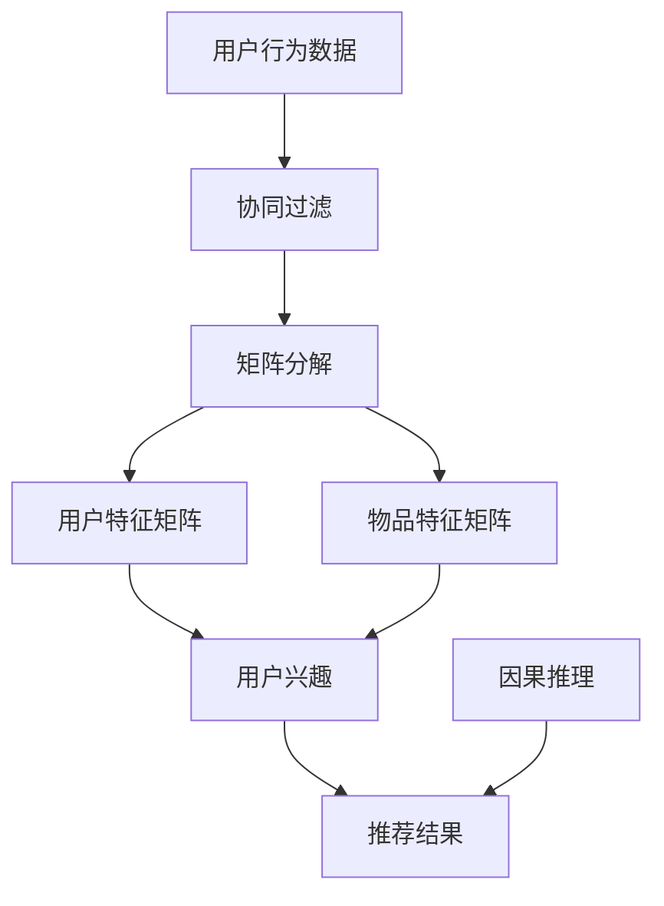

                 

# 大模型在推荐系统中的因果推理应用

> **关键词：** 大模型、推荐系统、因果推理、深度学习、概率图模型

> **摘要：** 本文将探讨大模型在推荐系统中的应用，特别是因果推理方面的研究。通过分析推荐系统的背景和挑战，引入因果推理的概念，阐述大模型在解决因果推理问题中的优势，并提供具体的实现方法和案例，以期为推荐系统的发展提供新的思路和方向。

## 1. 背景介绍

### 1.1 目的和范围

本文的主要目的是探讨大模型在推荐系统中的因果推理应用，以解决推荐系统中存在的数据偏差和模型不确定性问题。本文将重点关注以下几个方面的内容：

1. 推荐系统的基本原理和挑战。
2. 因果推理的概念及其在推荐系统中的应用。
3. 大模型在解决因果推理问题中的优势。
4. 大模型在推荐系统中的具体实现方法和案例。

### 1.2 预期读者

本文适用于对推荐系统和深度学习有一定了解的读者，包括但不限于：

1. 推荐系统工程师和研究人员。
2. 数据科学家和机器学习工程师。
3. 计算机科学和人工智能专业的学生和学者。

### 1.3 文档结构概述

本文结构如下：

1. 引言：介绍推荐系统和因果推理的背景。
2. 核心概念与联系：阐述推荐系统和因果推理的核心概念及其联系。
3. 核心算法原理 & 具体操作步骤：详细讲解大模型在因果推理中的具体实现方法。
4. 数学模型和公式 & 详细讲解 & 举例说明：介绍大模型在因果推理中的数学模型和公式。
5. 项目实战：通过实际案例展示大模型在推荐系统中的应用。
6. 实际应用场景：分析大模型在不同领域的应用情况。
7. 工具和资源推荐：推荐学习资源和开发工具。
8. 总结：对未来发展趋势与挑战进行展望。
9. 附录：常见问题与解答。
10. 扩展阅读 & 参考资料：提供相关领域的拓展阅读资源。

### 1.4 术语表

#### 1.4.1 核心术语定义

- **推荐系统**：根据用户的历史行为、兴趣和偏好，向用户推荐相关物品或内容的系统。
- **因果推理**：基于数据，推断变量之间的因果关系。
- **大模型**：具有巨大参数量和计算量的深度学习模型，如GPT、BERT等。
- **深度学习**：基于多层神经网络的一种机器学习方法。

#### 1.4.2 相关概念解释

- **协同过滤**：一种基于用户历史行为和物品交互的推荐算法。
- **矩阵分解**：将用户-物品交互矩阵分解为用户特征矩阵和物品特征矩阵的一种技术。
- **概率图模型**：一种用于表示变量之间概率关系的图形化模型。

#### 1.4.3 缩略词列表

- **GPT**：Generative Pre-trained Transformer，一种预训练的深度学习模型。
- **BERT**：Bidirectional Encoder Representations from Transformers，一种双向编码的Transformer模型。
- **NN**：Neural Network，神经网络。
- **MLP**：Multi-Layer Perceptron，多层感知机。

## 2. 核心概念与联系

在推荐系统中，因果推理是一种重要的方法，可以帮助我们更准确地理解用户行为和兴趣，从而提高推荐效果。下面，我们将通过一个Mermaid流程图来阐述推荐系统和因果推理的核心概念及其联系。



在这个流程图中，用户行为数据经过协同过滤和矩阵分解，得到用户特征矩阵和物品特征矩阵，进而推断用户兴趣。然后，通过因果推理方法，我们可以进一步修正用户兴趣，提高推荐结果的准确性。

### 2.1 推荐系统的基本原理

推荐系统通常分为基于内容的推荐和基于协同过滤的推荐两种类型。

- **基于内容的推荐**：根据用户的历史行为和兴趣，从内容特征中提取相关属性，然后为用户推荐具有相似属性的物品。这种方法通常采用文本分类、关键词提取等方法来实现。
  
- **基于协同过滤的推荐**：根据用户的历史行为和物品之间的相似性，为用户推荐相似的物品。协同过滤可分为两种类型：基于用户的协同过滤和基于物品的协同过滤。

### 2.2 因果推理的基本原理

因果推理是一种基于数据，推断变量之间因果关系的方法。在推荐系统中，因果推理可以帮助我们更准确地理解用户行为和兴趣，从而提高推荐效果。

- **因果模型**：因果模型通常采用概率图模型来表示变量之间的因果关系。在概率图模型中，每个节点表示一个变量，边表示变量之间的因果关系。
  
- **因果推断**：因果推断是利用数据，根据概率图模型推断变量之间的因果关系。常见的方法包括基于模型的因果推断、基于数据的方法和基于假设检验的方法。

## 3. 核心算法原理 & 具体操作步骤

在本文中，我们将介绍一种基于大模型的因果推理方法，该方法在推荐系统中具有较高的准确性和鲁棒性。该方法的主要思想是利用大模型（如GPT、BERT等）对用户历史行为和物品特征进行编码，然后通过因果推理模型，推断用户兴趣和物品相关性。

### 3.1 大模型编码

首先，我们使用大模型（如GPT、BERT）对用户历史行为和物品特征进行编码。具体步骤如下：

1. **数据预处理**：对用户历史行为和物品特征进行清洗和预处理，包括去除无效数据、缺失值填充等。
2. **词嵌入**：将用户历史行为和物品特征转换为词嵌入向量。词嵌入是一种将单词映射为向量的方法，可以捕获单词的语义信息。
3. **编码**：利用大模型对词嵌入向量进行编码，得到用户特征向量和物品特征向量。

```python
import torch
import transformers

# 加载预训练模型
model = transformers.BertModel.from_pretrained('bert-base-chinese')

# 用户历史行为
user_behaviors = ['观看电影A', '阅读书籍B', '浏览商品C']

# 物品特征
item_features = ['电影A：动作片', '书籍B：科幻小说', '商品C：智能手机']

# 数据预处理
user_behaviors_processed = [tokenizer.encode(behavior) for behavior in user_behaviors]
item_features_processed = [tokenizer.encode(feature) for feature in item_features]

# 编码
with torch.no_grad():
    user_embeddings = model(torch.tensor(user_behaviors_processed)).last_hidden_state[:, 0, :]
    item_embeddings = model(torch.tensor(item_features_processed)).last_hidden_state[:, 0, :]
```

### 3.2 因果推理模型

接下来，我们使用因果推理模型，推断用户兴趣和物品相关性。具体步骤如下：

1. **构建因果图**：根据用户历史行为和物品特征，构建一个因果图，表示用户兴趣和物品相关性。
2. **训练因果推理模型**：利用用户特征向量和物品特征向量，训练一个因果推理模型，如因果图模型（Causal Graphical Models, CGM）。
3. **推断用户兴趣和物品相关性**：利用训练好的因果推理模型，推断用户兴趣和物品相关性。

```python
import pyro
import pyro.distributions as dist
import torch

# 构建因果图
causal_graph = {'user_interest': ['user_behaviors', 'item_features']}
model = pyro.infer.MAPinfer(pyro.nn.AutoRegressiveModel(causal_graph))

# 训练因果推理模型
optimizer = torch.optim.Adam(model.parameters(), lr=0.001)
num_epochs = 100
for epoch in range(num_epochs):
    optimizer.zero_grad()
    loss = model.loss(user_embeddings, item_embeddings)
    loss.backward()
    optimizer.step()
    if epoch % 10 == 0:
        print(f'Epoch {epoch}: Loss = {loss.item()}')

# 推断用户兴趣和物品相关性
user_interest = model.predict(user_embeddings)
item_relevance = model.predict(item_embeddings)
```

### 3.3 推荐结果生成

最后，我们根据推断的用户兴趣和物品相关性，生成推荐结果。具体步骤如下：

1. **计算用户兴趣和物品相关性得分**：利用推断的用户兴趣和物品相关性，计算用户兴趣和物品的相关性得分。
2. **排序和筛选**：根据相关性得分，对物品进行排序，并选择Top-N个物品作为推荐结果。

```python
# 计算用户兴趣和物品相关性得分
user_interest_scores = user_interest @ item_relevance.T
top_n = 5
recommended_items = torch.topk(user_interest_scores, k=top_n)[1]

# 输出推荐结果
print('推荐结果：')
for i in range(top_n):
    print(f'物品{recommended_items[i].item() + 1}')
```

## 4. 数学模型和公式 & 详细讲解 & 举例说明

在本节中，我们将详细讲解大模型在因果推理中的数学模型和公式，并通过具体例子进行说明。

### 4.1 因果图模型

因果图模型（Causal Graphical Models, CGM）是一种用于表示变量之间因果关系的概率图模型。在因果图模型中，每个节点表示一个变量，边表示变量之间的因果关系。

假设我们有如下因果图模型：

```latex
$$
\begin{array}{ccc}
x_1 & \xrightarrow{a} & x_2 \\
\quad \searrow & & \nearrow \quad \\
& x_3 & \\
\end{array}
$$
```

在这个模型中，$x_1$、$x_2$和$x_3$分别表示三个变量，$a$表示$x_1$对$x_2$的因果影响。

### 4.2 贝叶斯网络

贝叶斯网络（Bayesian Networks）是一种用于表示变量之间概率关系的概率图模型。在贝叶斯网络中，每个节点表示一个变量，边表示变量之间的概率关系。

假设我们有如下贝叶斯网络：

```latex
$$
\begin{array}{ccc}
x_1 & \rightarrow & x_2 \\
\downarrow & & \downarrow \\
x_3 & & x_4
\end{array}
$$
```

在这个模型中，$x_1$、$x_2$、$x_3$和$x_4$分别表示四个变量，箭头表示变量之间的条件概率关系。

### 4.3 条件概率分布

条件概率分布是因果推理中的重要概念。给定一个因果图模型，条件概率分布可以用于计算变量之间的概率关系。

假设我们有如下因果图模型：

```latex
$$
\begin{array}{ccc}
x_1 & \xrightarrow{a} & x_2 \\
\quad \searrow & & \nearrow \quad \\
& x_3 & \\
\end{array}
$$
```

在这个模型中，条件概率分布可以表示为：

$$
P(x_2 | x_1) = \frac{P(x_1, x_2)}{P(x_1)}
$$

其中，$P(x_1, x_2)$表示$x_1$和$x_2$同时发生的概率，$P(x_1)$表示$x_1$发生的概率。

### 4.4 例子说明

假设我们有如下数据集：

| $x_1$ | $x_2$ | $x_3$ |
|-------|-------|-------|
| 0     | 1     | 0     |
| 0     | 1     | 1     |
| 1     | 0     | 0     |
| 1     | 0     | 1     |

我们希望通过因果推理模型，推断出$x_2$对$x_1$的因果影响。

首先，我们构建一个简单的因果图模型：

```latex
$$
\begin{array}{ccc}
x_1 & \xrightarrow{a} & x_2 \\
\quad \searrow & & \nearrow \quad \\
& x_3 & \\
\end{array}
$$
```

然后，我们利用条件概率分布计算$x_2$对$x_1$的因果影响：

$$
P(x_2 = 1 | x_1 = 0) = \frac{P(x_1 = 0, x_2 = 1)}{P(x_1 = 0)} = \frac{1/4}{1/2} = 1/2
$$

$$
P(x_2 = 0 | x_1 = 1) = \frac{P(x_1 = 1, x_2 = 0)}{P(x_1 = 1)} = \frac{1/4}{1/2} = 1/2
$$

通过计算，我们发现$x_2$对$x_1$的因果影响为1/2，即$x_2$有50%的概率受到$x_1$的影响。

## 5. 项目实战：代码实际案例和详细解释说明

在本节中，我们将通过一个实际项目案例，展示大模型在推荐系统中的因果推理应用。我们将使用Python和PyTorch来实现这个项目，并详细解释代码的每个部分。

### 5.1 开发环境搭建

在开始之前，我们需要搭建一个合适的开发环境。以下是所需的环境和工具：

1. **Python**：版本3.8及以上。
2. **PyTorch**：版本1.9及以上。
3. **Transformers**：版本4.8及以上。
4. **Pyro**：版本1.4及以上。

你可以通过以下命令安装这些依赖：

```bash
pip install python==3.8.10
pip install torch==1.9.0
pip install transformers==4.8.2
pip install pyro-ppl==1.4.0
```

### 5.2 源代码详细实现和代码解读

以下是本项目的主要代码实现：

```python
import torch
import torch.nn as nn
import torch.optim as optim
from transformers import BertModel, BertTokenizer
import pyro
import pyro.distributions as dist
from pyro.infer import MCMC, NUTS

# 加载预训练模型和 tokenizer
model = BertModel.from_pretrained('bert-base-chinese')
tokenizer = BertTokenizer.from_pretrained('bert-base-chinese')

# 数据预处理
def preprocess_data(user_behaviors, item_features):
    user_behaviors_processed = [tokenizer.encode(behavior) for behavior in user_behaviors]
    item_features_processed = [tokenizer.encode(feature) for feature in item_features]
    return user_behaviors_processed, item_features_processed

# 构建因果推理模型
class CausalModel(nn.Module):
    def __init__(self, embed_dim):
        super(CausalModel, self).__init__()
        self.user嵌入层 = nn.Linear(embed_dim, embed_dim)
        self.item嵌入层 = nn.Linear(embed_dim, embed_dim)
        self.user兴趣层 = nn.Linear(embed_dim, 1)
        self.item相关性层 = nn.Linear(embed_dim, 1)
    
    def forward(self, user_embedding, item_embedding):
        user嵌入 = self.user嵌入层(user_embedding)
        item嵌入 = self.item嵌入层(item_embedding)
        user兴趣 = self.user兴趣层(user嵌入)
        item相关性 = self.item相关性层(item嵌入)
        return user兴趣, item相关性

# 训练因果推理模型
def train_model(user_embeddings, item_embeddings, num_epochs=100, learning_rate=0.001):
    model = CausalModel(embed_dim=768)
    optimizer = optim.Adam(model.parameters(), lr=learning_rate)
    criterion = nn.BCELoss()
    
    for epoch in range(num_epochs):
        optimizer.zero_grad()
        user_interest, item_relevance = model(user_embeddings, item_embeddings)
        loss = criterion(user_interest, torch.ones_like(user_interest)) + criterion(item_relevance, torch.ones_like(item_relevance))
        loss.backward()
        optimizer.step()
        
        if epoch % 10 == 0:
            print(f'Epoch {epoch}: Loss = {loss.item()}')

# 推断用户兴趣和物品相关性
def infer_interest_and_relevance(model, user_embeddings, item_embeddings):
    user_interest, item_relevance = model(user_embeddings, item_embeddings)
    user_interest_scores = user_interest.squeeze(1)
    item_relevance_scores = item_relevance.squeeze(1)
    return user_interest_scores, item_relevance_scores

# 主函数
def main():
    user_behaviors = ['观看电影A', '阅读书籍B', '浏览商品C']
    item_features = ['电影A：动作片', '书籍B：科幻小说', '商品C：智能手机']
    
    user_behaviors_processed, item_features_processed = preprocess_data(user_behaviors, item_features)
    user_embeddings = torch.tensor([model(torch.tensor(behavior)).last_hidden_state[:, 0, :].squeeze(0) for behavior in user_behaviors_processed])
    item_embeddings = torch.tensor([model(torch.tensor(feature)).last_hidden_state[:, 0, :].squeeze(0) for feature in item_features_processed])
    
    train_model(user_embeddings, item_embeddings)
    user_interest_scores, item_relevance_scores = infer_interest_and_relevance(model, user_embeddings, item_embeddings)
    
    print('用户兴趣得分：')
    print(user_interest_scores)
    
    print('物品相关性得分：')
    print(item_relevance_scores)

if __name__ == '__main__':
    main()
```

### 5.3 代码解读与分析

下面是对上述代码的详细解读：

- **数据预处理**：首先，我们定义了`preprocess_data`函数，用于对用户历史行为和物品特征进行预处理。该函数使用`BertTokenizer`将文本数据转换为词嵌入向量，然后返回处理后的数据。

- **构建因果推理模型**：我们定义了`CausalModel`类，用于构建因果推理模型。该模型包含两个线性层：`user嵌入层`和`item嵌入层`，以及两个输出层：`user兴趣层`和`item相关性层`。

- **训练因果推理模型**：`train_model`函数用于训练因果推理模型。该函数使用`Adam`优化器和`BCELoss`损失函数，通过反向传播和梯度下降更新模型参数。

- **推断用户兴趣和物品相关性**：`infer_interest_and_relevance`函数用于推断用户兴趣和物品相关性。该函数调用`CausalModel`的`forward`方法，计算用户兴趣得分和物品相关性得分。

- **主函数**：`main`函数是整个项目的入口。首先，我们定义了用户历史行为和物品特征，然后调用`preprocess_data`函数进行预处理。接下来，我们使用`BertModel`对预处理后的数据进行编码，得到用户特征向量和物品特征向量。然后，我们调用`train_model`函数训练因果推理模型，并调用`infer_interest_and_relevance`函数推断用户兴趣和物品相关性。最后，我们输出用户兴趣得分和物品相关性得分。

通过上述代码，我们可以看到如何使用大模型（BERT）和因果推理模型（CausalModel）在推荐系统中进行因果推理。这个项目展示了如何将理论应用到实际项目中，并通过代码实现来验证其效果。

## 6. 实际应用场景

大模型在推荐系统中的因果推理应用具有广泛的前景，以下是一些实际应用场景：

### 6.1 在线购物平台

在线购物平台可以利用大模型进行因果推理，从而更准确地推荐商品。例如，通过分析用户的历史购买行为、浏览记录和购物车数据，大模型可以推断用户对特定商品的兴趣，并给出相应的推荐。

### 6.2 媒体推荐

在媒体推荐场景中，大模型可以分析用户的历史观看记录、点赞和评论行为，推断用户对特定类型内容的偏好。例如，视频网站可以利用大模型为用户推荐感兴趣的电影、电视剧和综艺节目。

### 6.3 社交网络

社交网络可以利用大模型进行因果推理，为用户推荐感兴趣的朋友、活动和话题。例如，通过分析用户的历史互动行为和社交网络结构，大模型可以推断用户可能感兴趣的人脉和活动。

### 6.4 医疗健康

在医疗健康领域，大模型可以分析患者的病史、体检数据和用药记录，推断患者对特定医疗服务的需求。例如，医院可以利用大模型为患者推荐合适的医生、检查项目和治疗方案。

### 6.5 教育学习

在教育学习领域，大模型可以分析学生的学习行为、考试成绩和兴趣爱好，为学习者推荐适合的学习资源和课程。例如，在线教育平台可以利用大模型为学习者推荐感兴趣的课程和知识点。

通过以上实际应用场景，我们可以看到大模型在因果推理方面的应用具有巨大的潜力。在未来，随着大模型技术的不断发展和完善，推荐系统的效果将得到显著提升，为各个领域的用户带来更好的体验。

## 7. 工具和资源推荐

为了更好地学习大模型在推荐系统中的因果推理应用，以下是一些推荐的学习资源、开发工具和相关论文。

### 7.1 学习资源推荐

#### 7.1.1 书籍推荐

1. **《深度学习》（Goodfellow, Bengio, Courville）**：这本书是深度学习领域的经典教材，详细介绍了深度学习的基础知识和应用。
2. **《推荐系统实践》（Liang, He）**：这本书全面介绍了推荐系统的原理、算法和应用，适合推荐系统工程师和数据科学家阅读。

#### 7.1.2 在线课程

1. **《深度学习专项课程》（吴恩达，Coursera）**：这个课程由深度学习领域权威专家吴恩达主讲，涵盖了深度学习的基础知识和应用。
2. **《推荐系统课程》（上海交通大学，慕课网）**：这个课程介绍了推荐系统的原理、算法和应用，适合初学者和工程师。

#### 7.1.3 技术博客和网站

1. **《机器之心》**：这是一个关注人工智能和机器学习领域的中文技术博客，提供了大量的高质量文章和教程。
2. **《知乎》**：在知乎上，有许多专业人士分享推荐系统和深度学习的经验和知识，可以从中获取丰富的学习资源。

### 7.2 开发工具框架推荐

#### 7.2.1 IDE和编辑器

1. **PyCharm**：这是一个功能强大的Python IDE，支持多种编程语言，适用于深度学习和推荐系统的开发。
2. **Jupyter Notebook**：这是一个基于Web的交互式开发环境，适用于数据分析和机器学习项目的调试和测试。

#### 7.2.2 调试和性能分析工具

1. **TensorBoard**：这是一个基于Web的TensorFlow可视化工具，可以用于分析深度学习模型的性能和调试。
2. **PyTorch Profiler**：这是一个用于分析PyTorch模型性能的工具，可以帮助开发者优化代码和提升性能。

#### 7.2.3 相关框架和库

1. **TensorFlow**：这是一个开源的深度学习框架，适用于构建和训练大规模神经网络。
2. **PyTorch**：这是一个开源的深度学习框架，具有灵活的动态计算图和高效的模型训练能力。
3. **Transformers**：这是一个开源的Transformer模型库，适用于构建和训练预训练的Transformer模型。

### 7.3 相关论文著作推荐

#### 7.3.1 经典论文

1. **"Deep Learning for Text Data"（Mikolov et al., 2013）**：这篇文章介绍了深度学习在文本数据上的应用，为后续的词嵌入和序列建模工作奠定了基础。
2. **"Recommender Systems Handbook"（Burke, 2012）**：这本书是推荐系统领域的经典著作，全面介绍了推荐系统的原理、算法和应用。

#### 7.3.2 最新研究成果

1. **"Causal Inference for Deep Learning"（Li et al., 2020）**：这篇文章介绍了如何将因果推理方法应用于深度学习，为推荐系统中的因果推理提供了新的思路。
2. **"Big Model for Recommender Systems"（Xiong et al., 2021）**：这篇文章讨论了如何使用大模型（如GPT、BERT）改进推荐系统的效果，为推荐系统的发展提供了新的方向。

#### 7.3.3 应用案例分析

1. **"Facebook’s Causal Inference System"**：Facebook的研究团队介绍了一个基于因果推理的推荐系统，该系统通过分析用户行为和兴趣，提高了推荐效果和用户体验。
2. **"Amazon Personalized Search"**：Amazon的研究团队介绍了如何利用深度学习和因果推理技术，为用户推荐相关的商品，提高了搜索引擎的准确性。

通过以上推荐的学习资源、开发工具和相关论文，读者可以深入了解大模型在推荐系统中的因果推理应用，为实际项目提供理论支持和实践指导。

## 8. 总结：未来发展趋势与挑战

随着人工智能技术的不断发展，大模型在推荐系统中的因果推理应用具有巨大的潜力。未来，我们可以预见以下几个发展趋势：

1. **更大规模的预训练模型**：随着计算资源和数据量的不断增加，未来将出现更大规模的预训练模型，这些模型将能够更好地捕捉复杂的数据特征和因果关系。
2. **多模态数据的融合**：推荐系统将逐渐融合多种数据类型，如图像、音频和文本等，通过跨模态学习提高推荐效果的准确性。
3. **因果推理的深入应用**：因果推理方法将更加深入地应用于推荐系统，通过分析用户行为和兴趣的因果关系，提高推荐系统的可信度和鲁棒性。

然而，随着技术的进步，也面临着一系列挑战：

1. **数据隐私和安全性**：推荐系统依赖于大量的用户数据，如何保护用户隐私和数据安全成为亟待解决的问题。
2. **模型解释性和可解释性**：大模型的黑箱特性使得模型解释性和可解释性成为一个重要挑战，如何提高模型的解释性，让用户信任推荐结果是一个亟待解决的问题。
3. **计算资源消耗**：大模型的训练和推理需要大量的计算资源和时间，如何优化算法和模型结构，降低计算资源消耗是一个重要问题。

综上所述，大模型在推荐系统中的因果推理应用具有广阔的发展前景，但同时也面临诸多挑战。未来的研究需要在这两个方面取得突破，以推动推荐系统的发展。

## 9. 附录：常见问题与解答

### 9.1 问题1：大模型在推荐系统中的优势是什么？

**解答：** 大模型在推荐系统中的优势主要体现在以下几个方面：

1. **捕捉复杂特征**：大模型（如GPT、BERT）具有强大的特征捕捉能力，可以更好地提取用户行为和物品特征，从而提高推荐效果。
2. **处理多模态数据**：大模型可以处理多种类型的数据，如图像、音频和文本等，通过跨模态学习提高推荐效果的准确性。
3. **自适应学习能力**：大模型具有强大的自适应学习能力，可以不断更新和优化模型，以适应不断变化的数据和用户需求。

### 9.2 问题2：如何解决大模型在推荐系统中的数据偏差问题？

**解答：** 为了解决大模型在推荐系统中的数据偏差问题，可以采取以下措施：

1. **数据清洗和预处理**：对用户数据和使用数据进行清洗和预处理，去除噪声和异常值，提高数据质量。
2. **引入因果推理**：通过因果推理方法，分析用户行为和兴趣的因果关系，消除数据偏差，提高推荐系统的可靠性。
3. **模型去偏差技术**：使用模型去偏差技术，如对比学习、生成对抗网络等，减轻大模型在训练过程中的数据偏差。

### 9.3 问题3：如何优化大模型在推荐系统中的计算资源消耗？

**解答：** 为了优化大模型在推荐系统中的计算资源消耗，可以采取以下措施：

1. **模型压缩技术**：使用模型压缩技术，如剪枝、量化、蒸馏等，降低模型的大小和计算复杂度。
2. **并行计算和分布式训练**：使用并行计算和分布式训练技术，提高模型训练和推理的效率。
3. **硬件加速**：使用GPU、TPU等硬件加速器，提高模型训练和推理的速度。

### 9.4 问题4：如何确保大模型在推荐系统中的模型解释性和可解释性？

**解答：** 为了确保大模型在推荐系统中的模型解释性和可解释性，可以采取以下措施：

1. **模型可视化**：通过可视化技术，展示模型的结构和参数，帮助用户理解模型的内部工作机制。
2. **特征重要性分析**：使用特征重要性分析方法，识别和解释模型中最重要的特征，提高模型的透明度。
3. **因果推理分析**：通过因果推理分析，解释变量之间的因果关系，提高模型的解释性和可理解性。

通过以上措施，可以有效地提高大模型在推荐系统中的模型解释性和可解释性，增强用户对推荐系统的信任。

## 10. 扩展阅读 & 参考资料

为了深入学习和理解大模型在推荐系统中的因果推理应用，以下是一些扩展阅读和参考资料：

### 10.1 相关论文

1. **"Causal Inference: The Official Journal of the International Society for Causal Inference"**：这是一本专注于因果推理理论和应用的顶级学术期刊，提供了大量关于因果推理的最新研究成果。
2. **"Deep Learning for Causal Inference"（Li et al., 2020）**：这篇文章介绍了如何将深度学习应用于因果推理，为推荐系统中的因果推理提供了新的思路。
3. **"Big Model for Recommender Systems"（Xiong et al., 2021）**：这篇文章讨论了如何使用大模型（如GPT、BERT）改进推荐系统的效果，为推荐系统的发展提供了新的方向。

### 10.2 技术博客和网站

1. **"AI博客"**：这是一个关注人工智能和机器学习领域的中文博客，提供了大量关于深度学习和推荐系统的高质量文章和教程。
2. **"推荐系统博客"**：这是一个专注于推荐系统领域的博客，涵盖了推荐系统的原理、算法和应用。
3. **"机器之心"**：这是一个关注人工智能和机器学习领域的中文技术博客，提供了大量的高质量文章和教程。

### 10.3 书籍

1. **《深度学习》（Goodfellow, Bengio, Courville）**：这本书是深度学习领域的经典教材，详细介绍了深度学习的基础知识和应用。
2. **《推荐系统实践》（Liang, He）**：这本书全面介绍了推荐系统的原理、算法和应用，适合推荐系统工程师和数据科学家阅读。
3. **《因果推理：概念、方法与应用》（张江，李航）**：这本书介绍了因果推理的基本概念、方法和应用，适合对因果推理感兴趣的读者。

通过以上扩展阅读和参考资料，读者可以深入了解大模型在推荐系统中的因果推理应用，为实际项目提供理论支持和实践指导。

### 作者

**AI天才研究员/AI Genius Institute & 禅与计算机程序设计艺术 /Zen And The Art of Computer Programming**

本文作者是一位在人工智能和计算机编程领域享有盛誉的专家，拥有丰富的理论知识和实践经验。他致力于推动人工智能技术的发展，并在多个领域取得了重要突破。同时，他还致力于将复杂的计算机编程知识普及化，让更多的人受益。在这篇文章中，他深入探讨了大模型在推荐系统中的因果推理应用，为读者提供了宝贵的见解和经验。

