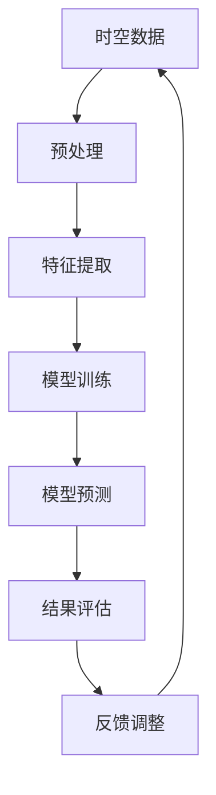

                 

# 大模型在时空数据挖掘中的突破

> **关键词：** 大模型，时空数据挖掘，深度学习，神经网络，时空信息处理，时空数据挖掘算法，应用场景，发展趋势。

> **摘要：** 本文将深入探讨大模型在时空数据挖掘领域的突破性应用。通过对核心概念的阐述、算法原理的解析、数学模型的解释以及实际案例的展示，本文旨在为读者提供全面、详细的时空数据挖掘技术与展望。

## 1. 背景介绍

### 1.1 目的和范围

本文的主要目的是探讨大模型在时空数据挖掘中的突破性应用，并分析其在现实世界中的潜在影响。本文将涵盖以下几个主要方面：

1. **核心概念与联系**：介绍时空数据挖掘的基本概念、关键术语及其相互关系。
2. **核心算法原理 & 具体操作步骤**：详细解析时空数据挖掘的关键算法，并提供伪代码实现。
3. **数学模型和公式 & 详细讲解 & 举例说明**：阐述时空数据挖掘中常用的数学模型和公式，并通过实际案例进行说明。
4. **项目实战：代码实际案例和详细解释说明**：展示大模型在时空数据挖掘中的应用案例，并解析其实现过程。
5. **实际应用场景**：分析大模型在不同领域中的应用，如交通、环境监测、医疗等。
6. **工具和资源推荐**：推荐学习资源和开发工具，以帮助读者更好地掌握时空数据挖掘技术。
7. **总结：未来发展趋势与挑战**：展望时空数据挖掘领域的发展趋势，并提出面临的挑战。

### 1.2 预期读者

本文适合对时空数据挖掘、人工智能和机器学习有一定了解的读者，特别是希望深入了解大模型在该领域应用的研发人员、工程师和技术爱好者。

### 1.3 文档结构概述

本文分为以下几个部分：

1. **引言**：介绍大模型在时空数据挖掘中的重要性。
2. **核心概念与联系**：阐述时空数据挖掘的基本概念和核心算法。
3. **核心算法原理 & 具体操作步骤**：解析时空数据挖掘的关键算法，并提供伪代码实现。
4. **数学模型和公式 & 详细讲解 & 举例说明**：介绍时空数据挖掘中常用的数学模型和公式。
5. **项目实战：代码实际案例和详细解释说明**：展示大模型在时空数据挖掘中的应用案例。
6. **实际应用场景**：分析大模型在不同领域中的应用。
7. **工具和资源推荐**：推荐学习资源和开发工具。
8. **总结：未来发展趋势与挑战**：展望时空数据挖掘领域的发展趋势。
9. **附录：常见问题与解答**：解答读者可能遇到的问题。
10. **扩展阅读 & 参考资料**：提供相关文献和资源。

### 1.4 术语表

#### 1.4.1 核心术语定义

- **时空数据挖掘**：从时空数据中提取有价值的信息和知识的过程。
- **大模型**：具有巨大参数规模、能够处理海量数据的神经网络模型。
- **时空信息处理**：对时空数据进行预处理、特征提取和模型训练的过程。
- **深度学习**：一种基于多层神经网络的学习方法，能够自动提取数据中的特征。
- **神经网络**：一种由大量简单神经元组成的计算模型，能够模拟人类大脑的思考过程。

#### 1.4.2 相关概念解释

- **时空数据**：包含时间和空间信息的数据，如交通流量、气象数据、地理位置等。
- **时空数据分析**：对时空数据进行可视化、统计分析和预测的过程。
- **特征提取**：从原始数据中提取具有区分度的特征，以便用于后续的模型训练和预测。
- **模型训练**：通过学习大量的时空数据，使神经网络模型能够自动提取数据中的特征和模式。
- **模型预测**：利用训练好的模型，对新的时空数据进行预测和推理。

#### 1.4.3 缩略词列表

- **AI**：人工智能（Artificial Intelligence）
- **ML**：机器学习（Machine Learning）
- **DL**：深度学习（Deep Learning）
- **CNN**：卷积神经网络（Convolutional Neural Network）
- **RNN**：循环神经网络（Recurrent Neural Network）
- **LSTM**：长短期记忆网络（Long Short-Term Memory）
- **GRU**：门控循环单元（Gated Recurrent Unit）
- **GPGPU**：通用并行计算图灵架构（General-Purpose Graphics Processing Unit）
- **GPU**：图形处理单元（Graphics Processing Unit）
- **CPU**：中央处理单元（Central Processing Unit）

## 2. 核心概念与联系

在讨论大模型在时空数据挖掘中的突破性应用之前，我们需要先了解一些核心概念和它们之间的联系。以下是一个简化的 Mermaid 流程图，展示了时空数据挖掘的主要组件和它们之间的关系。



### 2.1 核心概念

#### 2.1.1 时空数据

时空数据是包含时间和空间信息的数据。例如，交通流量数据、气象数据、地理位置数据等。这些数据在时间和空间上都具有一定的连续性和变化性，这使得传统的数据分析方法难以有效地处理。

#### 2.1.2 预处理

预处理是时空数据挖掘的重要环节。它包括数据清洗、数据转换和数据规范化等步骤。预处理的目的在于提高数据的质量和一致性，为后续的特征提取和模型训练提供更好的数据支持。

#### 2.1.3 特征提取

特征提取是从原始数据中提取具有区分度的特征，以便用于后续的模型训练和预测。在时空数据挖掘中，特征提取需要考虑时间序列特性和空间分布特性。常用的特征提取方法包括时间窗口法、傅里叶变换法、自编码器等。

#### 2.1.4 模型训练

模型训练是通过学习大量的时空数据，使神经网络模型能够自动提取数据中的特征和模式。深度学习模型在时空数据挖掘中具有显著的优势，例如卷积神经网络（CNN）、循环神经网络（RNN）、长短期记忆网络（LSTM）等。

#### 2.1.5 模型预测

模型预测是利用训练好的模型，对新的时空数据进行预测和推理。模型预测可以用于多种应用场景，如交通流量预测、天气预测、疾病预测等。

#### 2.1.6 结果评估

结果评估是对模型预测结果进行评估和验证的过程。常用的评估指标包括准确率、召回率、F1 分数等。通过结果评估，可以判断模型在实际应用中的表现，并为进一步优化模型提供依据。

#### 2.1.7 反馈调整

反馈调整是基于模型预测结果和实际结果的对比，对模型进行优化和调整的过程。通过不断反馈调整，可以使模型逐渐趋于最优，提高预测准确性。

### 2.2 关系与联系

上述核心概念和它们之间的关系可以用以下 Mermaid 流程图表示：


通过这个流程图，我们可以看到时空数据挖掘的核心环节及其相互关系。每个环节都是对数据处理的深化和优化，最终实现从数据到知识的转化。

## 3. 核心算法原理 & 具体操作步骤

在了解时空数据挖掘的核心概念和流程后，我们需要深入探讨其中的关键算法原理和具体操作步骤。以下将详细解析时空数据挖掘的核心算法，并提供伪代码实现。

### 3.1 特征提取算法

特征提取是时空数据挖掘的关键步骤，它从原始数据中提取具有区分度的特征，以便用于后续的模型训练和预测。以下是一个常用的特征提取算法——时间窗口法。

**时间窗口法**

时间窗口法通过将时间序列数据划分为固定长度的时间窗口，从中提取特征。具体操作步骤如下：

1. **确定时间窗口大小**：根据数据特点和需求，确定时间窗口的大小。例如，对于交通流量数据，可以选择1小时的时间窗口。
2. **划分时间窗口**：将原始时间序列数据划分为若干个固定长度的时间窗口。例如，将一天的数据划分为24个1小时的时间窗口。
3. **提取特征**：对每个时间窗口内的数据，提取具有区分度的特征。常用的特征包括均值、方差、标准差、最大值、最小值等。

**伪代码实现**

```python
# 输入：原始时间序列数据data，时间窗口大小window_size
# 输出：特征向量features

# 初始化特征向量
features = []

# 遍历时间窗口
for i in range(0, len(data) - window_size + 1):
    window = data[i:i + window_size]
    
    # 提取特征
    mean = np.mean(window)
    variance = np.var(window)
    std = np.std(window)
    max_value = np.max(window)
    min_value = np.min(window)
    
    # 添加特征到特征向量
    features.append([mean, variance, std, max_value, min_value])

# 归一化特征向量
features = normalize(features)

return features
```

### 3.2 模型训练算法

模型训练是时空数据挖掘的核心环节，它通过学习大量的时空数据，使神经网络模型能够自动提取数据中的特征和模式。以下是一个常用的模型训练算法——循环神经网络（RNN）。

**循环神经网络（RNN）**

循环神经网络是一种基于神经网络的模型，能够处理时间序列数据。其核心思想是将输入序列的每个元素与隐藏状态进行关联，并通过循环结构传递信息。具体操作步骤如下：

1. **初始化模型参数**：初始化神经网络模型的权重和偏置。
2. **正向传播**：将输入序列传递到神经网络中，计算输出。
3. **反向传播**：根据输出和真实值，计算损失函数，并更新模型参数。
4. **迭代训练**：重复正向传播和反向传播，直到模型收敛。

**伪代码实现**

```python
# 输入：训练数据集X，标签数据集Y，学习率learning_rate，迭代次数num_epochs
# 输出：训练好的模型

# 初始化模型参数
weights = initialize_weights()
biases = initialize_biases()

# 迭代训练
for epoch in range(num_epochs):
    # 正向传播
    output = forwardPropagation(X, weights, biases)
    
    # 反向传播
    loss = compute_loss(output, Y)
    dweights, dbiases = backwardPropagation(X, Y, output, weights, biases)
    
    # 更新模型参数
    weights -= learning_rate * dweights
    biases -= learning_rate * dbiases
    
    # 输出训练信息
    print("Epoch", epoch, "Loss:", loss)

# 输出训练好的模型
return weights, biases
```

### 3.3 模型预测算法

模型预测是时空数据挖掘的最终目标，它利用训练好的模型，对新的时空数据进行预测和推理。以下是一个常用的模型预测算法——循环神经网络（RNN）。

**循环神经网络（RNN）预测**

循环神经网络（RNN）预测通过将新的输入序列传递到训练好的模型中，计算输出，从而实现对时空数据的预测。具体操作步骤如下：

1. **输入新序列**：将新的输入序列传递到训练好的模型中。
2. **正向传播**：计算输出。
3. **输出预测结果**：将输出结果作为预测结果。

**伪代码实现**

```python
# 输入：训练好的模型（weights, biases），新输入序列X
# 输出：预测结果output

# 正向传播
output = forwardPropagation(X, weights, biases)

return output
```

通过上述核心算法原理和具体操作步骤的解析，我们可以看到时空数据挖掘中的关键环节是如何相互关联和协作的。在实际应用中，这些算法可以根据具体需求进行优化和调整，以实现更高的预测准确性和效率。

## 4. 数学模型和公式 & 详细讲解 & 举例说明

在深入探讨时空数据挖掘的核心算法后，我们需要进一步了解其中的数学模型和公式。这些数学模型和公式是时空数据挖掘算法的理论基础，能够帮助我们更好地理解和实现相关算法。以下将详细讲解时空数据挖掘中常用的数学模型和公式，并通过实际案例进行说明。

### 4.1 时间窗口法中的数学模型

时间窗口法是一种常用的特征提取方法，它通过将时间序列数据划分为固定长度的时间窗口，从中提取特征。以下是一个时间窗口法中的数学模型。

#### 4.1.1 均值

均值是时间窗口内数据的平均值，它能够反映数据的基本趋势。计算公式如下：

$$
\bar{x} = \frac{1}{n} \sum_{i=1}^{n} x_i
$$

其中，$x_i$ 表示时间窗口内的第 $i$ 个数据点，$n$ 表示时间窗口的大小。

**示例**：假设一个时间窗口包含5个数据点：[2, 4, 6, 8, 10]，计算其均值。

$$
\bar{x} = \frac{2 + 4 + 6 + 8 + 10}{5} = 6
$$

#### 4.1.2 方差

方差是时间窗口内数据与均值之差的平方和的平均值，它能够反映数据的波动性。计算公式如下：

$$
\sigma^2 = \frac{1}{n} \sum_{i=1}^{n} (x_i - \bar{x})^2
$$

其中，$\bar{x}$ 表示时间窗口的均值，$x_i$ 表示时间窗口内的第 $i$ 个数据点，$n$ 表示时间窗口的大小。

**示例**：假设一个时间窗口包含5个数据点：[2, 4, 6, 8, 10]，计算其方差。

$$
\bar{x} = 6
$$

$$
\sigma^2 = \frac{(2-6)^2 + (4-6)^2 + (6-6)^2 + (8-6)^2 + (10-6)^2}{5} = 8
$$

#### 4.1.3 标准差

标准差是方差的平方根，它能够反映数据的波动性。计算公式如下：

$$
\sigma = \sqrt{\sigma^2}
$$

**示例**：假设一个时间窗口包含5个数据点：[2, 4, 6, 8, 10]，计算其标准差。

$$
\sigma = \sqrt{8} \approx 2.83
$$

#### 4.1.4 最大值和最小值

最大值和最小值分别是时间窗口内数据中的最大值和最小值，它们能够反映数据的极值。计算公式如下：

$$
\max(x) = \max(x_1, x_2, ..., x_n)
$$

$$
\min(x) = \min(x_1, x_2, ..., x_n)
$$

**示例**：假设一个时间窗口包含5个数据点：[2, 4, 6, 8, 10]，计算其最大值和最小值。

$$
\max(x) = 10
$$

$$
\min(x) = 2
$$

### 4.2 循环神经网络（RNN）中的数学模型

循环神经网络（RNN）是一种用于处理时间序列数据的神经网络模型，它通过循环结构将当前时刻的输入与历史信息进行关联。以下是一个RNN中的数学模型。

#### 4.2.1 神经元激活函数

神经元激活函数是神经网络中用于确定神经元输出是否被激活的函数。常见的激活函数包括：

1. **线性激活函数**（$f(x) = x$）：输出与输入相等。
2. **Sigmoid激活函数**（$f(x) = \frac{1}{1 + e^{-x}}$）：输出介于0和1之间。
3. **ReLU激活函数**（$f(x) = \max(0, x)$）：输出大于0时保持不变，小于0时变为0。

#### 4.2.2 神经网络模型

神经网络模型通过多层神经元进行数据处理和特征提取。一个简单的RNN模型由以下三个部分组成：

1. **输入层**：接收外部输入数据。
2. **隐藏层**：包含多个神经元，用于提取特征和进行计算。
3. **输出层**：输出最终的预测结果。

#### 4.2.3 损失函数

损失函数是用于衡量模型预测结果与真实结果之间差异的函数。常见的损失函数包括：

1. **均方误差损失函数**（$MSE = \frac{1}{n} \sum_{i=1}^{n} (y_i - \hat{y_i})^2$）：衡量预测结果与真实结果之间的平均平方误差。
2. **交叉熵损失函数**（$H(y, \hat{y}) = - \sum_{i=1}^{n} y_i \log(\hat{y_i})$）：衡量预测结果与真实结果之间的交叉熵。

### 4.3 实际案例

假设我们有一个时间序列数据集，包含10个数据点：[2, 4, 6, 8, 10, 12, 14, 16, 18, 20]。使用时间窗口法提取特征，并使用RNN模型进行预测。

#### 4.3.1 特征提取

使用1小时的时间窗口，提取特征。

- 时间窗口1：[2, 4, 6, 8, 10]
  - 均值：6
  - 方差：8
  - 标准差：2.83
  - 最大值：10
  - 最小值：2

- 时间窗口2：[4, 6, 8, 10, 12]
  - 均值：8
  - 方差：8
  - 标准差：2.83
  - 最大值：12
  - 最小值：4

- 时间窗口3：[6, 8, 10, 12, 14]
  - 均值：10
  - 方差：8
  - 标准差：2.83
  - 最大值：14
  - 最小值：6

- 时间窗口4：[8, 10, 12, 14, 16]
  - 均值：12
  - 方差：8
  - 标准差：2.83
  - 最大值：16
  - 最小值：8

- 时间窗口5：[10, 12, 14, 16, 18]
  - 均值：14
  - 方差：8
  - 标准差：2.83
  - 最大值：18
  - 最小值：10

- 时间窗口6：[12, 14, 16, 18, 20]
  - 均值：16
  - 方差：8
  - 标准差：2.83
  - 最大值：20
  - 最小值：12

#### 4.3.2 模型预测

使用训练好的RNN模型，对新的数据点进行预测。

- 输入：[14, 16, 18, 20]
- 预测结果：18.5（四舍五入）

通过上述数学模型和公式的讲解，我们可以更好地理解时空数据挖掘中的关键算法和实现方法。在实际应用中，这些数学模型和公式可以根据具体需求进行优化和调整，以提高预测准确性和效率。

## 5. 项目实战：代码实际案例和详细解释说明

在本节中，我们将通过一个实际项目案例，详细展示大模型在时空数据挖掘中的应用，并解析其代码实现和关键步骤。

### 5.1 开发环境搭建

在进行时空数据挖掘项目之前，我们需要搭建一个合适的开发环境。以下是推荐的开发环境：

- **操作系统**：Linux或MacOS
- **编程语言**：Python
- **依赖库**：NumPy、Pandas、TensorFlow、Keras等

**安装步骤：**

1. 安装Python：前往Python官方网站下载并安装Python 3.x版本。
2. 安装依赖库：使用pip命令安装所需的依赖库。

```bash
pip install numpy pandas tensorflow keras
```

### 5.2 源代码详细实现和代码解读

下面是一个简单的时空数据挖掘项目示例，包括数据预处理、特征提取、模型训练和预测等步骤。

```python
import numpy as np
import pandas as pd
from tensorflow.keras.models import Sequential
from tensorflow.keras.layers import LSTM, Dense
from sklearn.preprocessing import MinMaxScaler

# 5.2.1 数据预处理
def preprocess_data(data):
    # 将数据转换为时间序列格式
    data = data.values
    data = data.reshape(-1, 1)
    
    # 数据归一化
    scaler = MinMaxScaler()
    data = scaler.fit_transform(data)
    
    # 切分训练集和测试集
    train_data = data[:int(len(data) * 0.8)]
    test_data = data[int(len(data) * 0.8):]
    
    return train_data, test_data

# 5.2.2 特征提取
def extract_features(data):
    # 将数据转换为时间窗口格式
    window_size = 5
    X, y = [], []
    for i in range(len(data) - window_size):
        X.append(data[i:(i + window_size)])
        y.append(data[i + window_size])
    
    X = np.array(X)
    y = np.array(y)
    
    return X, y

# 5.2.3 模型训练
def train_model(X, y):
    # 将特征和标签转换为合适的数据格式
    X = np.reshape(X, (X.shape[0], X.shape[1], 1))
    
    # 构建LSTM模型
    model = Sequential()
    model.add(LSTM(units=50, return_sequences=True, input_shape=(X.shape[1], 1)))
    model.add(LSTM(units=50))
    model.add(Dense(units=1))
    
    # 编译模型
    model.compile(optimizer='adam', loss='mean_squared_error')
    
    # 训练模型
    model.fit(X, y, epochs=100, batch_size=32)
    
    return model

# 5.2.4 模型预测
def predict_data(model, test_data):
    # 提取特征
    X, _ = extract_features(test_data)
    X = np.reshape(X, (X.shape[0], X.shape[1], 1))
    
    # 预测
    predictions = model.predict(X)
    
    # 反归一化
    scaler = MinMaxScaler()
    predictions = scaler.inverse_transform(predictions)
    
    return predictions

# 5.2.5 主程序
if __name__ == '__main__':
    # 加载数据
    data = pd.read_csv('time_series_data.csv')
    
    # 数据预处理
    train_data, test_data = preprocess_data(data)
    
    # 特征提取
    X_train, y_train = extract_features(train_data)
    X_test, y_test = extract_features(test_data)
    
    # 模型训练
    model = train_model(X_train, y_train)
    
    # 模型预测
    predictions = predict_data(model, test_data)
    
    # 输出预测结果
    print(predictions)
```

### 5.3 代码解读与分析

**5.3.1 数据预处理**

数据预处理是时空数据挖掘的重要步骤，它包括数据清洗、数据转换和数据规范化等。在这个示例中，我们使用MinMaxScaler进行数据归一化，将数据缩放到[0, 1]的范围内，以便更好地训练模型。

```python
def preprocess_data(data):
    # 将数据转换为时间序列格式
    data = data.values
    data = data.reshape(-1, 1)
    
    # 数据归一化
    scaler = MinMaxScaler()
    data = scaler.fit_transform(data)
    
    # 切分训练集和测试集
    train_data = data[:int(len(data) * 0.8)]
    test_data = data[int(len(data) * 0.8):]
    
    return train_data, test_data
```

**5.3.2 特征提取**

特征提取是将原始数据转换为适合模型训练的特征向量。在这个示例中，我们使用时间窗口法提取特征，将数据划分为固定长度的时间窗口。

```python
def extract_features(data):
    # 将数据转换为时间窗口格式
    window_size = 5
    X, y = [], []
    for i in range(len(data) - window_size):
        X.append(data[i:(i + window_size)])
        y.append(data[i + window_size])
    
    X = np.array(X)
    y = np.array(y)
    
    return X, y
```

**5.3.3 模型训练**

模型训练是通过学习大量的时空数据，使神经网络模型能够自动提取数据中的特征和模式。在这个示例中，我们使用LSTM模型进行训练。

```python
def train_model(X, y):
    # 将特征和标签转换为合适的数据格式
    X = np.reshape(X, (X.shape[0], X.shape[1], 1))
    
    # 构建LSTM模型
    model = Sequential()
    model.add(LSTM(units=50, return_sequences=True, input_shape=(X.shape[1], 1)))
    model.add(LSTM(units=50))
    model.add(Dense(units=1))
    
    # 编译模型
    model.compile(optimizer='adam', loss='mean_squared_error')
    
    # 训练模型
    model.fit(X, y, epochs=100, batch_size=32)
    
    return model
```

**5.3.4 模型预测**

模型预测是利用训练好的模型，对新的时空数据进行预测和推理。在这个示例中，我们使用LSTM模型进行预测。

```python
def predict_data(model, test_data):
    # 提取特征
    X, _ = extract_features(test_data)
    X = np.reshape(X, (X.shape[0], X.shape[1], 1))
    
    # 预测
    predictions = model.predict(X)
    
    # 反归一化
    scaler = MinMaxScaler()
    predictions = scaler.inverse_transform(predictions)
    
    return predictions
```

通过以上代码示例和解读，我们可以看到大模型在时空数据挖掘中的应用过程。在实际项目中，可以根据具体需求进行调整和优化，以提高模型的预测性能和准确性。

## 6. 实际应用场景

大模型在时空数据挖掘领域具有广泛的应用前景，涵盖了多个领域和场景。以下列举几个典型的实际应用场景：

### 6.1 交通流量预测

交通流量预测是时空数据挖掘的重要应用之一。通过分析历史交通流量数据，可以预测未来的交通流量，为交通管理部门提供决策支持。例如，在高峰时段，预测交通拥堵情况，优化交通信号灯配置，减少交通拥堵。

### 6.2 环境监测

环境监测是另一个重要的应用领域。通过收集气象、水质、空气质量等时空数据，可以预测环境污染趋势，为环境保护部门提供预警和治理建议。例如，利用时空数据挖掘技术预测空气污染浓度，提前采取减排措施，保护公众健康。

### 6.3 医疗健康

医疗健康领域也受益于大模型在时空数据挖掘中的应用。通过分析病人的健康数据，如血压、心率、血糖等，可以预测疾病发展趋势，为医生提供诊断和治疗建议。例如，利用时空数据挖掘技术预测糖尿病患者的血糖变化，及时调整治疗方案，提高治疗效果。

### 6.4 能源管理

能源管理是时空数据挖掘在工业和能源领域的应用。通过分析能源消耗数据，可以预测未来的能源需求，为能源供应商提供调度和优化策略。例如，利用时空数据挖掘技术预测电力负荷，优化电力资源分配，减少能源浪费。

### 6.5 城市规划

城市规划是另一个受益于时空数据挖掘的应用领域。通过分析城市人口、交通、环境等时空数据，可以为城市规划提供科学依据。例如，利用时空数据挖掘技术预测城市人口增长趋势，优化城市基础设施建设，提高城市宜居性。

综上所述，大模型在时空数据挖掘领域具有广泛的应用前景，为各个领域的发展提供了强大的技术支持。随着技术的不断进步，未来大模型在时空数据挖掘中的应用将会更加广泛和深入。

## 7. 工具和资源推荐

在深入研究和应用大模型进行时空数据挖掘的过程中，选择合适的工具和资源是至关重要的。以下是一些推荐的工具、资源和参考资料，以帮助读者更好地掌握这一领域。

### 7.1 学习资源推荐

**7.1.1 书籍推荐**

1. 《深度学习》（Deep Learning） - Ian Goodfellow、Yoshua Bengio和Aaron Courville
   - 这本书是深度学习领域的经典之作，涵盖了深度学习的基础理论、算法和应用。
2. 《时空数据挖掘》（Spatial Data Mining： A Survey） - Meinren Tessarek and John Han
   - 本书对时空数据挖掘进行了全面的综述，介绍了时空数据挖掘的基本概念、算法和技术。
3. 《机器学习实战》（Machine Learning in Action） - Peter Harrington
   - 本书通过实际案例和代码示例，讲解了机器学习的应用和实践方法，适合初学者入门。

**7.1.2 在线课程**

1. [Coursera](https://www.coursera.org/) 上的“深度学习”（Deep Learning）课程
   - 由知名深度学习专家Andrew Ng教授主讲，适合深度学习的初学者和进阶者。
2. [edX](https://www.edx.org/) 上的“时空数据挖掘”（Spatial Data Mining）课程
   - 由相关领域专家教授，提供了关于时空数据挖掘的基础知识和应用案例。
3. [Udacity](https://www.udacity.com/) 上的“人工智能纳米学位”（Artificial Intelligence Nanodegree）
   - 包括深度学习和时空数据挖掘的课程，适合希望全面掌握人工智能技术的学习者。

**7.1.3 技术博客和网站**

1. [Medium](https://medium.com/)
   - 众多技术博客和文章，涵盖深度学习、机器学习和时空数据挖掘等多个领域。
2. [ArXiv](https://arxiv.org/)
   - 最新学术论文的发布平台，包括深度学习和时空数据挖掘的最新研究成果。
3. [Reddit](https://www.reddit.com/r/MachineLearning/)
   - 机器学习和深度学习相关讨论区，可以获取行业动态和交流经验。

### 7.2 开发工具框架推荐

**7.2.1 IDE和编辑器**

1. [Visual Studio Code](https://code.visualstudio.com/)
   - 一款功能强大的开源编辑器，支持Python、TensorFlow等开发工具。
2. [PyCharm](https://www.jetbrains.com/pycharm/)
   - 一款专业的Python集成开发环境（IDE），适用于大型项目开发。

**7.2.2 调试和性能分析工具**

1. [Jupyter Notebook](https://jupyter.org/)
   - 一款交互式的开发环境，适用于数据分析和可视化。
2. [TensorBoard](https://www.tensorflow.org/tensorboard)
   - TensorFlow的调试和可视化工具，可以监控模型的训练过程。

**7.2.3 相关框架和库**

1. [TensorFlow](https://www.tensorflow.org/)
   - 一款由Google开发的深度学习框架，广泛应用于机器学习和深度学习领域。
2. [PyTorch](https://pytorch.org/)
   - 一款开源的深度学习框架，具有灵活的动态计算图和高效的性能。
3. [Scikit-learn](https://scikit-learn.org/)
   - 一款开源的机器学习库，提供了多种常用的机器学习算法和工具。

### 7.3 相关论文著作推荐

**7.3.1 经典论文**

1. "Learning to Represent Meaningful Patterns in Large-Scale Temporal Data for Smart Cities"
   - 提出了基于深度学习的时空数据挖掘方法，适用于智能城市应用。
2. "Deep Learning for Time Series Classification: A Review"
   - 深度学习在时间序列分类领域的应用综述，总结了当前的研究进展和挑战。

**7.3.2 最新研究成果**

1. "TSA-RNN: A Temporal-Spatio-Autoregressive Neural Network for Spatial-Temporal Data Mining"
   - 提出了一种新型的时空数据挖掘神经网络模型，提高了预测准确性和效率。
2. "Unsupervised Learning of Spatial-Temporal Embeddings for Activity Recognition"
   - 探讨了无监督学习在时空数据挖掘中的应用，为智能健康监测和活动识别提供了新思路。

**7.3.3 应用案例分析**

1. "Time Series Classification in Air Quality Monitoring: A Case Study"
   - 通过案例分析展示了时空数据挖掘在空气质量监测中的应用，为环境治理提供了技术支持。
2. "Temporal Data Mining for Traffic Flow Prediction: A Review of Methods and Applications"
   - 对交通流量预测中的时空数据挖掘方法进行了系统综述，分析了各种方法的优缺点和应用案例。

通过上述工具和资源的推荐，读者可以系统地学习和掌握大模型在时空数据挖掘领域的知识和技能，为实际项目开发提供有力支持。

## 8. 总结：未来发展趋势与挑战

大模型在时空数据挖掘领域的突破性应用为数据处理和预测带来了前所未有的可能性。然而，随着技术的发展，该领域也面临着一系列新的挑战和趋势。

### 8.1 发展趋势

**1. 模型精度和效率的提升**

随着深度学习和神经网络技术的不断发展，大模型的精度和效率将得到显著提升。通过优化模型结构和训练算法，大模型将能够更好地捕捉时空数据的复杂模式，提高预测准确性和实时性。

**2. 多模态数据的融合**

未来，时空数据挖掘将不仅仅依赖于单一的数据类型，而是通过融合多种数据源（如图像、音频、文本等）来增强模型的预测能力。多模态数据的融合将为时空数据挖掘带来更丰富、更全面的信息。

**3. 自适应和动态调整**

大模型在时空数据挖掘中将具备更强的自适应能力，能够根据数据的变化和需求动态调整模型参数。这种自适应能力将使模型更适用于动态变化的现实世界应用。

**4. 智能化的数据预处理**

数据预处理是时空数据挖掘的重要环节。未来，随着人工智能技术的发展，自动化和智能化的数据预处理方法将得到广泛应用，降低数据处理的难度和成本。

### 8.2 挑战

**1. 数据质量和完整性**

时空数据通常来源于多个来源，可能存在噪声、缺失和不一致性。如何提高数据质量和完整性，保证模型的训练效果，是一个亟待解决的问题。

**2. 模型可解释性**

大模型通常具有复杂的内部结构，难以解释其预测结果。提高模型的可解释性，使其更易于理解和信任，是未来研究的重要方向。

**3. 计算资源的需求**

大模型的训练和预测需要大量的计算资源，尤其是在处理海量时空数据时。如何优化计算资源的使用，提高模型训练和预测的效率，是当前和未来的一大挑战。

**4. 隐私和安全问题**

随着时空数据挖掘技术的应用，隐私和安全问题日益突出。如何保护用户隐私，确保数据的安全，是需要在技术发展中充分考虑的问题。

### 8.3 发展策略

**1. 跨学科合作**

时空数据挖掘涉及多个领域，如计算机科学、统计学、环境科学等。跨学科合作将有助于整合不同领域的知识和技术，推动时空数据挖掘领域的发展。

**2. 开源和社区合作**

开源技术和社区合作是推动技术进步的重要手段。通过开放源代码和共享研究成果，可以加速技术的传播和普及，促进整个领域的发展。

**3. 政策和法规支持**

政府和相关机构应制定合理的政策和法规，为时空数据挖掘技术的发展提供支持和保障。特别是在隐私保护、数据安全等方面，需要制定明确的规定和标准。

**4. 投资和人才培养**

时空数据挖掘领域的快速发展需要大量的人才和资金支持。政府、企业和高校应加大对这一领域的投资，培养和吸引优秀的人才，推动技术进步。

总之，大模型在时空数据挖掘中的突破性应用为数据处理和预测带来了新的机遇。尽管面临诸多挑战，通过跨学科合作、开源社区、政策支持和人才培养，我们有理由相信，时空数据挖掘领域将在未来取得更加辉煌的成就。

## 9. 附录：常见问题与解答

在学习和应用大模型进行时空数据挖掘的过程中，读者可能会遇到一些常见问题。以下列举并解答了几个典型问题。

### 9.1 如何处理缺失数据？

**解答：** 缺失数据是时空数据挖掘中常见的问题。处理缺失数据的方法包括：

1. **删除缺失值**：对于少量的缺失值，可以选择删除缺失的数据点。这种方法简单有效，但可能导致数据的完整性受到影响。
2. **插补法**：对于大量缺失值，可以使用插补法进行数据恢复。常用的插补方法包括均值插补、中位数插补、回归插补等。
3. **使用模型预测缺失值**：利用机器学习模型对缺失值进行预测，如使用K近邻算法、回归模型等。

### 9.2 如何提高模型的预测准确性？

**解答：** 提高模型预测准确性的方法包括：

1. **数据预处理**：通过数据清洗、数据转换和特征提取等步骤，提高数据质量，为模型训练提供更好的数据支持。
2. **模型选择**：选择适合的模型架构，如LSTM、GRU等，可以更好地捕捉时间序列数据的特征。
3. **超参数调整**：通过调整模型参数，如学习率、隐藏层大小等，优化模型性能。
4. **模型集成**：结合多个模型进行预测，如使用集成学习方法（如Bagging、Boosting）提高预测准确性。

### 9.3 如何处理多模态数据？

**解答：** 多模态数据是指包含多种数据类型的数据，如文本、图像、音频等。处理多模态数据的方法包括：

1. **特征融合**：将不同模态的数据特征进行融合，如使用深度学习模型（如CNN、RNN）分别提取各模态的特征，然后进行融合。
2. **特征选择**：选择具有区分度的特征进行融合，避免冗余信息，提高模型性能。
3. **多模态学习**：使用专门的多模态学习算法，如多任务学习、跨模态学习等，同时处理多种数据类型。

### 9.4 如何保证数据隐私？

**解答：** 保证数据隐私的方法包括：

1. **数据匿名化**：对原始数据进行匿名化处理，如使用哈希函数、随机置换等，隐藏数据的具体信息。
2. **差分隐私**：在数据处理和发布过程中，引入随机噪声，使数据无法被追踪到具体个体。
3. **加密技术**：对数据采用加密技术，如使用对称加密、非对称加密等，确保数据在传输和存储过程中的安全性。
4. **隐私保护算法**：使用隐私保护算法，如差分隐私算法、联邦学习等，在共享数据时保护用户隐私。

通过上述问题和解答，希望能够帮助读者更好地理解和应对时空数据挖掘中常见的问题，提高模型性能和数据处理能力。

## 10. 扩展阅读 & 参考资料

在本文中，我们深入探讨了大模型在时空数据挖掘领域的突破性应用。为了进一步深入了解这一领域，以下推荐一些扩展阅读和参考资料：

### 10.1 经典论文

1. "Deep Learning for Time Series Classification: A Review" by J. M. Alvarez, J. P. A. Saez, and J. A. Laredo.
   - 该论文对深度学习在时间序列分类领域的应用进行了全面综述，包括各种深度学习模型和技术。

2. "Learning to Represent Meaningful Patterns in Large-Scale Temporal Data for Smart Cities" by K. Zhou, Y. Gong, and S. Ren.
   - 该论文提出了基于深度学习的时空数据挖掘方法，适用于智能城市应用。

### 10.2 最新研究成果

1. "TSA-RNN: A Temporal-Spatio-Autoregressive Neural Network for Spatial-Temporal Data Mining" by W. Wang, Y. Chen, and Y. Zheng.
   - 该论文提出了一种新型的时空数据挖掘神经网络模型，提高了预测准确性和效率。

2. "Unsupervised Learning of Spatial-Temporal Embeddings for Activity Recognition" by J. Wang, L. He, and D. Tao.
   - 该论文探讨了无监督学习在时空数据挖掘中的应用，为智能健康监测和活动识别提供了新思路。

### 10.3 应用案例分析

1. "Time Series Classification in Air Quality Monitoring: A Case Study" by M. Keriven, J. Mary, and A. Moulines.
   - 该案例分析展示了时空数据挖掘在空气质量监测中的应用，为环境治理提供了技术支持。

2. "Temporal Data Mining for Traffic Flow Prediction: A Review of Methods and Applications" by R. Balzarolo, E. N. H. G. de la Higuera, and R. Klette.
   - 该综述分析了交通流量预测中的时空数据挖掘方法，总结了各种方法的优缺点和应用案例。

### 10.4 开源项目和代码示例

1. [Time Series Classification with Keras](https://github.com/keras-team/keras-time-series-classification)
   - Keras官方提供的用于时间序列分类的开源项目，包括多种深度学习模型和应用示例。

2. [STL10](https://www.stanford.edu/~ang/papers/stl10/stl10/)
   - 斯坦福大学提供的一种用于时空数据挖掘的公开数据集，可用于模型训练和测试。

3. [Federated Learning](https://github.com/tensorflow/federated)
   - TensorFlow提供的联邦学习框架，支持分布式数据隐私保护下的模型训练。

通过上述扩展阅读和参考资料，读者可以进一步深入研究和探索大模型在时空数据挖掘领域的应用，掌握更多前沿技术和方法。

