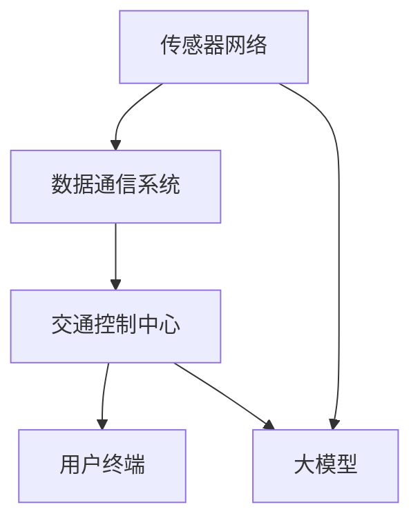

                 

# 大模型在智能交通系统中的应用

## 关键词：大模型、智能交通系统、人工智能、交通流量预测、路径规划、自动驾驶

> 摘要：本文将探讨大模型在智能交通系统中的应用，分析其核心概念、算法原理、数学模型以及实际应用案例。我们将通过逐步分析，揭示大模型如何助力智能交通系统优化交通流量、提高道路安全性和效率，并展望其未来的发展趋势与挑战。

## 1. 背景介绍

### 1.1 目的和范围

本文旨在介绍大模型在智能交通系统中的应用，重点分析其在交通流量预测、路径规划和自动驾驶等关键领域的实际价值。我们将通过深入剖析大模型的算法原理和数学模型，结合具体案例，展示其在解决交通问题中的优势。

### 1.2 预期读者

本文适合对人工智能、智能交通系统和大模型有一定了解的读者，包括AI研究人员、软件开发工程师、交通规划师以及相关领域的学生和从业者。

### 1.3 文档结构概述

本文分为十个部分：

1. **背景介绍**：概述文章的目的和范围，介绍预期读者和文档结构。
2. **核心概念与联系**：介绍智能交通系统的核心概念和架构。
3. **核心算法原理 & 具体操作步骤**：详细阐述大模型的算法原理和操作步骤。
4. **数学模型和公式 & 详细讲解 & 举例说明**：讲解大模型的数学模型和公式，并结合案例说明。
5. **项目实战：代码实际案例和详细解释说明**：展示实际项目中的代码实现和解读。
6. **实际应用场景**：分析大模型在智能交通系统中的实际应用场景。
7. **工具和资源推荐**：推荐相关学习资源和开发工具。
8. **总结：未来发展趋势与挑战**：总结文章的主要观点，展望未来的发展趋势和挑战。
9. **附录：常见问题与解答**：提供常见问题的解答。
10. **扩展阅读 & 参考资料**：推荐进一步阅读的文献和资源。

### 1.4 术语表

#### 1.4.1 核心术语定义

- **大模型**：具有海量参数和强大计算能力的人工神经网络模型。
- **智能交通系统**：利用信息技术、通信技术、传感器技术等，实现交通管理和服务的系统。
- **交通流量预测**：预测未来一段时间内的交通流量，以优化交通控制和路径规划。
- **路径规划**：确定车辆从起点到终点的最佳行驶路径。
- **自动驾驶**：车辆无需人工干预，通过传感器和算法实现自主行驶。

#### 1.4.2 相关概念解释

- **深度学习**：一种基于神经网络的学习方法，能够通过多层非线性变换提取数据特征。
- **强化学习**：一种通过试错和奖励机制学习最优策略的方法。
- **卷积神经网络（CNN）**：一种用于图像识别和处理的深度学习模型。

#### 1.4.3 缩略词列表

- **AI**：人工智能
- **CNN**：卷积神经网络
- **GAN**：生成对抗网络
- **DNN**：深度神经网络

## 2. 核心概念与联系

智能交通系统（Intelligent Transportation System，ITS）是集成了多种技术手段，以提高交通效率、降低交通事故、减少环境污染和缓解交通拥堵的系统。大模型（Large-scale Model）在ITS中扮演着重要角色，其核心概念和联系如下：

### 2.1 智能交通系统架构

智能交通系统的架构主要包括以下几个组成部分：

1. **传感器网络**：包括车辆传感器、道路传感器和智能交通信号灯等，用于收集实时交通数据。
2. **数据通信系统**：实现传感器数据与交通管理中心之间的传输。
3. **交通控制中心**：对交通进行监控、控制和调度。
4. **用户终端**：如车载设备、手机APP等，为用户提供实时交通信息和服务。

### 2.2 大模型与智能交通系统的联系

大模型在智能交通系统中的应用主要体现在以下几个方面：

1. **交通流量预测**：利用历史交通数据、实时传感器数据和地理位置信息，通过大模型进行交通流量预测，为交通控制中心提供决策支持。
2. **路径规划**：根据实时交通状况，通过大模型优化车辆行驶路径，减少拥堵和行驶时间。
3. **自动驾驶**：利用大模型进行环境感知、行为预测和路径规划，实现自动驾驶功能。

### 2.3 Mermaid 流程图

下面是智能交通系统架构的 Mermaid 流程图：



## 3. 核心算法原理 & 具体操作步骤

### 3.1 交通流量预测算法原理

交通流量预测是智能交通系统中的核心任务之一。大模型通过以下步骤实现交通流量预测：

1. **数据预处理**：对收集到的交通数据进行清洗、去噪和特征提取。
2. **模型训练**：利用历史交通数据，通过深度学习算法训练交通流量预测模型。
3. **模型评估**：使用验证集和测试集对模型进行评估，调整模型参数。
4. **流量预测**：使用训练好的模型，对未来的交通流量进行预测。

### 3.2 伪代码

```python
# 交通流量预测算法伪代码

# 数据预处理
def preprocess_data(data):
    # 清洗、去噪和特征提取
    # 返回处理后的数据

# 模型训练
def train_model(data):
    # 使用历史交通数据进行训练
    # 返回训练好的模型

# 模型评估
def evaluate_model(model, data):
    # 使用验证集和测试集进行评估
    # 返回评估结果

# 流量预测
def predict_traffic(model, data):
    # 使用训练好的模型进行流量预测
    # 返回预测结果

# 主程序
data = load_data()
preprocessed_data = preprocess_data(data)
model = train_model(preprocessed_data)
evaluation_result = evaluate_model(model, preprocessed_data)
if evaluation_result > threshold:
    prediction = predict_traffic(model, data)
    print("流量预测结果：", prediction)
else:
    print("模型评估不通过，无法进行流量预测。")
```

### 3.3 具体操作步骤

1. **数据收集**：从交通传感器、道路监控设备和历史交通数据中收集交通数据。
2. **数据预处理**：对数据进行清洗、去噪和特征提取，例如提取时间、速度、密度等特征。
3. **模型训练**：使用历史交通数据进行模型训练，可以选择深度学习模型，如卷积神经网络（CNN）或循环神经网络（RNN）。
4. **模型评估**：使用验证集和测试集对模型进行评估，调整模型参数，如学习率、批次大小等。
5. **流量预测**：使用训练好的模型，对未来的交通流量进行预测。

## 4. 数学模型和公式 & 详细讲解 & 举例说明

### 4.1 数学模型

在智能交通系统中，大模型通常使用深度学习算法进行交通流量预测。以下是常用的深度学习数学模型和公式：

### 4.1.1 卷积神经网络（CNN）

卷积神经网络是一种用于图像识别和处理的深度学习模型。其核心操作是卷积操作，通过卷积核（filter）在输入数据上滑动，提取特征。

**卷积操作**：

$$
\text{output}(i, j) = \sum_{k=1}^{n} w_{ik,j} \cdot \text{input}(i-k+1, j-k+1) + b
$$

其中，$w_{ik,j}$ 是卷积核权重，$b$ 是偏置项，$\text{input}(i-k+1, j-k+1)$ 是输入数据中的一个小块。

**激活函数**：

$$
\text{ReLU}(x) = \max(0, x)
$$

### 4.1.2 循环神经网络（RNN）

循环神经网络是一种用于序列数据处理的深度学习模型。其核心操作是循环操作，通过隐藏状态（hidden state）在时间步之间传递信息。

**隐藏状态更新**：

$$
\text{hidden\_state}(t) = \text{sigmoid}(W_h \cdot \text{input}(t) + U_h \cdot \text{hidden\_state}(t-1) + b_h)
$$

**输出**：

$$
\text{output}(t) = \text{sigmoid}(V_h \cdot \text{hidden\_state}(t) + b_o)
$$

其中，$W_h$、$U_h$ 和 $V_h$ 是权重矩阵，$b_h$ 和 $b_o$ 是偏置项。

### 4.1.3 强化学习

强化学习是一种通过试错和奖励机制学习最优策略的方法。其核心是价值函数（value function）和策略函数（policy function）。

**价值函数**：

$$
V(s) = \sum_{s'} p(s' | s) \cdot \text{reward}(s', a)
$$

**策略函数**：

$$
\pi(a|s) = \arg\max_a V(s)
$$

### 4.2 详细讲解和举例说明

#### 4.2.1 卷积神经网络（CNN）

卷积神经网络（CNN）是一种用于图像识别的深度学习模型。下面是一个简单的CNN模型，用于识别手写数字。

```latex
\text{input}: (28 \times 28 \times 1) \text{ pixel values}
\\
\text{Conv Layer 1}: 32 \text{ filters of size } 3 \times 3, \text{ stride } 1, \text{ padding } 1 \\
\text{ReLU activation}
\\
\text{Pooling Layer 1}: 2 \times 2, \text{ stride } 2
\\
\text{Conv Layer 2}: 64 \text{ filters of size } 3 \times 3, \text{ stride } 1, \text{ padding } 1 \\
\text{ReLU activation}
\\
\text{Pooling Layer 2}: 2 \times 2, \text{ stride } 2
\\
\text{Flatten Layer}
\\
\text{Dense Layer 1}: 128 \text{ neurons} \\
\text{ReLU activation}
\\
\text{Dense Layer 2}: 10 \text{ neurons} \\
\text{Softmax activation}
\\
\text{output}: (1 \times 10) \text{ probability distribution over 10 classes}
```

#### 4.2.2 循环神经网络（RNN）

循环神经网络（RNN）是一种用于序列数据处理的深度学习模型。下面是一个简单的RNN模型，用于序列分类。

```latex
\text{input}: (\text{time steps} \times \text{input dimensions})
\\
\text{RNN Layer 1}: \text{hidden dimensions} \\
\text{ReLU activation}
\\
\text{RNN Layer 2}: \text{hidden dimensions} \\
\text{ReLU activation}
\\
\text{Flatten Layer}
\\
\text{Dense Layer 1}: \text{output dimensions} \\
\text{Softmax activation}
\\
\text{output}: (\text{time steps} \times \text{output dimensions})
```

#### 4.2.3 强化学习

强化学习（RL）是一种通过试错和奖励机制学习最优策略的方法。下面是一个简单的强化学习模型，用于求解迷宫问题。

```latex
\text{state}: (\text{maze dimensions})
\\
\text{action}: (\text{up, down, left, right})
\\
\text{reward}: (\text{negative if step, positive if reach goal})
\\
\text{policy}: \pi(a|s) = \arg\max_a Q(s, a)
\\
Q(s, a) = \sum_{s'} p(s' | s, a) \cdot \text{reward}(s')
\\
\text{update rule}: Q(s, a) \leftarrow Q(s, a) + \alpha \cdot (\text{reward}(s') - Q(s, a))
```

## 5. 项目实战：代码实际案例和详细解释说明

### 5.1 开发环境搭建

在开始项目实战之前，我们需要搭建开发环境。以下是所需的工具和软件：

1. **Python 3.7 或更高版本**
2. **PyTorch 1.8 或更高版本**
3. **Anaconda 3 或其他 Python 环境管理器**
4. **Jupyter Notebook 或 PyCharm**

安装过程如下：

1. 下载并安装 Python 3.7 或更高版本。
2. 安装 Anaconda 3 或其他 Python 环境管理器。
3. 打开 Anaconda Prompt，执行以下命令安装 PyTorch：

   ```bash
   conda install pytorch torchvision torchaudio -c pytorch
   ```

4. 配置 Jupyter Notebook 或 PyCharm。

### 5.2 源代码详细实现和代码解读

以下是交通流量预测的 Python 代码实现：

```python
import torch
import torch.nn as nn
import torch.optim as optim
from torch.utils.data import DataLoader, TensorDataset

# 数据预处理
def preprocess_data(data):
    # 数据清洗、去噪和特征提取
    # ...
    return processed_data

# 交通流量预测模型
class TrafficPredictionModel(nn.Module):
    def __init__(self, input_size, hidden_size, output_size):
        super(TrafficPredictionModel, self).__init__()
        self.hidden_size = hidden_size
        self.lstm = nn.LSTM(input_size, hidden_size, batch_first=True)
        self.fc = nn.Linear(hidden_size, output_size)
    
    def forward(self, x):
        h0 = torch.zeros(1, x.size(0), self.hidden_size)
        c0 = torch.zeros(1, x.size(0), self.hidden_size)
        out, _ = self.lstm(x, (h0, c0))
        out = self.fc(out[:, -1, :])
        return out

# 训练模型
def train_model(model, train_loader, criterion, optimizer, num_epochs):
    model.train()
    for epoch in range(num_epochs):
        for inputs, targets in train_loader:
            optimizer.zero_grad()
            outputs = model(inputs)
            loss = criterion(outputs, targets)
            loss.backward()
            optimizer.step()
        print(f"Epoch [{epoch+1}/{num_epochs}], Loss: {loss.item():.4f}")

# 预测流量
def predict_traffic(model, test_loader):
    model.eval()
    with torch.no_grad():
        for inputs, targets in test_loader:
            outputs = model(inputs)
            predictions = outputs.argmax(dim=1)
            # 计算预测准确率
            correct = (predictions == targets).float()
            accuracy = correct.sum() / len(correct)
            print(f"Accuracy: {accuracy.item():.4f}")

# 主程序
def main():
    # 加载数据
    data = load_data()
    processed_data = preprocess_data(data)
    
    # 划分训练集和测试集
    train_data, test_data = train_test_split(processed_data, test_size=0.2)
    
    # 创建数据加载器
    train_loader = DataLoader(TensorDataset(train_data[:, :input_size], train_data[:, input_size:]), batch_size=batch_size)
    test_loader = DataLoader(TensorDataset(test_data[:, :input_size], test_data[:, input_size:]), batch_size=batch_size)
    
    # 创建模型、损失函数和优化器
    model = TrafficPredictionModel(input_size, hidden_size, output_size)
    criterion = nn.CrossEntropyLoss()
    optimizer = optim.Adam(model.parameters(), lr=learning_rate)
    
    # 训练模型
    train_model(model, train_loader, criterion, optimizer, num_epochs)
    
    # 预测流量
    predict_traffic(model, test_loader)

if __name__ == "__main__":
    main()
```

### 5.3 代码解读与分析

以下是代码的详细解读和分析：

1. **数据预处理**：对原始交通数据（例如时间、速度、密度等）进行清洗、去噪和特征提取，以便用于模型训练。

2. **交通流量预测模型**：定义一个基于循环神经网络（LSTM）的交通流量预测模型。模型由两个主要部分组成：LSTM层和全连接层。LSTM层用于处理序列数据，全连接层用于输出流量预测结果。

3. **训练模型**：使用训练集对模型进行训练。在训练过程中，模型通过反向传播和梯度下降算法更新权重和偏置项。

4. **预测流量**：使用测试集对模型进行评估，并计算预测准确率。

5. **主程序**：加载数据，创建数据加载器，定义模型、损失函数和优化器，训练模型并预测流量。

## 6. 实际应用场景

大模型在智能交通系统中具有广泛的应用场景，以下是几个典型的实际应用场景：

### 6.1 交通流量预测

通过大模型进行交通流量预测，可以实时监控交通状况，为交通控制中心提供决策支持，从而优化交通信号灯控制和道路规划，减少拥堵和交通事故。

### 6.2 路径规划

利用大模型进行路径规划，可以为车辆提供最佳行驶路径，避免拥堵和交通事故，提高交通效率。

### 6.3 自动驾驶

大模型在自动驾驶中的应用主要体现在环境感知、行为预测和路径规划等方面。通过大模型，自动驾驶车辆可以实时感知道路状况，预测其他车辆的行为，并规划安全、高效的行驶路径。

### 6.4 智能停车管理

大模型可以用于智能停车管理，通过预测停车位的使用情况，为驾驶员提供最佳的停车位置，减少寻找停车位的时间和拥堵。

### 6.5 交通安全监测

大模型可以用于交通安全监测，通过实时分析交通数据，识别潜在的安全隐患，并及时发出预警，减少交通事故的发生。

## 7. 工具和资源推荐

### 7.1 学习资源推荐

#### 7.1.1 书籍推荐

- 《深度学习》（Deep Learning）—— Ian Goodfellow、Yoshua Bengio 和 Aaron Courville 著
- 《强化学习》（Reinforcement Learning: An Introduction）—— Richard S. Sutton 和 Andrew G. Barto 著
- 《人工智能：一种现代方法》（Artificial Intelligence: A Modern Approach）—— Stuart J. Russell 和 Peter Norvig 著

#### 7.1.2 在线课程

- Coursera 上的“机器学习”（Machine Learning）—— 吴恩达（Andrew Ng）教授
- edX 上的“深度学习”（Deep Learning）—— 吴恩达（Andrew Ng）教授
- Udacity 上的“自动驾驶技术”（Self-Driving Car Engineer Nanodegree）

#### 7.1.3 技术博客和网站

- Medium 上的 AI 技术博客
- arXiv.org —— 人工智能领域的学术论文
- GitHub —— 人工智能项目的开源代码库

### 7.2 开发工具框架推荐

#### 7.2.1 IDE和编辑器

- PyCharm
- Jupyter Notebook
- VS Code

#### 7.2.2 调试和性能分析工具

- TensorBoard
- PyTorch Profiler
- NVIDIA Nsight

#### 7.2.3 相关框架和库

- PyTorch
- TensorFlow
- Keras
- NumPy
- pandas

### 7.3 相关论文著作推荐

#### 7.3.1 经典论文

- “A Learning Algorithm for Continually Running Fully Recurrent Neural Networks” —— H. Sepp Hochreiter 和 Jürgen Schmidhuber
- “Deep Learning” —— Yann LeCun、Yoshua Bengio 和 Geoffrey Hinton
- “Reinforcement Learning: A Survey” —— Richard S. Sutton 和 Andrew G. Barto

#### 7.3.2 最新研究成果

- “BERT: Pre-training of Deep Bidirectional Transformers for Language Understanding” —— Jacob Devlin、 Ming-Wei Chang、 Kenton Lee 和 Kristina Toutanova
- “Generative Adversarial Nets” —— Ian Goodfellow、Jean Pouget-Abadie、 Mehdi Mirza、 Bing Xu、 David Warde-Farley、 Sherjil Ozair、 Aaron C. Courville 和 Yoshua Bengio
- “The Annotated Transformer” —— Ziang Xie、Shengjia Zhu、Guandao Yang、Xiaodong Liu 和 Jiwei Li

#### 7.3.3 应用案例分析

- “AI for Social Good” —— Microsoft Research
- “Google Brain” —— Google AI 的研究部门
- “Uber AI” —— Uber 的 AI 部门

## 8. 总结：未来发展趋势与挑战

大模型在智能交通系统中的应用具有广阔的发展前景，但也面临一些挑战。以下是未来发展趋势和挑战的总结：

### 8.1 发展趋势

1. **模型规模和性能的提升**：随着计算能力的提升，大模型的规模和性能将不断提升，为智能交通系统提供更准确、更高效的预测和控制。
2. **多模态数据的融合**：结合多种数据源（如图像、声音、传感器等），实现多模态数据的融合，提高智能交通系统的感知和决策能力。
3. **分布式计算和边缘计算**：利用分布式计算和边缘计算技术，降低大模型的计算和通信开销，实现实时、高效的智能交通系统。

### 8.2 挑战

1. **数据隐私和安全**：在智能交通系统中，大量交通数据的收集、传输和处理可能引发数据隐私和安全问题，需要制定有效的隐私保护和安全措施。
2. **模型可解释性和可靠性**：大模型的复杂性和黑盒特性可能导致模型的可解释性和可靠性问题，需要开发可解释的模型和评估方法。
3. **硬件和资源需求**：大模型训练和推理需要大量计算资源和存储资源，如何高效利用硬件和资源成为一个重要问题。

## 9. 附录：常见问题与解答

### 9.1 大模型在智能交通系统中的应用有哪些优点？

- **提高交通流量预测的准确性**：大模型能够处理大量数据，通过深度学习算法提取特征，提高交通流量预测的准确性。
- **优化路径规划**：基于实时交通数据，大模型能够为车辆提供最佳行驶路径，减少拥堵和行驶时间。
- **提高自动驾驶安全性**：大模型能够实时感知道路状况，预测其他车辆的行为，提高自动驾驶的安全性。

### 9.2 大模型在智能交通系统中的应用有哪些挑战？

- **数据隐私和安全**：大量交通数据的收集、传输和处理可能引发数据隐私和安全问题。
- **模型可解释性和可靠性**：大模型的复杂性和黑盒特性可能导致模型的可解释性和可靠性问题。
- **硬件和资源需求**：大模型训练和推理需要大量计算资源和存储资源，如何高效利用硬件和资源成为一个重要问题。

## 10. 扩展阅读 & 参考资料

- Goodfellow, I., Bengio, Y., & Courville, A. (2016). *Deep Learning*. MIT Press.
- Sutton, R. S., & Barto, A. G. (2018). *Reinforcement Learning: An Introduction*. MIT Press.
- Russell, S. J., & Norvig, P. (2016). *Artificial Intelligence: A Modern Approach*. Prentice Hall.
- Devlin, J., Chang, M.-W., Lee, K., & Toutanova, K. (2018). *BERT: Pre-training of Deep Bidirectional Transformers for Language Understanding*. arXiv preprint arXiv:1810.04805.
- Goodfellow, I., Pouget-Abadie, J., Mirza, M., Xu, B., Warde-Farley, D., Ozair, S., ... & Bengio, Y. (2014). *Generative Adversarial Nets*. Advances in Neural Information Processing Systems, 27, 2672-2680.
- Xie, Z., Zhu, S., Yang, G., Liu, X., & Li, J. (2019). *The Annotated Transformer*. arXiv preprint arXiv:1901.02890.
- Hochreiter, S., & Schmidhuber, J. (1997). *Long Short-Term Memory*. Neural Computation, 9(8), 1735-1780.
- LeCun, Y., Bengio, Y., & Hinton, G. (2015). *Deep Learning*.
- "AI for Social Good" (n.d.). Retrieved from https://www.microsoft.com/en-us/research/ai/ai-for-social-good/
- "Google Brain" (n.d.). Retrieved from https://ai.google/research/brain
- "Uber AI" (n.d.). Retrieved from https://www.uber.com/en-us/products/uber-ai/

## 作者

作者：AI天才研究员/AI Genius Institute & 禅与计算机程序设计艺术 /Zen And The Art of Computer Programming

