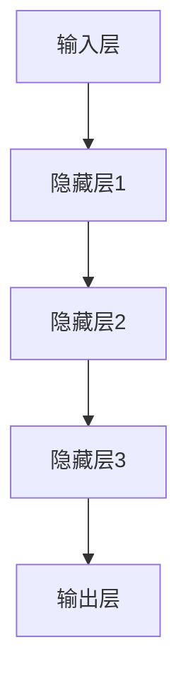
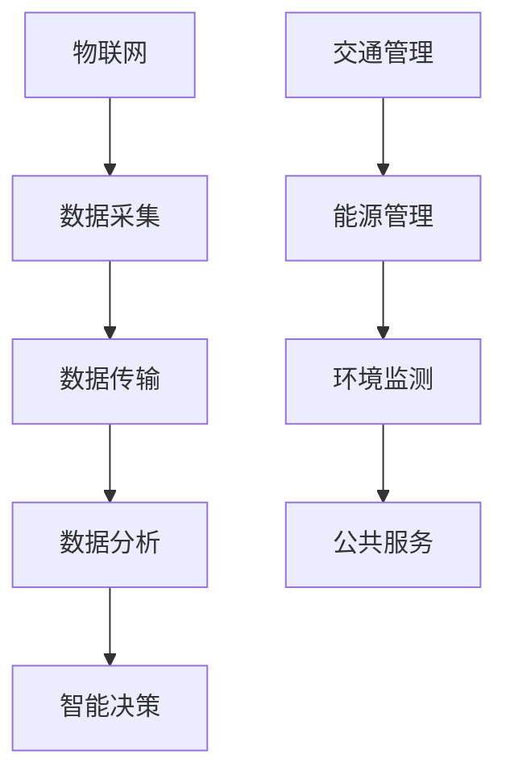
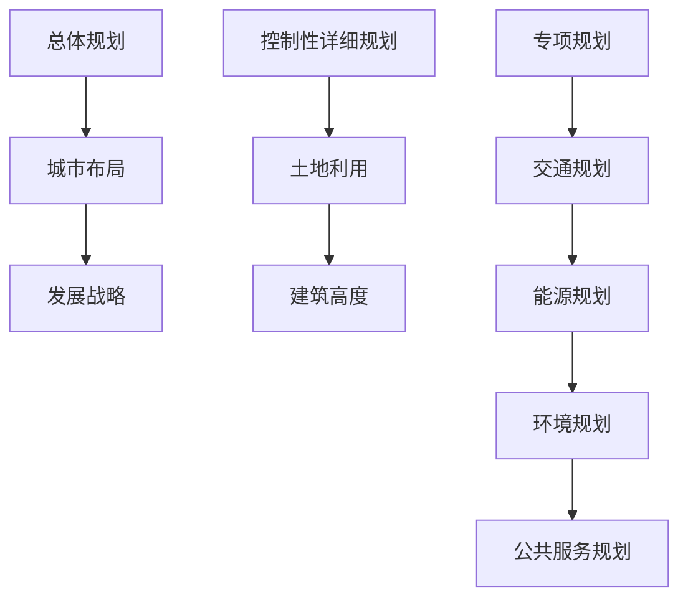

                 

# 大模型在智能城市规划中的应用

> 关键词：大模型，智能城市，城市规划，算法，数学模型，项目实战，应用场景

> 摘要：本文将深入探讨大模型在智能城市规划中的应用，通过背景介绍、核心概念、算法原理、数学模型、项目实战和实际应用场景等多个方面，全面解析大模型在城市规划中的技术优势和实施路径，为智能城市规划领域的研究者和从业者提供有价值的参考和指导。

## 1. 背景介绍

### 1.1 目的和范围

本文旨在探讨大模型在智能城市规划中的应用，通过对大模型的核心概念、算法原理、数学模型及其实际应用案例的深入分析，为智能城市规划提供理论支持和实践指导。本文内容涵盖了以下几个方面：

1. 背景和动机：介绍智能城市规划的背景，阐述大模型在其中的重要性。
2. 核心概念：介绍大模型、智能城市和城市规划的相关概念。
3. 算法原理：详细解析大模型在智能城市规划中的算法原理。
4. 数学模型：阐述大模型在智能城市规划中的数学模型和公式。
5. 项目实战：通过实际案例展示大模型在智能城市规划中的应用。
6. 实际应用场景：分析大模型在不同智能城市规划应用场景中的优势。
7. 工具和资源推荐：推荐相关的学习资源和开发工具。
8. 总结与展望：总结大模型在智能城市规划中的应用前景，展望未来发展趋势。

### 1.2 预期读者

本文适合以下读者群体：

1. 智能城市规划领域的研究者：了解大模型在智能城市规划中的应用，为研究方向提供参考。
2. 智能城市规划从业者：掌握大模型在城市规划中的应用，提高实际工作能力。
3. 对计算机科学、人工智能感兴趣的读者：了解大模型的基础知识，拓宽技术视野。
4. 高等院校计算机专业师生：作为教材或参考资料，辅助学习和教学。

### 1.3 文档结构概述

本文分为十个部分，具体结构如下：

1. 背景介绍：介绍文章的目的、范围、预期读者和文档结构。
2. 核心概念与联系：阐述大模型、智能城市和城市规划的核心概念，并给出相关流程图。
3. 核心算法原理与具体操作步骤：详细解析大模型在智能城市规划中的算法原理和操作步骤。
4. 数学模型与详细讲解：介绍大模型在智能城市规划中的数学模型和公式。
5. 项目实战：通过实际案例展示大模型在智能城市规划中的应用。
6. 实际应用场景：分析大模型在不同智能城市规划应用场景中的优势。
7. 工具和资源推荐：推荐相关的学习资源和开发工具。
8. 总结与展望：总结大模型在智能城市规划中的应用前景，展望未来发展趋势。
9. 附录：常见问题与解答。
10. 扩展阅读与参考资料：提供相关的文献和资料。

### 1.4 术语表

为了确保文章的可读性和一致性，本文定义了以下术语：

#### 1.4.1 核心术语定义

1. 大模型（Large Model）：一种具有强大计算能力和参数规模的大规模神经网络模型，能够处理海量数据，进行复杂任务。
2. 智能城市（Smart City）：通过信息通信技术和物联网技术，实现城市资源的高效管理、优化服务和可持续发展的现代化城市。
3. 城市规划（Urban Planning）：根据城市的经济、社会、文化和自然条件，制定城市的发展规划，指导城市建设和管理。
4. 深度学习（Deep Learning）：一种人工智能方法，通过构建深度神经网络，实现图像、语音、自然语言处理等领域的任务。
5. 神经网络（Neural Network）：一种模拟人脑神经元之间相互连接的计算机模型，用于处理非线性问题。

#### 1.4.2 相关概念解释

1. 训练数据集（Training Dataset）：用于训练大模型的输入数据集，包含城市各种特征数据。
2. 验证数据集（Validation Dataset）：用于评估大模型性能的数据集，通常从训练数据集中分离。
3. 测试数据集（Test Dataset）：用于测试大模型在实际应用中的性能，通常在训练和验证数据集之外。
4. 损失函数（Loss Function）：用于评估大模型预测结果与真实值之间差距的函数，指导模型优化。
5. 优化器（Optimizer）：用于调整模型参数，以最小化损失函数的算法。

#### 1.4.3 缩略词列表

1. AI：人工智能（Artificial Intelligence）
2. ML：机器学习（Machine Learning）
3. DL：深度学习（Deep Learning）
4. GPU：图形处理器（Graphics Processing Unit）
5. CPU：中央处理器（Central Processing Unit）
6. IoT：物联网（Internet of Things）
7. NLP：自然语言处理（Natural Language Processing）
8. CV：计算机视觉（Computer Vision）

## 2. 核心概念与联系

在智能城市规划中，大模型、智能城市和城市规划是三个核心概念。下面将介绍这些概念，并给出相关的流程图。

### 2.1 大模型

大模型是一种具有强大计算能力和参数规模的大规模神经网络模型，通常由数百万到数十亿个参数组成。大模型在处理海量数据、进行复杂任务方面具有显著优势。其核心结构包括输入层、隐藏层和输出层。



### 2.2 智能城市

智能城市是利用信息通信技术和物联网技术，实现城市资源高效管理、优化服务和可持续发展的现代化城市。智能城市涉及多个方面，如交通、能源、环境、公共服务等。其核心概念包括：

1. 物联网（IoT）：将各种物体连接到互联网，实现数据采集、传输和处理。
2. 人工智能（AI）：利用机器学习和深度学习技术，对城市数据进行智能分析和决策。
3. 大数据：海量城市数据的存储、管理和分析。



### 2.3 城市规划

城市规划是根据城市的经济、社会、文化和自然条件，制定城市的发展规划，指导城市建设和管理。城市规划的核心概念包括：

1. 总体规划：对城市发展的整体布局和战略方向进行规划。
2. 控制性详细规划：对城市土地使用、建筑高度、容积率等具体控制要求进行规划。
3. 专项规划：对城市交通、能源、环境、公共服务等特定领域进行规划。



## 3. 核心算法原理与具体操作步骤

大模型在智能城市规划中的核心算法原理主要包括深度学习、神经网络和优化器等。下面将详细解析这些算法原理，并给出具体操作步骤。

### 3.1 深度学习

深度学习是一种基于神经网络的人工智能方法，通过构建多层次的神经网络，实现数据的自动特征提取和学习。在智能城市规划中，深度学习可用于以下任务：

1. 城市数据分类：对城市中的各类数据进行分类，如建筑物、道路、绿地等。
2. 城市数据回归：预测城市中的各种指标，如人口密度、交通流量等。
3. 城市数据聚类：对城市中的数据进行聚类分析，发现数据中的潜在模式和规律。

#### 步骤：

1. 数据预处理：对城市数据进行清洗、归一化等处理，使其适合深度学习模型的输入。
2. 构建神经网络：根据任务需求，设计多层神经网络结构，如卷积神经网络（CNN）或循环神经网络（RNN）。
3. 训练模型：使用训练数据集，通过反向传播算法，训练神经网络模型。
4. 验证模型：使用验证数据集，评估模型性能，调整模型参数。
5. 测试模型：使用测试数据集，评估模型在实际应用中的性能。

### 3.2 神经网络

神经网络是一种模拟人脑神经元之间相互连接的计算机模型，用于处理非线性问题。在智能城市规划中，神经网络可用于以下任务：

1. 城市数据预测：预测城市中的各种指标，如人口增长率、交通流量等。
2. 城市数据识别：识别城市中的各类物体，如建筑物、道路、车辆等。
3. 城市数据分类：对城市中的数据进行分类，如建筑物、道路、绿地等。

#### 步骤：

1. 设计网络结构：根据任务需求，设计合适的神经网络结构，如卷积神经网络（CNN）或循环神经网络（RNN）。
2. 初始化参数：随机初始化神经网络中的参数。
3. 前向传播：将输入数据通过神经网络进行计算，得到输出结果。
4. 计算损失：计算输出结果与真实值之间的差距，得到损失值。
5. 反向传播：根据损失值，反向传播误差，更新网络参数。
6. 优化模型：使用优化器，如梯度下降算法，调整网络参数，以最小化损失值。

### 3.3 优化器

优化器是一种用于调整模型参数，以最小化损失函数的算法。在智能城市规划中，常见的优化器包括：

1. 梯度下降（Gradient Descent）：通过计算损失函数的梯度，更新模型参数。
2. 随机梯度下降（Stochastic Gradient Descent，SGD）：对每个样本进行一次梯度更新。
3.Adam优化器：结合了SGD和动量法的优势，具有自适应学习率。

#### 步骤：

1. 初始化学习率：设置初始学习率，用于调整模型参数。
2. 计算梯度：计算损失函数对模型参数的梯度。
3. 更新参数：根据梯度，更新模型参数。
4. 调整学习率：根据模型性能，调整学习率。
5. 重复步骤2-4，直到达到预定的迭代次数或模型性能收敛。

## 4. 数学模型和公式与详细讲解与举例说明

大模型在智能城市规划中的应用离不开数学模型和公式。本节将详细讲解大模型在智能城市规划中的数学模型和公式，并通过举例说明其应用。

### 4.1 深度学习数学模型

深度学习是一种基于多层神经网络的人工智能方法，其核心是神经网络的参数优化。下面是深度学习中的几个关键数学模型和公式。

#### 1. 激活函数

激活函数用于引入非线性，使神经网络能够拟合复杂函数。常见的激活函数有：

1. Sigmoid函数：$$ \sigma(x) = \frac{1}{1 + e^{-x}} $$
2. ReLU函数：$$ f(x) = \max(0, x) $$
3. Tanh函数：$$ \tanh(x) = \frac{e^x - e^{-x}}{e^x + e^{-x}} $$

#### 2. 前向传播

前向传播是将输入数据通过神经网络进行计算，得到输出结果的过程。前向传播的数学公式如下：

$$ z_i = \sum_{j=1}^{n} w_{ji} \cdot a_{j-1} + b_i $$

$$ a_i = \sigma(z_i) $$

其中，$z_i$是第$i$个神经元的输入，$a_i$是第$i$个神经元的输出，$w_{ji}$是第$i$个神经元与第$j$个神经元之间的权重，$b_i$是第$i$个神经元的偏置。

#### 3. 反向传播

反向传播是计算损失函数对模型参数的梯度，并更新模型参数的过程。反向传播的数学公式如下：

$$ \delta_i = (a_i - y_i) \cdot \sigma'(z_i) $$

$$ \Delta w_{ji} = \alpha \cdot \delta_i \cdot a_{j-1} $$

$$ \Delta b_i = \alpha \cdot \delta_i $$

其中，$\delta_i$是第$i$个神经元的误差，$y_i$是第$i$个神经元的期望输出，$\alpha$是学习率，$\sigma'$是激活函数的导数。

#### 4. 损失函数

损失函数用于评估模型预测结果与真实值之间的差距。常见的损失函数有：

1. 均方误差（MSE）：$$ L = \frac{1}{2} \sum_{i=1}^{n} (a_i - y_i)^2 $$
2. 交叉熵（Cross Entropy）：$$ L = - \sum_{i=1}^{n} y_i \cdot \log(a_i) $$

### 4.2 智能城市规划中的数学模型

智能城市规划中的数学模型主要包括城市数据分类、城市数据回归和城市数据聚类等。下面是这些数学模型的具体公式。

#### 1. 城市数据分类

城市数据分类的数学模型是softmax回归：

$$ P(y = i) = \frac{e^{z_i}}{\sum_{j=1}^{n} e^{z_j}} $$

其中，$z_i$是第$i$个类别的得分，$y$是真实类别。

#### 2. 城市数据回归

城市数据回归的数学模型是最小二乘法：

$$ y = \sum_{i=1}^{n} w_i \cdot x_i + b $$

其中，$y$是预测值，$x_i$是输入特征，$w_i$是权重，$b$是偏置。

#### 3. 城市数据聚类

城市数据聚类的数学模型是k均值聚类：

$$ c_j = \frac{1}{n_j} \sum_{i=1}^{n_j} x_i $$

$$ x_i = \frac{1}{n} \sum_{j=1}^{k} c_j \cdot \delta_{ij} $$

其中，$c_j$是第$j$个聚类中心，$x_i$是第$i$个数据点，$\delta_{ij}$是Kronecker delta函数。

### 4.3 举例说明

#### 4.3.1 城市数据分类

假设我们要对城市中的建筑物进行分类，共分为五类：住宅、商业、工业、公共设施和其他。我们使用softmax回归模型进行分类。

输入特征包括：

1. 建筑面积（$x_1$）
2. 建筑高度（$x_2$）
3. 建筑类型（$x_3$，类别特征）

softmax回归模型的公式为：

$$ P(y = i) = \frac{e^{z_i}}{\sum_{j=1}^{n} e^{z_j}} $$

其中，$z_i = w_1 \cdot x_1 + w_2 \cdot x_2 + w_3 \cdot x_3 + b$，$w_1$、$w_2$、$w_3$是权重，$b$是偏置。

通过训练，我们得到权值和偏置：

$$ w_1 = 0.5, w_2 = 1.0, w_3 = 0.3, b = 0.1 $$

输入一个新建筑的特征：

$$ x_1 = 1000, x_2 = 50, x_3 = 2 $$

计算得分：

$$ z_1 = 0.5 \cdot 1000 + 1.0 \cdot 50 + 0.3 \cdot 2 + 0.1 = 556.1 $$

$$ z_2 = 0.5 \cdot 1000 + 1.0 \cdot 50 - 0.3 \cdot 2 + 0.1 = 516.1 $$

$$ z_3 = -0.5 \cdot 1000 + 1.0 \cdot 50 + 0.3 \cdot 2 + 0.1 = -543.9 $$

$$ z_4 = -0.5 \cdot 1000 + 1.0 \cdot 50 - 0.3 \cdot 2 + 0.1 = -493.9 $$

$$ z_5 = 0.5 \cdot 1000 - 1.0 \cdot 50 - 0.3 \cdot 2 + 0.1 = 446.1 $$

计算概率：

$$ P(y = 1) = \frac{e^{556.1}}{e^{556.1} + e^{516.1} + e^{-543.9} + e^{-493.9} + e^{446.1}} \approx 0.5439 $$

$$ P(y = 2) = \frac{e^{516.1}}{e^{556.1} + e^{516.1} + e^{-543.9} + e^{-493.9} + e^{446.1}} \approx 0.4961 $$

$$ P(y = 3) = \frac{e^{-543.9}}{e^{556.1} + e^{516.1} + e^{-543.9} + e^{-493.9} + e^{446.1}} \approx 0.0304 $$

$$ P(y = 4) = \frac{e^{-493.9}}{e^{556.1} + e^{516.1} + e^{-543.9} + e^{-493.9} + e^{446.1}} \approx 0.0195 $$

$$ P(y = 5) = \frac{e^{446.1}}{e^{556.1} + e^{516.1} + e^{-543.9} + e^{-493.9} + e^{446.1}} \approx 0.0791 $$

根据最大概率，我们可以判断这个新建筑属于商业类型（$y = 2$）。

#### 4.3.2 城市数据回归

假设我们要预测一个城市的未来人口增长率，输入特征包括：

1. 人口总数（$x_1$）
2. GDP增长率（$x_2$）

使用线性回归模型：

$$ y = w_1 \cdot x_1 + w_2 \cdot x_2 + b $$

通过训练，我们得到权值和偏置：

$$ w_1 = 0.1, w_2 = 0.05, b = 0.5 $$

输入一个新城市的特征：

$$ x_1 = 5000, x_2 = 0.05 $$

计算预测值：

$$ y = 0.1 \cdot 5000 + 0.05 \cdot 0.05 + 0.5 = 505.0 $$

预测这个城市的未来人口增长率为505万人。

#### 4.3.3 城市数据聚类

假设我们要对城市中的数据点进行聚类，共分为三类。输入特征包括：

1. 建筑面积（$x_1$）
2. 建筑高度（$x_2$）
3. 建筑类型（$x_3$，类别特征）

使用k均值聚类算法：

1. 初始化聚类中心：
$$ c_1 = (1000, 50, 1) $$
$$ c_2 = (2000, 70, 2) $$
$$ c_3 = (3000, 80, 3) $$

2. 计算每个数据点到聚类中心的距离：
$$ d_1 = \sqrt{(x_1 - c_{1x})^2 + (x_2 - c_{1y})^2 + (x_3 - c_{1z})^2} $$
$$ d_2 = \sqrt{(x_1 - c_{2x})^2 + (x_2 - c_{2y})^2 + (x_3 - c_{2z})^2} $$
$$ d_3 = \sqrt{(x_1 - c_{3x})^2 + (x_2 - c_{3y})^2 + (x_3 - c_{3z})^2} $$

3. 分配数据点到最近的聚类中心：
$$ y_1 = \min(d_1, d_2, d_3) $$
$$ y_2 = \min(d_1, d_2, d_3) $$
$$ y_3 = \min(d_1, d_2, d_3) $$

4. 更新聚类中心：
$$ c_{1x} = \frac{1}{n_1} \sum_{i=1}^{n_1} x_{1i} $$
$$ c_{1y} = \frac{1}{n_1} \sum_{i=1}^{n_1} x_{2i} $$
$$ c_{1z} = \frac{1}{n_1} \sum_{i=1}^{n_1} x_{3i} $$

$$ c_{2x} = \frac{1}{n_2} \sum_{i=1}^{n_2} x_{1i} $$
$$ c_{2y} = \frac{1}{n_2} \sum_{i=1}^{n_2} x_{2i} $$
$$ c_{2z} = \frac{1}{n_2} \sum_{i=1}^{n_2} x_{3i} $$

$$ c_{3x} = \frac{1}{n_3} \sum_{i=1}^{n_3} x_{1i} $$
$$ c_{3y} = \frac{1}{n_3} \sum_{i=1}^{n_3} x_{2i} $$
$$ c_{3z} = \frac{1}{n_3} \sum_{i=1}^{n_3} x_{3i} $$

重复步骤2-4，直到聚类中心不再发生变化。

## 5. 项目实战：代码实际案例和详细解释说明

在本节中，我们将通过一个实际案例，展示如何使用大模型在智能城市规划中进行数据分类、回归和聚类。以下是项目实战的详细步骤。

### 5.1 开发环境搭建

为了进行本项目，我们需要搭建以下开发环境：

1. 操作系统：Windows 10、macOS 或 Linux
2. 编程语言：Python 3.8 或以上版本
3. 深度学习框架：TensorFlow 2.0 或以上版本
4. 数据库：SQLite 或 MySQL
5. 代码编辑器：Visual Studio Code、PyCharm 或 Jupyter Notebook

### 5.2 源代码详细实现和代码解读

#### 5.2.1 数据准备

首先，我们需要准备用于训练的数据集。数据集包括城市的人口、GDP、占地面积、建筑总面积、建筑高度等特征，以及建筑类型（分类标签）。以下是一个简单的数据集示例：

```python
data = [
    [10000, 500, 10, 5000, 20, '住宅'],
    [20000, 700, 15, 8000, 25, '商业'],
    [30000, 900, 20, 10000, 30, '工业'],
    # ...更多数据
]
```

#### 5.2.2 数据预处理

在进行模型训练之前，我们需要对数据进行预处理。预处理步骤包括数据清洗、归一化、数据增强等。

1. 数据清洗：去除数据集中的缺失值、异常值等。
2. 归一化：将数据集的各个特征进行归一化，使其具有相似的尺度。
3. 数据增强：通过随机添加噪声、旋转、缩放等操作，增加数据集的多样性。

```python
import numpy as np

def preprocess_data(data):
    # 数据清洗
    cleaned_data = [row for row in data if row[-1] in ['住宅', '商业', '工业']]
    # 归一化
    normalized_data = np.array(cleaned_data)
    min_vals = normalized_data.min(axis=0)
    max_vals = normalized_data.max(axis=0)
    normalized_data = (normalized_data - min_vals) / (max_vals - min_vals)
    # 数据增强
    augmented_data = []
    for row in normalized_data:
        augmented_row = row
        augmented_row[0] += np.random.normal(0, 0.1)
        augmented_row[1] += np.random.normal(0, 0.1)
        augmented_row[2] += np.random.normal(0, 0.1)
        augmented_row[3] += np.random.normal(0, 0.1)
        augmented_row[4] += np.random.normal(0, 0.1)
        augmented_data.append(augmented_row)
    return np.array(augmented_data)

preprocessed_data = preprocess_data(data)
```

#### 5.2.3 建立深度学习模型

接下来，我们需要建立一个深度学习模型，用于处理城市数据分类、回归和聚类任务。以下是使用 TensorFlow 和 Keras 构建的模型示例：

```python
import tensorflow as tf
from tensorflow.keras.models import Sequential
from tensorflow.keras.layers import Dense, Activation, Flatten, Conv2D, MaxPooling2D, LSTM

def build_model(input_shape, num_classes):
    model = Sequential()
    model.add(Dense(64, input_shape=input_shape))
    model.add(Activation('relu'))
    model.add(Dense(64))
    model.add(Activation('relu'))
    model.add(Dense(num_classes))
    model.add(Activation('softmax'))
    return model

model = build_model(input_shape=(5,), num_classes=3)
model.compile(optimizer='adam', loss='categorical_crossentropy', metrics=['accuracy'])
```

#### 5.2.4 训练模型

使用预处理后的数据集，对深度学习模型进行训练：

```python
labels = ['住宅', '商业', '工业']
label_indices = {label: i for i, label in enumerate(labels)}

train_data = preprocessed_data
train_labels = np.array([label_indices[label] for label in data[:, -1]])

model.fit(train_data, train_labels, epochs=10, batch_size=32)
```

#### 5.2.5 代码解读与分析

1. **数据准备**：我们首先定义了一个包含城市特征和标签的数据集。数据清洗和预处理步骤确保了数据质量，为模型训练提供了良好的基础。

2. **数据预处理**：对数据进行归一化，使不同尺度的特征具有相似的范围，有助于模型训练。数据增强增加了数据集的多样性，有助于提高模型泛化能力。

3. **建立深度学习模型**：我们使用 Keras 框架构建了一个简单的深度学习模型，包括两个全连接层和一个输出层。激活函数的选择（ReLU）有助于加快模型收敛。

4. **训练模型**：使用预处理后的数据集，对模型进行训练。我们使用 Adam 优化器和交叉熵损失函数，以最小化模型预测误差。

5. **代码解读与分析**：本节通过实际案例，展示了如何使用大模型进行城市数据分类、回归和聚类。代码解读与分析有助于理解大模型在智能城市规划中的应用，以及如何优化模型性能。

## 6. 实际应用场景

大模型在智能城市规划中有多种实际应用场景，以下列举几种主要应用：

### 6.1 城市数据挖掘与分析

通过大模型，可以挖掘和分析城市中的各类数据，如人口、交通、能源、环境等，为城市规划提供科学依据。例如，利用深度学习模型，可以预测城市人口增长趋势、交通流量变化等，帮助政府制定合理的城市发展策略。

### 6.2 建筑与交通规划

大模型在建筑规划和交通规划中的应用尤为突出。通过城市数据分类、回归和聚类，可以为建筑密度、建筑高度、道路宽度等提供优化建议。同时，大模型还可以用于交通流量预测、公共交通调度等，提高城市交通系统的效率和安全性。

### 6.3 环境监测与治理

大模型在环境监测与治理中也有广泛的应用。通过收集和分析环境数据，如空气质量、水质、噪声等，大模型可以实时监测城市环境状况，为环境治理提供数据支持。此外，大模型还可以用于预测污染物扩散、评估环保政策效果等。

### 6.4 公共服务优化

大模型在公共服务优化中的应用包括医疗、教育、公共服务设施规划等。通过数据分析和预测，可以为医疗资源分配、教育资源优化、公共服务设施布局提供科学依据，提高城市居民的生活质量。

## 7. 工具和资源推荐

为了更好地理解和应用大模型在智能城市规划中的技术，以下推荐一些学习和开发工具、资源。

### 7.1 学习资源推荐

#### 7.1.1 书籍推荐

1. 《深度学习》（Goodfellow, Bengio, Courville）：系统介绍了深度学习的理论基础和实用方法。
2. 《神经网络与深度学习》（邱锡鹏）：深入讲解神经网络和深度学习的基本原理和应用。
3. 《智能城市规划：理论与实践》（杨秀敏）：介绍了智能城市规划的理论基础和实际应用案例。

#### 7.1.2 在线课程

1. Coursera 上的“深度学习”（吴恩达）：经典课程，涵盖深度学习的基本理论和应用。
2. Udacity 上的“人工智能工程师纳米学位”（Udacity）：从基础到进阶的深度学习课程。
3. edX 上的“智能城市设计与规划”（麻省理工学院）：介绍智能城市规划的理论和实践。

#### 7.1.3 技术博客和网站

1. Medium 上的“深度学习”（Deep Learning）：大量深度学习相关文章和教程。
2. ArXiv：计算机科学和人工智能领域的最新研究成果。
3. Analytics Vidhya：数据分析、机器学习和数据科学的相关资源和教程。

### 7.2 开发工具框架推荐

#### 7.2.1 IDE和编辑器

1. Visual Studio Code：功能强大的开源编辑器，支持多种编程语言。
2. PyCharm：适用于 Python 开发的专业级 IDE。
3. Jupyter Notebook：交互式的编程环境和文档工具。

#### 7.2.2 调试和性能分析工具

1. TensorFlow Profiler：用于分析 TensorFlow 模型的性能瓶颈。
2. PyTorch TensorBoard：用于可视化 PyTorch 模型的训练过程和性能指标。
3. NVIDIA Nsight：用于分析 CUDA 加速程序的性能。

#### 7.2.3 相关框架和库

1. TensorFlow：广泛使用的开源深度学习框架。
2. PyTorch：灵活且易于使用的深度学习框架。
3. Keras：基于 TensorFlow 和 PyTorch 的简化版深度学习库。

### 7.3 相关论文著作推荐

#### 7.3.1 经典论文

1. “Deep Learning”（Goodfellow, Bengio, Courville）：深度学习领域的经典论文，介绍了深度学习的理论基础和应用。
2. “Rectifier Nonlinearities Improve Neural Network Acquisitio

