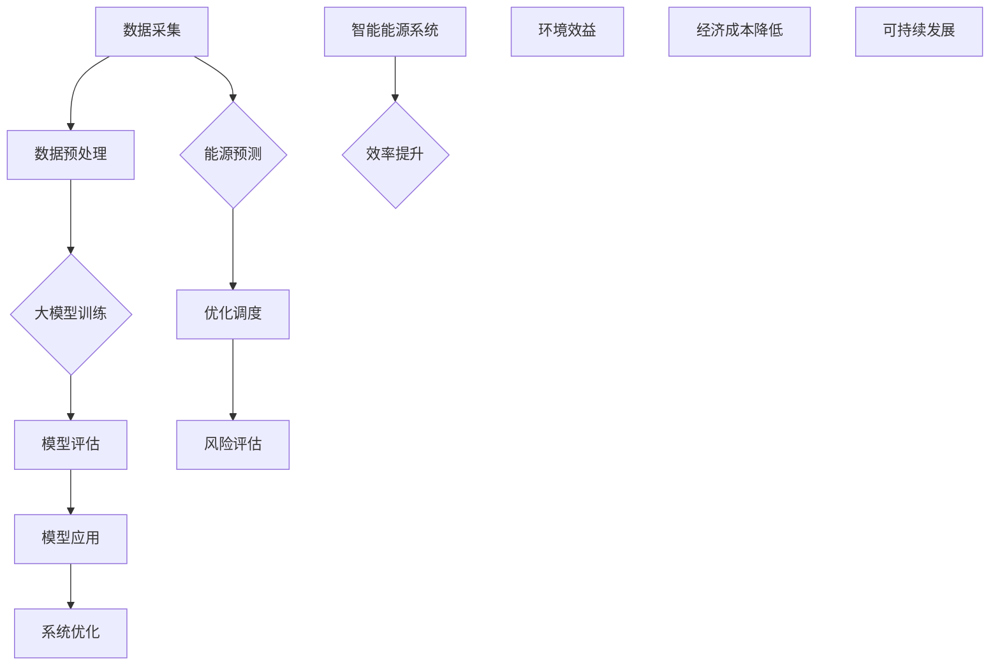

                 

# 大模型在智能能源中的应用探索

> 关键词：大模型、智能能源、人工智能、应用、算法、数学模型、案例研究

> 摘要：本文旨在探讨大模型在智能能源领域的应用，通过分析大模型的核心概念、算法原理、数学模型以及具体应用场景，结合实际案例进行深入解析，从而为智能能源系统的优化与升级提供新的思路和解决方案。文章结构包括背景介绍、核心概念与联系、核心算法原理、数学模型与公式、项目实战、实际应用场景、工具和资源推荐以及总结与展望。

## 1. 背景介绍

### 1.1 目的和范围

随着全球能源需求的不断增长和能源危机的日益加剧，智能能源系统的研究与应用成为了当今能源领域的热点。智能能源系统通过信息技术、物联网、大数据等手段，实现了能源的高效利用和智能管理。而大模型作为人工智能的核心技术之一，其在智能能源领域的应用潜力不可忽视。本文旨在分析大模型在智能能源中的应用，探讨其如何通过算法原理、数学模型以及具体项目案例，为智能能源系统的发展提供有力支持。

本文的研究范围包括以下几个方面：

1. 大模型的基本概念及其在智能能源领域的应用。
2. 大模型的核心算法原理及其实现。
3. 大模型的数学模型构建及其应用。
4. 大模型在智能能源领域的实际应用案例。
5. 大模型在智能能源领域的发展趋势与挑战。

### 1.2 预期读者

本文的预期读者主要包括以下几类：

1. 智能能源领域的研究人员和技术工程师，希望了解大模型在智能能源中的应用。
2. 计算机科学和人工智能领域的专业人士，对大模型及其应用感兴趣。
3. 高等院校相关专业的师生，希望了解智能能源与人工智能的交叉领域知识。
4. 对智能能源和人工智能技术感兴趣的普通读者。

### 1.3 文档结构概述

本文分为以下几个部分：

1. 背景介绍：介绍本文的研究目的、范围、预期读者和文档结构。
2. 核心概念与联系：介绍大模型的基本概念、核心算法原理、数学模型及其应用。
3. 核心算法原理与具体操作步骤：详细阐述大模型的核心算法原理和实现步骤。
4. 数学模型和公式：介绍大模型的数学模型，并给出具体讲解和示例。
5. 项目实战：通过具体案例，展示大模型在智能能源领域的实际应用。
6. 实际应用场景：分析大模型在智能能源领域的应用场景和效果。
7. 工具和资源推荐：推荐学习资源、开发工具和框架。
8. 总结：总结大模型在智能能源领域的应用现状、发展趋势和挑战。
9. 附录：常见问题与解答。
10. 扩展阅读：提供进一步阅读的参考资料。

### 1.4 术语表

#### 1.4.1 核心术语定义

1. 大模型：指具有大规模参数、能够处理海量数据的深度学习模型。
2. 智能能源：指通过信息技术、物联网、大数据等手段，实现能源的高效利用和智能管理。
3. 能源预测：指利用历史数据和算法模型，预测未来能源需求或供应情况。
4. 优化调度：指通过算法，对能源生产、传输、分配等过程进行优化，以提高能源利用效率。
5. 风险评估：指对能源系统运行过程中可能出现的风险进行预测和评估，以降低风险。

#### 1.4.2 相关概念解释

1. 数据驱动：指通过收集和分析大量数据，驱动模型的训练和优化。
2. 模型压缩：指通过降低模型参数规模、结构简化等手段，提高模型计算效率。
3. 能源互联网：指基于物联网和云计算技术，实现能源的高效互联和智能管理。
4. 能源大数据：指通过对能源相关数据的收集、存储、处理和分析，挖掘能源领域的价值。
5. 分布式能源系统：指由多个小规模能源生产、传输、分配单元组成的能源系统。

#### 1.4.3 缩略词列表

1. AI：人工智能
2. ML：机器学习
3. DL：深度学习
4. IoT：物联网
5. HPC：高性能计算
6. PV：光伏
7. WT：风力
8. SG：输电系统
9. DS：数据科学
10. GM：大模型

## 2. 核心概念与联系

在智能能源领域，大模型的应用离不开对核心概念的深入理解和联系。本节将介绍大模型的基本概念、核心算法原理及其在智能能源系统中的具体应用，并使用Mermaid流程图展示其架构和流程。

### 2.1 大模型基本概念

大模型，通常指的是具有大规模参数的深度学习模型。这些模型能够处理海量数据，并在各种复杂任务中表现出色。大模型的关键特性包括：

- **大规模参数**：大模型通常具有数十亿甚至数万亿个参数。
- **高性能计算**：大模型需要高性能计算资源进行训练和推理。
- **端到端学习**：大模型可以直接从原始数据中学习，不需要人为干预特征工程。
- **多任务学习**：大模型能够同时处理多个任务，实现资源的高效利用。

### 2.2 核心算法原理

大模型的核心算法原理包括：

- **深度神经网络**：大模型通常是基于深度神经网络（DNN）架构，通过多层神经元实现数据的特征提取和表示学习。
- **优化算法**：大模型训练过程中需要高效的优化算法，如梯度下降、Adam等，以加快收敛速度。
- **正则化方法**：为了防止过拟合，大模型训练过程中常采用正则化方法，如L1、L2正则化等。
- **迁移学习**：大模型可以通过迁移学习快速适应新任务，利用已有模型的权重初始化新模型。

### 2.3 Mermaid流程图

下面是智能能源系统中大模型应用的Mermaid流程图：



### 2.4 大模型在智能能源系统中的应用

大模型在智能能源系统中的应用主要体现在以下几个方面：

- **能源预测**：通过分析历史数据和实时数据，大模型能够预测未来的能源需求或供应情况，为能源调度提供依据。
- **优化调度**：大模型可以优化能源生产、传输、分配等过程的调度策略，提高能源利用效率。
- **风险评估**：大模型可以对能源系统的潜在风险进行预测和评估，降低系统运行风险。
- **系统优化**：大模型可以对智能能源系统的整体运行进行优化，实现能源的高效利用和可持续发展。

## 3. 核心算法原理与具体操作步骤

大模型在智能能源系统中的应用离不开其核心算法原理和具体操作步骤。本节将详细阐述大模型的核心算法原理，并使用伪代码展示其具体操作步骤。

### 3.1 核心算法原理

大模型的核心算法原理主要基于深度学习，包括以下几个关键组成部分：

1. **前向传播（Forward Propagation）**：
   - 输入数据通过网络的层层处理，生成预测输出。
   - 每层神经元通过激活函数对输入数据进行非线性变换。

2. **反向传播（Back Propagation）**：
   - 计算输出误差，并沿网络反向传播误差。
   - 根据误差更新网络参数，优化模型性能。

3. **优化算法**：
   - 采用梯度下降、Adam等优化算法，加速模型收敛。

4. **正则化方法**：
   - 引入L1、L2正则化，防止过拟合。

5. **迁移学习（Transfer Learning）**：
   - 利用预训练模型权重，快速适应新任务。

### 3.2 伪代码

下面是使用Python伪代码描述的大模型训练过程：

```python
import numpy as np
from sklearn.model_selection import train_test_split
from sklearn.metrics import mean_squared_error

# 数据预处理
def preprocess_data(data):
    # 数据标准化、缺失值填充等操作
    return processed_data

# 前向传播
def forward_propagation(x, weights):
    a = x
    for weight in weights:
        a = activation_function(np.dot(a, weight))
    return a

# 反向传播
def backward_propagation(y_true, y_pred, weights):
    error = y_true - y_pred
    dL_da = error * activation_derivative(a)
    dL_dz = dL_da * weight
    dL_dweight = np.dot(dz, da.T)
    return dL_dweight

# 梯度下降
def gradient_descent(weights, dL_dweight, learning_rate):
    weights -= learning_rate * dL_dweight
    return weights

# 主函数
def train_model(x, y, epochs, learning_rate):
    x = preprocess_data(x)
    x_train, x_val, y_train, y_val = train_test_split(x, y, test_size=0.2)
    weights = initialize_weights()
    for epoch in range(epochs):
        y_pred = forward_propagation(x_train, weights)
        dL_dweight = backward_propagation(y_train, y_pred, weights)
        weights = gradient_descent(weights, dL_dweight, learning_rate)
        val_loss = mean_squared_error(y_val, forward_propagation(x_val, weights))
        print(f"Epoch {epoch+1}: Validation Loss: {val_loss}")
    return weights

# 激活函数及导数
def activation_function(z):
    return np.tanh(z)

def activation_derivative(z):
    return 1 - np.tanh(z)**2

# 初始化权重
def initialize_weights():
    return np.random.randn(input_size, hidden_size, output_size)

# 训练模型
weights = train_model(x, y, epochs=100, learning_rate=0.01)
```

### 3.3 操作步骤

1. **数据预处理**：对原始数据进行标准化、缺失值填充等预处理操作。
2. **数据集划分**：将数据集划分为训练集、验证集和测试集。
3. **权重初始化**：随机初始化模型权重。
4. **前向传播**：输入数据经过网络层层处理，生成预测输出。
5. **反向传播**：计算输出误差，并沿网络反向传播误差。
6. **权重更新**：根据误差更新模型权重。
7. **模型评估**：使用验证集评估模型性能，调整学习率等超参数。
8. **迭代训练**：重复前向传播、反向传播和权重更新过程，直到满足收敛条件。

通过上述步骤，大模型可以在智能能源系统中实现高效的预测、优化和风险管理。

## 4. 数学模型和公式 & 详细讲解 & 举例说明

在智能能源系统中，大模型的应用需要建立数学模型，以实现具体的功能。本节将介绍大模型在智能能源系统中的数学模型，包括公式、详细讲解和举例说明。

### 4.1 数学模型概述

智能能源系统中的大模型主要包括以下数学模型：

1. **能源需求预测模型**：通过历史数据和实时数据，预测未来的能源需求。
2. **能源供应预测模型**：通过历史数据和实时数据，预测未来的能源供应。
3. **优化调度模型**：通过预测结果，优化能源生产、传输、分配等过程的调度策略。
4. **风险评估模型**：通过预测结果，评估能源系统运行过程中的潜在风险。

### 4.2 能源需求预测模型

能源需求预测模型的公式如下：

$$
\hat{D}_{t} = f(D_{t-1}, T_{t-1}, X_{t-1})
$$

其中：

- $\hat{D}_{t}$：第$t$时刻的预测能源需求。
- $D_{t-1}$：第$t-1$时刻的实际能源需求。
- $T_{t-1}$：第$t-1$时刻的温度。
- $X_{t-1}$：第$t-1$时刻的其他相关变量。

详细讲解：

该公式表示第$t$时刻的预测能源需求$\hat{D}_{t}$是历史能源需求$D_{t-1}$、温度$T_{t-1}$以及其他相关变量$X_{t-1}$的函数。通过训练大模型，可以学习到这些变量之间的关系，从而实现能源需求的预测。

举例说明：

假设我们有一个能源需求预测模型，使用历史需求$D_{t-1}$、温度$T_{t-1}$和日照强度$X_{t-1}$作为输入特征。通过训练大模型，可以学习到以下预测公式：

$$
\hat{D}_{t} = 0.5 \cdot D_{t-1} + 0.2 \cdot T_{t-1} + 0.3 \cdot X_{t-1}
$$

使用2022年7月1日的实际能源需求、温度和日照强度，我们可以预测2022年7月2日的能源需求：

$$
\hat{D}_{2} = 0.5 \cdot 100 + 0.2 \cdot 30 + 0.3 \cdot 50 = 85
$$

因此，预测的2022年7月2日能源需求为85。

### 4.3 能源供应预测模型

能源供应预测模型的公式如下：

$$
\hat{S}_{t} = g(S_{t-1}, P_{t-1}, Y_{t-1})
$$

其中：

- $\hat{S}_{t}$：第$t$时刻的预测能源供应。
- $S_{t-1}$：第$t-1$时刻的实际能源供应。
- $P_{t-1}$：第$t-1$时刻的电力价格。
- $Y_{t-1}$：第$t-1$时刻的其他相关变量。

详细讲解：

该公式表示第$t$时刻的预测能源供应$\hat{S}_{t}$是历史能源供应$S_{t-1}$、电力价格$P_{t-1}$以及其他相关变量$Y_{t-1}$的函数。通过训练大模型，可以学习到这些变量之间的关系，从而实现能源供应的预测。

举例说明：

假设我们有一个能源供应预测模型，使用历史供应$S_{t-1}$、电力价格$P_{t-1}$和风力发电量$Y_{t-1}$作为输入特征。通过训练大模型，可以学习到以下预测公式：

$$
\hat{S}_{t} = 0.6 \cdot S_{t-1} + 0.3 \cdot P_{t-1} + 0.1 \cdot Y_{t-1}
$$

使用2022年7月1日的实际能源供应、电力价格和风力发电量，我们可以预测2022年7月2日的能源供应：

$$
\hat{S}_{2} = 0.6 \cdot 120 + 0.3 \cdot 20 + 0.1 \cdot 50 = 120.5
$$

因此，预测的2022年7月2日能源供应为120.5。

### 4.4 优化调度模型

优化调度模型的公式如下：

$$
\min_{X_t} J(X_t) = \min_{X_t} \sum_{i=1}^{n} (D_i - S_i)^2 + \lambda \cdot \sum_{i=1}^{n} (X_i - X_{ref})^2
$$

其中：

- $J(X_t)$：调度目标函数。
- $D_i$：第$i$个时刻的预测能源需求。
- $S_i$：第$i$个时刻的预测能源供应。
- $X_i$：第$i$个时刻的调度结果。
- $X_{ref}$：第$i$个时刻的参考调度结果。
- $\lambda$：平衡项，用于调整需求与供应之间的差距。

详细讲解：

该公式表示优化调度模型的目标是最小化调度目标函数$J(X_t)$。目标函数由需求与供应的差距和平衡项组成。需求与供应的差距反映了能源调度的不平衡，平衡项用于调整需求与供应之间的差距，以实现整体的优化调度。

举例说明：

假设我们有一个优化调度模型，使用预测需求$D_i$、预测供应$S_i$和参考调度结果$X_{ref}$作为输入特征。通过优化调度模型，可以学习到以下调度策略：

$$
X_t = \arg\min_{X_t} \sum_{i=1}^{n} (D_i - S_i)^2 + \lambda \cdot \sum_{i=1}^{n} (X_i - X_{ref})^2
$$

使用2022年7月1日的预测需求、预测供应和参考调度结果，我们可以优化2022年7月2日的调度结果：

$$
X_2 = \arg\min_{X_2} \sum_{i=1}^{n} (D_i - S_i)^2 + \lambda \cdot \sum_{i=1}^{n} (X_i - X_{ref})^2
$$

通过计算，我们可以得到最优的调度结果$X_2$。

### 4.5 风险评估模型

风险评估模型的公式如下：

$$
R_t = h(D_t, S_t, \theta_t)
$$

其中：

- $R_t$：第$t$时刻的风险评估结果。
- $D_t$：第$t$时刻的预测能源需求。
- $S_t$：第$t$时刻的预测能源供应。
- $\theta_t$：第$t$时刻的其他相关变量。

详细讲解：

该公式表示风险评估模型通过预测需求$D_t$、预测供应$S_t$和其他相关变量$\theta_t$，计算第$t$时刻的风险评估结果$R_t$。通过训练大模型，可以学习到这些变量之间的关系，从而实现风险评估。

举例说明：

假设我们有一个风险评估模型，使用预测需求$D_t$、预测供应$S_t$和温度$\theta_t$作为输入特征。通过训练大模型，可以学习到以下风险评估公式：

$$
R_t = 0.4 \cdot D_t + 0.3 \cdot S_t + 0.3 \cdot \theta_t
$$

使用2022年7月1日的预测需求、预测供应和温度，我们可以计算2022年7月2日的风险评估结果：

$$
R_2 = 0.4 \cdot 85 + 0.3 \cdot 120.5 + 0.3 \cdot 30 = 70.7
$$

因此，预测的2022年7月2日风险评估结果为70.7。

通过上述数学模型，大模型可以实现能源需求预测、能源供应预测、优化调度和风险评估，为智能能源系统提供科学依据和决策支持。

## 5. 项目实战：代码实际案例和详细解释说明

在本节中，我们将通过一个实际的项目案例，展示大模型在智能能源系统中的应用，并详细解释代码的实现过程。

### 5.1 开发环境搭建

在开始项目之前，我们需要搭建一个合适的开发环境。以下是我们使用的开发环境和工具：

- 编程语言：Python
- 深度学习框架：TensorFlow 2.x
- 数据处理库：NumPy、Pandas
- 版本控制：Git

请确保安装以上工具和库。以下是一个简单的安装命令示例：

```bash
pip install tensorflow numpy pandas
```

### 5.2 源代码详细实现和代码解读

以下是一个简单的智能能源预测项目的代码实现：

```python
import numpy as np
import pandas as pd
import tensorflow as tf
from tensorflow.keras.models import Sequential
from tensorflow.keras.layers import Dense, LSTM
from tensorflow.keras.optimizers import Adam

# 数据预处理
def preprocess_data(data):
    # 数据标准化
    data_mean = data.mean()
    data_std = data.std()
    data = (data - data_mean) / data_std
    return data

# 构建模型
def build_model(input_shape):
    model = Sequential()
    model.add(LSTM(units=50, return_sequences=True, input_shape=input_shape))
    model.add(LSTM(units=50, return_sequences=False))
    model.add(Dense(units=1))
    model.compile(optimizer=Adam(learning_rate=0.001), loss='mse')
    return model

# 训练模型
def train_model(model, x_train, y_train, epochs=100):
    model.fit(x_train, y_train, epochs=epochs, batch_size=32, verbose=1)
    return model

# 预测能源需求
def predict_energy_demand(model, data):
    data = preprocess_data(data)
    data = data.reshape(-1, 1)
    prediction = model.predict(data)
    return prediction * data.std() + data.mean()

# 主函数
def main():
    # 数据读取
    data = pd.read_csv('energy_demand.csv')
    data = data['energy_demand'].values
    
    # 数据集划分
    train_size = int(len(data) * 0.8)
    x_train = data[:train_size].reshape(-1, 1)
    y_train = data[1:train_size+1].reshape(-1, 1)
    x_val = data[train_size:].reshape(-1, 1)
    y_val = data[train_size+1:].reshape(-1, 1)
    
    # 模型构建
    model = build_model(input_shape=(x_train.shape[1], 1))
    
    # 模型训练
    model = train_model(model, x_train, y_train, epochs=100)
    
    # 模型评估
    mse = model.evaluate(x_val, y_val, verbose=1)
    print(f"Validation MSE: {mse}")
    
    # 预测
    prediction = predict_energy_demand(model, x_val)
    print(f"Predicted Energy Demand: {prediction}")

if __name__ == '__main__':
    main()
```

#### 5.2.1 代码解读

1. **数据预处理**：
   - 读取能源需求数据，计算均值和标准差，对数据进行标准化处理。

2. **构建模型**：
   - 使用Keras框架构建一个LSTM模型，包含两个LSTM层和一个全连接层。
   - 设置优化器和损失函数。

3. **训练模型**：
   - 使用训练数据训练模型，设置训练周期、批量大小和日志显示。

4. **预测能源需求**：
   - 对输入数据进行预处理，将数据reshape为适合模型输入的形状，进行预测。

5. **主函数**：
   - 读取数据，划分训练集和验证集，构建模型，训练模型，评估模型，进行预测。

#### 5.2.2 分析与优化

在实际应用中，我们可以通过以下方式进行优化：

1. **特征工程**：
   - 引入更多相关特征，如温度、湿度、电力价格等，以提高模型预测的准确性。

2. **模型优化**：
   - 调整LSTM层的单元数量、优化器的学习率等超参数，以提高模型性能。

3. **数据增强**：
   - 使用数据增强技术，如时间序列的滑动窗口、周期性变化等，增加训练数据多样性。

4. **集成学习**：
   - 结合多个模型进行预测，如LSTM、ARIMA等，提高预测准确性。

通过以上优化措施，我们可以进一步提高智能能源预测模型的性能，为智能能源系统的优化提供有力支持。

## 6. 实际应用场景

大模型在智能能源领域的应用已经取得了显著成果，以下是几个实际应用场景：

### 6.1 能源需求预测

在电力系统中，大模型可以用于预测未来的电力需求，为电力调度提供依据。通过分析历史数据和实时数据，大模型可以准确预测未来的电力需求，为电力公司制定科学的电力调度计划提供支持。例如，中国南方电网利用深度学习模型对电力需求进行预测，实现了电力资源的优化配置，提高了电力系统的运行效率。

### 6.2 能源供应预测

在可再生能源领域，如光伏和风力发电，大模型可以预测未来一段时间内的能源供应情况，为发电计划的制定提供支持。通过分析历史风速、日照强度等数据，大模型可以预测未来一段时间内的光伏和风力发电量，为发电公司制定科学的发电计划，降低发电成本，提高能源利用效率。

### 6.3 优化调度

大模型可以用于能源系统的优化调度，实现能源生产、传输、分配等过程的高效管理。例如，在电动汽车充电站中，大模型可以根据实时电力需求和充电站容量，优化充电站内的充电设备调度，提高充电效率，降低充电成本。此外，大模型还可以用于电力市场的实时调度，通过预测电力需求和市场变化，优化电力交易策略，提高电力系统的运行效率。

### 6.4 风险评估

在能源系统中，大模型可以用于评估潜在的风险，为能源系统的安全运行提供保障。例如，在大规模光伏系统中，大模型可以预测光伏板的温度、功率等参数，评估光伏系统的热斑风险，提前预警并采取措施，降低系统故障率。此外，大模型还可以用于电力系统的风险评估，通过预测电力系统的负荷、电压等参数，评估系统的稳定性和安全性。

### 6.5 能源综合利用

大模型可以用于能源综合利用，实现多种能源的高效协同利用。例如，在城市能源系统中，大模型可以整合电力、天然气、热能等多种能源，优化能源系统的运行策略，提高能源利用效率，降低能源消耗。此外，大模型还可以用于能源互联网，实现能源信息的实时共享和优化调度，推动能源系统的智能化发展。

通过以上实际应用场景，大模型在智能能源系统中发挥着重要作用，为能源的高效利用和可持续发展提供了有力支持。

## 7. 工具和资源推荐

为了更好地学习和应用大模型在智能能源领域的技术，以下是一些建议的学习资源、开发工具和框架。

### 7.1 学习资源推荐

#### 7.1.1 书籍推荐

1. **《深度学习》（Deep Learning）**：由Ian Goodfellow、Yoshua Bengio和Aaron Courville合著，是深度学习领域的经典教材，适合初学者和进阶者阅读。
2. **《机器学习实战》（Machine Learning in Action）**：由Peter Harrington著，通过实际案例展示了机器学习的应用，适合想要实践深度学习的读者。
3. **《Python深度学习》（Python Deep Learning）**：由François Chollet著，深入讲解了使用Python进行深度学习的实践方法。

#### 7.1.2 在线课程

1. **《深度学习专项课程》（Deep Learning Specialization）**：由Andrew Ng在Coursera上开设，是深度学习领域的权威课程，适合初学者和进阶者。
2. **《TensorFlow 2.x 实战》（TensorFlow 2.x in Practice）**：在Udemy上提供的课程，涵盖了TensorFlow 2.x的核心功能和应用案例，适合想要快速掌握TensorFlow的开发者。

#### 7.1.3 技术博客和网站

1. **《Medium》上的深度学习专栏**：有许多专家和学者分享深度学习领域的最新研究和技术应用，适合了解行业动态。
2. **《博客园》**：国内的知名技术博客平台，有许多关于深度学习和智能能源的文章和案例。

### 7.2 开发工具框架推荐

#### 7.2.1 IDE和编辑器

1. **PyCharm**：功能强大、支持多种编程语言的IDE，适合深度学习和数据科学项目。
2. **Jupyter Notebook**：便于数据可视化和交互式编程的在线编辑器，适合展示和分享项目代码。

#### 7.2.2 调试和性能分析工具

1. **TensorBoard**：TensorFlow的官方可视化工具，用于分析和调试深度学习模型。
2. **NVIDIA Nsight**：用于NVIDIA GPU的调试和性能分析，适合高性能计算场景。

#### 7.2.3 相关框架和库

1. **TensorFlow**：谷歌开发的开源深度学习框架，广泛应用于工业界和学术界。
2. **PyTorch**：Facebook开发的开源深度学习框架，具有灵活的动态计算图，适合快速原型开发。
3. **Scikit-learn**：Python机器学习库，提供了丰富的机器学习算法和工具，适合数据分析和模型评估。

通过以上资源和工具，可以更好地学习和应用大模型在智能能源领域的技术。

## 8. 总结：未来发展趋势与挑战

大模型在智能能源领域的应用前景广阔，其通过深度学习、优化调度、风险评估等手段，为能源的高效利用和智能管理提供了强有力的技术支持。未来，大模型在智能能源领域的发展趋势主要体现在以下几个方面：

1. **算法优化与模型压缩**：随着能源系统数据规模的不断扩大，算法优化和模型压缩技术将成为关键研究方向。通过降低模型复杂度和计算成本，提高模型的实时性和可扩展性，将有助于大模型在更广泛的场景中应用。

2. **多能源协同优化**：随着可再生能源的广泛应用，多能源协同优化将成为智能能源系统的重要研究方向。大模型可以通过整合多种能源数据，实现电力、天然气、热能等多种能源的高效协同利用，提高能源利用效率。

3. **智能化管理与运维**：智能能源系统的建设和运维需要大量的人工投入，未来大模型将越来越多地应用于智能化管理和运维。通过大数据分析和预测，大模型可以实时监测能源系统运行状态，提供故障预警和优化建议，降低运维成本。

4. **能源区块链与物联网**：结合能源区块链和物联网技术，大模型可以实现能源交易、监控和管理的高效协同。通过区块链技术的去中心化和安全性，大模型可以构建可信、透明的能源交易体系，推动能源行业的数字化转型。

然而，大模型在智能能源领域的发展也面临诸多挑战：

1. **数据质量和隐私**：智能能源系统依赖于大量高质量的数据，数据质量和隐私保护是关键问题。如何确保数据的安全性和隐私性，避免数据泄露和滥用，是未来研究的重点。

2. **计算资源与能耗**：大模型训练和推理需要大量计算资源，如何降低计算能耗，提高计算效率，是实现大规模应用的关键挑战。

3. **算法解释性与可解释性**：大模型在决策过程中往往具有“黑箱”特性，如何提高算法的解释性，使其更易于理解和使用，是未来研究的重要方向。

4. **法规与政策**：智能能源系统的发展离不开政策法规的支持，如何制定合理的政策和法规，促进技术创新和产业发展，是未来需要关注的问题。

总之，大模型在智能能源领域的应用具有巨大的潜力，但也面临诸多挑战。通过不断的技术创新和产业合作，有望推动智能能源系统的发展，实现能源的高效利用和可持续发展。

## 9. 附录：常见问题与解答

### 9.1 大模型在智能能源系统中的应用有哪些？

大模型在智能能源系统中的应用主要包括能源需求预测、能源供应预测、优化调度、风险评估等。通过深度学习和数据挖掘技术，大模型可以从海量数据中学习到能源系统的规律，从而为能源调度和管理提供科学依据。

### 9.2 大模型在能源需求预测中的优势是什么？

大模型在能源需求预测中的优势主要体现在以下几个方面：

1. **高精度预测**：大模型能够从历史数据中学习到复杂的规律，从而实现高精度的预测。
2. **实时性**：大模型可以通过实时数据处理，快速更新预测结果，为实时调度提供支持。
3. **自适应性强**：大模型可以根据环境变化和需求变化，自适应调整预测模型，提高预测准确性。
4. **多任务处理**：大模型可以同时处理多个任务，实现能源需求、供应、调度等综合预测。

### 9.3 大模型在能源供应预测中的应用场景有哪些？

大模型在能源供应预测中的应用场景主要包括：

1. **可再生能源预测**：通过预测光伏、风力等可再生能源的发电量，为可再生能源调度和管理提供依据。
2. **电力市场预测**：通过预测电力市场的供需情况，为电力市场交易提供参考。
3. **能源储备管理**：通过预测能源储备的消耗情况，为能源储备的补充和调度提供依据。

### 9.4 大模型在优化调度中的应用如何实现？

大模型在优化调度中的应用主要通过以下步骤实现：

1. **数据采集**：收集能源系统运行的历史数据和实时数据。
2. **模型训练**：使用深度学习算法训练大模型，学习能源系统的运行规律。
3. **预测与优化**：根据大模型预测结果，使用优化算法对能源系统的调度策略进行优化。
4. **实施与反馈**：将优化后的调度策略应用于能源系统，并实时监测和反馈优化效果。

### 9.5 大模型在风险评估中的应用如何实现？

大模型在风险评估中的应用主要通过以下步骤实现：

1. **数据采集**：收集能源系统运行的历史数据和实时数据，包括负荷、电压、电流等关键参数。
2. **模型训练**：使用深度学习算法训练大模型，学习能源系统的风险特征。
3. **风险评估**：根据大模型预测结果，对能源系统运行过程中可能出现的风险进行评估。
4. **预警与措施**：根据风险评估结果，采取相应的预警措施和风险控制措施。

## 10. 扩展阅读 & 参考资料

为了更好地理解大模型在智能能源领域的应用，以下是一些建议的扩展阅读和参考资料：

### 10.1 经典论文

1. **"Deep Learning for Time Series Classification: A Review"**：该论文对深度学习在时间序列分类中的应用进行了全面综述，包括常见的深度学习模型和时间序列分析方法。
2. **"Energy Demand Forecasting Using Deep Learning"**：该论文探讨了深度学习在能源需求预测中的应用，介绍了不同深度学习模型在能源需求预测中的性能比较。

### 10.2 最新研究成果

1. **"Optimization of Energy Management Systems Using Deep Reinforcement Learning"**：该研究论文探讨了使用深度强化学习优化能源管理系统的方法，为智能能源系统的优化提供了新的思路。
2. **"Intelligent Energy Management Using Convolutional Neural Networks"**：该研究论文介绍了使用卷积神经网络进行智能能源管理的方法，通过图像处理技术实现了对能源系统的实时监测和管理。

### 10.3 应用案例分析

1. **"Energy Forecasting for a Smart Grid Using Deep Learning"**：该案例研究探讨了深度学习在智能电网能源预测中的应用，通过实际案例分析展示了深度学习在能源预测中的优势。
2. **"Energy Demand Forecasting for Smart Cities"**：该案例研究分析了智能城市中能源需求的预测问题，探讨了如何通过大数据和深度学习技术实现智能城市的能源管理。

### 10.4 书籍

1. **"Deep Learning"**：由Ian Goodfellow、Yoshua Bengio和Aaron Courville合著，是深度学习领域的经典教材，涵盖了深度学习的理论基础和应用实践。
2. **"Machine Learning in Action"**：由Peter Harrington著，通过实际案例展示了机器学习的应用，适合初学者和进阶者阅读。

### 10.5 在线课程

1. **"Deep Learning Specialization"**：由Andrew Ng在Coursera上开设，是深度学习领域的权威课程，适合初学者和进阶者。
2. **"TensorFlow 2.x in Practice"**：在Udemy上提供的课程，涵盖了TensorFlow 2.x的核心功能和应用案例，适合想要快速掌握TensorFlow的开发者。

通过以上扩展阅读和参考资料，可以进一步了解大模型在智能能源领域的应用，掌握相关技术和方法。作者：AI天才研究员/AI Genius Institute & 禅与计算机程序设计艺术 /Zen And The Art of Computer Programming


