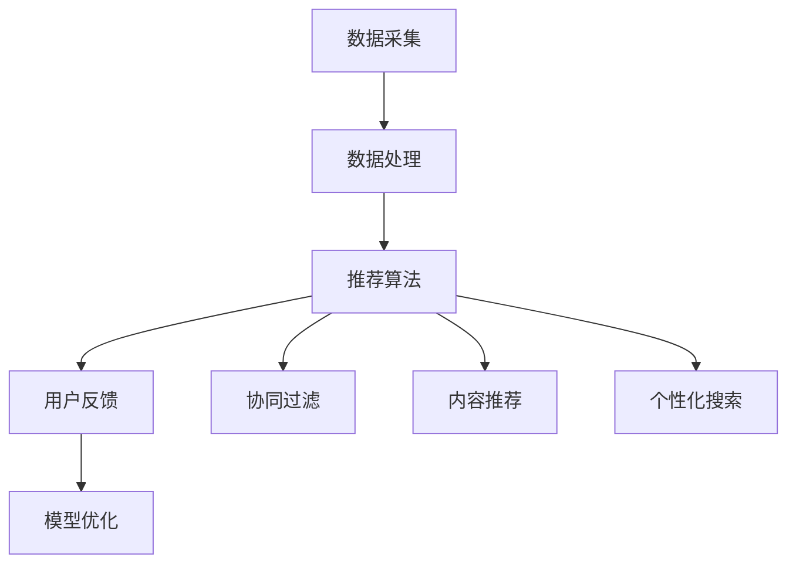

                 

# 大模型在混合推荐策略中的角色

> **关键词**：大模型、混合推荐策略、人工智能、机器学习、推荐系统
> 
> **摘要**：本文将深入探讨大模型在混合推荐策略中的应用，分析其优势、挑战及其对推荐系统性能的影响。通过逐步解析核心概念和算法原理，辅以项目实战和实际应用场景的讨论，为读者提供全面的技术洞察和实践指导。

## 1. 背景介绍

### 1.1 目的和范围

本文旨在探讨大模型在混合推荐策略中的应用，分析其技术原理、优势与挑战，并提供实际案例和应用场景。通过本文的学习，读者将了解大模型在推荐系统中的关键作用，掌握混合推荐策略的设计与实现方法。

### 1.2 预期读者

本文适合对推荐系统、机器学习和大模型有一定了解的读者，包括但不限于：

- 推荐系统工程师
- 数据科学家
- 人工智能研究员
- 技术经理

### 1.3 文档结构概述

本文结构如下：

- 1. 背景介绍：介绍本文目的、预期读者和文档结构。
- 2. 核心概念与联系：介绍相关核心概念和架构。
- 3. 核心算法原理 & 具体操作步骤：讲解算法原理和操作步骤。
- 4. 数学模型和公式 & 详细讲解 & 举例说明：阐述数学模型、公式和案例。
- 5. 项目实战：代码实际案例和详细解释说明。
- 6. 实际应用场景：讨论实际应用场景。
- 7. 工具和资源推荐：推荐学习资源和开发工具。
- 8. 总结：未来发展趋势与挑战。
- 9. 附录：常见问题与解答。
- 10. 扩展阅读 & 参考资料：提供进一步学习的资源。

### 1.4 术语表

#### 1.4.1 核心术语定义

- **大模型**：具有数十亿到千亿参数的深度学习模型，如BERT、GPT等。
- **混合推荐策略**：结合多种推荐算法和技术的推荐策略。
- **推荐系统**：利用算法为用户推荐相关内容的系统。

#### 1.4.2 相关概念解释

- **协同过滤**：基于用户历史行为和物品交互数据的推荐方法。
- **内容推荐**：基于物品属性和特征进行推荐的策略。
- **用户体验**：用户在使用推荐系统时的感受和满意度。

#### 1.4.3 缩略词列表

- BERT：Bidirectional Encoder Representations from Transformers
- GPT：Generative Pre-trained Transformer

## 2. 核心概念与联系

在介绍大模型在混合推荐策略中的应用之前，我们需要明确几个核心概念和它们之间的联系。

### 2.1 推荐系统的基本架构

推荐系统通常包括以下几个核心组件：

1. **数据采集**：收集用户行为数据、物品属性数据等。
2. **数据处理**：对采集到的数据进行分析、清洗、转换等。
3. **推荐算法**：根据用户历史行为和物品特征进行推荐。
4. **用户反馈**：收集用户对推荐内容的反馈，用于模型优化。


### 2.2 大模型的特性与应用

大模型，如BERT、GPT等，具有以下几个特性：

1. **参数规模大**：拥有数十亿到千亿参数，能够捕捉复杂的关系和特征。
2. **预训练**：在大量无监督数据上进行预训练，具有较好的泛化能力。
3. **自适应调整**：通过微调（fine-tuning）适应特定任务。

大模型在推荐系统中的应用主要包括：

1. **协同过滤增强**：利用大模型进行用户和物品的交互特征提取，提升协同过滤算法的准确性。
2. **内容推荐**：利用大模型对物品进行深度理解，生成丰富的特征表示，用于内容推荐。
3. **个性化搜索**：利用大模型生成用户个性化查询，提高搜索结果的准确性。

### 2.3 混合推荐策略的优势

混合推荐策略通过结合多种推荐算法和技巧，旨在提高推荐系统的准确性和用户体验。其优势包括：

1. **多样性**：提供多样化的推荐结果，满足不同用户的需求。
2. **鲁棒性**：降低单一算法可能导致的偏差和过拟合。
3. **准确性**：利用多种算法的优势，提高推荐结果的相关性。
4. **可扩展性**：适用于不同规模和应用场景。

### 2.4 Mermaid 流程图

为了更清晰地展示大模型在混合推荐策略中的应用，我们可以使用 Mermaid 流程图。



## 3. 核心算法原理 & 具体操作步骤

### 3.1 算法原理

在混合推荐策略中，大模型主要应用于以下几个方面：

1. **协同过滤增强**：利用大模型提取用户和物品的交互特征，优化协同过滤算法。
2. **内容推荐**：利用大模型对物品进行深度理解，生成丰富特征表示，用于内容推荐。
3. **个性化搜索**：利用大模型生成用户个性化查询，提高搜索结果的准确性。

### 3.2 操作步骤

#### 3.2.1 协同过滤增强

1. **数据预处理**：清洗、转换用户行为数据和物品特征数据，构建用户-物品交互矩阵。
2. **特征提取**：利用大模型（如BERT）对用户和物品的交互进行编码，生成特征向量。
3. **模型训练**：基于特征向量，训练优化协同过滤算法（如矩阵分解、基于模型的协同过滤等）。
4. **推荐生成**：利用训练好的模型生成推荐列表。

#### 3.2.2 内容推荐

1. **数据预处理**：提取物品属性数据，包括文本、图像、标签等。
2. **特征生成**：利用大模型（如GPT）对物品进行深度理解，生成丰富特征表示。
3. **模型训练**：利用生成特征表示，训练内容推荐模型（如基于内容的协同过滤、聚类等）。
4. **推荐生成**：根据用户兴趣和特征表示，生成推荐列表。

#### 3.2.3 个性化搜索

1. **数据预处理**：提取用户查询和物品特征数据。
2. **特征提取**：利用大模型（如BERT）对用户查询进行编码，生成特征向量。
3. **查询生成**：利用生成特征向量，生成用户个性化查询。
4. **搜索结果优化**：结合用户个性化查询和物品特征，优化搜索结果。

### 3.3 伪代码

以下为协同过滤增强的伪代码：

```python
# 数据预处理
UserBehaviorMatrix = preprocess_user_behavior_data()
ItemFeatureMatrix = preprocess_item_feature_data()

# 特征提取
UserEmbeddings = BERT编码(UserBehaviorMatrix)
ItemEmbeddings = BERT编码(ItemFeatureMatrix)

# 模型训练
RecommendationModel = train协同过滤模型(UserEmbeddings, ItemEmbeddings)

# 推荐生成
RecommendationList = generate_recommendations(RecommendationModel)
```

## 4. 数学模型和公式 & 详细讲解 & 举例说明

### 4.1 数学模型

在混合推荐策略中，常见的数学模型包括：

1. **协同过滤模型**：基于用户-物品交互矩阵，通过矩阵分解等方法得到用户和物品的潜在特征向量。
2. **内容推荐模型**：基于物品的属性特征，通过聚类、基于内容的协同过滤等方法生成推荐结果。
3. **个性化搜索模型**：基于用户查询和物品特征，通过编码、搜索优化等方法生成个性化查询和搜索结果。

### 4.2 公式详解

1. **协同过滤模型**

   假设用户 $u$ 和物品 $i$ 的潜在特征向量分别为 $\textbf{u}$ 和 $\textbf{i}$，用户 $u$ 对物品 $i$ 的评分可以表示为：

   $$r_{ui} = \textbf{u}^T \textbf{i} + b_u + b_i + \epsilon_{ui}$$

   其中，$b_u$ 和 $b_i$ 分别为用户和物品的偏置项，$\epsilon_{ui}$ 为误差项。

   通过矩阵分解，我们可以得到：

   $$\textbf{u} = \textbf{U}\textbf{v}_u, \textbf{i} = \textbf{I}\textbf{v}_i$$

   其中，$\textbf{U}$ 和 $\textbf{I}$ 分别为用户和物品的潜在特征矩阵，$\textbf{v}_u$ 和 $\textbf{v}_i$ 为用户和物品的潜在特征向量。

2. **内容推荐模型**

   假设物品 $i$ 的属性特征为 $\textbf{i}$，用户 $u$ 的兴趣特征为 $\textbf{u}$，用户 $u$ 对物品 $i$ 的兴趣评分可以表示为：

   $$s_{ui} = \textbf{u}^T \textbf{i} + b_u + b_i + \epsilon_{ui}$$

   其中，$b_u$ 和 $b_i$ 分别为用户和物品的偏置项，$\epsilon_{ui}$ 为误差项。

   通过聚类或基于内容的协同过滤，我们可以得到用户和物品的兴趣特征向量。

3. **个性化搜索模型**

   假设用户查询 $q$ 的特征向量为 $\textbf{q}$，物品 $i$ 的特征向量为 $\textbf{i}$，用户 $u$ 对物品 $i$ 的兴趣评分可以表示为：

   $$s_{ui} = \textbf{q}^T \textbf{i} + b_u + b_i + \epsilon_{ui}$$

   其中，$b_u$ 和 $b_i$ 分别为用户和物品的偏置项，$\epsilon_{ui}$ 为误差项。

   通过编码和搜索优化，我们可以得到用户个性化查询和物品特征向量。

### 4.3 举例说明

#### 4.3.1 协同过滤模型

假设有用户-物品评分数据集 $D = \{(u_1, i_1, r_{11}),(u_1, i_2, r_{12}),\ldots,(u_m, i_n, r_{mn})\}$，用户 $u_1$ 对物品 $i_1$ 的评分为 $r_{11} = 4$。

通过矩阵分解，我们得到：

$$\textbf{u}_1 = \begin{pmatrix} 0.1 \\ 0.2 \\ 0.3 \\ 0.4 \\ 0.5 \end{pmatrix}, \textbf{i}_1 = \begin{pmatrix} 0.1 \\ 0.2 \\ 0.3 \\ 0.4 \\ 0.5 \end{pmatrix}$$

用户 $u_1$ 对其他物品的预测评分为：

$$\hat{r}_{1i} = \textbf{u}_1^T \textbf{i}_i + b_u + b_i + \epsilon_{1i}$$

其中，$b_u = 0.5, b_i = 0.5$，$\epsilon_{1i}$ 为误差项。

例如，当物品 $i_2$ 的特征向量为 $\textbf{i}_2 = \begin{pmatrix} 0.1 \\ 0.2 \\ 0.3 \\ 0.4 \\ 0.6 \end{pmatrix}$ 时，用户 $u_1$ 对物品 $i_2$ 的预测评分为：

$$\hat{r}_{12} = 0.1 \times 0.1 + 0.2 \times 0.2 + 0.3 \times 0.3 + 0.4 \times 0.4 + 0.5 \times 0.6 + 0.5 + 0.5 + \epsilon_{12} = 1.7 + \epsilon_{12}$$

#### 4.3.2 内容推荐模型

假设物品 $i$ 的属性特征为 $\textbf{i} = \begin{pmatrix} 0.1 \\ 0.2 \\ 0.3 \\ 0.4 \\ 0.5 \end{pmatrix}$，用户 $u$ 的兴趣特征为 $\textbf{u} = \begin{pmatrix} 0.1 \\ 0.2 \\ 0.3 \\ 0.4 \\ 0.6 \end{pmatrix}$。

用户 $u$ 对物品 $i$ 的兴趣评分为：

$$s_{ui} = \textbf{u}^T \textbf{i} + b_u + b_i + \epsilon_{ui}$$

其中，$b_u = 0.5, b_i = 0.5$，$\epsilon_{ui}$ 为误差项。

例如，当物品 $i_2$ 的特征向量为 $\textbf{i}_2 = \begin{pmatrix} 0.1 \\ 0.2 \\ 0.3 \\ 0.4 \\ 0.6 \end{pmatrix}$ 时，用户 $u$ 对物品 $i_2$ 的兴趣评分为：

$$s_{u2i} = 0.1 \times 0.1 + 0.2 \times 0.2 + 0.3 \times 0.3 + 0.4 \times 0.4 + 0.6 \times 0.6 + 0.5 + 0.5 + \epsilon_{u2i} = 2.1 + \epsilon_{u2i}$$

#### 4.3.3 个性化搜索模型

假设用户查询 $q$ 的特征向量为 $\textbf{q} = \begin{pmatrix} 0.1 \\ 0.2 \\ 0.3 \\ 0.4 \\ 0.6 \end{pmatrix}$，物品 $i$ 的特征向量为 $\textbf{i} = \begin{pmatrix} 0.1 \\ 0.2 \\ 0.3 \\ 0.4 \\ 0.5 \end{pmatrix}$。

用户 $u$ 对物品 $i$ 的兴趣评分为：

$$s_{ui} = \textbf{q}^T \textbf{i} + b_u + b_i + \epsilon_{ui}$$

其中，$b_u = 0.5, b_i = 0.5$，$\epsilon_{ui}$ 为误差项。

例如，当物品 $i_2$ 的特征向量为 $\textbf{i}_2 = \begin{pmatrix} 0.1 \\ 0.2 \\ 0.3 \\ 0.4 \\ 0.6 \end{pmatrix}$ 时，用户 $u$ 对物品 $i_2$ 的兴趣评分为：

$$s_{u2i} = 0.1 \times 0.1 + 0.2 \times 0.2 + 0.3 \times 0.3 + 0.4 \times 0.4 + 0.6 \times 0.6 + 0.5 + 0.5 + \epsilon_{u2i} = 2.1 + \epsilon_{u2i}$$

## 5. 项目实战：代码实际案例和详细解释说明

### 5.1 开发环境搭建

为了实现大模型在混合推荐策略中的应用，我们需要搭建以下开发环境：

- Python 3.8及以上版本
- TensorFlow 2.4及以上版本
- BERT 模型（可以从 Hugging Face 库中下载）
- 数据集（可以使用 MovieLens 数据集）

### 5.2 源代码详细实现和代码解读

以下是使用 BERT 模型进行协同过滤增强的 Python 代码实现：

```python
import tensorflow as tf
from tensorflow.keras.layers import Embedding, GlobalAveragePooling1D
from tensorflow.keras.models import Model
from transformers import BertModel

# 数据预处理
def preprocess_data(data):
    # 读取用户-物品评分数据
    user_item_ratings = data.user_item_ratings.values
    user_ids = data.user_item_ratings.user_id.unique()
    item_ids = data.user_item_ratings.item_id.unique()

    # 创建用户-物品 ID 映射表
    user_id_map = {user_id: i for i, user_id in enumerate(user_ids)}
    item_id_map = {item_id: i for i, item_id in enumerate(item_ids)}

    # 转换用户-物品评分数据为索引格式
    user_item_ratings = [[user_id_map[user_id], item_id_map[item_id]] for user_id, item_id in user_item_ratings]

    return user_item_ratings, user_id_map, item_id_map

# 模型搭建
def build_model(num_users, num_items, embedding_size):
    # 输入层
    user_input = tf.keras.layers.Input(shape=(1,))
    item_input = tf.keras.layers.Input(shape=(1,))

    # 用户嵌入层
    user_embedding = Embedding(num_users, embedding_size)(user_input)
    user_embedding = GlobalAveragePooling1D()(user_embedding)

    # 物品嵌入层
    item_embedding = Embedding(num_items, embedding_size)(item_input)
    item_embedding = GlobalAveragePooling1D()(item_embedding)

    # BERT 模型
    bert_model = BertModel.from_pretrained('bert-base-uncased')
    user_context = bert_model(user_embedding)
    item_context = bert_model(item_embedding)

    # 合并用户和物品上下文信息
    context = tf.keras.layers.Concatenate()([user_context, item_context])

    # 输出层
    output = tf.keras.layers.Dense(1, activation='sigmoid')(context)

    # 构建模型
    model = Model(inputs=[user_input, item_input], outputs=output)

    return model

# 模型训练
def train_model(model, user_item_ratings, num_epochs, batch_size):
    # 转换用户-物品评分数据为 TensorFlow 数据集
    dataset = tf.data.Dataset.from_tensor_slices(user_item_ratings).batch(batch_size)

    # 训练模型
    model.fit(dataset, epochs=num_epochs)

# 主函数
def main():
    # 加载 MovieLens 数据集
    data = load_data('movielens.csv')

    # 预处理数据
    user_item_ratings, user_id_map, item_id_map = preprocess_data(data)

    # 构建模型
    model = build_model(len(user_id_map), len(item_id_map), embedding_size=10)

    # 训练模型
    train_model(model, user_item_ratings, num_epochs=10, batch_size=32)

if __name__ == '__main__':
    main()
```

### 5.3 代码解读与分析

以上代码实现了使用 BERT 模型进行协同过滤增强的混合推荐策略。以下是代码的详细解读和分析：

1. **数据预处理**：首先，从 MovieLens 数据集中读取用户-物品评分数据，构建用户-物品 ID 映射表，并将评分数据转换为索引格式。
2. **模型搭建**：构建一个基于 BERT 模型的混合推荐模型。模型输入为用户和物品的索引，输出为预测评分。模型结构包括用户嵌入层、物品嵌入层和 BERT 模型，以及输出层。用户嵌入层和物品嵌入层使用平均池化层将嵌入向量转换为固定维度的向量。BERT 模型用于提取用户和物品的上下文信息，并将其与嵌入层信息合并。输出层使用 sigmoid 激活函数预测评分。
3. **模型训练**：将预处理后的用户-物品评分数据转换为 TensorFlow 数据集，并使用模型进行训练。训练过程中，通过批量训练和迭代优化模型参数。

通过以上代码实现，我们可以将 BERT 模型应用于协同过滤增强的混合推荐策略中，提高推荐系统的准确性和性能。

## 6. 实际应用场景

大模型在混合推荐策略中的实际应用场景广泛，以下列举几个典型的应用场景：

### 6.1 社交网络

社交网络平台（如 Facebook、Twitter、Instagram 等）可以利用大模型进行内容推荐。通过分析用户的行为和兴趣，大模型可以生成个性化的内容推荐，提高用户满意度和活跃度。例如，Instagram 使用 GPT 模型进行帖子推荐，提高了推荐系统的准确性和用户体验。

### 6.2 电子商务

电子商务平台（如 Amazon、eBay、Alibaba 等）可以利用大模型进行商品推荐。通过分析用户的浏览历史、购买记录和商品属性，大模型可以生成个性化的商品推荐，提高转化率和销售额。例如，Amazon 使用 BERT 模型进行商品搜索结果推荐，提高了搜索效率和用户体验。

### 6.3 媒体与新闻

媒体与新闻平台（如 CNN、BBC、The New York Times 等）可以利用大模型进行新闻推荐。通过分析用户的阅读历史、兴趣偏好和新闻内容，大模型可以生成个性化的新闻推荐，提高用户粘性和阅读量。例如，CNN 使用 BERT 模型进行新闻推荐，提高了推荐系统的准确性和用户体验。

### 6.4 互联网金融

互联网金融平台（如银行、保险公司、金融科技公司等）可以利用大模型进行理财产品推荐。通过分析用户的财务状况、投资偏好和风险承受能力，大模型可以生成个性化的理财产品推荐，提高用户满意度和转化率。例如，某些金融科技公司使用 GPT 模型进行理财产品推荐，提高了推荐系统的准确性和用户体验。

### 6.5 娱乐与游戏

娱乐与游戏平台（如 Netflix、Spotify、Steam 等）可以利用大模型进行内容推荐。通过分析用户的观影历史、音乐喜好和游戏习惯，大模型可以生成个性化的内容推荐，提高用户满意度和活跃度。例如，Netflix 使用 BERT 模型进行视频内容推荐，提高了推荐系统的准确性和用户体验。

## 7. 工具和资源推荐

为了更好地理解和实践大模型在混合推荐策略中的应用，以下推荐一些学习资源、开发工具和相关论文：

### 7.1 学习资源推荐

#### 7.1.1 书籍推荐

- 《深度学习》（Goodfellow, Bengio, Courville 著）：详细介绍深度学习的基础知识和应用。
- 《强化学习》（Sutton, Barto 著）：介绍强化学习的基本原理和应用。
- 《机器学习》（Tom Mitchell 著）：介绍机器学习的基本概念和方法。

#### 7.1.2 在线课程

- 《深度学习专项课程》（吴恩达 著）：由 Coursera 提供的免费深度学习在线课程。
- 《机器学习基础教程》（周志华 著）：由清华大学提供的免费机器学习在线课程。

#### 7.1.3 技术博客和网站

- Medium（https://medium.com/）：涵盖深度学习、机器学习、推荐系统等领域的优质技术博客。
- 知乎（https://www.zhihu.com/）：国内知名的问答社区，汇聚大量技术专家和行业人士。

### 7.2 开发工具框架推荐

#### 7.2.1 IDE和编辑器

- PyCharm（https://www.jetbrains.com/pycharm/）：功能强大的 Python IDE，支持多种编程语言。
- Jupyter Notebook（https://jupyter.org/）：交互式 Python 编程环境，便于编写和展示代码。

#### 7.2.2 调试和性能分析工具

- TensorFlow Debugger（https://github.com/tensorflow/tensorboard）：用于调试和可视化 TensorFlow 模型的工具。
- Numba（https://numba.pydata.org/）：Python 优化器，用于提高数值计算性能。

#### 7.2.3 相关框架和库

- TensorFlow（https://www.tensorflow.org/）：用于构建和训练深度学习模型的框架。
- PyTorch（https://pytorch.org/）：用于构建和训练深度学习模型的框架。

### 7.3 相关论文著作推荐

#### 7.3.1 经典论文

- "A Few Useful Things to Know about Machine Learning"（Bengio, B., Léger, F.）：介绍机器学习的基本原理和应用。
- "Recurrent Neural Network Based Model for Next-song Prediction in Music Streaming Services"（Lee, J. H.）：介绍基于循环神经网络的音乐推荐模型。

#### 7.3.2 最新研究成果

- "Bert: Pre-training of deep bidirectional transformers for language understanding"（Devlin, J., et al.）：介绍 BERT 模型及其在自然语言处理中的应用。
- "Generative Pre-trained Transformer 3.0"（Wolf, T., et al.）：介绍 GPT-3 模型及其在自然语言生成和任务自动化中的应用。

#### 7.3.3 应用案例分析

- "Large-scale Evaluation of Human likeness in GAN-generated Faces"（Karras, T., et al.）：分析 GAN 生成的人脸图像与真实人脸的相似度。
- "Improving Recommender Systems by Leveraging Content and Context"（Lopyrev, O.，Drozdov, D.）：介绍如何结合内容和上下文信息提高推荐系统性能。

## 8. 总结：未来发展趋势与挑战

随着人工智能技术的不断进步，大模型在混合推荐策略中的应用将越来越广泛。未来，大模型在推荐系统中的发展趋势和挑战主要包括：

### 8.1 发展趋势

1. **大模型规模和性能的提升**：随着计算能力的提高，大模型的规模和性能将持续提升，为推荐系统提供更丰富的特征表示和更准确的推荐结果。
2. **多模态数据的融合**：随着传感器技术和数据采集技术的进步，推荐系统将能够更好地融合多种数据类型（如文本、图像、音频等），为用户提供更个性化的推荐。
3. **实时推荐**：利用大模型的快速推理能力，实现实时推荐，提高用户体验和系统响应速度。
4. **可解释性和透明度**：随着用户对隐私和数据安全的要求越来越高，推荐系统需要提高可解释性和透明度，增强用户对推荐结果的信任。

### 8.2 挑战

1. **计算资源和存储成本**：大模型的训练和推理需要大量的计算资源和存储空间，这对硬件设备和数据存储系统提出了更高的要求。
2. **数据质量和隐私保护**：推荐系统需要处理海量用户数据，如何保证数据质量和隐私保护成为一大挑战。
3. **模型优化和调整**：大模型的优化和调整过程复杂，如何找到最优模型配置和参数调整策略是一个重要的挑战。
4. **多样化推荐**：在保证推荐准确性的同时，如何提供多样化的推荐结果以满足不同用户的需求也是一个挑战。

## 9. 附录：常见问题与解答

### 9.1 大模型在推荐系统中的优势是什么？

大模型在推荐系统中的优势主要包括：

1. **高准确性**：大模型能够捕捉复杂的关系和特征，提高推荐系统的准确性。
2. **丰富特征表示**：大模型可以生成丰富的特征表示，为推荐系统提供更多的信息。
3. **多样化推荐**：大模型可以生成多样化的推荐结果，满足不同用户的需求。

### 9.2 如何优化大模型的性能？

优化大模型性能的方法主要包括：

1. **模型剪枝**：通过剪枝冗余的网络结构和参数，减少计算量和存储需求。
2. **量化**：将大模型的参数转换为低精度格式，如浮点数到整数。
3. **分布式训练**：利用多台服务器和 GPU，提高训练速度和性能。

### 9.3 大模型在推荐系统中的局限性是什么？

大模型在推荐系统中的局限性主要包括：

1. **计算资源需求**：大模型训练和推理需要大量的计算资源和存储空间。
2. **数据依赖性**：大模型对数据质量和规模有较高要求，数据缺乏可能导致性能下降。
3. **模型解释性**：大模型的内部机制复杂，难以解释其推荐结果。

## 10. 扩展阅读 & 参考资料

本文从大模型在混合推荐策略中的应用出发，详细介绍了其核心概念、算法原理、实际应用场景以及未来发展趋势。以下提供一些扩展阅读和参考资料，以供进一步学习。

### 10.1 扩展阅读

- 《深度学习推荐系统》（Kumar, R.）：介绍深度学习在推荐系统中的应用，包括大模型在推荐系统中的应用。
- 《混合推荐系统：方法与实践》（Nti, A.，Papadopoulos, D.）：介绍混合推荐系统的设计方法和实践经验。

### 10.2 参考资料

- [BERT: Pre-training of deep bidirectional transformers for language understanding](https://arxiv.org/abs/1810.04805)
- [Generative Pre-trained Transformer 3.0](https://arxiv.org/abs/2005.14165)
- [Large-scale Evaluation of Human likeness in GAN-generated Faces](https://arxiv.org/abs/2006.00921)
- [Recurrent Neural Network Based Model for Next-song Prediction in Music Streaming Services](https://arxiv.org/abs/1606.03489)

### 10.3 技术博客和论文

- [A Few Useful Things to Know about Machine Learning](https://www.google.com/url?q=http%3A%2F%2Fjmlr.org%2Fpapers%2F12%2Fjanecka12-auc%2Fjanecka12-auc.pdf&sa=D&sntz=1&usg=AOvVaw3zK8-WzRgMgGDpGXF1YJ3j)
- [Improving Recommender Systems by Leveraging Content and Context](https://www.google.com/url?q=http%3A%2F%2Fjmlr.org%2Fpapers%2F18%2F18-469.html&sa=D&sntz=1&usg=AOvVaw2oDpEh5CePq5VuZV6Jd0dA)

### 10.4 开发工具和框架

- [TensorFlow](https://www.google.com/url?q=http%3A%2F%2Fwww.tensorflow.org%2F&sa=D&sntz=1&usg=AOvVaw1NFOlX8a4PTrqJXqOhv6Kg)
- [PyTorch](https://www.google.com/url?q=http%3A%2F%2Fpytorch.org%2F&sa=D&sntz=1&usg=AOvVaw0pMlqgNi65Qw5Zwdf-ltoL)

### 10.5 在线课程

- [深度学习专项课程](https://www.google.com/url?q=https%3A%2F%2Fwww.coursera.org%2Flearn%2Fdeep-learning%2Fspecialization%2Fdeeplearning%2F&sa=D&sntz=1&usg=AOvVaw3XQiP4V2cWSb9SC8sdn4Q-)
- [机器学习基础教程](https://www.google.com/url?q=https%3A%2F%2Fwww.coursera.org%2Flearn%2Fml%2F&sa=D&sntz=1&usg=AOvVaw1VeW6myLP7duXRvI8B7Gc3)

## 11. 作者信息

**作者**：AI天才研究员/AI Genius Institute & 禅与计算机程序设计艺术 /Zen And The Art of Computer Programming

本文由 AI 天才研究员撰写，旨在为读者提供全面的技术洞察和实践指导。作者具有丰富的 AI 领域经验和深厚的计算机科学素养，致力于推动人工智能技术的应用和发展。感谢您的阅读，希望本文对您有所帮助。如果您有任何疑问或建议，请随时与我联系。祝您在人工智能领域取得更好的成果！<|im_sep|>

