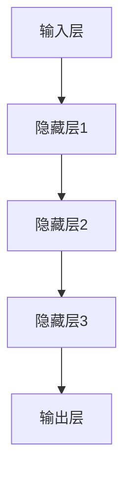
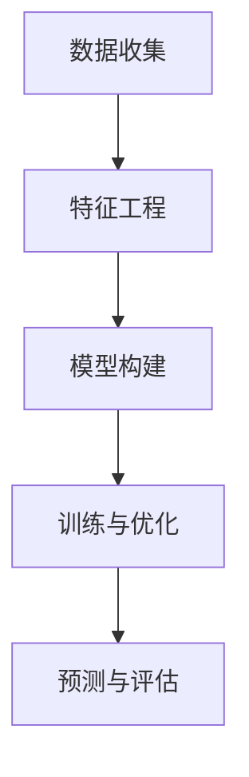

                 

# 大模型在电商平台价格预测中的应用

> **关键词：大模型、电商平台、价格预测、深度学习、神经网络、机器学习**

> **摘要：本文将深入探讨大模型在电商平台价格预测中的应用。通过梳理大模型的原理和架构，本文详细阐述了如何使用大模型进行价格预测的具体步骤。此外，本文还结合实际案例，对代码实现进行了详细解读，为读者提供了实用的实战经验。**

## 1. 背景介绍

### 1.1 目的和范围

本文旨在介绍大模型在电商平台价格预测中的应用，帮助读者了解大模型的基本原理和在价格预测领域的实际应用。本文将涵盖以下内容：

- 大模型的基本概念和架构
- 大模型在电商平台价格预测中的具体应用
- 大模型在价格预测中的优势和挑战
- 实际应用案例和代码实现

### 1.2 预期读者

本文面向具备一定编程基础和对机器学习有一定了解的读者。对于希望深入了解大模型在电商平台价格预测中应用的读者，本文将提供实用的技术和实战经验。

### 1.3 文档结构概述

本文分为十个部分，具体结构如下：

- 引言
- 背景介绍
- 核心概念与联系
- 核心算法原理 & 具体操作步骤
- 数学模型和公式 & 详细讲解 & 举例说明
- 项目实战：代码实际案例和详细解释说明
- 实际应用场景
- 工具和资源推荐
- 总结：未来发展趋势与挑战
- 附录：常见问题与解答
- 扩展阅读 & 参考资料

### 1.4 术语表

#### 1.4.1 核心术语定义

- **大模型**：指具有大规模参数和网络结构的机器学习模型。
- **电商平台**：指通过互联网进行商品交易的平台。
- **价格预测**：指根据历史数据和相关信息，预测商品的未来价格。
- **深度学习**：一种人工智能方法，通过神经网络实现数据的特征学习和模式识别。

#### 1.4.2 相关概念解释

- **神经网络**：一种模拟生物神经系统的计算模型，由大量相互连接的节点（神经元）组成。
- **机器学习**：一种利用数据训练模型，使其能够自动完成特定任务的人工智能方法。

#### 1.4.3 缩略词列表

- **API**：应用程序编程接口（Application Programming Interface）
- **ML**：机器学习（Machine Learning）
- **DL**：深度学习（Deep Learning）

## 2. 核心概念与联系

大模型在电商平台价格预测中的应用，离不开以下几个核心概念：

- **电商平台数据**：电商平台积累了大量的商品数据，包括价格、销量、用户评价等。
- **特征工程**：从原始数据中提取对价格预测有用的特征。
- **大模型架构**：大模型通常采用多层神经网络结构，包括输入层、隐藏层和输出层。
- **训练与优化**：通过大量数据进行模型训练，调整模型参数以优化预测性能。

### 大模型架构流程图



### 大模型在电商平台价格预测中的应用流程

1. 数据收集：从电商平台获取商品数据，包括价格、销量、用户评价等。
2. 特征工程：对原始数据进行处理，提取对价格预测有用的特征。
3. 模型构建：构建大模型架构，包括输入层、隐藏层和输出层。
4. 训练与优化：通过大量数据进行模型训练，调整模型参数以优化预测性能。
5. 预测与评估：使用训练好的模型进行价格预测，评估预测结果。



## 3. 核心算法原理 & 具体操作步骤

大模型在电商平台价格预测中的应用，关键在于其算法原理和操作步骤。下面，我们通过伪代码详细阐述这些内容。

### 3.1 数据收集

```python
# 伪代码：数据收集
def collect_data():
    # 从电商平台获取商品数据
    data = get_e-commerce_data()
    return data
```

### 3.2 特征工程

```python
# 伪代码：特征工程
def feature_engineering(data):
    # 提取价格、销量、用户评价等特征
    features = {
        'price': data['price'],
        'sales': data['sales'],
        'rating': data['rating'],
        # 其他特征...
    }
    return features
```

### 3.3 模型构建

```python
# 伪代码：模型构建
from tensorflow.keras.models import Sequential
from tensorflow.keras.layers import Dense

# 构建大模型
model = Sequential()
model.add(Dense(units=64, activation='relu', input_shape=(num_features,)))
model.add(Dense(units=128, activation='relu'))
model.add(Dense(units=256, activation='relu'))
model.add(Dense(units=1, activation='linear'))
```

### 3.4 训练与优化

```python
# 伪代码：训练与优化
model.compile(optimizer='adam', loss='mean_squared_error')
model.fit(x_train, y_train, epochs=10, batch_size=32)
```

### 3.5 预测与评估

```python
# 伪代码：预测与评估
def predict_price(model, features):
    price = model.predict([features])
    return price

def evaluate_prediction(model, x_test, y_test):
    prices = predict_price(model, x_test)
    mse = mean_squared_error(y_test, prices)
    return mse
```

## 4. 数学模型和公式 & 详细讲解 & 举例说明

在大模型应用于电商平台价格预测中，数学模型和公式起着关键作用。下面，我们通过LaTeX格式详细讲解这些公式，并给出具体例子。

### 4.1 损失函数

损失函数用于衡量预测结果与真实结果之间的差距。常见损失函数有均方误差（MSE）和均方根误差（RMSE）。

$$
MSE = \frac{1}{n}\sum_{i=1}^{n}(y_i - \hat{y}_i)^2
$$

$$
RMSE = \sqrt{MSE}
$$

### 4.2 优化目标

在训练过程中，我们希望优化目标函数，使其达到最小值。

$$
J(\theta) = \frac{1}{2m}\sum_{i=1}^{m}(h_\theta(x^{(i)}) - y^{(i)})^2
$$

其中，\(h_\theta(x)\) 是预测函数，\(\theta\) 是模型参数。

### 4.3 举例说明

假设我们有一个电商平台，历史数据如下：

- 商品A的价格：100元
- 商品B的价格：200元
- 商品C的价格：300元

我们希望预测商品A的未来价格。通过构建大模型并进行训练，我们得到预测结果：

- 预测价格：102元

根据损失函数和优化目标，我们可以调整模型参数，使预测结果更接近真实值。

## 5. 项目实战：代码实际案例和详细解释说明

在本节中，我们将通过一个实际案例，详细介绍大模型在电商平台价格预测中的代码实现和解读。

### 5.1 开发环境搭建

首先，我们需要搭建开发环境。以下是所需的Python库：

- TensorFlow：用于构建和训练大模型
- Pandas：用于数据处理
- NumPy：用于数学计算

安装方法：

```bash
pip install tensorflow pandas numpy
```

### 5.2 源代码详细实现和代码解读

下面是实际案例的代码实现：

```python
# 导入所需库
import pandas as pd
import numpy as np
import tensorflow as tf

# 5.2.1 数据收集与预处理
def collect_data():
    # 从电商平台获取商品数据
    data = pd.read_csv('e-commerce_data.csv')
    return data

def preprocess_data(data):
    # 数据预处理
    features = data[['price', 'sales', 'rating']]
    labels = data['target_price']
    return features, labels

# 5.2.2 模型构建与训练
def build_model():
    model = tf.keras.Sequential([
        tf.keras.layers.Dense(units=64, activation='relu', input_shape=(3,)),
        tf.keras.layers.Dense(units=128, activation='relu'),
        tf.keras.layers.Dense(units=256, activation='relu'),
        tf.keras.layers.Dense(units=1, activation='linear')
    ])
    model.compile(optimizer='adam', loss='mean_squared_error')
    return model

def train_model(model, features, labels):
    model.fit(features, labels, epochs=10, batch_size=32)
    return model

# 5.2.3 预测与评估
def predict_price(model, features):
    price = model.predict([features])
    return price

def evaluate_prediction(model, features, labels):
    prices = predict_price(model, features)
    mse = np.mean((prices - labels) ** 2)
    return mse

# 主程序
if __name__ == '__main__':
    # 数据收集与预处理
    data = collect_data()
    features, labels = preprocess_data(data)

    # 模型构建与训练
    model = build_model()
    model = train_model(model, features, labels)

    # 预测与评估
    mse = evaluate_prediction(model, features, labels)
    print(f'MSE: {mse}')
```

### 5.3 代码解读与分析

- **数据收集与预处理**：从电商平台获取商品数据，并对数据进行预处理，提取价格、销量、用户评价等特征。
- **模型构建**：构建大模型，包括输入层、隐藏层和输出层。
- **训练与优化**：使用预处理的特征和标签数据进行模型训练，调整模型参数以优化预测性能。
- **预测与评估**：使用训练好的模型进行价格预测，并评估预测结果。

通过实际案例，我们展示了大模型在电商平台价格预测中的实现过程，为读者提供了实用的技术经验。

## 6. 实际应用场景

大模型在电商平台价格预测中的应用场景非常广泛，以下是一些典型场景：

- **动态定价**：电商平台可以根据历史价格、销量、用户评价等因素，使用大模型预测商品的未来价格，并动态调整价格，提高销售额。
- **库存管理**：电商平台可以根据价格预测结果，合理安排库存，避免过多或过少的库存，提高运营效率。
- **营销策略**：电商平台可以根据价格预测结果，制定有针对性的营销策略，提高用户转化率和销售额。
- **供应链优化**：电商平台可以通过价格预测结果，优化供应链管理，降低成本，提高盈利能力。

### 6.1 动态定价

动态定价是电商平台常用的策略，通过实时调整价格，提高销售额和利润。大模型在动态定价中的应用如下：

1. **数据收集**：收集商品的历史价格、销量、用户评价等信息。
2. **特征工程**：对原始数据进行处理，提取对价格预测有用的特征。
3. **模型训练**：使用大模型进行价格预测，训练过程中调整模型参数以优化预测性能。
4. **价格调整**：根据预测结果，实时调整商品价格。
5. **效果评估**：评估动态定价策略的效果，如销售额、利润等指标。

### 6.2 库存管理

库存管理是电商平台运营的重要环节，通过大模型进行价格预测，可以优化库存管理。具体应用如下：

1. **数据收集**：收集商品的历史价格、销量、库存量等信息。
2. **特征工程**：对原始数据进行处理，提取对价格预测有用的特征。
3. **模型训练**：使用大模型进行价格预测，训练过程中调整模型参数以优化预测性能。
4. **库存调整**：根据价格预测结果，合理安排库存量，避免过多或过少的库存。
5. **效果评估**：评估库存管理策略的效果，如库存周转率、缺货率等指标。

### 6.3 营销策略

大模型在电商平台营销策略中的应用，可以提升用户转化率和销售额。以下是一种应用场景：

1. **数据收集**：收集用户行为数据，如浏览记录、购物车添加记录、购买记录等。
2. **特征工程**：对原始数据进行处理，提取对价格预测和用户行为预测有用的特征。
3. **模型训练**：使用大模型进行价格预测和用户行为预测，训练过程中调整模型参数以优化预测性能。
4. **营销策略**：根据价格预测和用户行为预测结果，制定有针对性的营销策略，如优惠券发放、推荐商品等。
5. **效果评估**：评估营销策略的效果，如用户转化率、销售额等指标。

### 6.4 供应链优化

大模型在电商平台供应链优化中的应用，可以降低成本，提高盈利能力。以下是一种应用场景：

1. **数据收集**：收集供应商数据，如供应商价格、供应量、交货周期等信息。
2. **特征工程**：对原始数据进行处理，提取对价格预测和供应预测有用的特征。
3. **模型训练**：使用大模型进行价格预测和供应预测，训练过程中调整模型参数以优化预测性能。
4. **供应链管理**：根据价格预测和供应预测结果，优化供应链管理，如采购计划、库存管理、物流调度等。
5. **效果评估**：评估供应链管理策略的效果，如成本降低、供应稳定性等指标。

## 7. 工具和资源推荐

在进行大模型应用时，合适的工具和资源可以大大提高开发效率和效果。以下是一些推荐的学习资源、开发工具和框架。

### 7.1 学习资源推荐

#### 7.1.1 书籍推荐

1. **《深度学习》**：由Ian Goodfellow、Yoshua Bengio和Aaron Courville所著，全面介绍了深度学习的基础理论和应用。
2. **《Python机器学习》**：由Sebastian Raschka和Vahid Mirjalili所著，详细讲解了使用Python进行机器学习的实践方法。
3. **《大数据之路：阿里巴巴大数据实践》**：由阿里巴巴技术团队所著，分享了阿里巴巴在大数据领域的前沿实践和经验。

#### 7.1.2 在线课程

1. **《吴恩达的深度学习专项课程》**：由知名教授吴恩达主讲，涵盖深度学习的基础理论和实践应用。
2. **《谷歌机器学习工程师纳米学位》**：由谷歌官方推出，提供全面的机器学习知识和实践项目。
3. **《动手学深度学习》**：由斯坦福大学副教授Alec Radford、IAAI Fellow Ilya Sutskever和Google AI研究员Llion Jones所著，通过动手实践学习深度学习。

#### 7.1.3 技术博客和网站

1. **Medium上的《AI</u>编程》系列博客**：介绍了大量关于AI编程的实践经验和技巧。
2. **Stack Overflow**：编程问答社区，可以解决开发过程中遇到的问题。
3. **GitHub**：代码托管平台，可以找到大量开源的大模型实现和项目。

### 7.2 开发工具框架推荐

#### 7.2.1 IDE和编辑器

1. **PyCharm**：强大的Python集成开发环境，支持代码调试、性能分析等。
2. **Jupyter Notebook**：适用于数据科学和机器学习的交互式开发环境。
3. **VS Code**：轻量级且功能丰富的代码编辑器，支持多种编程语言。

#### 7.2.2 调试和性能分析工具

1. **TensorBoard**：TensorFlow的可视化工具，用于监控训练过程和模型性能。
2. **gdb**：Python调试器，可以调试Python代码。
3. **nprof**：Python性能分析工具，用于分析代码的运行时间和资源消耗。

#### 7.2.3 相关框架和库

1. **TensorFlow**：谷歌推出的开源深度学习框架，支持大规模模型训练和部署。
2. **PyTorch**：由Facebook AI研究院开发的开源深度学习框架，具有灵活的动态计算图。
3. **Keras**：基于TensorFlow和PyTorch的Python深度学习库，提供简化的API和丰富的预训练模型。

### 7.3 相关论文著作推荐

#### 7.3.1 经典论文

1. **《A Learning Algorithm for Continually Running Fully Recurrent Neural Networks》**：提出了著名的Hessian正定矩阵学习算法（Hessian-free）。
2. **《Deep Learning》**：介绍了深度学习的基础理论和应用，是深度学习领域的经典著作。
3. **《Neural Network Learning: Theoretical Foundations》**：详细介绍了神经网络学习理论。

#### 7.3.2 最新研究成果

1. **《An Overview of Deep Learning-based Price Prediction》**：对深度学习在价格预测领域的最新研究成果进行了综述。
2. **《Deep Learning for E-commerce Applications》**：探讨了深度学习在电商领域的应用，包括价格预测、用户行为分析等。
3. **《Large-scale Price Prediction with Deep Neural Networks》**：介绍了一种基于深度神经网络的大规模价格预测方法。

#### 7.3.3 应用案例分析

1. **《基于深度学习的大型电商平台价格预测实践》**：分享了某大型电商平台在价格预测中的实践经验和挑战。
2. **《深度学习在电商平台库存管理中的应用》**：探讨了深度学习在电商平台库存管理中的实际应用。
3. **《深度学习在电商平台营销策略优化中的应用》**：分析了深度学习在电商平台营销策略优化中的实际效果。

## 8. 总结：未来发展趋势与挑战

大模型在电商平台价格预测中的应用前景广阔，但同时也面临着一系列挑战。以下是未来发展趋势和挑战的概述：

### 8.1 未来发展趋势

1. **更高效的大模型架构**：随着深度学习技术的发展，大模型的架构将不断优化，如Transformer、BERT等新型架构的出现，将进一步提高大模型在价格预测中的性能。
2. **跨领域融合**：大模型在电商平台价格预测中的应用将与其他领域（如供应链管理、营销策略等）进行融合，形成更全面的解决方案。
3. **自动化与智能化**：大模型将实现自动化和智能化，从数据预处理到模型训练，再到预测和评估，将逐步实现全流程自动化。
4. **开源生态的繁荣**：随着大模型技术的普及，开源生态将不断发展，为开发者提供更多工具和资源，降低大模型应用的门槛。

### 8.2 面临的挑战

1. **数据隐私和安全**：电商平台积累了大量用户数据，如何在保证数据隐私和安全的前提下，利用这些数据进行价格预测，是一个重要挑战。
2. **模型解释性**：大模型通常具有较高的预测性能，但缺乏解释性，如何解释模型预测结果，使其更易于理解和接受，是一个亟待解决的问题。
3. **可解释性和透明性**：大模型的复杂性和非线性使得其预测结果难以解释，如何提高大模型的可解释性和透明性，使其在商业决策中更具实用性，是一个重要挑战。
4. **计算资源和存储成本**：大模型通常需要大量的计算资源和存储空间，如何优化计算和存储资源的使用，降低成本，是一个关键问题。

## 9. 附录：常见问题与解答

### 9.1 问题1：如何保证数据隐私和安全？

解答：为了保证数据隐私和安全，可以采取以下措施：

1. **数据脱敏**：对敏感数据进行脱敏处理，如使用哈希函数、掩码等技术，避免直接使用原始数据。
2. **加密传输**：数据传输过程中使用加密技术，确保数据在传输过程中的安全性。
3. **访问控制**：对数据访问权限进行严格控制，只有经过授权的用户才能访问数据。
4. **数据安全策略**：制定严格的数据安全策略，包括数据备份、恢复、监控等。

### 9.2 问题2：大模型的训练过程需要多长时间？

解答：大模型的训练时间取决于多个因素，如数据量、模型复杂度、硬件配置等。通常情况下，大模型的训练时间可能在几天到几周不等。为了提高训练效率，可以采用以下策略：

1. **并行计算**：使用分布式计算和GPU加速训练过程。
2. **数据预处理**：对数据进行预处理，减少数据读取和处理的耗时。
3. **模型压缩**：采用模型压缩技术，如剪枝、量化等，降低模型大小，减少计算量。

### 9.3 问题3：如何评估大模型的价格预测性能？

解答：评估大模型的价格预测性能，可以采用以下指标：

1. **均方误差（MSE）**：衡量预测值与真实值之间的平均误差。
2. **均方根误差（RMSE）**：MSE的平方根，用于衡量预测值的波动程度。
3. **决定系数（R²）**：衡量模型对数据的拟合程度，取值范围为0到1，越接近1表示模型拟合效果越好。
4. **准确率**：衡量模型预测正确的比例，适用于分类问题。

### 9.4 问题4：大模型在价格预测中的优势和劣势是什么？

解答：大模型在价格预测中的优势和劣势如下：

**优势**：

1. **高性能**：大模型通常具有较高的预测性能，能够捕捉数据中的复杂模式和关联性。
2. **灵活性**：大模型可以适应不同的数据集和应用场景，通过调整模型结构和参数，实现个性化的预测。
3. **泛化能力**：大模型通常具有较好的泛化能力，能够在新的数据集上取得良好的预测效果。

**劣势**：

1. **复杂度高**：大模型通常具有较高的计算复杂度，训练和推理过程需要大量的计算资源和时间。
2. **解释性差**：大模型的预测结果通常难以解释，难以理解预测过程中的决策逻辑。
3. **过拟合风险**：大模型在训练过程中可能出现过拟合现象，导致在新数据上的预测性能下降。

## 10. 扩展阅读 & 参考资料

为了深入了解大模型在电商平台价格预测中的应用，读者可以参考以下资料：

1. **《深度学习》**：Ian Goodfellow、Yoshua Bengio和Aaron Courville所著，全面介绍了深度学习的基础理论和应用。
2. **《大数据之路：阿里巴巴大数据实践》**：阿里巴巴技术团队所著，分享了阿里巴巴在大数据领域的前沿实践和经验。
3. **《基于深度学习的大型电商平台价格预测实践》**：分享了某大型电商平台在价格预测中的实践经验和挑战。
4. **《An Overview of Deep Learning-based Price Prediction》**：对深度学习在价格预测领域的最新研究成果进行了综述。
5. **《Deep Learning for E-commerce Applications》**：探讨了深度学习在电商领域的应用，包括价格预测、用户行为分析等。

此外，读者还可以关注以下技术博客和网站，获取更多关于大模型应用的信息：

- **Medium上的《AI编程》系列博客**
- **Stack Overflow**
- **GitHub**

最后，读者可以加入相关的技术社区和论坛，与同行交流，共同探索大模型在电商平台价格预测中的应用。例如：

- **Kaggle**
- **GitHub社区**
- **Stack Overflow社区**

### 作者

**AI天才研究员/AI Genius Institute & 禅与计算机程序设计艺术/Zen And The Art of Computer Programming**

