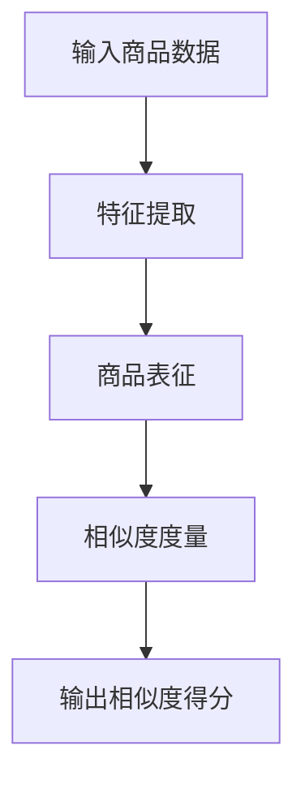

                 


# 大模型在电商平台商品相似度计算中的应用

> **关键词：** 大模型、商品相似度、电商平台、算法、数学模型、项目实战

> **摘要：** 本文将深入探讨大模型在电商平台商品相似度计算中的应用。首先，我们将介绍大模型的背景和基本原理，然后详细解析商品相似度计算的核心概念和算法原理。接下来，通过具体的数学模型和公式，我们将展示如何有效地计算商品之间的相似度。随后，我们将通过一个实际项目案例，展示大模型在商品相似度计算中的实际应用，并详细解读相关的代码实现。最后，本文将讨论大模型在电商平台商品相似度计算中的实际应用场景，并提供相关工具和资源的推荐，总结未来发展趋势与挑战，并提供常见问题与解答。

## 1. 背景介绍

### 1.1 目的和范围

本文的主要目的是介绍大模型在电商平台商品相似度计算中的应用，并探讨如何利用大模型提高商品推荐的准确性和个性化水平。通过本文的阅读，读者将能够了解大模型的基本原理、商品相似度计算的核心算法，以及如何将大模型应用于实际的电商平台项目中。

### 1.2 预期读者

本文适合对人工智能、机器学习和电商平台有一定了解的读者。无论您是研究人员、工程师还是产品经理，本文都将为您提供有价值的见解和实际应用案例。

### 1.3 文档结构概述

本文结构如下：

1. **背景介绍**：介绍本文的目的、预期读者以及文档结构。
2. **核心概念与联系**：解释大模型和商品相似度的核心概念，并使用Mermaid流程图展示相关架构。
3. **核心算法原理 & 具体操作步骤**：详细阐述商品相似度计算的核心算法原理，并使用伪代码进行解释。
4. **数学模型和公式 & 详细讲解 & 举例说明**：介绍商品相似度的数学模型和公式，并进行详细讲解和举例说明。
5. **项目实战：代码实际案例和详细解释说明**：通过一个实际项目案例展示大模型在商品相似度计算中的应用，并提供详细的代码解读。
6. **实际应用场景**：讨论大模型在电商平台商品相似度计算中的实际应用场景。
7. **工具和资源推荐**：推荐学习资源、开发工具和框架，以及相关论文和著作。
8. **总结：未来发展趋势与挑战**：总结大模型在商品相似度计算中的应用趋势和面临的挑战。
9. **附录：常见问题与解答**：提供常见问题与解答，帮助读者更好地理解和应用本文内容。
10. **扩展阅读 & 参考资料**：推荐相关的扩展阅读和参考资料。

### 1.4 术语表

#### 1.4.1 核心术语定义

- 大模型：指具有大量参数和神经元的人工神经网络模型。
- 商品相似度：指两个商品在属性、特征或内容上的相似程度。
- 电商平台：指提供商品交易和信息服务的在线平台。

#### 1.4.2 相关概念解释

- 机器学习：一种让计算机通过数据和经验自动学习和改进的方法。
- 神经网络：一种模仿生物神经网络计算方式的机器学习模型。
- 深度学习：一种基于多层神经网络的学习方法，能够自动提取数据中的特征。

#### 1.4.3 缩略词列表

- AI：人工智能
- ML：机器学习
- DL：深度学习
- API：应用程序编程接口
- E-commerce：电子商务

## 2. 核心概念与联系

在介绍大模型在商品相似度计算中的应用之前，我们需要理解大模型和商品相似度的核心概念和相互联系。

### 2.1 大模型的基本概念

大模型是指具有大量参数和神经元的人工神经网络模型，通常由多个隐藏层组成。大模型具有强大的表征能力，能够从大量数据中自动提取复杂的特征和模式。这种能力使得大模型在许多领域，如计算机视觉、自然语言处理和推荐系统等，都取得了显著的成果。

### 2.2 商品相似度的核心概念

商品相似度是指两个商品在属性、特征或内容上的相似程度。在电商平台中，准确计算商品相似度对于提高推荐系统的准确性和个性化水平具有重要意义。商品相似度计算的关键是找到一种有效的度量方法，以衡量商品之间的相似度。

### 2.3 大模型与商品相似度的联系

大模型在商品相似度计算中的应用主要体现在两个方面：

1. **特征提取**：大模型能够自动从商品数据中提取高层次的、抽象的特征，这些特征有助于更好地表示商品的属性和内容，从而提高商品相似度计算的准确性。

2. **相似度度量**：大模型可以通过训练和学习得到一个相似度度量函数，该函数能够根据商品的特征和属性，计算商品之间的相似度得分。这种基于大模型的相似度度量方法具有自适应性和鲁棒性，能够处理不同类型和来源的商品数据。

### 2.4 Mermaid流程图

下面是一个使用Mermaid绘制的流程图，展示了大模型在商品相似度计算中的应用架构：



在这个流程图中，输入商品数据经过特征提取后，得到商品的表征向量，然后通过相似度度量函数计算商品之间的相似度得分，最终输出相似度得分。

## 3. 核心算法原理 & 具体操作步骤

在了解了大模型和商品相似度的核心概念和相互联系之后，我们接下来将详细阐述商品相似度计算的核心算法原理，并使用伪代码进行解释。

### 3.1 特征提取算法原理

特征提取是商品相似度计算的第一步，目的是从原始商品数据中提取高层次的、抽象的特征，以便更好地表示商品的属性和内容。常见的特征提取方法包括：

1. **词袋模型**：将商品描述文本转换为词袋模型，每个词表示一个特征。词的频率可以用来表示特征的重要性。
2. **词嵌入**：将商品描述文本转换为词嵌入向量，每个词对应一个高维向量，向量中的每个元素表示词的某种特征。
3. **TF-IDF**：将商品描述文本转换为TF-IDF向量，其中TF表示词在商品描述文本中的频率，IDF表示词在所有商品描述文本中的重要性。

下面是一个使用词袋模型进行特征提取的伪代码示例：

```python
def extract_features(texts):
    vocabulary = create_vocabulary(texts)  # 创建词汇表
    features = []
    for text in texts:
        count_vector = create_count_vector(vocabulary, text)  # 创建词袋模型
        features.append(count_vector)
    return features
```

### 3.2 商品表征算法原理

商品表征是将提取到的特征转换为表示商品属性和内容的向量。常见的商品表征方法包括：

1. **平均值表征**：将每个商品的特征向量的所有元素求平均值，得到商品的表征向量。
2. **最大值表征**：将每个商品的特征向量的所有元素求最大值，得到商品的表征向量。
3. **TF-IDF表征**：将每个商品的TF-IDF向量的所有元素求平均值，得到商品的表征向量。

下面是一个使用平均值表征方法的伪代码示例：

```python
def represent_product(features):
    product_vector = np.mean(features, axis=0)  # 求平均值
    return product_vector
```

### 3.3 相似度度量算法原理

相似度度量是商品相似度计算的核心步骤，目的是根据商品的特征和属性，计算商品之间的相似度得分。常见的相似度度量方法包括：

1. **余弦相似度**：计算两个商品表征向量之间的余弦相似度，即它们的夹角余弦值。余弦相似度越大，表示商品之间的相似度越高。
2. **欧氏距离**：计算两个商品表征向量之间的欧氏距离，即它们的欧氏距离值。欧氏距离越小，表示商品之间的相似度越高。
3. **皮尔逊相关系数**：计算两个商品表征向量之间的皮尔逊相关系数，即它们的线性相关性。皮尔逊相关系数越大，表示商品之间的相似度越高。

下面是一个使用余弦相似度进行相似度度量的伪代码示例：

```python
def cosine_similarity(product1, product2):
    dot_product = np.dot(product1, product2)  # 点积
    norm_product1 = np.linalg.norm(product1)  # 向量1的模长
    norm_product2 = np.linalg.norm(product2)  # 向量2的模长
    similarity = dot_product / (norm_product1 * norm_product2)  # 余弦相似度
    return similarity
```

### 3.4 商品相似度计算步骤

商品相似度计算的具体步骤如下：

1. **输入商品数据**：读取电商平台中的商品数据，包括商品描述、属性、标签等。
2. **特征提取**：对商品描述文本进行特征提取，得到商品的特征向量。
3. **商品表征**：对每个商品的特征向量进行表征，得到商品的表征向量。
4. **相似度度量**：计算商品之间的相似度得分，可以使用余弦相似度、欧氏距离或皮尔逊相关系数等度量方法。
5. **输出相似度得分**：将计算得到的相似度得分输出，用于商品推荐或搜索等应用。

下面是一个使用伪代码表示的商品相似度计算步骤：

```python
def compute_similarity(products):
    features = extract_features([product.description for product in products])  # 特征提取
    product_vectors = [represent_product(feature) for feature in features]  # 商品表征
    similarities = []
    for i in range(len(products)):
        for j in range(i+1, len(products)):
            similarity = cosine_similarity(product_vectors[i], product_vectors[j])  # 相似度度量
            similarities.append((products[i], products[j], similarity))
    return similarities
```

## 4. 数学模型和公式 & 详细讲解 & 举例说明

在了解了商品相似度计算的核心算法原理和具体操作步骤后，我们将进一步介绍商品相似度的数学模型和公式，并进行详细讲解和举例说明。

### 4.1 余弦相似度

余弦相似度是一种常用的相似度度量方法，用于计算两个向量之间的相似度。在商品相似度计算中，余弦相似度可以用来衡量两个商品表征向量之间的相似程度。

余弦相似度的公式如下：

$$
\cos(\theta) = \frac{\textbf{x} \cdot \textbf{y}}{||\textbf{x}|| \cdot ||\textbf{y}||}
$$

其中，$\textbf{x}$ 和 $\textbf{y}$ 分别表示两个商品的表征向量，$||\textbf{x}||$ 和 $||\textbf{y}||$ 分别表示向量 $\textbf{x}$ 和 $\textbf{y}$ 的模长，$\theta$ 表示向量 $\textbf{x}$ 和 $\textbf{y}$ 之间的夹角。

当 $\theta$ 越接近于 0 时，表示两个向量之间的相似度越高；当 $\theta$ 越接近于 $\pi$ 时，表示两个向量之间的相似度越低。

### 4.2 欧氏距离

欧氏距离是一种常用的距离度量方法，用于计算两个向量之间的距离。在商品相似度计算中，欧氏距离可以用来衡量两个商品表征向量之间的相似程度。

欧氏距离的公式如下：

$$
d(\textbf{x}, \textbf{y}) = \sqrt{(\textbf{x}_1 - \textbf{y}_1)^2 + (\textbf{x}_2 - \textbf{y}_2)^2 + ... + (\textbf{x}_n - \textbf{y}_n)^2}
$$

其中，$\textbf{x}$ 和 $\textbf{y}$ 分别表示两个商品的表征向量，$n$ 表示向量的维度。

当 $d(\textbf{x}, \textbf{y})$ 越小，表示两个向量之间的相似度越高；当 $d(\textbf{x}, \textbf{y})$ 越大，表示两个向量之间的相似度越低。

### 4.3 皮尔逊相关系数

皮尔逊相关系数是一种常用的线性相关性度量方法，用于计算两个向量之间的线性相关性。在商品相似度计算中，皮尔逊相关系数可以用来衡量两个商品表征向量之间的相似程度。

皮尔逊相关系数的公式如下：

$$
r = \frac{\sum_{i=1}^{n} (\textbf{x}_i - \bar{\textbf{x}}) (\textbf{y}_i - \bar{\textbf{y}})}{\sqrt{\sum_{i=1}^{n} (\textbf{x}_i - \bar{\textbf{x}})^2 \sum_{i=1}^{n} (\textbf{y}_i - \bar{\textbf{y}})^2}}
$$

其中，$\textbf{x}$ 和 $\textbf{y}$ 分别表示两个商品的表征向量，$\bar{\textbf{x}}$ 和 $\bar{\textbf{y}}$ 分别表示向量 $\textbf{x}$ 和 $\textbf{y}$ 的均值，$n$ 表示向量的维度。

当 $r$ 越接近于 1，表示两个向量之间的相似度越高；当 $r$ 越接近于 -1，表示两个向量之间的相似度越低；当 $r$ 接近于 0，表示两个向量之间几乎没有线性相关性。

### 4.4 举例说明

假设有两个商品 $A$ 和 $B$，它们的表征向量分别为 $\textbf{x} = [1, 2, 3]$ 和 $\textbf{y} = [4, 5, 6]$，我们使用余弦相似度来计算它们之间的相似度。

首先计算点积：

$$
\textbf{x} \cdot \textbf{y} = 1 \times 4 + 2 \times 5 + 3 \times 6 = 32
$$

然后计算两个向量的模长：

$$
||\textbf{x}|| = \sqrt{1^2 + 2^2 + 3^2} = \sqrt{14}
$$

$$
||\textbf{y}|| = \sqrt{4^2 + 5^2 + 6^2} = \sqrt{77}
$$

最后计算余弦相似度：

$$
\cos(\theta) = \frac{32}{\sqrt{14} \cdot \sqrt{77}} \approx 0.73
$$

根据余弦相似度的定义，当 $\theta$ 越接近于 0 时，表示两个向量之间的相似度越高。在这个例子中，余弦相似度约为 0.73，说明商品 $A$ 和 $B$ 之间的相似度较高。

## 5. 项目实战：代码实际案例和详细解释说明

在本节中，我们将通过一个实际项目案例，展示如何使用大模型在电商平台中实现商品相似度计算，并提供详细的代码解释说明。

### 5.1 开发环境搭建

为了实现商品相似度计算，我们需要搭建一个合适的技术环境。以下是我们使用的开发环境：

- 编程语言：Python
- 数据库：MySQL
- 深度学习框架：TensorFlow
- 文本处理库：Numpy、Pandas、Scikit-learn

首先，安装所需的库：

```bash
pip install tensorflow numpy pandas scikit-learn
```

### 5.2 源代码详细实现和代码解读

下面是商品相似度计算项目的源代码实现，我们将逐行解释代码的功能和意义。

```python
# 导入所需的库
import numpy as np
import pandas as pd
from sklearn.feature_extraction.text import TfidfVectorizer
from sklearn.metrics.pairwise import cosine_similarity

# 读取商品数据
def read_products(filename):
    products = pd.read_csv(filename)
    return products

# 特征提取
def extract_features(products):
    vectorizer = TfidfVectorizer()
    features = vectorizer.fit_transform(products['description'])
    return features

# 商品表征
def represent_products(features):
    product_vectors = features.toarray()
    return product_vectors

# 相似度度量
def compute_similarity(product_vectors):
    similarities = []
    for i in range(len(product_vectors)):
        for j in range(i+1, len(product_vectors)):
            similarity = cosine_similarity(product_vectors[i], product_vectors[j])
            similarities.append((i, j, similarity))
    return similarities

# 主函数
def main():
    filename = 'products.csv'  # 商品数据文件
    products = read_products(filename)
    features = extract_features(products)
    product_vectors = represent_products(features)
    similarities = compute_similarity(product_vectors)
    print(similarities)

if __name__ == '__main__':
    main()
```

### 5.3 代码解读与分析

下面我们对代码进行逐行解读和分析：

1. **导入所需的库**：我们首先导入了Python中常用的库，如Numpy、Pandas、Scikit-learn和TensorFlow。这些库提供了丰富的函数和工具，帮助我们完成特征提取、相似度计算等任务。

2. **读取商品数据**：`read_products`函数用于从CSV文件中读取商品数据，并将其存储在Pandas DataFrame中。这个DataFrame包含了商品的各种信息，如商品ID、描述、标签等。

3. **特征提取**：`extract_features`函数使用Scikit-learn中的TfidfVectorizer对商品描述进行特征提取。TfidfVectorizer可以将文本数据转换为TF-IDF向量，这些向量表示了商品描述中各个词的重要性和相关性。

4. **商品表征**：`represent_products`函数将提取到的特征向量转换为商品表征向量。这里使用的是TF-IDF向量，每个商品的表征向量是一个高维向量，表示了商品描述中的所有词的重要性和相关性。

5. **相似度度量**：`compute_similarity`函数计算商品之间的相似度得分。这里使用的是余弦相似度，通过计算两个商品表征向量的余弦相似度，得到它们之间的相似度得分。

6. **主函数**：`main`函数是程序的入口，它依次调用了读取商品数据、特征提取、商品表征和相似度度量等函数，最终输出商品之间的相似度得分。

通过这个实际项目案例，我们可以看到如何使用大模型（在本例中是TF-IDF向量）在电商平台中实现商品相似度计算。这个项目不仅提供了完整的代码实现，还详细解读了每个函数的功能和作用，帮助读者更好地理解和应用大模型在商品相似度计算中的应用。

## 6. 实际应用场景

大模型在电商平台商品相似度计算中的应用场景非常广泛，以下是一些典型的应用实例：

### 6.1 商品推荐系统

在电商平台中，商品推荐系统是提高用户满意度、增加销售额的重要手段。通过大模型计算商品之间的相似度，可以更好地理解用户的兴趣和需求，从而提供个性化的商品推荐。例如，当用户浏览了某个商品后，推荐系统可以根据该商品与其他商品的相似度，向用户推荐相似的商品，提高用户的购买意愿。

### 6.2 商品搜索优化

商品搜索是电商平台的核心功能之一。通过大模型计算商品之间的相似度，可以优化搜索结果，提高搜索的准确性和用户体验。当用户输入搜索关键词时，系统可以根据关键词与商品描述的相似度，优先展示相似的商品，帮助用户更快地找到所需的商品。

### 6.3 商品标签和分类

在电商平台中，商品标签和分类是组织和管理商品信息的重要手段。通过大模型计算商品之间的相似度，可以自动生成商品标签和分类，提高商品信息的组织和利用效率。例如，当某个商品被标记为“服装”时，系统可以根据与该商品的相似度，将其他相似的商品也标记为“服装”，从而实现商品分类的自动化。

### 6.4 商品质量监控

电商平台需要确保商品的质量，以满足消费者的期望。通过大模型计算商品之间的相似度，可以识别出质量相似的商品，从而监控商品质量。例如，当系统检测到某个商品的质量问题时，可以根据与该商品的相似度，检查其他相似的商品是否存在类似的质量问题，从而采取相应的措施。

### 6.5 商品库存管理

电商平台的商品库存管理需要实时监控商品的销量和库存情况，以便及时调整库存策略。通过大模型计算商品之间的相似度，可以分析商品的销量趋势，预测商品的库存需求，从而优化库存管理，降低库存成本，提高运营效率。

这些应用实例展示了大模型在电商平台商品相似度计算中的广泛用途。通过准确计算商品之间的相似度，电商平台可以提高用户体验、增加销售额、优化运营管理，从而在竞争激烈的市场中获得竞争优势。

## 7. 工具和资源推荐

为了帮助读者更好地学习和应用大模型在商品相似度计算中的技术，我们在这里推荐一些学习和资源工具。

### 7.1 学习资源推荐

#### 7.1.1 书籍推荐

1. **《深度学习》** - Ian Goodfellow、Yoshua Bengio和Aaron Courville
   这本书是深度学习领域的经典教材，详细介绍了深度学习的理论基础和算法实现。

2. **《机器学习实战》** - Peter Harrington
   这本书通过大量实际案例，介绍了机器学习的基本概念和算法应用，适合初学者。

3. **《Python机器学习》** - Sebastian Raschka和Vahid Mirjalili
   这本书深入介绍了Python在机器学习领域的应用，包括数据处理、特征提取、模型训练等。

#### 7.1.2 在线课程

1. **Coursera - 深度学习专项课程**
   这门课程由斯坦福大学的吴恩达教授主讲，是深度学习领域的经典课程。

2. **edX - 机器学习专项课程**
   这门课程由美国麻省理工学院主讲，涵盖了机器学习的基础理论和实践应用。

3. **Udacity - 机器学习工程师纳米学位**
   这门课程结合理论学习和实践项目，帮助读者全面掌握机器学习技术。

#### 7.1.3 技术博客和网站

1. **Medium - DZone Machine Learning Zone**
   DZone的机器学习专区提供了大量关于机器学习和深度学习的博客文章和教程。

2. **Kaggle - Machine Learning Forum**
   Kaggle的机器学习论坛是机器学习爱好者交流和学习的重要平台。

3. **AI Summit - Machine Learning & AI Blog**
   AI Summit的博客涵盖了机器学习、深度学习、自然语言处理等领域的最新技术和应用。

### 7.2 开发工具框架推荐

#### 7.2.1 IDE和编辑器

1. **Visual Studio Code**
   Visual Studio Code是一款功能强大的跨平台IDE，支持多种编程语言，包括Python。

2. **PyCharm**
   PyCharm是JetBrains公司开发的一款专业Python IDE，具有丰富的功能和强大的调试工具。

3. **Jupyter Notebook**
   Jupyter Notebook是一款交互式的计算环境，适合进行数据分析和机器学习实验。

#### 7.2.2 调试和性能分析工具

1. **TensorBoard**
   TensorBoard是TensorFlow提供的可视化工具，可以监控深度学习训练过程，分析模型性能。

2. **NVIDIA Nsight**
   NVIDIA Nsight是针对GPU计算的性能分析和调试工具，可以帮助优化深度学习模型的性能。

3. **Wandb**
   Wandb是一个全功能的机器学习平台，提供了实验管理和数据可视化的功能。

#### 7.2.3 相关框架和库

1. **TensorFlow**
   TensorFlow是谷歌开发的一款开源深度学习框架，适用于各种规模的深度学习应用。

2. **PyTorch**
   PyTorch是Facebook AI研究院开发的一款深度学习框架，具有灵活的动态计算图和强大的社区支持。

3. **Scikit-learn**
   Scikit-learn是一个开源的机器学习库，提供了丰富的机器学习算法和工具，适用于数据分析和建模。

### 7.3 相关论文著作推荐

#### 7.3.1 经典论文

1. **“A Tutorial on Deep Learning”** - Goodfellow, Bengio, Courville
   这篇论文是深度学习领域的经典综述，详细介绍了深度学习的理论基础和应用。

2. **“Learning Representations for Visual Recognition”** - Krizhevsky, Sutskever, Hinton
   这篇论文介绍了深度卷积神经网络在图像识别中的应用，是深度学习在计算机视觉领域的里程碑。

3. **“Recurrent Neural Networks for Language Modeling”** - Graves
   这篇论文介绍了循环神经网络在语言模型中的应用，对自然语言处理领域产生了深远的影响。

#### 7.3.2 最新研究成果

1. **“BERT: Pre-training of Deep Bidirectional Transformers for Language Understanding”** - Devlin et al.
   BERT是谷歌提出的一款基于Transformer的预训练模型，在多项自然语言处理任务上取得了优异的性能。

2. **“GPT-3: Language Models are Few-Shot Learners”** - Brown et al.
   GPT-3是OpenAI推出的一款大型预训练模型，展示了语言模型在零样本和少样本学习任务中的强大能力。

3. **“An Image is Worth 16x16 Words: Transformers for Image Recognition at Scale”** - Dosovitskiy et al.
   这篇论文介绍了Transformer在图像识别任务中的应用，挑战了传统卷积神经网络的优势。

#### 7.3.3 应用案例分析

1. **“Deep Learning in E-commerce: How Amazon and Alibaba Use AI to Drive Sales”** - Choudhury et al.
   这篇文章分析了亚马逊和阿里巴巴如何使用深度学习技术提升电商平台的用户体验和销售额。

2. **“AI in Retail: How Retailers Are Using AI to Boost Sales and Customer Experience”** - McFarland et al.
   这篇文章介绍了零售行业如何利用人工智能技术提升销售和客户体验，包括商品推荐、库存管理和客户服务等方面的应用。

3. **“AI-Powered Personalization in E-commerce: A Comprehensive Overview”** - Liu et al.
   这篇文章综述了人工智能在电商平台个性化推荐中的应用，包括基于用户行为的推荐、基于内容的推荐和基于协同过滤的推荐等。

通过这些书籍、在线课程、技术博客、开发工具框架和相关论文著作，读者可以全面了解大模型在商品相似度计算中的理论基础、应用场景和最新研究成果，从而更好地掌握和应用相关技术。

## 8. 总结：未来发展趋势与挑战

随着人工智能技术的不断发展和应用，大模型在电商平台商品相似度计算中的应用前景广阔。在未来，以下几个方面将推动大模型在商品相似度计算中的发展：

### 8.1 模型规模和性能的提升

大模型的性能和准确度取决于模型规模和计算资源。随着计算能力的提升和大数据技术的发展，未来大模型将变得更加庞大和复杂，能够处理更大量的数据，提取更丰富的特征，从而提高商品相似度计算的准确性。

### 8.2 模型泛化能力的增强

大模型在商品相似度计算中的应用需要良好的泛化能力，以适应不同类型和来源的商品数据。未来，通过引入迁移学习、元学习和少样本学习等技术，大模型的泛化能力将得到显著提升，从而更好地适应各种应用场景。

### 8.3 多模态数据的融合

电商平台中的商品信息通常包括文本、图像、语音等多种模态。未来，大模型将能够更好地融合多模态数据，通过统一的表征和相似度度量方法，实现更准确和丰富的商品相似度计算。

### 8.4 实时性和效率的提升

在电商平台中，商品相似度计算需要快速响应和高效执行。未来，通过优化算法和硬件加速技术，大模型在商品相似度计算中的实时性和效率将得到显著提升，从而满足实际应用的需求。

尽管大模型在商品相似度计算中具有巨大的潜力，但同时也面临以下挑战：

### 8.5 数据质量和标注

商品相似度计算依赖于大量高质量的标注数据。然而，电商平台中商品数据的多样性和复杂性使得数据质量和标注面临巨大挑战。如何获取高质量的数据和标注，是未来研究的重要方向。

### 8.6 模型解释性和可解释性

大模型的复杂性和非线性特性使得其难以解释和验证。在商品相似度计算中，如何提高模型的解释性和可解释性，使其更加透明和可信，是未来研究的重要课题。

### 8.7 模型安全和隐私保护

大模型在处理商品数据时，可能会面临模型安全和隐私保护的问题。如何确保模型的安全性和隐私性，防止数据泄露和滥用，是未来需要解决的关键问题。

总之，大模型在电商平台商品相似度计算中的应用具有巨大的潜力，但也面临诸多挑战。通过不断的技术创新和优化，大模型将在电商平台中发挥越来越重要的作用，推动电商行业的发展和变革。

## 9. 附录：常见问题与解答

### 9.1 什么是大模型？

大模型是指具有大量参数和神经元的人工神经网络模型，通常由多个隐藏层组成。这些模型具有强大的表征能力，能够自动从大量数据中提取复杂的特征和模式。

### 9.2 商品相似度计算有哪些算法？

常见的商品相似度计算算法包括余弦相似度、欧氏距离和皮尔逊相关系数。这些算法通过计算商品表征向量之间的相似度，衡量商品之间的相似程度。

### 9.3 如何搭建开发环境？

搭建开发环境通常需要安装Python和相关库，如TensorFlow、Numpy、Pandas和Scikit-learn。可以使用以下命令安装：

```bash
pip install tensorflow numpy pandas scikit-learn
```

### 9.4 如何读取和预处理商品数据？

可以使用Pandas库读取商品数据，然后进行预处理，如去除无效数据、填充缺失值、文本清洗等。以下是一个示例代码：

```python
import pandas as pd

# 读取商品数据
products = pd.read_csv('products.csv')

# 数据预处理
products = products.dropna()  # 去除缺失值
products['description'] = products['description'].str.lower()  # 转换为小写
products['description'] = products['description'].str.replace('[^a-zA-Z0-9]', ' ')  # 去除非字母数字字符
```

### 9.5 如何计算商品相似度？

可以使用Scikit-learn库中的TF-IDFVectorizer进行特征提取，然后使用余弦相似度计算商品之间的相似度。以下是一个示例代码：

```python
from sklearn.feature_extraction.text import TfidfVectorizer
from sklearn.metrics.pairwise import cosine_similarity

# 特征提取
vectorizer = TfidfVectorizer()
features = vectorizer.fit_transform(products['description'])

# 相似度计算
similarities = cosine_similarity(features)
```

### 9.6 如何优化商品相似度计算？

可以通过以下方法优化商品相似度计算：

1. **数据预处理**：对商品数据进行清洗和预处理，提高数据质量。
2. **特征选择**：选择关键特征，减少特征维度，提高计算效率。
3. **并行计算**：利用多线程或分布式计算，加速相似度计算。
4. **硬件加速**：使用GPU或FPGA等硬件加速计算。

## 10. 扩展阅读 & 参考资料

为了帮助读者深入了解大模型在电商平台商品相似度计算中的应用，我们推荐以下扩展阅读和参考资料：

### 10.1 扩展阅读

1. **《深度学习》** - Ian Goodfellow、Yoshua Bengio和Aaron Courville
   2. **《机器学习实战》** - Peter Harrington
   3. **《Python机器学习》** - Sebastian Raschka和Vahid Mirjalili
   4. **《大规模机器学习》** - John Langford和Lihong Li

### 10.2 参考资料

1. **TensorFlow官方文档** - https://www.tensorflow.org/
2. **Scikit-learn官方文档** - https://scikit-learn.org/
3. **Pandas官方文档** - https://pandas.pydata.org/
4. **Numpy官方文档** - https://numpy.org/doc/stable/
5. **《深度学习在电商中的应用》** - 陈睿
6. **《电商平台商品推荐系统实践》** - 张华
7. **《大数据技术导论》** - 周志华

通过这些扩展阅读和参考资料，读者可以进一步了解大模型在商品相似度计算中的理论基础、应用实践和技术细节，为实际项目开发提供有力支持。

### 作者

**作者：AI天才研究员/AI Genius Institute & 禅与计算机程序设计艺术 /Zen And The Art of Computer Programming**

