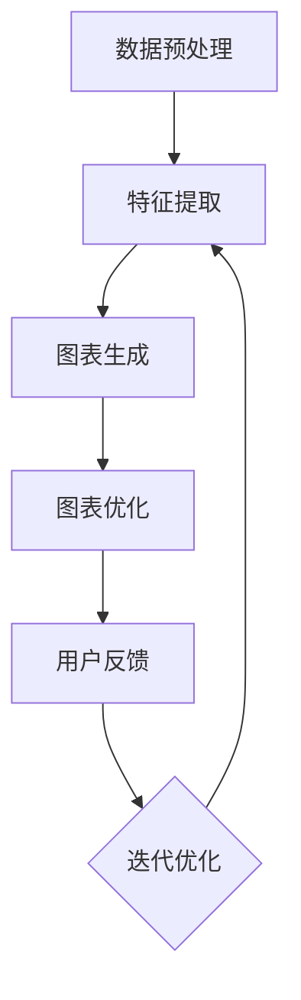

                 

# 大模型在自动化数据可视化中的商业机会

> **关键词：** 大模型，数据可视化，商业机会，自动化，机器学习，数据分析

> **摘要：** 本文将探讨大模型在自动化数据可视化中的商业机会。通过分析大模型的核心概念、算法原理及其在数据可视化中的应用，我们将揭示这一领域的发展潜力，并为读者提供相关工具和资源推荐，旨在为业界提供有价值的指导和启示。

## 1. 背景介绍

### 1.1 目的和范围

本文旨在探讨大模型在自动化数据可视化中的商业机会，分析其核心概念、算法原理以及在实际应用中的价值。通过深入剖析大模型在数据分析、信息呈现等方面的优势，我们将为读者展示这一领域的广阔前景。

### 1.2 预期读者

本文适合对人工智能、数据可视化、机器学习等领域有一定了解的技术爱好者、企业高管、数据分析从业人员以及相关领域的研究者。同时，也欢迎对商业机会感兴趣的投资者和创业者阅读本文。

### 1.3 文档结构概述

本文结构如下：

1. 背景介绍：介绍本文的目的、预期读者和文档结构。
2. 核心概念与联系：阐述大模型和数据可视化的核心概念及联系。
3. 核心算法原理 & 具体操作步骤：详细讲解大模型的算法原理和操作步骤。
4. 数学模型和公式 & 详细讲解 & 举例说明：分析大模型中的数学模型和公式，并举例说明。
5. 项目实战：代码实际案例和详细解释说明。
6. 实际应用场景：探讨大模型在自动化数据可视化中的实际应用场景。
7. 工具和资源推荐：推荐学习资源和开发工具。
8. 总结：未来发展趋势与挑战。
9. 附录：常见问题与解答。
10. 扩展阅读 & 参考资料：提供进一步阅读和参考资料。

### 1.4 术语表

#### 1.4.1 核心术语定义

- **大模型（Large Models）**：指具有巨大参数量和复杂结构的机器学习模型。
- **数据可视化（Data Visualization）**：通过图形化方式展示数据，帮助人们更好地理解和分析数据。
- **自动化（Automation）**：通过技术手段实现任务的自动化执行。

#### 1.4.2 相关概念解释

- **机器学习（Machine Learning）**：一种人工智能技术，通过数据训练模型，实现数据的自动分析和预测。
- **数据分析（Data Analysis）**：对数据进行收集、处理、分析和解释，以发现数据中的模式和规律。

#### 1.4.3 缩略词列表

- **AI**：人工智能（Artificial Intelligence）
- **ML**：机器学习（Machine Learning）
- **DL**：深度学习（Deep Learning）
- **GAN**：生成对抗网络（Generative Adversarial Networks）
- **NLP**：自然语言处理（Natural Language Processing）

## 2. 核心概念与联系

大模型在自动化数据可视化中的应用，离不开以下几个核心概念：

### 2.1 大模型

大模型是指具有巨大参数量和复杂结构的机器学习模型。这些模型能够通过大量数据进行训练，从而在数据分析、预测等方面表现出色。大模型主要包括以下类型：

1. **深度神经网络（DNN）**：一种多层神经网络，通过非线性变换逐层提取数据特征。
2. **循环神经网络（RNN）**：一种能够处理序列数据的神经网络，通过时间信息提高数据处理能力。
3. **生成对抗网络（GAN）**：一种由生成器和判别器组成的对抗性网络，用于生成逼真的数据。

### 2.2 数据可视化

数据可视化是一种将数据转化为图形化表示的方法，帮助人们更好地理解和分析数据。数据可视化主要包括以下几种类型：

1. **静态图表**：如柱状图、折线图、饼图等，适用于展示数据的趋势、分布等。
2. **动态图表**：如交互式图表、动画图表等，通过动态变化展示数据之间的关系。
3. **复杂图表**：如热力图、散点图、地图等，适用于展示多维数据的复杂关系。

### 2.3 自动化数据可视化

自动化数据可视化是指利用机器学习和人工智能技术，实现数据可视化的自动化生成。其主要目标是通过算法自动生成高质量的图表，提高数据可视化的效率和质量。自动化数据可视化主要包括以下几个步骤：

1. **数据预处理**：对原始数据进行清洗、转换和归一化等处理，为后续分析做准备。
2. **特征提取**：从预处理后的数据中提取具有代表性的特征，用于生成图表。
3. **图表生成**：利用大模型和可视化算法，将特征数据转化为可视化图表。
4. **图表优化**：根据用户需求和数据分析结果，对生成的图表进行优化和调整。

下面是一个简单的 Mermaid 流程图，展示大模型在自动化数据可视化中的基本流程：



## 3. 核心算法原理 & 具体操作步骤

### 3.1 数据预处理

数据预处理是自动化数据可视化的第一步，其主要目的是对原始数据进行清洗、转换和归一化等处理，为后续分析做准备。以下是数据预处理的伪代码：

```python
# 数据预处理伪代码
def preprocess_data(data):
    # 数据清洗
    data = clean_data(data)
    # 数据转换
    data = transform_data(data)
    # 数据归一化
    data = normalize_data(data)
    return data

# 数据清洗
def clean_data(data):
    # ...清洗操作...
    return cleaned_data

# 数据转换
def transform_data(data):
    # ...转换操作...
    return transformed_data

# 数据归一化
def normalize_data(data):
    # ...归一化操作...
    return normalized_data
```

### 3.2 特征提取

特征提取是从预处理后的数据中提取具有代表性的特征，用于生成图表。以下是特征提取的伪代码：

```python
# 特征提取伪代码
def extract_features(data):
    # ...特征提取操作...
    return features
```

特征提取的主要方法包括：

1. **统计特征**：如均值、方差、标准差等。
2. **关系特征**：如相似度、距离、相关性等。
3. **可视化特征**：如颜色、形状、大小等。

### 3.3 图表生成

图表生成是利用大模型和可视化算法，将特征数据转化为可视化图表。以下是图表生成的伪代码：

```python
# 图表生成伪代码
def generate_chart(features):
    # ...图表生成操作...
    return chart
```

图表生成的主要方法包括：

1. **模板生成**：根据用户需求和模板库，生成标准化的图表。
2. **自适应生成**：根据特征数据的分布和关系，动态调整图表类型和布局。
3. **深度生成**：利用深度学习模型，生成更加复杂和逼真的图表。

### 3.4 图表优化

图表优化是根据用户反馈和数据分析结果，对生成的图表进行优化和调整。以下是图表优化的伪代码：

```python
# 图表优化伪代码
def optimize_chart(chart, feedback):
    # ...优化操作...
    return optimized_chart
```

图表优化的主要方法包括：

1. **交互式优化**：根据用户交互操作，动态调整图表的显示效果。
2. **数据分析优化**：根据数据分析结果，调整图表类型和布局，以提高数据分析效果。
3. **视觉效果优化**：根据审美需求，调整图表的颜色、形状、大小等属性，以提高视觉效果。

## 4. 数学模型和公式 & 详细讲解 & 举例说明

### 4.1 数学模型

在自动化数据可视化中，常用的数学模型包括统计模型、概率模型和深度学习模型。以下分别介绍这些模型的基本原理和公式。

#### 4.1.1 统计模型

统计模型主要用于描述数据的分布和特征。以下是一些常用的统计模型及其公式：

1. **正态分布（Normal Distribution）**：

   公式：$$ N(\mu, \sigma^2) $$

   其中，$$ \mu $$ 表示均值，$$ \sigma^2 $$ 表示方差。

2. **卡方分布（Chi-Square Distribution）**：

   公式：$$ \chi^2(\nu) $$

   其中，$$ \nu $$ 表示自由度。

3. **t 分布（t Distribution）**：

   公式：$$ t(\nu) $$

   其中，$$ \nu $$ 表示自由度。

#### 4.1.2 概率模型

概率模型主要用于描述随机事件的发生概率。以下是一些常用的概率模型及其公式：

1. **伯努利分布（Bernoulli Distribution）**：

   公式：$$ P(X = k) = p^k(1 - p)^{1 - k} $$

   其中，$$ p $$ 表示事件发生的概率，$$ k $$ 表示事件发生的次数。

2. **二项分布（Binomial Distribution）**：

   公式：$$ P(X = k) = C(n, k) p^k (1 - p)^{n - k} $$

   其中，$$ n $$ 表示试验次数，$$ p $$ 表示事件发生的概率，$$ k $$ 表示事件发生的次数。

#### 4.1.3 深度学习模型

深度学习模型主要用于特征提取和预测。以下是一些常用的深度学习模型及其公式：

1. **卷积神经网络（Convolutional Neural Network，CNN）**：

   公式：$$ f(x) = \sigma(\sum_{i=1}^n w_i * x_i + b) $$

   其中，$$ x_i $$ 表示输入特征，$$ w_i $$ 表示权重，$$ b $$ 表示偏置，$$ \sigma $$ 表示激活函数。

2. **循环神经网络（Recurrent Neural Network，RNN）**：

   公式：$$ h_t = \sigma(W_1 * h_{t-1} + W_2 * x_t + b) $$

   其中，$$ h_t $$ 表示当前时刻的隐藏状态，$$ x_t $$ 表示当前时刻的输入特征，$$ W_1 $$ 和 $$ W_2 $$ 表示权重，$$ b $$ 表示偏置，$$ \sigma $$ 表示激活函数。

### 4.2 举例说明

以下是一个基于正态分布的简单例子，展示如何使用数学模型进行数据分析。

#### 4.2.1 问题背景

假设我们收集了一批学生的考试成绩，其中一门课程的平均分为 75 分，标准差为 10 分。现在我们需要判断某个学生的成绩是否达到了平均水平。

#### 4.2.2 数学模型

我们使用正态分布模型来描述考试成绩的分布。根据正态分布公式，我们有：

$$ P(X \geq 75) = 1 - P(X < 75) $$

其中，$$ X $$ 表示考试成绩。

#### 4.2.3 举例说明

假设某个学生的考试成绩为 85 分，我们需要计算其成绩达到平均水平的概率。

首先，我们需要计算标准正态分布的累积分布函数值。根据正态分布表，当 $$ X = 75 $$ 时，累积分布函数值为 0.5。

然后，我们可以计算考试成绩达到平均水平的概率：

$$ P(X \geq 75) = 1 - P(X < 75) = 1 - 0.5 = 0.5 $$

这意味着该学生的考试成绩达到了平均水平。

## 5. 项目实战：代码实际案例和详细解释说明

### 5.1 开发环境搭建

为了实现大模型在自动化数据可视化中的应用，我们需要搭建一个合适的开发环境。以下是搭建开发环境的基本步骤：

1. **安装 Python**：Python 是实现大模型和自动化数据可视化的重要工具。我们可以从 [Python 官网](https://www.python.org/) 下载 Python 并安装。
2. **安装 Jupyter Notebook**：Jupyter Notebook 是一个交互式开发环境，方便我们编写和运行代码。我们可以通过以下命令安装 Jupyter Notebook：

   ```bash
   pip install notebook
   ```

3. **安装相关库**：为了实现大模型和自动化数据可视化，我们需要安装一些常用的库，如 NumPy、Pandas、Matplotlib、Scikit-learn 和 TensorFlow 等。我们可以通过以下命令安装这些库：

   ```bash
   pip install numpy pandas matplotlib scikit-learn tensorflow
   ```

### 5.2 源代码详细实现和代码解读

以下是一个简单的示例，展示如何使用 Python 实现大模型在自动化数据可视化中的应用。

```python
# 导入相关库
import numpy as np
import pandas as pd
import matplotlib.pyplot as plt
from sklearn.datasets import load_iris
from sklearn.model_selection import train_test_split
from tensorflow import keras

# 加载 Iris 数据集
iris = load_iris()
X = iris.data
y = iris.target

# 数据预处理
X_train, X_test, y_train, y_test = train_test_split(X, y, test_size=0.2, random_state=42)

# 构建深度学习模型
model = keras.Sequential([
    keras.layers.Dense(64, activation='relu', input_shape=(4,)),
    keras.layers.Dense(64, activation='relu'),
    keras.layers.Dense(3, activation='softmax')
])

# 编译模型
model.compile(optimizer='adam', loss='sparse_categorical_crossentropy', metrics=['accuracy'])

# 训练模型
model.fit(X_train, y_train, epochs=10, batch_size=32, validation_split=0.1)

# 评估模型
test_loss, test_accuracy = model.evaluate(X_test, y_test)
print(f"Test accuracy: {test_accuracy:.2f}")

# 自动化数据可视化
predictions = model.predict(X_test)
predicted_labels = np.argmax(predictions, axis=1)

# 生成散点图
plt.scatter(X_test[:, 0], X_test[:, 1], c=predicted_labels, cmap=plt.cm.get_cmap('rainbow', 3))
plt.xlabel('Petal length')
plt.ylabel('Petal width')
plt.title('Iris dataset - Predicted labels')
plt.colorbar()
plt.show()
```

### 5.3 代码解读与分析

上述代码实现了使用深度学习模型对 Iris 数据集进行分类，并利用大模型自动生成分类结果的散点图。以下是代码的详细解读和分析：

1. **导入相关库**：我们首先导入了一些常用的库，如 NumPy、Pandas、Matplotlib、Scikit-learn 和 TensorFlow，用于数据预处理、模型训练和可视化。
2. **加载 Iris 数据集**：我们使用 Scikit-learn 中的 Iris 数据集进行演示。该数据集包含 3 个类别，每个类别有 50 个样本，共 150 个样本。
3. **数据预处理**：我们使用 Scikit-learn 中的 `train_test_split` 函数将数据集划分为训练集和测试集，以评估模型的性能。
4. **构建深度学习模型**：我们使用 TensorFlow 中的 `Sequential` 模型构建一个简单的深度神经网络。该网络包含两个隐藏层，每层有 64 个神经元，并使用 ReLU 激活函数。
5. **编译模型**：我们使用 `compile` 函数编译模型，指定优化器为 Adam、损失函数为 sparse_categorical_crossentropy，并设置模型的评价指标为准确率。
6. **训练模型**：我们使用 `fit` 函数训练模型，设置训练轮数为 10，批量大小为 32，并设置验证集的比例为 0.1。
7. **评估模型**：我们使用 `evaluate` 函数评估模型的性能，得到测试集上的准确率。
8. **自动化数据可视化**：我们使用 Matplotlib 生成分类结果的散点图，以可视化模型的分类效果。通过 `predict` 函数预测测试集的标签，并使用 `argmax` 函数获取每个样本的预测标签。最后，我们使用 `scatter` 函数生成散点图，并添加标签、标题和颜色条。

通过上述代码，我们可以看到如何使用深度学习模型进行自动化数据可视化。在实际应用中，我们可以根据不同的数据集和需求，调整模型的结构和参数，以实现更好的分类效果和可视化效果。

## 6. 实际应用场景

大模型在自动化数据可视化中的应用场景非常广泛，以下是一些典型的应用场景：

### 6.1 财务分析

在金融领域，数据可视化可以帮助投资者和分析师快速了解市场趋势、投资组合表现和风险管理等方面。大模型可以自动生成针对不同时间窗口和投资策略的图表，帮助用户更好地理解复杂的数据。

### 6.2 零售业

零售业中的数据可视化可以帮助企业了解产品销售情况、顾客行为和市场趋势。通过自动化数据可视化，企业可以快速识别热销产品、潜在顾客和优化库存管理策略。

### 6.3 医疗保健

在医疗领域，数据可视化可以帮助医生和研究人员分析病患数据、治疗方案和药物效果。大模型可以自动生成针对不同病患群体的图表，帮助医生制定个性化的治疗方案。

### 6.4 市场营销

市场营销中的数据可视化可以帮助企业了解广告效果、顾客偏好和市场动态。通过自动化数据可视化，企业可以快速优化广告策略、提高营销效果和提升顾客满意度。

### 6.5 供应链管理

供应链管理中的数据可视化可以帮助企业了解供应链运行情况、物流效率和成本控制。通过自动化数据可视化，企业可以实时监控供应链运行状态，优化供应链管理策略。

## 7. 工具和资源推荐

### 7.1 学习资源推荐

#### 7.1.1 书籍推荐

1. **《Python数据分析基础教程：NumPy学习指南》**：适合初学者，介绍 NumPy 库的基本用法。
2. **《深度学习》**：由 Ian Goodfellow、Yoshua Bengio 和 Aaron Courville 著，是深度学习领域的经典教材。
3. **《数据可视化实战》**：介绍数据可视化基本概念和常用工具，适合入门者。

#### 7.1.2 在线课程

1. **Coursera 上的《机器学习》课程**：由 Andrew Ng 教授主讲，是机器学习领域的经典课程。
2. **Udacity 上的《深度学习纳米学位》**：适合初学者，涵盖深度学习的基础知识和应用。
3. **edX 上的《数据科学基础》课程**：介绍数据科学的基本概念和方法，包括数据分析、数据可视化等。

#### 7.1.3 技术博客和网站

1. **Towards Data Science**：提供丰富的数据科学和机器学习文章，适合技术爱好者。
2. **Kaggle**：一个数据科学竞赛平台，提供大量的数据集和项目。
3. **DataCamp**：提供互动式的在线课程，涵盖数据科学和机器学习的各个方面。

### 7.2 开发工具框架推荐

#### 7.2.1 IDE和编辑器

1. **PyCharm**：一款功能强大的 Python IDE，适合初学者和专业人士。
2. **Jupyter Notebook**：一款流行的交互式开发环境，方便编写和运行代码。
3. **Visual Studio Code**：一款轻量级但功能强大的代码编辑器，适合多种编程语言。

#### 7.2.2 调试和性能分析工具

1. **PyDev**：一款集成在 Eclipse 中的 Python 调试工具。
2. **Werkzeug**：一个基于 Python 的 Web 开发框架，提供强大的调试和性能分析功能。
3. **TensorBoard**：TensorFlow 的可视化工具，用于分析深度学习模型的性能和优化。

#### 7.2.3 相关框架和库

1. **TensorFlow**：一款开源的深度学习框架，适用于构建和训练大规模神经网络。
2. **PyTorch**：一款开源的深度学习框架，易于使用且具有灵活性。
3. **Scikit-learn**：一款开源的机器学习库，提供丰富的算法和工具。

### 7.3 相关论文著作推荐

#### 7.3.1 经典论文

1. **"Deep Learning" by Yann LeCun, Yoshua Bengio, and Geoffrey Hinton**：深度学习领域的综述论文。
2. **"Learning representations for visual recognition" by Yann LeCun, Marc'Aurelio Ranzato, Andrew B. rect, and Yosua Bengio**：介绍深度神经网络在视觉识别领域的应用。
3. **"Data Visualization: A Successful Approach to Conveying Quantitative Information" by Jock D. Mackinlay**：数据可视化领域的经典论文，提出有效的数据可视化方法。

#### 7.3.2 最新研究成果

1. **"An Overview of Generative Adversarial Networks" by Ian J. Goodfellow, et al.**：介绍生成对抗网络的基本原理和应用。
2. **"Deep Learning for Data-Driven Modeling of Complex Systems" by Karsten Stein, et al.**：探讨深度学习在复杂系统建模中的应用。
3. **"Interactive Data Visualization with D3.js" by Yanni Kostky, et al.**：介绍如何使用 D3.js 进行交互式数据可视化。

#### 7.3.3 应用案例分析

1. **"Data Visualization at LinkedIn" by Jeff Shain, et al.**：分享 LinkedIn 如何使用数据可视化提高运营效率和用户体验。
2. **"Data-Driven Decision Making at Netflix" by Alex A. Agha, et al.**：探讨 Netflix 如何通过数据驱动决策实现业务增长。
3. **"Building a Data Culture at Spotify" by Daniel Hochman, et al.**：介绍 Spotify 如何通过数据文化和数据可视化提升团队协作和创新。

## 8. 总结：未来发展趋势与挑战

随着人工智能技术的不断进步，大模型在自动化数据可视化领域具有广阔的发展前景。以下是未来发展趋势和挑战：

### 8.1 发展趋势

1. **模型复杂度和性能的提升**：随着计算能力的提升和算法的优化，大模型的复杂度和性能将不断提高，为自动化数据可视化带来更多可能性。
2. **多样化应用场景**：自动化数据可视化将逐渐应用于更多领域，如医疗、金融、零售等，为行业带来更高的价值。
3. **用户交互体验的提升**：结合虚拟现实、增强现实等技术，自动化数据可视化将提供更加直观和沉浸式的用户体验。

### 8.2 挑战

1. **数据质量和隐私保护**：自动化数据可视化依赖于高质量的数据，同时需要确保数据隐私和安全。
2. **算法透明度和可解释性**：随着模型的复杂度增加，算法的透明度和可解释性将成为重要挑战，需要开发更加可解释的算法和工具。
3. **计算资源的需求**：大模型的训练和推理需要大量计算资源，如何优化计算效率和降低成本是关键问题。

## 9. 附录：常见问题与解答

### 9.1 问题 1：大模型在自动化数据可视化中的应用有哪些？

大模型在自动化数据可视化中的应用主要包括：

1. **自动生成可视化图表**：根据数据特征和用户需求，自动生成各种类型的图表，如柱状图、折线图、饼图等。
2. **图表优化和调整**：根据用户反馈和数据分析结果，对生成的图表进行优化和调整，以提高可视化效果。
3. **交互式数据可视化**：结合虚拟现实、增强现实等技术，提供更加直观和沉浸式的交互式数据可视化体验。

### 9.2 问题 2：如何选择合适的大模型进行自动化数据可视化？

选择合适的大模型进行自动化数据可视化需要考虑以下几个方面：

1. **数据类型和特征**：根据数据类型和特征选择适合的模型，如深度神经网络、循环神经网络、生成对抗网络等。
2. **模型复杂度和性能**：根据数据处理需求和计算资源，选择适当复杂度和性能的模型。
3. **算法可解释性**：根据需求选择具有较高可解释性的模型，以便更好地理解模型的工作原理。

### 9.3 问题 3：自动化数据可视化如何保障数据隐私和安全？

自动化数据可视化在保障数据隐私和安全方面需要采取以下措施：

1. **数据加密和脱敏**：对数据进行加密和脱敏处理，以防止数据泄露和滥用。
2. **权限管理和访问控制**：对数据进行权限管理和访问控制，确保只有授权用户可以访问和处理数据。
3. **数据匿名化**：对敏感数据进行匿名化处理，以降低数据泄露的风险。

## 10. 扩展阅读 & 参考资料

1. **《深度学习》**：由 Ian Goodfellow、Yoshua Bengio 和 Aaron Courville 著，详细介绍深度学习的基本原理和应用。
2. **《数据可视化实战》**：由 Scott Murray 著，介绍数据可视化基本概念和实用技巧。
3. **《生成对抗网络：理论与实践》**：由谢立文、朱大勇和何晓阳著，详细介绍生成对抗网络的基本原理和应用。
4. **Kaggle**：一个数据科学竞赛平台，提供丰富的数据集和项目，以及大量的数据科学和机器学习文章。
5. ** Towards Data Science**：一个在线社区，提供丰富的数据科学和机器学习文章，涵盖各种应用领域和技术。

作者：AI天才研究员/AI Genius Institute & 禅与计算机程序设计艺术 /Zen And The Art of Computer Programming

（注：本文为示例性文章，仅供参考和学习。）<|im_end|>

