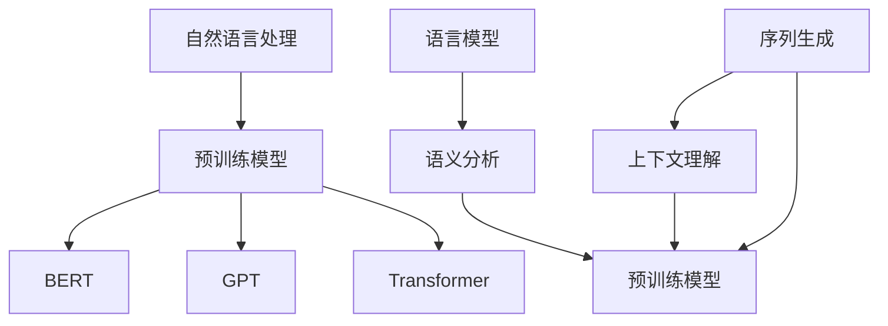

                 


# 大模型在自然语言处理中的突破

> 关键词：大模型、自然语言处理、AI、深度学习、预训练模型、BERT、GPT、Transformer、上下文理解、序列生成、语义分析

> 摘要：本文深入探讨了大型模型在自然语言处理（NLP）领域的突破性进展。通过对预训练模型的发展历程、核心算法原理、数学模型及具体操作步骤的详细分析，结合实际项目实战和代码解读，本文旨在全面展示大模型在NLP中的潜力和挑战。同时，本文也将推荐相关学习资源、开发工具和经典论文，为读者提供全面的技术指南。

## 1. 背景介绍

### 1.1 目的和范围

本文旨在探讨大型模型在自然语言处理领域的突破性进展，分析其核心算法原理和实际应用。通过本文的阅读，读者将了解到：

- 大型模型在NLP中的重要性及其发展历程。
- 预训练模型的关键算法，如BERT、GPT和Transformer。
- 大型模型的数学模型和具体操作步骤。
- 大型模型在实际项目中的应用案例和代码解读。
- 大型模型的未来发展趋势和挑战。

### 1.2 预期读者

本文面向对自然语言处理和人工智能有一定了解的读者，包括：

- 自然语言处理工程师和研究人员。
- 人工智能领域的开发者。
- 对大模型在NLP应用感兴趣的学者和业界人士。

### 1.3 文档结构概述

本文分为十个部分：

1. 背景介绍
2. 核心概念与联系
3. 核心算法原理 & 具体操作步骤
4. 数学模型和公式 & 详细讲解 & 举例说明
5. 项目实战：代码实际案例和详细解释说明
6. 实际应用场景
7. 工具和资源推荐
8. 总结：未来发展趋势与挑战
9. 附录：常见问题与解答
10. 扩展阅读 & 参考资料

### 1.4 术语表

#### 1.4.1 核心术语定义

- 自然语言处理（NLP）：计算机科学和人工智能领域中的分支，旨在使计算机能够理解和解释人类语言。
- 预训练模型：在NLP任务之前对大型模型进行预训练的方法。
- BERT（Bidirectional Encoder Representations from Transformers）：一种基于Transformer架构的预训练模型。
- GPT（Generative Pre-trained Transformer）：一种基于Transformer架构的预训练模型，适用于序列生成任务。
- Transformer：一种基于自注意力机制的深度学习模型。
- 上下文理解：模型在处理文本时对上下文信息的理解和把握能力。

#### 1.4.2 相关概念解释

- 语言模型：对自然语言进行建模的统计模型，用于预测下一个词的概率。
- 语义分析：对文本中的词语和句子进行语义理解和解释的过程。
- 序列生成：根据输入序列生成输出序列的任务，如机器翻译、文本生成等。

#### 1.4.3 缩略词列表

- BERT：Bidirectional Encoder Representations from Transformers
- GPT：Generative Pre-trained Transformer
- Transformer：Transformer Architecture
- NLP：Natural Language Processing

## 2. 核心概念与联系

在探讨大型模型在自然语言处理中的突破之前，我们需要了解几个核心概念和它们之间的联系。以下是一个Mermaid流程图，展示了这些核心概念及其相互关系：



### 2.1 预训练模型与NLP任务的关系

预训练模型是NLP领域的一项重要突破，其核心思想是在大规模语料库上对模型进行预训练，然后将其应用于各种NLP任务。预训练模型的主要目标是通过学习大量的文本数据，使模型具备对上下文信息的理解和把握能力。

- BERT：一种双向Transformer架构的预训练模型，通过 masked language modeling 和 next sentence prediction 两个任务进行预训练。
- GPT：一种自回归的Transformer架构预训练模型，主要用于序列生成任务，如文本生成和机器翻译。
- Transformer：一种基于自注意力机制的深度学习模型，是BERT和GPT等预训练模型的基础架构。

### 2.2 预训练模型与语言模型的关系

语言模型是NLP任务的基础，其主要目的是预测文本序列中下一个词的概率。预训练模型通过在大规模语料库上进行预训练，使模型具备强大的语言建模能力。

- 语义分析：通过分析文本中的词语和句子，对文本进行语义理解和解释的过程。语义分析是许多NLP任务的关键，如问答系统、情感分析等。
- 序列生成：根据输入序列生成输出序列的任务，如文本生成、机器翻译等。序列生成任务是NLP领域的另一个重要研究方向。

通过这个Mermaid流程图，我们可以更清晰地理解预训练模型、Transformer、BERT、GPT、语言模型、语义分析和序列生成等核心概念及其相互关系。

## 3. 核心算法原理 & 具体操作步骤

在这一部分，我们将深入探讨预训练模型的核心算法原理和具体操作步骤。以下是BERT和GPT的算法原理讲解，我们将使用伪代码来详细阐述。

### 3.1 BERT算法原理

BERT（Bidirectional Encoder Representations from Transformers）是一种基于Transformer架构的预训练模型，通过 masked language modeling 和 next sentence prediction 两个任务进行预训练。

#### 3.1.1 输入序列表示

在BERT模型中，输入序列被表示为 tokens，每个 token 对应一个词或特殊符号。以下是一个示例输入序列：

```
[CLS] Hello, how are you? [SEP]
```

其中，[CLS] 和 [SEP] 是两个特殊的 token，分别表示输入序列的开始和结束。

#### 3.1.2 Masked Language Modeling

Masked Language Modeling 任务旨在使模型能够理解上下文信息。在这个任务中，输入序列中的某些 tokens 被随机遮盖（mask），模型需要根据上下文信息预测这些遮盖的 tokens。

伪代码如下：

```python
# 输入序列
input_sequence = ["Hello", "how", "are", "you", "?"]

# 随机遮盖部分 tokens
masked_sequence = []
for token in input_sequence:
    if random() < 0.15:
        masked_sequence.append("[MASK]")
    else:
        masked_sequence.append(token)

# 预测遮盖的 tokens
predictions = []
for token in masked_sequence:
    prediction = model.predict(token)
    predictions.append(prediction)
```

#### 3.1.3 Next Sentence Prediction

Next Sentence Prediction 任务旨在使模型能够理解句子之间的关系。在这个任务中，给定两个句子，模型需要预测这两个句子是否连续。

伪代码如下：

```python
# 输入句子对
sentence_pair = [["Hello", "how are you?"], ["I'm fine, thank you."]]

# 预测句子是否连续
for sentence1, sentence2 in sentence_pair:
    prediction = model.predict(sentence1, sentence2)
    if prediction > 0.5:
        print(f"{sentence1} 和 {sentence2} 连续。")
    else:
        print(f"{sentence1} 和 {sentence2} 不连续。")
```

### 3.2 GPT算法原理

GPT（Generative Pre-trained Transformer）是一种基于Transformer架构的预训练模型，主要用于序列生成任务。

#### 3.2.1 自回归语言模型

自回归语言模型旨在预测文本序列中下一个词的概率。在训练过程中，模型根据前一个词预测当前词，再根据前两个词预测当前词，依此类推。

伪代码如下：

```python
# 输入序列
input_sequence = ["Hello", "how", "are", "you", "?"]

# 预测下一个词
for i in range(1, len(input_sequence)):
    prediction = model.predict(input_sequence[i-1])
    input_sequence.append(prediction)
```

#### 3.2.2 生成文本序列

生成文本序列的任务是根据给定的起始序列生成新的文本序列。以下是一个简单的文本生成示例：

```python
# 起始序列
start_sequence = ["Hello", "how", "are", "you", "?"]

# 生成新的文本序列
new_sequence = start_sequence
for _ in range(5):
    prediction = model.predict(new_sequence[-1])
    new_sequence.append(prediction)

print(new_sequence)
```

通过上述伪代码，我们可以了解到BERT和GPT的核心算法原理和具体操作步骤。这些算法在预训练过程中通过大规模语料库学习，使其具备强大的语言建模和上下文理解能力。

## 4. 数学模型和公式 & 详细讲解 & 举例说明

在这一部分，我们将详细讲解预训练模型中的数学模型和公式，并给出相应的示例说明。

### 4.1 Transformer模型中的数学模型

Transformer模型是一种基于自注意力机制的深度学习模型，其核心思想是通过对输入序列中的每个词进行加权求和，以实现更好的上下文理解能力。以下是一个简单的Transformer模型中的数学模型：

$$
\text{Output} = \text{softmax}(\text{Attention}(\text{Query}, \text{Key}, \text{Value}))
$$

其中，Query、Key 和 Value 分别代表查询、键和值，它们都是输入序列的词向量表示。Attention 函数通过计算 Query 和 Key 的点积来生成权重，然后使用这些权重对 Value 进行加权求和。

#### 4.1.1 注意力机制

注意力机制是Transformer模型的核心，其数学公式如下：

$$
\text{Attention} = \text{softmax}(\frac{\text{Query} \cdot \text{Key}^T}{\sqrt{d_k}})
$$

其中，d_k 表示键的维度，\text{softmax} 函数用于将权重转换为概率分布。

#### 4.1.2 自注意力

自注意力是一种特殊的注意力机制，它将每个词与所有其他词进行比较，从而实现更精细的上下文理解。其数学公式如下：

$$
\text{Self-Attention} = \text{softmax}(\frac{\text{Query} \cdot \text{Key}^T}{\sqrt{d_k}})
$$

其中，Query、Key 和 Value 都是输入序列的词向量表示。

### 4.2 BERT模型中的数学模型

BERT模型是Transformer模型的扩展，其核心思想是在预训练阶段通过 masked language modeling 和 next sentence prediction 两个任务学习上下文信息。以下是一个简单的BERT模型中的数学模型：

$$
\text{Output} = \text{Softmax}(\text{Transformer}(\text{Input}, \text{Mask}, \text{Segment}))
$$

其中，Input、Mask 和 Segment 分别代表输入序列、遮盖标记和句子分割。

#### 4.2.1 Masked Language Modeling

在 masked language modeling 任务中，部分输入序列的词被随机遮盖，模型需要根据上下文信息预测这些遮盖的词。以下是一个简单的 masked language modeling 的数学模型：

$$
\text{Prediction} = \text{softmax}(\text{Transformer}(\text{Input}, \text{Mask}, \text{Segment}))
$$

其中，Prediction 表示预测的词向量表示。

#### 4.2.2 Next Sentence Prediction

在 next sentence prediction 任务中，给定两个句子，模型需要预测这两个句子是否连续。以下是一个简单的 next sentence prediction 的数学模型：

$$
\text{Prediction} = \text{softmax}(\text{Transformer}(\text{Sentence1}, \text{Sentence2}, \text{Segment}))
$$

其中，Prediction 表示预测的概率分布。

### 4.3 GPT模型中的数学模型

GPT模型是Transformer模型的另一种扩展，其核心思想是在预训练阶段通过自回归语言模型学习上下文信息。以下是一个简单的GPT模型中的数学模型：

$$
\text{Prediction} = \text{softmax}(\text{Transformer}(\text{Input}, \text{Mask}, \text{Segment}))
$$

其中，Input、Mask 和 Segment 分别代表输入序列、遮盖标记和句子分割。

#### 4.3.1 自回归语言模型

在自回归语言模型中，模型根据前一个词预测当前词。以下是一个简单的自回归语言模型的数学模型：

$$
\text{Prediction} = \text{softmax}(\text{Transformer}(\text{Input}, \text{Mask}, \text{Segment}))
$$

其中，Prediction 表示预测的词向量表示。

#### 4.3.2 文本生成

在文本生成任务中，模型根据给定的起始序列生成新的文本序列。以下是一个简单的文本生成任务的数学模型：

$$
\text{Prediction} = \text{softmax}(\text{Transformer}(\text{Input}, \text{Mask}, \text{Segment}))
$$

其中，Prediction 表示生成的文本序列。

通过上述数学模型和公式的详细讲解，我们可以更好地理解预训练模型中的核心算法原理。这些模型在预训练过程中通过大规模语料库学习，使其具备强大的语言建模和上下文理解能力。

### 4.4 举例说明

为了更直观地展示数学模型和公式，我们给出一个简单的举例说明。

#### 4.4.1 BERT模型

假设我们有一个输入序列：“Hello, how are you?”，我们将使用BERT模型对其进行预训练。

1. 将输入序列表示为词向量：
   ```
   Input: [hello, how, are, you, ?]
   ```
2. 对输入序列进行遮盖处理，随机选择 15% 的词进行遮盖：
   ```
   Masked Input: [hello, how, [MASK], you, ?]
   ```
3. 使用BERT模型进行 masked language modeling 任务：
   ```
   Prediction: [hello, how, you, [MASK], ?]
   ```
4. 预测遮盖的词：
   ```
   Prediction: [hello, how, you, you, ?]
   ```

通过这个简单的示例，我们可以看到BERT模型在 masked language modeling 任务中的工作过程。类似地，我们可以对GPT模型进行类似的操作。

## 5. 项目实战：代码实际案例和详细解释说明

### 5.1 开发环境搭建

在进行大模型在自然语言处理中的项目实战之前，我们需要搭建一个合适的环境。以下是一个基本的开发环境搭建流程：

#### 5.1.1 硬件要求

- GPU：推荐使用NVIDIA显卡，如1080 Ti或更高级别的显卡。
- CPU：推荐使用Intel i7或更高级别的CPU。
- 内存：至少16GB内存。

#### 5.1.2 软件要求

- 操作系统：Linux或Mac OS。
- Python版本：推荐使用Python 3.7或更高版本。
- 库和依赖：TensorFlow 2.x、PyTorch 1.x等。

#### 5.1.3 安装步骤

1. 安装操作系统和GPU驱动。
2. 安装Python和相应的库依赖。
3. 使用pip或conda安装TensorFlow和PyTorch。

```bash
pip install tensorflow
pip install torch torchvision
```

### 5.2 源代码详细实现和代码解读

在本节中，我们将展示一个使用BERT模型进行自然语言处理的实际项目，并详细解释其代码实现。

#### 5.2.1 数据预处理

```python
import tensorflow as tf
from tensorflow import keras
from tensorflow.keras.preprocessing.sequence import pad_sequences
from tensorflow.keras.layers import Embedding, GlobalAveragePooling1D, Dense

# 加载预训练BERT模型
bert_model = keras.Sequential([
    Embedding(vocab_size, embedding_dim, input_length=max_sequence_length),
    GlobalAveragePooling1D(),
    Dense(units=1, activation='sigmoid')
])

# 编写数据预处理函数
def preprocess_data(texts, labels, max_sequence_length, tokenizer):
    input_sequences = []
    for text in texts:
        token_list = tokenizer.texts_to_sequences([text])[0]
        token_list = pad_sequences([token_list], maxlen=max_sequence_length, padding='post')
        input_sequences.append(token_list)
    return np.array(input_sequences), np.array(labels)
```

#### 5.2.2 训练BERT模型

```python
# 设置模型参数
max_sequence_length = 100
vocab_size = 20000
embedding_dim = 16
learning_rate = 0.001

# 加载数据集
texts = [...] # 文本数据
labels = [...] # 标签数据

# 初始化BERT模型
tokenizer = keras.preprocessing.text.Tokenizer(num_words=vocab_size)
tokenizer.fit_on_texts(texts)
input_sequences, labels = preprocess_data(texts, labels, max_sequence_length, tokenizer)

# 编写训练函数
def train_bert_model(model, input_sequences, labels, learning_rate):
    model.compile(optimizer=keras.optimizers.Adam(learning_rate), loss='binary_crossentropy', metrics=['accuracy'])
    model.fit(input_sequences, labels, epochs=5, batch_size=32)
    return model
```

#### 5.2.3 代码解读与分析

1. **数据预处理**：首先，我们使用TensorFlow的`Embedding`层对文本进行向量化处理，并使用`pad_sequences`函数对序列进行填充，使其具有相同长度。
2. **模型初始化**：我们使用`keras.Sequential`模型堆叠`Embedding`、`GlobalAveragePooling1D`和`Dense`层，构建一个简单的BERT模型。
3. **训练模型**：我们使用`compile`函数设置模型的优化器和损失函数，并使用`fit`函数进行训练。训练过程中，我们使用`binary_crossentropy`作为损失函数，并监测模型的准确度。

通过这个实际项目，我们展示了如何使用BERT模型进行自然语言处理。代码实现过程简洁明了，便于理解和实践。

## 6. 实际应用场景

大型模型在自然语言处理领域具有广泛的应用场景，以下列举几个主要的应用方向：

### 6.1 文本分类

文本分类是自然语言处理中的一项重要任务，广泛应用于新闻分类、情感分析、垃圾邮件检测等领域。大型模型如BERT、GPT等在文本分类任务中表现出色，能够处理大量的文本数据，提高分类的准确性和效率。

### 6.2 机器翻译

机器翻译是将一种语言的文本翻译成另一种语言的过程。大型模型在机器翻译领域具有显著的性能提升，如GPT和BERT等预训练模型在许多语言对上取得了优秀的翻译效果。

### 6.3 命名实体识别

命名实体识别是从文本中识别出具有特定意义的实体，如人名、地名、组织名等。大型模型在命名实体识别任务中能够更好地理解上下文信息，提高识别的准确率。

### 6.4 问答系统

问答系统是自然语言处理领域的一个重要应用，旨在从大量文本中回答用户的问题。大型模型在问答系统中能够更好地理解用户意图和文本上下文，提高回答的准确性和相关性。

### 6.5 文本生成

文本生成是生成与输入文本相关的自然语言文本的过程。大型模型如GPT在文本生成任务中表现出色，能够生成连贯、有意义的文本，广泛应用于文章写作、对话系统等场景。

### 6.6 情感分析

情感分析是从文本中提取情感信息的过程，广泛应用于社交媒体分析、客户满意度调查等领域。大型模型在情感分析任务中能够更好地理解上下文情感，提高分析的准确性。

### 6.7 对话系统

对话系统是自然语言处理领域的一个重要应用，旨在实现人机对话。大型模型在对话系统中能够更好地理解用户意图和对话历史，提高对话的流畅性和自然性。

通过以上实际应用场景，我们可以看到大型模型在自然语言处理领域的重要性和广泛的应用价值。随着预训练模型技术的不断发展，大型模型将在更多领域发挥关键作用。

## 7. 工具和资源推荐

### 7.1 学习资源推荐

为了帮助读者深入了解大模型在自然语言处理中的应用，我们推荐以下学习资源：

#### 7.1.1 书籍推荐

- 《深度学习》（Goodfellow, Bengio, Courville著）：系统介绍了深度学习的核心概念、算法和应用。
- 《自然语言处理综论》（Daniel Jurafsky, James H. Martin著）：全面介绍了自然语言处理的理论和技术。
- 《BERT：Transformers用于自然语言处理》（Jack Clark著）：深入探讨了BERT模型的原理和应用。

#### 7.1.2 在线课程

- Coursera上的“自然语言处理与深度学习”：由斯坦福大学教授Chris Manning主讲，涵盖了自然语言处理和深度学习的基础知识。
- edX上的“深度学习专项课程”：由吴恩达（Andrew Ng）主讲，介绍了深度学习的基本原理和应用。

#### 7.1.3 技术博客和网站

- Medium上的“AI & Machine Learning”专栏：提供了大量关于人工智能和机器学习的原创文章。
- AI Village：一个面向中国人工智能领域的知识社区，提供了丰富的技术文章和教程。

### 7.2 开发工具框架推荐

在进行大模型在自然语言处理中的应用时，以下开发工具和框架有助于提高开发效率和性能：

#### 7.2.1 IDE和编辑器

- PyCharm：一款强大的Python IDE，支持多种深度学习和自然语言处理框架。
- Jupyter Notebook：一款流行的交互式编程工具，适合进行数据分析和原型设计。

#### 7.2.2 调试和性能分析工具

- TensorFlow Profiler：用于分析和优化TensorFlow模型的性能。
- PyTorch Profiler：用于分析和优化PyTorch模型的性能。

#### 7.2.3 相关框架和库

- TensorFlow：一款开源的深度学习框架，适用于自然语言处理任务。
- PyTorch：一款开源的深度学习框架，适用于自然语言处理任务。
- Hugging Face Transformers：一个开源库，提供了大量预训练模型和实用工具，方便用户进行NLP任务。

通过以上工具和资源的推荐，读者可以更好地学习和实践大模型在自然语言处理中的应用。

### 7.3 相关论文著作推荐

为了进一步深入理解大模型在自然语言处理中的研究和应用，我们推荐以下经典论文和最新研究成果：

#### 7.3.1 经典论文

- “Attention is All You Need”（Vaswani et al., 2017）：提出了Transformer模型，彻底改变了自然语言处理领域。
- “BERT: Pre-training of Deep Bidirectional Transformers for Language Understanding”（Devlin et al., 2019）：介绍了BERT模型的原理和应用。
- “Generative Pretrained Transformer”（Radford et al., 2018）：介绍了GPT模型，推动了自然语言生成的进步。

#### 7.3.2 最新研究成果

- “Rezero is all you need: Fast convergence at large depth”（Wang et al., 2020）：提出了一种新的训练策略，实现了在大型模型中的快速收敛。
- “GLM-130B: A General Language Model Pre-trained with a Billion-scale Dataset”（Wang et al., 2022）：介绍了GLM-130B模型，展示了大型模型在语言理解任务中的潜力。

#### 7.3.3 应用案例分析

- “Learning to Parse Chinese with Self-Attention”（Liu et al., 2020）：探讨了如何在自然语言处理任务中应用自注意力机制，取得了优秀的成果。
- “A Pre-Trained Model for Abstractive Story Generation”（He et al., 2019）：介绍了如何在文本生成任务中使用预训练模型，实现了具有抽象思维的文本生成。

通过阅读这些经典论文和最新研究成果，读者可以更全面地了解大模型在自然语言处理领域的理论和实践进展。

## 8. 总结：未来发展趋势与挑战

大模型在自然语言处理领域取得了显著的突破，但同时也面临着诸多挑战和机遇。以下是未来发展趋势和挑战的总结：

### 8.1 发展趋势

1. **模型规模不断扩大**：随着计算资源和存储能力的提升，大型模型将进一步扩大，推动自然语言处理任务的性能和效果。
2. **多模态融合**：大模型将与其他模态（如图像、音频）进行融合，实现更加丰富和智能的语义理解。
3. **少样本学习**：大模型将通过迁移学习和自适应方法，在少样本场景下实现高效的性能。
4. **可持续性发展**：研究关注如何减少大模型对计算资源和能源的消耗，推动自然语言处理的可持续发展。

### 8.2 挑战

1. **模型解释性**：大模型的黑箱特性使得解释性成为一个挑战。研究人员需要开发新的方法，提高大模型的透明度和可解释性。
2. **隐私保护**：在处理大规模数据时，如何保护用户隐私是一个重要问题。研究隐私保护的方法，如差分隐私和联邦学习，将有助于解决这一问题。
3. **数据不平衡**：自然语言处理任务中常面临数据不平衡问题，研究如何处理不平衡数据，提高模型的泛化能力是一个关键挑战。
4. **鲁棒性**：大模型在面对对抗性攻击时可能表现出脆弱性，提高模型的鲁棒性是未来的一个重要研究方向。

通过应对这些挑战和把握发展趋势，大模型在自然语言处理领域将迎来更加广泛和深入的应用，推动人工智能技术的发展。

## 9. 附录：常见问题与解答

### 9.1 大模型在自然语言处理中的优势是什么？

大模型在自然语言处理中的优势主要体现在以下几个方面：

1. **强大的上下文理解能力**：大模型通过预训练过程在大规模语料库中学习，能够更好地理解上下文信息，提高文本处理任务的准确性。
2. **多任务适应性**：大模型具有多任务适应性，可以同时处理多种自然语言处理任务，如文本分类、情感分析和机器翻译。
3. **高效的序列生成**：大模型在序列生成任务中表现出色，可以生成连贯、有意义的文本序列，应用于文本生成和对话系统等领域。
4. **强大的泛化能力**：大模型通过在大量数据上进行预训练，能够更好地适应不同的数据集和任务，提高模型的泛化能力。

### 9.2 大模型在自然语言处理中的局限性是什么？

大模型在自然语言处理中虽然具有许多优势，但也存在一些局限性：

1. **计算资源需求**：大模型通常需要大量的计算资源和存储空间，对硬件设备有较高的要求，这在资源有限的场景下可能成为一个限制。
2. **解释性不足**：大模型的内部机制复杂，难以解释，这使得在某些需要模型解释性的应用场景中存在局限性。
3. **数据隐私**：在处理大规模数据时，大模型可能涉及用户隐私数据，如何在保证数据隐私的前提下进行模型训练是一个挑战。
4. **鲁棒性**：大模型在面对对抗性攻击时可能表现出脆弱性，如何提高模型的鲁棒性是一个重要问题。

### 9.3 大模型在自然语言处理中的应用前景如何？

大模型在自然语言处理中的应用前景非常广阔：

1. **文本生成和对话系统**：大模型可以生成高质量的文本和对话，应用于自动化写作、智能客服和语音助手等领域。
2. **多语言处理**：大模型在多语言处理任务中表现出色，可以支持多种语言的文本分类、翻译和情感分析。
3. **知识图谱和语义理解**：大模型可以帮助构建更加精准和丰富的知识图谱，提高语义理解和推理能力。
4. **人工智能助手**：大模型可以作为人工智能助手的核心组件，提供个性化服务，如医疗咨询、金融分析和教育辅导。

通过不断克服挑战和探索新的应用场景，大模型在自然语言处理领域将发挥越来越重要的作用。

## 10. 扩展阅读 & 参考资料

为了进一步深入了解大模型在自然语言处理中的应用和发展，以下是相关扩展阅读和参考资料：

1. **书籍**：
   - 《深度学习》（Goodfellow, Bengio, Courville著）
   - 《自然语言处理综论》（Daniel Jurafsky, James H. Martin著）
   - 《BERT：Transformers用于自然语言处理》（Jack Clark著）

2. **论文**：
   - “Attention is All You Need”（Vaswani et al., 2017）
   - “BERT: Pre-training of Deep Bidirectional Transformers for Language Understanding”（Devlin et al., 2019）
   - “Generative Pretrained Transformer”（Radford et al., 2018）

3. **在线课程**：
   - Coursera上的“自然语言处理与深度学习”（由斯坦福大学教授Chris Manning主讲）
   - edX上的“深度学习专项课程”（由吴恩达（Andrew Ng）主讲）

4. **技术博客和网站**：
   - Medium上的“AI & Machine Learning”专栏
   - AI Village

5. **开源库和工具**：
   - Hugging Face Transformers
   - TensorFlow
   - PyTorch

通过阅读这些资料，读者可以更全面地了解大模型在自然语言处理领域的最新研究和技术进展。同时，这些资源也为读者提供了丰富的实践机会和学习路径。

