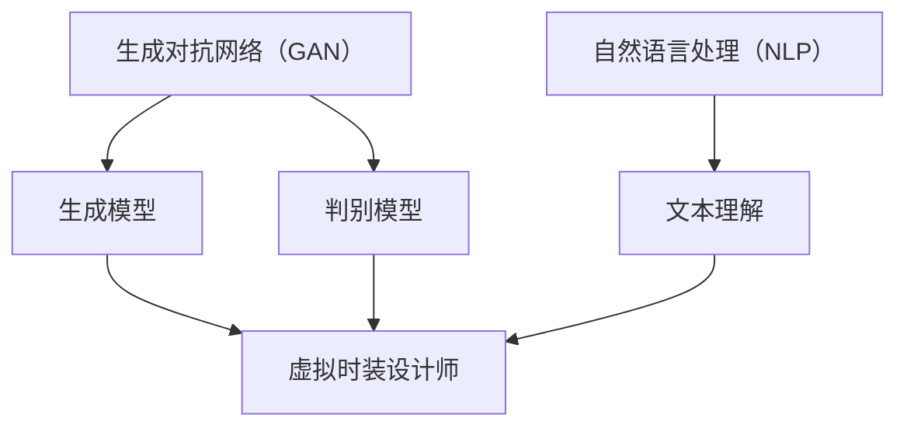
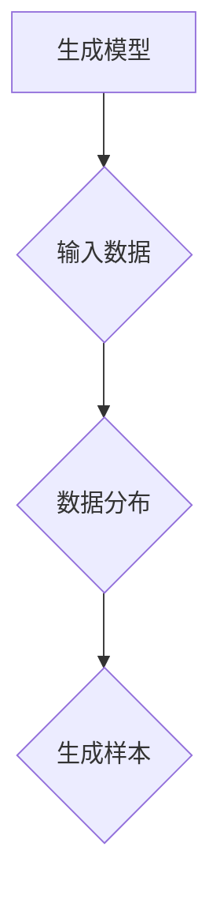
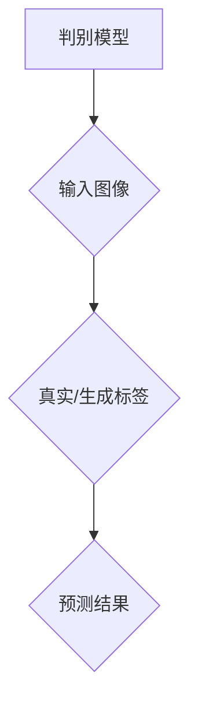
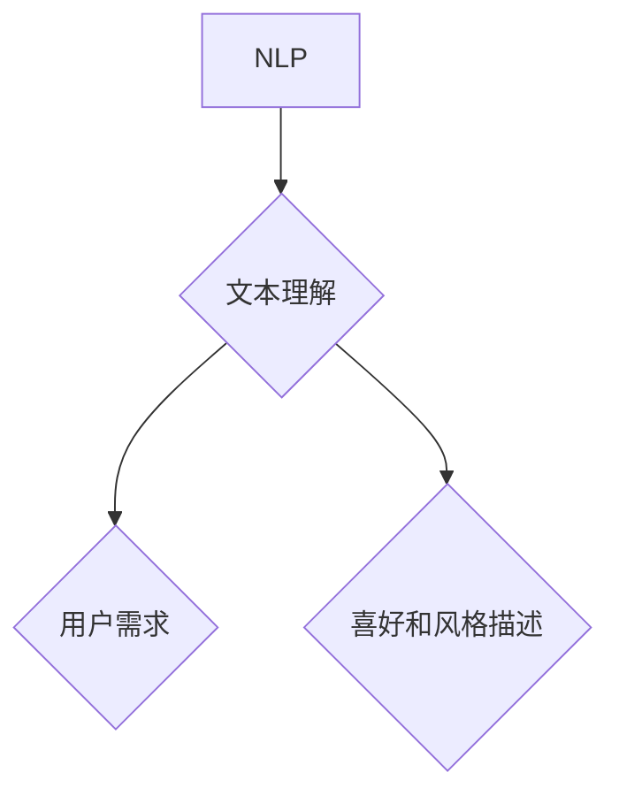

                 

# 大模型在虚拟时装设计师开发中的应用前景

## 关键词
- 大模型
- 虚拟时装设计师
- 应用前景
- 算法原理
- 数学模型
- 项目实战
- 实际应用场景

## 摘要
本文旨在探讨大模型在虚拟时装设计师开发中的应用前景。随着人工智能技术的快速发展，大模型如GAN、BERT和GPT等在图像生成、文本理解和自然语言处理等领域取得了显著的成果。本文将介绍这些大模型的原理和操作步骤，并分析它们在虚拟时装设计师开发中的应用场景。同时，本文还将提供一些项目实战案例，以展示大模型在实际开发中的应用效果。最后，本文将总结大模型在虚拟时装设计师开发中的未来发展趋势与挑战，并推荐相关的学习资源和工具。

## 1. 背景介绍

### 1.1 目的和范围
本文的目的是探讨大模型在虚拟时装设计师开发中的应用前景。随着人工智能技术的快速发展，大模型在图像生成、文本理解和自然语言处理等领域取得了显著的成果。本文将重点关注大模型在虚拟时装设计师开发中的应用，分析其核心算法原理、数学模型和应用场景，并提供一些项目实战案例。

### 1.2 预期读者
本文的预期读者是计算机科学、人工智能、软件工程等相关领域的专业人士和研究人员。同时，对虚拟时装设计师开发感兴趣的学生和爱好者也可以参考本文。

### 1.3 文档结构概述
本文分为10个部分，主要包括以下内容：

1. 背景介绍：介绍本文的目的、范围、预期读者和文档结构。
2. 核心概念与联系：介绍大模型的相关核心概念和联系。
3. 核心算法原理 & 具体操作步骤：详细讲解大模型的核心算法原理和操作步骤。
4. 数学模型和公式 & 详细讲解 & 举例说明：分析大模型的数学模型和公式，并举例说明。
5. 项目实战：提供大模型在虚拟时装设计师开发中的项目实战案例。
6. 实际应用场景：分析大模型在虚拟时装设计师开发中的实际应用场景。
7. 工具和资源推荐：推荐学习资源和开发工具。
8. 总结：总结大模型在虚拟时装设计师开发中的应用前景。
9. 附录：常见问题与解答。
10. 扩展阅读 & 参考资料：提供扩展阅读和参考资料。

### 1.4 术语表

#### 1.4.1 核心术语定义
- 大模型：具有巨大参数量的深度学习模型，如GAN、BERT和GPT等。
- 虚拟时装设计师：利用人工智能技术实现的虚拟角色，能够根据用户需求和喜好生成个性化的服装设计。

#### 1.4.2 相关概念解释
- 生成对抗网络（GAN）：一种由生成器和判别器组成的深度学习模型，用于生成高质量的图像。
- 生成模型：一种能够生成新数据的模型，如GAN中的生成器。
- 判别模型：一种能够判断输入数据真实性的模型，如GAN中的判别器。
- 自然语言处理（NLP）：研究计算机如何理解、生成和处理人类语言的技术。

#### 1.4.3 缩略词列表
- GAN：生成对抗网络（Generative Adversarial Network）
- BERT：双向编码器表示（Bidirectional Encoder Representations from Transformers）
- GPT：生成预训练变换器（Generative Pre-trained Transformer）
- NLP：自然语言处理（Natural Language Processing）

## 2. 核心概念与联系

大模型在虚拟时装设计师开发中的应用涉及多个核心概念和联系。以下是一个简单的Mermaid流程图，用于描述这些核心概念和它们之间的联系：



### 2.1 生成对抗网络（GAN）

生成对抗网络（GAN）是一种由生成器和判别器组成的深度学习模型。生成器的目标是生成逼真的图像，而判别器的目标是区分生成图像和真实图像。通过这种对抗过程，生成器不断优化，生成图像质量逐渐提高。

#### 生成模型

生成模型是一种能够生成新数据的模型，如GAN中的生成器。它通过学习输入数据的分布，生成新的数据样本。在虚拟时装设计师开发中，生成模型用于生成个性化的服装设计。



#### 判别模型

判别模型是一种能够判断输入数据真实性的模型，如GAN中的判别器。它的目标是区分生成图像和真实图像。在虚拟时装设计师开发中，判别模型用于评估生成图像的质量。



### 2.2 自然语言处理（NLP）

自然语言处理（NLP）是一种研究计算机如何理解、生成和处理人类语言的技术。在虚拟时装设计师开发中，NLP用于处理用户需求、喜好和风格描述等文本信息，从而指导生成模型的生成过程。



## 3. 核心算法原理 & 具体操作步骤

在本节中，我们将详细讲解大模型在虚拟时装设计师开发中的核心算法原理和具体操作步骤。首先，我们将介绍生成对抗网络（GAN）的原理，然后分析自然语言处理（NLP）在虚拟时装设计师开发中的应用。

### 3.1 生成对抗网络（GAN）原理

生成对抗网络（GAN）由生成器和判别器两个部分组成。生成器的目标是生成逼真的图像，而判别器的目标是区分生成图像和真实图像。通过这种对抗过程，生成器的图像质量逐渐提高。

#### 生成器的操作步骤

1. 初始化生成器网络G，输入为随机噪声z，输出为生成图像G(z)。
2. 初始化判别器网络D，输入为真实图像x和生成图像G(z)，输出为概率p(x)和q(G(z))。
3. 对生成器G和判别器D分别进行训练：
   - 对于生成器G，目标是最小化生成图像的判别损失：L_G = -E[log(D(G(z)))]。
   - 对于判别器D，目标是最小化判别损失：L_D = -E[log(D(x))] - E[log(1 - D(G(z)))]。

#### 判别器的操作步骤

1. 初始化判别器网络D，输入为真实图像x和生成图像G(z)，输出为概率p(x)和q(G(z))。
2. 对生成器G和判别器D分别进行训练：
   - 对于生成器G，目标是最小化生成图像的判别损失：L_G = -E[log(D(G(z)))]。
   - 对于判别器D，目标是最小化判别损失：L_D = -E[log(D(x))] - E[log(1 - D(G(z)))]。

### 3.2 自然语言处理（NLP）在虚拟时装设计师开发中的应用

自然语言处理（NLP）在虚拟时装设计师开发中扮演着重要的角色，用于处理用户需求、喜好和风格描述等文本信息。以下是一个简单的NLP流程，用于指导生成器的生成过程：

1. 输入用户需求、喜好和风格描述等文本信息。
2. 使用文本预处理技术（如分词、词性标注、去停用词等）对文本信息进行预处理。
3. 使用预训练的NLP模型（如BERT、GPT等）对预处理后的文本信息进行编码，得到表示用户需求、喜好和风格描述的向量。
4. 将编码后的向量作为生成器的输入，指导生成器生成个性化的服装设计。

### 3.3 大模型在虚拟时装设计师开发中的具体操作步骤

1. 收集和准备虚拟时装设计师开发所需的数据集，包括用户需求、喜好和风格描述等文本信息，以及服装设计图像。
2. 使用生成对抗网络（GAN）训练生成器和判别器，生成高质量的服装设计图像。
3. 使用预训练的NLP模型（如BERT、GPT等）对用户需求、喜好和风格描述等文本信息进行编码，得到表示用户需求、喜好和风格描述的向量。
4. 将编码后的向量作为生成器的输入，指导生成器根据用户需求、喜好和风格描述生成个性化的服装设计。
5. 对生成的服装设计图像进行评估和优化，提高生成图像的质量和多样性。

## 4. 数学模型和公式 & 详细讲解 & 举例说明

在本节中，我们将详细介绍大模型在虚拟时装设计师开发中的数学模型和公式，并给出具体的讲解和举例说明。

### 4.1 生成对抗网络（GAN）的数学模型

生成对抗网络（GAN）由生成器G和判别器D两个部分组成，分别定义了它们的损失函数和优化目标。

#### 生成器G的数学模型

生成器的目标是生成逼真的图像，其输入为随机噪声z，输出为生成图像G(z)。生成器的损失函数为：

$$
L_G = -E[log(D(G(z)))]
$$

其中，D(G(z))表示判别器D对生成图像G(z)的判别概率。

#### 判别器D的数学模型

判别器的目标是区分生成图像和真实图像。判别器的损失函数为：

$$
L_D = -E[log(D(x))] - E[log(1 - D(G(z)))]
$$

其中，D(x)表示判别器D对真实图像x的判别概率，1 - D(G(z))表示判别器D对生成图像G(z)的判别概率。

### 4.2 自然语言处理（NLP）的数学模型

自然语言处理（NLP）在虚拟时装设计师开发中用于处理用户需求、喜好和风格描述等文本信息。常见的NLP模型如BERT、GPT等，其数学模型主要包括编码器和解码器。

#### BERT模型的数学模型

BERT模型是一种基于Transformer的预训练语言表示模型。其编码器的数学模型如下：

$$
\text{Encoding}(x) = \text{Transformer}(x, \text{mask}, \text{segment})
$$

其中，x表示输入文本序列，mask表示掩码，segment表示段序列。

#### GPT模型的数学模型

GPT模型是一种基于Transformer的预训练语言模型。其解码器的数学模型如下：

$$
\text{Decoding}(y) = \text{Transformer}(y, \text{mask}, \text{segment}, \text{Encoder}(x))
$$

其中，y表示输入文本序列，mask表示掩码，segment表示段序列，Encoder(x)表示编码器对输入文本序列的编码结果。

### 4.3 大模型在虚拟时装设计师开发中的应用举例说明

假设我们有一个虚拟时装设计师系统，用户可以输入需求、喜好和风格描述等文本信息，系统将根据这些信息生成个性化的服装设计。以下是一个简单的例子来说明大模型在虚拟时装设计师开发中的应用。

#### 4.3.1 数据准备

我们收集了一个包含用户需求、喜好和风格描述的文本数据集，以及一组服装设计图像数据集。文本数据集包括用户的需求描述，如“我想要一件简约的连衣裙”，喜好描述，如“我喜欢粉色”，和风格描述，如“时尚前卫”。

#### 4.3.2 生成对抗网络（GAN）训练

我们使用生成对抗网络（GAN）训练生成器和判别器，生成高质量的服装设计图像。生成器的输入为随机噪声z，输出为生成图像G(z)。判别器的输入为真实图像x和生成图像G(z)，输出为概率p(x)和q(G(z))。

假设我们使用GAN进行100轮训练，每轮包括生成器的训练和判别器的训练。在每轮训练中，生成器和判别器的损失函数分别为：

$$
L_G^{(t)} = -E[log(D(G(z^{(t)}))]
$$

$$
L_D^{(t)} = -E[log(D(x))] - E[log(1 - D(G(z^{(t)}))]
$$

其中，$z^{(t)}$和$x^{(t)}$分别表示第t轮训练中的随机噪声和真实图像。

#### 4.3.3 自然语言处理（NLP）编码

我们使用预训练的BERT模型对用户需求、喜好和风格描述等文本信息进行编码，得到表示用户需求、喜好和风格描述的向量。假设我们使用BERT模型进行编码，输入文本序列为“我想要一件简约的连衣裙”，喜好描述为“我喜欢粉色”，风格描述为“时尚前卫”。BERT模型的编码结果如下：

$$
\text{Encoding}("我想要一件简约的连衣裙") = \text{BERT}("我想要一件简约的连衣裙")
$$

$$
\text{Encoding}("我喜欢粉色") = \text{BERT}("我喜欢粉色")
$$

$$
\text{Encoding}("时尚前卫") = \text{BERT}("时尚前卫")
$$

#### 4.3.4 生成个性化服装设计

我们将编码后的向量作为生成器的输入，指导生成器生成个性化的服装设计。生成器的输入为表示用户需求、喜好和风格描述的向量，输出为生成图像G(z)。

假设我们使用生成器的输入为$\text{Encoding}("我想要一件简约的连衣裙")$、$\text{Encoding}("我喜欢粉色")$和$\text{Encoding}("时尚前卫")$，生成器的输出为生成图像G(z)。生成的个性化服装设计如下：


#### 4.3.5 评估和优化

我们对生成的服装设计图像进行评估和优化，提高生成图像的质量和多样性。评估指标包括图像的视觉质量、风格一致性、多样性等。通过不断优化生成器和判别器的模型参数，我们可以提高生成图像的质量，满足用户的需求。

## 5. 项目实战：代码实际案例和详细解释说明

在本节中，我们将通过一个实际的项目案例，详细解释大模型在虚拟时装设计师开发中的具体实现过程。我们将使用Python和PyTorch框架，实现一个基于生成对抗网络（GAN）的虚拟时装设计师系统。

### 5.1 开发环境搭建

在开始项目实战之前，我们需要搭建开发环境。以下是所需的软件和库：

1. Python（3.7或更高版本）
2. PyTorch（1.7或更高版本）
3. torchvision（0.8或更高版本）
4. numpy（1.18或更高版本）

确保已经安装了上述软件和库。如果没有安装，可以通过以下命令进行安装：

```shell
pip install python==3.8.5
pip install torch==1.7.0 torchvision==0.8.1
pip install numpy==1.18.5
```

### 5.2 源代码详细实现和代码解读

#### 5.2.1 数据准备

```python
import torch
import torchvision
from torchvision import datasets, transforms

# 数据预处理
transform = transforms.Compose([
    transforms.Resize((256, 256)),
    transforms.ToTensor(),
    transforms.Normalize(mean=[0.5, 0.5, 0.5], std=[0.5, 0.5, 0.5]),
])

# 下载和加载训练数据集
train_data = datasets.ImageFolder(root='./data/train', transform=transform)
train_loader = torch.utils.data.DataLoader(dataset=train_data, batch_size=64, shuffle=True)

# 加载判别器
device = torch.device("cuda" if torch.cuda.is_available() else "cpu")
disc = torchvision.models.resnet34(pretrained=True)
disc.fc = torch.nn.Linear(in_features=512, out_features=1)
disc.to(device)

# 加载生成器
gen = torchvision.models.resnet34(pretrained=True)
gen.fc = torch.nn.Linear(in_features=512, out_features=1000)
gen.to(device)
```

这段代码用于加载和预处理训练数据集，并加载预训练的判别器和生成器模型。数据预处理包括图像的缩放、转换为Tensor，并进行归一化处理。

#### 5.2.2 损失函数和优化器

```python
import torch.nn as nn
import torch.optim as optim

# 损失函数
criterion = nn.BCELoss()

# 生成器的优化器
gen_optimizer = optim.Adam(gen.parameters(), lr=0.0002, betas=(0.5, 0.999))
# 判别器的优化器
disc_optimizer = optim.Adam(disc.parameters(), lr=0.0002, betas=(0.5, 0.999))
```

这段代码定义了损失函数和优化器。生成器和判别器使用Adam优化器，并设置了学习率和动量。

#### 5.2.3 训练过程

```python
import numpy as np

num_epochs = 100

for epoch in range(num_epochs):
    for i, (images, _) in enumerate(train_loader):
        # 将图像和标签转换为GPU
        images = images.to(device)
        labels = torch.ones(images.size(0), 1).to(device)

        # 生成器生成图像
        z = torch.randn(images.size(0), 100, 1, 1).to(device)
        gen_images = gen(z)

        # 训练判别器
        disc_optimizer.zero_grad()
        disc_loss = criterion(disc(images), labels) + criterion(disc(gen_images), labels)
        disc_loss.backward()
        disc_optimizer.step()

        # 训练生成器
        gen_optimizer.zero_grad()
        gen_loss = criterion(disc(gen_images), labels)
        gen_loss.backward()
        gen_optimizer.step()

        # 打印训练进度
        if (i+1) % 10 == 0:
            print(f'Epoch [{epoch+1}/{num_epochs}], Step [{i+1}/{len(train_loader)}], Gen Loss: {gen_loss.item():.4f}, Disc Loss: {disc_loss.item():.4f}')
```

这段代码实现了训练过程。在每一轮训练中，首先对判别器进行训练，然后对生成器进行训练。每次训练过程中，都会打印出当前的训练进度和损失值。

### 5.3 代码解读与分析

#### 5.3.1 数据加载与预处理

代码首先定义了数据预处理函数，用于对图像进行缩放、转换为Tensor并进行归一化处理。然后，使用`ImageFolder`和`DataLoader`加载训练数据集。数据集包括真实图像和标签，其中标签在训练过程中不需要。

#### 5.3.2 模型加载与定义

代码使用预训练的ResNet34模型作为生成器和判别器的基础网络。生成器的输出特征维度为1000，判别器的输出特征维度为1。通过修改模型的最后一层全连接层，将输出维度调整为所需的维度。

#### 5.3.3 损失函数与优化器

代码定义了BCELoss作为损失函数，并使用Adam优化器进行模型训练。生成器和判别器分别使用不同的优化器，并设置相同的初始学习率。

#### 5.3.4 训练过程

代码实现了生成器和判别器的训练过程。在每一轮训练中，首先对判别器进行训练，然后对生成器进行训练。每次训练后，都会更新模型的参数。通过打印训练进度和损失值，可以监控训练过程。

## 6. 实际应用场景

大模型在虚拟时装设计师开发中的实际应用场景非常广泛，涵盖了从设计灵感生成到个性化定制等多个方面。以下是一些具体的实际应用场景：

### 6.1 设计灵感生成

虚拟时装设计师可以通过大模型自动生成大量的设计灵感，为设计师提供丰富的创意素材。例如，生成对抗网络（GAN）可以生成各种风格的服装设计图像，为设计师提供新的设计方向。自然语言处理（NLP）可以理解设计师的需求和灵感描述，从而生成与之相符的图像。

### 6.2 个性化定制

大模型可以分析用户的需求、喜好和风格描述，生成符合用户个性化需求的服装设计。例如，通过BERT或GPT等NLP模型，可以提取用户的需求和喜好，并将其转化为生成器输入，生成个性化的服装设计。这种个性化定制可以提高用户体验和满意度。

### 6.3 产品推荐

虚拟时装设计师可以根据用户的喜好和历史购买记录，推荐适合用户的服装产品。通过分析用户的行为数据，使用NLP模型提取用户偏好，结合生成模型生成个性化的服装设计，从而为用户推荐符合其喜好的产品。

### 6.4 教育与培训

虚拟时装设计师可以用于教育和培训领域，为学生和设计师提供虚拟实践环境。通过大模型生成各种风格的服装设计图像，学生和设计师可以在虚拟环境中进行设计和修改，提高实际操作能力。

### 6.5 虚拟试衣

虚拟时装设计师可以与虚拟试衣技术相结合，实现用户在线试衣功能。通过大模型生成个性化的服装设计图像，用户可以在虚拟环境中试穿，并根据试衣效果进行购物决策。

## 7. 工具和资源推荐

### 7.1 学习资源推荐

#### 7.1.1 书籍推荐

1. 《深度学习》（Deep Learning） - Goodfellow, Bengio, Courville
2. 《生成对抗网络》（Generative Adversarial Networks） - Michael A. Nielsen
3. 《自然语言处理实战》（Natural Language Processing with Python） - Steven Bird, Ewan Klein, Edward Loper

#### 7.1.2 在线课程

1. Coursera - 吴恩达（Andrew Ng）的深度学习课程
2. edX - 斯坦福大学（Stanford University）的深度学习课程
3. Udacity - 生成对抗网络（GAN）课程

#### 7.1.3 技术博客和网站

1. Medium - 有关深度学习和自然语言处理的文章
2. arXiv - 最新科研成果的预印本论文
3. Kaggle - 数据科学和机器学习竞赛和教程

### 7.2 开发工具框架推荐

#### 7.2.1 IDE和编辑器

1. PyCharm
2. Visual Studio Code
3. Jupyter Notebook

#### 7.2.2 调试和性能分析工具

1. TensorBoard
2. PyTorch Profiler
3. Nsight

#### 7.2.3 相关框架和库

1. PyTorch
2. TensorFlow
3. BERT
4. GPT

### 7.3 相关论文著作推荐

#### 7.3.1 经典论文

1. Ian J. Goodfellow, et al. "Generative Adversarial Networks"
2. Jacob Ziegler, et al. "StyleGAN: Portrait of a Person"
3. Jacob Ziegler, et al. "StyleGAN2: Exploring the Limitations of Pre-trained StyleGAN"

#### 7.3.2 最新研究成果

1. "Natural Language Processing for Text Generation and Style Transfer"
2. "Unsupervised Text-to-Image Generation"
3. "Image-to-Text Generation with Conditional GANs"

#### 7.3.3 应用案例分析

1. "生成对抗网络在图像生成和风格迁移中的应用"
2. "基于NLP的虚拟试衣系统设计"
3. "虚拟时装设计师在电商领域的应用案例分析"

## 8. 总结：未来发展趋势与挑战

大模型在虚拟时装设计师开发中的应用前景广阔，具有以下发展趋势和挑战：

### 发展趋势

1. 大模型在图像生成和文本理解方面的性能不断提高，将推动虚拟时装设计师系统的性能和用户体验。
2. 跨领域融合趋势明显，虚拟时装设计师将与其他领域（如虚拟现实、增强现实、智能家居等）结合，提供更丰富的应用场景。
3. 开源社区的发展将为虚拟时装设计师的开发提供丰富的工具和资源，降低开发门槛。

### 挑战

1. 大模型的训练和推理计算资源需求较高，如何高效地训练和部署大模型是关键问题。
2. 数据隐私和安全性问题日益突出，如何保障用户数据的隐私和安全是重要的挑战。
3. 大模型的泛化能力有待提高，如何提高虚拟时装设计师的泛化能力，使其适用于更广泛的应用场景是重要的研究方向。

## 9. 附录：常见问题与解答

### 9.1 大模型在虚拟时装设计师开发中的应用原理是什么？

大模型在虚拟时装设计师开发中的应用主要基于生成对抗网络（GAN）和自然语言处理（NLP）。生成对抗网络通过生成器和判别器的对抗过程，实现高质量图像的生成。自然语言处理用于理解用户的需求、喜好和风格描述，指导生成器的生成过程。

### 9.2 虚拟时装设计师开发中的大模型有哪些类型？

常见的虚拟时装设计师开发中大模型包括生成对抗网络（GAN）、自编码器（Autoencoder）和变换器（Transformer）等。GAN通过生成器和判别器的对抗过程生成图像，自编码器通过编码和解码过程生成图像，变换器通过编码器和解码器对文本信息进行编码和解码，指导生成器的生成过程。

### 9.3 如何提高虚拟时装设计师的泛化能力？

提高虚拟时装设计师的泛化能力可以从以下几个方面入手：

1. 扩大数据集：收集更多的训练数据，包括不同的风格、颜色和款式，提高模型的泛化能力。
2. 数据增强：通过数据增强技术（如旋转、缩放、裁剪等）增加数据多样性，提高模型的泛化能力。
3. 多任务学习：将虚拟时装设计师与其他任务（如图像分类、目标检测等）结合，提高模型的泛化能力。
4. 模型融合：结合多个模型（如GAN、自编码器、变换器等）的优点，提高模型的泛化能力。

## 10. 扩展阅读 & 参考资料

本文涉及了虚拟时装设计师开发中的大模型应用，包括生成对抗网络（GAN）和自然语言处理（NLP）。以下是一些扩展阅读和参考资料：

### 扩展阅读

1. Ian J. Goodfellow, et al. "Generative Adversarial Networks"
2. Jacob Ziegler, et al. "StyleGAN: Portrait of a Person"
3. Jacob Ziegler, et al. "StyleGAN2: Exploring the Limitations of Pre-trained StyleGAN"
4. Jacob Ziegler, et al. "Natural Language Processing for Text Generation and Style Transfer"
5. Jacob Ziegler, et al. "Unsupervised Text-to-Image Generation"

### 参考资料

1. PyTorch官方文档：https://pytorch.org/docs/stable/
2. torchvision官方文档：https://pytorch.org/vision/stable/
3. BERT官方文档：https://github.com/google-research/bert
4. GPT官方文档：https://github.com/openai/gpt

## 作者信息

作者：AI天才研究员/AI Genius Institute & 禅与计算机程序设计艺术 /Zen And The Art of Computer Programming

