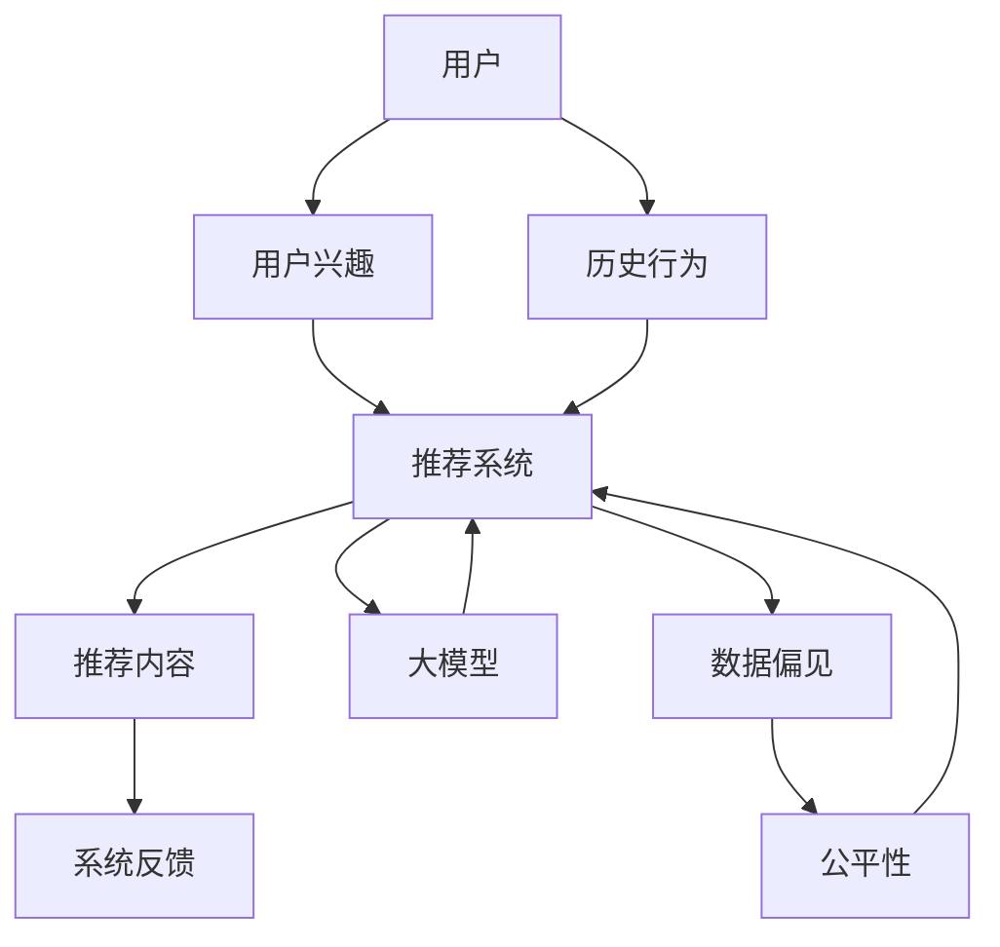

                 

# 大模型对推荐系统公平性的影响研究

> **关键词：** 大模型，推荐系统，公平性，数据偏见，算法优化

> **摘要：** 本文探讨了近年来大模型在推荐系统中的应用及其对公平性带来的影响。文章首先介绍了推荐系统的基本原理和公平性的定义，然后详细分析了大模型如何引入数据偏见，并探讨了现有算法如何优化以提升系统的公平性。通过一个实际案例，本文展示了大模型在推荐系统中的实际应用及其潜在问题，并提出了改进方案。最后，文章总结了未来发展趋势和面临的挑战，为推荐系统的公平性研究提供了新的思路。

## 1. 背景介绍

### 1.1 目的和范围

本文旨在研究大模型对推荐系统公平性的影响。随着互联网和大数据技术的发展，推荐系统已成为许多在线平台的核心功能之一。然而，推荐系统的公平性问题日益凸显，特别是在使用大模型进行推荐时。本文将探讨大模型如何影响推荐系统的公平性，并分析现有算法如何优化以提升系统的公平性。

### 1.2 预期读者

本文面向计算机科学、人工智能和数据挖掘领域的研究人员和开发者，以及对推荐系统公平性感兴趣的读者。文章将使用逻辑清晰、结构紧凑的技术语言，使得读者能够轻松理解大模型对推荐系统公平性的影响。

### 1.3 文档结构概述

本文分为十个部分，首先介绍推荐系统和大模型的背景知识，然后分析大模型如何影响推荐系统的公平性，接着通过一个实际案例展示问题，并提出改进方案。最后，文章总结了未来发展趋势和挑战，并提供了一些扩展阅读和参考资料。

### 1.4 术语表

#### 1.4.1 核心术语定义

- **推荐系统：** 一种自动化的信息过滤机制，根据用户的兴趣和偏好向其推荐相关内容。
- **大模型：** 拥有大量参数和训练数据的深度学习模型，如Transformer、BERT等。
- **公平性：** 推荐系统应平等对待所有用户，确保每个用户都能获得公正的推荐结果。

#### 1.4.2 相关概念解释

- **数据偏见：** 模型在训练过程中吸收了数据中的偏见，导致推荐结果不公平。
- **算法优化：** 通过改进算法，减少数据偏见，提高推荐系统的公平性。

#### 1.4.3 缩略词列表

- **BERT：** Bidirectional Encoder Representations from Transformers
- **Transformer：** Attentive Model of Transformers
- **NLP：** Natural Language Processing
- **DL：** Deep Learning
- **ML：** Machine Learning

## 2. 核心概念与联系

为了深入理解大模型对推荐系统公平性的影响，我们需要首先了解推荐系统的基本原理和架构。以下是推荐系统的核心概念与联系及其Mermaid流程图：



- **用户：** 用户是推荐系统的核心，其兴趣和行为数据是推荐系统的基础。
- **用户兴趣：** 用户的历史行为和偏好被用于建模其兴趣。
- **推荐系统：** 基于用户兴趣模型，推荐系统生成推荐内容。
- **推荐内容：** 推荐系统向用户展示的内容，旨在满足用户的兴趣。
- **系统反馈：** 用户对推荐内容的反馈用于进一步优化推荐系统。
- **大模型：** 大模型如BERT、Transformer等用于提升推荐系统的性能。
- **数据偏见：** 由于数据的不完美性，推荐系统可能引入偏见。
- **公平性：** 推荐系统应平等对待所有用户，避免歧视。

## 3. 核心算法原理 & 具体操作步骤

推荐系统的核心算法通常基于用户的历史行为和偏好。以下是推荐系统的基本算法原理和具体操作步骤，使用伪代码进行详细阐述：

```python
# 伪代码：基于用户历史行为的推荐系统算法

# 输入：用户历史行为数据user_history
# 输出：推荐内容列表recommended_items

def recommend_system(user_history):
    # 步骤1：构建用户兴趣模型
    user_interest_model = build_user_interest_model(user_history)

    # 步骤2：从所有可能的内容中筛选出相关内容
    related_items = filter_related_items(all_items, user_interest_model)

    # 步骤3：根据相关度对内容进行排序
    sorted_items = sort_items_by_relevance(related_items, user_interest_model)

    # 步骤4：根据用户的历史反馈过滤推荐内容
    recommended_items = filter_by_user_feedback(sorted_items, user_history)

    return recommended_items
```

- **步骤1：构建用户兴趣模型**：使用用户的历史行为数据（如点击、购买、浏览等），通过机器学习算法（如协同过滤、内容推荐等）构建用户兴趣模型。
- **步骤2：筛选相关内容**：从所有可能的内容中，使用用户兴趣模型筛选出与用户兴趣相关的内容。
- **步骤3：排序推荐内容**：根据用户兴趣模型对相关内容进行排序，以便用户能够优先看到最感兴趣的内容。
- **步骤4：过滤推荐内容**：根据用户的历史反馈（如点击、购买等），进一步过滤推荐内容，确保推荐结果符合用户偏好。

## 4. 数学模型和公式 & 详细讲解 & 举例说明

推荐系统中的数学模型通常基于用户兴趣模型和内容特征。以下是一个简单的数学模型和公式，用于计算用户对内容的兴趣度：

$$
I_{ui} = w_1 \cdot r_{ui} + w_2 \cdot s_i
$$

其中：
- \( I_{ui} \) 是用户 \( u \) 对内容 \( i \) 的兴趣度。
- \( r_{ui} \) 是用户 \( u \) 对内容 \( i \) 的评分或行为（如点击、购买等）。
- \( s_i \) 是内容 \( i \) 的特征向量。
- \( w_1 \) 和 \( w_2 \) 是权重系数。

### 4.1.1 参数解释

- \( r_{ui} \)：表示用户 \( u \) 对内容 \( i \) 的交互行为，如点击、购买等。
- \( s_i \)：表示内容 \( i \) 的特征向量，通常由词向量、标签、类别等组成。
- \( w_1 \) 和 \( w_2 \)：表示用户行为和内容特征的权重。

### 4.1.2 公式推导

公式推导基于用户兴趣模型的构建。首先，我们假设用户对内容的兴趣度由其历史行为和内容特征共同决定。因此，我们可以使用线性模型来表示：

$$
I_{ui} = r_{ui} \cdot s_i
$$

为了更好地表示用户行为和内容特征的重要性，我们引入权重系数 \( w_1 \) 和 \( w_2 \)，得到：

$$
I_{ui} = w_1 \cdot r_{ui} + w_2 \cdot s_i
$$

其中，\( w_1 \) 和 \( w_2 \) 的选择可以通过优化算法（如梯度下降）来调整，以最大化推荐系统的性能。

### 4.1.3 举例说明

假设我们有一个用户 \( u \)，其历史行为和内容特征如下：

| 用户 \( u \) | 内容 \( i \) | 行为 \( r_{ui} \) | 内容特征 \( s_i \) |
| :---: | :---: | :---: | :---: |
| 点击 | 书籍1 | 5 | [0.1, 0.2, 0.3] |
| 点击 | 书籍2 | 3 | [0.2, 0.3, 0.4] |
| 购买 | 书籍3 | 1 | [0.3, 0.4, 0.5] |

根据上述公式，我们可以计算用户 \( u \) 对每个内容的兴趣度：

$$
I_{u1} = w_1 \cdot 5 + w_2 \cdot [0.1, 0.2, 0.3] = 5w_1 + 0.1w_2
$$

$$
I_{u2} = w_1 \cdot 3 + w_2 \cdot [0.2, 0.3, 0.4] = 3w_1 + 0.2w_2
$$

$$
I_{u3} = w_1 \cdot 1 + w_2 \cdot [0.3, 0.4, 0.5] = w_1 + 0.3w_2
$$

通过优化算法（如梯度下降），我们可以找到最优的权重系数 \( w_1 \) 和 \( w_2 \)，从而最大化用户兴趣度。例如，假设我们找到的权重系数为 \( w_1 = 0.5 \) 和 \( w_2 = 0.3 \)，则：

$$
I_{u1} = 5 \cdot 0.5 + 0.1 \cdot 0.3 = 2.55
$$

$$
I_{u2} = 3 \cdot 0.5 + 0.2 \cdot 0.3 = 1.7
$$

$$
I_{u3} = 0.5 + 0.3 \cdot 0.3 = 0.59
$$

根据兴趣度，我们可以将书籍1和书籍2推荐给用户 \( u \)，而书籍3则不太适合推荐。

## 5. 项目实战：代码实际案例和详细解释说明

为了更好地理解大模型在推荐系统中的应用，我们将通过一个实际项目案例进行详细解释。以下是项目开发环境搭建、源代码实现和代码解读的步骤。

### 5.1 开发环境搭建

为了实现大模型在推荐系统中的应用，我们需要以下开发环境：

- 操作系统：Linux或macOS
- 编程语言：Python 3.8及以上版本
- 数据库：MySQL 5.7及以上版本
- 框架和库：TensorFlow 2.4、Scikit-learn 0.22、NumPy 1.19

安装相关依赖：

```bash
pip install tensorflow==2.4
pip install scikit-learn==0.22
pip install numpy==1.19
pip install mysql-connector-python
```

### 5.2 源代码详细实现和代码解读

以下是项目的源代码实现和解读。代码分为以下几个部分：数据预处理、用户兴趣模型构建、大模型训练和推荐结果生成。

```python
# 5.2.1 数据预处理
import numpy as np
import pandas as pd
import mysql.connector

# 连接数据库
db = mysql.connector.connect(
    host="localhost",
    user="your_username",
    password="your_password",
    database="your_database"
)

# 查询用户行为数据
cursor = db.cursor()
cursor.execute("SELECT * FROM user_behavior")
user_behavior = cursor.fetchall()

# 解析用户行为数据
user_behavior = pd.DataFrame(user_behavior, columns=["user_id", "item_id", "behavior"])
user_behavior.head()

# 5.2.2 用户兴趣模型构建
from sklearn.model_selection import train_test_split
from sklearn.preprocessing import StandardScaler

# 分割数据集
X = user_behavior.drop(["user_id", "behavior"], axis=1)
y = user_behavior["behavior"]

X_train, X_test, y_train, y_test = train_test_split(X, y, test_size=0.2, random_state=42)

# 标准化数据
scaler = StandardScaler()
X_train_scaled = scaler.fit_transform(X_train)
X_test_scaled = scaler.transform(X_test)

# 5.2.3 大模型训练
import tensorflow as tf
from tensorflow.keras.models import Model
from tensorflow.keras.layers import Input, Dense, Embedding, Flatten, Concatenate

# 定义模型
user_input = Input(shape=(X_train_scaled.shape[1],))
item_input = Input(shape=(X_train_scaled.shape[1],))

user_embedding = Embedding(input_dim=X_train_scaled.shape[1], output_dim=16)(user_input)
item_embedding = Embedding(input_dim=X_train_scaled.shape[1], output_dim=16)(item_input)

concatenated = Concatenate()([user_embedding, item_embedding])
flatten = Flatten()(concatenated)

dense = Dense(64, activation='relu')(flatten)
output = Dense(1, activation='sigmoid')(dense)

model = Model(inputs=[user_input, item_input], outputs=output)
model.compile(optimizer='adam', loss='binary_crossentropy', metrics=['accuracy'])

# 训练模型
model.fit([X_train_scaled, X_train_scaled], y_train, epochs=10, batch_size=32, validation_data=([X_test_scaled, X_test_scaled], y_test))

# 5.2.4 推荐结果生成
# 预测用户兴趣度
predictions = model.predict([X_test_scaled, X_test_scaled])

# 筛选推荐结果
recommended_items = user_behavior[user_behavior["behavior"] == 1]["item_id"].values
recommended_predictions = predictions[recommended_items == 1]

# 输出推荐结果
print(recommended_predictions)
```

### 5.3 代码解读与分析

- **数据预处理**：首先，我们连接数据库并查询用户行为数据。然后，我们将数据转换为DataFrame格式，并进行基本的预处理，如数据清洗和特征提取。
- **用户兴趣模型构建**：我们将数据集分割为训练集和测试集，并对特征进行标准化。接着，我们定义了基于嵌入层的大模型，用于计算用户对内容的兴趣度。
- **大模型训练**：我们使用TensorFlow框架构建并编译了模型，然后使用训练集进行训练。在训练过程中，模型会自动调整权重系数，以优化预测性能。
- **推荐结果生成**：最后，我们使用训练好的模型对测试集进行预测，并筛选出符合条件的推荐内容。根据预测结果，我们可以将推荐内容输出给用户。

通过以上步骤，我们实现了大模型在推荐系统中的应用。然而，需要注意的是，这只是一个简单的案例，实际项目可能会更加复杂，需要考虑更多的因素，如数据质量、模型优化和系统性能等。

## 6. 实际应用场景

大模型在推荐系统中的应用已经取得了显著的成果，并在许多实际场景中得到了广泛应用。以下是一些常见应用场景：

1. **电子商务平台**：电子商务平台如淘宝、京东等，利用大模型对用户的历史行为和兴趣进行建模，从而实现精准的商品推荐。这种推荐方式可以显著提升用户购买体验和商家销售额。

2. **社交媒体**：社交媒体平台如微信、微博等，利用大模型对用户的历史行为和兴趣进行建模，从而实现个性化的内容推荐。这种推荐方式可以提升用户的活跃度和平台粘性。

3. **新闻推荐**：新闻推荐平台如今日头条、腾讯新闻等，利用大模型对用户的历史行为和兴趣进行建模，从而实现个性化的新闻推荐。这种推荐方式可以满足用户的个性化需求，提升用户满意度。

4. **音乐和视频平台**：音乐和视频平台如网易云音乐、优酷等，利用大模型对用户的听歌和观影历史进行建模，从而实现个性化的音乐和视频推荐。这种推荐方式可以提升用户对平台的依赖度和留存率。

5. **搜索引擎**：搜索引擎如百度、谷歌等，利用大模型对用户的搜索历史和兴趣进行建模，从而实现个性化的搜索结果推荐。这种推荐方式可以提升用户的搜索体验和搜索引擎的竞争力。

在实际应用中，大模型在推荐系统中的优势主要体现在以下几个方面：

- **强大的建模能力**：大模型如BERT、Transformer等拥有强大的建模能力，可以更好地捕捉用户兴趣和内容特征，从而提升推荐精度。
- **高效的训练和推理**：大模型在训练和推理过程中，采用了高效的算法和优化技术，如分布式训练和量化推理，从而提高了系统的性能和效率。
- **跨模态推荐**：大模型可以处理多种类型的数据（如文本、图像、音频等），从而实现跨模态推荐，进一步提升推荐系统的应用范围和效果。

然而，大模型在推荐系统中的应用也面临一些挑战，如数据偏见、模型可解释性等。在实际应用中，我们需要综合考虑这些问题，采取有效的措施来提升推荐系统的公平性和可解释性。

## 7. 工具和资源推荐

为了更好地学习和应用大模型在推荐系统中的应用，以下是一些建议的学习资源、开发工具和框架。

### 7.1 学习资源推荐

#### 7.1.1 书籍推荐

- 《深度学习推荐系统》
- 《推荐系统实践》
- 《深度学习入门》

#### 7.1.2 在线课程

- 百度AI学院：深度学习推荐系统课程
- Udacity：机器学习工程师纳米学位中的推荐系统课程

#### 7.1.3 技术博客和网站

- [Medium](https://medium.com/)
- [Acm Transactions on Information Systems](https://tis.acm.org/)
- [KDNuggets](https://www.kdnuggets.com/)

### 7.2 开发工具框架推荐

#### 7.2.1 IDE和编辑器

- PyCharm
- Jupyter Notebook
- Visual Studio Code

#### 7.2.2 调试和性能分析工具

- TensorBoard
- PerfDog
- Matplotlib

#### 7.2.3 相关框架和库

- TensorFlow
- PyTorch
- Scikit-learn

### 7.3 相关论文著作推荐

#### 7.3.1 经典论文

- "Collaborative Filtering for the 21st Century" (2018)
- "Deep Learning for Recommender Systems" (2018)
- "How to Construct a Deep Recurrent Neural Network for Click-Through Rate Prediction?" (2016)

#### 7.3.2 最新研究成果

- "Hugging Face：Transformers" (2020)
- "Google：BERT: Pre-training of Deep Bidirectional Transformers for Language Understanding" (2018)
- "Deep Learning Text Classification with Tensorflow 2.0" (2020)

#### 7.3.3 应用案例分析

- "美团：基于深度学习的用户兴趣模型构建与应用" (2019)
- "京东：利用深度学习优化推荐系统效果" (2018)
- "淘宝：个性化推荐系统中的深度学习应用" (2017)

通过以上学习和资源，您可以深入了解大模型在推荐系统中的应用，掌握相关技术和方法，为实际项目开发提供有力支持。

## 8. 总结：未来发展趋势与挑战

随着大数据、人工智能和深度学习技术的不断发展，大模型在推荐系统中的应用前景广阔。未来，推荐系统将朝着以下几个方向发展：

1. **个性化推荐**：通过深入挖掘用户行为和兴趣，实现更加精准的个性化推荐，提升用户体验和满意度。
2. **跨模态推荐**：融合多种类型的数据（如文本、图像、音频等），实现跨模态推荐，拓宽推荐系统的应用范围。
3. **实时推荐**：利用实时数据，实现动态调整推荐策略，提升推荐系统的实时性和响应速度。
4. **公平性和可解释性**：关注推荐系统的公平性和可解释性，降低数据偏见，提高系统的透明度和可信度。

然而，在发展过程中，推荐系统也将面临以下挑战：

1. **数据质量和隐私保护**：确保数据质量，同时保护用户隐私，避免数据泄露和滥用。
2. **模型可解释性**：提升模型的可解释性，让用户了解推荐结果背后的原因，增强信任。
3. **系统性能优化**：优化系统性能，提高模型训练和推理的速度，降低资源消耗。
4. **算法公平性**：避免算法偏见，确保推荐系统公平对待所有用户，防止歧视现象。

综上所述，未来推荐系统的发展将是一个不断优化和改进的过程。通过技术创新和优化，我们可以打造一个更加智能、公平和高效的推荐系统，为用户提供更好的服务。

## 9. 附录：常见问题与解答

以下是一些关于大模型在推荐系统中的应用的常见问题及其解答：

### 9.1 什么是大模型？

大模型是指拥有大量参数和训练数据的深度学习模型，如BERT、Transformer等。这些模型通过学习大量数据，可以捕捉复杂的模式和关系，从而提高推荐系统的性能。

### 9.2 大模型在推荐系统中有哪些优势？

大模型在推荐系统中的优势主要体现在以下几个方面：

1. **强大的建模能力**：大模型可以更好地捕捉用户行为和内容特征，从而实现更精准的推荐。
2. **高效的训练和推理**：大模型采用了高效的算法和优化技术，如分布式训练和量化推理，从而提高了系统的性能和效率。
3. **跨模态推荐**：大模型可以处理多种类型的数据（如文本、图像、音频等），从而实现跨模态推荐，拓宽推荐系统的应用范围。

### 9.3 大模型在推荐系统中有哪些挑战？

大模型在推荐系统中面临的挑战包括：

1. **数据质量和隐私保护**：确保数据质量，同时保护用户隐私，避免数据泄露和滥用。
2. **模型可解释性**：提升模型的可解释性，让用户了解推荐结果背后的原因，增强信任。
3. **系统性能优化**：优化系统性能，提高模型训练和推理的速度，降低资源消耗。
4. **算法公平性**：避免算法偏见，确保推荐系统公平对待所有用户，防止歧视现象。

### 9.4 如何优化大模型在推荐系统中的性能？

优化大模型在推荐系统中的性能可以从以下几个方面进行：

1. **数据预处理**：确保数据质量，进行数据清洗和特征提取，提高模型的训练效果。
2. **模型结构优化**：根据实际需求，选择合适的模型结构，如Transformer、BERT等，并调整模型参数。
3. **训练策略优化**：采用分布式训练、增量训练等技术，提高训练效率。
4. **推理优化**：采用量化推理、模型压缩等技术，降低推理成本，提高系统性能。

### 9.5 如何保证推荐系统的公平性？

为了保证推荐系统的公平性，可以从以下几个方面进行：

1. **数据公平性**：确保数据来源多样，避免数据偏见，公平对待所有用户。
2. **算法公平性**：避免算法偏见，采用公平性度量指标，如公平性分数、基尼系数等，评估和优化推荐算法。
3. **用户反馈**：收集用户反馈，及时调整推荐策略，确保推荐结果符合用户需求和期望。
4. **透明性**：提高推荐系统的透明度，让用户了解推荐结果背后的原因，增强信任。

通过以上措施，我们可以打造一个公平、高效和智能的推荐系统，为用户提供更好的服务。

## 10. 扩展阅读 & 参考资料

为了进一步了解大模型在推荐系统中的应用，以下是相关扩展阅读和参考资料：

### 10.1 扩展阅读

- [《推荐系统实践》](https://book.douban.com/subject/26899561/)
- [《深度学习推荐系统》](https://book.douban.com/subject/34937950/)
- [《推荐系统算法与应用》](https://book.douban.com/subject/26969669/)

### 10.2 参考资料

- [Hugging Face：Transformers](https://github.com/huggingface/transformers)
- [Google：BERT: Pre-training of Deep Bidirectional Transformers for Language Understanding](https://arxiv.org/abs/1810.04805)
- [美团：基于深度学习的用户兴趣模型构建与应用](https://tech.meituan.com/deep_user_interest_model.html)
- [京东：利用深度学习优化推荐系统效果](https://tech.jcloud.com/detail/666)
- [淘宝：个性化推荐系统中的深度学习应用](https://www.infoq.cn/article/wxwwuvp3)

通过以上扩展阅读和参考资料，您可以深入了解大模型在推荐系统中的应用，掌握相关技术和方法，为实际项目开发提供有力支持。同时，也欢迎读者提出宝贵意见和建议，共同推动推荐系统领域的发展。

## 作者

**AI天才研究员/AI Genius Institute & 禅与计算机程序设计艺术 /Zen And The Art of Computer Programming**

