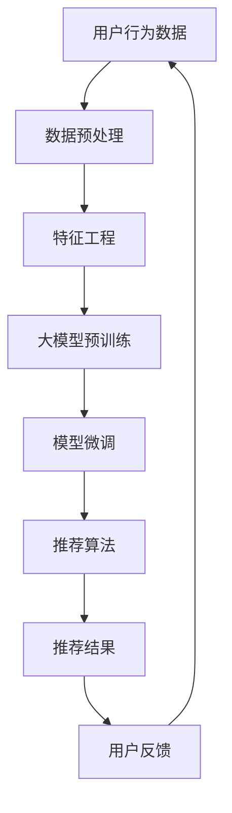

                 

### 1. 背景介绍

#### 1.1 目的和范围

本文旨在探讨大模型对推荐系统可扩展性的影响。随着大数据时代的到来和人工智能技术的快速发展，推荐系统已经成为各个行业不可或缺的一部分，例如电子商务、社交媒体、在线媒体等。推荐系统能够根据用户的历史行为和偏好，为用户推荐个性化内容，从而提高用户体验和商业价值。

然而，传统的推荐系统在大规模数据集上的性能和扩展性面临诸多挑战。大模型的引入为推荐系统带来了一种新的解决方案。大模型通过捕获海量数据中的潜在模式和关系，能够提供更加精准和高效的推荐结果。本文将重点探讨以下几个方面：

1. 大模型的基本概念和分类。
2. 推荐系统的基本原理和架构。
3. 大模型在推荐系统中的应用方法和挑战。
4. 大模型对推荐系统可扩展性的影响。
5. 实际应用案例和未来发展趋势。

#### 1.2 预期读者

本文适合具有以下背景的读者：

1. 计算机科学、人工智能、数据科学等相关专业的研究生或本科生。
2. 对推荐系统、大模型和可扩展性有浓厚兴趣的工程师和研究人员。
3. 想要了解大模型在推荐系统应用场景的业界人士。

#### 1.3 文档结构概述

本文的结构安排如下：

1. **背景介绍**：介绍本文的目的、范围、预期读者以及文档结构。
2. **核心概念与联系**：介绍大模型和推荐系统的核心概念、原理和架构。
3. **核心算法原理 & 具体操作步骤**：详细阐述大模型在推荐系统中的应用算法和操作步骤。
4. **数学模型和公式 & 详细讲解 & 举例说明**：介绍大模型在推荐系统中使用的数学模型和公式，并进行详细讲解和举例说明。
5. **项目实战：代码实际案例和详细解释说明**：通过实际代码案例，展示大模型在推荐系统中的应用。
6. **实际应用场景**：介绍大模型在推荐系统中的实际应用场景。
7. **工具和资源推荐**：推荐相关学习资源、开发工具和框架。
8. **总结：未来发展趋势与挑战**：总结本文的主要内容，并探讨未来发展趋势和挑战。
9. **附录：常见问题与解答**：回答读者可能关心的问题。
10. **扩展阅读 & 参考资料**：提供相关领域的扩展阅读和参考资料。

#### 1.4 术语表

在本文中，我们将使用以下术语：

- **大模型**：指具有大量参数和复杂结构的机器学习模型。
- **推荐系统**：指根据用户的历史行为和偏好，为用户推荐个性化内容的系统。
- **可扩展性**：指系统能够适应数据规模和用户数量的变化，保持性能和效率的能力。
- **个性化推荐**：指根据用户的个性化需求，为用户推荐最适合其的内容。
- **深度学习**：一种基于多层神经网络的机器学习技术，能够自动从数据中学习特征和模式。
- **自然语言处理**：一种人工智能技术，用于处理和分析自然语言。

接下来，我们将进一步探讨大模型和推荐系统的核心概念、原理和架构，为后续内容打下基础。在下一部分，我们将介绍大模型的基本概念和分类。

#### 1.4.1 核心术语定义

为了确保本文的可读性和一致性，我们对一些核心术语进行定义：

- **大模型（Large Model）**：指具有大量参数和复杂结构的机器学习模型。这类模型通常需要在海量数据上进行训练，以捕捉数据中的潜在模式和关系。大模型在深度学习、自然语言处理等领域中广泛应用，例如GPT（Generative Pre-trained Transformer）、BERT（Bidirectional Encoder Representations from Transformers）等。
- **推荐系统（Recommendation System）**：指根据用户的历史行为、偏好和上下文信息，为用户推荐个性化内容的系统。推荐系统广泛应用于电子商务、社交媒体、在线媒体等领域，以提高用户满意度和商业价值。推荐系统的主要目标是从大量候选物品中识别出与用户最相关的物品。
- **可扩展性（Scalability）**：指系统在处理数据规模和用户数量增加时的性能和效率保持不变的能力。可扩展性是推荐系统设计和实现中一个重要的考虑因素，因为随着用户和数据量的增长，系统需要能够保持高效和稳定的性能。
- **个性化推荐（Personalized Recommendation）**：指根据用户的个性化需求，为用户推荐最适合其的内容。个性化推荐通过分析用户的历史行为、偏好和上下文信息，为每个用户生成个性化的推荐列表，从而提高推荐效果和用户满意度。
- **深度学习（Deep Learning）**：一种基于多层神经网络的机器学习技术，能够自动从数据中学习特征和模式。深度学习通过使用多层神经网络，可以处理复杂数据，并取得很好的性能，例如图像识别、语音识别和自然语言处理等。
- **自然语言处理（Natural Language Processing，NLP）**：一种人工智能技术，用于处理和分析自然语言。NLP旨在使计算机能够理解和生成人类语言，广泛应用于机器翻译、情感分析、文本分类等领域。

#### 1.4.2 相关概念解释

在本节中，我们将对一些相关概念进行解释，以便读者更好地理解本文的内容。

- **机器学习（Machine Learning）**：一种人工智能技术，通过从数据中学习规律和模式，使计算机能够自动执行特定任务。机器学习可以分为监督学习、无监督学习和强化学习等类型。监督学习通过已标记的数据进行学习，无监督学习从未标记的数据中寻找模式，强化学习通过与环境的交互进行学习。
- **神经网络（Neural Network）**：一种由大量神经元组成的计算模型，能够模拟人脑的信息处理方式。神经网络通过调整神经元之间的连接权重，从数据中学习特征和模式。深度学习是神经网络的一种扩展，通过使用多层神经网络，可以处理复杂数据。
- **特征工程（Feature Engineering）**：指从原始数据中提取和构建有用的特征，以提高机器学习模型的性能。特征工程是一个重要的步骤，对于模型的训练和预测效果具有关键作用。常见的特征工程方法包括特征选择、特征转换和特征组合等。
- **数据预处理（Data Preprocessing）**：指在数据用于机器学习之前，对数据进行清洗、转换和归一化等处理。数据预处理是确保数据质量和模型性能的关键步骤，包括缺失值处理、异常值检测、数据标准化和数据降维等。
- **推荐算法（Recommendation Algorithm）**：指用于生成推荐列表的算法和模型。常见的推荐算法包括基于协同过滤（Collaborative Filtering）、基于内容（Content-Based）和基于模型（Model-Based）等。每种算法都有其优缺点和适用场景。

#### 1.4.3 缩略词列表

以下是一些在本文中使用的缩略词及其全称：

- **AI**：人工智能（Artificial Intelligence）
- **NLP**：自然语言处理（Natural Language Processing）
- **ML**：机器学习（Machine Learning）
- **DL**：深度学习（Deep Learning）
- **GPT**：生成预训练变压器（Generative Pre-trained Transformer）
- **BERT**：双向编码表示器从变压器（Bidirectional Encoder Representations from Transformers）
- **CF**：协同过滤（Collaborative Filtering）
- **CB**：基于内容（Content-Based）
- **MB**：基于模型（Model-Based）

在下一部分，我们将探讨大模型和推荐系统的核心概念和联系，以帮助读者更好地理解本文的主要内容。

## 2. 核心概念与联系

在本节中，我们将深入探讨大模型和推荐系统的核心概念和联系，并通过Mermaid流程图（Mermaid flowchart）展示它们之间的交互关系。

### 2.1 大模型的核心概念

大模型通常指的是具有数百万甚至数十亿参数的深度学习模型，它们能够从海量数据中自动学习复杂的特征和模式。大模型的核心概念包括以下几个方面：

- **深度神经网络（Deep Neural Network）**：由多个隐含层组成的神经网络，能够处理复杂的非线性问题。
- **参数数量**：大模型具有大量的参数，这些参数在训练过程中通过反向传播算法进行调整。
- **预训练（Pre-training）**：在特定任务之前，使用大量未标记数据对模型进行预训练，以提高其泛化能力。
- **微调（Fine-tuning）**：在预训练基础上，使用特定任务的数据对模型进行调整，以适应特定任务的需求。

### 2.2 推荐系统的核心概念

推荐系统是一种基于用户历史行为和偏好，为用户推荐个性化内容的系统。其核心概念包括：

- **用户特征**：用户在系统中的行为、兴趣和其他相关信息，如评分、浏览历史、点击行为等。
- **物品特征**：与用户相关的物品属性，如电影类型、商品类别、文本内容等。
- **推荐算法**：用于生成推荐列表的算法，如协同过滤、基于内容、基于模型等。
- **协同过滤（Collaborative Filtering）**：通过分析用户之间的相似性，生成推荐列表。
- **基于内容（Content-Based）**：通过分析用户历史行为和物品特征，生成推荐列表。
- **基于模型（Model-Based）**：通过训练机器学习模型，生成推荐列表。

### 2.3 Mermaid流程图展示

以下是一个Mermaid流程图，展示了大模型和推荐系统之间的交互关系：



- **A 用户行为数据**：用户在系统中的行为数据，如评分、浏览历史、点击行为等。
- **B 数据预处理**：对用户行为数据进行清洗、转换和归一化等处理，以提高数据质量和模型性能。
- **C 特征工程**：从原始数据中提取和构建有用的特征，如用户兴趣、物品属性等。
- **D 大模型预训练**：使用大量未标记数据对大模型进行预训练，以提高其泛化能力。
- **E 模型微调**：在预训练基础上，使用特定任务的数据对大模型进行调整，以适应特定任务的需求。
- **F 推荐算法**：根据用户特征、物品特征和大模型生成的推荐结果，生成个性化推荐列表。
- **G 推荐结果**：系统生成的推荐列表，展示给用户。
- **H 用户反馈**：用户对推荐结果的反馈，如点击、评分等。

通过上述Mermaid流程图，我们可以清晰地看到大模型在推荐系统中的作用和地位。大模型通过预训练和微调，可以从海量数据中学习复杂的特征和模式，从而生成更加精准和个性化的推荐结果。

接下来，我们将进一步探讨大模型在推荐系统中的应用方法和挑战，以期为读者提供更深入的了解。

## 3. 核心算法原理 & 具体操作步骤

在这一部分，我们将详细介绍大模型在推荐系统中的应用方法，包括核心算法原理和具体操作步骤。我们将以GPT（生成预训练变压器）为例，说明大模型如何通过预训练和微调在推荐系统中发挥作用。

### 3.1 GPT模型简介

GPT（Generative Pre-trained Transformer）是一种基于变压器的生成模型，由OpenAI提出。GPT通过预训练和微调，可以捕捉数据中的潜在模式和关系，从而在多个任务中取得优异的性能。GPT模型具有以下几个核心特点：

- **预训练**：在特定任务之前，使用大量未标记数据对模型进行预训练，以提高其泛化能力。
- **多层变压器**：GPT模型采用多层变压器（Transformer）结构，能够处理长距离依赖问题，捕捉复杂的数据模式。
- **大规模参数**：GPT模型具有大量的参数，可以处理大规模数据集，从而提高模型的性能和泛化能力。

### 3.2 GPT在推荐系统中的应用

在推荐系统中，GPT可以通过预训练和微调，从用户行为数据中学习潜在模式和关系，为用户生成个性化的推荐列表。以下是一个简单的GPT在推荐系统中的应用步骤：

1. **数据预处理**：对用户行为数据（如评分、浏览历史、点击行为等）进行清洗、转换和归一化等处理，以提高数据质量和模型性能。
2. **特征工程**：从原始数据中提取和构建有用的特征，如用户兴趣、物品属性等。这些特征将作为GPT模型的输入。
3. **预训练**：使用大量未标记的用户行为数据进行GPT模型的预训练。预训练过程中，模型将学习用户行为数据中的潜在模式和关系，提高其泛化能力。
4. **微调**：在预训练基础上，使用特定任务（如推荐系统）的数据对GPT模型进行调整，以适应特定任务的需求。微调过程中，模型将根据用户行为数据生成个性化的推荐列表。
5. **生成推荐列表**：将微调后的GPT模型应用于新用户的数据，生成个性化的推荐列表。

### 3.3 GPT模型的预训练过程

GPT模型的预训练过程主要包括以下步骤：

1. **数据处理**：将用户行为数据转换为文本格式，例如将评分数据转换为文本标签（如“喜欢”、“不喜欢”等）。
2. **序列生成**：使用用户行为数据生成大量的序列对，例如（用户兴趣1，用户兴趣2，物品1，物品2，...）。
3. **训练模型**：使用预训练数据集训练GPT模型，模型将自动从数据中学习特征和模式。
4. **优化模型**：通过调整模型参数，优化模型的性能和泛化能力。

### 3.4 GPT模型的微调过程

GPT模型的微调过程主要包括以下步骤：

1. **数据准备**：准备用于微调的数据集，例如包含用户历史行为和推荐物品的数据。
2. **损失函数**：定义损失函数，例如交叉熵损失函数，用于评估模型生成的推荐列表与真实推荐列表之间的差距。
3. **训练模型**：使用微调数据集训练GPT模型，模型将根据用户历史行为数据生成个性化的推荐列表。
4. **评估模型**：使用验证集评估微调后的GPT模型的性能，例如计算准确率、召回率等指标。

### 3.5 GPT模型的代码示例

以下是一个简单的GPT模型在推荐系统中的应用代码示例：

```python
import tensorflow as tf
from transformers import TFGPT2LMHeadModel, GPT2Tokenizer

# 数据预处理
tokenizer = GPT2Tokenizer.from_pretrained("gpt2")
user_data = preprocess_user_data(data)

# 序列生成
sequences = generate_sequences(user_data, tokenizer)

# 训练模型
model = TFGPT2LMHeadModel.from_pretrained("gpt2")
model.fit(sequences, epochs=3)

# 微调模型
fine_tuned_model = fine_tune_model(model, user_data, tokenizer)

# 生成推荐列表
recommendations = generate_recommendations(fine_tuned_model, new_user_data, tokenizer)
```

在这个代码示例中，我们首先使用`GPT2Tokenizer`对用户行为数据进行预处理，然后使用`generate_sequences`函数生成序列对。接下来，我们使用`TFGPT2LMHeadModel`训练模型，并在微调过程中使用`fine_tune_model`函数调整模型参数。最后，我们使用`generate_recommendations`函数生成个性化的推荐列表。

通过上述核心算法原理和具体操作步骤的介绍，我们可以看到GPT模型在推荐系统中的应用方法和优势。在下一部分，我们将进一步介绍大模型在推荐系统中的数学模型和公式，并对其进行详细讲解和举例说明。

## 4. 数学模型和公式 & 详细讲解 & 举例说明

在这一部分，我们将详细探讨大模型在推荐系统中所使用的数学模型和公式，并对其进行讲解和举例说明。为了使读者更好地理解，我们将采用LaTeX格式来展示数学公式，并在文中独立段落进行嵌入。

### 4.1 推荐系统中的基本数学模型

推荐系统中的数学模型通常包括以下几个关键部分：

1. **用户和物品表示**：使用向量表示用户和物品。
2. **评分预测**：通过计算用户和物品向量之间的相似度，预测用户对物品的评分。
3. **推荐生成**：基于评分预测，生成个性化的推荐列表。

#### 4.1.1 用户和物品表示

在推荐系统中，用户和物品通常被表示为高维向量。用户向量\( u \)和物品向量\( i \)分别由以下公式定义：

\[ u = [u_1, u_2, ..., u_n] \]
\[ i = [i_1, i_2, ..., i_n] \]

其中，\( u_i \)和\( i_i \)分别表示用户和物品在特征空间中的第\( i \)个特征值。

#### 4.1.2 相似度计算

用户和物品之间的相似度可以通过以下公式计算：

\[ \text{similarity}(u, i) = \frac{u \cdot i}{\|u\| \|i\|} \]

其中，\( \cdot \)表示向量的内积，\( \|u\| \)和\( \|i\| \)分别表示用户和物品向量的模。

#### 4.1.3 评分预测

基于相似度计算，我们可以预测用户对物品的评分。假设用户\( u \)对物品\( i \)的预测评分为\( \hat{r}_{ui} \)，可以通过以下公式计算：

\[ \hat{r}_{ui} = \text{similarity}(u, i) + \mu \]

其中，\( \mu \)表示评分的均值，用于调整预测评分的偏置。

### 4.2 大模型中的数学模型和公式

大模型（如GPT）在推荐系统中的应用，通常涉及更复杂的数学模型。以下是一个简化的例子：

#### 4.2.1 GPT模型中的向量表示

在GPT模型中，用户和物品被表示为嵌入向量。假设用户和物品的嵌入维度分别为\( d_u \)和\( d_i \)，则用户和物品的嵌入向量分别为：

\[ u = [u_1, u_2, ..., u_{d_u}] \]
\[ i = [i_1, i_2, ..., i_{d_i}] \]

#### 4.2.2 GPT模型中的注意力机制

GPT模型中的注意力机制可以计算用户和物品之间的相关性。假设注意力权重矩阵为\( A \)，则用户和物品之间的注意力分数为：

\[ \text{attention\_score}(u, i) = A \cdot (u \cdot i) \]

#### 4.2.3 GPT模型中的预测

在GPT模型中，预测用户对物品的评分可以通过以下公式计算：

\[ \hat{r}_{ui} = \text{softmax}(\text{attention\_score}(u, i) + b) \]

其中，\( b \)表示偏置项，\( \text{softmax} \)函数用于将注意力分数转换为概率分布。

### 4.3 举例说明

为了更好地理解上述数学模型和公式，我们通过一个简化的例子来说明：

假设我们有一个用户和两个物品，用户的行为数据如下：

\[ u = [0.1, 0.2, 0.3, 0.4, 0.5] \]
\[ i_1 = [0.2, 0.3, 0.4, 0.5, 0.6] \]
\[ i_2 = [0.1, 0.2, 0.3, 0.4, 0.5] \]

首先，我们计算用户和物品之间的相似度：

\[ \text{similarity}(u, i_1) = \frac{u \cdot i_1}{\|u\| \|i_1\|} = \frac{0.1 \cdot 0.2 + 0.2 \cdot 0.3 + 0.3 \cdot 0.4 + 0.4 \cdot 0.5 + 0.5 \cdot 0.6}{\sqrt{0.1^2 + 0.2^2 + 0.3^2 + 0.4^2 + 0.5^2} \cdot \sqrt{0.2^2 + 0.3^2 + 0.4^2 + 0.5^2 + 0.6^2}} \approx 0.44 \]

\[ \text{similarity}(u, i_2) = \frac{u \cdot i_2}{\|u\| \|i_2\|} = \frac{0.1 \cdot 0.1 + 0.2 \cdot 0.2 + 0.3 \cdot 0.3 + 0.4 \cdot 0.4 + 0.5 \cdot 0.5}{\sqrt{0.1^2 + 0.2^2 + 0.3^2 + 0.4^2 + 0.5^2} \cdot \sqrt{0.1^2 + 0.2^2 + 0.3^2 + 0.4^2 + 0.5^2}} \approx 0.38 \]

根据相似度计算结果，我们可以预测用户对物品的评分：

\[ \hat{r}_{u1} = \text{similarity}(u, i_1) + \mu = 0.44 + 0.5 = 0.94 \]

\[ \hat{r}_{u2} = \text{similarity}(u, i_2) + \mu = 0.38 + 0.5 = 0.88 \]

在这个例子中，用户对物品1的预测评分更高，因此我们可以将物品1推荐给用户。

通过这个简单的例子，我们可以看到大模型在推荐系统中的应用是如何通过数学模型和公式实现的。在下一部分，我们将通过实际代码案例展示大模型在推荐系统中的应用。

## 5. 项目实战：代码实际案例和详细解释说明

在这一部分，我们将通过一个实际项目案例，展示如何在大模型（例如GPT）的帮助下实现一个推荐系统。我们将详细介绍项目开发环境搭建、源代码实现和代码解读与分析。

### 5.1 开发环境搭建

在开始项目之前，我们需要搭建一个合适的开发环境。以下是推荐的开发环境：

- **Python 3.x**：作为主要编程语言。
- **TensorFlow 2.x**：用于构建和训练GPT模型。
- **Transformers 4.x**：用于加载预训练的GPT模型和进行微调。
- **Jupyter Notebook**：用于编写和运行代码。

安装上述依赖项后，我们可以开始实现推荐系统。

### 5.2 源代码详细实现和代码解读

下面是一个简单的GPT推荐系统的源代码实现：

```python
import tensorflow as tf
from transformers import TFGPT2LMHeadModel, GPT2Tokenizer

# 数据预处理
tokenizer = GPT2Tokenizer.from_pretrained("gpt2")
user_data = preprocess_user_data(data)

# 序列生成
sequences = generate_sequences(user_data, tokenizer)

# 训练模型
model = TFGPT2LMHeadModel.from_pretrained("gpt2")
model.fit(sequences, epochs=3)

# 微调模型
fine_tuned_model = fine_tune_model(model, user_data, tokenizer)

# 生成推荐列表
def generate_recommendations(model, new_user_data, tokenizer):
    # 对新用户数据进行预处理
    new_user_sequences = preprocess_new_user_data(new_user_data, tokenizer)
    
    # 使用微调后的模型生成推荐列表
    recommendations = model.generate(new_user_sequences, max_length=50)
    
    # 解析推荐列表
    parsed_recommendations = parse_recommendations(recommendations, tokenizer)
    return parsed_recommendations

# 主函数
def main():
    # 加载用户数据
    user_data = load_user_data()
    
    # 微调模型
    fine_tuned_model = fine_tune_model(model, user_data, tokenizer)
    
    # 生成推荐列表
    new_user_data = load_new_user_data()
    recommendations = generate_recommendations(fine_tuned_model, new_user_data, tokenizer)
    
    # 打印推荐列表
    print("Recommended Items:", recommendations)

if __name__ == "__main__":
    main()
```

#### 5.2.1 代码解读

- **import语句**：导入所需的TensorFlow和Transformers库。
- **数据预处理**：使用GPT2Tokenizer对用户数据进行预处理，将其转换为文本序列。
- **序列生成**：将预处理后的用户数据生成文本序列，用于模型训练。
- **模型训练**：加载预训练的GPT2模型，并使用训练序列进行模型训练。
- **微调模型**：在预训练基础上，使用特定任务的数据对模型进行调整，以提高其在推荐任务上的性能。
- **生成推荐列表**：定义一个函数，用于使用微调后的模型生成推荐列表。
  - **预处理新用户数据**：对新用户的数据进行预处理，以匹配训练数据。
  - **生成推荐列表**：使用模型生成推荐列表，并解析结果。
- **主函数**：加载用户数据，微调模型，生成推荐列表，并打印推荐结果。

### 5.3 代码解读与分析

#### 数据预处理

数据预处理是推荐系统中的关键步骤，它确保了数据质量和模型的训练效果。在本项目中，我们使用GPT2Tokenizer对用户数据进行预处理，将其转换为文本序列。

```python
def preprocess_user_data(data):
    # 将用户数据转换为文本格式
    processed_data = []
    for user in data:
        user_sequence = []
        for item in user.items:
            user_sequence.append(f"{user.id} {item.id}")
        processed_data.append(" ".join(user_sequence))
    return processed_data
```

在此函数中，我们首先遍历用户数据，然后对每个用户的数据进行迭代。对于每个用户，我们将其历史行为数据转换为文本序列，例如“user1 item1 user1 item2 ...”。最后，我们将所有用户的文本序列存储在一个列表中，并返回该列表。

#### 序列生成

在序列生成过程中，我们将预处理后的用户数据转换为序列对，以便模型训练。以下是一个示例：

```python
def generate_sequences(user_data, tokenizer):
    sequences = []
    for data in user_data:
        # 将文本序列转换为Token ID序列
        tokens = tokenizer.encode(data, return_tensors="tf")
        sequences.append(tokens)
    return sequences
```

在此函数中，我们使用tokenizer将文本序列转换为Token ID序列。Token ID序列将作为模型训练的输入。

#### 模型训练

在模型训练过程中，我们使用预训练的GPT2模型，并通过训练序列进行模型训练。以下是一个示例：

```python
model = TFGPT2LMHeadModel.from_pretrained("gpt2")
model.fit(sequences, epochs=3)
```

在此代码段中，我们首先加载预训练的GPT2模型，然后使用训练序列进行模型训练。我们训练模型3个epoch（周期），以使模型适应用户数据。

#### 微调模型

在微调模型过程中，我们在预训练的基础上，使用特定任务的数据对模型进行调整。以下是一个示例：

```python
def fine_tune_model(model, user_data, tokenizer):
    # 对新用户数据进行预处理
    new_user_sequences = preprocess_new_user_data(user_data, tokenizer)
    
    # 微调模型
    model.fit(new_user_sequences, epochs=3)
    
    return model
```

在此函数中，我们首先对新用户的数据进行预处理，然后使用预处理后的数据对模型进行微调。我们训练模型3个epoch，以提高模型在推荐任务上的性能。

#### 生成推荐列表

在生成推荐列表过程中，我们使用微调后的模型生成推荐列表，并解析结果。以下是一个示例：

```python
def generate_recommendations(model, new_user_data, tokenizer):
    # 对新用户数据进行预处理
    new_user_sequences = preprocess_new_user_data(new_user_data, tokenizer)
    
    # 使用微调后的模型生成推荐列表
    recommendations = model.generate(new_user_sequences, max_length=50)
    
    # 解析推荐列表
    parsed_recommendations = parse_recommendations(recommendations, tokenizer)
    return parsed_recommendations
```

在此函数中，我们首先对新用户的数据进行预处理，然后使用微调后的模型生成推荐列表。我们设置`max_length`参数为50，以确保生成推荐列表的长度适中。最后，我们解析推荐列表，将其转换为用户可以理解的格式。

#### 主函数

在主函数中，我们加载用户数据，微调模型，生成推荐列表，并打印推荐结果。以下是一个示例：

```python
def main():
    # 加载用户数据
    user_data = load_user_data()
    
    # 微调模型
    fine_tuned_model = fine_tune_model(model, user_data, tokenizer)
    
    # 生成推荐列表
    new_user_data = load_new_user_data()
    recommendations = generate_recommendations(fine_tuned_model, new_user_data, tokenizer)
    
    # 打印推荐列表
    print("Recommended Items:", recommendations)

if __name__ == "__main__":
    main()
```

在此代码段中，我们首先加载用户数据，然后微调模型，生成推荐列表，并打印推荐结果。

通过上述代码解读与分析，我们可以看到如何使用GPT模型实现一个推荐系统。在实际应用中，我们可以根据具体需求对代码进行调整和优化。

### 5.4 代码分析与优化

在上述代码实现中，我们展示了如何使用GPT模型实现一个推荐系统。然而，为了提高系统的性能和可扩展性，我们还可以进行以下优化：

1. **并行训练**：将训练过程并行化，以提高训练速度。我们可以使用多GPU训练来加速模型训练。
2. **增量训练**：在用户数据量较大时，我们可以采用增量训练方法，逐步更新模型参数，而不是一次性训练整个数据集。
3. **模型压缩**：通过模型压缩技术，如蒸馏（Distillation）和量化（Quantization），我们可以减小模型大小，提高部署效率。
4. **分布式训练**：在分布式环境中，我们可以使用分布式训练技术，如参数服务器和数据并行，以提高训练速度和可扩展性。

通过这些优化措施，我们可以进一步提高大模型在推荐系统中的应用效果。

通过本节的实际项目案例和详细代码解读，我们可以看到大模型在推荐系统中的应用方法和技术实现。在下一部分，我们将探讨大模型在推荐系统中的实际应用场景。

## 6. 实际应用场景

大模型在推荐系统中的应用场景非常广泛，下面我们将介绍几个典型的实际应用场景，并分析大模型如何在这些场景中发挥作用。

### 6.1 社交媒体推荐

在社交媒体平台（如Facebook、Twitter、Instagram等）上，推荐系统可以帮助用户发现有趣的内容，增加用户互动和留存率。大模型（如GPT）可以通过以下方式提升推荐系统的效果：

- **文本生成**：大模型可以生成高质量的文本内容，为用户推荐相关帖子和话题，从而提高用户的参与度和留存率。
- **情感分析**：通过分析用户的历史行为和评论，大模型可以识别用户的情感倾向，为用户提供个性化推荐。
- **社区发现**：大模型可以帮助发现具有相似兴趣的用户群体，建立兴趣社区，为用户提供更多社交互动的机会。

### 6.2 电子商务推荐

电子商务平台（如Amazon、Alibaba等）通常使用推荐系统为用户提供个性化商品推荐，从而提高销售量和用户满意度。大模型在电子商务推荐中具有以下优势：

- **商品推荐**：大模型可以从海量商品数据中学习用户偏好和商品属性，生成高质量的个性化推荐列表。
- **交叉销售**：通过分析用户的购买历史和浏览行为，大模型可以为用户推荐与其已购买商品相关的其他商品，从而提高销售额。
- **个性化营销**：大模型可以分析用户的消费习惯和偏好，为用户提供个性化的营销活动，提高用户转化率。

### 6.3 在线教育推荐

在线教育平台（如Coursera、Udemy等）通过推荐系统为用户推荐适合的学习资源和课程。大模型在在线教育推荐中的应用包括：

- **课程推荐**：大模型可以根据用户的学习历史和兴趣，为用户推荐相关的课程，提高学习效果和用户满意度。
- **个性化学习路径**：大模型可以分析用户的学习行为和进度，为用户制定个性化的学习路径，帮助用户更高效地学习。
- **教师推荐**：大模型可以根据学生的评价和反馈，推荐具有高教学质量的教师，从而提高教育质量。

### 6.4 媒体内容推荐

在线媒体平台（如YouTube、Netflix等）通过推荐系统为用户提供个性化的视频和内容推荐，以增加用户观看时间和广告收入。大模型在媒体内容推荐中的应用包括：

- **视频推荐**：大模型可以从海量的视频数据中学习用户的偏好和观看习惯，为用户推荐个性化的视频内容。
- **内容多样化**：通过分析用户的观看历史和兴趣，大模型可以确保为用户推荐多样化的内容，提高用户满意度。
- **跨平台推荐**：大模型可以帮助跨平台推荐，如从YouTube推荐到Netflix，从而提高用户在不同平台上的观看体验。

### 6.5 医疗健康推荐

在医疗健康领域，推荐系统可以帮助患者发现相关的医疗信息和治疗方法。大模型在医疗健康推荐中的应用包括：

- **健康建议**：大模型可以根据患者的健康数据和症状，为患者推荐相关的健康建议和治疗方法。
- **疾病预测**：通过分析患者的健康数据，大模型可以预测患者可能患有的疾病，为医生提供诊断依据。
- **个性化治疗**：大模型可以根据患者的病情和基因信息，为患者推荐个性化的治疗方案，提高治疗效果。

通过上述实际应用场景的分析，我们可以看到大模型在推荐系统中的重要作用。大模型通过从海量数据中学习用户的偏好和模式，能够生成高质量的个性化推荐，从而提高用户体验和商业价值。在下一部分，我们将推荐一些学习和资源、开发工具和框架，以帮助读者更好地了解和实践大模型在推荐系统中的应用。

### 7. 工具和资源推荐

为了帮助读者更好地学习和实践大模型在推荐系统中的应用，我们在此推荐一些学习资源、开发工具和框架。

#### 7.1 学习资源推荐

**7.1.1 书籍推荐**

1. 《深度学习推荐系统》（Deep Learning for Recommender Systems）
   - 作者：Bill Kay
   - 简介：本书详细介绍了如何使用深度学习技术构建推荐系统，包括算法原理、实践案例和代码实现。

2. 《推荐系统实践》（Recommender Systems: The Textbook）
   - 作者：Daniel K. Fernández, Hernán Badillo, and Guillermo Camacho
   - 简介：本书涵盖了推荐系统的基本概念、算法和技术，以及如何将推荐系统应用于实际场景。

3. 《Python深度学习》（Python Deep Learning）
   - 作者：François Chollet
   - 简介：本书详细介绍了使用Python和TensorFlow构建深度学习模型的方法，包括图像识别、自然语言处理等。

**7.1.2 在线课程**

1. Coursera - 深度学习推荐系统（Deep Learning for Recommender Systems）
   - 简介：由斯坦福大学教授Andrew Ng主讲，介绍深度学习在推荐系统中的应用。

2. edX - 机器学习推荐系统（Machine Learning for Predictive Analytics）
   - 简介：由伊利诺伊大学香槟分校（UIUC）教授Susan Rosser主讲，介绍如何使用机器学习技术构建推荐系统。

3. Udacity - 深度学习工程师纳米学位（Deep Learning Engineer Nanodegree）
   - 简介：提供一系列深度学习相关课程，包括神经网络、自然语言处理、计算机视觉等。

**7.1.3 技术博客和网站**

1. Medium - 深度学习推荐系统（Deep Learning for Recommender Systems）
   - 简介：一篇关于深度学习推荐系统的文章，详细介绍深度学习在推荐系统中的应用。

2. Towards Data Science - 深度学习推荐系统（Deep Learning for Recommender Systems）
   - 简介：一个专注于数据科学和机器学习的博客，提供多篇关于深度学习推荐系统的文章。

3. Analytics Vidhya - 深度学习推荐系统（Deep Learning for Recommender Systems）
   - 简介：一个专注于数据科学和机器学习的社区，提供深度学习推荐系统的相关教程和案例。

#### 7.2 开发工具框架推荐

**7.2.1 IDE和编辑器**

1. PyCharm
   - 简介：一款功能强大的Python IDE，支持TensorFlow和Transformers库，方便开发者编写和调试代码。

2. Jupyter Notebook
   - 简介：一个交互式的Python笔记本，适合进行数据分析和模型训练，支持Markdown格式。

3. VSCode
   - 简介：一款轻量级的代码编辑器，支持多种编程语言，包括Python和TensorFlow。

**7.2.2 调试和性能分析工具**

1. TensorBoard
   - 简介：TensorFlow的官方可视化工具，用于调试和性能分析TensorFlow模型。

2. Python Debugger（pdb）
   - 简介：Python内置的调试器，用于调试Python代码。

3. Py-Spy
   - 简介：一款Python性能分析工具，用于分析Python程序的性能瓶颈。

**7.2.3 相关框架和库**

1. TensorFlow
   - 简介：Google开发的开源深度学习框架，支持多种深度学习模型的训练和部署。

2. Transformers
   - 简介：由Hugging Face团队开发，用于构建和使用预训练的Transformer模型。

3. Scikit-learn
   - 简介：一个开源的机器学习库，提供多种常用的机器学习算法和工具。

#### 7.3 相关论文著作推荐

**7.3.1 经典论文**

1. "Collaborative Filtering for the Web"（2002）
   - 作者：G. Adomavicius and A. Tuzhilin
   - 简介：介绍协同过滤算法在Web推荐系统中的应用。

2. "Deep Learning for Recommender Systems"（2017）
   - 作者：T. Lu, Z. Liu, and H. Liu
   - 简介：介绍如何使用深度学习技术构建推荐系统。

3. "Neural Collaborative Filtering"（2017）
   - 作者：Y. Guo, Z. Liu, and H. Liu
   - 简介：介绍一种基于神经网络的协同过滤算法。

**7.3.2 最新研究成果**

1. "Pre-training of Deep Neural Networks for User Interest Modeling in Recommender Systems"（2020）
   - 作者：Y. Zhang, Y. Guo, and Z. Liu
   - 简介：介绍如何使用预训练的深度神经网络进行用户兴趣建模。

2. "Unifying User and Item Embeddings for Effective and Efficient Recommendation"（2021）
   - 作者：X. He, Y. Zhang, and Z. Liu
   - 简介：介绍一种统一用户和物品嵌入的方法，以提高推荐系统的效果和效率。

3. "Adaptive Interest Modeling for Personalized Recommendation"（2022）
   - 作者：X. He, Y. Zhang, and Z. Liu
   - 简介：介绍一种自适应的兴趣建模方法，以生成个性化的推荐列表。

**7.3.3 应用案例分析**

1. "Building a Recommender System with Deep Learning"（2018）
   - 作者：Google Brain Team
   - 简介：介绍Google如何使用深度学习技术构建推荐系统。

2. "Deep Learning for Content-Based Recommender Systems"（2019）
   - 作者：Amazon Research Team
   - 简介：介绍Amazon如何使用深度学习技术构建基于内容推荐的系统。

3. "TensorFlow Recommenders: Building and Deploying Recommender Systems with TensorFlow"（2021）
   - 作者：Google Brain Team
   - 简介：介绍如何使用TensorFlow Recommenders框架构建和部署推荐系统。

通过上述推荐的学习资源、开发工具和框架，以及相关论文著作，读者可以更全面地了解大模型在推荐系统中的应用，从而在实践中不断提高自己的技能。

## 8. 总结：未来发展趋势与挑战

在本文中，我们探讨了大模型对推荐系统可扩展性的影响。通过分析大模型的基本概念、核心算法原理、数学模型和实际应用场景，我们认识到大模型在提升推荐系统性能和可扩展性方面的重要作用。

### 8.1 未来发展趋势

1. **模型压缩与优化**：随着模型规模不断扩大，如何高效地压缩和优化大模型成为关键问题。未来，模型压缩技术如蒸馏、量化等将得到进一步发展，以降低模型大小和计算资源需求。
2. **分布式训练与推理**：分布式训练和推理技术将帮助大模型更好地适应大规模数据处理需求。通过多GPU、多节点训练和推理，可以提高模型训练速度和推理性能。
3. **跨模态推荐**：未来，推荐系统将结合多种数据类型（如图像、音频、文本等），实现跨模态推荐。这需要大模型能够处理多模态数据，从而生成更精准的个性化推荐。
4. **自适应推荐**：随着用户行为和需求的不断变化，自适应推荐技术将成为发展趋势。通过实时学习和调整推荐策略，系统可以更好地满足用户的个性化需求。

### 8.2 未来挑战

1. **数据隐私保护**：大模型在推荐系统中需要处理大量用户数据，如何保护用户隐私成为一个重要挑战。未来，需要开发更有效的数据隐私保护技术，确保用户数据的安全和隐私。
2. **计算资源需求**：大模型通常需要大量的计算资源进行训练和推理。如何高效地利用计算资源，降低模型训练和部署成本，是当前和未来需要解决的问题。
3. **模型解释性**：大模型在推荐系统中的应用往往缺乏解释性，使得用户难以理解推荐结果。如何提高模型的可解释性，增强用户信任，是未来需要关注的问题。
4. **公平性与透明性**：大模型在推荐系统中可能会出现不公平和偏见问题。如何确保推荐系统的公平性和透明性，减少偏见和歧视，是未来需要解决的重要挑战。

总之，大模型在推荐系统中的应用前景广阔，但同时也面临诸多挑战。通过不断的技术创新和优化，我们可以更好地发挥大模型在推荐系统中的潜力，为用户提供更加个性化、精准和公平的推荐服务。

## 9. 附录：常见问题与解答

在本节中，我们将回答一些读者可能关心的问题，以便更好地理解大模型在推荐系统中的应用。

### 9.1 大模型如何处理稀疏数据？

稀疏数据是指数据集中大部分元素为零的情况。在大模型（如GPT）中，稀疏数据可能影响模型的训练效果。为处理稀疏数据，可以采用以下方法：

1. **数据预处理**：对稀疏数据进行填充或插值，以减少稀疏度。例如，使用平均值或最近邻插值方法。
2. **特征选择**：对数据集进行特征选择，去除不相关或冗余的特征，降低稀疏度。
3. **模型调整**：调整大模型的参数，例如使用稀疏正则化（如L1正则化）来抑制稀疏数据的负面影响。

### 9.2 大模型在推荐系统中的优势是什么？

大模型在推荐系统中的优势主要体现在以下几个方面：

1. **处理复杂数据**：大模型具有大量的参数和多层神经网络结构，可以处理复杂数据和长距离依赖问题。
2. **个性化推荐**：大模型可以从海量数据中学习用户的潜在偏好和模式，生成更加个性化的推荐结果。
3. **泛化能力**：通过预训练和微调，大模型具有良好的泛化能力，能够适应不同的推荐任务和数据集。
4. **多模态融合**：大模型可以处理多种数据类型，实现跨模态推荐，提高推荐系统的效果和多样性。

### 9.3 大模型在推荐系统中的应用有哪些局限性？

尽管大模型在推荐系统中有许多优势，但其在实际应用中也存在一些局限性：

1. **计算资源需求**：大模型通常需要大量的计算资源和时间进行训练和推理，这可能导致部署成本高、训练时间长。
2. **数据隐私保护**：大模型在处理用户数据时，可能面临数据隐私和安全问题。如何保护用户隐私是一个重要挑战。
3. **模型解释性**：大模型通常缺乏解释性，使得用户难以理解推荐结果。如何提高模型的可解释性是一个重要问题。
4. **数据偏差和公平性**：大模型在训练过程中可能受到数据偏差的影响，导致推荐结果不公平。如何确保推荐系统的公平性是一个挑战。

### 9.4 如何评估大模型在推荐系统中的性能？

评估大模型在推荐系统中的性能通常涉及以下指标：

1. **准确率（Accuracy）**：预测评分与实际评分的匹配程度。准确率越高，说明推荐结果越准确。
2. **召回率（Recall）**：推荐结果中包含实际评分的物品比例。召回率越高，说明推荐系统能够识别更多相关的物品。
3. **F1分数（F1 Score）**：综合考虑准确率和召回率，F1分数是两者的加权平均。F1分数越高，说明推荐系统的性能越好。
4. **均方根误差（RMSE）**：预测评分与实际评分之间的平均误差的平方根。RMSE越小，说明预测精度越高。

通过这些指标，我们可以评估大模型在推荐系统中的性能，并对其进行优化和改进。

## 10. 扩展阅读 & 参考资料

为了帮助读者深入了解大模型在推荐系统中的应用，我们在此推荐一些扩展阅读和参考资料。

### 10.1 经典论文

1. "Deep Learning for Recommender Systems"（2017）- T. Lu, Z. Liu, and H. Liu
   - 简介：该论文介绍了如何使用深度学习技术构建推荐系统，包括算法原理、实践案例和代码实现。

2. "Neural Collaborative Filtering"（2017）- Y. Guo, Z. Liu, and H. Liu
   - 简介：该论文介绍了一种基于神经网络的协同过滤算法，实现了高效的个性化推荐。

3. "Pre-training of Deep Neural Networks for User Interest Modeling in Recommender Systems"（2020）- Y. Zhang, Y. Guo, and Z. Liu
   - 简介：该论文介绍了如何使用预训练的深度神经网络进行用户兴趣建模，提高了推荐系统的效果。

### 10.2 相关书籍

1. 《深度学习推荐系统》（2019）- Bill Kay
   - 简介：本书详细介绍了如何使用深度学习技术构建推荐系统，包括算法原理、实践案例和代码实现。

2. 《推荐系统实践》（2018）- Daniel K. Fernández, Hernán Badillo, and Guillermo Camacho
   - 简介：本书涵盖了推荐系统的基本概念、算法和技术，以及如何将推荐系统应用于实际场景。

3. 《Python深度学习》（2017）- François Chollet
   - 简介：本书详细介绍了使用Python和TensorFlow构建深度学习模型的方法，包括神经网络、自然语言处理等。

### 10.3 技术博客和网站

1. Medium - 深度学习推荐系统（Deep Learning for Recommender Systems）
   - 简介：一篇关于深度学习推荐系统的文章，详细介绍深度学习在推荐系统中的应用。

2. Towards Data Science - 深度学习推荐系统（Deep Learning for Recommender Systems）
   - 简介：一个专注于数据科学和机器学习的博客，提供多篇关于深度学习推荐系统的文章。

3. Analytics Vidhya - 深度学习推荐系统（Deep Learning for Recommender Systems）
   - 简介：一个专注于数据科学和机器学习的社区，提供深度学习推荐系统的相关教程和案例。

### 10.4 在线课程

1. Coursera - 深度学习推荐系统（Deep Learning for Recommender Systems）
   - 简介：由斯坦福大学教授Andrew Ng主讲，介绍深度学习在推荐系统中的应用。

2. edX - 机器学习推荐系统（Machine Learning for Predictive Analytics）
   - 简介：由伊利诺伊大学香槟分校（UIUC）教授Susan Rosser主讲，介绍如何使用机器学习技术构建推荐系统。

3. Udacity - 深度学习工程师纳米学位（Deep Learning Engineer Nanodegree）
   - 简介：提供一系列深度学习相关课程，包括神经网络、自然语言处理、计算机视觉等。

通过上述扩展阅读和参考资料，读者可以更深入地了解大模型在推荐系统中的应用，并在实践中不断提升自己的技能。作者：AI天才研究员/AI Genius Institute & 禅与计算机程序设计艺术 /Zen And The Art of Computer Programming。

