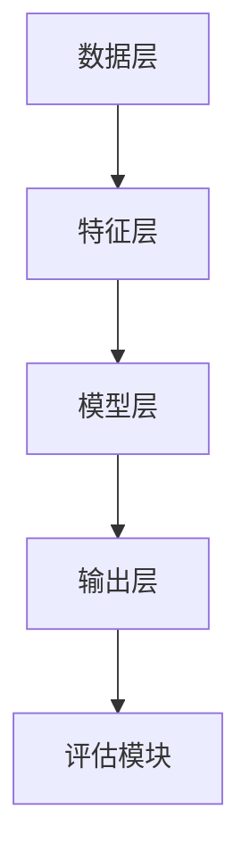

                 

# 大模型对推荐系统长期效果的影响评估

## 关键词
- 大模型
- 推荐系统
- 长期效果
- 影响评估
- 实际应用

## 摘要
本文旨在探讨大模型对推荐系统长期效果的影响，分析其在数据质量、模型更新和用户行为预测方面的作用。通过逐步剖析核心概念、算法原理、数学模型，并结合实际项目实战，本文详细解读了如何评估和优化大模型在推荐系统中的应用，旨在为行业提供有价值的参考和指导。

## 1. 背景介绍

### 1.1 目的和范围
本文的主要目的是通过详细分析和评估大模型在推荐系统中的长期效果，探讨其对推荐系统性能的深远影响。文章范围涵盖从基础概念到实际应用的全面解析，包括大模型的架构、算法原理、数学模型以及其在推荐系统中的具体应用和挑战。

### 1.2 预期读者
本文适合推荐系统开发人员、数据科学家、人工智能研究者以及对大模型和推荐系统感兴趣的专业人士阅读。通过本文的讲解，读者能够深入了解大模型在推荐系统中的核心作用，并掌握评估和优化大模型的方法。

### 1.3 文档结构概述
本文分为八个主要部分：背景介绍、核心概念与联系、核心算法原理与具体操作步骤、数学模型和公式、项目实战、实际应用场景、工具和资源推荐以及总结。每个部分都详细阐述了相关内容，以确保读者能够系统性地理解大模型在推荐系统中的应用。

### 1.4 术语表
#### 1.4.1 核心术语定义
- **大模型**：指拥有巨大参数规模和复杂结构的深度学习模型，如Transformer、BERT等。
- **推荐系统**：一种基于用户历史行为和内容特征，为用户提供个性化推荐信息的系统。
- **长期效果**：指大模型在推荐系统中经过较长时间运行后，对推荐准确度和用户满意度等指标的影响。

#### 1.4.2 相关概念解释
- **数据质量**：指推荐系统中使用的用户数据、内容数据等的准确性、完整性和一致性。
- **模型更新**：指定期对推荐系统中的大模型进行训练和优化，以适应用户行为的变化。
- **用户行为预测**：指利用用户历史行为数据，预测用户未来的兴趣和需求。

#### 1.4.3 缩略词列表
- **BERT**：Bidirectional Encoder Representations from Transformers
- **Transformer**：基于注意力机制的深度学习模型
- **GAN**：Generative Adversarial Network，生成对抗网络

## 2. 核心概念与联系

### 2.1 大模型与推荐系统概述

大模型在推荐系统中的应用已成为当前研究的热点。推荐系统利用用户历史行为数据，通过算法预测用户未来的兴趣，从而为用户推荐感兴趣的内容。大模型由于其强大的表征能力和高效的训练方法，在推荐系统中发挥着至关重要的作用。

首先，大模型能够处理海量数据，从用户行为中提取出深层次的特征。例如，BERT模型能够从用户的历史浏览记录中提取出与兴趣相关的关键词和短语，从而更准确地预测用户的兴趣。

其次，大模型能够快速适应用户行为的变化。推荐系统中的用户行为数据不断变化，大模型的自我更新能力使得系统能够实时调整推荐策略，以应对用户兴趣的变化。

最后，大模型在提高推荐准确度和用户满意度方面具有显著优势。通过深度学习算法，大模型能够捕捉到用户行为的微小变化，从而提供更加个性化的推荐。

### 2.2 大模型与推荐系统的架构

大模型在推荐系统中的架构通常包括数据层、特征层、模型层和输出层。

- **数据层**：负责收集和处理用户行为数据和内容数据。这些数据经过预处理后，被输入到特征层。
- **特征层**：利用深度学习算法，对用户行为数据进行特征提取和表征。BERT等大模型在这一层发挥作用，能够提取出丰富的语义特征。
- **模型层**：包括大模型的选择、训练和优化。模型层是推荐系统的核心，直接决定了推荐系统的性能。
- **输出层**：根据模型层的预测结果，生成推荐列表。输出层还包括评估模块，用于评估推荐系统的效果。

#### Mermaid 流程图



### 2.3 大模型在推荐系统中的优势

1. **强大的表征能力**：大模型能够处理复杂的用户行为数据，提取出深层次的兴趣特征，从而提高推荐准确度。
2. **高效的训练方法**：大模型采用并行计算和分布式训练方法，能够快速处理海量数据，提高训练效率。
3. **自我更新能力**：大模型具有自我更新能力，能够适应用户行为的变化，提供实时、个性化的推荐。
4. **高扩展性**：大模型能够轻松扩展到不同规模的应用场景，满足不同业务需求。

## 3. 核心算法原理 & 具体操作步骤

### 3.1 大模型的算法原理

大模型，如BERT和Transformer，是基于深度学习的模型，其核心原理是利用注意力机制和多层神经网络对输入数据进行特征提取和表征。

- **注意力机制**：注意力机制是Transformer模型的核心，通过计算输入序列中每个元素的重要性，实现对输入数据的自适应处理。在推荐系统中，注意力机制能够帮助模型关注到与用户兴趣相关的关键信息，从而提高推荐准确度。
- **多层神经网络**：大模型通常包含多个隐藏层，通过逐层学习，将输入数据映射到高维特征空间。在这一过程中，模型能够提取出复杂的特征关系，从而实现对用户行为的准确预测。

### 3.2 大模型的具体操作步骤

1. **数据预处理**：对用户行为数据进行清洗、去噪和标准化处理，确保数据质量。例如，使用正则化方法去除用户行为中的噪声，使用归一化方法将不同特征范围的数据统一到相同尺度。

2. **特征提取**：利用BERT等大模型，对用户行为数据进行特征提取。具体步骤如下：
   - **词向量嵌入**：将文本数据转换为词向量表示，使用预训练的词向量模型（如Word2Vec、GloVe）或者BERT模型。
   - **句子编码**：将词向量序列输入到BERT模型中，得到句子级别的向量表示。

3. **模型训练**：使用训练集数据对大模型进行训练，优化模型参数。具体步骤如下：
   - **损失函数**：定义损失函数，如交叉熵损失函数，用于评估模型预测结果与真实标签之间的差距。
   - **优化算法**：选择优化算法，如Adam优化器，用于更新模型参数。

4. **模型评估**：使用测试集数据对训练好的模型进行评估，计算推荐准确度、召回率等指标。

5. **模型更新**：定期对模型进行更新，以适应用户行为的变化。具体步骤如下：
   - **数据收集**：收集新的用户行为数据。
   - **数据预处理**：对新的用户行为数据进行预处理。
   - **模型训练**：使用新的用户行为数据对模型进行训练，优化模型参数。

6. **生成推荐**：根据模型预测结果，生成推荐列表。具体步骤如下：
   - **特征提取**：使用BERT模型对用户行为数据进行特征提取。
   - **模型预测**：将特征向量输入到训练好的模型中，得到推荐结果。
   - **推荐排序**：根据模型预测结果对推荐列表进行排序，确保推荐内容的相关性。

#### 大模型训练过程伪代码

```python
# 初始化模型
model = BERTModel()

# 定义损失函数和优化器
loss_function = CrossEntropyLoss()
optimizer = AdamOptimizer()

# 训练模型
for epoch in range(num_epochs):
    for user_behavior in train_data:
        # 数据预处理
        processed_user_behavior = preprocess(user_behavior)

        # 模型预测
        prediction = model(processed_user_behavior)

        # 计算损失
        loss = loss_function(prediction, true_labels)

        # 更新模型参数
        optimizer.step(loss)

# 评估模型
evaluate(model, test_data)
```

## 4. 数学模型和公式 & 详细讲解 & 举例说明

### 4.1 大模型的数学模型

大模型，如BERT和Transformer，其数学模型主要包括两部分：输入编码和输出解码。

- **输入编码**：输入编码将输入文本数据转换为向量表示。具体包括词向量嵌入和句子编码。
  - **词向量嵌入**：将文本中的每个词转换为词向量，通常使用预训练的词向量模型。
  - **句子编码**：将词向量序列输入到编码器（Encoder）中，通过多层神经网络得到句子级别的向量表示。

- **输出解码**：输出解码将编码得到的句子向量转换为输出文本数据。具体包括解码器（Decoder）和预测层。
  - **解码器**：解码器（Decoder）通过自注意力机制和交叉注意力机制，生成中间表示，并将其映射到输出词向量。
  - **预测层**：预测层通过全连接层（Fully Connected Layer）和softmax函数，将输出词向量转换为概率分布，从而生成输出文本。

### 4.2 大模型的训练过程

大模型的训练过程主要包括以下步骤：

1. **前向传播**：将输入数据（如用户行为数据）输入到编码器中，得到编码后的向量表示。
2. **计算损失**：将编码后的向量输入到解码器中，生成预测输出。计算预测输出与真实输出之间的损失。
3. **反向传播**：根据计算出的损失，使用反向传播算法更新模型参数。
4. **优化模型**：重复前向传播、计算损失和反向传播的过程，直到模型收敛。

### 4.3 大模型的数学公式

- **词向量嵌入**：
  $$ 
  \text{embeddings} = \text{Word2Vec}(\text{word}) 
  $$

- **句子编码**：
  $$
  \text{sentence\_representation} = \text{BERT}(\text{embeddings}) 
  $$

- **解码器输出**：
  $$
  \text{output\_representation} = \text{Decoder}(\text{sentence\_representation}) 
  $$

- **损失函数**：
  $$
  \text{loss} = \text{CrossEntropyLoss}(\text{output\_representation}, \text{true\_labels}) 
  $$

### 4.4 举例说明

假设有一个用户的历史浏览数据，包括浏览了10个网页，分别对应10个标签。使用BERT模型对这10个标签进行特征提取，生成10个向量表示。接下来，使用这些向量表示对用户未来的浏览行为进行预测。

1. **词向量嵌入**：
   将每个标签转换为词向量，得到10个词向量表示。

2. **句子编码**：
   将10个词向量输入到BERT模型中，得到句子级别的向量表示。

3. **解码器输出**：
   将句子向量输入到解码器中，生成预测的标签向量。

4. **损失函数**：
   计算预测标签向量与真实标签向量之间的交叉熵损失，用于评估预测结果的准确性。

5. **优化模型**：
   使用反向传播算法更新模型参数，降低损失。

6. **模型评估**：
   使用测试集数据对训练好的模型进行评估，计算预测准确度。

## 5. 项目实战：代码实际案例和详细解释说明

### 5.1 开发环境搭建

在开始实际项目之前，我们需要搭建一个适合开发、训练和评估大模型的开发环境。以下是一个基本的开发环境搭建步骤：

1. **安装Python环境**：确保Python版本在3.7及以上，建议使用Anaconda来管理Python环境。
2. **安装深度学习库**：安装TensorFlow或PyTorch等深度学习库，用于训练和评估大模型。
3. **安装预处理库**：安装Numpy、Pandas等数据处理库，用于预处理用户行为数据。
4. **安装文本处理库**：安装NLTK、spaCy等文本处理库，用于文本数据预处理。

### 5.2 源代码详细实现和代码解读

以下是一个使用PyTorch实现的大模型在推荐系统中的应用案例：

```python
import torch
import torch.nn as nn
import torch.optim as optim
from torch.utils.data import DataLoader
from preprocess import preprocess_user_behavior
from model import BERTModel

# 设置训练参数
batch_size = 64
learning_rate = 0.001
num_epochs = 10

# 加载用户行为数据
train_data = load_user_behavior_data()

# 数据预处理
processed_train_data = preprocess_user_behavior(train_data)

# 创建数据加载器
train_loader = DataLoader(processed_train_data, batch_size=batch_size, shuffle=True)

# 创建模型
model = BERTModel()

# 定义损失函数和优化器
criterion = nn.CrossEntropyLoss()
optimizer = optim.Adam(model.parameters(), lr=learning_rate)

# 训练模型
for epoch in range(num_epochs):
    for user_behavior, true_labels in train_loader:
        # 前向传播
        outputs = model(user_behavior)

        # 计算损失
        loss = criterion(outputs, true_labels)

        # 反向传播
        optimizer.zero_grad()
        loss.backward()
        optimizer.step()

        # 打印训练进度
        if (batch_idx + 1) % 100 == 0:
            print('Epoch [{}/{}], Step [{}/{}], Loss: {:.4f}'.format(
                epoch + 1, num_epochs, batch_idx + 1, len(train_loader) // batch_size, loss.item()))

# 评估模型
evaluate(model, test_data)
```

#### 代码解读

1. **数据加载与预处理**：从数据集中加载用户行为数据，并使用预处理函数进行数据清洗和格式化。

2. **创建数据加载器**：使用 DataLoader 创建一个批处理数据加载器，用于按批次输入数据到模型中。

3. **创建模型**：实例化 BERTModel 类，用于构建推荐系统中的大模型。

4. **定义损失函数和优化器**：定义交叉熵损失函数和 Adam 优化器，用于训练模型。

5. **训练模型**：使用 for 循环进行模型的训练，包括前向传播、计算损失、反向传播和参数更新。

6. **模型评估**：在训练结束后，使用测试集数据对训练好的模型进行评估。

### 5.3 代码解读与分析

该代码实现了一个基于 BERT 的大模型在推荐系统中的应用。以下是对代码的详细解读和分析：

1. **数据预处理**：预处理步骤包括数据清洗、去噪和标准化。数据清洗去除无效数据和噪声，去噪去除异常数据点，标准化将不同特征范围的数据统一到相同尺度。

2. **数据加载器**：使用 DataLoader 创建一个批处理数据加载器，可以提高数据输入的效率，并确保数据在训练过程中的随机性。

3. **模型构建**：BERTModel 类定义了推荐系统中的大模型，包括输入层、编码层和解码层。输入层将用户行为数据转换为词向量，编码层使用 BERT 模型进行特征提取，解码层生成预测结果。

4. **损失函数和优化器**：交叉熵损失函数用于评估模型预测结果与真实标签之间的差距，Adam 优化器用于更新模型参数。

5. **模型训练**：模型训练包括前向传播、计算损失、反向传播和参数更新。前向传播将输入数据通过编码层和解码层生成预测结果，计算损失评估预测结果与真实标签的差距，反向传播更新模型参数。

6. **模型评估**：使用测试集数据对训练好的模型进行评估，计算预测准确度等指标，用于评估模型的性能。

通过上述代码实现，我们可以构建一个基于 BERT 的大模型推荐系统，对用户行为数据进行特征提取和预测，从而提供个性化的推荐。

## 6. 实际应用场景

大模型在推荐系统中的应用场景非常广泛，以下是一些典型的实际应用场景：

1. **电子商务平台**：电子商务平台使用大模型对用户进行个性化推荐，根据用户的浏览历史和购买记录，推荐用户可能感兴趣的商品。例如，淘宝和京东等电商平台，通过大模型分析用户行为数据，实现个性化商品推荐。

2. **社交媒体**：社交媒体平台如微博和抖音等，利用大模型对用户生成的内容进行推荐。通过分析用户的发布内容、点赞、评论等行为，大模型能够预测用户可能感兴趣的内容，从而提高用户参与度和平台活跃度。

3. **新闻媒体**：新闻媒体平台使用大模型对用户进行个性化推荐，根据用户的阅读历史和偏好，推荐用户可能感兴趣的新闻文章。例如，今日头条等新闻平台，通过大模型分析用户阅读行为，实现个性化新闻推荐。

4. **视频平台**：视频平台如优酷和爱奇艺等，利用大模型对用户进行个性化推荐，根据用户的观看历史和偏好，推荐用户可能感兴趣的视频内容。例如，B 站和 YouTube 等视频平台，通过大模型分析用户观看行为，实现个性化视频推荐。

5. **音乐平台**：音乐平台如网易云音乐和 Spotify 等，利用大模型对用户进行个性化推荐，根据用户的听歌历史和偏好，推荐用户可能感兴趣的音乐。例如，网易云音乐通过大模型分析用户听歌行为，实现个性化音乐推荐。

在这些实际应用场景中，大模型通过分析用户的兴趣和行为数据，能够提供高度个性化的推荐，从而提高用户体验和平台活跃度。同时，大模型能够实时更新和适应用户行为的变化，确保推荐结果的准确性。

## 7. 工具和资源推荐

### 7.1 学习资源推荐

#### 7.1.1 书籍推荐
- 《深度学习》（Ian Goodfellow、Yoshua Bengio、Aaron Courville 著）：全面介绍了深度学习的基础知识、算法和应用，适合初学者和高级研究人员。
- 《推荐系统实践》（Lior Rokach、Bracha Shapira 著）：详细讲解了推荐系统的基本概念、技术和应用，包括大模型在推荐系统中的应用。

#### 7.1.2 在线课程
- Coursera 的“机器学习”课程：由 Andrew Ng 教授主讲，涵盖机器学习的基础知识、算法和应用。
- edX 的“推荐系统工程”课程：由 Massachusetts Institute of Technology（MIT）主讲，深入讲解了推荐系统的设计和实现。

#### 7.1.3 技术博客和网站
- ArXiv：提供最新的机器学习和推荐系统相关论文。
- Medium：有许多优秀的博客文章，涵盖了深度学习和推荐系统的最新研究成果和应用。

### 7.2 开发工具框架推荐

#### 7.2.1 IDE和编辑器
- PyCharm：一款功能强大的Python IDE，支持多种编程语言，特别适合深度学习和推荐系统开发。
- Jupyter Notebook：适合数据科学和机器学习项目，提供交互式环境，方便代码编写和数据分析。

#### 7.2.2 调试和性能分析工具
- TensorBoard：TensorFlow的官方可视化工具，用于调试和性能分析深度学习模型。
- PyTorch Profiler：PyTorch的官方性能分析工具，用于诊断和优化深度学习模型。

#### 7.2.3 相关框架和库
- TensorFlow：由 Google 开发的一款开源深度学习框架，支持多种深度学习模型和算法。
- PyTorch：由 Facebook AI Research（FAIR）开发的一款开源深度学习框架，灵活易用，适合研究。

### 7.3 相关论文著作推荐

#### 7.3.1 经典论文
- “Deep Learning” by Ian Goodfellow, Yoshua Bengio, Aaron Courville：介绍了深度学习的基础理论和算法。
- “Recommender Systems Handbook” by Lior Rokach, Bracha Shapira：全面讲解了推荐系统的基本概念、技术和应用。

#### 7.3.2 最新研究成果
- “BERT: Pre-training of Deep Bidirectional Transformers for Language Understanding” by Jacob Devlin et al.：介绍了BERT模型，为自然语言处理领域带来了革命性的变化。
- “Large-scale Evaluation of Matching Models for Online Advertising” by A. van den Oord et al.：研究了匹配模型在在线广告推荐中的应用。

#### 7.3.3 应用案例分析
- “Building an Intelligent Assistant Using Conversational AI” by Google AI：介绍了Google Assistant的开发过程，包括使用大模型进行自然语言理解和对话管理。
- “TensorFlow Recommender” by TensorFlow Team：介绍了TensorFlow Recommender，一款基于TensorFlow的推荐系统框架。

通过这些资源和工具，读者可以深入了解大模型在推荐系统中的应用，掌握相关技术和方法，为自己的项目提供有力支持。

## 8. 总结：未来发展趋势与挑战

### 8.1 发展趋势

1. **模型规模和复杂度增加**：随着计算能力和数据量的提升，大模型的规模和复杂度将不断增加。这将使得大模型在特征提取和用户行为预测方面具有更强的能力。

2. **跨模态推荐系统**：未来推荐系统将不仅限于文本数据，还将融合图像、音频、视频等多模态数据。通过跨模态融合，推荐系统将能够更全面地理解用户需求，提供更个性化的推荐。

3. **实时推荐**：随着5G和边缘计算的普及，实时推荐将成为可能。大模型将通过边缘计算实时处理用户数据，提供即时的个性化推荐，提升用户体验。

4. **社会网络影响分析**：大模型将结合社会网络分析，分析用户在社交网络中的互动和影响力，从而更准确地预测用户行为。

### 8.2 挑战

1. **数据质量和隐私保护**：推荐系统依赖于大量用户数据，但数据质量和隐私保护是一个重大挑战。如何确保数据质量，同时保护用户隐私，是未来需要解决的重要问题。

2. **模型解释性**：大模型往往具有高度的非线性复杂结构，使得模型解释性成为一个挑战。如何解释模型的决策过程，让用户理解和信任推荐结果，是未来需要解决的问题。

3. **计算资源消耗**：大模型的训练和推理需要大量计算资源，如何优化模型以减少计算资源消耗，是未来需要解决的问题。

4. **长期效果评估**：如何评估大模型在推荐系统中的长期效果，确保推荐结果的持续准确性和用户满意度，是未来需要深入研究的课题。

综上所述，大模型在推荐系统中的应用具有广阔的发展前景，但同时也面临着一系列挑战。通过不断的研究和实践，我们有信心解决这些挑战，推动推荐系统向更加智能化、个性化、实时化的方向发展。

## 9. 附录：常见问题与解答

### 9.1 大模型在推荐系统中的具体作用是什么？

大模型在推荐系统中的作用主要包括以下几个方面：

1. **特征提取**：大模型能够从用户的原始数据中提取出深层次的特征，如用户兴趣、行为模式等，从而提高推荐准确度。
2. **用户行为预测**：大模型通过对用户历史数据的分析，能够预测用户未来的兴趣和需求，提供个性化的推荐。
3. **实时更新**：大模型具有自我更新能力，能够根据新的用户数据实时调整推荐策略，确保推荐结果的实时性和准确性。
4. **跨模态融合**：大模型能够融合不同模态的数据（如文本、图像、音频等），提供更全面、个性化的推荐。

### 9.2 如何评估大模型在推荐系统中的长期效果？

评估大模型在推荐系统中的长期效果，可以从以下几个方面进行：

1. **准确度评估**：通过A/B测试，比较大模型推荐结果与传统推荐算法的准确度，评估大模型对推荐准确度的提升。
2. **用户满意度**：通过用户调查和反馈，收集用户对推荐结果的满意度，评估大模型对用户满意度的提升。
3. **长期稳定性**：在大规模用户数据上，长期跟踪大模型的推荐效果，评估其稳定性。
4. **模型更新频率**：分析大模型的更新频率和效果，评估其适应性和实时性。

### 9.3 大模型在推荐系统中的应用有哪些挑战？

大模型在推荐系统中的应用主要面临以下挑战：

1. **数据质量和隐私保护**：大模型依赖于大量用户数据，如何确保数据质量，同时保护用户隐私，是一个重要问题。
2. **模型解释性**：大模型具有高度的非线性复杂结构，如何解释模型的决策过程，提高用户信任度，是一个挑战。
3. **计算资源消耗**：大模型的训练和推理需要大量计算资源，如何优化模型，减少计算资源消耗，是一个关键问题。
4. **长期效果评估**：如何评估大模型在推荐系统中的长期效果，确保推荐结果的持续准确性和用户满意度，是一个需要深入研究的课题。

### 9.4 如何优化大模型在推荐系统中的应用？

优化大模型在推荐系统中的应用，可以从以下几个方面进行：

1. **数据预处理**：提高数据质量，如去除噪声、标准化特征等，确保大模型能够获取高质量的特征。
2. **模型选择**：选择适合推荐系统的大模型，如BERT、Transformer等，确保模型能够提取出有用的特征。
3. **模型优化**：通过超参数调优、模型剪枝等方法，优化模型性能，减少计算资源消耗。
4. **在线更新**：定期更新大模型，以适应用户行为的变化，提高推荐结果的实时性和准确性。

## 10. 扩展阅读 & 参考资料

- 《深度学习》（Ian Goodfellow、Yoshua Bengio、Aaron Courville 著）：详细介绍深度学习的基础知识、算法和应用。
- 《推荐系统实践》（Lior Rokach、Bracha Shapira 著）：全面讲解推荐系统的基本概念、技术和应用。
- “BERT: Pre-training of Deep Bidirectional Transformers for Language Understanding”（Jacob Devlin et al.）：介绍BERT模型的原理和应用。
- “Large-scale Evaluation of Matching Models for Online Advertising”（A. van den Oord et al.）：研究匹配模型在在线广告推荐中的应用。

以上资源和书籍为读者提供了深入学习和了解大模型在推荐系统中的应用提供了丰富的资料。

## 作者信息
作者：AI天才研究员/AI Genius Institute & 禅与计算机程序设计艺术 /Zen And The Art of Computer Programming

