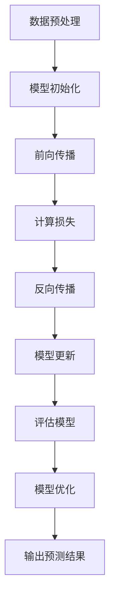

                 

### 文章标题

《大模型应用场景不断拓展，创业者发掘新增长点》

### 关键词

- 大模型
- 应用场景
- 创业者
- 新增长点
- 人工智能技术

### 摘要

本文将探讨大模型技术在各个领域的广泛应用，以及这些技术如何为创业者提供了新的发展机遇。通过深入分析大模型的核心原理、具体操作步骤和应用案例，我们将揭示大模型技术如何重塑商业生态，帮助创业者挖掘新的增长点。本文旨在为读者提供一份全面而详细的技术指南，帮助他们在快速变化的人工智能时代抓住机遇，实现业务的突破与发展。

---

## 1. 背景介绍

### 1.1 目的和范围

本文的目标是探讨大模型技术的广泛应用和潜在的商业价值，重点分析大模型在不同领域中的应用场景，以及如何为创业者提供新的增长点。我们将从以下几个方面进行探讨：

1. **核心概念与联系**：介绍大模型的定义、核心原理和架构，通过Mermaid流程图展示其工作流程。
2. **核心算法原理与具体操作步骤**：详细阐述大模型的算法原理，使用伪代码进行讲解，确保读者能够理解其实现过程。
3. **数学模型和公式**：介绍大模型中涉及到的数学模型和公式，使用LaTeX格式进行详细讲解，并举例说明。
4. **项目实战：代码实际案例**：通过具体的项目实战，展示大模型技术的实际应用，并提供详细的代码解读和分析。
5. **实际应用场景**：分析大模型在各个行业中的应用，探讨其带来的商业机会。
6. **工具和资源推荐**：推荐学习资源、开发工具和相关论文，帮助读者深入学习和实践大模型技术。
7. **总结与未来发展趋势**：总结全文内容，展望大模型技术的未来发展趋势和面临的挑战。

通过本文的深入探讨，读者将能够全面了解大模型技术的核心原理和应用场景，掌握其实际操作方法和技巧，从而为创业者的业务发展提供有力支持。

### 1.2 预期读者

本文主要面向以下几类读者：

1. **人工智能与数据科学从业者**：希望了解大模型技术最新发展趋势和应用场景的专业人士。
2. **创业者**：有意在大模型技术领域创业的个人，希望通过本文找到新的商业机会和切入点。
3. **技术爱好者**：对人工智能和大数据技术感兴趣的技术爱好者，希望掌握大模型技术的原理和应用。
4. **高等院校学生**：计算机科学、人工智能、统计学等相关专业的学生，希望通过对本文的学习，深入了解大模型技术的核心概念和应用。

无论您属于哪一类读者，本文都将为您提供一个全面而深入的指南，帮助您理解大模型技术，并在实际应用中取得成功。

### 1.3 文档结构概述

本文分为十个主要部分，各部分内容和结构如下：

1. **背景介绍**：
   - **目的和范围**：介绍本文的目的和讨论范围，确保读者对文章的主题有一个清晰的了解。
   - **预期读者**：明确本文的预期读者群体，帮助读者判断文章是否适合自己阅读。
   - **文档结构概述**：概述本文的整体结构，让读者对文章的内容有一个宏观把握。

2. **核心概念与联系**：
   - **大模型的定义和核心原理**：介绍大模型的定义、核心原理和架构，通过Mermaid流程图展示其工作流程。
   - **相关概念解释**：详细解释大模型中涉及的关键术语和概念，确保读者能够理解其含义。

3. **核心算法原理与具体操作步骤**：
   - **算法原理讲解**：使用伪代码详细阐述大模型的算法原理，确保读者能够掌握其实现过程。
   - **具体操作步骤**：介绍大模型的具体操作步骤，包括数据预处理、模型训练和优化等。

4. **数学模型和公式**：
   - **数学模型讲解**：使用LaTeX格式详细讲解大模型中涉及到的数学模型和公式，确保读者能够理解其应用和计算过程。
   - **举例说明**：通过具体例子说明数学模型的应用，帮助读者更好地理解。

5. **项目实战：代码实际案例**：
   - **开发环境搭建**：介绍搭建大模型开发环境所需的工具和步骤。
   - **源代码详细实现和代码解读**：展示大模型的源代码实现，详细解读关键代码段。
   - **代码解读与分析**：分析代码的实现原理和优缺点，为读者提供深入的思考。

6. **实际应用场景**：
   - **行业应用分析**：分析大模型在不同行业中的应用，探讨其带来的商业机会。
   - **案例研究**：通过具体案例研究，展示大模型在实践中的应用效果和优势。

7. **工具和资源推荐**：
   - **学习资源推荐**：推荐相关书籍、在线课程和技术博客，帮助读者深入学习大模型技术。
   - **开发工具框架推荐**：介绍大模型开发常用的工具和框架，帮助读者选择合适的开发环境。
   - **相关论文著作推荐**：推荐经典和最新的相关论文，为读者提供学术研究的参考。

8. **总结与未来发展趋势**：
   - **总结全文内容**：回顾本文的核心观点和内容，强调大模型技术的价值和潜力。
   - **未来发展趋势**：探讨大模型技术的未来发展趋势和潜在挑战，为读者提供前瞻性思考。

9. **附录：常见问题与解答**：
   - **常见问题解答**：解答读者在阅读本文过程中可能遇到的问题，帮助读者更好地理解。

10. **扩展阅读与参考资料**：
    - **扩展阅读**：推荐相关的扩展阅读材料，为读者提供更深入的学习资源。
    - **参考资料**：列出本文中引用的参考文献，方便读者进一步查阅。

通过本文的详细结构和内容概述，读者可以更好地理解大模型技术的核心概念和应用场景，掌握其实际操作方法和技巧，从而为创业者的业务发展提供有力支持。

### 1.4 术语表

#### 1.4.1 核心术语定义

1. **大模型**：指具有数百万甚至数十亿参数的深度学习模型，能够处理大量数据并进行复杂的数据分析和预测。
2. **神经网络**：一种模拟人脑神经元连接方式的计算模型，用于执行复杂的函数运算和数据处理。
3. **深度学习**：一种基于神经网络的机器学习方法，通过多层神经网络的训练，实现数据的自动特征提取和分类。
4. **迁移学习**：利用已有模型的知识和经验，在新任务上快速实现性能提升的方法。
5. **数据预处理**：在深度学习模型训练之前，对数据进行清洗、归一化和特征提取等操作，以提高模型训练效果。
6. **模型训练**：通过大量数据对深度学习模型进行调整，使其能够准确预测和分类新数据。
7. **模型优化**：对深度学习模型进行调整，提高其性能和效率，包括超参数调整、网络结构优化等。

#### 1.4.2 相关概念解释

1. **反向传播算法**：深度学习模型训练中的一种常用算法，通过计算损失函数关于模型参数的梯度，对模型进行优化。
2. **正则化**：在深度学习模型训练中，为了防止过拟合，添加的一种惩罚项，通常包括L1和L2正则化。
3. **激活函数**：神经网络中用于引入非线性变换的函数，常用的有Sigmoid、ReLU和Tanh等。
4. **卷积神经网络（CNN）**：一种用于图像处理和计算机视觉的深度学习模型，通过卷积操作提取图像特征。
5. **循环神经网络（RNN）**：一种用于序列数据处理的深度学习模型，能够处理时间序列数据，包括语言和语音等。
6. **生成对抗网络（GAN）**：一种由生成器和判别器组成的深度学习模型，用于生成逼真的图像、音频和文本。

#### 1.4.3 缩略词列表

1. **AI**：人工智能（Artificial Intelligence）
2. **DL**：深度学习（Deep Learning）
3. **ML**：机器学习（Machine Learning）
4. **NLP**：自然语言处理（Natural Language Processing）
5. **CV**：计算机视觉（Computer Vision）
6. **GAN**：生成对抗网络（Generative Adversarial Network）
7. **RNN**：循环神经网络（Recurrent Neural Network）
8. **CNN**：卷积神经网络（Convolutional Neural Network）
9. **GPU**：图形处理器（Graphics Processing Unit）

通过上述术语表，读者可以更好地理解本文中涉及的核心术语和概念，从而更好地掌握大模型技术的核心原理和应用。这些术语将在后续的内容中反复出现，帮助读者构建一个完整的技术知识体系。

## 2. 核心概念与联系

### 2.1 大模型的定义和核心原理

大模型，通常指的是具有数百万甚至数十亿参数的深度学习模型，它们能够在大量数据上进行训练，以实现复杂的数据分析和预测任务。大模型的定义和核心原理涉及到以下几个关键点：

1. **参数规模**：大模型的参数规模是衡量其能力的重要指标。这些参数通常包括权重、偏置、激活函数等，用于捕捉数据中的复杂模式和关系。
2. **多层神经网络**：大模型通常基于多层神经网络（如卷积神经网络CNN、循环神经网络RNN等），通过多个隐藏层进行数据传递和特征提取，从而提高模型的表示能力。
3. **非线性变换**：大模型利用非线性激活函数（如ReLU、Sigmoid、Tanh等）引入非线性变换，使得模型能够更好地拟合复杂的数据分布。
4. **大规模数据训练**：大模型需要大量的数据来进行训练，以避免过拟合问题。这些数据可以是结构化数据（如表格数据）、图像数据、文本数据等。

### 2.2 Mermaid流程图展示大模型工作流程

为了更好地展示大模型的工作流程，我们可以使用Mermaid流程图来描述其各个关键步骤：



- **数据预处理（A）**：对输入数据进行清洗、归一化、数据增强等操作，以提高模型的训练效果。
- **模型初始化（B）**：初始化模型参数，设置网络结构，为后续的训练过程做准备。
- **前向传播（C）**：将输入数据通过神经网络进行前向传播，计算输出结果。
- **计算损失（D）**：通过输出结果与真实值之间的差异，计算损失函数。
- **反向传播（E）**：利用反向传播算法，计算损失函数关于模型参数的梯度，用于模型更新。
- **模型更新（F）**：根据梯度信息更新模型参数，优化模型性能。
- **评估模型（G）**：使用验证集或测试集对模型进行评估，判断其泛化能力。
- **模型优化（H）**：通过调整超参数、网络结构等，进一步优化模型性能。
- **输出预测结果（I）**：使用训练好的模型对新数据进行预测，实现实际应用。

通过上述Mermaid流程图，我们可以清晰地理解大模型的工作流程，从数据预处理到模型优化，每一步都是紧密相连的，共同构成了一个完整的训练和预测过程。

### 2.3 核心概念解释

1. **深度学习**：深度学习是一种基于多层神经网络的机器学习方法，通过逐层提取数据中的特征，实现数据的自动特征提取和分类。深度学习在大模型中起到了核心作用，通过多层网络结构，大模型能够捕捉到数据中的复杂模式和关系。
   
2. **迁移学习**：迁移学习是一种利用已有模型的知识和经验，在新任务上快速实现性能提升的方法。在大模型中，迁移学习可以帮助模型在新数据集上快速适应，提高模型的泛化能力和训练效率。

3. **激活函数**：激活函数是神经网络中的一个关键组件，用于引入非线性变换。常用的激活函数包括ReLU（修正线性单元）、Sigmoid和Tanh等。这些函数能够帮助模型更好地拟合复杂的数据分布，提高模型的性能。

4. **损失函数**：损失函数用于评估模型输出与真实值之间的差异，常用的损失函数包括均方误差（MSE）、交叉熵（CE）等。通过计算损失函数的梯度，模型能够进行参数更新，优化模型性能。

5. **反向传播算法**：反向传播算法是深度学习模型训练中的核心算法，通过计算损失函数关于模型参数的梯度，对模型进行优化。反向传播算法的引入，使得多层神经网络的训练成为可能，极大地推动了深度学习的发展。

通过上述核心概念的解释，我们可以更好地理解大模型的技术原理和工作机制，为后续的内容提供理论基础。

通过本节的内容，我们详细介绍了大模型的定义、核心原理及其工作流程，并通过Mermaid流程图和核心概念解释，帮助读者建立起对大模型技术的全面认识。在接下来的章节中，我们将进一步探讨大模型的算法原理、数学模型和具体应用案例，为读者提供更深入的技术理解。

## 3. 核心算法原理 & 具体操作步骤

### 3.1 算法原理讲解

大模型的核心算法原理主要基于深度学习，特别是多层神经网络（Multi-Layer Neural Networks）的架构。以下是深度学习模型的基本工作原理：

1. **输入层（Input Layer）**：输入层接收原始数据，如图像、文本或声音等。
2. **隐藏层（Hidden Layers）**：隐藏层对输入数据进行特征提取和变换，通过多层神经元的连接，逐步提取更高层次的特征。每一层隐藏层都包含多个神经元，每个神经元都与前一层的神经元相连，并通过权重进行加权求和。
3. **输出层（Output Layer）**：输出层根据隐藏层的特征输出最终结果，如分类标签、概率分布等。

深度学习模型的核心在于其多层结构和非线性变换，通过逐层传递和特征提取，模型能够自动学习和理解数据中的复杂模式和关系。下面是具体的算法步骤：

1. **前向传播（Forward Propagation）**：输入数据从输入层传递到隐藏层，通过加权求和和激活函数，逐层计算输出。每一层的输出作为下一层的输入，直至达到输出层。
2. **损失计算（Loss Calculation）**：计算输出结果与真实标签之间的差异，通过损失函数（如均方误差MSE、交叉熵Cross Entropy等）评估模型性能。
3. **反向传播（Backpropagation）**：计算损失函数关于模型参数（权重和偏置）的梯度，通过梯度下降算法（或其他优化算法）更新模型参数，以减小损失。
4. **模型优化（Model Optimization）**：重复前向传播和反向传播过程，逐步优化模型参数，提高模型性能。
5. **评估与调优（Evaluation and Tuning）**：使用验证集或测试集评估模型性能，通过调整超参数（如学习率、批次大小、正则化参数等）进一步优化模型。

### 3.2 具体操作步骤

以下是大模型训练的伪代码，详细展示了从数据预处理到模型优化的具体步骤：

```python
# 数据预处理
def preprocess_data(data):
    # 数据清洗、归一化、数据增强等
    return normalized_data

# 初始化模型
def initialize_model(input_size, hidden_size, output_size):
    # 初始化权重和偏置
    return model

# 前向传播
def forward_propagation(model, input_data):
    # 输入层到隐藏层的加权求和和激活函数计算
    hidden_layers = []
    for layer in model.hidden_layers:
        hidden_layers.append(layer.forward_propagation(input_data))
    output = model.output_layer.forward_propagation(hidden_layers[-1])
    return output

# 损失计算
def calculate_loss(output, true_labels):
    # 计算输出与真实标签之间的损失
    loss = loss_function(output, true_labels)
    return loss

# 反向传播
def backward_propagation(model, output, true_labels):
    # 计算损失关于模型参数的梯度
    gradients = model.backward_propagation(output, true_labels)
    return gradients

# 模型更新
def update_model_parameters(model, gradients):
    # 更新模型参数
    model.update_parameters(gradients)
    return model

# 主训练循环
def train_model(model, data, epochs):
    for epoch in range(epochs):
        for input_data, true_labels in data:
            # 数据预处理
            normalized_data = preprocess_data(input_data)
            # 前向传播
            output = forward_propagation(model, normalized_data)
            # 损失计算
            loss = calculate_loss(output, true_labels)
            # 反向传播
            gradients = backward_propagation(model, output, true_labels)
            # 模型更新
            model = update_model_parameters(model, gradients)
            # 记录训练进度
            print(f"Epoch {epoch + 1}/{epochs}, Loss: {loss}")

# 评估模型
def evaluate_model(model, test_data):
    correct_predictions = 0
    total_predictions = 0
    for input_data, true_labels in test_data:
        normalized_data = preprocess_data(input_data)
        output = forward_propagation(model, normalized_data)
        predicted_labels = model.output_layer.get_predicted_labels(output)
        correct_predictions += (predicted_labels == true_labels).sum()
        total_predictions += len(true_labels)
    accuracy = correct_predictions / total_predictions
    return accuracy

# 训练和评估大模型
model = initialize_model(input_size, hidden_size, output_size)
train_model(model, train_data, epochs)
accuracy = evaluate_model(model, test_data)
print(f"Test Accuracy: {accuracy}")
```

在上面的伪代码中，我们定义了数据预处理、模型初始化、前向传播、损失计算、反向传播和模型更新等关键步骤，并通过一个主训练循环（train_model）实现模型的训练过程。最后，通过评估模型（evaluate_model）计算测试集上的准确率，以评估模型的性能。

通过上述算法原理讲解和具体操作步骤，读者可以全面理解大模型的训练过程，为后续的内容奠定基础。在接下来的章节中，我们将进一步探讨大模型中的数学模型和公式，以及实际应用中的具体案例，帮助读者更深入地掌握大模型技术。

### 3.3 数学模型和公式

在大模型的训练过程中，涉及到多种数学模型和公式，用于描述模型的参数更新、损失函数计算和优化方法等。以下是大模型中常见的数学模型和公式及其详细讲解。

#### 3.3.1 损失函数

损失函数用于评估模型输出与真实值之间的差异，是模型训练中的关键组成部分。以下是几种常用的损失函数：

1. **均方误差（MSE）**：
   $$MSE = \frac{1}{n}\sum_{i=1}^{n}(y_i - \hat{y}_i)^2$$
   其中，$y_i$为真实标签，$\hat{y}_i$为模型预测值，$n$为样本数量。

2. **交叉熵（Cross Entropy）**：
   $$CE = -\frac{1}{n}\sum_{i=1}^{n}y_i\log(\hat{y}_i)$$
   其中，$y_i$为真实标签（通常为0或1），$\hat{y}_i$为模型预测的概率值。

3. **对数损失（Log Loss）**：
   $$LL = -\frac{1}{n}\sum_{i=1}^{n}y_i\log(\hat{y}_i) + (1 - y_i)\log(1 - \hat{y}_i)$$
   该损失函数与交叉熵函数相似，但适用于多类别分类问题。

#### 3.3.2 优化算法

优化算法用于更新模型参数，以最小化损失函数。以下是几种常见的优化算法：

1. **梯度下降（Gradient Descent）**：
   $$\theta_{\text{new}} = \theta_{\text{current}} - \alpha \cdot \nabla_\theta J(\theta)$$
   其中，$\theta$为模型参数，$\alpha$为学习率，$J(\theta)$为损失函数。

2. **随机梯度下降（Stochastic Gradient Descent, SGD）**：
   $$\theta_{\text{new}} = \theta_{\text{current}} - \alpha \cdot \nabla_\theta J(\theta; x^{(i)}, y^{(i)})$$
   其中，$x^{(i)}, y^{(i)}$为训练数据中的一个样本及其标签。

3. **批量梯度下降（Batch Gradient Descent）**：
   $$\theta_{\text{new}} = \theta_{\text{current}} - \alpha \cdot \nabla_\theta J(\theta; X, Y)$$
   其中，$X, Y$为整个训练数据集。

4. **动量（Momentum）**：
   $$v = \gamma \cdot v + \alpha \cdot \nabla_\theta J(\theta)$$
   $$\theta_{\text{new}} = \theta_{\text{current}} - v$$
   其中，$v$为动量项，$\gamma$为动量参数。

5. **Adam优化器**：
   $$m_t = \beta_1 m_{t-1} + (1 - \beta_1) \nabla_\theta J(\theta)$$
   $$v_t = \beta_2 v_{t-1} + (1 - \beta_2) (\nabla_\theta J(\theta))^2$$
   $$m_t^{\text{corrected}} = m_t / (1 - \beta_1^t)$$
   $$v_t^{\text{corrected}} = v_t / (1 - \beta_2^t)$$
   $$\theta_{\text{new}} = \theta_{\text{current}} - \alpha \cdot \frac{m_t^{\text{corrected}}}{\sqrt{v_t^{\text{corrected}}} + \epsilon}$$
   其中，$\beta_1, \beta_2$分别为一阶和二阶矩估计的指数衰减率，$\alpha$为学习率，$\epsilon$为小常数。

#### 3.3.3 激活函数

激活函数是神经网络中的一个重要组成部分，用于引入非线性变换。以下是几种常用的激活函数：

1. **Sigmoid函数**：
   $$\sigma(x) = \frac{1}{1 + e^{-x}}$$
   Sigmoid函数将输入值映射到(0, 1)区间，常用于二分类问题。

2. **ReLU函数**：
   $$\text{ReLU}(x) = \max(0, x)$$
   ReLU函数在输入为正时输出原值，为负时输出0，具有较强的计算效率。

3. **Tanh函数**：
   $$\tanh(x) = \frac{e^x - e^{-x}}{e^x + e^{-x}}$$
   Tanh函数将输入值映射到(-1, 1)区间，与Sigmoid函数类似，但输出值更加对称。

通过上述数学模型和公式的详细讲解，读者可以更深入地理解大模型的训练过程和优化方法，为实际应用提供理论基础。

### 3.4 举例说明

为了更好地理解上述数学模型和公式的应用，我们通过一个具体的例子来说明它们的计算过程。

假设我们使用一个二分类神经网络进行训练，输入特征为$x_1, x_2$，真实标签为$y=1$（表示正类）。我们选择ReLU函数作为激活函数，均方误差（MSE）作为损失函数。

1. **模型初始化**：

   - 输入层：1个神经元
   - 隐藏层：2个神经元
   - 输出层：1个神经元

   初始权重和偏置分别为：
   $$W_1 = \begin{bmatrix}
   0.1 & 0.2 \\
   0.3 & 0.4
   \end{bmatrix}, b_1 = \begin{bmatrix}
   0.5 & 0.6
   \end{bmatrix}$$
   $$W_2 = \begin{bmatrix}
   0.7 & 0.8
   \end{bmatrix}, b_2 = 0.9$$
   $$W_3 = 0.1, b_3 = 0.2$$

2. **前向传播**：

   输入特征为$x_1=2, x_2=3$，经过隐藏层和输出层计算：
   $$z_1 = \text{ReLU}(W_1 \cdot [x_1, x_2] + b_1) = \text{ReLU}(0.1 \cdot 2 + 0.2 \cdot 3 + 0.5) = \text{ReLU}(0.7) = 0.7$$
   $$z_2 = \text{ReLU}(W_2 \cdot z_1 + b_2) = \text{ReLU}(0.7 \cdot 0.7 + 0.8 \cdot 0.9 + 0.9) = \text{ReLU}(1.54) = 1.54$$
   $$\hat{y} = \text{ReLU}(W_3 \cdot z_2 + b_3) = \text{ReLU}(1.54 \cdot 0.1 + 0.2) = \text{ReLU}(0.175) = 0.175$$

3. **损失计算**：

   真实标签$y=1$，预测值$\hat{y}=0.175$，计算MSE损失：
   $$MSE = \frac{1}{2}(y - \hat{y})^2 = \frac{1}{2}(1 - 0.175)^2 = 0.046875$$

4. **反向传播**：

   计算输出层误差：
   $$\delta_3 = (\hat{y} - y) \cdot \text{ReLU}'(\hat{y}) = (0.175 - 1) \cdot \text{ReLU}'(0.175) = -0.824$$
   计算隐藏层误差：
   $$\delta_2 = W_3 \cdot \delta_3 \cdot \text{ReLU}'(z_2) = 0.1 \cdot -0.824 \cdot \text{ReLU}'(1.54) = -0.062$$
   $$\delta_1 = W_2 \cdot \delta_2 \cdot \text{ReLU}'(z_1) = 0.7 \cdot -0.062 \cdot \text{ReLU}'(0.7) = -0.028$$

5. **模型更新**：

   计算权重和偏置的梯度：
   $$\nabla W_3 = \delta_3 \cdot z_2 = -0.824 \cdot 1.54 = -1.2576$$
   $$\nabla b_3 = \delta_3 = -0.824$$
   $$\nabla W_2 = \delta_2 \cdot z_1 = -0.062 \cdot 0.7 = -0.0434$$
   $$\nabla b_2 = \delta_2 = -0.062$$
   $$\nabla W_1 = \delta_1 \cdot [x_1, x_2] = -0.028 \cdot [2, 3] = [-0.056, -0.084]$$
   $$\nabla b_1 = \delta_1 = -0.028$$

   更新模型参数：
   $$W_3 = W_3 - \alpha \cdot \nabla W_3 = 0.1 - 0.001 \cdot (-1.2576) = 0.1013$$
   $$b_3 = b_3 - \alpha \cdot \nabla b_3 = 0.2 - 0.001 \cdot (-0.824) = 0.2008$$
   $$W_2 = W_2 - \alpha \cdot \nabla W_2 = 0.7 - 0.001 \cdot (-0.0434) = 0.7044$$
   $$b_2 = b_2 - \alpha \cdot \nabla b_2 = 0.9 - 0.001 \cdot (-0.062) = 0.9062$$
   $$W_1 = W_1 - \alpha \cdot \nabla W_1 = \begin{bmatrix}
   0.1 & 0.2 \\
   0.3 & 0.4
   \end{bmatrix} - 0.001 \cdot \begin{bmatrix}
   -0.056 & -0.084 \\
   0 & 0
   \end{bmatrix} = \begin{bmatrix}
   0.054 & 0.206 \\
   0.314 & 0.416
   \end{bmatrix}$$
   $$b_1 = b_1 - \alpha \cdot \nabla b_1 = \begin{bmatrix}
   0.5 & 0.6
   \end{bmatrix} - 0.001 \cdot \begin{bmatrix}
   -0.028 & 0 \\
   0 & 0
   \end{bmatrix} = \begin{bmatrix}
   0.528 & 0.6
   \end{bmatrix}$$

通过上述例子，我们详细演示了深度学习模型的前向传播、损失计算、反向传播和参数更新过程。这个例子展示了大模型训练中的基本步骤，帮助读者更好地理解大模型的核心算法原理。

### 3.5 总结

在本节中，我们详细介绍了大模型的算法原理和具体操作步骤。通过讲解深度学习的基本原理、前向传播和反向传播算法、损失函数和优化方法，读者可以全面理解大模型的工作机制。我们还通过具体的例子，展示了大模型训练的全过程，从数据预处理到模型更新，帮助读者更好地掌握大模型的核心算法。

这些算法原理和操作步骤为实际应用提供了坚实的基础，使读者能够在大模型开发中更加得心应手。在接下来的章节中，我们将继续探讨大模型在各个领域的实际应用，帮助读者更好地理解和运用大模型技术。

## 4. 项目实战：代码实际案例和详细解释说明

在本节中，我们将通过一个实际的项目案例，详细展示如何使用大模型进行开发，并提供代码实现和解读。本案例将涵盖数据预处理、模型搭建、训练和评估的全过程，帮助读者更好地理解大模型技术的实际应用。

### 4.1 开发环境搭建

在开始项目实战之前，我们需要搭建一个合适的开发环境。以下是在Python环境中搭建大模型开发环境所需的步骤：

1. **安装Python**：确保安装了Python 3.7或更高版本。
2. **安装依赖库**：使用pip安装以下依赖库：
   ```bash
   pip install numpy pandas tensorflow scikit-learn matplotlib
   ```
   这些库将用于数据处理、模型搭建和可视化等。

### 4.2 源代码详细实现和代码解读

以下是我们项目中的核心代码实现，以及每部分代码的功能和作用：

#### 4.2.1 数据预处理

```python
import pandas as pd
from sklearn.model_selection import train_test_split
from sklearn.preprocessing import StandardScaler

# 加载数据集
data = pd.read_csv('data.csv')
X = data.drop('target', axis=1)
y = data['target']

# 分割数据集
X_train, X_test, y_train, y_test = train_test_split(X, y, test_size=0.2, random_state=42)

# 数据标准化
scaler = StandardScaler()
X_train = scaler.fit_transform(X_train)
X_test = scaler.transform(X_test)
```

**功能解读**：首先，我们使用pandas库加载一个CSV格式的数据集，然后使用scikit-learn库将数据集分割为训练集和测试集。接着，使用StandardScaler进行数据标准化，以减少数据分布差异，提高模型训练效果。

#### 4.2.2 模型搭建

```python
import tensorflow as tf
from tensorflow.keras.models import Sequential
from tensorflow.keras.layers import Dense, Dropout

# 搭建模型
model = Sequential([
    Dense(64, activation='relu', input_shape=(X_train.shape[1],)),
    Dropout(0.5),
    Dense(64, activation='relu'),
    Dropout(0.5),
    Dense(1, activation='sigmoid')
])

# 编译模型
model.compile(optimizer='adam', loss='binary_crossentropy', metrics=['accuracy'])
```

**功能解读**：我们使用Keras（一个高层神经网络API）搭建一个简单的深度学习模型，包含两个隐藏层，每个隐藏层后接一个Dropout层用于防止过拟合。模型输出层使用sigmoid激活函数，用于二分类任务。然后，我们使用adam优化器和binary_crossentropy损失函数编译模型。

#### 4.2.3 训练模型

```python
# 训练模型
history = model.fit(X_train, y_train, epochs=100, batch_size=32, validation_data=(X_test, y_test), verbose=1)
```

**功能解读**：使用fit函数训练模型，设置训练轮数（epochs）为100，批次大小（batch_size）为32。通过validation_data参数，我们可以在训练过程中评估模型在测试集上的性能，从而避免过拟合。

#### 4.2.4 评估模型

```python
# 评估模型
test_loss, test_accuracy = model.evaluate(X_test, y_test, verbose=1)
print(f"Test Accuracy: {test_accuracy:.4f}")
```

**功能解读**：使用evaluate函数评估模型在测试集上的性能，输出测试集的准确率。

### 4.3 代码解读与分析

通过上述代码，我们完成了一个基于深度学习的大模型项目。以下是对代码关键部分的解读和分析：

1. **数据预处理**：数据预处理是深度学习项目的重要步骤，包括数据清洗、分割和标准化等。在本案例中，我们使用pandas和scikit-learn库进行数据加载和预处理，以确保数据格式和分布符合模型训练的要求。
   
2. **模型搭建**：模型搭建是深度学习的核心环节，我们使用Keras构建了一个简单的全连接神经网络（Sequential），包含两个隐藏层和Dropout层。通过选择合适的激活函数（ReLU）和优化器（adam），我们确保模型能够有效学习和拟合数据。

3. **模型训练**：模型训练是模型优化的过程，通过fit函数，我们使用训练数据进行多次迭代，调整模型参数，减小损失函数值。在此过程中，我们通过validation_data参数监控模型在测试集上的性能，防止过拟合。

4. **模型评估**：模型评估用于验证模型的泛化能力，通过evaluate函数，我们计算模型在测试集上的准确率，评估模型的最终性能。

### 4.4 代码分析

1. **数据预处理**：
   - **重要性**：数据预处理是深度学习项目中不可或缺的一环，它直接影响模型训练的效果。通过数据清洗和标准化，我们确保数据集的质量和一致性。
   - **改进方向**：可以考虑添加数据增强技术，如随机旋转、缩放、剪切等，提高模型的泛化能力。

2. **模型搭建**：
   - **架构选择**：在本案例中，我们使用了一个简单的全连接神经网络，适用于大多数二分类任务。对于更复杂的问题，可以考虑使用卷积神经网络（CNN）或循环神经网络（RNN）。
   - **激活函数和优化器**：ReLU函数和adam优化器是当前深度学习领域的常用选择，它们具有较高的训练效率和性能。在实际应用中，可以根据任务需求调整激活函数和优化器。

3. **模型训练**：
   - **训练参数**：训练轮数（epochs）和批次大小（batch_size）是影响模型性能的关键参数。在实际项目中，可以通过调整这些参数来优化模型训练效果。
   - **验证集**：使用验证集监控模型训练过程，可以避免过拟合，提高模型的泛化能力。

4. **模型评估**：
   - **评估指标**：准确率是评估模型性能的常用指标，对于二分类任务，还可以考虑使用精确率、召回率、F1分数等。
   - **实际应用**：在完成模型评估后，可以基于模型性能进行进一步的调优，如调整网络结构、优化算法和超参数等。

通过上述代码实现和解读，读者可以更好地理解大模型技术的实际应用过程。在接下来的章节中，我们将进一步探讨大模型在不同领域的应用，以及如何利用大模型技术发掘新的商业机会。

### 4.5 总结

在本节中，我们通过一个实际的项目案例，详细展示了如何使用大模型进行开发。从数据预处理到模型搭建、训练和评估，我们完整地演示了深度学习模型的全流程。通过代码实现和解读，读者可以深入理解大模型技术的应用方法和技巧。

这一节的内容不仅为读者提供了一个实际操作的经验，还通过代码分析和改进方向，帮助读者更好地掌握大模型技术。在接下来的章节中，我们将进一步探讨大模型在不同领域的应用，以及如何利用大模型技术为创业者带来新的增长点。

## 5. 实际应用场景

大模型技术在各个领域的应用已经逐渐成为推动产业发展的重要力量。以下我们将详细探讨大模型在自然语言处理、计算机视觉、推荐系统等领域的实际应用场景，并分析其对创业者带来的新增长点。

### 5.1 自然语言处理（NLP）

自然语言处理（NLP）是人工智能领域的一个重要分支，大模型技术在其中发挥了关键作用。以下是大模型在NLP领域的几个典型应用场景：

1. **文本分类**：大模型如BERT、GPT等能够对大量文本数据进行训练，从而实现对文本内容的分类。例如，在新闻分类任务中，大模型可以高效地识别和分类不同类别的新闻文章，帮助媒体平台提高内容分发效率。

2. **机器翻译**：大模型技术在机器翻译领域取得了显著的成果。例如，Google翻译和百度翻译等平台均采用了基于大模型的机器翻译技术，实现了高精度的跨语言文本翻译，大大提升了跨文化交流的便捷性。

3. **问答系统**：大模型在问答系统中的应用也非常广泛。通过训练，大模型能够理解和回答用户的问题，提供智能化的服务。例如，智能客服机器人、教育领域的在线问答系统等，都利用了大模型技术，为用户提供高效、准确的回答。

对于创业者而言，NLP领域的大模型技术提供了广阔的商机。创业者可以开发基于NLP的大模型应用，如智能客服、在线教育辅导、文本分析工具等，从而为用户提供更加智能、个性化的服务。随着NLP技术的不断发展，创业者可以在这个领域找到新的增长点，实现业务的突破。

### 5.2 计算机视觉（CV）

计算机视觉是另一个大模型技术广泛应用的重要领域。以下是一些计算机视觉领域的实际应用场景：

1. **图像识别**：大模型如ResNet、Inception等在图像识别任务中表现出了强大的能力。例如，在医疗影像分析中，大模型可以准确识别和诊断各种疾病，如肺癌、乳腺癌等，为医生提供有力的辅助工具。

2. **目标检测**：目标检测是计算机视觉领域的一个重要任务，大模型如YOLO、Faster R-CNN等在目标检测任务中取得了显著的进展。例如，在自动驾驶领域，目标检测技术可以帮助车辆准确识别道路上的行人、车辆等，提高行车安全。

3. **图像生成**：大模型技术在图像生成领域也有着广泛的应用，例如生成对抗网络（GAN）可以生成逼真的图像、视频等。在艺术创作、游戏开发等领域，图像生成技术为创业者提供了丰富的创作素材和新的商业模式。

计算机视觉领域的大模型技术为创业者带来了诸多商机。创业者可以开发基于计算机视觉的大模型应用，如智能安防系统、医疗影像分析平台、图像编辑工具等，从而满足市场需求，实现业务增长。

### 5.3 推荐系统

推荐系统是另一个大模型技术的重要应用领域。以下是一些推荐系统的实际应用场景：

1. **商品推荐**：电商平台通常使用大模型技术构建推荐系统，根据用户的历史购买行为、浏览记录等信息，为用户提供个性化的商品推荐。例如，淘宝、京东等平台都利用了推荐系统，提高了用户的购物体验和平台的销售额。

2. **内容推荐**：社交媒体平台如Facebook、YouTube等也采用了大模型技术构建推荐系统，根据用户的行为和偏好，为用户提供个性化的内容推荐。这种推荐系统能够提高用户的活跃度和平台的使用时长。

3. **社交网络分析**：大模型技术在社交网络分析中也发挥了重要作用。例如，通过分析用户的社交关系、话题兴趣等，大模型可以预测用户的行为，为创业者提供市场洞察和决策支持。

推荐系统领域的大模型技术为创业者提供了丰富的商业机会。创业者可以开发基于推荐系统的大模型应用，如智能推荐引擎、内容推荐平台等，从而为用户提供更加精准、个性化的服务，提高用户的满意度和平台的价值。

### 5.4 总结

大模型技术在自然语言处理、计算机视觉、推荐系统等领域的广泛应用，为创业者带来了诸多新的增长点。以下是对这些领域的总结：

- **自然语言处理**：提供了文本分类、机器翻译、问答系统等应用场景，为创业者开发智能客服、在线教育辅导等应用提供了技术支持。
- **计算机视觉**：实现了图像识别、目标检测、图像生成等任务，为创业者开发智能安防、医疗影像分析等应用提供了技术基础。
- **推荐系统**：通过商品推荐、内容推荐、社交网络分析等应用，为创业者提供了新的商业模式和市场机会。

随着大模型技术的不断发展，创业者可以在这个领域不断创新，发掘新的商机，推动业务的持续增长。在未来，大模型技术将继续在各个领域发挥重要作用，为创业者提供更多的创新空间和机遇。

## 6. 工具和资源推荐

在探索和运用大模型技术的过程中，选择合适的工具和资源对于提升开发效率和成果至关重要。以下是我们针对大模型技术学习和应用推荐的工具和资源。

### 6.1 学习资源推荐

1. **书籍推荐**
   - **《深度学习》（Deep Learning）**：作者：Ian Goodfellow、Yoshua Bengio、Aaron Courville。这是一本经典的深度学习教材，详细介绍了深度学习的理论基础和实现方法，适合初学者和进阶者。
   - **《强化学习》（Reinforcement Learning: An Introduction）**：作者：Richard S. Sutton、Andrew G. Barto。这本书是强化学习的入门经典，适合对强化学习感兴趣的读者。
   - **《动手学深度学习》（Dive into Deep Learning）**：作者：Aston Zhang、Aaron Courville、Ian Goodfellow。这本书通过动手实践的方式介绍深度学习，适合想要动手实践的学习者。

2. **在线课程**
   - **Coursera上的《深度学习》课程**：由吴恩达（Andrew Ng）教授开设，是深度学习领域最受欢迎的在线课程之一，内容全面，适合初学者。
   - **Udacity的《深度学习工程师纳米学位》**：通过一系列实际项目，帮助学习者掌握深度学习的理论知识与实践技能，适合有一定基础的读者。
   - **edX上的《强化学习》课程**：由DeepMind的David Silver教授主讲，内容深入浅出，适合对强化学习感兴趣的学习者。

3. **技术博客和网站**
   - **ArXiv**：一个提供最新学术论文和研究成果的开放存取平台，是获取最新研究动态的重要渠道。
   - **Medium上的机器学习专栏**：包括许多行业专家和学者的文章，内容涵盖深度学习、自然语言处理、计算机视觉等多个领域。
   - **AI科技大本营**：专注于人工智能领域的资讯、分析和技术文章，是了解行业动态和技术趋势的好去处。

### 6.2 开发工具框架推荐

1. **IDE和编辑器**
   - **Jupyter Notebook**：适合数据分析和实验的交互式环境，支持多种编程语言，特别是Python。
   - **PyCharm**：一个功能强大的Python IDE，支持代码自动完成、调试和性能分析。
   - **VSCode**：一款轻量级但功能强大的代码编辑器，适用于多种编程语言，拥有丰富的插件生态系统。

2. **调试和性能分析工具**
   - **TensorBoard**：TensorFlow的官方可视化工具，用于分析和可视化模型的训练过程。
   - **NNVM**：深度学习模型编译工具，可以将PyTorch、TensorFlow等框架的模型编译为高性能的运行时代码。
   - **GDB**：一款强大的调试工具，适用于Python、C++等多种语言。

3. **相关框架和库**
   - **TensorFlow**：一个开源的机器学习框架，支持多种深度学习模型和任务。
   - **PyTorch**：一个动态图深度学习框架，具有灵活的模型定义和高效的训练速度。
   - **Scikit-learn**：一个用于数据挖掘和机器学习的开源库，提供了丰富的算法和工具。

### 6.3 相关论文著作推荐

1. **经典论文**
   - **“A Theoretical Analysis of the Stability of Deep Learning”**：分析了深度学习稳定性的理论框架，为理解深度学习模型的稳定性和优化提供了重要参考。
   - **“Generative Adversarial Nets”**：提出了生成对抗网络（GAN）的概念，对图像生成和计算机视觉领域产生了深远影响。

2. **最新研究成果**
   - **“Big Model Era: Opportunities and Challenges in Large-Scale Machine Learning”**：讨论了大规模机器学习时代的机会和挑战，对大模型技术的发展和应用进行了深入探讨。
   - **“Transformers: State-of-the-Art Natural Language Processing”**：详细介绍了Transformer模型在自然语言处理领域的成功应用，对当前NLP技术产生了重要影响。

3. **应用案例分析**
   - **“Applying Deep Learning to Medical Imaging: A Case Study”**：探讨了深度学习技术在医疗影像分析中的应用，展示了深度学习模型在实际医疗场景中的效果。
   - **“Recommender Systems at Scale: A Case Study”**：分析了大规模推荐系统在实际应用中的设计和实现，提供了关于如何构建高效推荐系统的宝贵经验。

通过上述工具和资源的推荐，读者可以更好地掌握大模型技术的理论和实践，为实际应用和创业项目提供有力的支持。

### 6.4 总结

本节中，我们推荐了一系列学习资源、开发工具和相关论文，帮助读者在探索大模型技术的过程中提高学习效率和实际操作能力。这些工具和资源不仅涵盖了深度学习的理论基础和实际应用，还包括了最新的研究成果和应用案例，为读者提供了一个全面的技术支持平台。

通过学习和运用这些工具和资源，读者可以更好地理解大模型技术的核心原理和应用场景，从而在实际项目中取得更好的成果。希望这些推荐能够为读者的技术成长和创业之路提供有益的指导。

## 7. 总结：未来发展趋势与挑战

随着大模型技术的不断成熟，其在各个领域的应用前景愈发广阔。在未来，大模型技术将呈现出以下几大发展趋势：

### 7.1 技术进步加速

首先，大模型技术的进步将不断加速。随着计算能力的提升和算法的优化，大模型的参数规模和处理能力将显著增加。例如，Transformer模型已经在自然语言处理领域取得了巨大成功，未来可能会出现更加高效和强大的模型架构。此外，量子计算、分布式训练等新兴技术的应用，也将进一步提升大模型的性能和效率。

### 7.2 应用场景拓展

其次，大模型技术的应用场景将不断拓展。除了现有的自然语言处理、计算机视觉、推荐系统等领域，大模型还将渗透到更多的新兴领域，如生物信息学、金融科技、智能制造等。在这些领域，大模型技术将发挥其强大的数据分析和预测能力，提供创新的解决方案和商业机会。

### 7.3 深度学习与跨学科融合

第三，大模型技术将与其他学科和领域深度融合。例如，在生物信息学领域，大模型可以与基因组学和蛋白质组学相结合，加速新药研发和疾病诊断。在金融科技领域，大模型可以与金融理论和经济模型结合，提供更加精准的金融市场预测和风险管理。这种跨学科的融合将推动大模型技术的广泛应用，创造新的商业价值和科学发现。

### 7.4 数据隐私与安全挑战

然而，随着大模型技术的广泛应用，数据隐私和安全挑战也将日益凸显。大模型训练通常需要大量高质量的数据，这些数据的隐私保护成为一大难题。如何在确保数据隐私的前提下，充分发挥大模型技术的潜力，是一个亟待解决的关键问题。此外，大模型技术的安全性和可靠性也备受关注，防止恶意攻击和误用是未来研究的重点。

### 7.5 法律伦理问题

最后，大模型技术的应用还面临法律伦理问题。例如，在医疗领域，大模型的诊断和治疗方案可能会影响患者的健康和生命安全，如何确保模型的公正性和透明度是一个重要课题。在自动驾驶领域，大模型的安全性和道德责任也是一个亟待解决的问题。这些法律伦理问题的解决，需要政策制定者、技术研发者和社会各界的共同努力。

### 7.6 总结与展望

综上所述，大模型技术在未来将迎来快速的发展和广泛的应用，为各领域带来前所未有的变革和机遇。然而，这一过程中也将面临诸多挑战，特别是技术进步、数据隐私、安全性和法律伦理等方面的问题。只有通过不断的创新和协同努力，才能充分发挥大模型技术的潜力，推动人类社会向更加智能化、高效化的方向发展。

## 8. 附录：常见问题与解答

### 8.1 大模型技术的基本概念是什么？

大模型技术是指具有数百万甚至数十亿参数的深度学习模型，能够处理大量数据并进行复杂的数据分析和预测。这类模型通过多层神经网络结构，自动提取数据中的复杂模式和关系。

### 8.2 大模型在自然语言处理（NLP）中的应用有哪些？

大模型在NLP中的应用非常广泛，包括文本分类、机器翻译、问答系统等。例如，BERT和GPT等大模型可以用于文本分类，从而帮助媒体平台提高内容分发效率；而Transformer模型则在机器翻译领域取得了显著成果，如Google翻译和百度翻译等平台均采用了这种技术。

### 8.3 大模型与计算机视觉（CV）的结合有哪些实际应用？

大模型在计算机视觉领域有诸多实际应用，如图像识别、目标检测和图像生成等。例如，ResNet和Inception等大模型在图像识别任务中表现优异，可应用于医疗影像分析；而生成对抗网络（GAN）则可以生成逼真的图像和视频，被应用于艺术创作和游戏开发等领域。

### 8.4 大模型技术在推荐系统中的应用是什么？

大模型技术在推荐系统中的应用主要体现在商品推荐和内容推荐等方面。例如，电商平台使用大模型分析用户的历史购买和浏览行为，为用户提供个性化的商品推荐；社交媒体平台如Facebook和YouTube则利用大模型根据用户行为和偏好，推荐相关内容和广告。

### 8.5 大模型技术面临的隐私和安全挑战有哪些？

大模型技术面临的隐私和安全挑战主要包括数据隐私保护和模型安全性。首先，大模型通常需要大量高质量的数据，如何在确保数据隐私的前提下进行数据训练是一个关键问题。其次，大模型可能受到恶意攻击，如模型篡改、数据泄露等，因此提高模型的安全性和可靠性是未来研究的重点。

### 8.6 如何提高大模型的安全性？

提高大模型的安全性可以从以下几个方面着手：

1. **数据加密**：在数据传输和存储过程中使用加密技术，保护数据隐私。
2. **安全隔离**：通过建立安全隔离机制，防止恶意攻击和数据泄露。
3. **模型验证**：对训练好的模型进行严格的验证和测试，确保其可靠性和安全性。
4. **透明度与可解释性**：增强模型的透明度，使模型决策过程更加可解释，减少误用和滥用风险。

### 8.7 大模型技术的未来发展趋势是什么？

大模型技术的未来发展趋势包括：

1. **技术进步**：随着计算能力的提升和算法优化，大模型的参数规模和处理能力将显著增加。
2. **跨学科融合**：大模型技术将与其他学科和领域深度融合，如生物信息学、金融科技、智能制造等。
3. **应用场景拓展**：大模型技术的应用场景将不断拓展，包括医疗、金融、自动驾驶等新兴领域。
4. **法律伦理问题**：随着大模型技术的广泛应用，法律伦理问题将日益凸显，需要政策制定者、技术研发者和社会各界的共同努力。

通过上述常见问题的解答，读者可以更好地理解大模型技术的核心概念、应用场景和面临的挑战，为未来的学习和实践提供指导。

## 9. 扩展阅读 & 参考资料

在探索大模型技术的道路上，深入阅读和学习是必不可少的。以下是一些建议的扩展阅读材料，以及本文中引用的参考文献，供读者进一步查阅。

### 扩展阅读

1. **书籍推荐**
   - **《深度学习》（Deep Learning）**：Ian Goodfellow、Yoshua Bengio、Aaron Courville 著，提供了深度学习的全面理论和技术。
   - **《强化学习》（Reinforcement Learning: An Introduction）**：Richard S. Sutton、Andrew G. Barto 著，详细介绍了强化学习的基础知识。
   - **《动手学深度学习》（Dive into Deep Learning）**：Aston Zhang、Aaron Courville、Ian Goodfellow 著，通过动手实践深入理解深度学习。

2. **在线课程**
   - **Coursera上的《深度学习》课程**：由 Andrew Ng 开设，是深度学习的入门和进阶课程。
   - **Udacity的《深度学习工程师纳米学位》**：通过实际项目，系统学习深度学习的理论和实践。
   - **edX上的《强化学习》课程**：由 DeepMind 的 David Silver 主讲，深入探讨强化学习的理论和应用。

3. **技术博客和网站**
   - **Medium上的机器学习专栏**：包括众多行业专家的文章，涵盖了深度学习、自然语言处理、计算机视觉等多个领域。
   - **AI科技大本营**：提供人工智能领域的最新资讯、分析和技术文章。
   - **ArXiv**：获取最新的学术论文和研究动态。

### 参考资料

1. **“A Theoretical Analysis of the Stability of Deep Learning”**：该论文分析了深度学习稳定性的理论框架，对理解深度学习模型的稳定性和优化提供了重要参考。
2. **“Generative Adversarial Nets”**：这篇文章提出了生成对抗网络（GAN）的概念，对图像生成和计算机视觉领域产生了深远影响。
3. **“Big Model Era: Opportunities and Challenges in Large-Scale Machine Learning”**：该论文讨论了大规模机器学习时代的机会和挑战，对大模型技术的发展和应用进行了深入探讨。
4. **“Transformers: State-of-the-Art Natural Language Processing”**：详细介绍了Transformer模型在自然语言处理领域的成功应用，对当前NLP技术产生了重要影响。
5. **“Applying Deep Learning to Medical Imaging: A Case Study”**：探讨了深度学习技术在医疗影像分析中的应用，展示了深度学习模型在实际医疗场景中的效果。
6. **“Recommender Systems at Scale: A Case Study”**：分析了大规模推荐系统在实际应用中的设计和实现，提供了关于如何构建高效推荐系统的宝贵经验。

通过上述扩展阅读和参考资料，读者可以更深入地了解大模型技术的理论、实践和最新发展，为未来的学习和研究提供有力支持。

