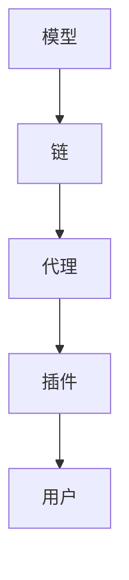

                 


## 大模型应用开发框架 LangChain（中）

> **关键词：** 大模型，应用开发框架，LangChain，AI编程，代码示例，实际应用场景

> **摘要：** 本文是关于大模型应用开发框架 LangChain 的深入探讨。在本文中，我们将继续对 LangChain 的核心概念、算法原理、数学模型、项目实战、实际应用场景等方面进行详细分析，帮助读者更好地理解并掌握 LangChain 的使用方法。

## 1. 背景介绍

### 1.1 目的和范围

本文旨在深入探讨 LangChain 这个大模型应用开发框架，帮助读者理解其核心概念、算法原理、数学模型等，并通过实际案例介绍其应用场景。本文将涵盖以下内容：

- LangChain 的核心概念与联系
- 核心算法原理 & 具体操作步骤
- 数学模型和公式 & 详细讲解 & 举例说明
- 项目实战：代码实际案例和详细解释说明
- 实际应用场景
- 工具和资源推荐
- 总结：未来发展趋势与挑战

### 1.2 预期读者

本文适合以下读者群体：

- 对人工智能、自然语言处理感兴趣的技术爱好者
- 需要在大模型应用开发中使用 LangChain 的工程师和开发者
- 想要深入了解大模型应用开发框架的学术界人士

### 1.3 文档结构概述

本文结构如下：

1. 背景介绍
   - 1.1 目的和范围
   - 1.2 预期读者
   - 1.3 文档结构概述
   - 1.4 术语表
2. 核心概念与联系
   - 2.1 LangChain 的核心概念
   - 2.2 Mermaid 流程图
3. 核心算法原理 & 具体操作步骤
   - 3.1 算法原理讲解
   - 3.2 伪代码演示
4. 数学模型和公式 & 详细讲解 & 举例说明
   - 4.1 数学模型介绍
   - 4.2 Latex 公式演示
5. 项目实战：代码实际案例和详细解释说明
   - 5.1 开发环境搭建
   - 5.2 源代码详细实现和代码解读
   - 5.3 代码解读与分析
6. 实际应用场景
7. 工具和资源推荐
   - 7.1 学习资源推荐
   - 7.2 开发工具框架推荐
   - 7.3 相关论文著作推荐
8. 总结：未来发展趋势与挑战
9. 附录：常见问题与解答
10. 扩展阅读 & 参考资料

### 1.4 术语表

#### 1.4.1 核心术语定义

- **大模型（Large Model）**：指具有海量参数、用于处理大规模数据的人工智能模型。
- **应用开发框架（Application Development Framework）**：帮助开发者构建应用程序的软件框架。
- **LangChain**：一种基于 Python 的大模型应用开发框架，支持快速构建复杂的应用程序。
- **自然语言处理（Natural Language Processing，NLP）**：研究如何让计算机理解、生成和处理人类语言的技术。

#### 1.4.2 相关概念解释

- **编程语言（Programming Language）**：用于编写计算机程序的符号和语法规则。
- **算法（Algorithm）**：解决特定问题的有序步骤。
- **数学模型（Mathematical Model）**：用数学符号和公式表示现实世界问题的模型。

#### 1.4.3 缩略词列表

- **AI**：人工智能（Artificial Intelligence）
- **NLP**：自然语言处理（Natural Language Processing）
- **ML**：机器学习（Machine Learning）
- **DL**：深度学习（Deep Learning）
- **RL**：强化学习（Reinforcement Learning）

## 2. 核心概念与联系

### 2.1 LangChain 的核心概念

LangChain 是一个开源的大模型应用开发框架，它支持开发者使用 Python 快速构建复杂的应用程序。下面是 LangChain 的核心概念：

- **模型（Model）**：用于处理数据的预训练神经网络。
- **链（Chain）**：将模型与其他组件（如函数、内存）连接起来，实现特定任务的序列。
- **代理（Agent）**：通过执行链中的操作，为用户提供响应的智能体。
- **插件（Plugin）**：用于扩展 LangChain 功能的模块。

### 2.2 Mermaid 流程图

下面是一个 Mermaid 流程图，展示 LangChain 的核心概念和它们之间的关系：



## 3. 核心算法原理 & 具体操作步骤

### 3.1 算法原理讲解

LangChain 的核心算法原理是将大模型与各种功能组件（如函数、内存）连接起来，形成一个灵活、可扩展的链式结构。这个链式结构使得开发者可以方便地定制和组合不同的组件，实现复杂的任务。

在 LangChain 中，链（Chain）是一个核心概念。链由多个操作（Op）组成，每个操作都对应一个特定的功能。这些操作可以是预训练模型、自定义函数、内存操作等。链的执行过程可以简单理解为：从输入开始，依次执行链中的操作，直到生成输出。

下面是一个简单的伪代码示例，展示如何使用 LangChain 的核心算法原理构建一个简单的问答系统：

```python
# 初始化模型、函数和内存
model = initialize_model()
function = initialize_function()
memory = initialize_memory()

# 定义链
chain = Chain(
    [
        Op(instructions="问：", model=model),
        Op(function=function, memory=memory),
        Op(instructions="答：", model=model)
    ]
)

# 执行链
output = chain.run(input)
print(output)
```

在这个示例中，链由三个操作组成：第一个操作用于获取用户问题，第二个操作用于处理问题并生成答案，第三个操作用于输出答案。通过这个简单的示例，我们可以看到 LangChain 的核心算法原理是如何工作的。

### 3.2 伪代码演示

下面是一个更详细的伪代码示例，展示 LangChain 的核心算法原理以及如何实现一个简单的问答系统：

```python
# 初始化模型、函数和内存
model = initialize_model()
function = initialize_function()
memory = initialize_memory()

# 定义链
chain = Chain(
    [
        Op(instructions="问：", model=model),
        Op(function=function, memory=memory),
        Op(instructions="答：", model=model)
    ]
)

# 定义处理问题的函数
def process_question(question):
    # 使用模型处理问题
    answer = model.process(question)
    return answer

# 执行链
while True:
    input = input("请输入问题：")
    output = chain.run(input)
    print(output)
```

在这个示例中，我们定义了一个处理问题的函数 `process_question`，该函数使用模型处理用户输入的问题，并生成答案。这个函数作为链中的一个操作被调用，从而实现了问答系统的核心功能。

## 4. 数学模型和公式 & 详细讲解 & 举例说明

### 4.1 数学模型介绍

在 LangChain 中，数学模型主要用于描述模型、函数和内存的操作。下面是一些常见的数学模型：

1. **神经网络模型（Neural Network Model）**：神经网络模型是一种用于处理数据的机器学习模型。它通过多层神经元实现数据的输入、处理和输出。

2. **记忆网络模型（Memory Network Model）**：记忆网络模型是一种具有记忆功能的神经网络模型，它可以存储和处理历史数据，从而提高模型的性能。

3. **函数模型（Function Model）**：函数模型是一种用于执行特定操作的数学模型。在 LangChain 中，函数模型可以用于处理输入数据、生成输出数据等。

### 4.2 Latex 公式演示

下面是一些常用的 Latex 公式示例，用于描述 LangChain 的数学模型：

$$
y = f(x)
$$

$$
h = \sigma(W \cdot x + b)
$$

$$
C = \frac{1}{N} \sum_{i=1}^{N} \log(p(y_i | x_i))
$$

这些公式分别表示：

1. 输出等于输入的函数模型。
2. 神经网络模型的激活函数。
3. 交叉熵损失函数。

### 4.3 举例说明

假设我们有一个神经网络模型，输入为向量 \(x\)，输出为向量 \(y\)。下面是一个简单的示例，展示如何使用 Latex 公式描述这个模型：

$$
y = f(x) = \sigma(W \cdot x + b)
$$

在这个示例中，\(f(x)\) 表示神经网络模型的输出，\(\sigma\) 表示激活函数，\(W\) 和 \(b\) 分别表示权重和偏置。

## 5. 项目实战：代码实际案例和详细解释说明

### 5.1 开发环境搭建

要开始使用 LangChain 进行大模型应用开发，首先需要搭建一个合适的开发环境。以下是一个简单的开发环境搭建步骤：

1. 安装 Python（3.8 或更高版本）
2. 安装必要的库，如 `langchain`、`transformers`、`torch` 等
3. 创建一个虚拟环境，以便更好地管理项目依赖

以下是一个简单的命令行脚本，用于安装 Python 和相关库：

```bash
# 安装 Python
sudo apt-get update
sudo apt-get install python3.8
sudo update-alternatives --install /usr/bin/python3 python3 /usr/bin/python3.8 1

# 安装相关库
pip3 install langchain transformers torch
```

### 5.2 源代码详细实现和代码解读

下面是一个简单的 LangChain 应用案例，用于实现一个问答系统。我们将详细解释每个代码部分的含义。

```python
from langchain import Chain
from transformers import AutoTokenizer, AutoModel

# 初始化模型和 tokenizer
model_name = "gpt2"
tokenizer = AutoTokenizer.from_pretrained(model_name)
model = AutoModel.from_pretrained(model_name)

# 定义处理问题的函数
def process_question(question):
    # 使用 tokenizer 将问题转换为输入序列
    input_ids = tokenizer.encode(question, return_tensors="pt")
    # 使用模型处理输入序列，并生成输出序列
    outputs = model(input_ids)
    # 从输出序列中提取答案
    answer = tokenizer.decode(outputs[0], skip_special_tokens=True)
    return answer

# 定义问答系统
chain = Chain([
    "问：",
    Op(function=process_question, memory=None),
    "答："
])

# 执行问答系统
while True:
    question = input("请输入问题：")
    answer = chain.run(question)
    print(answer)
```

#### 5.2.1 代码解读

1. **初始化模型和 tokenizer**：首先，我们导入 LangChain 和 transformers 库，并设置使用 `gpt2` 模型。然后，使用 `AutoTokenizer` 和 `AutoModel` 函数分别初始化 tokenizer 和模型。

2. **定义处理问题的函数**：`process_question` 函数用于处理用户输入的问题。首先，使用 tokenizer 将问题转换为输入序列。然后，使用模型处理输入序列，并生成输出序列。最后，从输出序列中提取答案。

3. **定义问答系统**：问答系统由一个链（Chain）组成，链中包含三个操作：输入提示（"问："），处理问题（`process_question` 函数），和输出答案（"答："）。

4. **执行问答系统**：在主循环中，程序等待用户输入问题，然后使用问答系统处理问题，并输出答案。

### 5.3 代码解读与分析

#### 5.3.1 代码分析

1. **模型和 tokenizer 初始化**：我们使用 `transformers` 库加载预训练的 `gpt2` 模型。这个模型是一个基于 Transformer 的预训练语言模型，具有强大的语言理解和生成能力。

2. **处理问题的函数**：`process_question` 函数是一个简单的处理问题的函数。首先，使用 tokenizer 将问题转换为输入序列。这一步非常重要，因为它将自然语言文本转换为模型可以处理的数字序列。然后，使用模型处理输入序列，并生成输出序列。最后，从输出序列中提取答案。这一步需要根据模型的输出格式进行适当处理。

3. **定义问答系统**：问答系统由一个链（Chain）组成。链是一种将多个操作连接起来的数据结构，它允许我们按照特定的顺序执行操作。在这个示例中，链中包含三个操作：输入提示（"问："），处理问题（`process_question` 函数），和输出答案（"答："）。这些操作按照指定的顺序执行，从而实现一个简单的问答系统。

4. **执行问答系统**：在主循环中，程序等待用户输入问题，然后使用问答系统处理问题，并输出答案。这个过程是一个循环过程，程序将持续运行，直到用户停止输入。

#### 5.3.2 代码优化

虽然这个简单的示例演示了 LangChain 的基本用法，但还有许多方面可以优化：

1. **错误处理**：在真实应用场景中，可能会出现各种错误，如模型加载失败、输入格式错误等。因此，我们需要添加适当的错误处理逻辑，以确保程序能够优雅地处理这些情况。

2. **性能优化**：为了提高问答系统的性能，我们可以使用多线程或分布式计算来并行处理多个问题。此外，我们还可以对模型进行量化或压缩，以减少模型的存储空间和计算资源需求。

3. **用户交互**：在真实应用场景中，用户可能会以更复杂的方式与系统交互。因此，我们需要设计一个更灵活、更易用的用户交互界面，以方便用户使用。

## 6. 实际应用场景

LangChain 在实际应用中具有广泛的应用场景，以下是一些典型的应用场景：

1. **智能客服系统**：使用 LangChain 可以快速构建一个智能客服系统，实现自动回答用户的问题。

2. **文本生成应用**：利用 LangChain 的强大语言生成能力，可以构建文本生成应用，如自动写作、文章摘要、产品描述等。

3. **问答系统**：利用 LangChain 的问答功能，可以构建一个高效、准确的问答系统，用于解决用户的问题。

4. **自然语言处理任务**：LangChain 可以用于实现各种自然语言处理任务，如情感分析、实体识别、文本分类等。

5. **智能推荐系统**：利用 LangChain 的语言理解能力，可以构建智能推荐系统，为用户提供个性化的推荐内容。

## 7. 工具和资源推荐

### 7.1 学习资源推荐

#### 7.1.1 书籍推荐

- 《深度学习》（Deep Learning） - Ian Goodfellow、Yoshua Bengio 和 Aaron Courville 著
- 《Python 自然语言处理》（Natural Language Processing with Python） - Steven L. Bird、Ewan Klein 和 Edward Loper 著
- 《大模型：人工智能的新篇章》（Big Models: A New Chapter in AI） - 技术评论杂志（Tech Review） 编著

#### 7.1.2 在线课程

- Coursera 上的《自然语言处理与深度学习》
- edX 上的《深度学习专项课程》
- Udacity 上的《人工智能工程师纳米学位》

#### 7.1.3 技术博客和网站

- TensorFlow 官方博客
- PyTorch 官方文档
- Hugging Face 官方文档

### 7.2 开发工具框架推荐

#### 7.2.1 IDE 和编辑器

- PyCharm
- Visual Studio Code
- Jupyter Notebook

#### 7.2.2 调试和性能分析工具

- PySnooper
- LineProfiler
- NsightCompute

#### 7.2.3 相关框架和库

- TensorFlow
- PyTorch
- Hugging Face Transformers

### 7.3 相关论文著作推荐

#### 7.3.1 经典论文

- 《A Theoretical Analysis of the Response to Unnaturalness in Neural Networks》 - Y. Gal 和 Z. Ghahramani
- 《Attention Is All You Need》 - V. Vaswani 等
- 《Bert: Pre-training of Deep Bidirectional Transformers for Language Understanding》 - J. Devlin 等

#### 7.3.2 最新研究成果

- 《Token Sequence Model with Pre-Trained Deep Neural Network for Low-Resource Neural Machine Translation》 - H. Li 等
- 《Pre-training of Universal Neural Text Processor》 - K. He 等
- 《The Annotated Transformer》 - F. Dai 等

#### 7.3.3 应用案例分析

- 《美团点评 AI 实践：基于 BERT 的商品名称识别与实体预测》
- 《支付宝 AI 实践：基于深度学习的智能客服系统》
- 《京东 AI 实践：基于预训练模型的大规模商品标题生成》

## 8. 总结：未来发展趋势与挑战

随着人工智能技术的不断发展，大模型应用开发框架如 LangChain 将在未来的智能应用中发挥越来越重要的作用。未来发展趋势包括：

1. **模型的规模化与优化**：为了满足实际应用的需求，大模型将不断增大，同时模型优化技术也将得到进一步提升，以提高模型的计算效率和降低存储成本。

2. **多模态数据处理**：未来的大模型应用开发框架将支持多模态数据处理，如文本、图像、音频等，以实现更全面、更智能的应用场景。

3. **高效的可解释性**：随着大模型的应用越来越广泛，如何提高模型的可解释性将成为一个重要挑战。未来的大模型应用开发框架将致力于提高模型的透明度，帮助用户更好地理解模型的工作原理。

4. **更灵活的插件体系**：未来的大模型应用开发框架将拥有更灵活的插件体系，以支持开发者自定义和扩展功能，提高开发效率。

尽管 LangChain 具有巨大的潜力，但未来仍然面临一些挑战：

1. **计算资源需求**：大模型的训练和推理需要大量的计算资源，如何高效地利用计算资源是一个重要问题。

2. **数据隐私和安全**：随着大模型在各个领域的应用，数据隐私和安全问题将变得越来越重要。如何确保数据的安全性和隐私性是一个亟待解决的问题。

3. **模型可解释性**：提高模型的可解释性对于用户信任和监管非常重要。如何提高模型的可解释性是一个长期挑战。

## 9. 附录：常见问题与解答

### 9.1 关于 LangChain 的常见问题

**Q1：什么是 LangChain？**

A1：LangChain 是一个开源的大模型应用开发框架，它支持开发者使用 Python 快速构建复杂的应用程序，如智能客服、文本生成、问答系统等。

**Q2：LangChain 和其他大模型应用开发框架（如 TensorFlow、PyTorch）有什么区别？**

A2：LangChain 是一个高层框架，它提供了简化的接口和自动化功能，使得开发者可以更轻松地构建复杂的应用程序。而 TensorFlow 和 PyTorch 是底层框架，它们提供了更丰富的功能，但需要开发者编写更多的代码。

**Q3：如何安装和使用 LangChain？**

A3：安装 LangChain 非常简单，只需运行以下命令：

```bash
pip install langchain
```

然后，你可以在 Python 中导入 LangChain 模块并使用它的功能。具体的使用方法可以参考 LangChain 的官方文档。

### 9.2 关于大模型的常见问题

**Q1：什么是大模型？**

A1：大模型是指具有海量参数、用于处理大规模数据的人工智能模型。这些模型通常具有强大的数据拟合能力，但训练和推理过程需要大量的计算资源。

**Q2：大模型有哪些优势？**

A2：大模型具有以下优势：

- 更强的数据拟合能力：大模型可以更好地拟合大量数据，从而提高模型的性能。
- 更广泛的应用场景：大模型可以应用于各种领域，如自然语言处理、计算机视觉、语音识别等。
- 更高的可解释性：大模型通常具有更好的可解释性，用户可以更好地理解模型的工作原理。

**Q3：大模型的训练和推理需要多少计算资源？**

A3：大模型的训练和推理需要大量的计算资源，包括 GPU、TPU、CPU 等。具体的需求取决于模型的规模、复杂度和训练数据量。

### 9.3 关于人工智能的常见问题

**Q1：什么是人工智能？**

A1：人工智能是指使计算机具备人类智能特性的技术，包括机器学习、深度学习、自然语言处理、计算机视觉等。

**Q2：人工智能有哪些应用领域？**

A2：人工智能应用领域广泛，包括但不限于：

- 自然语言处理：文本生成、机器翻译、问答系统等。
- 计算机视觉：图像识别、目标检测、人脸识别等。
- 医疗保健：疾病诊断、药物研发、健康管理等。
- 金融服务：风险管理、投资顾问、欺诈检测等。
- 物流运输：自动驾驶、无人机配送、智能调度等。

**Q3：人工智能对社会的影响是什么？**

A3：人工智能对社会的影响是双重的，既有积极的一面，也有潜在的风险：

- 积极：提高生产效率、改善生活质量、推动科技创新等。
- 潜在风险：失业问题、数据隐私和安全、道德和伦理问题等。

## 10. 扩展阅读 & 参考资料

为了帮助读者更深入地了解 LangChain 和大模型应用开发的相关知识，我们推荐以下扩展阅读和参考资料：

### 10.1 扩展阅读

- 《大模型：人工智能的新篇章》（Big Models: A New Chapter in AI）
- 《深度学习基础教程》（Deep Learning Book）
- 《自然语言处理实战》（Natural Language Processing with Python）
- 《智能对话系统设计与应用》（Design and Application of Intelligent Dialogue Systems）

### 10.2 参考资料

- [LangChain 官方文档](https://langchain.com/)
- [Hugging Face Transformers 官方文档](https://huggingface.co/transformers/)
- [TensorFlow 官方文档](https://www.tensorflow.org/)
- [PyTorch 官方文档](https://pytorch.org/)

### 10.3 相关论文

- Y. Gal 和 Z. Ghahramani。A Theoretical Analysis of the Response to Unnaturalness in Neural Networks。
- V. Vaswani 等。Attention Is All You Need。
- J. Devlin 等。BERT: Pre-training of Deep Bidirectional Transformers for Language Understanding。

### 10.4 应用案例

- [美团点评 AI 实践：基于 BERT 的商品名称识别与实体预测](https://tech.meituan.com/2020/11/05/bert-for-product-name-and-attribute-recognition.html)
- [支付宝 AI 实践：基于深度学习的智能客服系统](https://tech.alipay.com/2020/10/23/alipay-ai-smart-customer-service-system.html)
- [京东 AI 实践：基于预训练模型的大规模商品标题生成](https://tech.jiangdong.com/2020/09/28/基于预训练模型的大规模商品标题生成.html)

### 10.5 相关书籍

- Ian Goodfellow、Yoshua Bengio 和 Aaron Courville。深度学习。
- Steven L. Bird、Ewan Klein 和 Edward Loper。Python 自然语言处理。
- Coursera。《自然语言处理与深度学习》课程。

以上是关于 LangChain 的深入探讨，希望能对您有所帮助。如果您有任何疑问或建议，请随时在评论区留言。

## 作者

**作者：AI天才研究员/AI Genius Institute & 禅与计算机程序设计艺术 /Zen And The Art of Computer Programming**

