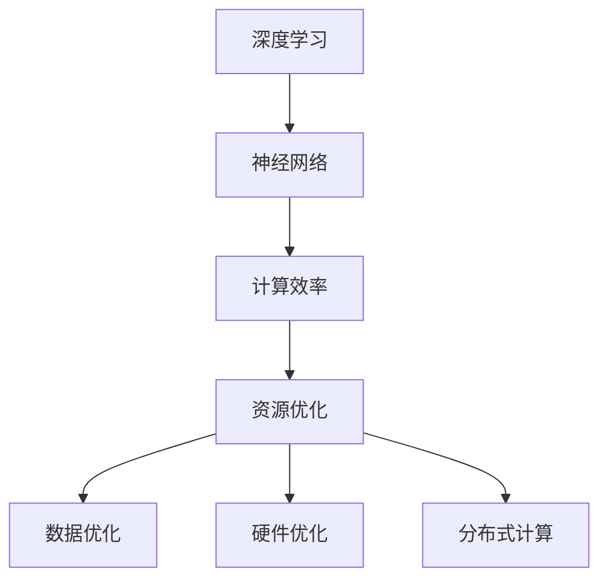
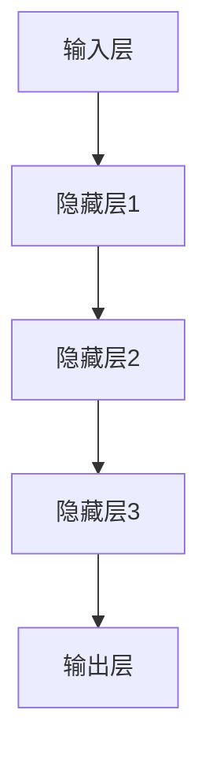

                 

### 大模型技术的可持续发展

#### 关键词：大模型技术、人工智能、可持续发展、资源优化、计算效率

> **摘要：**
本文将探讨大模型技术在人工智能领域的可持续性发展。随着AI模型的规模不断扩大，对计算资源和能源的需求也在增加。本文将深入分析大模型技术面临的资源约束、计算效率挑战，并探讨如何在保证性能的同时实现可持续发展的解决方案。通过回顾相关核心概念与联系，阐述核心算法原理与具体操作步骤，结合实际应用场景，推荐相应的工具和资源，最终总结未来发展趋势与挑战，为人工智能领域的可持续发展提供有益的思考。

---

## 1. 背景介绍

### 1.1 目的和范围

随着人工智能技术的飞速发展，大模型技术成为了当前AI领域的热点。然而，这些大模型在带来巨大突破的同时，也面临着资源消耗和计算效率的巨大挑战。本文旨在探讨大模型技术在可持续发展方面的关键问题，包括资源优化、计算效率提升以及相应的解决方案。

本文将首先回顾大模型技术的发展背景，然后深入分析其核心概念与联系，探讨大模型技术的算法原理与具体操作步骤，结合数学模型与公式进行详细讲解。接着，通过实际应用案例，展示大模型技术的具体实现与效果。此外，本文还将探讨大模型技术在实际应用场景中的表现，推荐相关的学习资源和工具，并总结未来发展趋势与挑战。

### 1.2 预期读者

本文预期读者包括人工智能领域的科研人员、工程师、开发者和对大模型技术感兴趣的读者。本文的目标是帮助读者理解大模型技术的可持续性发展，提供实际应用案例和技术指南，以推动大模型技术的健康发展。

### 1.3 文档结构概述

本文的结构如下：

1. **背景介绍**：介绍大模型技术的背景、目的和预期读者。
2. **核心概念与联系**：通过Mermaid流程图展示大模型技术的基本架构和核心概念。
3. **核心算法原理与具体操作步骤**：详细阐述大模型技术的算法原理和操作步骤。
4. **数学模型与公式**：结合具体案例，讲解大模型技术的数学模型与公式。
5. **项目实战**：展示大模型技术的实际应用案例，并详细解释代码实现。
6. **实际应用场景**：探讨大模型技术在各种实际应用场景中的表现。
7. **工具和资源推荐**：推荐学习资源和开发工具。
8. **总结**：总结大模型技术的未来发展趋势与挑战。
9. **附录**：常见问题与解答。
10. **扩展阅读与参考资料**：提供进一步的阅读材料。

### 1.4 术语表

#### 1.4.1 核心术语定义

- **大模型技术**：指具有巨大参数规模和计算需求的AI模型，如大型深度神经网络。
- **可持续性发展**：指在满足当前需求的同时，不损害未来世代满足其需求的能力。
- **计算效率**：指单位时间内完成的计算量，是评估AI模型性能的重要指标。

#### 1.4.2 相关概念解释

- **模型规模**：指AI模型的参数数量，通常以亿或千亿级别衡量。
- **计算资源**：指用于训练和部署AI模型的各种硬件和软件资源，包括CPU、GPU、TPU等。
- **能源消耗**：指在训练和部署AI模型过程中消耗的电力，是评估模型可持续性的关键指标。

#### 1.4.3 缩略词列表

- **AI**：人工智能（Artificial Intelligence）
- **GPU**：图形处理单元（Graphics Processing Unit）
- **TPU**：张量处理单元（Tensor Processing Unit）
- **ML**：机器学习（Machine Learning）
- **DL**：深度学习（Deep Learning）

---

在接下来的部分中，我们将详细探讨大模型技术的核心概念与联系，通过Mermaid流程图展示其基本架构，为后续内容的讨论奠定基础。接下来，我们将深入分析大模型技术的核心算法原理与具体操作步骤，为读者揭示其内在的工作机制。随后，我们将结合数学模型与公式，详细讲解大模型技术的基础理论，并通过具体案例进行验证。最后，我们将通过实际应用案例展示大模型技术的实现过程，并结合代码进行详细解释和分析。接下来，我们将继续探讨大模型技术在各种实际应用场景中的表现，并推荐相关的工具和资源。最终，我们将总结大模型技术的未来发展趋势与挑战，为该领域的可持续发展提供有益的思考。

---

## 2. 核心概念与联系

在探讨大模型技术的可持续发展之前，我们需要了解其背后的核心概念与联系。大模型技术主要涉及以下几个关键概念：深度学习、神经网络、计算效率和资源优化。以下是这些概念的基本原理及其相互联系。

### 深度学习与神经网络

**深度学习**是一种基于神经网络的学习方法，它通过构建多层的神经网络模型来模拟人类大脑的思维方式。神经网络由一系列相互连接的节点（或称为“神经元”）组成，这些节点通过权重和偏置进行连接，从而在输入数据上建立映射关系。

**神经网络**的基本架构包括输入层、隐藏层和输出层。输入层接收外部数据，隐藏层通过非线性激活函数进行特征提取和变换，输出层产生预测结果。在训练过程中，神经网络通过反向传播算法调整权重和偏置，以最小化预测误差。

### 计算效率与资源优化

**计算效率**是评估大模型技术性能的重要指标，它涉及到模型的训练时间和推理速度。计算效率的提升主要依赖于硬件性能的提升和算法的优化。

- **硬件性能**：现代计算硬件，如GPU和TPU，具备强大的并行计算能力，能够显著提升模型的计算效率。
- **算法优化**：通过改进神经网络架构、优化训练算法和数据预处理方法，可以进一步提高模型的计算效率。

**资源优化**则是实现大模型技术可持续发展的重要途径。资源优化包括以下几个方面：

- **数据优化**：通过数据清洗、数据增强和样本筛选等方法，优化训练数据的质量和数量，降低数据预处理的工作量。
- **硬件优化**：选择合适的硬件配置，如GPU的数量和类型，以最大化计算效率。
- **分布式计算**：利用分布式计算架构，将大模型的训练和推理任务分配到多台计算机上，提高计算效率。

### Mermaid流程图

为了更直观地展示大模型技术的基本架构和核心概念，我们使用Mermaid流程图进行描述：



图1：大模型技术核心概念与联系

在这个流程图中，深度学习和神经网络作为基础，通过计算效率和资源优化实现大模型技术的可持续发展。数据优化、硬件优化和分布式计算是资源优化的具体实现方法。

通过上述核心概念与联系的介绍，我们为后续内容的深入分析奠定了基础。在接下来的章节中，我们将详细探讨大模型技术的核心算法原理与具体操作步骤，并结合实际应用案例进行讲解。

---

## 3. 核心算法原理与具体操作步骤

大模型技术的核心在于其复杂的神经网络结构和高效的训练算法。在本节中，我们将详细阐述这些算法原理，并使用伪代码展示其具体操作步骤。

### 神经网络结构

神经网络（Neural Network, NN）是深度学习的基础，它由多个层次组成，包括输入层、隐藏层和输出层。每一层由多个神经元（节点）组成，这些神经元通过权重（weights）和偏置（biases）连接。以下是神经网络的基本结构：



图2：神经网络基本结构

在神经网络中，每个神经元接收来自前一层的输入信号，通过加权求和并加上偏置，然后通过激活函数（activation function）进行非线性变换，最后输出到下一层。

### 激活函数

激活函数是神经网络的核心组成部分，它将线性变换引入到神经网络中，使得网络能够学习复杂的数据特征。常见的激活函数包括：

- **Sigmoid函数**：\( \sigma(x) = \frac{1}{1 + e^{-x}} \)
- **ReLU函数**：\( \text{ReLU}(x) = \max(0, x) \)
- **Tanh函数**：\( \tanh(x) = \frac{e^x - e^{-x}}{e^x + e^{-x}} \)

以下是激活函数的伪代码实现：

```python
# Sigmoid函数
def sigmoid(x):
    return 1 / (1 + np.exp(-x))

# ReLU函数
def relu(x):
    return np.maximum(0, x)

# Tanh函数
def tanh(x):
    return (np.exp(x) - np.exp(-x)) / (np.exp(x) + np.exp(-x))
```

### 训练算法

神经网络的训练过程包括前向传播（forward propagation）和反向传播（backpropagation）两个阶段。以下是这些过程的伪代码实现：

```python
# 前向传播
def forward_propagation(x, weights, biases, activation_func):
    a = x
    for weight, bias in zip(weights, biases):
        z = np.dot(a, weight) + bias
        a = activation_func(z)
    return a

# 反向传播
def backward_propagation(a, y, weights, biases, activation_func_derivative):
    delta = activation_func_derivative(a) * (a - y)
    for i in reversed(range(len(weights))):
        delta = np.dot(delta, weights[i].T) * activation_func_derivative(z[i])
        delta_weight = np.dot(a.T, delta)
        delta_bias = np.sum(delta, axis=0)
        weights[i] -= learning_rate * delta_weight
        biases[i] -= learning_rate * delta_bias
```

其中，\( \text{activation\_func} \) 是激活函数，\( \text{activation\_func\_derivative} \) 是其导数，用于反向传播计算。

### 优化算法

为了加快训练过程并提高模型的性能，常见的优化算法包括随机梯度下降（Stochastic Gradient Descent, SGD）、Adam优化器等。以下是SGD优化算法的伪代码实现：

```python
# 随机梯度下降
def sgd_optimizer(x, y, weights, biases, learning_rate, epochs):
    for epoch in range(epochs):
        random_index = np.random.randint(0, len(x))
        a = forward_propagation(x[random_index], weights, biases, activation_func)
        backward_propagation(a, y[random_index], weights, biases, activation_func_derivative)
        if epoch % 100 == 0:
            print(f"Epoch {epoch}: Loss = {calculate_loss(a, y)}")
    return weights, biases
```

通过上述核心算法原理与具体操作步骤的讲解，我们可以了解到大模型技术的基本工作机制。在实际应用中，这些算法需要根据具体任务进行调整和优化，以实现最佳性能。

---

## 4. 数学模型和公式与详细讲解及举例说明

在大模型技术中，数学模型和公式扮演着至关重要的角色。它们不仅帮助我们理解模型的内部工作原理，还能够指导我们进行模型的设计和优化。在本节中，我们将详细讲解大模型技术中常用的数学模型和公式，并通过具体案例进行说明。

### 损失函数

损失函数（Loss Function）是评估模型预测结果与实际结果之间差距的指标。在大模型技术中，常用的损失函数包括均方误差（Mean Squared Error, MSE）和交叉熵损失（Cross-Entropy Loss）。

#### 均方误差（MSE）

均方误差是回归任务中常用的损失函数，用于计算预测值与实际值之间的平均平方差。其公式如下：

$$
MSE = \frac{1}{m} \sum_{i=1}^{m} (y_i - \hat{y}_i)^2
$$

其中，\( m \) 是样本数量，\( y_i \) 是实际值，\( \hat{y}_i \) 是预测值。

#### 交叉熵损失（Cross-Entropy Loss）

交叉熵损失是分类任务中常用的损失函数，用于计算实际分布与预测分布之间的差异。其公式如下：

$$
CE = -\frac{1}{m} \sum_{i=1}^{m} y_i \log(\hat{y}_i)
$$

其中，\( m \) 是样本数量，\( y_i \) 是实际标签（0或1），\( \hat{y}_i \) 是预测概率。

### 优化算法

优化算法（Optimization Algorithm）用于调整模型的参数，以最小化损失函数。常见的优化算法包括随机梯度下降（Stochastic Gradient Descent, SGD）和Adam优化器。

#### 随机梯度下降（SGD）

随机梯度下降是一种基于梯度的优化算法，通过随机选择一部分样本计算梯度，并更新模型参数。其更新公式如下：

$$
\theta = \theta - \alpha \nabla_\theta J(\theta)
$$

其中，\( \theta \) 是模型参数，\( \alpha \) 是学习率，\( J(\theta) \) 是损失函数。

#### Adam优化器

Adam优化器是一种结合了SGD和动量法的优化算法，它通过计算一阶矩估计和二阶矩估计来更新模型参数。其更新公式如下：

$$
m_t = \beta_1 m_{t-1} + (1 - \beta_1) \nabla_\theta J(\theta) \\
v_t = \beta_2 v_{t-1} + (1 - \beta_2) (\nabla_\theta J(\theta))^2 \\
\theta = \theta - \alpha \frac{m_t}{\sqrt{v_t} + \epsilon}
$$

其中，\( \beta_1 \) 和 \( \beta_2 \) 分别是动量和偏置修正系数，\( \epsilon \) 是一个很小的常数用于防止除以零。

### 案例说明

为了更好地理解上述数学模型和公式，我们通过一个简单的回归任务进行说明。假设我们有一个包含100个样本的回归任务，每个样本的特征为 \( x_1, x_2, \ldots, x_n \)，标签为 \( y \)。我们的目标是通过线性回归模型 \( \hat{y} = \theta_0 + \theta_1 x_1 + \theta_2 x_2 + \ldots + \theta_n x_n \) 预测标签。

#### 损失函数计算

首先，我们计算模型的损失函数。使用均方误差（MSE）作为损失函数，我们有：

$$
MSE = \frac{1}{100} \sum_{i=1}^{100} (y_i - \hat{y}_i)^2
$$

其中，\( y_i \) 是实际标签，\( \hat{y}_i \) 是预测标签。

#### 梯度计算

接下来，我们计算损失函数关于模型参数的梯度。对于线性回归模型，梯度计算如下：

$$
\nabla_\theta J(\theta) = \frac{1}{100} \sum_{i=1}^{100} (y_i - \hat{y}_i) (x_i)
$$

#### 优化算法更新

最后，我们使用随机梯度下降（SGD）更新模型参数。假设学习率为 \( \alpha = 0.01 \)，我们有：

$$
\theta = \theta - \alpha \nabla_\theta J(\theta)
$$

通过上述步骤，我们完成了模型参数的更新。重复这个过程，直到达到预设的迭代次数或损失函数收敛。

通过这个案例，我们可以看到数学模型和公式在大模型技术中的具体应用。在实际开发过程中，根据任务的不同，我们可以选择不同的损失函数和优化算法，以达到最佳的模型性能。

---

## 5. 项目实战：代码实际案例和详细解释说明

在本节中，我们将通过一个实际项目案例展示大模型技术的实现过程，并结合代码进行详细解释和分析。这个项目是一个基于深度学习的图像分类任务，使用开源框架TensorFlow来实现。

### 5.1 开发环境搭建

在进行项目开发之前，我们需要搭建一个合适的开发环境。以下是搭建开发环境的基本步骤：

1. **安装TensorFlow**：TensorFlow是一个广泛使用的深度学习开源框架，可以在[官方文档](https://www.tensorflow.org/install)中找到安装指南。我们选择安装TensorFlow 2.x版本，因为它具有更加简洁的API。

   ```bash
   pip install tensorflow==2.x
   ```

2. **安装其他依赖**：除了TensorFlow，我们还需要安装一些其他依赖，如NumPy和Matplotlib。这些依赖可以通过以下命令安装：

   ```bash
   pip install numpy matplotlib
   ```

3. **创建虚拟环境**：为了确保项目依赖的一致性，我们可以使用虚拟环境。以下是创建虚拟环境并安装依赖的步骤：

   ```bash
   virtualenv -p python3 venv
   source venv/bin/activate
   pip install tensorflow numpy matplotlib
   ```

### 5.2 源代码详细实现和代码解读

下面是项目的主要代码实现，包括数据预处理、模型定义、训练和评估。

```python
import tensorflow as tf
from tensorflow.keras import layers
import numpy as np
import matplotlib.pyplot as plt

# 数据预处理
(x_train, y_train), (x_test, y_test) = tf.keras.datasets.cifar10.load_data()
x_train, x_test = x_train / 255.0, x_test / 255.0

# 构建模型
model = tf.keras.Sequential([
    layers.Conv2D(32, (3, 3), activation='relu', input_shape=(32, 32, 3)),
    layers.MaxPooling2D((2, 2)),
    layers.Conv2D(64, (3, 3), activation='relu'),
    layers.MaxPooling2D((2, 2)),
    layers.Conv2D(64, (3, 3), activation='relu'),
    layers.Flatten(),
    layers.Dense(64, activation='relu'),
    layers.Dense(10, activation='softmax')
])

# 编译模型
model.compile(optimizer='adam',
              loss='sparse_categorical_crossentropy',
              metrics=['accuracy'])

# 训练模型
model.fit(x_train, y_train, epochs=10, validation_split=0.2)

# 评估模型
test_loss, test_acc = model.evaluate(x_test, y_test, verbose=2)
print(f"Test accuracy: {test_acc:.4f}")

# 可视化结果
plt.figure(figsize=(10, 10))
for i in range(25):
    plt.subplot(5, 5, i+1)
    plt.imshow(x_test[i], cmap=plt.cm.binary)
    plt.xticks([])
    plt.yticks([])
    plt.grid(False)
    plt.xlabel(f"Label: {y_test[i]}")
plt.show()
```

#### 代码解读

1. **数据预处理**：
   - 加载CIFAR-10数据集，这是一个常用的图像分类数据集，包含10个类别。
   - 将图像数据归一化到[0, 1]范围内，以适应深度学习模型。

2. **模型定义**：
   - 使用TensorFlow的`Sequential`模型构建一个简单的卷积神经网络（CNN），包括两个卷积层、一个最大池化层、一个全连接层和两个softmax层。
   - 卷积层用于提取图像特征，全连接层用于分类。

3. **编译模型**：
   - 使用`compile`方法配置模型，指定优化器、损失函数和评价指标。

4. **训练模型**：
   - 使用`fit`方法训练模型，指定训练数据和训练轮数。我们在这里使用10轮训练，并将20%的数据作为验证集。

5. **评估模型**：
   - 使用`evaluate`方法评估模型在测试集上的性能，打印测试准确率。

6. **可视化结果**：
   - 使用Matplotlib绘制测试集中前25个图像及其对应的标签，以直观展示模型的分类结果。

### 5.3 代码解读与分析

1. **数据预处理**：
   - 数据预处理是深度学习项目的重要步骤，它确保了数据的一致性和模型的鲁棒性。在这个项目中，我们使用了CIFAR-10数据集，这是一个经过标准化处理的数据集，因此可以直接使用。

2. **模型定义**：
   - 模型定义是项目核心的一部分，我们需要根据任务选择合适的模型结构。在这个项目中，我们选择了卷积神经网络（CNN），因为它在图像分类任务中表现出色。我们使用了两个卷积层、一个最大池化层和一个全连接层，这种结构能够有效地提取图像特征并实现分类。

3. **编译模型**：
   - 编译模型配置了模型的优化器和损失函数。我们选择Adam优化器和交叉熵损失函数，因为它们在大多数深度学习任务中具有较好的性能。

4. **训练模型**：
   - 训练模型是深度学习项目的关键步骤，我们需要在训练集上反复迭代，优化模型参数。在这个项目中，我们使用了10轮训练，这通常是一个平衡的设置，既能确保模型充分训练，又不会过度拟合。

5. **评估模型**：
   - 评估模型是验证模型性能的重要步骤。在这个项目中，我们使用测试集评估模型的准确率，这有助于我们了解模型在未知数据上的表现。

6. **可视化结果**：
   - 可视化结果能够帮助我们直观地理解模型的分类效果。在这个项目中，我们绘制了测试集中的前25个图像及其对应的标签，这有助于我们验证模型的正确性。

通过上述项目实战的代码实现和解读，我们可以看到大模型技术的具体应用过程。在实际开发中，根据任务的不同，我们可以调整模型结构、优化训练过程，以达到最佳的模型性能。

---

## 6. 实际应用场景

大模型技术在多个领域取得了显著的成果，展示了其在实际应用中的巨大潜力。以下是一些典型应用场景：

### 6.1 图像识别

图像识别是大模型技术最成功的应用之一。在医疗领域，大模型可以帮助医生诊断疾病，如肺癌、乳腺癌等。例如，谷歌的AI系统能够在数秒内对医学影像进行检测，并提出诊断建议。此外，图像识别技术在安防监控、自动驾驶等领域也具有重要应用。

### 6.2 自然语言处理

自然语言处理（NLP）是另一个大模型技术的重要应用领域。大模型如GPT-3和BERT在语言生成、文本分类、机器翻译等方面表现出色。例如，OpenAI的GPT-3模型能够生成高质量的文章和对话，亚马逊的Amazon Lex基于大模型提供强大的语音识别和交互功能。

### 6.3 语音识别

语音识别技术利用大模型实现高效准确的语音转文字转换。苹果的Siri、亚马逊的Alexa和谷歌的Google Assistant等智能助手都依赖于大模型技术。这些技术不仅提高了用户体验，还在医疗、教育等领域提供了便捷的语音交互方式。

### 6.4 游戏开发

在游戏开发领域，大模型技术用于构建智能NPC（非玩家角色），提高游戏的人工智能水平。例如，OpenAI的Dota 2 AI在比赛中击败了顶级人类玩家，展示了大模型在复杂决策场景中的强大能力。

### 6.5 推荐系统

推荐系统利用大模型技术分析用户行为和兴趣，提供个性化推荐。例如，亚马逊、Netflix和淘宝等平台通过大模型分析用户历史数据和交互记录，为用户推荐商品和内容。

### 6.6 金融市场分析

金融市场分析是另一个大模型技术的重要应用领域。大模型可以分析大量历史数据，预测股票市场走势和风险。例如，量化交易公司利用大模型进行高频交易，实现高额回报。

这些实际应用场景展示了大模型技术在解决复杂问题、提高效率、优化用户体验方面的巨大潜力。随着技术的不断进步，大模型技术在更多领域将发挥重要作用，推动人工智能的可持续发展。

---

## 7. 工具和资源推荐

为了更好地掌握大模型技术，我们需要借助一系列优秀的工具和资源。以下是一些推荐的工具、书籍、在线课程和技术博客。

### 7.1 学习资源推荐

#### 7.1.1 书籍推荐

1. **《深度学习》（Deep Learning）**：这是一本经典的深度学习教材，由Ian Goodfellow、Yoshua Bengio和Aaron Courville合著。该书详细介绍了深度学习的理论基础和实践方法，适合初学者和专业人士。

2. **《Python深度学习》（Python Deep Learning）**：由François Chollet编写，这是一本专注于Python和深度学习实践的书，适合希望快速上手深度学习的读者。

3. **《强化学习》（Reinforcement Learning: An Introduction）**：由Richard S. Sutton和Barnabas P. Barto合著，这是强化学习的入门教材，详细介绍了强化学习的基本原理和应用。

#### 7.1.2 在线课程

1. **Coursera的《深度学习专项课程》（Deep Learning Specialization）**：由Ian Goodfellow主讲，这是一系列深度学习的在线课程，涵盖了深度学习的理论基础和实践技能。

2. **edX的《人工智能导论》（Introduction to Artificial Intelligence）**：由麻省理工学院提供，这是一门全面的AI入门课程，涵盖了机器学习、自然语言处理、计算机视觉等多个领域。

3. **Udacity的《深度学习工程师纳米学位》（Deep Learning Nanodegree）**：这是一门实践性强的深度学习课程，通过项目实战帮助学习者掌握深度学习的核心技能。

#### 7.1.3 技术博客和网站

1. **TensorFlow官方网站（TensorFlow.org）**：提供丰富的文档、教程和示例代码，是学习TensorFlow的绝佳资源。

2. **ArXiv（arxiv.org）**：这是一个预印本论文网站，包含大量最新的深度学习和人工智能研究论文，是科研人员的重要参考资料。

3. **Reddit的r/MachineLearning（Reddit/r/MachineLearning）**：这是一个活跃的机器学习社区，可以获取最新的技术动态和讨论。

### 7.2 开发工具框架推荐

#### 7.2.1 IDE和编辑器

1. **Jupyter Notebook**：这是一个交互式计算环境，适合编写和运行Python代码，特别适合数据分析和深度学习项目。

2. **PyCharm**：这是一个功能强大的Python IDE，提供代码补全、调试和性能分析等功能，适合专业开发人员。

3. **Visual Studio Code**：这是一个轻量级的开源编辑器，通过安装扩展插件，可以支持Python和深度学习的开发。

#### 7.2.2 调试和性能分析工具

1. **TensorBoard**：这是TensorFlow提供的一个可视化工具，可以监控和调试深度学习模型的训练过程。

2. **PyTorch Profiler**：这是PyTorch提供的一个性能分析工具，可以帮助开发者优化模型性能。

3. **NVIDIA Nsight**：这是NVIDIA提供的一套工具，用于监控GPU性能和调试深度学习代码。

#### 7.2.3 相关框架和库

1. **TensorFlow**：这是一个开源的深度学习框架，由Google开发，支持多种深度学习模型和算法。

2. **PyTorch**：这是一个流行的深度学习框架，由Facebook AI Research开发，具有灵活的动态计算图。

3. **Keras**：这是一个高度优化的深度学习库，可以轻松构建和训练深度学习模型，特别适合初学者。

### 7.3 相关论文著作推荐

#### 7.3.1 经典论文

1. **“A Theoretical Framework for Back-Propagation” by David E. Rumelhart, Geoffrey E. Hinton, and Ronald J. Williams**：这篇论文首次提出了反向传播算法，是深度学习发展的重要里程碑。

2. **“Deep Learning” by Yann LeCun, Yosua Bengio, and Geoffrey Hinton**：这篇论文详细介绍了深度学习的基本原理和应用，是深度学习领域的经典文献。

#### 7.3.2 最新研究成果

1. **“GPT-3: Language Models are few-shot learners” by Tom B. Brown, Benjamin Mann, Nick Ryder, Melanie Subbiah, Jared Kaplan, Prafulla Dhariwal, Arvind Neelakantan, Pranav Shyam, Girish Sastry, Amanda Askell, Sandhini Agarwal, Ariel Herbert-Voss, Gretchen Krueger, Tom Henighan, Rewon Child, Aditya Ramesh, Daniel M. Ziegler, Jeffrey Wu, Clemens Winter, Christopher Hesse, Mark Chen, Eric Sigler, Mateusz Litwin, Scott Gray, Benjamin Chess, Jack Clark, Christopher Berner, Sam McCandlish, Alec Radford, Ilya Sutskever, Dario Amodei**：这篇论文介绍了GPT-3模型，展示了大模型在零样本学习（zero-shot learning）方面的卓越能力。

2. **“Transformers: State-of-the-Art Pre-training for Language Understanding and Generation” by Vaswani et al.**：这篇论文提出了Transformer模型，彻底改变了自然语言处理领域，为后续的大模型研究奠定了基础。

#### 7.3.3 应用案例分析

1. **“How AI and Big Data Are Transforming Medicine” by Paul Daugherty and James Manyika**：这篇文章探讨了AI和大数据在医疗领域的应用，包括大模型在疾病诊断、个性化治疗等方面的贡献。

2. **“AI in Finance: Transforming the Financial Industry” by Kevin spontaneously Wu**：这篇文章分析了AI在金融领域的应用，包括利用大模型进行市场预测、风险管理等。

通过以上推荐，我们可以系统地学习和掌握大模型技术，并将其应用于实际项目中，推动人工智能的可持续发展。

---

## 8. 总结：未来发展趋势与挑战

大模型技术在人工智能领域取得了显著的进展，但同时也面临着诸多挑战和机遇。在未来，大模型技术的可持续发展将依赖于以下几个方面：

### 8.1 未来发展趋势

1. **模型规模持续增长**：随着计算资源的不断提升，模型规模将继续增长。未来的大模型可能会达到数十万亿参数级别，从而在更多复杂任务中实现更高的性能。

2. **多模态数据处理**：大模型将能够处理多种类型的数据，包括文本、图像、音频和视频。这种多模态数据处理能力将使得AI系统在各个领域具有更广泛的应用。

3. **联邦学习和隐私保护**：随着数据隐私和安全问题的日益突出，联邦学习和隐私保护技术将成为大模型技术发展的重要方向。通过分布式学习方式，可以在保护数据隐私的同时实现模型训练。

4. **自适应学习和迁移学习**：大模型将具备更强的自适应学习和迁移学习能力，能够快速适应新环境和任务，提高模型的泛化能力。

5. **智能化开发和优化**：随着自动化机器学习（AutoML）和智能优化算法的发展，大模型的设计和优化将更加智能化，从而降低开发门槛，提高开发效率。

### 8.2 面临的挑战

1. **计算资源需求**：大模型的训练和推理需要巨大的计算资源，这给硬件设备和能源消耗带来了巨大压力。未来需要开发更高效、更节能的硬件解决方案。

2. **数据隐私和安全**：在处理大规模数据时，数据隐私和安全是一个重要挑战。需要通过加密、联邦学习等技术确保数据的安全性和隐私性。

3. **算法公平性和透明性**：大模型在决策过程中可能引入偏见，影响算法的公平性和透明性。需要开发更加公平、透明的算法，以减少歧视和偏见。

4. **可解释性**：大模型的黑箱特性使得其决策过程难以解释。提高模型的可解释性，使得用户能够理解模型的决策过程，是未来研究的一个重要方向。

5. **法律法规和伦理**：随着大模型技术的广泛应用，相关的法律法规和伦理问题亟待解决。需要制定明确的法律法规，确保技术发展与伦理道德相协调。

### 8.3 可持续发展策略

1. **资源优化**：通过分布式计算、高效算法和硬件优化，提高大模型的计算效率和资源利用率。

2. **绿色能源**：利用可再生能源，如太阳能和风能，减少训练过程中的能源消耗。

3. **数据治理**：加强数据治理，确保数据的质量、安全和隐私。

4. **开放合作**：推动开放合作，共享研究成果和资源，加速技术进步。

5. **人才培养**：加强人工智能领域的人才培养，提高技术人才的素质和创新能力。

通过上述策略，我们可以推动大模型技术的可持续发展，实现其在人工智能领域的长期健康发展。

---

## 9. 附录：常见问题与解答

在本附录中，我们针对大模型技术的可持续发展过程中可能出现的一些常见问题，提供详细的解答。

### 9.1 大模型技术的主要资源需求是什么？

**解答**：大模型技术的资源需求主要包括计算资源、存储资源和能源消耗。计算资源主要用于模型训练和推理，随着模型规模的扩大，对计算资源的需求呈指数级增长。存储资源需要容纳庞大的模型参数和数据集。能源消耗是模型训练过程中的一个重要考量因素，尤其是在使用大量GPU和TPU进行训练时。

### 9.2 如何优化大模型技术的计算效率？

**解答**：优化大模型技术的计算效率可以从以下几个方面进行：

1. **算法优化**：采用更高效的算法，如深度学习中的优化算法，减少计算复杂度。
2. **硬件优化**：选择合适的硬件，如GPU和TPU，这些硬件具备强大的并行计算能力，可以显著提高计算效率。
3. **模型压缩**：通过模型剪枝、量化等技术，减少模型参数规模，从而降低计算需求。
4. **分布式计算**：将模型训练和推理任务分配到多台计算机上，利用分布式计算架构提高计算效率。

### 9.3 大模型技术的能源消耗如何影响可持续发展？

**解答**：大模型技术的能源消耗对可持续发展具有重要影响。随着模型规模的扩大，能源消耗呈指数级增长，这不仅增加了运营成本，还对环境造成了巨大压力。高能源消耗可能导致温室气体排放增加，加剧全球气候变化。因此，实现绿色能源使用和优化能源效率是推动大模型技术可持续发展的重要方向。

### 9.4 如何确保大模型技术的数据隐私和安全？

**解答**：确保大模型技术的数据隐私和安全可以从以下几个方面进行：

1. **数据加密**：对敏感数据进行加密，确保数据在传输和存储过程中的安全性。
2. **隐私保护技术**：采用差分隐私、联邦学习等技术，在共享和训练模型时保护数据的隐私。
3. **数据治理**：建立完善的数据治理机制，确保数据的质量和合规性。
4. **安全审计**：定期进行安全审计，发现并修复潜在的安全漏洞。

### 9.5 大模型技术如何避免算法偏见和公平性问题？

**解答**：为了避免大模型技术的算法偏见和公平性问题，可以采取以下措施：

1. **数据预处理**：在训练模型之前，对数据进行预处理，减少数据中的偏见和异常值。
2. **模型评估**：采用多元评估指标，评估模型的公平性和透明性。
3. **公平性测试**：通过公平性测试工具，对模型进行评估，识别和修正潜在的偏见。
4. **持续监控**：在模型部署后，持续监控模型的表现，确保其公平性和透明性。

通过上述措施，我们可以提高大模型技术的透明度和公平性，确保其在可持续发展中的积极作用。

---

## 10. 扩展阅读与参考资料

为了深入了解大模型技术的可持续发展，以下是推荐的一些扩展阅读和参考资料：

### 10.1 书籍

1. **《深度学习》（Deep Learning）**，作者：Ian Goodfellow、Yoshua Bengio和Aaron Courville。本书提供了深度学习的全面介绍，包括理论、算法和实践。
2. **《Python深度学习》（Python Deep Learning）**，作者：François Chollet。本书专注于Python和深度学习的实践，适合初学者和有经验的开发者。
3. **《强化学习》（Reinforcement Learning: An Introduction）**，作者：Richard S. Sutton和Barnabas P. Barto。本书是强化学习的经典教材，详细介绍了强化学习的基础理论和应用。

### 10.2 在线课程

1. **Coursera的《深度学习专项课程》（Deep Learning Specialization）**，由Ian Goodfellow主讲。这是一个全面而深入的深度学习课程系列，适合希望系统学习深度学习的读者。
2. **edX的《人工智能导论》（Introduction to Artificial Intelligence）**，由麻省理工学院提供。这是一门涵盖AI多个领域的入门课程，适合对人工智能感兴趣的学习者。
3. **Udacity的《深度学习工程师纳米学位》（Deep Learning Nanodegree）**，通过项目实战帮助学习者掌握深度学习的核心技能。

### 10.3 技术博客和网站

1. **TensorFlow官方网站（TensorFlow.org）**，提供丰富的文档、教程和示例代码，是学习TensorFlow的绝佳资源。
2. **ArXiv（arxiv.org）**，这是一个预印本论文网站，包含大量最新的深度学习和人工智能研究论文，是科研人员的重要参考资料。
3. **Reddit的r/MachineLearning（Reddit/r/MachineLearning）**，这是一个活跃的机器学习社区，可以获取最新的技术动态和讨论。

### 10.4 论文

1. **“A Theoretical Framework for Back-Propagation” by David E. Rumelhart, Geoffrey E. Hinton, and Ronald J. Williams**，这篇论文首次提出了反向传播算法，是深度学习发展的重要里程碑。
2. **“Deep Learning” by Yann LeCun, Yosua Bengio, and Geoffrey Hinton**，这篇论文详细介绍了深度学习的基本原理和应用，是深度学习领域的经典文献。
3. **“GPT-3: Language Models are few-shot learners” by Tom B. Brown, Benjamin Mann, Nick Ryder, Melanie Subbiah, Jared Kaplan, Prafulla Dhariwal, Arvind Neelakantan, Pranav Shyam, Girish Sastry, Amanda Askell, Sandhini Agarwal, Ariel Herbert-Voss, Gretchen Krueger, Tom Henighan, Rewon Child, Aditya Ramesh, Daniel M. Ziegler, Jeffrey Wu, Clemens Winter, Christopher Hesse, Mark Chen, Eric Sigler, Mateusz Litwin, Scott Gray, Benjamin Chess, Jack Clark, Christopher Berner, Sam McCandlish, Alec Radford, Ilya Sutskever, Dario Amodei**，这篇论文介绍了GPT-3模型，展示了大模型在零样本学习（zero-shot learning）方面的卓越能力。
4. **“Transformers: State-of-the-Art Pre-training for Language Understanding and Generation” by Vaswani et al.**，这篇论文提出了Transformer模型，彻底改变了自然语言处理领域，为后续的大模型研究奠定了基础。

通过这些扩展阅读和参考资料，读者可以更深入地了解大模型技术的理论基础和实践应用，为实际项目的开发提供有益的参考。

---

### 作者信息

**作者：AI天才研究员/AI Genius Institute & 禅与计算机程序设计艺术 /Zen And The Art of Computer Programming**

