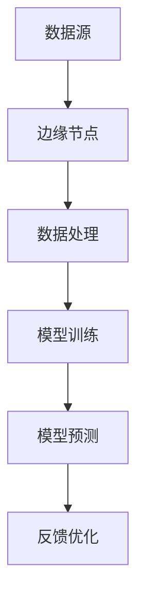

                 

# 大模型技术的边缘计算应用

> **关键词**：大模型技术，边缘计算，AI，机器学习，深度学习，数据处理，实时分析，性能优化

> **摘要**：本文将深入探讨大模型技术在边缘计算中的应用，分析其核心概念、算法原理、数学模型以及实际项目案例，并探讨其在各个行业中的实际应用场景。通过本文的阅读，读者将了解如何利用大模型技术提升边缘计算的性能和效率，以及面临的挑战和未来发展趋势。

## 1. 背景介绍

### 1.1 目的和范围

本文的目的是探讨大模型技术在边缘计算中的应用，为读者提供深入的技术分析和实际案例。文章将涵盖以下主要内容：

- 大模型技术的核心概念和原理
- 边缘计算的背景和重要性
- 大模型技术在边缘计算中的具体应用
- 大模型技术在边缘计算中的性能优化
- 实际应用场景和案例分析
- 未来发展趋势和面临的挑战

### 1.2 预期读者

本文适合对人工智能、机器学习和边缘计算有一定了解的读者，包括：

- AI领域的研究人员
- 从事边缘计算开发的技术人员
- 对大模型技术在边缘计算应用感兴趣的学者
- 需要提升边缘计算性能的企业和开发者

### 1.3 文档结构概述

本文分为以下几个部分：

- 背景介绍：介绍本文的目的、预期读者和文档结构。
- 核心概念与联系：分析大模型技术和边缘计算的核心概念和联系。
- 核心算法原理 & 具体操作步骤：详细讲解大模型技术的算法原理和操作步骤。
- 数学模型和公式 & 详细讲解 & 举例说明：介绍大模型技术的数学模型和公式，并举例说明。
- 项目实战：代码实际案例和详细解释说明。
- 实际应用场景：探讨大模型技术在边缘计算中的实际应用场景。
- 工具和资源推荐：推荐学习资源和开发工具。
- 总结：未来发展趋势与挑战。
- 附录：常见问题与解答。
- 扩展阅读 & 参考资料：提供进一步阅读的参考资料。

### 1.4 术语表

#### 1.4.1 核心术语定义

- **大模型技术**：指使用大规模神经网络进行训练和预测的机器学习技术，如深度学习模型。
- **边缘计算**：指在靠近数据源或终端设备的边缘节点进行数据处理和计算的技术。
- **AI**：指人工智能，是一种模拟人类智能行为的计算机系统。
- **机器学习**：一种人工智能的分支，通过算法从数据中学习规律和模式。
- **深度学习**：一种机器学习技术，通过多层神经网络进行特征提取和学习。
- **数据处理**：对原始数据进行清洗、转换和整合的过程。

#### 1.4.2 相关概念解释

- **边缘节点**：指位于网络边缘的设备或服务器，如物联网设备、智能传感器等。
- **云计算**：一种通过网络提供计算资源和服务的技术。
- **实时分析**：指在数据产生的同时或短时间内进行数据处理和分析的技术。

#### 1.4.3 缩略词列表

- **AI**：人工智能
- **ML**：机器学习
- **DL**：深度学习
- **EC**：边缘计算
- **GPU**：图形处理器
- **CPU**：中央处理器

## 2. 核心概念与联系

大模型技术和边缘计算是现代人工智能领域的重要技术，两者有着紧密的联系。以下是核心概念和联系的详细分析：

### 2.1 大模型技术

大模型技术是指使用大规模神经网络进行训练和预测的机器学习技术，如深度学习模型。大模型技术的主要特点包括：

- **大规模参数**：大模型通常具有数十亿甚至数万亿的参数，这使得它们可以学习复杂的特征和模式。
- **深层网络结构**：大模型通常包含多层神经网络，这使得它们可以逐步提取和整合不同层次的特征。
- **高效计算**：大模型技术需要使用高性能计算资源，如GPU或TPU，以实现高效的训练和预测。

### 2.2 边缘计算

边缘计算是指在靠近数据源或终端设备的边缘节点进行数据处理和计算的技术。边缘计算的主要特点包括：

- **低延迟**：边缘计算可以在数据产生的同时进行数据处理和分析，从而实现低延迟的响应。
- **高可靠性**：边缘计算可以在网络不稳定或不可靠的情况下独立运行，提高系统的可靠性。
- **高效利用**：边缘计算可以充分利用边缘节点的计算和存储资源，降低对中心化云服务的依赖。

### 2.3 大模型技术与边缘计算的联系

大模型技术和边缘计算有着紧密的联系，主要体现在以下几个方面：

- **数据处理**：大模型技术需要大量的数据处理，而边缘计算可以在边缘节点对数据进行预处理，提高数据的质量和可用性。
- **模型训练**：大模型技术通常需要大量的计算资源进行模型训练，而边缘计算可以在边缘节点进行部分模型的训练，减轻中心化云服务的负担。
- **实时分析**：大模型技术可以用于边缘计算中的实时分析，如智能监控、智能家居等，实现高效的数据处理和分析。

### 2.4 大模型技术与边缘计算的关系

大模型技术和边缘计算的关系可以概括为以下两点：

- **相互补充**：大模型技术为边缘计算提供了强大的数据处理和分析能力，而边缘计算为大模型技术提供了数据来源和实时处理的场景。
- **协同发展**：随着大模型技术和边缘计算的不断发展，两者将更加紧密地结合，推动人工智能技术的进步和应用。

### 2.5 Mermaid 流程图

以下是一个简单的 Mermaid 流程图，展示了大模型技术与边缘计算的联系：



## 3. 核心算法原理 & 具体操作步骤

### 3.1 算法原理

大模型技术的核心算法原理是基于深度学习的多层神经网络。以下是深度学习模型的基本原理：

- **输入层**：接收外部输入的数据，如图像、文本或声音。
- **隐藏层**：对输入数据进行特征提取和转换，逐步抽象和整合信息。
- **输出层**：根据隐藏层的输出，生成预测结果或分类结果。

### 3.2 具体操作步骤

以下是使用深度学习模型进行边缘计算的具体操作步骤：

1. **数据预处理**：

   - 收集和准备训练数据，如图像、文本或传感器数据。
   - 对数据进行清洗、归一化和标准化处理，提高数据的质量和一致性。

2. **模型设计**：

   - 根据应用场景，选择合适的深度学习模型架构，如卷积神经网络（CNN）或循环神经网络（RNN）。
   - 设定模型的参数，如网络层数、神经元个数、激活函数等。

3. **模型训练**：

   - 使用训练数据对模型进行训练，通过反向传播算法调整模型参数，使模型能够准确地预测或分类。
   - 使用验证集和测试集评估模型的性能，调整模型参数以达到最优效果。

4. **模型部署**：

   - 将训练好的模型部署到边缘节点，实现实时数据处理和分析。
   - 根据实际需求，调整模型参数和算法，以适应不同的应用场景。

5. **模型优化**：

   - 根据反馈和评估结果，对模型进行优化和调整，提高模型的性能和鲁棒性。
   - 持续更新和迭代模型，以适应不断变化的应用场景和数据集。

### 3.3 伪代码

以下是一个简单的伪代码，描述了深度学习模型的训练和部署过程：

```python
# 数据预处理
data = preprocess_data(training_data)
data = normalize_data(data)

# 模型设计
model = define_model Architecture

# 模型训练
for epoch in range(num_epochs):
  for batch in training_data:
    model.train(batch)
    model.save_checkpoint()

# 模型评估
evaluate_model(model, validation_data)

# 模型部署
deploy_model(model, edge_device)

# 模型优化
while not optimal_performance:
  model.optimize()
  evaluate_model(model, validation_data)
```

## 4. 数学模型和公式 & 详细讲解 & 举例说明

### 4.1 数学模型

大模型技术中的数学模型主要包括深度学习模型中的损失函数、优化算法和正则化方法。以下是这些数学模型的详细讲解和举例说明：

#### 4.1.1 损失函数

损失函数是深度学习模型中的一个关键组件，用于衡量模型预测值与实际值之间的差距。以下是几种常见的损失函数：

- **均方误差（MSE）**：

  $$MSE = \frac{1}{n}\sum_{i=1}^{n}(y_i - \hat{y_i})^2$$

  其中，$y_i$ 是实际值，$\hat{y_i}$ 是预测值，$n$ 是样本数量。

- **交叉熵损失（Cross-Entropy Loss）**：

  $$Cross-Entropy Loss = -\sum_{i=1}^{n} y_i \log(\hat{y_i})$$

  其中，$y_i$ 是实际值的概率分布，$\hat{y_i}$ 是预测值的概率分布。

#### 4.1.2 优化算法

优化算法用于调整模型的参数，以最小化损失函数。以下是几种常见的优化算法：

- **随机梯度下降（SGD）**：

  $$\theta = \theta - \alpha \nabla_{\theta}J(\theta)$$

  其中，$\theta$ 是模型参数，$\alpha$ 是学习率，$J(\theta)$ 是损失函数。

- **Adam优化器**：

  $$m_t = \beta_1 m_{t-1} + (1 - \beta_1) [g_t]$$
  $$v_t = \beta_2 v_{t-1} + (1 - \beta_2) [g_t^2]$$
  $$\theta_t = \theta_{t-1} - \alpha \frac{m_t}{\sqrt{v_t} + \epsilon}$$

  其中，$m_t$ 和 $v_t$ 分别是动量项和自适应项，$\beta_1$ 和 $\beta_2$ 分别是动量和自适应参数，$g_t$ 是梯度，$\alpha$ 是学习率，$\epsilon$ 是小常数。

#### 4.1.3 正则化方法

正则化方法用于防止模型过拟合，提高模型的泛化能力。以下是几种常见的正则化方法：

- **L1正则化**：

  $$J(\theta) = \sum_{i=1}^{n} (y_i - \hat{y_i})^2 + \lambda \sum_{i=1}^{n} |\theta_i|$$

  其中，$\lambda$ 是正则化参数。

- **L2正则化**：

  $$J(\theta) = \sum_{i=1}^{n} (y_i - \hat{y_i})^2 + \lambda \sum_{i=1}^{n} \theta_i^2$$

  其中，$\lambda$ 是正则化参数。

### 4.2 举例说明

假设我们有一个简单的线性回归模型，用于预测房价。以下是该模型的数学模型和计算过程：

#### 4.2.1 数学模型

- **损失函数**：MSE

  $$MSE = \frac{1}{n}\sum_{i=1}^{n} (y_i - \hat{y_i})^2$$

- **优化算法**：SGD

  $$\theta = \theta - \alpha \nabla_{\theta}J(\theta)$$

#### 4.2.2 计算过程

假设我们有一个训练数据集，包括100个样本和2个特征。以下是模型的训练过程：

1. **初始化参数**：$\theta_0 = [0, 0]$

2. **计算损失函数**：

   $$J(\theta_0) = \frac{1}{100}\sum_{i=1}^{100} (y_i - \hat{y_i})^2$$

3. **计算梯度**：

   $$\nabla_{\theta}J(\theta_0) = \frac{1}{100}\sum_{i=1}^{100} 2(y_i - \hat{y_i})(x_i)$$

4. **更新参数**：

   $$\theta_1 = \theta_0 - \alpha \nabla_{\theta}J(\theta_0)$$

5. **重复步骤2-4**，直到达到预设的迭代次数或损失函数收敛。

6. **评估模型**：使用验证集和测试集评估模型的性能。

## 5. 项目实战：代码实际案例和详细解释说明

### 5.1 开发环境搭建

在进行大模型技术在边缘计算中的应用开发之前，我们需要搭建一个合适的开发环境。以下是开发环境的搭建步骤：

1. **安装 Python**：在边缘节点上安装 Python，推荐使用 Python 3.8 或更高版本。

2. **安装深度学习库**：安装 TensorFlow 或 PyTorch 等深度学习库，以便进行模型训练和部署。

3. **安装边缘计算框架**：根据实际需求，安装适用于边缘计算的框架，如 TensorFlow Edge 或 PyTorch Mobile。

4. **配置开发环境**：设置 Python 虚拟环境，并安装必要的依赖库。

### 5.2 源代码详细实现和代码解读

以下是一个简单的示例，展示了如何使用 TensorFlow 在边缘节点上部署一个简单的卷积神经网络模型，用于图像分类。

#### 5.2.1 数据集准备

```python
import tensorflow as tf
import tensorflow_datasets as tfds

# 加载数据集
ds, ds_info = tfds.load('cifar10', with_info=True)
ds = ds.shuffle(10000).batch(32)

# 分割数据集
train_ds, test_ds = ds.train.test_split(0.1)
```

#### 5.2.2 模型设计

```python
# 定义模型
model = tf.keras.Sequential([
    tf.keras.layers.Conv2D(32, (3, 3), activation='relu', input_shape=(32, 32, 3)),
    tf.keras.layers.MaxPooling2D((2, 2)),
    tf.keras.layers.Conv2D(64, (3, 3), activation='relu'),
    tf.keras.layers.MaxPooling2D((2, 2)),
    tf.keras.layers.Conv2D(64, (3, 3), activation='relu'),
    tf.keras.layers.Flatten(),
    tf.keras.layers.Dense(64, activation='relu'),
    tf.keras.layers.Dense(10, activation='softmax')
])

# 编译模型
model.compile(optimizer='adam',
              loss='sparse_categorical_crossentropy',
              metrics=['accuracy'])
```

#### 5.2.3 模型训练

```python
# 训练模型
model.fit(train_ds, epochs=10)
```

#### 5.2.4 模型评估

```python
# 评估模型
test_loss, test_acc = model.evaluate(test_ds)
print('Test accuracy:', test_acc)
```

#### 5.2.5 模型部署

```python
# 导出模型
model.save('model.h5')

# 加载模型
loaded_model = tf.keras.models.load_model('model.h5')

# 边缘节点上运行模型
loaded_model.predict(test_ds)
```

### 5.3 代码解读与分析

以上代码示例展示了如何使用 TensorFlow 在边缘节点上部署一个简单的卷积神经网络模型，用于图像分类。以下是代码的解读和分析：

1. **数据集准备**：使用 TensorFlow Datasets 加载 CIFAR-10 数据集，并分割为训练集和测试集。

2. **模型设计**：定义一个卷积神经网络模型，包括卷积层、池化层、全连接层和 softmax 输出层。模型的设计可以根据实际需求进行调整。

3. **模型编译**：编译模型，指定优化器、损失函数和评估指标。

4. **模型训练**：使用训练集训练模型，指定训练的轮数。

5. **模型评估**：使用测试集评估模型的性能，计算测试准确率。

6. **模型部署**：导出模型，并在边缘节点上加载和使用模型进行预测。

### 5.4 代码优化

在实际应用中，为了提高模型的性能和效率，可以对代码进行优化。以下是几种常见的优化方法：

1. **模型量化**：将模型权重和激活值进行量化，减少模型的存储和计算需求。

2. **模型剪枝**：通过剪枝冗余的神经元和权重，减少模型的参数数量，提高计算效率。

3. **模型蒸馏**：使用一个小型模型对大型模型进行训练，从而传递大型模型的知识和特征。

4. **模型压缩**：使用压缩算法对模型进行压缩，降低模型的存储和计算成本。

## 6. 实际应用场景

大模型技术在边缘计算中的应用场景非常广泛，以下是一些典型的实际应用场景：

### 6.1 智能监控

智能监控是边缘计算的一个典型应用场景。通过在边缘节点部署大模型技术，可以实现实时的人脸识别、目标检测和异常行为检测等功能。例如，在视频监控系统中，使用深度学习模型可以对视频流进行实时处理，检测出异常行为，并触发报警。

### 6.2 智能家居

智能家居是另一个重要的应用场景。通过在边缘节点部署大模型技术，可以实现智能门锁、智能照明、智能家电等设备的自动化控制。例如，使用语音识别模型可以实现智能语音助手，通过边缘计算实时处理语音信号，实现语音控制家居设备。

### 6.3 智能制造

智能制造是工业4.0的一个重要方向。通过在边缘节点部署大模型技术，可以实现生产线的自动化控制和优化。例如，使用图像识别模型可以对生产过程中的产品质量进行实时检测和评估，提高生产效率和产品质量。

### 6.4 智能医疗

智能医疗是近年来快速发展的领域。通过在边缘节点部署大模型技术，可以实现实时医疗数据分析、疾病诊断和患者监控等功能。例如，使用深度学习模型可以对医疗影像进行分析，实现疾病的早期诊断。

### 6.5 智能交通

智能交通是另一个重要的应用场景。通过在边缘节点部署大模型技术，可以实现实时交通流量分析、智能导航和事故预警等功能。例如，使用深度学习模型可以对交通视频进行分析，实时识别和跟踪车辆，实现智能交通管理。

## 7. 工具和资源推荐

### 7.1 学习资源推荐

#### 7.1.1 书籍推荐

- **《深度学习》（Goodfellow, Bengio, Courville 著）**：这是一本经典的深度学习教材，全面介绍了深度学习的理论、算法和应用。
- **《Python深度学习》（François Chollet 著）**：这本书详细介绍了使用 Python 和 TensorFlow 进行深度学习的实践方法和技巧。
- **《边缘计算》（Eugene Santos 著）**：这本书系统地介绍了边缘计算的概念、架构和应用，包括大模型技术在边缘计算中的应用。

#### 7.1.2 在线课程

- **Coursera 的《深度学习》课程**：由 Andrew Ng 教授主讲，是深度学习领域的经典课程。
- **Udacity 的《深度学习工程师纳米学位》**：这是一门实践性很强的课程，涵盖了深度学习的理论基础和实际应用。
- **edX 的《边缘计算》课程**：由麻省理工学院（MIT）教授主讲，系统地介绍了边缘计算的基本概念和应用。

#### 7.1.3 技术博客和网站

- **TensorFlow 官方文档**：提供了丰富的深度学习教程和实践案例，适合初学者和进阶者。
- **PyTorch 官方文档**：类似于 TensorFlow，PyTorch 也提供了详细的教程和实践案例。
- **边缘计算联盟（EdgeAI）**：这是一个专注于边缘计算领域的社区，提供了丰富的技术文章和资源。

### 7.2 开发工具框架推荐

#### 7.2.1 IDE和编辑器

- **Jupyter Notebook**：适合数据科学和机器学习的交互式开发环境，提供了丰富的扩展库和工具。
- **PyCharm**：一款功能强大的 Python IDE，支持多种编程语言和框架。
- **Visual Studio Code**：一款轻量级且功能丰富的编辑器，适用于多种编程语言，包括 Python。

#### 7.2.2 调试和性能分析工具

- **TensorBoard**：TensorFlow 的可视化工具，用于分析和调试深度学习模型的训练过程。
- **PyTorch Profiler**：用于分析 PyTorch 模型的性能，包括计算和内存使用。
- **perf**：Linux 系统下的性能分析工具，可用于分析程序的运行性能。

#### 7.2.3 相关框架和库

- **TensorFlow**：一款开源的深度学习框架，提供了丰富的 API 和工具。
- **PyTorch**：另一款流行的深度学习框架，具有动态计算图和灵活的 API。
- **TensorFlow Lite**：TensorFlow 的轻量级版本，适用于移动设备和边缘计算。
- **ONNX**：一种开源的模型交换格式，支持多种深度学习框架，便于模型部署和移植。

### 7.3 相关论文著作推荐

#### 7.3.1 经典论文

- **《A Theoretical Analysis of the Voted Classifier》**：Gabor et al.（2003）
- **《Deep Learning》**：Goodfellow et al.（2016）
- **《Distributed Deep Learning: Unified Framework and System Design》**：Guo et al.（2017）

#### 7.3.2 最新研究成果

- **《Edge AI: Intelligent Edge for Smart Services》**：IEEE International Conference on Edge Intelligence（2020）
- **《Efficient Neural Network Compression through Model Pruning》**：He et al.（2017）
- **《On the Use of Artificial Neural Networks for Edge Computing》**：IEEE Transactions on Mobile Computing（2020）

#### 7.3.3 应用案例分析

- **《华为边缘计算解决方案》**：介绍了华为在边缘计算领域的实际应用案例。
- **《腾讯边缘计算实践》**：分享了腾讯在边缘计算领域的应用实践和经验。
- **《Amazon AWS Greengrass》**：介绍了亚马逊 Web 服务（AWS）的边缘计算解决方案。

## 8. 总结：未来发展趋势与挑战

### 8.1 发展趋势

大模型技术在边缘计算中的应用具有巨大的发展潜力，未来发展趋势主要体现在以下几个方面：

- **模型压缩与优化**：为了满足边缘节点的计算和存储限制，模型压缩与优化技术将成为重要研究方向，包括模型剪枝、量化、蒸馏等。
- **分布式训练与推理**：分布式计算和协作学习技术将得到广泛应用，通过分布式训练和推理，可以提高大模型在边缘计算中的性能和效率。
- **自适应与智能化**：大模型技术将向自适应和智能化方向发展，通过学习和适应不同的应用场景和需求，实现更高效和灵活的边缘计算。
- **跨领域应用**：大模型技术在边缘计算中的应用将不断扩展，从传统的图像识别、语音识别等领域，逐渐渗透到智能交通、智能制造、智能医疗等跨领域应用。

### 8.2 挑战

尽管大模型技术在边缘计算中具有巨大的应用潜力，但仍然面临一些挑战：

- **计算资源限制**：边缘节点的计算和存储资源相对有限，如何高效地利用这些资源，实现大模型技术的部署和运行，是一个重要挑战。
- **数据隐私与安全性**：边缘计算涉及大量的敏感数据，如何保证数据的安全性和隐私性，防止数据泄露和滥用，是另一个重要挑战。
- **算法性能与可靠性**：大模型技术对算法性能和可靠性要求较高，如何在有限的计算资源下，保证算法的准确性和稳定性，是一个关键挑战。
- **能耗与散热问题**：边缘节点通常部署在户外或环境较为恶劣的场景，如何降低能耗和解决散热问题，是边缘计算应用需要面对的现实挑战。

## 9. 附录：常见问题与解答

### 9.1 问题 1：大模型技术在边缘计算中是否可行？

**解答**：大模型技术在边缘计算中是可行的，但需要解决计算资源限制、数据隐私和安全、算法性能和可靠性等问题。通过模型压缩、分布式训练和推理、自适应与智能化等技术，可以有效克服这些挑战，实现大模型技术在边缘计算中的应用。

### 9.2 问题 2：如何优化大模型技术在边缘计算中的性能？

**解答**：优化大模型技术在边缘计算中的性能可以从以下几个方面入手：

- **模型压缩与优化**：通过模型剪枝、量化、蒸馏等压缩技术，减少模型参数和计算量。
- **分布式计算**：利用分布式计算和协作学习技术，提高模型的训练和推理效率。
- **算法优化**：选择适合边缘计算场景的算法，优化模型的计算和存储需求。
- **硬件优化**：选择适合边缘计算场景的硬件设备，提高计算和存储性能。

### 9.3 问题 3：边缘计算中的数据隐私和安全问题如何解决？

**解答**：边缘计算中的数据隐私和安全问题可以从以下几个方面解决：

- **数据加密**：使用加密技术对数据进行加密，确保数据在传输和存储过程中的安全性。
- **数据去识别化**：对数据进行去识别化处理，减少数据泄露的风险。
- **隐私保护算法**：使用隐私保护算法，如差分隐私、同态加密等，保障数据隐私。
- **安全协议**：采用安全协议，如SSL/TLS等，确保数据传输的安全性。

## 10. 扩展阅读 & 参考资料

- **《深度学习》（Goodfellow, Bengio, Courville 著）**：https://www.deeplearningbook.org/
- **《边缘计算：概念、架构与应用》（曹文轩 著）**：https://book.douban.com/subject/26944567/
- **TensorFlow 官方文档**：https://www.tensorflow.org/
- **PyTorch 官方文档**：https://pytorch.org/
- **边缘计算联盟（EdgeAI）**：https://www.edgeai.cn/
- **IEEE Transactions on Mobile Computing**：https://ieeexplore.ieee.org/search/searchresults.jsp?query=EDGE+COMPUTING&srchwithin=within+all+columns& filter%3AAND%28p_Yr%3A2010%2C2020%29
- **《深度学习与边缘计算》（陈宝权 著）**：https://book.douban.com/subject/27043576/

---

**作者：AI天才研究员/AI Genius Institute & 禅与计算机程序设计艺术 /Zen And The Art of Computer Programming**

