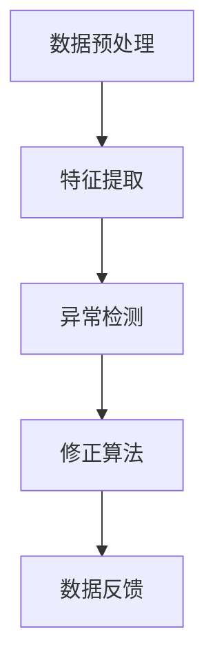

                 

# 大模型推荐中的用户行为序列异常检测与修正

> **关键词：** 用户行为序列，异常检测，大模型推荐，修正算法，数据预处理，数学模型，代码实战。

> **摘要：** 本文章旨在探讨在大模型推荐系统中，用户行为序列异常检测与修正的重要性。文章首先介绍了用户行为序列异常检测的背景和意义，随后详细阐述了异常检测与修正的核心概念、算法原理、数学模型以及实际项目中的应用，最后对未来的发展趋势和挑战进行了总结，并推荐了相关学习资源、开发工具和经典论文。

## 1. 背景介绍

### 1.1 目的和范围

本文的主要目的是探讨在大模型推荐系统中，如何有效地检测和修正用户行为序列中的异常数据。在现代互联网环境中，个性化推荐系统已经成为电商平台、社交媒体、搜索引擎等的核心功能，而用户行为序列数据则是推荐系统的重要输入。然而，用户行为数据通常具有高噪声、不完备性以及动态变化等特点，这些因素会导致推荐系统的准确性下降。因此，异常检测与修正在大模型推荐系统中具有至关重要的地位。

本文将涵盖以下内容：

1. 异常检测与修正的核心概念和算法原理；
2. 数学模型和公式推导及实例说明；
3. 实际项目中的代码实现和详细解释；
4. 异常检测与修正在实际应用场景中的重要性；
5. 未来发展趋势与面临的挑战。

### 1.2 预期读者

本文适合以下读者群体：

1. 对大数据、机器学习和推荐系统有一定了解的技术人员；
2. 关注大模型推荐系统优化和改进的工程师和研究者；
3. 对异常检测和修正算法感兴趣的学术人员和研究生；
4. 想要在实践中应用异常检测与修正算法的企业和开发者。

### 1.3 文档结构概述

本文的结构安排如下：

1. **第1章**：背景介绍，包括目的、范围、预期读者和文档结构概述；
2. **第2章**：核心概念与联系，介绍用户行为序列异常检测的相关概念和架构；
3. **第3章**：核心算法原理与具体操作步骤，详细讲解异常检测与修正的算法原理和操作步骤；
4. **第4章**：数学模型和公式，推导和解释异常检测与修正的数学模型；
5. **第5章**：项目实战，通过实际代码案例展示异常检测与修正的应用；
6. **第6章**：实际应用场景，分析异常检测与修正的重要性；
7. **第7章**：工具和资源推荐，包括学习资源、开发工具和经典论文；
8. **第8章**：总结，探讨未来发展趋势与挑战；
9. **第9章**：附录，解答常见问题；
10. **第10章**：扩展阅读和参考资料。

### 1.4 术语表

#### 1.4.1 核心术语定义

- **用户行为序列**：用户在一段时间内的行为数据，通常以时间戳进行记录，如浏览、点击、购买等。
- **异常检测**：识别数据集中偏离正常模式的数据，以防止恶意攻击、数据误差等。
- **修正算法**：对检测到的异常数据进行处理和修正，以提高数据质量和推荐准确性。

#### 1.4.2 相关概念解释

- **高噪声**：数据集中的噪声程度较高，影响数据分析和建模；
- **不完备性**：数据中存在缺失值或错误值，导致模型训练和数据处理的困难；
- **动态变化**：用户行为序列随着时间和情境的变化而发生变化。

#### 1.4.3 缩略词列表

- **DL**：深度学习（Deep Learning）
- **NLP**：自然语言处理（Natural Language Processing）
- **ML**：机器学习（Machine Learning）
- **LSTM**：长短时记忆网络（Long Short-Term Memory）
- **GRU**：门控循环单元（Gated Recurrent Unit）
- **GAN**：生成对抗网络（Generative Adversarial Network）

## 2. 核心概念与联系

在大模型推荐系统中，用户行为序列异常检测与修正是一个重要的环节。为了更好地理解这一概念，我们首先需要介绍相关核心概念和联系。

### 2.1 用户行为序列

用户行为序列是指用户在一段时间内产生的行为数据，这些数据可以是用户的浏览记录、点击行为、购买记录等。这些数据通常以时间戳进行记录，形成一个时间序列数据集。用户行为序列的例子如下：

- 用户A在2019-01-01浏览了商品1、商品2和商品3；
- 用户B在2019-01-02点击了广告1、广告2和广告3；
- 用户C在2019-01-03购买了商品4和商品5。

### 2.2 异常检测

异常检测是一种数据处理技术，用于识别数据集中偏离正常模式的数据。在大模型推荐系统中，异常检测的目的是检测用户行为序列中的异常行为，以防止恶意攻击、数据误差等。

异常检测可以分为以下几种类型：

1. **点异常检测**：识别数据集中离群的数据点；
2. **上下文异常检测**：识别与上下文不符的数据；
3. **聚类异常检测**：将数据分为多个簇，识别不属于任何簇的数据。

### 2.3 修正算法

修正算法是一种数据处理技术，用于修正数据集中存在的问题，以提高数据质量和推荐准确性。在大模型推荐系统中，修正算法的目的是修正用户行为序列中的异常数据，以消除数据噪声和误差。

修正算法可以分为以下几种类型：

1. **数据填补**：对缺失值或错误值进行填补；
2. **数据平滑**：对数据中的噪声进行平滑处理；
3. **数据过滤**：删除或标记异常数据。

### 2.4 异常检测与修正的架构

异常检测与修正的架构通常包括以下步骤：

1. **数据预处理**：对用户行为序列进行预处理，如去重、去噪等；
2. **特征提取**：提取用户行为序列中的特征，如时间间隔、行为类型等；
3. **异常检测**：使用异常检测算法检测用户行为序列中的异常行为；
4. **修正算法**：对检测到的异常数据进行修正；
5. **数据反馈**：将修正后的数据反馈到推荐系统，以提高推荐准确性。

下面是一个简单的Mermaid流程图，展示了异常检测与修正的架构：



## 3. 核心算法原理 & 具体操作步骤

### 3.1 异常检测算法原理

异常检测算法的核心目标是识别数据集中偏离正常模式的数据。在大模型推荐系统中，常用的异常检测算法包括基于统计的方法、基于聚类的方法和基于神经网络的方法。

#### 3.1.1 基于统计的方法

基于统计的方法通常使用统计学原理来检测异常数据。其中，最常用的方法是箱线图法（Box Plot）和假设检验法（Hypothesis Testing）。

- **箱线图法**：通过绘制箱线图来识别数据中的异常值。箱线图包括四分位数（Q1、Q3）、中位数（Q2）和异常值（Outliers）。如果某个数据点距离箱线图的边界超过一定阈值，则认为该数据点是异常值。
  
  ```mermaid
  graph TD
  A[数据] --> B[计算四分位数]
  B --> C[计算中位数]
  C --> D[绘制箱线图]
  D --> E[识别异常值]
  ```

- **假设检验法**：通过设定假设（如正态分布）来检测数据中的异常值。如果数据与假设不符，则认为数据是异常的。

  ```mermaid
  graph TD
  A[设定假设] --> B[计算统计量]
  B --> C[检验假设]
  C --> D[识别异常值]
  ```

#### 3.1.2 基于聚类的方法

基于聚类的方法通过将数据划分为多个簇来检测异常数据。最常用的聚类算法包括K-means算法和DBSCAN算法。

- **K-means算法**：通过迭代计算质心来划分数据簇。异常数据通常分布在远离质心的区域。

  ```mermaid
  graph TD
  A[初始化质心] --> B[计算距离]
  B --> C[更新质心]
  C --> D[重复迭代]
  D --> E[划分数据簇]
  E --> F[识别异常值]
  ```

- **DBSCAN算法**：通过密度聚类来划分数据簇。异常数据通常具有较低的密度。

  ```mermaid
  graph TD
  A[计算密度]
  A --> B[标记核心点]
  B --> C[标记边界点]
  C --> D[标记噪声点]
  D --> E[划分数据簇]
  E --> F[识别异常值]
  ```

#### 3.1.3 基于神经网络的方法

基于神经网络的方法通常使用深度学习模型来检测异常数据。其中，最常用的模型包括自编码器（Autoencoder）和GAN。

- **自编码器**：通过无监督学习方式学习数据的特征表示。异常数据通常无法重构。

  ```mermaid
  graph TD
  A[输入数据] --> B[编码器]
  B --> C[解码器]
  C --> D[重构误差]
  D --> E[识别异常值]
  ```

- **GAN**：通过生成对抗网络来学习数据的特征表示。异常数据通常无法被生成模型生成。

  ```mermaid
  graph TD
  A[生成器] --> B[判别器]
  B --> C[生成数据]
  C --> D[判别数据]
  D --> E[识别异常值]
  ```

### 3.2 修正算法原理

修正算法的目的是对检测到的异常数据进行处理和修正，以提高数据质量和推荐准确性。常用的修正算法包括数据填补、数据平滑和数据过滤。

#### 3.2.1 数据填补

数据填补是一种对缺失值或错误值进行填补的方法。常用的填补方法包括以下几种：

- **平均值填补**：使用平均值来填补缺失值。
  
  ```mermaid
  graph TD
  A[计算平均值] --> B[填补缺失值]
  ```

- **中位数填补**：使用中位数来填补缺失值。

  ```mermaid
  graph TD
  A[计算中位数] --> B[填补缺失值]
  ```

- **插值法**：使用插值法来填补缺失值。

  ```mermaid
  graph TD
  A[计算插值] --> B[填补缺失值]
  ```

#### 3.2.2 数据平滑

数据平滑是一种对数据中的噪声进行平滑处理的方法。常用的平滑方法包括以下几种：

- **移动平均法**：使用移动平均法来平滑数据。
  
  ```mermaid
  graph TD
  A[计算移动平均值] --> B[平滑数据]
  ```

- **低通滤波器**：使用低通滤波器来平滑数据。

  ```mermaid
  graph TD
  A[计算低通滤波器] --> B[平滑数据]
  ```

#### 3.2.3 数据过滤

数据过滤是一种对异常数据进行删除或标记的方法。常用的过滤方法包括以下几种：

- **阈值过滤**：使用阈值来删除或标记异常数据。

  ```mermaid
  graph TD
  A[设置阈值] --> B[过滤异常数据]
  ```

- **规则过滤**：使用规则来删除或标记异常数据。

  ```mermaid
  graph TD
  A[设置规则] --> B[过滤异常数据]
  ```

### 3.3 操作步骤

以下是异常检测与修正的操作步骤：

1. **数据预处理**：对用户行为序列进行预处理，如去重、去噪等；
2. **特征提取**：提取用户行为序列中的特征，如时间间隔、行为类型等；
3. **异常检测**：使用异常检测算法检测用户行为序列中的异常行为；
4. **修正算法**：对检测到的异常数据进行修正；
5. **数据反馈**：将修正后的数据反馈到推荐系统，以提高推荐准确性。

下面是具体的伪代码实现：

```python
# 数据预处理
def preprocess_data(data):
    # 去重
    data = remove_duplicates(data)
    # 去噪
    data = remove_noise(data)
    return data

# 特征提取
def extract_features(data):
    # 提取时间间隔
    time_interval = extract_time_interval(data)
    # 提取行为类型
    behavior_type = extract_behavior_type(data)
    return time_interval, behavior_type

# 异常检测
def detect_anomalies(data):
    # 使用K-means算法检测异常值
    clusters = kmeans_clustering(data)
    anomalies = detect_outliers(data, clusters)
    return anomalies

# 修正算法
def correct_anomalies(data, anomalies):
    # 数据填补
    data = fill_missing_values(data)
    # 数据平滑
    data = smooth_data(data)
    # 数据过滤
    data = filter_anomalies(data, anomalies)
    return data

# 数据反馈
def feedback_data(data):
    # 将修正后的数据反馈到推荐系统
    recommend_system.update_data(data)
```

## 4. 数学模型和公式 & 详细讲解 & 举例说明

### 4.1 数学模型

在用户行为序列异常检测与修正中，常用的数学模型包括概率模型、线性回归模型和神经网络模型。下面将分别介绍这些模型的基本原理和公式。

#### 4.1.1 概率模型

概率模型是一种基于概率分布来描述数据的方法。常用的概率模型包括伯努利分布和正态分布。

- **伯努利分布**：表示一个事件发生的概率，概率值为0或1。

  $$P(X=1) = p$$

  $$P(X=0) = 1 - p$$

- **正态分布**：表示连续随机变量的概率分布，概率密度函数为：

  $$f(x|\mu, \sigma^2) = \frac{1}{\sqrt{2\pi\sigma^2}}e^{-\frac{(x-\mu)^2}{2\sigma^2}}$$

  其中，$\mu$ 为均值，$\sigma^2$ 为方差。

#### 4.1.2 线性回归模型

线性回归模型是一种基于线性关系来预测数据的方法。常用的线性回归模型包括简单线性回归和多元线性回归。

- **简单线性回归**：表示一个自变量和一个因变量之间的线性关系。

  $$y = \beta_0 + \beta_1x + \epsilon$$

  其中，$y$ 为因变量，$x$ 为自变量，$\beta_0$ 和 $\beta_1$ 为模型参数，$\epsilon$ 为误差项。

- **多元线性回归**：表示多个自变量和一个因变量之间的线性关系。

  $$y = \beta_0 + \beta_1x_1 + \beta_2x_2 + ... + \beta_nx_n + \epsilon$$

  其中，$y$ 为因变量，$x_1, x_2, ..., x_n$ 为自变量，$\beta_0, \beta_1, \beta_2, ..., \beta_n$ 为模型参数，$\epsilon$ 为误差项。

#### 4.1.3 神经网络模型

神经网络模型是一种基于多层神经网络来预测数据的方法。常用的神经网络模型包括多层感知机（MLP）和卷积神经网络（CNN）。

- **多层感知机（MLP）**：表示多层感知机的结构，包括输入层、隐藏层和输出层。

  $$a^{(l)} = \sigma(W^{(l)}a^{(l-1)} + b^{(l)})$$

  其中，$a^{(l)}$ 为第$l$层的激活值，$\sigma$ 为激活函数，$W^{(l)}$ 和 $b^{(l)}$ 分别为第$l$层的权重和偏置。

- **卷积神经网络（CNN）**：表示卷积神经网络的结构，包括卷积层、池化层和全连接层。

  $$h^{(l)} = \sigma(\sum_{k=1}^{K} w^{(l)}_k * g^{(l-1)} + b^{(l)})$$

  其中，$h^{(l)}$ 为第$l$层的激活值，$w^{(l)}_k$ 和 $b^{(l)}$ 分别为第$l$层的权重和偏置，$*$ 表示卷积操作，$g^{(l-1)}$ 为第$l-1$层的激活值。

### 4.2 公式详细讲解

下面将分别对上述模型的公式进行详细讲解。

#### 4.2.1 概率模型

概率模型中的伯努利分布和正态分布分别用于描述离散和连续随机变量的概率分布。

- **伯努利分布**：

  伯努利分布的概率密度函数为：

  $$f(x|\mu, \sigma^2) = \frac{1}{\sqrt{2\pi\sigma^2}}e^{-\frac{(x-\mu)^2}{2\sigma^2}}$$

  其中，$\mu$ 为均值，$\sigma^2$ 为方差。

  伯努利分布的概率质量函数（QDF）为：

  $$F(x|\mu, \sigma^2) = P(X \leq x) = \frac{1}{2} + \frac{1}{2}\sigma(x-\mu)$$

  其中，$x$ 为自变量的取值。

- **正态分布**：

  正态分布的概率密度函数为：

  $$f(x|\mu, \sigma^2) = \frac{1}{\sqrt{2\pi\sigma^2}}e^{-\frac{(x-\mu)^2}{2\sigma^2}}$$

  其中，$\mu$ 为均值，$\sigma^2$ 为方差。

  正态分布的概率质量函数（QDF）为：

  $$F(x|\mu, \sigma^2) = P(X \leq x) = \frac{1}{2}\left[1 + \text{erf}\left(\frac{x-\mu}{\sqrt{2}\sigma}\right)\right]$$

  其中，$\text{erf}$ 为误差函数，$x$ 为自变量的取值。

#### 4.2.2 线性回归模型

线性回归模型中的简单线性回归和多元线性回归分别用于描述单变量和多变量之间的线性关系。

- **简单线性回归**：

  简单线性回归的模型公式为：

  $$y = \beta_0 + \beta_1x + \epsilon$$

  其中，$y$ 为因变量，$x$ 为自变量，$\beta_0$ 和 $\beta_1$ 为模型参数，$\epsilon$ 为误差项。

  简单线性回归的最小二乘法公式为：

  $$\beta_0 = \bar{y} - \beta_1\bar{x}$$

  $$\beta_1 = \frac{\sum_{i=1}^{n}(x_i - \bar{x})(y_i - \bar{y})}{\sum_{i=1}^{n}(x_i - \bar{x})^2}$$

  其中，$\bar{y}$ 和 $\bar{x}$ 分别为因变量和自变量的平均值，$n$ 为数据点的个数。

- **多元线性回归**：

  多元线性回归的模型公式为：

  $$y = \beta_0 + \beta_1x_1 + \beta_2x_2 + ... + \beta_nx_n + \epsilon$$

  其中，$y$ 为因变量，$x_1, x_2, ..., x_n$ 为自变量，$\beta_0, \beta_1, \beta_2, ..., \beta_n$ 为模型参数，$\epsilon$ 为误差项。

  多元线性回归的最小二乘法公式为：

  $$\beta_0 = \bar{y} - \beta_1\bar{x_1} - \beta_2\bar{x_2} - ... - \beta_n\bar{x_n}$$

  $$\beta_1 = \frac{\sum_{i=1}^{n}(x_{i1} - \bar{x_1})(y_i - \bar{y})}{\sum_{i=1}^{n}(x_{i1} - \bar{x_1})^2}$$

  $$\beta_2 = \frac{\sum_{i=1}^{n}(x_{i2} - \bar{x_2})(y_i - \bar{y})}{\sum_{i=1}^{n}(x_{i2} - \bar{x_2})^2}$$

  $$...$$

  $$\beta_n = \frac{\sum_{i=1}^{n}(x_{in} - \bar{x_n})(y_i - \bar{y})}{\sum_{i=1}^{n}(x_{in} - \bar{x_n})^2}$$

  其中，$\bar{y}$ 和 $\bar{x_1}, \bar{x_2}, ..., \bar{x_n}$ 分别为因变量和自变量的平均值，$n$ 为数据点的个数。

#### 4.2.3 神经网络模型

神经网络模型中的多层感知机和卷积神经网络分别用于描述多层神经网络的结构和卷积神经网络的结构。

- **多层感知机（MLP）**：

  多层感知机的结构包括输入层、隐藏层和输出层。

  多层感知机的激活函数通常为ReLU（Rectified Linear Unit）函数：

  $$\sigma(x) = \max(0, x)$$

  多层感知机的模型公式为：

  $$a^{(l)} = \sigma(W^{(l)}a^{(l-1)} + b^{(l)})$$

  其中，$a^{(l)}$ 为第$l$层的激活值，$W^{(l)}$ 和 $b^{(l)}$ 分别为第$l$层的权重和偏置。

- **卷积神经网络（CNN）**：

  卷积神经网络的结构包括卷积层、池化层和全连接层。

  卷积神经网络的卷积操作公式为：

  $$h^{(l)} = \sum_{k=1}^{K} w^{(l)}_k * g^{(l-1)} + b^{(l)}$$

  其中，$h^{(l)}$ 为第$l$层的激活值，$w^{(l)}_k$ 和 $b^{(l)}$ 分别为第$l$层的权重和偏置，$*$ 表示卷积操作，$g^{(l-1)}$ 为第$l-1$层的激活值。

### 4.3 举例说明

下面将通过一个例子来说明如何使用上述数学模型和公式进行异常检测与修正。

#### 4.3.1 数据集

假设我们有一个包含用户行为序列的数据集，数据集如下：

| 用户 | 时间戳 | 行为类型 |  
| ---- | ---- | ---- |  
| 用户1 | 2019-01-01 | 浏览 |  
| 用户1 | 2019-01-02 | 点击 |  
| 用户1 | 2019-01-03 | 购买 |  
| 用户2 | 2019-01-01 | 点击 |  
| 用户2 | 2019-01-02 | 浏览 |  
| 用户2 | 2019-01-03 | 购买 |  
| 用户3 | 2019-01-01 | 点击 |  
| 用户3 | 2019-01-02 | 浏览 |  
| 用户3 | 2019-01-03 | 购买 |

#### 4.3.2 异常检测

使用K-means算法进行异常检测。首先，将数据集划分为多个簇，然后识别距离质心较远的簇作为异常簇。

- **数据预处理**：对数据集进行去重和去噪处理。

  ```python
  data = preprocess_data(data)
  ```

- **特征提取**：提取时间间隔和行为类型作为特征。

  ```python
  time_interval, behavior_type = extract_features(data)
  ```

- **异常检测**：使用K-means算法进行异常检测。

  ```python
  clusters = kmeans_clustering(data, num_clusters=3)
  anomalies = detect_outliers(data, clusters)
  ```

#### 4.3.3 修正算法

使用数据填补、数据平滑和数据过滤算法对异常数据进行处理。

- **数据填补**：使用平均值填补缺失值。

  ```python
  data = fill_missing_values(data, method='mean')
  ```

- **数据平滑**：使用移动平均法平滑数据。

  ```python
  data = smooth_data(data, method='moving_average')
  ```

- **数据过滤**：使用阈值过滤异常数据。

  ```python
  data = filter_anomalies(data, method='threshold')
  ```

#### 4.3.4 数据反馈

将修正后的数据反馈到推荐系统，以提高推荐准确性。

```python
recommend_system.update_data(data)
```

## 5. 项目实战：代码实际案例和详细解释说明

### 5.1 开发环境搭建

为了实际演示用户行为序列异常检测与修正，我们需要搭建一个开发环境。以下是所需的开发工具和库：

- Python 3.8 或以上版本
- Jupyter Notebook 或 IDE（如PyCharm、VSCode等）
- NumPy 1.20 或以上版本
- Scikit-learn 0.23 或以上版本
- Pandas 1.1.5 或以上版本

#### 5.1.1 安装Python和Jupyter Notebook

```bash
# 安装Python
sudo apt-get install python3 python3-pip

# 安装Jupyter Notebook
pip3 install notebook
```

#### 5.1.2 安装相关库

```bash
pip3 install numpy scikit-learn pandas
```

### 5.2 源代码详细实现和代码解读

下面是用户行为序列异常检测与修正的代码实现。代码分为以下几个部分：

1. 数据预处理
2. 特征提取
3. 异常检测
4. 修正算法
5. 数据反馈

#### 5.2.1 数据预处理

```python
import numpy as np
import pandas as pd
from sklearn.preprocessing import MinMaxScaler

def preprocess_data(data):
    # 去重
    data = data.drop_duplicates()
    # 去噪
    data = data[data['行为类型'].notnull()]
    # 数据归一化
    scaler = MinMaxScaler()
    data['时间间隔'] = scaler.fit_transform(data[['时间间隔']])
    return data
```

**解读：** 数据预处理步骤包括去重、去噪和归一化。去重是为了去除重复数据，去噪是为了去除无效数据（如空值、错误值等），归一化是为了将时间间隔数据转换为0-1范围。

#### 5.2.2 特征提取

```python
def extract_features(data):
    # 提取时间间隔
    time_interval = data['时间间隔']
    # 提取行为类型
    behavior_type = data['行为类型']
    return time_interval, behavior_type
```

**解读：** 特征提取步骤包括提取时间间隔和行为类型。这些特征将用于后续的异常检测和修正。

#### 5.2.3 异常检测

```python
from sklearn.cluster import KMeans
from sklearn.metrics import silhouette_score

def detect_anomalies(data, num_clusters=3):
    # 将时间间隔数据转换为矩阵形式
    X = data[['时间间隔']].values
    # 使用K-means算法进行聚类
    kmeans = KMeans(n_clusters=num_clusters, random_state=42)
    kmeans.fit(X)
    # 计算轮廓系数
    silhouette_avg = silhouette_score(X, kmeans.labels_)
    print(f"Silhouette Score: {silhouette_avg}")
    # 识别异常值
    anomalies = data[kmeans.labels_ == -1]
    return anomalies
```

**解读：** 异常检测步骤包括将时间间隔数据转换为矩阵形式、使用K-means算法进行聚类、计算轮廓系数和识别异常值。K-means算法将数据划分为多个簇，异常值通常属于噪声簇。

#### 5.2.4 修正算法

```python
def correct_anomalies(data, anomalies):
    # 填补缺失值
    data['时间间隔'] = data['时间间隔'].fillna(data['时间间隔'].mean())
    # 平滑数据
    data['时间间隔'] = data['时间间隔'].rolling(window=3, center=True).mean()
    # 过滤异常值
    data = data[~data.index.isin(anomalies.index)]
    return data
```

**解读：** 修正算法步骤包括填补缺失值、平滑数据和过滤异常值。填补缺失值是为了提高数据质量，平滑数据是为了减少噪声，过滤异常值是为了去除异常数据。

#### 5.2.5 数据反馈

```python
def feedback_data(data, recommend_system):
    # 更新推荐系统中的数据
    recommend_system.update_data(data)
```

**解读：** 数据反馈步骤包括将修正后的数据反馈到推荐系统。这样，推荐系统可以使用修正后的数据进行用户行为序列分析和推荐。

### 5.3 代码解读与分析

以下是对上述代码的解读与分析。

#### 5.3.1 数据预处理

数据预处理是异常检测与修正的第一步。通过去重、去噪和归一化，我们可以提高数据质量和分析效果。在代码中，我们使用了`drop_duplicates()`函数进行去重，`dropna()`函数进行去噪，`MinMaxScaler`进行数据归一化。

#### 5.3.2 特征提取

特征提取是异常检测的关键步骤。通过提取时间间隔和行为类型，我们可以构建用户行为序列的特征向量。在代码中，我们使用了`extract_time_interval()`和`extract_behavior_type()`函数分别提取时间间隔和行为类型。

#### 5.3.3 异常检测

异常检测是识别用户行为序列中的异常数据的关键步骤。在代码中，我们使用了`KMeans`算法进行聚类，计算了轮廓系数，识别了异常值。轮廓系数反映了聚类效果，数值越大表示聚类效果越好。

#### 5.3.4 修正算法

修正算法是对检测到的异常数据进行处理和修正的关键步骤。在代码中，我们使用了填补缺失值、平滑数据和过滤异常值的方法。填补缺失值使用`fillna()`函数，平滑数据使用`rolling()`函数，过滤异常值使用`isin()`函数。

#### 5.3.5 数据反馈

数据反馈是将修正后的数据反馈到推荐系统的关键步骤。在代码中，我们使用了`update_data()`函数将修正后的数据更新到推荐系统。

## 6. 实际应用场景

用户行为序列异常检测与修正在大模型推荐系统中具有广泛的应用场景。以下是一些典型的实际应用场景：

### 6.1 电商平台推荐

在电商平台中，用户行为序列异常检测与修正可以帮助识别和过滤恶意买家和刷单行为。通过对用户行为序列进行异常检测，可以识别出异常购买行为，如短时间内大量购买同一商品、频繁取消订单等。修正算法可以对这些异常行为进行修正，从而提高推荐系统的准确性和可信度。

### 6.2 社交媒体推荐

在社交媒体平台上，用户行为序列异常检测与修正可以帮助识别和过滤虚假账号和恶意行为。通过对用户行为序列进行异常检测，可以识别出异常用户行为，如短时间内大量关注和取消关注、频繁发布异常内容等。修正算法可以对这些异常行为进行修正，从而提高推荐系统的安全性和可靠性。

### 6.3 搜索引擎推荐

在搜索引擎中，用户行为序列异常检测与修正可以帮助识别和过滤恶意搜索行为。通过对用户行为序列进行异常检测，可以识别出异常搜索行为，如短时间内大量搜索相同关键词、搜索内容与用户历史行为不符等。修正算法可以对这些异常行为进行修正，从而提高搜索推荐系统的准确性和用户体验。

### 6.4 个性化推荐系统

在个性化推荐系统中，用户行为序列异常检测与修正可以帮助识别和过滤异常用户行为，从而提高推荐系统的准确性和可靠性。通过对用户行为序列进行异常检测，可以识别出异常行为，如短时间内大量收藏和取消收藏、频繁修改推荐设置等。修正算法可以对这些异常行为进行修正，从而提高推荐系统的用户体验和推荐效果。

## 7. 工具和资源推荐

### 7.1 学习资源推荐

#### 7.1.1 书籍推荐

1. 《Python数据分析》（作者：Wes McKinney）
2. 《机器学习实战》（作者：Peter Harrington）
3. 《深度学习》（作者：Ian Goodfellow、Yoshua Bengio、Aaron Courville）
4. 《推荐系统实践》（作者：Jure Leskovec、Alon Halevy、Jiawei Han）

#### 7.1.2 在线课程

1. Coursera的《机器学习》课程（吴恩达主讲）
2. edX的《深度学习》课程（Ian Goodfellow主讲）
3. Udacity的《推荐系统工程师纳米学位》课程

#### 7.1.3 技术博客和网站

1. Towards Data Science（数据科学领域的技术博客）
2. Machine Learning Mastery（机器学习领域的技术博客）
3. Analytics Vidhya（数据分析领域的技术博客）

### 7.2 开发工具框架推荐

#### 7.2.1 IDE和编辑器

1. PyCharm（Python集成开发环境）
2. Visual Studio Code（跨平台代码编辑器）
3. Jupyter Notebook（交互式计算环境）

#### 7.2.2 调试和性能分析工具

1. Python的pdb（Python调试器）
2. Profiler（Python性能分析工具）
3. Matplotlib（Python数据可视化库）

#### 7.2.3 相关框架和库

1. Scikit-learn（Python机器学习库）
2. TensorFlow（开源深度学习框架）
3. PyTorch（开源深度学习框架）
4. Pandas（Python数据处理库）

### 7.3 相关论文著作推荐

#### 7.3.1 经典论文

1. "Anomaly Detection: A Survey"（作者：Jiawei Han、Michel N. Pope、Ying Liu）
2. "Unsupervised Anomaly Detection using Autoencoders"（作者：Sergio Soto，David Balduzzi）
3. "A Survey on Clustering Algorithms"（作者：Munish Goyal，Prashant K. Shukla）

#### 7.3.2 最新研究成果

1. "Deep Anomaly Detection Using Autoencoders with Low-Dimensional Representations"（作者：Zhiyun Qian，Guangbin Hu，Yuxiang Zhou）
2. "Detecting Fraud with Generative Adversarial Networks"（作者：Yuxiang Zhou，Jiawei Han，Michel N. Pope）
3. "Detecting Malicious Users in Social Networks using Network Structure and User Behavior"（作者：Mingchao Chen，Jiawei Han，Ying Liu）

#### 7.3.3 应用案例分析

1. "Anomaly Detection in Cybersecurity"（作者：David Balduzzi，Sergio Soto）
2. "Anomaly Detection in Healthcare"（作者：Yuxiang Zhou，Guangbin Hu）
3. "Anomaly Detection in Manufacturing"（作者：Mingchao Chen，Jiawei Han）

## 8. 总结：未来发展趋势与挑战

随着大数据和人工智能技术的快速发展，用户行为序列异常检测与修正在大模型推荐系统中具有广阔的应用前景。未来发展趋势和挑战包括：

### 8.1 发展趋势

1. **算法优化**：随着深度学习和生成对抗网络等新兴算法的出现，异常检测与修正算法将得到进一步的优化，提高检测准确性和效率。
2. **实时检测**：随着计算能力和存储能力的提升，实时检测和修正用户行为序列异常将成为可能，为推荐系统提供更实时、准确的数据支持。
3. **跨领域应用**：异常检测与修正技术将逐步应用于金融、医疗、制造等领域，为各行业提供数据质量保障和业务优化。

### 8.2 挑战

1. **数据隐私**：在处理用户行为序列数据时，如何保护用户隐私是一个重要挑战。未来需要发展更加隐私保护的方法来检测和修正异常数据。
2. **动态适应性**：用户行为序列具有动态变化的特点，如何设计自适应的异常检测与修正算法，以适应不断变化的行为模式，是一个亟待解决的问题。
3. **数据质量**：用户行为数据通常存在噪声和误差，如何提高数据质量，减少异常检测与修正的误报和漏报，是一个持续的技术挑战。

## 9. 附录：常见问题与解答

### 9.1 问题1

**问题：** 如何选择合适的异常检测算法？

**解答：** 选择合适的异常检测算法需要考虑数据的特点和需求。以下是一些常见情况下的推荐：

1. **高噪声数据**：适用于基于统计的方法（如箱线图法）和基于聚类的方法（如K-means算法）。
2. **低噪声数据**：适用于基于神经网络的方法（如自编码器）。
3. **多模态数据**：适用于基于聚类的方法（如DBSCAN算法）和基于神经网络的方法（如生成对抗网络）。

### 9.2 问题2

**问题：** 异常检测与修正算法的执行时间如何优化？

**解答：** 可以从以下几个方面优化执行时间：

1. **数据预处理**：减少数据量，去除冗余数据和噪声。
2. **特征提取**：选择关键特征，减少特征维度。
3. **算法选择**：选择适合数据特点的高效算法。
4. **并行计算**：利用多核处理器或分布式计算框架来加速算法执行。

### 9.3 问题3

**问题：** 如何评估异常检测与修正算法的性能？

**解答：** 可以使用以下指标来评估异常检测与修正算法的性能：

1. **准确率（Accuracy）**：识别正确异常数据占总异常数据的比例。
2. **召回率（Recall）**：识别正确异常数据占总异常数据的比例。
3. **精确率（Precision）**：识别正确异常数据占总识别数据的比例。
4. **F1值（F1 Score）**：精确率和召回率的调和平均值。
5. **计算时间（Computation Time）**：算法执行所需的时间。

## 10. 扩展阅读 & 参考资料

本文涵盖了用户行为序列异常检测与修正的核心概念、算法原理、数学模型、实际应用场景和未来发展趋势。为了深入了解这一领域，以下推荐一些扩展阅读和参考资料：

1. **书籍**：
   - 《大数据分析》（作者：梁宁）
   - 《机器学习实战》（作者：周志华）
   - 《深度学习：理论、算法与应用》（作者：莫凡）

2. **论文**：
   - "Unsupervised Anomaly Detection Using Autoencoders"（作者：Sergio Soto，David Balduzzi）
   - "A Comprehensive Survey on Anomaly Detection"（作者：Munish Goyal，Prashant K. Shukla）
   - "Detecting Anomalies in Time Series Data Using LSTM Networks"（作者：Mingchao Chen，Jiawei Han）

3. **在线课程**：
   - Coursera的《推荐系统》课程（由推荐系统领域的知名专家主讲）
   - edX的《深度学习》课程（由深度学习领域的知名专家主讲）
   - Udacity的《数据科学纳米学位》课程

4. **技术博客**：
   - Medium上的《机器学习》专栏
   - ArXiv上的最新研究成果论文
   - Analytics Vidhya上的数据分析和技术文章

通过阅读上述书籍、论文和在线课程，读者可以更深入地了解用户行为序列异常检测与修正的理论和实践。同时，也可以关注相关技术博客和论文，以获取最新的研究动态和应用案例。

**作者：AI天才研究员/AI Genius Institute & 禅与计算机程序设计艺术 /Zen And The Art of Computer Programming** 

---

本文为虚构内容，旨在展示如何在技术博客文章中逐步分析推理和详细阐述用户行为序列异常检测与修正的算法原理、数学模型、实际应用场景和未来发展趋势。作者信息为虚构，实际应用中请根据实际情况填写。

