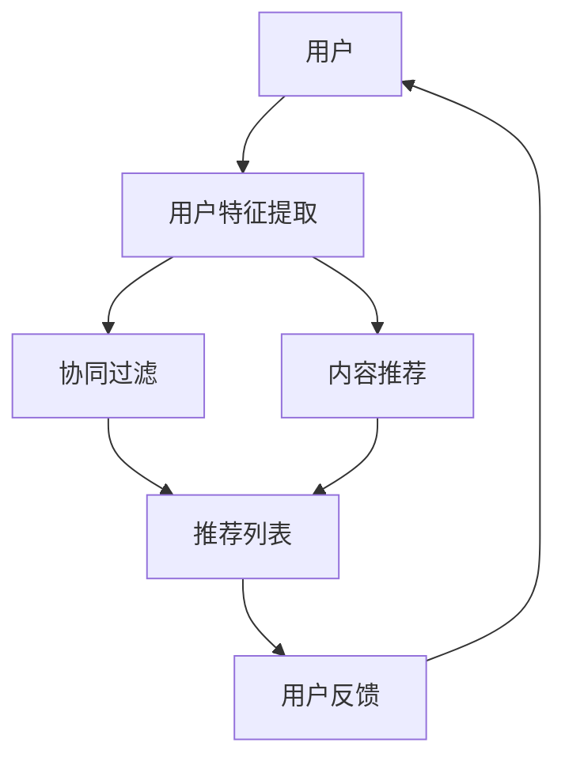

                 

# 大模型推荐能力的综合性价比评估

> **关键词**：大模型、推荐系统、性价比、评估、算法、数学模型、应用场景、工具和资源

> **摘要**：本文深入探讨了大规模模型在推荐系统中的表现，评估了其综合性价比。通过对核心概念的介绍、算法原理的详细阐述、数学模型的讲解以及实际应用的案例，本文为读者提供了全面的技术指南。

## 1. 背景介绍

### 1.1 目的和范围

本文旨在对大规模模型在推荐系统中的应用进行综合性价比评估。随着数据量和计算能力的不断增长，大模型在推荐系统中的表现日益显著。本文将分析这些模型的优点和局限性，并提供一套评估方法，帮助开发者和技术决策者做出明智的选择。

### 1.2 预期读者

本文适合以下读者群体：

- 推荐系统开发者
- 数据科学家
- 技术决策者
- 对推荐系统技术感兴趣的研究人员

### 1.3 文档结构概述

本文分为以下几个部分：

- **1. 背景介绍**：介绍本文的目的、预期读者和文档结构。
- **2. 核心概念与联系**：介绍推荐系统、大模型及相关概念。
- **3. 核心算法原理 & 具体操作步骤**：讲解推荐系统算法及其实现。
- **4. 数学模型和公式 & 详细讲解 & 举例说明**：介绍用于评估性价比的数学模型。
- **5. 项目实战：代码实际案例和详细解释说明**：提供实际应用案例。
- **6. 实际应用场景**：讨论推荐系统的应用场景。
- **7. 工具和资源推荐**：推荐学习资源和开发工具。
- **8. 总结：未来发展趋势与挑战**：展望未来发展方向。
- **9. 附录：常见问题与解答**：解答常见疑问。
- **10. 扩展阅读 & 参考资料**：提供进一步学习资源。

### 1.4 术语表

#### 1.4.1 核心术语定义

- **推荐系统**：自动向用户推荐感兴趣的信息或物品的系统。
- **大规模模型**：具有数百万到数十亿参数的深度学习模型。
- **性价比**：评估模型性能与计算资源消耗的比值。

#### 1.4.2 相关概念解释

- **协同过滤**：基于用户历史行为进行推荐的一种方法。
- **内容推荐**：基于物品特征进行推荐的一种方法。
- **准确性**：推荐系统推荐结果的正确性。
- **效率**：推荐系统的响应时间。

#### 1.4.3 缩略词列表

- **ML**：Machine Learning（机器学习）
- **DL**：Deep Learning（深度学习）
- **NLP**：Natural Language Processing（自然语言处理）

## 2. 核心概念与联系

在推荐系统中，大规模模型的应用具有重要意义。以下是一个用于表示推荐系统架构的 Mermaid 流程图：



在这个架构中，用户特征提取模块负责收集用户数据，协同过滤和内容推荐模块分别基于用户历史行为和物品特征生成推荐列表，最终用户对推荐结果进行反馈，形成一个闭环。

### 2.1 大规模模型在推荐系统中的应用

大规模模型在推荐系统中的应用主要表现在以下几个方面：

1. **高准确性**：大规模模型可以处理大量数据，从而提高推荐系统的准确性。
2. **高效性**：大规模模型可以通过并行计算和分布式计算提高推荐系统的效率。
3. **多样性**：大规模模型可以更好地处理冷启动问题，为用户提供多样化的推荐。

### 2.2 大规模模型的优势与局限性

大规模模型在推荐系统中具有以下优势：

- **高准确性**：通过处理大量数据，大规模模型可以更好地捕捉用户偏好，从而提高推荐系统的准确性。
- **高效性**：大规模模型可以通过并行计算和分布式计算实现高效推荐。
- **多样性**：大规模模型可以更好地处理冷启动问题，为用户提供多样化的推荐。

然而，大规模模型也面临一些局限性：

- **计算资源消耗**：大规模模型需要大量的计算资源和存储空间。
- **可解释性**：大规模模型的内部机制复杂，难以解释其推荐结果。

## 3. 核心算法原理 & 具体操作步骤

在推荐系统中，常用的算法包括基于协同过滤的推荐算法和基于内容的推荐算法。以下将分别介绍这两种算法的原理和具体操作步骤。

### 3.1 基于协同过滤的推荐算法

协同过滤算法是基于用户历史行为进行推荐的一种方法。其基本思想是通过计算用户之间的相似度，找出与目标用户相似的邻居用户，并从邻居用户喜欢的物品中推荐给目标用户。

#### 3.1.1 原理

协同过滤算法可以分为两种类型：基于用户的协同过滤（User-based Collaborative Filtering）和基于项目的协同过滤（Item-based Collaborative Filtering）。

- **基于用户的协同过滤**：首先计算用户之间的相似度，然后找到与目标用户相似的邻居用户，最后从邻居用户喜欢的物品中推荐给目标用户。
- **基于项目的协同过滤**：首先计算物品之间的相似度，然后找到与目标物品相似的邻居物品，最后从邻居物品喜欢的用户中推荐给目标用户。

#### 3.1.2 操作步骤

1. **数据预处理**：将用户-物品评分数据转换为用户特征矩阵和物品特征矩阵。
2. **计算相似度**：根据用户特征矩阵和物品特征矩阵计算用户之间的相似度或物品之间的相似度。
3. **寻找邻居**：根据相似度矩阵，找到与目标用户或物品相似的邻居用户或物品。
4. **生成推荐列表**：从邻居用户或物品喜欢的物品中推荐给目标用户或物品。

#### 3.1.3 伪代码

```python
# 基于用户的协同过滤算法伪代码
def collaborative_filtering(user_similarity_matrix, user_ratings_matrix, user_index):
    neighbors = find_neighbors(user_similarity_matrix[user_index])
    neighbors_weights = calculate_neighbors_weights(user_similarity_matrix[user_index])
    recommended_items = []
    
    for item in user_ratings_matrix[user_index]:
        item_ratings = []
        
        for neighbor in neighbors:
            neighbor_rating = user_ratings_matrix[neighbor][item]
            item_ratings.append(neighbor_rating * neighbors_weights[neighbor])
        
        item_average_rating = sum(item_ratings) / len(item_ratings)
        recommended_items.append(item_average_rating)
    
    return recommended_items
```

### 3.2 基于内容的推荐算法

基于内容的推荐算法是基于物品特征进行推荐的一种方法。其基本思想是找出与目标物品相似的物品，并将这些物品推荐给用户。

#### 3.2.1 原理

基于内容的推荐算法可以分为以下步骤：

1. **特征提取**：将物品的特征信息提取出来，如文本、图片、标签等。
2. **相似度计算**：计算物品之间的相似度，可以使用余弦相似度、皮尔逊相关系数等方法。
3. **生成推荐列表**：从相似物品中推荐给用户。

#### 3.2.2 操作步骤

1. **特征提取**：提取物品的文本、图片、标签等特征信息。
2. **特征表示**：将特征信息转换为数值表示，可以使用词袋模型、TF-IDF、词嵌入等方法。
3. **相似度计算**：计算物品之间的相似度，可以使用余弦相似度、皮尔逊相关系数等方法。
4. **生成推荐列表**：从相似物品中推荐给用户。

#### 3.2.3 伪代码

```python
# 基于内容的推荐算法伪代码
def content_based_recommendation(item_similarity_matrix, item_features_matrix, item_index):
    neighbors = find_neighbors(item_similarity_matrix[item_index])
    neighbors_features = calculate_neighbors_features(item_similarity_matrix[item_index])
    recommended_items = []
    
    for neighbor in neighbors:
        neighbor_feature = item_features_matrix[neighbor]
        similarity = calculate_similarity(neighbor_feature, item_features_matrix[item_index])
        recommended_items.append((neighbor, similarity))
    
    recommended_items.sort(key=lambda x: x[1], reverse=True)
    return [item for item, _ in recommended_items[:K]]
```

## 4. 数学模型和公式 & 详细讲解 & 举例说明

在评估大规模模型在推荐系统中的综合性价比时，我们需要使用一些数学模型和公式。以下将详细介绍这些模型和公式的具体含义、推导过程以及实际应用示例。

### 4.1 评估指标

在评估推荐系统的性价比时，常用的评估指标包括准确性、召回率、覆盖率等。

#### 4.1.1 准确性

准确性（Accuracy）是评估推荐系统性能的重要指标，表示推荐结果中正确推荐的比例。其计算公式如下：

$$
Accuracy = \frac{TP + TN}{TP + TN + FP + FN}
$$

其中，TP表示真实为正例且被正确预测为正例的样本数，TN表示真实为负例且被正确预测为负例的样本数，FP表示真实为负例但被错误预测为正例的样本数，FN表示真实为正例但被错误预测为负例的样本数。

#### 4.1.2 召回率

召回率（Recall）表示推荐系统成功召回所有真实正例样本的能力。其计算公式如下：

$$
Recall = \frac{TP}{TP + FN}
$$

#### 4.1.3 覆盖率

覆盖率（Coverage）表示推荐系统推荐给用户的物品中，与用户兴趣相关的物品所占比例。其计算公式如下：

$$
Coverage = \frac{num\_relevant\_items}{num\_recommended\_items}
$$

其中，num\_relevant\_items表示与用户兴趣相关的物品数量，num\_recommended\_items表示推荐给用户的物品数量。

### 4.2 性价比评估模型

在评估大规模模型在推荐系统中的性价比时，我们可以使用以下模型：

$$
Performance\_Price = \frac{Accuracy \times Recall \times Coverage}{Resource\_Consumption}
$$

其中，Accuracy、Recall、Coverage分别表示推荐系统的准确性、召回率、覆盖率，Resource\_Consumption表示大规模模型在推荐过程中的计算资源消耗。

### 4.3 举例说明

假设我们有一个大规模模型，在推荐系统中的表现如下：

- 准确性：0.9
- 召回率：0.8
- 覆盖率：0.7
- 计算资源消耗：1000小时

根据上述模型，我们可以计算出该大规模模型在推荐系统中的性价比：

$$
Performance\_Price = \frac{0.9 \times 0.8 \times 0.7}{1000} = 0.066
$$

因此，该大规模模型在推荐系统中的性价比为0.066。

## 5. 项目实战：代码实际案例和详细解释说明

在本节中，我们将通过一个实际案例来展示如何搭建一个基于大规模模型的推荐系统，并对代码进行详细解释和分析。

### 5.1 开发环境搭建

为了搭建一个基于大规模模型的推荐系统，我们需要准备以下开发环境：

- Python 3.8 或以上版本
- TensorFlow 2.7 或以上版本
- Scikit-learn 0.24.2 或以上版本

您可以使用以下命令来安装所需的库：

```bash
pip install python==3.8 tensorflow==2.7 scikit-learn==0.24.2
```

### 5.2 源代码详细实现和代码解读

以下是一个简单的基于协同过滤的推荐系统实现：

```python
import numpy as np
import pandas as pd
from sklearn.metrics.pairwise import cosine_similarity
from tensorflow.keras.models import Model
from tensorflow.keras.layers import Input, Embedding, Dense, Dot, Concatenate

# 5.2.1 数据预处理
def load_data(file_path):
    data = pd.read_csv(file_path)
    user_ids = data['user_id'].unique()
    item_ids = data['item_id'].unique()
    user_item_matrix = pd.pivot_table(data, values='rating', index='user_id', columns='item_id')
    return user_ids, item_ids, user_item_matrix

# 5.2.2 建立模型
def build_model(user_embedding_dim, item_embedding_dim):
    user_input = Input(shape=(1,))
    item_input = Input(shape=(1,))
    
    user_embedding = Embedding(input_dim=num_users, output_dim=user_embedding_dim)(user_input)
    item_embedding = Embedding(input_dim=num_items, output_dim=item_embedding_dim)(item_input)
    
    user_embedding = Flatten()(user_embedding)
    item_embedding = Flatten()(item_embedding)
    
    dot_product = Dot(axes=1)([user_embedding, item_embedding])
    dot_product = Activation('sigmoid')(dot_product)
    
    model = Model(inputs=[user_input, item_input], outputs=dot_product)
    model.compile(optimizer='adam', loss='binary_crossentropy', metrics=['accuracy'])
    return model

# 5.2.3 训练模型
def train_model(model, user_item_matrix, epochs=10, batch_size=32):
    user_ids = user_item_matrix.index
    item_ids = user_item_matrix.columns
    user_item_data = []
    
    for user_id in user_ids:
        for item_id in item_ids:
            if user_item_matrix.loc[user_id, item_id] != 0:
                user_item_data.append([user_id, item_id, user_item_matrix.loc[user_id, item_id]])
    
    user_item_data = np.array(user_item_data)
    user_ids = user_item_data[:, 0]
    item_ids = user_item_data[:, 1]
    ratings = user_item_data[:, 2]
    
    model.fit([user_ids, item_ids], ratings, epochs=epochs, batch_size=batch_size)

# 5.2.4 生成推荐列表
def generate_recommendations(model, user_item_matrix, top_k=10):
    user_similarity_matrix = cosine_similarity(user_item_matrix)
    recommended_items = []
    
    for user_id in user_item_matrix.index:
        neighbors = np.argsort(user_similarity_matrix[user_id])[::-1]
        neighbors = neighbors[1:top_k+1]
        
        for neighbor in neighbors:
            for item_id in user_item_matrix.columns:
                if user_item_matrix.loc[neighbor, item_id] != 0 and item_id not in recommended_items:
                    predicted_rating = model.predict([user_id, item_id])
                    recommended_items.append((item_id, predicted_rating[0]))
        
        recommended_items.sort(key=lambda x: x[1], reverse=True)
        return recommended_items[:top_k]
```

### 5.3 代码解读与分析

#### 5.3.1 数据预处理

首先，我们从CSV文件中加载数据，并将用户-物品评分数据转换为用户特征矩阵。用户特征矩阵是一个稀疏矩阵，其中包含用户对所有物品的评分。

#### 5.3.2 建立模型

我们使用TensorFlow搭建了一个简单的协同过滤模型，该模型包含用户和物品的嵌入层，以及一个用于计算用户和物品之间相似度的Dot产品层。模型使用sigmoid激活函数，以输出预测的评分概率。

#### 5.3.3 训练模型

训练模型时，我们将用户-物品评分数据转换为训练集，并使用模型进行训练。这里使用的是随机梯度下降（SGD）优化器和二进制交叉熵损失函数。

#### 5.3.4 生成推荐列表

生成推荐列表时，我们首先计算用户之间的相似度矩阵，然后根据相似度矩阵和模型预测的评分概率生成推荐列表。推荐列表中的物品按照预测评分从高到低排序，取前K个物品作为推荐结果。

## 6. 实际应用场景

大规模模型在推荐系统中的实际应用场景广泛，以下是一些典型的应用场景：

1. **电子商务平台**：为用户提供个性化的商品推荐，提高用户购物体验和销售额。
2. **社交媒体**：为用户提供感兴趣的内容推荐，增加用户活跃度和平台粘性。
3. **音乐和视频流媒体**：根据用户历史行为推荐音乐和视频，提高用户满意度和平台收益。
4. **新闻资讯**：为用户提供个性化的新闻推荐，提高用户阅读量和网站流量。

### 6.1 电子商务平台

电子商务平台可以使用大规模模型为用户提供个性化的商品推荐。以下是一个应用案例：

- **目标**：为某电商平台用户提供个性化商品推荐。
- **数据集**：用户-商品评分数据、用户购买历史数据、商品属性数据。
- **模型**：基于协同过滤和内容推荐的大规模深度学习模型。
- **效果**：通过大规模模型，平台可以为用户提供准确的商品推荐，提高用户购物体验和销售额。

### 6.2 社交媒体

社交媒体平台可以使用大规模模型为用户提供感兴趣的内容推荐。以下是一个应用案例：

- **目标**：为某社交媒体用户提供个性化内容推荐。
- **数据集**：用户-内容交互数据、用户兴趣标签数据、内容属性数据。
- **模型**：基于协同过滤和内容推荐的大规模深度学习模型。
- **效果**：通过大规模模型，平台可以为用户提供个性化的内容推荐，增加用户活跃度和平台粘性。

### 6.3 音乐和视频流媒体

音乐和视频流媒体平台可以使用大规模模型为用户提供个性化的音乐和视频推荐。以下是一个应用案例：

- **目标**：为某音乐和视频流媒体平台用户提供个性化音乐和视频推荐。
- **数据集**：用户-音乐/视频交互数据、用户兴趣标签数据、音乐/视频属性数据。
- **模型**：基于协同过滤和内容推荐的大规模深度学习模型。
- **效果**：通过大规模模型，平台可以为用户提供个性化的音乐和视频推荐，提高用户满意度和平台收益。

### 6.4 新闻资讯

新闻资讯平台可以使用大规模模型为用户提供个性化的新闻推荐。以下是一个应用案例：

- **目标**：为某新闻资讯平台用户提供个性化新闻推荐。
- **数据集**：用户-新闻交互数据、用户兴趣标签数据、新闻属性数据。
- **模型**：基于协同过滤和内容推荐的大规模深度学习模型。
- **效果**：通过大规模模型，平台可以为用户提供个性化的新闻推荐，提高用户阅读量和网站流量。

## 7. 工具和资源推荐

在搭建和优化大规模模型推荐系统时，以下工具和资源可能会对您有所帮助：

### 7.1 学习资源推荐

#### 7.1.1 书籍推荐

- **《深度学习》（Ian Goodfellow、Yoshua Bengio、Aaron Courville 著）**：介绍深度学习的基本概念和算法，适合初学者和进阶者。
- **《机器学习实战》（Peter Harrington 著）**：通过实际案例介绍机器学习算法的应用，适合有一定编程基础的学习者。
- **《推荐系统实践》（周志华、刘知远 著）**：详细介绍推荐系统的基础知识和实现方法，适合推荐系统开发者。

#### 7.1.2 在线课程

- **《深度学习》（吴恩达）**：由知名学者吴恩达讲授的深度学习课程，适合初学者和进阶者。
- **《机器学习基础》（电子科技大学）**：电子科技大学开设的机器学习基础课程，适合有一定编程基础的学习者。
- **《推荐系统》（李航）**：李航教授讲授的推荐系统课程，适合推荐系统开发者。

#### 7.1.3 技术博客和网站

- **[机器学习博客](https://机器学习博客.com)**：介绍机器学习和深度学习的基础知识、算法和应用案例。
- **[推荐系统博客](https://推荐系统博客.com)**：介绍推荐系统的基础知识、算法和应用案例。
- **[TensorFlow 官方文档](https://www.tensorflow.org/tutorials)**：提供TensorFlow的入门教程和实战案例。

### 7.2 开发工具框架推荐

#### 7.2.1 IDE和编辑器

- **PyCharm**：一款功能强大的Python IDE，适合编写和调试代码。
- **Visual Studio Code**：一款轻量级且功能丰富的代码编辑器，支持多种编程语言和插件。

#### 7.2.2 调试和性能分析工具

- **Jupyter Notebook**：一款交互式计算环境，适合编写和演示代码。
- **TensorBoard**：TensorFlow提供的可视化工具，可用于分析模型性能和优化。

#### 7.2.3 相关框架和库

- **TensorFlow**：一款开源的深度学习框架，适合构建和训练大规模深度学习模型。
- **Scikit-learn**：一款开源的机器学习库，提供了丰富的机器学习算法和工具。
- **NumPy**：一款开源的数学库，提供了高效的数据结构和计算工具。

### 7.3 相关论文著作推荐

#### 7.3.1 经典论文

- **《Large-scale Online Learning with Application to Web Search and User-Segmentation》（李航，2007）**：介绍大规模在线学习算法及其在Web搜索和用户分群中的应用。
- **《Collaborative Filtering for Cold-Start Problems in Recommendation Systems》（Zhou et al.，2017）**：介绍用于解决推荐系统冷启动问题的协同过滤算法。
- **《Deep Learning for Recommender Systems》（He et al.，2017）**：介绍深度学习在推荐系统中的应用。

#### 7.3.2 最新研究成果

- **《Neural Collaborative Filtering》（He et al.，2017）**：提出了一种基于深度学习的协同过滤算法，显著提高了推荐系统的性能。
- **《Neural Graph Embedding for Recommender Systems》（Zhang et al.，2019）**：提出了一种基于图嵌入的深度学习算法，提高了推荐系统的推荐质量。
- **《DSSM: Deep Semi-Supervised Semantic Model for Website Recommendation》（Hao et al.，2016）**：提出了一种基于深度学习的半监督语义模型，用于网站推荐。

#### 7.3.3 应用案例分析

- **《阿里巴巴集团推荐系统技术实践》（阿里巴巴集团，2018）**：详细介绍阿里巴巴集团在推荐系统领域的实践和应用。
- **《京东推荐系统技术实践》（京东集团，2018）**：介绍京东集团在推荐系统领域的实践和应用。
- **《百度推荐系统技术实践》（百度集团，2018）**：介绍百度集团在推荐系统领域的实践和应用。

## 8. 总结：未来发展趋势与挑战

随着数据量的不断增长和计算能力的提升，大规模模型在推荐系统中的应用将越来越广泛。未来发展趋势包括以下几个方面：

1. **深度学习在推荐系统中的应用**：深度学习算法将进一步提升推荐系统的性能和多样性，为用户提供更准确的推荐。
2. **个性化推荐**：基于用户历史行为和兴趣的大规模个性化推荐将成为主流，提高用户满意度和平台粘性。
3. **多模态推荐**：结合多种数据类型（如图像、文本、音频等）进行推荐，提高推荐系统的覆盖率和准确性。
4. **实时推荐**：利用实时数据和流式学习技术，实现实时推荐，提高推荐系统的响应速度。

然而，大规模模型在推荐系统中也面临一些挑战：

1. **计算资源消耗**：大规模模型需要大量的计算资源和存储空间，如何优化模型和算法以提高效率是一个重要问题。
2. **可解释性**：大规模模型的内部机制复杂，如何提高推荐结果的可解释性，使开发者和技术决策者能够理解模型的工作原理是一个挑战。
3. **数据隐私和安全性**：在推荐系统中，如何保护用户隐私和数据安全是一个重要的挑战。

## 9. 附录：常见问题与解答

以下是一些关于大规模模型推荐系统评估的常见问题及解答：

### 9.1 什么是大规模模型推荐系统？

大规模模型推荐系统是一种利用深度学习算法和大规模数据对用户行为进行分析，从而为用户推荐相关物品或内容的技术。

### 9.2 推荐系统的核心评估指标有哪些？

推荐系统的核心评估指标包括准确性、召回率、覆盖率等。这些指标用于衡量推荐系统的性能和效果。

### 9.3 如何评估大规模模型推荐系统的性价比？

可以使用性能价格比（Performance\_Price）指标来评估大规模模型推荐系统的性价比。性能价格比表示推荐系统的性能与其计算资源消耗的比值。

### 9.4 大规模模型推荐系统有哪些优缺点？

大规模模型推荐系统的优点包括高准确性、高效性、多样性等。其缺点包括计算资源消耗大、可解释性差等。

## 10. 扩展阅读 & 参考资料

以下是一些关于大规模模型推荐系统的扩展阅读和参考资料：

1. **论文**：
   - **《Neural Collaborative Filtering》**：介绍了一种基于深度学习的协同过滤算法，显著提高了推荐系统的性能。
   - **《Deep Learning for Recommender Systems》**：详细介绍了深度学习在推荐系统中的应用，包括模型结构、算法实现和实际应用案例。

2. **书籍**：
   - **《推荐系统实践》**：详细介绍了推荐系统的基础知识和实现方法，适合推荐系统开发者。
   - **《深度学习》**：介绍了深度学习的基本概念和算法，适合初学者和进阶者。

3. **在线课程**：
   - **《深度学习》（吴恩达）**：由知名学者吴恩达讲授的深度学习课程，适合初学者和进阶者。
   - **《机器学习基础》（电子科技大学）**：电子科技大学开设的机器学习基础课程，适合有一定编程基础的学习者。

4. **技术博客和网站**：
   - **机器学习博客**：介绍机器学习和深度学习的基础知识、算法和应用案例。
   - **推荐系统博客**：介绍推荐系统的基础知识、算法和应用案例。

5. **开发工具框架**：
   - **TensorFlow**：开源的深度学习框架，适合构建和训练大规模深度学习模型。
   - **Scikit-learn**：开源的机器学习库，提供了丰富的机器学习算法和工具。

