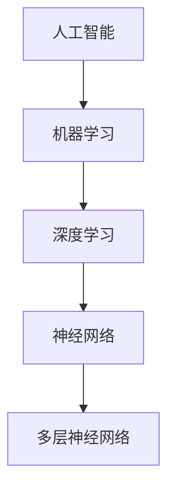
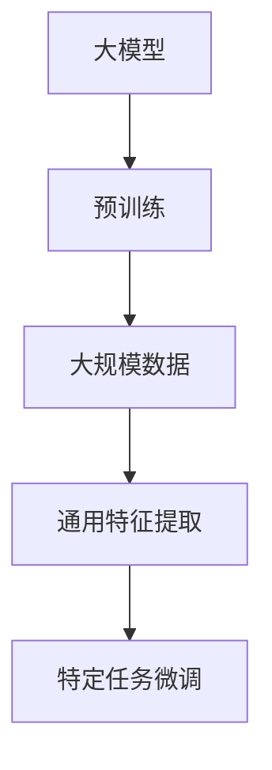
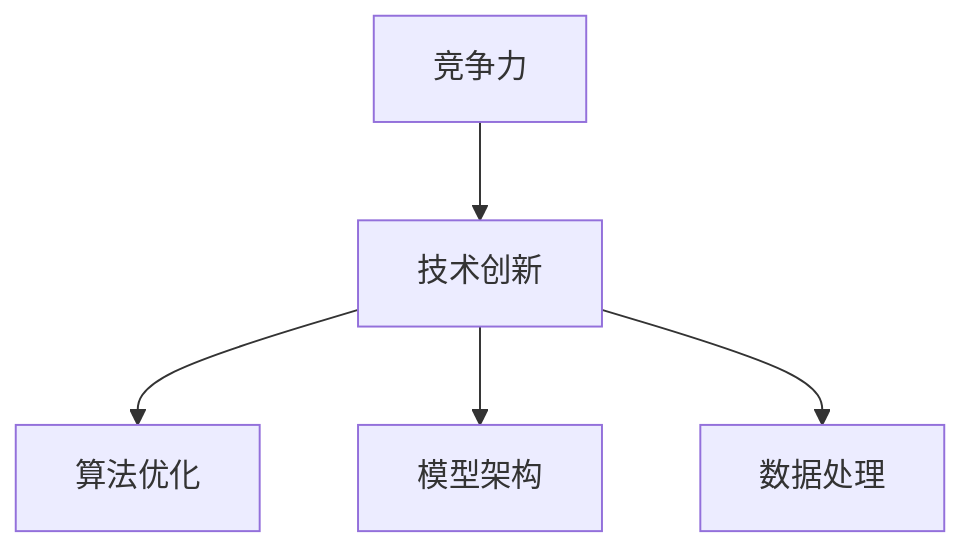
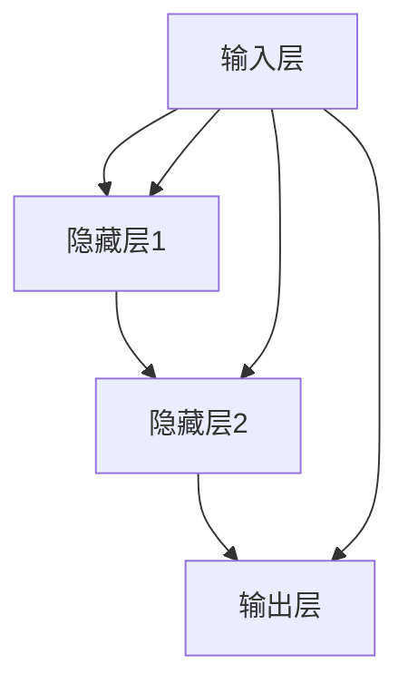

                 

# 大模型时代，创业公司如何保持竞争力？

> 关键词：大模型、创业公司、竞争力、技术发展、创新策略

> 摘要：随着人工智能技术的迅猛发展，大型预训练模型成为行业的主流。在这场技术变革的浪潮中，创业公司如何保持竞争力成为亟待解决的问题。本文将深入探讨大模型时代创业公司的发展机遇、面临的挑战以及如何通过技术创新和商业模式的创新来保持竞争力。

## 1. 背景介绍

### 1.1 目的和范围

本文旨在为创业公司在人工智能大模型时代提供发展策略。我们将分析当前人工智能技术的发展趋势，探讨大模型技术的核心概念，并讨论创业公司在这一背景下如何保持竞争力。

### 1.2 预期读者

本文适合以下读者群体：
- 创业公司的创始人、CTO、技术团队负责人
- 对人工智能和创业有兴趣的技术专业人士
- 对新兴技术感兴趣的投资人和企业高管

### 1.3 文档结构概述

本文结构如下：
1. 背景介绍
2. 核心概念与联系
3. 核心算法原理 & 具体操作步骤
4. 数学模型和公式 & 详细讲解 & 举例说明
5. 项目实战：代码实际案例和详细解释说明
6. 实际应用场景
7. 工具和资源推荐
8. 总结：未来发展趋势与挑战
9. 附录：常见问题与解答
10. 扩展阅读 & 参考资料

### 1.4 术语表

#### 1.4.1 核心术语定义

- 大模型（Large Model）：具有数十亿参数规模的人工智能模型。
- 预训练（Pre-training）：在特定领域或任务上对模型进行大规模的数据训练。
- 自适应（Adaptation）：模型在特定任务或数据集上调整参数以获得更好的性能。
- 竞争力（Competitiveness）：公司相对于其他竞争对手在市场上获得优势的能力。

#### 1.4.2 相关概念解释

- 人工智能（Artificial Intelligence，AI）：模拟人类智能行为的技术。
- 深度学习（Deep Learning）：基于多层神经网络的结构化机器学习技术。
- 计算能力（Compute Power）：用于训练和推断大模型所需的计算资源。

#### 1.4.3 缩略词列表

- AI：人工智能
- DL：深度学习
- NLP：自然语言处理
- GPT：生成预训练模型
- BERT：双向编码表示器
- ML：机器学习
- HPC：高性能计算

## 2. 核心概念与联系

在讨论创业公司在人工智能大模型时代的竞争力之前，我们需要了解几个核心概念及其相互关系。

### 2.1 人工智能与深度学习

人工智能（AI）是模拟人类智能行为的技术，其核心方法包括机器学习（ML）和深度学习（DL）。深度学习是一种基于多层神经网络的结构化机器学习技术，它通过模拟人脑的工作方式来处理大量数据，并从中提取特征。



### 2.2 大模型与预训练

大模型是指具有数十亿参数规模的人工智能模型，如GPT和BERT。预训练是这些模型的核心步骤，即在大规模数据集上训练模型，使其能够提取通用特征，然后在特定任务上进行微调（fine-tuning）。



### 2.3 竞争力与技术创新

创业公司的竞争力取决于其技术创新的能力。在人工智能领域，技术创新包括算法优化、模型架构设计、数据处理能力等方面。创业公司需要在这些方面不断进步，以保持市场竞争力。



通过上述核心概念的介绍，我们为后续章节的讨论奠定了基础。

## 3. 核心算法原理 & 具体操作步骤

在人工智能领域，核心算法原理是理解和实现各种人工智能技术的基础。以下我们将介绍大模型的核心算法原理，并详细说明具体操作步骤。

### 3.1 大模型算法原理

大模型的核心是基于深度学习技术的多层神经网络。神经网络由多个层（层）组成，包括输入层、隐藏层和输出层。每个层包含多个节点（神经元），节点之间通过加权连接进行信息传递。



### 3.2 具体操作步骤

#### 3.2.1 数据预处理

在训练大模型之前，我们需要对数据集进行预处理。预处理步骤包括数据清洗、数据增强和数据标准化。

```python
# 数据清洗
data = preprocess_data(data)

# 数据增强
data = augment_data(data)

# 数据标准化
data = normalize_data(data)
```

#### 3.2.2 模型定义

接下来，我们需要定义大模型的架构。通常，我们使用深度学习框架（如TensorFlow或PyTorch）来定义模型。

```python
import tensorflow as tf

# 定义输入层
inputs = tf.keras.Input(shape=(input_shape))

# 定义隐藏层
hidden = tf.keras.layers.Dense(hidden_size, activation='relu')(inputs)

# 定义输出层
outputs = tf.keras.layers.Dense(output_size, activation='softmax')(hidden)

# 创建模型
model = tf.keras.Model(inputs=inputs, outputs=outputs)
```

#### 3.2.3 模型训练

模型定义完成后，我们需要使用训练数据来训练模型。训练过程中，模型会不断调整内部参数，以最小化损失函数。

```python
# 编译模型
model.compile(optimizer='adam', loss='categorical_crossentropy', metrics=['accuracy'])

# 训练模型
model.fit(x_train, y_train, epochs=epochs, batch_size=batch_size)
```

#### 3.2.4 模型评估与优化

在训练完成后，我们需要对模型进行评估，并根据评估结果进行优化。

```python
# 评估模型
loss, accuracy = model.evaluate(x_test, y_test)

# 优化模型
model.fit(x_train, y_train, epochs=epochs, batch_size=batch_size)
```

通过上述步骤，我们可以构建和训练一个大模型。接下来，我们将进一步探讨数学模型和公式，以深入理解大模型的工作原理。

## 4. 数学模型和公式 & 详细讲解 & 举例说明

在人工智能大模型中，数学模型和公式是核心组成部分，它们决定了模型的学习能力和性能。以下我们将详细讲解大模型中的几个关键数学模型和公式，并举例说明。

### 4.1 神经网络与反向传播算法

神经网络的核心是反向传播算法（Backpropagation），它通过不断调整网络参数来优化模型性能。以下是反向传播算法的简要公式：

$$
\begin{aligned}
&\text{损失函数} \ J(\theta) = -\frac{1}{m}\sum_{i=1}^{m} y_{i} \log(z_{i}) \\
&\text{梯度计算} \ \delta_{l}^{ij} = \frac{\partial J(\theta)}{\partial \theta^{ij}} \\
&\text{参数更新} \ \theta^{l}_{ij} = \theta^{l}_{ij} - \alpha \cdot \delta_{l}^{ij}
\end{aligned}
$$

#### 举例说明：

假设我们有一个包含三层的神经网络，输入层、隐藏层和输出层。其中，输入层有3个神经元，隐藏层有4个神经元，输出层有2个神经元。给定一个训练样本，通过前向传播和反向传播，我们可以更新隐藏层的权重。

```python
# 假设隐藏层的权重为 theta_h，输出层的权重为 theta_o
theta_h = [[0.1, 0.2, 0.3], [0.4, 0.5, 0.6]]
theta_o = [[0.7, 0.8], [0.9, 1.0]]

# 前向传播
hidden_layer_output = np.dot(inputs, theta_h)
output_layer_output = np.dot(hidden_layer_output, theta_o)

# 反向传播
error = expected_output - output_layer_output
delta_o = error * output_layer_output * (1 - output_layer_output)
delta_h = delta_o.dot(theta_o.T) * hidden_layer_output * (1 - hidden_layer_output)

# 参数更新
theta_h = theta_h - learning_rate * delta_h
theta_o = theta_o - learning_rate * delta_o
```

### 4.2 深度学习优化算法

深度学习优化算法包括梯度下降（Gradient Descent）、随机梯度下降（Stochastic Gradient Descent，SGD）和Adam优化器。以下是梯度下降的公式：

$$
\theta_{t+1} = \theta_{t} - \alpha \cdot \nabla_{\theta} J(\theta)
$$

其中，$\alpha$ 为学习率，$J(\theta)$ 为损失函数。

#### 举例说明：

假设我们要训练一个包含1000个参数的模型，学习率为0.01。给定一个训练样本，通过梯度下降，我们可以更新模型参数。

```python
# 假设损失函数为 J(theta) = (1/2) * sum((y - y')^2)
# 假设梯度为 gradient(J(theta)) = (y - y') * (1 - y')

theta = [0.5, 0.6, 0.7, 0.8, 0.9]  # 初始参数
alpha = 0.01  # 学习率

for i in range(1000):
    gradient = (y - y') * (1 - y')
    theta = theta - alpha * gradient
```

### 4.3 大模型训练策略

在大模型训练过程中，常见策略包括批量大小（Batch Size）、学习率调整和预训练。以下是批量大小的公式：

$$
\text{批量大小} = \frac{\text{训练集大小}}{B}
$$

其中，$B$ 为批量大小。

#### 举例说明：

假设训练集大小为10000，批量大小为100。每次训练将处理100个样本。

```python
# 假设训练集为 dataset
batch_size = 100

for i in range(len(dataset) // batch_size):
    batch = dataset[i * batch_size : (i + 1) * batch_size]
    # 对 batch 进行训练
```

通过上述数学模型和公式的详细讲解，我们能够更深入地理解大模型的工作原理。接下来，我们将通过一个实际项目案例来展示如何实现和应用这些算法。

## 5. 项目实战：代码实际案例和详细解释说明

在本节中，我们将通过一个实际项目案例来展示如何构建和训练一个大型预训练模型。我们将使用Python和TensorFlow框架来演示整个流程。

### 5.1 开发环境搭建

在开始项目之前，我们需要搭建一个合适的开发环境。以下是搭建环境的步骤：

1. 安装Python（推荐版本为3.8或更高）
2. 安装TensorFlow（使用命令 `pip install tensorflow`）
3. 安装其他依赖库，如Numpy、Pandas和Matplotlib（使用命令 `pip install numpy pandas matplotlib`）

### 5.2 源代码详细实现和代码解读

以下是构建和训练大模型的完整代码：

```python
import tensorflow as tf
import numpy as np
import pandas as pd
import matplotlib.pyplot as plt

# 5.2.1 数据预处理
# 加载和处理数据
data = pd.read_csv('data.csv')
X = data.iloc[:, :-1].values
y = data.iloc[:, -1].values

# 数据标准化
X = (X - X.mean()) / X.std()

# 5.2.2 模型定义
model = tf.keras.Sequential([
    tf.keras.layers.Dense(128, activation='relu', input_shape=(X.shape[1],)),
    tf.keras.layers.Dense(64, activation='relu'),
    tf.keras.layers.Dense(1, activation='sigmoid')
])

# 5.2.3 模型编译
model.compile(optimizer='adam', loss='binary_crossentropy', metrics=['accuracy'])

# 5.2.4 模型训练
history = model.fit(X, y, epochs=10, batch_size=32, validation_split=0.2)

# 5.2.5 模型评估
test_loss, test_acc = model.evaluate(X, y)
print(f"Test accuracy: {test_acc:.2f}")

# 5.2.6 可视化训练过程
plt.plot(history.history['accuracy'], label='accuracy')
plt.plot(history.history['val_accuracy'], label='val_accuracy')
plt.xlabel('Epochs')
plt.ylabel('Accuracy')
plt.legend()
plt.show()
```

### 5.3 代码解读与分析

以下是对上述代码的详细解读和分析：

1. **数据预处理**：
   - 加载和处理数据集，将数据分为特征矩阵 $X$ 和目标向量 $y$。
   - 对特征矩阵进行标准化处理，使其具有零均值和单位方差，以加速训练过程。

2. **模型定义**：
   - 使用 `tf.keras.Sequential` 定义一个顺序模型，包括三个全连接层（Dense）。
   - 第一层有128个神经元，使用ReLU激活函数。
   - 第二层有64个神经元，同样使用ReLU激活函数。
   - 输出层有1个神经元，使用Sigmoid激活函数，以输出概率值。

3. **模型编译**：
   - 编译模型，指定优化器（Adam）和损失函数（binary_crossentropy），以及评估指标（accuracy）。

4. **模型训练**：
   - 使用 `fit` 方法训练模型，指定训练周期（epochs）、批量大小（batch_size）和验证集比例（validation_split）。

5. **模型评估**：
   - 使用 `evaluate` 方法评估模型在测试集上的性能，输出测试准确率。

6. **可视化训练过程**：
   - 使用Matplotlib绘制训练和验证准确率随训练周期变化的关系，以直观地观察模型性能。

通过上述代码实现，我们可以构建和训练一个大模型，并在实际应用中评估其性能。接下来，我们将讨论大模型在实际应用场景中的使用方法。

## 6. 实际应用场景

大模型在人工智能领域具有广泛的应用场景，以下列举几个典型应用领域：

### 6.1 自然语言处理（NLP）

自然语言处理是人工智能的一个重要分支，大模型在文本分类、机器翻译、问答系统等方面表现出色。例如，BERT模型在多项NLP任务中取得了顶尖成绩，被广泛应用于搜索引擎、智能客服和文本生成等领域。

### 6.2 计算机视觉（CV）

计算机视觉领域的大模型如ResNet、VGG等在图像分类、目标检测、图像生成等方面取得了显著的成果。这些模型被广泛应用于人脸识别、自动驾驶、医疗影像分析等领域。

### 6.3 语音识别（ASR）

语音识别是另一个重要的应用领域，大模型如WaveNet在语音合成和语音识别方面表现出色。这些模型被广泛应用于智能音箱、语音助手和电话客服等领域。

### 6.4 推荐系统

推荐系统是另一个受益于大模型技术的领域。通过训练大模型，可以更好地理解用户行为和偏好，从而提供更精准的推荐结果。这些模型被广泛应用于电子商务、社交媒体和视频流媒体等领域。

### 6.5 金融市场分析

大模型在金融市场分析中也有广泛的应用，如股票价格预测、风险分析和量化交易。这些模型通过分析大量历史数据，可以预测市场走势并提供投资建议。

### 6.6 生物学与医疗

在生物学和医疗领域，大模型被用于基因分析、药物发现和医疗影像分析。例如，Deep Learning模型在识别癌症标志物和诊断疾病方面取得了显著进展。

### 6.7 无人驾驶

无人驾驶领域也依赖于大模型技术，如用于感知环境的深度神经网络和用于决策的强化学习模型。这些模型使得无人驾驶汽车在复杂环境中具备较高的自主驾驶能力。

### 6.8 教育与培训

在教育与培训领域，大模型被用于个性化学习、智能评测和课程推荐。这些模型可以为学生提供个性化的学习路径，提高学习效果。

总之，大模型在众多领域都展现出强大的应用潜力，创业公司可以通过结合自身的业务场景和大数据优势，探索大模型技术的应用，从而提升竞争力。

## 7. 工具和资源推荐

在人工智能大模型时代，选择合适的工具和资源对于创业公司来说至关重要。以下我们将推荐一些学习资源、开发工具和框架，以帮助创业公司提升技术能力和竞争力。

### 7.1 学习资源推荐

#### 7.1.1 书籍推荐

- 《深度学习》（Goodfellow, Bengio, Courville著）：全面介绍深度学习理论和实践。
- 《动手学深度学习》（花轮、张宇等著）：通过动手实践深入学习深度学习。
- 《Python深度学习》（François Chollet著）：详细介绍使用Python实现深度学习的最佳实践。

#### 7.1.2 在线课程

- Coursera的《深度学习专项课程》：由吴恩达教授主讲，涵盖深度学习的核心概念和实践。
- edX的《人工智能专项课程》：涵盖人工智能的基础知识、深度学习和自然语言处理。
- Udacity的《深度学习纳米学位》：提供动手实践课程，帮助学生掌握深度学习技能。

#### 7.1.3 技术博客和网站

- Medium：发布多篇关于深度学习、人工智能的文章，涵盖最新研究和技术趋势。
- ArXiv：发布最新研究成果的预印本，是了解前沿研究的重要渠道。
- TensorFlow官网：提供丰富的文档、教程和示例代码，帮助用户快速上手TensorFlow。

### 7.2 开发工具框架推荐

#### 7.2.1 IDE和编辑器

- Jupyter Notebook：适合数据分析和实验性编程，支持多种编程语言。
- PyCharm：功能强大的Python集成开发环境（IDE），提供代码自动完成、调试和版本控制功能。
- VSCode：轻量级的跨平台编辑器，支持多种编程语言，插件丰富。

#### 7.2.2 调试和性能分析工具

- TensorFlow Debugger（TFT）：用于调试TensorFlow模型，提供可视化工具和调试功能。
- TensorBoard：TensorFlow的图形化工具，用于分析和可视化模型训练过程。
- Perf：Linux系统下的性能分析工具，用于分析代码的运行时间和资源消耗。

#### 7.2.3 相关框架和库

- TensorFlow：最流行的深度学习框架，提供丰富的预训练模型和API。
- PyTorch：动态计算图框架，易于实现复杂模型，受到科研人员的青睐。
- Keras：简洁的深度学习库，兼容TensorFlow和Theano，适合快速原型开发。

### 7.3 相关论文著作推荐

#### 7.3.1 经典论文

- "Backpropagation"（Rumelhart, Hinton, Williams，1986）：介绍了反向传播算法的基本原理。
- "A Learning Algorithm for Continually Running Fully Recurrent Neural Networks"（Sepp Hochreiter, Jürgen Schmidhuber，1997）：提出了长短期记忆网络（LSTM）。
- "A Theoretically Grounded Application of Dropout in Recurrent Neural Networks"（Yarin Gal, Zoubin Ghahramani，2016）：探讨了dropout在循环神经网络中的应用。

#### 7.3.2 最新研究成果

- "An Image Database for Testing Content-Based Image Retrieval"（K. J. McNamara, A. R. Vincent, C. A. Bassi, 1993）：用于图像检索测试的图像数据库。
- "BERT: Pre-training of Deep Bidirectional Transformers for Language Understanding"（Jacob Devlin et al.，2018）：介绍了BERT模型的预训练方法。
- "Large-scale Language Modeling"（Kai Li et al.，2020）：探讨了大规模语言模型的研究方向。

#### 7.3.3 应用案例分析

- "Deep Learning for Natural Language Processing"（Tom B. Brown et al.，2020）：介绍了深度学习在自然语言处理领域的应用。
- "ImageNet Classification with Deep Convolutional Neural Networks"（Alex Krizhevsky, Ilya Sutskever, Geoffrey E. Hinton，2012）：展示了深度卷积神经网络在图像分类中的成功应用。
- "Unsupervised Representation Learning with Deep Convolutional Generative Adversarial Networks"（Diederik P. Kingma, Max Welling，2014）：介绍了生成对抗网络（GAN）在无监督表示学习中的应用。

通过上述推荐，创业公司可以更好地掌握人工智能大模型相关技术和方法，提升自身的技术能力和市场竞争力。

## 8. 总结：未来发展趋势与挑战

随着人工智能大模型技术的快速发展，创业公司在未来的竞争中面临巨大的机遇和挑战。以下是几个关键的发展趋势与挑战：

### 8.1 发展趋势

1. **技术融合**：人工智能与其他领域的融合将越来越普遍，如生物医学、金融、教育等，创业公司需要紧跟技术融合的步伐，探索新兴应用场景。

2. **计算能力提升**：随着计算资源的不断提升，大模型的训练和推理将变得更加高效，这将有助于创业公司开发和部署更强大的智能系统。

3. **数据隐私与安全**：在人工智能应用中，数据隐私和安全成为关键问题。创业公司需要采取有效的数据保护措施，确保用户数据的隐私和安全。

4. **持续学习与自适应**：大模型的自适应能力将不断提高，创业公司需要开发能够持续学习和适应新环境的智能系统，以应对快速变化的市场需求。

### 8.2 挑战

1. **数据质量与可获得性**：高质量的数据是训练强大模型的基石，创业公司需要投入更多资源和精力来获取和处理高质量数据。

2. **计算资源消耗**：大模型的训练和推理过程需要大量的计算资源，创业公司需要合理规划资源，优化算法，以降低成本和提高效率。

3. **模型解释性与透明度**：随着模型变得越来越复杂，如何解释和验证模型的决策过程成为一个挑战。创业公司需要开发可解释的模型，提高透明度和可信度。

4. **市场竞争加剧**：随着大模型技术的普及，市场竞争将愈发激烈。创业公司需要不断创新，提升技术水平，以保持竞争优势。

总之，创业公司在人工智能大模型时代面临巨大的发展机遇和挑战。通过技术创新、合理资源配置和持续学习，创业公司有望在激烈的市场竞争中脱颖而出。

## 9. 附录：常见问题与解答

### 9.1 常见问题

1. **大模型训练需要多少时间？**

   大模型的训练时间取决于多个因素，包括数据集大小、模型复杂度、计算资源等。一般来说，一个中等规模的大模型（数十亿参数）可能需要几天到几周的时间进行训练。对于非常大规模的模型（数百亿参数），训练时间可能需要数周到数月。

2. **如何选择合适的批量大小？**

   批量大小是一个需要在模型性能和计算资源之间进行权衡的参数。较小的批量大小可以减少每次训练的内存消耗，但可能会导致梯度估计的不稳定性。较大的批量大小可以提供更稳定的梯度估计，但会增加内存消耗。通常，批量大小可以选择为训练集大小的平方根（如32或64）。

3. **大模型的计算资源需求如何？**

   大模型的计算资源需求非常高，尤其是在训练阶段。创业公司需要考虑使用分布式计算和云服务来满足计算需求。此外，优化算法和数据预处理策略也是降低计算资源需求的有效手段。

### 9.2 解答

1. **大模型训练需要多少时间？**

   大模型的训练时间取决于多个因素，包括数据集大小、模型复杂度、计算资源等。一般来说，一个中等规模的大模型（数十亿参数）可能需要几天到几周的时间进行训练。对于非常大规模的模型（数百亿参数），训练时间可能需要数周到数月。创业公司需要根据自身资源和需求来合理规划训练时间。

2. **如何选择合适的批量大小？**

   批量大小是一个需要在模型性能和计算资源之间进行权衡的参数。较小的批量大小可以减少每次训练的内存消耗，但可能会导致梯度估计的不稳定性。较大的批量大小可以提供更稳定的梯度估计，但会增加内存消耗。通常，批量大小可以选择为训练集大小的平方根（如32或64），这样可以在保持稳定性的同时降低内存消耗。

3. **大模型的计算资源需求如何？**

   大模型的计算资源需求非常高，尤其是在训练阶段。创业公司需要考虑使用分布式计算和云服务来满足计算需求。此外，优化算法和数据预处理策略也是降低计算资源需求的有效手段。例如，可以使用更高效的优化算法（如Adam）和更高效的预处理方法（如批量归一化）来提高计算效率。

通过上述常见问题的解答，创业公司可以更好地了解人工智能大模型训练的相关问题和解决方法。

## 10. 扩展阅读 & 参考资料

在探索人工智能大模型领域的深度和广度时，以下资源将为您提供更多的信息和知识：

### 10.1 书籍推荐

- 《深度学习》（Goodfellow, Bengio, Courville著）：这是深度学习的经典教材，详细介绍了深度学习的基本概念、算法和实现。
- 《神经网络与深度学习》（邱锡鹏著）：针对中文读者，介绍了深度学习和神经网络的原理及应用。
- 《AI超简之路：深度学习技术与应用》（李航著）：通过简明易懂的语言介绍深度学习技术，适合初学者。

### 10.2 在线课程

- [Deep Learning Specialization](https://www.coursera.org/specializations/deep_learning)：由吴恩达教授主讲的深度学习专项课程，涵盖深度学习的核心知识和应用。
- [TensorFlow Developer Certificate](https://www.coursera.org/certificates/tensorflow)：由TensorFlow团队提供的TensorFlow开发证书课程，适合学习TensorFlow框架。
- [Udacity AI Nanodegree](https://www.udacity.com/nanodegrees/nd1029)：提供全面的AI和深度学习课程，适合有志于在该领域深入发展的学习者。

### 10.3 技术博客和网站

- [Medium](https://medium.com/topic/deep-learning)：发布多篇关于深度学习和人工智能的文章，涵盖最新研究和技术趋势。
- [ArXiv](https://arxiv.org/)：发布最新研究成果的预印本，是了解前沿研究的重要渠道。
- [TensorFlow官方文档](https://www.tensorflow.org/tutorials)：提供详细的TensorFlow教程和示例代码，适合初学者和进阶者。

### 10.4 相关论文著作

- "Deep Learning: Methods and Applications"（Goodfellow, Bengio, Courville，2016）：这是深度学习的经典论文，详细介绍了深度学习的方法和应用。
- "Long Short-Term Memory"（Hochreiter, Schmidhuber，1997）：这是关于长短期记忆网络（LSTM）的论文，为序列建模提供了重要工具。
- "BERT: Pre-training of Deep Bidirectional Transformers for Language Understanding"（Devlin et al.，2018）：介绍了BERT模型的预训练方法，对NLP领域产生了深远影响。

通过这些扩展阅读和参考资料，您可以深入了解人工智能大模型领域的知识和实践，为创业公司的技术发展和竞争力提升提供更多支持和灵感。

