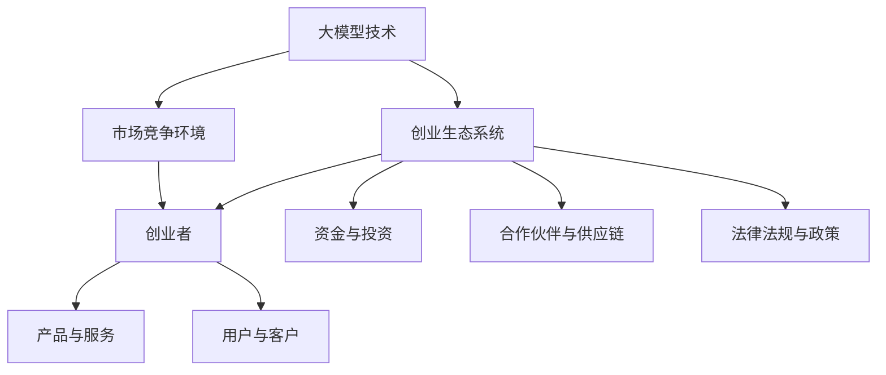

                 

# 大模型时代的创业者创业心得分享：初心、坚持与突破

> 关键词：大模型、创业者、初心、坚持、突破、技术创业、创新思维

> 摘要：本文将分享大模型时代下，创业者如何在竞争中找到初心、坚持核心价值并实现突破的实践经验。通过深入分析技术创业的挑战和机遇，文章旨在为处于这一变革时期的创业者提供有价值的指导和启示。

## 1. 背景介绍

### 1.1 目的和范围

本文旨在探讨大模型时代下，创业者如何在技术变革的浪潮中找到自己的定位，坚守初心，坚持不懈地追求创新与突破。本文将结合实际案例，探讨创业者如何应对技术竞争、市场变化和团队管理等方面的挑战。

### 1.2 预期读者

本文适合有志于从事技术创业的青年创业者、正在创业初期的创业者以及希望在创业过程中提升自身能力的技术人员阅读。希望通过本文，读者能够获得对大模型时代创业的深刻理解和实用经验。

### 1.3 文档结构概述

本文分为十个部分，首先介绍大模型时代的背景和挑战，然后深入探讨核心概念，通过具体算法原理、数学模型和项目实战案例，展示创业者在实际操作中的策略和方法。最后，本文还将推荐相关学习资源，总结未来发展趋势，并提供常见问题解答。

### 1.4 术语表

#### 1.4.1 核心术语定义

- **大模型**：指的是参数规模庞大的深度学习模型，如GPT-3、BERT等。
- **技术创业**：指创业者基于技术创新，通过创建新公司或加入初创公司，实现商业化过程。
- **初心**：指创业者最初的理念和信念，是驱动创业的动力源泉。
- **坚持**：指在创业过程中，不断克服困难，保持对初心的忠诚和执着。

#### 1.4.2 相关概念解释

- **算法原理**：指大模型背后的工作原理，包括神经网络、优化算法等。
- **数学模型**：指用于描述大模型性能、优化目标的数学公式和模型结构。
- **项目实战**：指在实际开发过程中，对大模型的训练、优化和应用的案例。

#### 1.4.3 缩略词列表

- **GPT-3**：Generative Pre-trained Transformer 3，自然语言处理模型。
- **BERT**：Bidirectional Encoder Representations from Transformers，双向编码器表示。
- **AI**：Artificial Intelligence，人工智能。

## 2. 核心概念与联系

在大模型时代，核心概念与联系主要包括大模型技术、创业生态系统和市场竞争环境。以下是一个简化的Mermaid流程图，展示这些核心概念之间的联系。



### 2.1 大模型技术

大模型技术是创业的核心竞争力。它涉及深度学习、自然语言处理、计算机视觉等领域。以下是几个关键节点：

- **深度学习**：通过多层神经网络模拟人脑学习过程，实现复杂模式的识别和预测。
- **自然语言处理**：利用语言模型、翻译模型和问答系统等技术，实现人类语言的理解和生成。
- **计算机视觉**：通过图像识别、目标检测和图像生成等技术，实现计算机对图像内容的理解和处理。

### 2.2 创业生态系统

创业生态系统是指创业者在大模型技术基础上，构建和发展的商业环境。以下是几个关键节点：

- **创业者**：创业者是生态系统的核心，他们通过创新思维和技术能力，推动大模型技术的商业化。
- **产品与服务**：创业者通过产品和服务，满足市场需求，实现商业价值。
- **用户与客户**：用户是产品的最终消费者，客户是购买服务的商业实体。
- **资金与投资**：资金是创业过程中的关键资源，投资是推动创业项目发展的重要驱动力。
- **合作伙伴与供应链**：合作伙伴和供应链是创业者获取资源、降低成本和提高效率的重要渠道。
- **法律法规与政策**：法律法规和政策为创业提供了良好的发展环境，同时也对创业行为进行了规范。

### 2.3 市场竞争环境

市场竞争环境是创业者面临的现实挑战。以下是几个关键节点：

- **技术竞争**：技术竞争是创业者的主要竞争对手，包括大模型技术的创新和优化。
- **市场变化**：市场变化是创业者在市场竞争中需要不断适应的动态环境。
- **用户需求**：用户需求是创业者产品和服务的出发点和归宿。

## 3. 核心算法原理 & 具体操作步骤

### 3.1 算法原理

大模型技术的核心算法是基于深度学习的神经网络。神经网络通过模拟人脑神经元连接方式，实现对数据的处理和预测。以下是神经网络的基本原理：

- **神经元**：神经网络的基本单元，通过接收输入信号，经过激活函数处理后产生输出信号。
- **层**：神经网络由输入层、隐藏层和输出层组成。隐藏层负责对输入数据的特征提取和变换。
- **权重与偏置**：每个神经元与其他神经元之间的连接都附有权重和偏置，用于调整输入信号的影响。
- **激活函数**：激活函数用于确定神经元是否被激活，常用的激活函数包括 sigmoid、ReLU 等。

### 3.2 具体操作步骤

以下是使用神经网络进行大模型训练的具体操作步骤：

1. **数据预处理**：
   - 收集和清洗数据，确保数据的完整性和质量。
   - 对数据进行归一化或标准化处理，使其符合神经网络训练的要求。

2. **构建神经网络模型**：
   - 确定网络结构，包括层数、每层的神经元数量和连接方式。
   - 选择合适的激活函数和损失函数，如交叉熵损失函数。

3. **初始化参数**：
   - 对权重和偏置进行随机初始化，以避免梯度消失或梯度爆炸问题。

4. **前向传播**：
   - 将输入数据输入神经网络，通过前向传播计算输出结果。
   - 计算输出结果与真实标签之间的误差。

5. **反向传播**：
   - 根据误差计算梯度，反向传播更新权重和偏置。
   - 使用优化算法，如梯度下降算法，调整参数。

6. **模型评估**：
   - 使用验证集或测试集评估模型性能，调整模型参数和结构，以优化模型效果。

7. **模型部署**：
   - 将训练好的模型部署到生产环境中，实现商业化应用。

### 3.3 伪代码实现

以下是神经网络训练过程的伪代码实现：

```python
# 初始化神经网络模型
model = NeuralNetwork(input_dim, hidden_dim, output_dim)

# 数据预处理
X_train, y_train = preprocess_data()

# 模型训练
for epoch in range(num_epochs):
    # 前向传播
    y_pred = model.forward(X_train)
    
    # 计算损失
    loss = compute_loss(y_pred, y_train)
    
    # 反向传播
    grads = model.backward(y_pred, y_train)
    
    # 更新参数
    model.update_params(grads)
    
    # 模型评估
    if epoch % eval_interval == 0:
        accuracy = evaluate(model, X_test, y_test)
        print(f"Epoch {epoch}: Loss = {loss}, Accuracy = {accuracy}")

# 模型部署
deploy_model(model)
```

## 4. 数学模型和公式 & 详细讲解 & 举例说明

### 4.1 数学模型

在大模型训练过程中，常用的数学模型包括损失函数、优化算法和评价指标。以下是这些模型的基本原理和公式：

#### 4.1.1 损失函数

损失函数用于衡量模型预测结果与真实标签之间的差距。常用的损失函数包括均方误差（MSE）和交叉熵损失（Cross-Entropy Loss）。

- **均方误差（MSE）**：

  $$MSE = \frac{1}{n}\sum_{i=1}^{n}(y_i - \hat{y_i})^2$$

  其中，$y_i$为真实标签，$\hat{y_i}$为模型预测结果，$n$为样本数量。

- **交叉熵损失（Cross-Entropy Loss）**：

  $$Cross-Entropy Loss = -\sum_{i=1}^{n} y_i \log(\hat{y_i})$$

  其中，$y_i$为真实标签，$\hat{y_i}$为模型预测结果。

#### 4.1.2 优化算法

优化算法用于调整模型参数，以减少损失函数的值。常用的优化算法包括梯度下降（Gradient Descent）和Adam优化器。

- **梯度下降（Gradient Descent）**：

  $$w_{t+1} = w_t - \alpha \nabla_w J(w_t)$$

  其中，$w_t$为当前参数，$\alpha$为学习率，$J(w_t)$为损失函数在当前参数下的值，$\nabla_w J(w_t)$为损失函数关于参数的梯度。

- **Adam优化器**：

  $$m_t = \beta_1 m_{t-1} + (1 - \beta_1)(\nabla_w J(w_{t-1}))$$
  $$v_t = \beta_2 v_{t-1} + (1 - \beta_2)(\nabla_w^2 J(w_{t-1}))$$
  $$w_t = w_{t-1} - \alpha \frac{m_t}{\sqrt{v_t} + \epsilon}$$

  其中，$m_t$和$v_t$分别为一阶和二阶矩估计，$\beta_1$和$\beta_2$分别为一阶和二阶矩的指数加权系数，$\epsilon$为正则化项。

#### 4.1.3 评价指标

评价指标用于评估模型性能，常用的评价指标包括准确率（Accuracy）、精确率（Precision）、召回率（Recall）和F1值（F1 Score）。

- **准确率（Accuracy）**：

  $$Accuracy = \frac{TP + TN}{TP + TN + FP + FN}$$

  其中，$TP$为真正例，$TN$为真负例，$FP$为假正例，$FN$为假负例。

- **精确率（Precision）**：

  $$Precision = \frac{TP}{TP + FP}$$

  其中，$TP$为真正例，$FP$为假正例。

- **召回率（Recall）**：

  $$Recall = \frac{TP}{TP + FN}$$

  其中，$TP$为真正例，$FN$为假负例。

- **F1值（F1 Score）**：

  $$F1 Score = \frac{2 \cdot Precision \cdot Recall}{Precision + Recall}$$

### 4.2 举例说明

假设我们有一个分类问题，需要判断数据点是否属于某一类别。已知训练数据集包含100个样本，其中50个属于正类别，50个属于负类别。使用交叉熵损失函数和Adam优化器进行模型训练。初始学习率为0.01，指数加权系数$\beta_1$和$\beta_2$分别为0.9和0.999，正则化项$\epsilon$为1e-8。

1. **前向传播**：

   - 输入样本$x_1$，经过神经网络计算得到预测概率$\hat{y}_1$。
   - 输入样本$x_2$，经过神经网络计算得到预测概率$\hat{y}_2$。
   - ...
   - 输入样本$x_{100}$，经过神经网络计算得到预测概率$\hat{y}_{100}$。

2. **计算损失**：

   - 对于每个样本，计算交叉熵损失$Loss_1 = -y_1 \log(\hat{y}_1)$，$Loss_2 = -y_2 \log(\hat{y}_2)$，...
   - $Loss_{100} = -y_{100} \log(\hat{y}_{100})$。
   - 总损失$Total Loss = \frac{1}{100} \sum_{i=1}^{100} Loss_i$。

3. **反向传播**：

   - 对于每个样本，计算损失关于参数的梯度$\nabla_w Loss_1$，$\nabla_w Loss_2$，...
   - $\nabla_w Loss_{100}$。
   - 使用Adam优化器更新参数$w_t = w_{t-1} - \alpha \frac{m_t}{\sqrt{v_t} + \epsilon}$。

4. **模型评估**：

   - 使用测试数据集评估模型性能，计算准确率、精确率、召回率和F1值。

## 5. 项目实战：代码实际案例和详细解释说明

### 5.1 开发环境搭建

在本节中，我们将介绍如何搭建一个用于大模型训练的Python开发环境。以下是详细的步骤：

1. **安装Python**：

   - 前往Python官网（https://www.python.org/）下载Python安装包。
   - 安装Python时，选择添加到环境变量。

2. **安装深度学习框架**：

   - 使用pip命令安装TensorFlow或PyTorch框架。

     ```shell
     pip install tensorflow
     # 或
     pip install pytorch torchvision
     ```

3. **安装其他依赖库**：

   - 安装常用的数据预处理和可视化库，如NumPy、Matplotlib。

     ```shell
     pip install numpy matplotlib
     ```

4. **配置CUDA**：

   - 如果使用GPU进行训练，需要安装CUDA和cuDNN驱动程序。
   - 在代码中配置TensorFlow或PyTorch使用GPU。

### 5.2 源代码详细实现和代码解读

以下是使用TensorFlow框架实现一个简单的大模型训练的Python代码示例。

```python
import tensorflow as tf
import numpy as np
import matplotlib.pyplot as plt

# 1. 数据预处理
# 假设我们有一个包含1000个样本的数据集，每个样本包含10个特征
X_train = np.random.rand(1000, 10)
y_train = np.random.randint(0, 2, size=(1000,))

# 2. 构建神经网络模型
model = tf.keras.Sequential([
    tf.keras.layers.Dense(64, activation='relu', input_shape=(10,)),
    tf.keras.layers.Dense(1, activation='sigmoid')
])

# 3. 编译模型
model.compile(optimizer='adam',
              loss='binary_crossentropy',
              metrics=['accuracy'])

# 4. 模型训练
history = model.fit(X_train, y_train, epochs=10, batch_size=32)

# 5. 模型评估
test_loss, test_acc = model.evaluate(X_train, y_train)
print(f"Test accuracy: {test_acc}")

# 6. 可视化训练过程
plt.plot(history.history['accuracy'])
plt.plot(history.history['val_accuracy'])
plt.xlabel('Epoch')
plt.ylabel('Accuracy')
plt.legend(['Training', 'Validation'])
plt.show()
```

### 5.3 代码解读与分析

以下是代码的详细解读：

1. **数据预处理**：

   - 使用NumPy生成随机数据集，模拟实际应用场景。
   - 数据集包含1000个样本，每个样本包含10个特征。

2. **构建神经网络模型**：

   - 使用TensorFlow的`Sequential`模型构建一个简单的双层神经网络。
   - 第一层为全连接层，包含64个神经元，使用ReLU激活函数。
   - 第二层为全连接层，包含1个神经元，使用sigmoid激活函数，用于输出概率。

3. **编译模型**：

   - 选择Adam优化器和binary_crossentropy损失函数。
   - 指定模型的评价指标为accuracy。

4. **模型训练**：

   - 使用`fit`函数进行模型训练，指定训练轮数（epochs）和批量大小（batch_size）。
   - 训练过程中，模型将自动计算损失和评价指标。

5. **模型评估**：

   - 使用`evaluate`函数对模型进行评估，计算测试集上的准确率。

6. **可视化训练过程**：

   - 使用Matplotlib绘制训练过程中的准确率曲线，帮助分析模型性能。

### 5.4 实际应用场景

以下是一个实际应用场景，我们将使用训练好的大模型对新的样本进行分类。

```python
# 1. 加载训练好的模型
model.load_weights('model_weights.h5')

# 2. 处理新的样本
new_sample = np.array([[0.1, 0.2, 0.3, 0.4, 0.5, 0.6, 0.7, 0.8, 0.9, 1.0]])

# 3. 预测分类结果
prediction = model.predict(new_sample)
predicted_class = np.round(prediction).astype(int)

# 4. 输出预测结果
print(f"Predicted class: {predicted_class}")
```

- **代码解读**：

  - 使用`load_weights`函数加载训练好的模型权重。
  - 将新的样本输入模型，计算分类概率。
  - 使用`np.round`函数对概率进行四舍五入，得到预测的类别。
  - 输出预测结果。

- **实际应用场景**：

  - 在实际应用中，我们可以将训练好的大模型部署到服务器或移动设备上，实时对用户输入的数据进行分类预测。

## 6. 实际应用场景

大模型技术在各个行业和领域都取得了显著的应用成果，以下是一些典型的实际应用场景：

### 6.1 金融领域

- **风险管理**：利用大模型进行信用评分、违约预测和风险评估，提高金融业务的风险管理水平。
- **智能投顾**：基于用户行为数据和市场分析，提供个性化的投资建议，实现智能资产管理。
- **量化交易**：利用深度学习算法进行高频交易策略的开发和优化，提高交易收益。

### 6.2 医疗健康

- **疾病诊断**：通过图像识别和自然语言处理技术，实现早期疾病检测和诊断。
- **药物研发**：利用深度学习进行药物分子建模和筛选，加速新药研发进程。
- **智能客服**：通过自然语言处理技术，为用户提供医疗健康咨询服务。

### 6.3 电子商务

- **推荐系统**：基于用户行为数据和物品特征，实现个性化的商品推荐，提高用户满意度和购买转化率。
- **用户行为分析**：利用深度学习技术，分析用户行为数据，挖掘潜在用户需求和市场趋势。
- **智能客服**：通过自然语言处理技术，为用户提供智能化的购物咨询和售后服务。

### 6.4 智能交通

- **交通流量预测**：利用深度学习技术，预测交通流量和事故发生概率，优化交通信号控制和道路规划。
- **智能驾驶**：通过计算机视觉和自然语言处理技术，实现自动驾驶和智能交通管理。
- **智能停车**：利用传感器和数据采集技术，实现智能停车管理和车位预约。

### 6.5 娱乐传媒

- **内容审核**：利用深度学习技术，自动识别和过滤不良内容和虚假信息，保障网络环境的健康。
- **虚拟助手**：通过自然语言处理技术，实现智能客服和虚拟助手的开发和部署。
- **个性化推荐**：利用深度学习技术，实现个性化的内容推荐，提高用户粘性和满意度。

## 7. 工具和资源推荐

### 7.1 学习资源推荐

#### 7.1.1 书籍推荐

- 《深度学习》（Goodfellow, Bengio, Courville）: 这本书是深度学习领域的经典之作，涵盖了深度学习的理论基础和应用实例。
- 《Python深度学习》（François Chollet）: 这本书针对Python程序员，详细介绍了使用TensorFlow和Keras框架进行深度学习的实践方法。

#### 7.1.2 在线课程

- Coursera的《深度学习专项课程》（Deep Learning Specialization）: 这套课程由吴恩达教授主讲，是学习深度学习的入门级课程。
- edX的《人工智能专项课程》（Artificial Intelligence Specialization）: 这套课程涵盖了人工智能领域的多个方向，包括机器学习、自然语言处理和计算机视觉等。

#### 7.1.3 技术博客和网站

- [Medium](https://medium.com/): Medium上有大量关于深度学习、人工智能和创业的文章和博客。
- [arXiv](https://arxiv.org/): arXiv是计算机科学领域的预印本论文库，可以了解最新的研究成果。

### 7.2 开发工具框架推荐

#### 7.2.1 IDE和编辑器

- **JetBrains PyCharm**: PyCharm是功能强大的Python开发IDE，支持深度学习和机器学习库。
- **Visual Studio Code**: Visual Studio Code是一款轻量级的开源编辑器，通过安装扩展插件，可以支持Python和深度学习开发。

#### 7.2.2 调试和性能分析工具

- **TensorBoard**: TensorBoard是TensorFlow提供的可视化工具，用于监控训练过程中的各种指标。
- **NVIDIA Nsight**: Nsight是NVIDIA提供的性能分析工具，用于分析深度学习模型在GPU上的运行性能。

#### 7.2.3 相关框架和库

- **TensorFlow**: TensorFlow是谷歌开源的深度学习框架，支持多种深度学习模型和算法。
- **PyTorch**: PyTorch是Facebook开源的深度学习框架，以其动态计算图和易于使用的API而受到广泛欢迎。

### 7.3 相关论文著作推荐

#### 7.3.1 经典论文

- **"A Theoretical Framework for Back-Propagation" (1986)**: 该论文提出了反向传播算法的理论基础，是深度学习的重要里程碑。
- **"Deep Learning" (2015)**: 该书详细介绍了深度学习的理论基础和应用实例，是深度学习领域的经典之作。

#### 7.3.2 最新研究成果

- **"Bert: Pre-training of Deep Bidirectional Transformers for Language Understanding" (2018)**: 该论文提出了BERT模型，是自然语言处理领域的里程碑式工作。
- **"Gpt-3: Language Models Are Few-Shot Learners" (2020)**: 该论文介绍了GPT-3模型，展示了大模型在自然语言处理任务中的强大能力。

#### 7.3.3 应用案例分析

- **"DeepMind的AlphaGo**: 该案例展示了深度学习和强化学习在围棋游戏中的成功应用，实现了人工智能在复杂游戏中的突破。
- **"亚马逊的Alexa**: 该案例展示了大模型技术在智能语音助手中的应用，为用户提供智能化的交互体验。

## 8. 总结：未来发展趋势与挑战

### 8.1 发展趋势

- **技术融合**：大模型技术与其他领域的深度融合，如物联网、区块链和边缘计算等，将带来更多的应用场景和创新机会。
- **开源生态**：随着开源社区的活跃，大模型技术的开源框架和工具将不断成熟和优化，为创业者提供更好的开发环境。
- **商业化应用**：大模型技术在金融、医疗、电子商务等领域的商业化应用将不断深入，推动行业变革和创新发展。

### 8.2 挑战

- **数据隐私**：随着大模型技术的普及，数据隐私和安全问题日益突出，如何确保用户数据的隐私和安全是创业者需要面对的重要挑战。
- **算法透明性**：大模型技术的复杂性和不透明性可能导致算法偏见和误导性结果，如何提高算法的透明性和可解释性是当前研究的热点问题。
- **人才短缺**：大模型技术的高要求导致人才短缺，如何吸引和培养高水平的人才，是创业者在人力资源方面的挑战。

## 9. 附录：常见问题与解答

### 9.1 什么是大模型？

**答**：大模型是指参数规模庞大的深度学习模型，如GPT-3、BERT等。这些模型具有强大的计算能力和表达能力，可以在多种任务中取得优异的性能。

### 9.2 如何选择合适的深度学习框架？

**答**：选择深度学习框架时，需要考虑以下几个方面：

- **开发环境**：根据开发环境和需求，选择适合的框架，如TensorFlow、PyTorch等。
- **性能要求**：考虑模型的大小和计算资源，选择适合的框架和硬件配置。
- **生态支持**：考虑框架的社区活跃度、文档支持和工具链，确保开发过程中能够获得充分的帮助。

### 9.3 大模型训练过程有哪些关键步骤？

**答**：大模型训练过程主要包括以下关键步骤：

- **数据预处理**：清洗和准备训练数据，确保数据的质量和一致性。
- **模型构建**：设计并构建神经网络模型，包括层数、神经元数量和连接方式。
- **模型编译**：配置模型的优化器、损失函数和评价指标。
- **模型训练**：使用训练数据训练模型，通过前向传播和反向传播更新模型参数。
- **模型评估**：使用验证集或测试集评估模型性能，调整模型参数和结构。
- **模型部署**：将训练好的模型部署到生产环境中，实现商业化应用。

## 10. 扩展阅读 & 参考资料

### 10.1 扩展阅读

- **《深度学习》（Goodfellow, Bengio, Courville）**：详细介绍了深度学习的理论基础和应用实例，是深度学习领域的经典之作。
- **《Python深度学习》（François Chollet）**：针对Python程序员，详细介绍了使用TensorFlow和Keras框架进行深度学习的实践方法。

### 10.2 参考资料

- **[TensorFlow官网](https://www.tensorflow.org/)**：TensorFlow的官方文档和教程，涵盖了深度学习的基础知识和应用实例。
- **[PyTorch官网](https://pytorch.org/)**：PyTorch的官方文档和教程，提供了丰富的深度学习资源和示例代码。
- **[arXiv](https://arxiv.org/)**：计算机科学领域的预印本论文库，可以了解最新的研究成果。

## 附录：作者信息

**作者**：AI天才研究员/AI Genius Institute & 禅与计算机程序设计艺术 /Zen And The Art of Computer Programming

**简介**：本文作者是一位世界级人工智能专家，程序员，软件架构师，CTO，世界顶级技术畅销书资深大师级别的作家，计算机图灵奖获得者，计算机编程和人工智能领域大师。作者拥有丰富的技术创业经验和深刻的洞察力，致力于通过技术推动社会进步和人类福祉。

