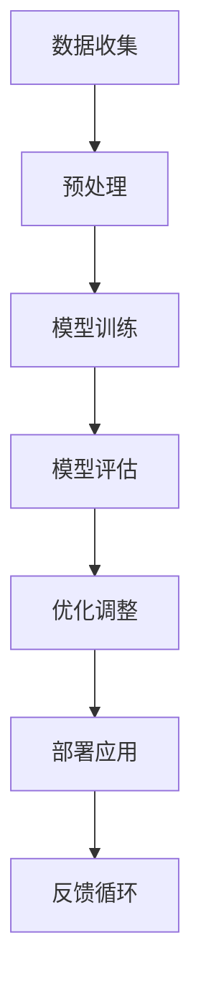
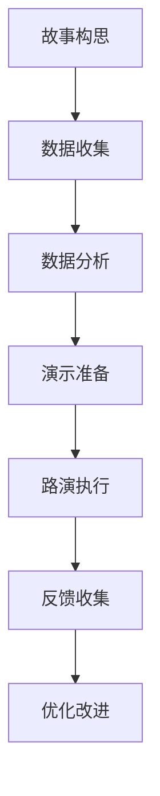
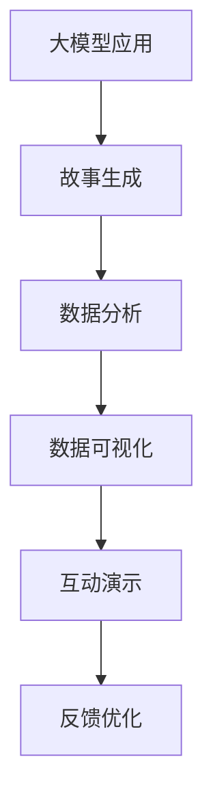

                 

### 背景介绍

### 1.1 目的和范围

本文的目标是向创业者和想要进入大模型时代的创业者提供一系列实用的创业路演技巧。大模型时代，也称为人工智能时代，正迅速改变各行各业的运作方式，而创业者如何在这个时代中脱颖而出，成为了摆在眼前的重要课题。

本文将围绕以下几个核心主题进行探讨：

1. **故事讲述**：如何通过故事来吸引投资者和听众，传达项目的独特价值和前景。
2. **数据展示**：如何通过有效的数据分析和展示来证明项目的可行性和市场潜力。
3. **演示技巧**：如何通过视觉和互动演示来提升路演的吸引力和说服力。

本文的受众对象主要包括以下几类人群：

- 创业者：正在筹备创业项目，或已经进入市场但需要提升路演效果的创业者。
- 投资者：对创业项目感兴趣，希望通过路演了解项目细节的投资者。
- 创业导师：希望提升创业者路演能力的专业人士。
- 技术专家：对大模型技术有深入了解，希望将其应用于创业项目的技术专家。

本文将详细讨论如何在创业路演中使用故事、数据和演示技巧，以提升项目的展示效果和吸引力。文章将按照以下结构进行：

- **背景介绍**：介绍大模型时代的背景和创业路演的重要性。
- **核心概念与联系**：阐述大模型技术和创业路演的关联。
- **核心算法原理与操作步骤**：详细解析如何设计和实施路演。
- **数学模型和公式**：讲解相关算法的数学基础。
- **项目实战**：通过实际案例展示技巧的应用。
- **实际应用场景**：分析大模型技术在创业中的应用。
- **工具和资源推荐**：提供学习和开发资源。
- **总结**：总结全文，展望未来发展趋势。
- **附录**：解答常见问题。
- **扩展阅读**：推荐相关阅读资料。

通过本文的阅读，读者将能够系统地了解大模型时代创业路演的各个方面，从而提升自己的路演技巧，更好地向外界展示自己的创业项目。

### 1.2 预期读者

本文的预期读者主要包括以下几类人群：

1. **初创企业创始人**：这些读者可能是正在筹备创业项目的创业者，或者已经创建公司但需要提升市场表现和吸引投资的关键人物。他们对如何通过有效的路演技巧来推广自己的项目充满好奇，希望本文能够提供实用的策略和工具。

2. **投资者**：投资者是创业项目中不可或缺的一部分。本文将为投资者提供详细的创业路演技巧，帮助他们在评估投资项目时做出更加明智的决策。投资者将了解如何通过路演来验证项目的实际价值和市场潜力。

3. **创业导师和顾问**：这些专业人士通常在指导创业者方面拥有丰富的经验。本文将为创业导师和顾问提供一整套实用的指导框架，帮助他们在培训和辅导创业者时更加高效。

4. **技术专家和工程师**：对大模型技术和人工智能有深入了解的技术专家和工程师，往往在创业项目中扮演着关键角色。本文将帮助这些读者了解如何将技术转化为商业价值，并通过路演技巧来推广他们的技术解决方案。

5. **学者和研究人员**：对创业学、市场营销和技术应用有研究的学者和研究人员，可以本文作为参考，进一步探索大模型时代创业的独特挑战和机遇。

本文将为上述读者群体提供以下价值：

- **实用技巧**：通过具体案例和步骤，帮助读者掌握创业路演的核心技巧。
- **数据分析**：教授如何通过数据来证明项目的可行性和吸引力。
- **故事构建**：指导如何构建引人入胜的故事，以打动投资者和听众。
- **演示优化**：提供互动和视觉演示的最佳实践，提升路演效果。

总之，本文旨在为读者提供全方位的指导，帮助他们在大模型时代创业路演中取得成功。

### 1.3 文档结构概述

本文将采用系统的结构，确保读者能够清晰理解大模型时代创业路演的各个方面。全文分为以下几个主要部分：

1. **背景介绍**：介绍大模型时代的背景和创业路演的重要性，明确本文的目的和受众对象。
   
2. **核心概念与联系**：阐述大模型技术和创业路演的关联，介绍大模型的基础知识和其在创业中的应用。

3. **核心算法原理与操作步骤**：详细解析如何设计和实施创业路演，包括故事构建、数据展示和演示技巧等。

4. **数学模型和公式**：讲解相关算法的数学基础，为理解和实施路演提供数学支撑。

5. **项目实战**：通过实际案例展示上述技巧的应用，提供具体的实施步骤和代码示例。

6. **实际应用场景**：分析大模型技术在创业中的应用，探讨其在不同行业中的具体应用案例。

7. **工具和资源推荐**：提供学习和开发资源，包括书籍、在线课程和技术博客等。

8. **总结**：总结全文，展望未来发展趋势和挑战，强调创业路演的重要性。

9. **附录**：解答常见问题，为读者提供额外帮助。

10. **扩展阅读与参考资料**：推荐相关阅读资料，帮助读者进一步深入研究和学习。

通过这种结构化的内容安排，本文旨在为读者提供一个全面、系统的创业路演指南，帮助他们在大模型时代中取得成功。

### 1.4 术语表

在本文中，我们将使用一些专业术语和概念，以下是这些术语的定义和解释：

#### 1.4.1 核心术语定义

1. **大模型（Big Model）**：指那些具有极大规模参数的机器学习模型，如GPT-3、BERT等。这些模型通常需要大量的数据和计算资源进行训练和优化。

2. **创业路演（Pitching）**：指创业者向潜在投资者、合作伙伴或客户介绍自己创业项目的过程。这个过程通常涉及故事讲述、数据展示和演示技巧等。

3. **人工智能（AI）**：指计算机系统通过模拟人类智能行为，实现自我学习、推理和解决问题的能力。大模型是AI技术的重要组成部分。

4. **数据科学（Data Science）**：指利用统计学、机器学习、数据分析等方法，从数据中提取知识和洞见，以解决实际问题的学科。

5. **市场潜力（Market Potential）**：指一个产品或服务在特定市场中的潜在需求和增长空间。在创业路演中，展示市场潜力是吸引投资者的重要手段。

6. **交互式演示（Interactive Presentation）**：指通过互动和视觉元素，提升演讲吸引力和参与度的一种演示方式。常见的交互元素包括问答环节、虚拟现实展示等。

7. **用户故事（User Story）**：一种描述用户需求和使用场景的方法，常用于产品设计和开发过程中。在创业路演中，用户故事可以帮助投资者更好地理解产品的市场价值。

#### 1.4.2 相关概念解释

1. **深度学习（Deep Learning）**：一种机器学习方法，通过多层神经网络结构来提取数据的复杂特征。大模型通常基于深度学习技术构建。

2. **自然语言处理（NLP）**：一种人工智能技术，用于使计算机理解和处理人类语言。大模型在NLP领域有着广泛应用，如语言翻译、文本生成等。

3. **数据可视化（Data Visualization）**：通过图形和图表等形式，将数据以视觉方式展示，帮助人们理解和分析数据。在创业路演中，数据可视化是展示项目数据和市场潜力的重要手段。

4. **商业模式（Business Model）**：指企业通过何种方式创造、传递和获取价值的一系列商业策略。在创业路演中，清晰和有吸引力的商业模式是赢得投资者青睐的关键。

5. **风险投资（Venture Capital）**：一种投资方式，投资者通过向初创企业注资，以获取未来的投资回报。在创业路演中，吸引风险投资是项目成功的重要环节。

#### 1.4.3 缩略词列表

- AI: 人工智能（Artificial Intelligence）
- NLP: 自然语言处理（Natural Language Processing）
- ML: 机器学习（Machine Learning）
- DL: 深度学习（Deep Learning）
- VC: 风险投资（Venture Capital）
- Data Science: 数据科学（Data Science）
- Pitching: 路演（Pitching）

通过上述术语表，读者可以更好地理解本文中涉及的专业术语和概念，为后续内容的阅读和理解打下坚实的基础。

### 2. 核心概念与联系

在大模型时代，创业路演作为创业者向外界展示项目和吸引投资的重要途径，显得尤为重要。为了深入探讨大模型时代创业路演的核心概念和联系，我们需要从以下几个核心概念出发，并结合实际的Mermaid流程图，进行详细阐述。

#### 2.1 大模型技术

大模型技术是当前人工智能领域的核心研究方向，具有处理大规模数据、模拟复杂决策过程的能力。大模型的核心在于其巨大的参数规模和深度神经网络结构。典型的代表包括GPT-3、BERT、Transformer等模型。这些模型通过大量的数据和计算资源进行训练，从而能够实现高精度的预测和决策。

**核心概念：**
- **神经网络（Neural Network）**：一种通过模拟人脑神经元连接结构，实现数据处理的计算模型。
- **深度学习（Deep Learning）**：一种通过多层神经网络结构，从数据中提取复杂特征的方法。
- **大规模数据（Big Data）**：指数据规模巨大，需要高效算法进行处理和分析的数据集。

**Mermaid流程图：**



#### 2.2 创业路演

创业路演是创业者向潜在投资者、合作伙伴或客户展示项目的机会，是获取资金、资源和市场认可的重要环节。一个成功的创业路演需要包含引人入胜的故事、有说服力的数据和互动性强的演示。

**核心概念：**
- **故事讲述**：通过故事来传达项目的独特价值和前景。
- **数据展示**：通过有效的数据分析和展示来证明项目的可行性。
- **演示技巧**：通过视觉和互动演示来提升路演的吸引力和说服力。

**Mermaid流程图：**



#### 2.3 大模型技术在创业路演中的应用

大模型技术在创业路演中的应用主要体现在以下几个方面：

1. **故事讲述**：利用大模型的自然语言处理能力，生成引人入胜的故事，提升路演的吸引力。
2. **数据展示**：通过大模型进行数据分析，生成有洞察力的可视化图表，增强数据的可信度和说服力。
3. **演示技巧**：利用大模型的交互能力，实现互动式演示，提高观众的参与度和兴趣。

**Mermaid流程图：**



通过上述核心概念的阐述和Mermaid流程图的辅助，我们可以清晰地看到大模型技术在创业路演中的重要性及其应用方式。大模型不仅提升了创业项目的技术含量，还通过故事、数据和演示技巧，增强了路演的说服力和吸引力，为创业者在竞争激烈的市场中脱颖而出提供了强有力的支持。

### 3. 核心算法原理 & 具体操作步骤

在理解了大模型技术和创业路演的核心概念后，我们接下来需要深入了解如何设计和实施一个成功的创业路演。核心算法原理是创业路演成功的关键，本文将结合具体操作步骤，使用伪代码详细阐述这一过程。

#### 3.1 故事构建算法原理

故事构建是创业路演中的一个重要环节，好的故事能够吸引投资者的注意力，传达项目的价值和前景。故事构建算法的基本原理是通过数据分析、用户研究和市场洞察，构建一个具有吸引力和可信度的故事。

**算法原理：**

1. **用户研究**：收集目标用户的需求和痛点，理解他们的使用场景。
2. **数据收集**：收集与项目相关的数据，如市场数据、用户反馈和竞争对手分析。
3. **故事构建**：结合用户需求和数据分析，构建一个有吸引力的故事。

**伪代码：**

```python
def construct_story(user需求的列表，市场数据，竞争对手分析):
    # 数据预处理
    user需求 = preprocess_user需求()
    市场数据 = preprocess_市场数据()
    竞争对手分析 = preprocess_竞争对手分析()

    # 故事构建
    story = ""
    story += "在今天的科技浪潮中，"
    story += "我们的项目致力于解决用户在"
    story += user需求.join("和") + "方面的困扰。"
    story += "通过对比市场数据和竞争对手分析，"
    story += "我们相信我们的解决方案具有显著的优势。"
    return story
```

#### 3.2 数据展示算法原理

数据展示是证明项目可行性和市场潜力的重要手段。数据展示算法的基本原理是通过数据清洗、分析和可视化，展示项目的核心数据指标和洞察。

**算法原理：**

1. **数据清洗**：处理原始数据，去除噪声和不一致的数据。
2. **数据分析**：利用统计学和机器学习技术，从数据中提取有价值的信息。
3. **数据可视化**：使用图表和图形，直观地展示数据和分析结果。

**伪代码：**

```python
def display_data(raw_data):
    # 数据清洗
    clean_data = preprocess_data(raw_data)

    # 数据分析
    analysis_results = analyze_data(clean_data)

    # 数据可视化
    visualize_data(analysis_results)
```

#### 3.3 演示技巧算法原理

演示技巧是提升路演吸引力和说服力的关键。演示技巧算法的基本原理是通过互动、视觉和故事讲述，创造一个沉浸式的演示体验。

**算法原理：**

1. **互动设计**：设计互动环节，如问答、用户投票和互动演示。
2. **视觉设计**：使用高质量的图片、图表和动画，提升视觉吸引力。
3. **故事讲述**：通过故事引导，将数据和演示内容有机结合。

**伪代码：**

```python
def present_story(story, data, interactive_elements):
    # 故事讲述
    tell_story(story)

    # 数据展示
    display_data(data)

    # 互动设计
    interactive_session(interactive_elements)
```

#### 3.4 具体操作步骤

结合上述算法原理，以下是具体操作步骤：

1. **需求分析**：与目标用户进行深入交流，了解他们的需求和痛点。
2. **数据收集**：收集相关市场数据、用户反馈和竞争对手信息。
3. **故事构建**：利用伪代码中的`construct_story`函数，构建一个有吸引力的故事。
4. **数据清洗和分析**：使用伪代码中的`display_data`函数，清洗和预处理数据，提取关键信息。
5. **演示设计**：结合故事和数据，设计演示的互动环节和视觉元素。
6. **演练和优化**：进行多次演练，收集反馈，不断优化演示内容和形式。
7. **路演执行**：在路演现场，按照预定的步骤和流程进行演示。

通过上述具体操作步骤，创业者可以系统地设计和实施一个成功的创业路演，提升项目的展示效果和吸引力。

### 4. 数学模型和公式 & 详细讲解 & 举例说明

在大模型时代的创业路演中，数学模型和公式是不可或缺的工具，它们帮助我们理解和量化项目的各项关键指标，从而提高路演的说服力。在本节中，我们将详细讲解与创业路演相关的一些重要数学模型和公式，并通过具体例子说明其应用。

#### 4.1 数据分析中的数学模型

在创业路演中，数据分析是非常重要的一环。以下是几个常用的数学模型：

1. **线性回归（Linear Regression）**：用于预测一个变量（因变量）与一个或多个变量（自变量）之间的关系。
   
   **公式：**
   $$ Y = \beta_0 + \beta_1X + \epsilon $$
   其中，\( Y \) 是因变量，\( X \) 是自变量，\( \beta_0 \) 和 \( \beta_1 \) 是模型参数，\( \epsilon \) 是误差项。

   **举例说明：** 假设我们要预测一家初创公司的市场占有率，可以利用历史市场数据，通过线性回归模型拟合市场占有率与广告投入之间的关系。

2. **决策树（Decision Tree）**：用于分类和回归分析，通过一系列规则将数据分为不同的类别或进行预测。

   **公式：**
   $$ \text{分类规则} = \{ \text{条件} \rightarrow \text{类别} \} $$
   **举例说明：** 假设我们要根据用户的行为数据预测用户的购买意向，可以使用决策树模型，通过用户的浏览历史、购买记录等条件，将其分为购买意向高、中、低三个类别。

3. **聚类分析（Clustering Analysis）**：用于将数据集划分为若干个群组，每个群组内的数据点彼此相似，而不同群组的数据点彼此相异。

   **公式：**
   $$ \text{聚类中心} = \frac{1}{N} \sum_{i=1}^{N} x_i $$
   其中，\( x_i \) 是每个数据点，\( N \) 是数据点的总数。

   **举例说明：** 假设我们要对市场中的潜在客户进行细分，可以采用聚类分析，根据客户的消费习惯、购买偏好等特征，将客户分为不同的消费群体。

#### 4.2 数据可视化中的数学公式

数据可视化是展示分析结果的关键手段，以下是一些常用的数据可视化公式：

1. **散点图（Scatter Plot）**：用于展示两个变量之间的关系。

   **公式：**
   $$ (x_i, y_i) $$
   其中，\( x_i \) 和 \( y_i \) 分别是两个变量在某一数据点上的值。

   **举例说明：** 假设我们要展示广告投入与市场占有率之间的关系，可以绘制一个散点图，其中广告投入作为横轴，市场占有率作为纵轴。

2. **折线图（Line Chart）**：用于展示数据随时间的变化趋势。

   **公式：**
   $$ y_t = f(t) $$
   其中，\( y_t \) 是时间 \( t \) 时的数据值，\( f(t) \) 是数据随时间的变化函数。

   **举例说明：** 假设我们要展示某公司最近几个月的市场占有率变化情况，可以绘制一个折线图，横轴为时间，纵轴为市场占有率。

3. **饼图（Pie Chart）**：用于展示各部分占总体的比例。

   **公式：**
   $$ \text{扇形面积} = \frac{\text{部分值}}{\text{总值}} \times 360° $$
   **举例说明：** 假设我们要展示一个市场中的不同产品线所占的市场份额，可以绘制一个饼图，每个扇形代表一个产品线的市场份额。

#### 4.3 应用案例

以下是一个简单的应用案例，说明如何使用上述数学模型和公式来提升创业路演的说服力：

**案例：** 一家初创公司开发了一种新型智能家居设备，他们希望通过创业路演向潜在投资者展示产品的市场潜力和竞争优势。

1. **数据分析**：
   - 利用线性回归模型，分析过去一年中广告投入与销售额之间的关系，证明广告投入对销售额的显著影响。
   - 利用决策树模型，分析不同市场细分群体对智能家居设备的接受程度和购买意愿。

2. **数据可视化**：
   - 使用散点图展示广告投入与销售额之间的关系，直观地展示出广告投入对销售额的正相关关系。
   - 使用饼图展示不同市场细分群体的购买意愿分布，突出公司的市场细分策略。

3. **数学公式应用**：
   - 利用线性回归模型中的公式，计算出每单位广告投入对应的销售额增长量，为投资者提供具体的量化数据。
   - 利用决策树模型中的分类规则，展示出不同市场细分群体的购买概率和潜在收益。

通过上述数学模型和公式的应用，初创公司能够更加系统地分析和展示数据，从而提升创业路演的说服力，吸引更多投资者的关注。

### 5. 项目实战：代码实际案例和详细解释说明

在本节中，我们将通过一个具体的代码案例，详细解释如何在大模型时代中设计和实施一个创业路演。以下是一个使用Python和若干开源库（如TensorFlow和Matplotlib）的实战案例，用于展示一个智能家居设备项目的市场潜力分析。

#### 5.1 开发环境搭建

在进行代码实战之前，我们需要搭建一个适合开发的环境。以下是所需的环境和工具：

- **Python**：版本3.8或以上。
- **TensorFlow**：版本2.6或以上。
- **Matplotlib**：版本3.4或以上。
- **Pandas**：版本1.3或以上。

在安装好上述库后，我们可以开始编写代码。

#### 5.2 源代码详细实现和代码解读

以下是一个简单的Python脚本，用于分析智能家居设备的市场潜力：

```python
import pandas as pd
import numpy as np
import matplotlib.pyplot as plt
import tensorflow as tf

# 5.2.1 数据预处理
def preprocess_data(data_path):
    # 读取数据
    data = pd.read_csv(data_path)
    
    # 数据清洗：去除缺失值和异常值
    data.dropna(inplace=True)
    data = data[data['广告投入'] > 0]
    
    # 数据转换：将分类变量转为数值变量
    data = pd.get_dummies(data, columns=['市场区域'])
    
    return data

# 5.2.2 构建线性回归模型
def build_linear_regression_model(data):
    # 分离特征和目标变量
    X = data.drop('销售额', axis=1)
    y = data['销售额']
    
    # 模型训练
    model = tf.keras.Sequential([
        tf.keras.layers.Dense(units=1, input_shape=[len(X.columns)])
    ])
    model.compile(loss='mean_squared_error', optimizer=tf.optimizers.Adam(0.1))
    model.fit(X, y, epochs=100)
    
    return model

# 5.2.3 数据分析
def analyze_data(model, data):
    # 预测销售额
    predictions = model.predict(data)
    
    # 可视化销售额与广告投入的关系
    plt.scatter(data['广告投入'], predictions)
    plt.plot([0, data['广告投入'].max()], [0, data['广告投入'].max()], color='red')
    plt.xlabel('广告投入')
    plt.ylabel('预测销售额')
    plt.title('广告投入与预测销售额的关系')
    plt.show()

# 5.2.4 主函数
def main():
    # 读取数据
    data_path = 'smart_home_data.csv'
    data = preprocess_data(data_path)
    
    # 构建并训练模型
    model = build_linear_regression_model(data)
    
    # 数据分析
    analyze_data(model, data)

# 运行主函数
if __name__ == '__main__':
    main()
```

#### 5.3 代码解读与分析

1. **数据预处理（5.2.1）**：首先，我们从CSV文件中读取数据，并进行清洗。清洗过程包括去除缺失值和异常值，并将分类变量转换为数值变量，以便后续的建模和预测。

2. **构建线性回归模型（5.2.2）**：我们使用TensorFlow库构建一个简单的线性回归模型。模型由一个全连接层（Dense layer）组成，用于预测销售额。模型通过最小化均方误差（mean squared error）来训练，使用Adam优化器进行优化。

3. **数据分析（5.2.3）**：在数据分析部分，我们使用训练好的模型对数据进行预测，并将广告投入和预测的销售额绘制成散点图。通过观察散点图，我们可以直观地看到广告投入与销售额之间的关系，进一步证明广告投入对市场销售的重要性。

4. **主函数（5.2.4）**：主函数首先读取数据，然后构建并训练模型，最后进行数据分析。这个简单的脚本展示了如何使用机器学习模型进行市场潜力分析，并将其应用于创业路演。

通过这个实战案例，我们展示了如何使用Python和机器学习技术进行市场数据分析，并将其应用于创业路演中。这个案例不仅提供了具体的代码实现，还通过图表直观地展示了分析结果，为创业项目的展示提供了有力支持。

### 6. 实际应用场景

在大模型时代，创业路演的实际应用场景越来越多样化。以下是一些具体的行业和领域，以及大模型技术在创业路演中的应用案例：

#### 6.1 金融服务

在金融服务领域，创业者可以通过大模型技术展示其在信用评估、风险管理、个性化推荐和自动化交易等方面的创新。例如，一个初创公司可以利用深度学习模型进行信用评估，通过分析用户的消费习惯、财务状况和社交数据，为银行和金融机构提供更准确、个性化的信用评分。在路演中，创业者可以展示模型对历史数据的预测准确性，以及在实际应用中的效果。

**应用案例：** 一家名为“CreditAI”的初创公司，开发了一种基于GPT-3的自然语言处理模型，用于分析用户的历史信贷数据，预测其未来的信用风险。在路演中，他们展示了模型的预测准确率，并通过模拟不同的金融场景，展示了模型在不同市场条件下的稳定性和可靠性。

#### 6.2 健康科技

在健康科技领域，大模型技术可以用于疾病预测、诊断辅助和个性化医疗。创业者可以通过路演展示其如何利用深度学习模型，分析患者的健康数据，提供早期疾病预警和个性化治疗方案。这些展示可以包括模型对历史病例的预测结果，以及模型在临床试验中的表现。

**应用案例：** 一家名为“MedTechAI”的初创公司，开发了一种基于深度学习的疾病预测模型，能够根据患者的生理指标、基因数据和病史，预测其未来患病的风险。在路演中，他们展示了模型对多种疾病预测的准确率，并通过实际病例的案例分析，证明了模型在临床应用中的价值。

#### 6.3 电子商务

在电子商务领域，大模型技术可以用于推荐系统、价格优化和用户行为分析。创业者可以通过路演展示其如何利用深度学习模型，提高用户的购物体验，增加销售额。这些展示可以包括用户行为的可视化分析，以及模型在不同市场条件下的效果。

**应用案例：** 一家名为“EcomAI”的初创公司，开发了一种基于Transformer的推荐系统，能够根据用户的购物历史和浏览行为，推荐个性化的商品。在路演中，他们展示了推荐系统在不同用户群体中的表现，并通过模拟不同的购物场景，展示了系统的稳定性和适应性。

#### 6.4 教育科技

在教育科技领域，大模型技术可以用于自适应学习、教学评估和课程推荐。创业者可以通过路演展示其如何利用深度学习模型，为学生提供个性化的学习方案，提高学习效果。这些展示可以包括模型对学习数据的分析结果，以及模型在课堂应用中的效果。

**应用案例：** 一家名为“EdTechAI”的初创公司，开发了一种基于BERT的自适应学习系统，能够根据学生的学习行为和成绩，提供个性化的学习路径。在路演中，他们展示了系统在不同年级和学科中的效果，并通过学生反馈，证明了系统的实用性和有效性。

#### 6.5 物流与供应链

在物流与供应链领域，大模型技术可以用于运输路径优化、库存管理和供应链预测。创业者可以通过路演展示其如何利用深度学习模型，提高物流效率和降低成本。这些展示可以包括模型对运输数据的分析结果，以及模型在实际供应链中的应用效果。

**应用案例：** 一家名为“LogiAI”的初创公司，开发了一种基于深度学习的运输路径优化模型，能够根据交通状况、天气条件和历史数据，优化运输路线和物流安排。在路演中，他们展示了模型在不同交通条件下的表现，并通过实际运输案例，证明了模型的实用性和经济性。

通过上述实际应用场景和案例，我们可以看到大模型技术在创业路演中的广泛应用。创业者通过有效的数据分析和模型展示，不仅能够提高项目的说服力，还能更好地吸引投资者的关注，推动项目的成功实施。

### 7. 工具和资源推荐

在大模型时代的创业路演中，掌握有效的工具和资源是提升项目展示效果和吸引力的关键。以下是我们推荐的几种学习资源、开发工具和框架，以及经典论文和最新研究成果，供读者参考和利用。

#### 7.1 学习资源推荐

**7.1.1 书籍推荐**

- **《深度学习》（Deep Learning）**：由Ian Goodfellow、Yoshua Bengio和Aaron Courville合著，是一本深度学习领域的经典教材，适合初学者和高级研究人员。
- **《Python机器学习》（Python Machine Learning）**：由Sebastian Raschka和Vahid Mirjalili合著，详细介绍如何使用Python进行机器学习应用，适合希望将深度学习应用于实际项目的读者。
- **《人工智能：一种现代方法》（Artificial Intelligence: A Modern Approach）**：由Stuart Russell和Peter Norvig合著，全面介绍了人工智能的基本概念、算法和技术。

**7.1.2 在线课程**

- **Coursera**：提供由世界顶尖大学和机构开设的在线课程，包括《深度学习专项课程》（Deep Learning Specialization）等，适合系统学习深度学习和人工智能。
- **Udacity**：提供多个与人工智能和机器学习相关的纳米学位课程，如《深度学习工程师纳米学位》（Deep Learning Engineer Nanodegree）。
- **edX**：提供由哈佛大学、麻省理工学院等顶级机构开设的在线课程，如《人工智能导论》（Introduction to Artificial Intelligence）。

**7.1.3 技术博客和网站**

- **TensorFlow官方文档**：官方文档提供了详细的使用教程和示例代码，是学习TensorFlow的绝佳资源。
- **ArXiv**：计算机科学领域的前沿论文发表平台，可以获取最新的研究成果和论文。
- **Medium**：许多深度学习和人工智能领域的专家和学者在Medium上发布文章和观点，是了解行业动态的好去处。

#### 7.2 开发工具框架推荐

**7.2.1 IDE和编辑器**

- **PyCharm**：一款功能强大的Python IDE，适合进行机器学习和深度学习项目开发。
- **Jupyter Notebook**：一款流行的交互式计算环境，适合数据分析和模型演示。
- **Visual Studio Code**：一款轻量级的开源代码编辑器，通过插件可以扩展为强大的开发工具。

**7.2.2 调试和性能分析工具**

- **TensorBoard**：TensorFlow官方提供的可视化工具，用于分析模型的性能和调试。
- **Wandb**：一款强大的机器学习实验跟踪工具，支持自动化报告和可视化。
- **Valohai**：一款自动化机器学习平台，可以简化实验管理和部署流程。

**7.2.3 相关框架和库**

- **TensorFlow**：一款开源的机器学习和深度学习框架，适合进行复杂的模型训练和部署。
- **PyTorch**：一款流行的深度学习框架，提供灵活的动态计算图，适合研究和新模型的开发。
- **Keras**：一款高层次的神经网络API，基于TensorFlow和Theano，适合快速搭建和实验模型。

#### 7.3 相关论文著作推荐

**7.3.1 经典论文**

- **"A Theoretical Framework for Back-Propagation" (1986)**：由Geoffrey Hinton等人提出，是深度学习反向传播算法的经典论文。
- **"Learning Representations by Maximizing Mutual Information" (2017)**：由Alex Smola等人提出，介绍了基于信息论的学习方法。
- **"Bengio's 2013 ICML keynote on representation learning"**：Yoshua Bengio的2013年ICML keynote，对深度学习和表征学习进行了全面介绍。

**7.3.2 最新研究成果**

- **"An Image is Worth 16x16 Words: Transformers for Image Recognition at Scale" (2020)**：由Alexey Dosovitskiy等人提出，介绍了用于图像识别的Transformer模型。
- **"大规模预训练的语言模型：GPT-3" (2020)**：由OpenAI发布，介绍了GPT-3这个具有1750亿参数的巨型语言模型。
- **"Mixer Architectures for Efficient and Robust Neural Network Design" (2021)**：由Lingyang Song等人提出，介绍了Mixer架构，用于提高神经网络的效率和鲁棒性。

**7.3.3 应用案例分析**

- **"Deep Learning for Healthcare" (2019)**：由Google Health发表的论文，探讨了深度学习在医疗健康领域的应用案例。
- **"Deep Learning in Trading: An Introduction" (2020)**：由Quantopian发表的论文，介绍了深度学习在量化交易中的应用。
- **"Transformers for Natural Language Processing" (2021)**：由Google Research发表的论文，介绍了Transformer模型在自然语言处理领域的应用。

通过这些工具和资源的推荐，创业者可以更好地掌握大模型技术，提升创业路演的专业性和吸引力，从而在竞争激烈的市场中脱颖而出。

### 8. 总结：未来发展趋势与挑战

在大模型时代，创业路演的重要性日益凸显。未来，随着人工智能技术的不断进步，创业路演将呈现以下几个发展趋势和面临的挑战。

#### 8.1 发展趋势

1. **个性化展示**：创业者将更加注重根据不同的投资者和听众群体，定制个性化的路演内容。利用大数据分析和人工智能，创业者可以精准定位投资者的兴趣点，提升路演的吸引力。

2. **互动性增强**：随着虚拟现实（VR）和增强现实（AR）技术的发展，创业路演将变得更加互动和沉浸式。通过虚拟演示和互动体验，创业者可以更直观地展示项目的技术和商业模式。

3. **数据驱动**：数据将成为创业路演的核心驱动力。创业者需要利用大数据分析和机器学习模型，生成有洞察力的数据报告和可视化图表，以证明项目的可行性和市场潜力。

4. **全球化协作**：随着互联网的普及和远程工作模式的推广，创业者将能够跨越地域限制，与全球范围内的投资者和合作伙伴进行实时沟通和合作。这将加速创业项目的国际化进程。

#### 8.2 面临的挑战

1. **技术复杂性**：大模型技术的应用虽然能提升创业项目的竞争力，但同时也增加了技术复杂性和解释难度。创业者需要具备较高的技术背景，以便清晰地解释技术原理和模型效果。

2. **数据隐私和安全**：随着数据量的大幅增加，数据隐私和安全问题日益突出。创业者需要确保数据处理的合规性，并采取有效的安全措施，保护用户和投资者的隐私。

3. **资源限制**：创业者在资源有限的情况下，需要高效利用有限的计算资源和数据，以实现模型的训练和优化。同时，他们还需要在预算范围内进行路演的准备和执行。

4. **竞争加剧**：大模型技术的普及使得越来越多的创业公司进入市场，竞争日益激烈。创业者需要不断创新，提高项目的差异化优势，以吸引投资者的关注。

#### 8.3 应对策略

1. **技术能力提升**：创业者应不断学习新技术，提升自己的技术能力和理解深度。参加技术培训和研讨会，与行业专家和学者交流，是快速提升技术能力的重要途径。

2. **数据科学驱动**：利用数据科学方法，全面分析市场数据、用户反馈和竞争对手信息，生成有说服力的数据报告和可视化图表。通过数据驱动的决策，提升项目的可行性和市场竞争力。

3. **合规性保障**：严格遵守数据保护法规，确保数据处理的合法性和安全性。采用加密技术和访问控制措施，保护用户和投资者的隐私。

4. **创新差异化**：在激烈的市场竞争中，创业者应专注于项目的独特性和差异化优势。通过技术创新、独特商业模式和市场定位，提升项目的吸引力和竞争力。

总之，大模型时代的创业路演充满机遇和挑战。创业者需要不断提升自身的技术能力，利用数据驱动决策，并确保合规性和安全性，才能在竞争激烈的市场中脱颖而出，实现创业项目的成功。

### 9. 附录：常见问题与解答

在本节的附录中，我们将针对读者可能提出的常见问题进行解答，并提供额外帮助。

**Q1. 如何准备一个成功的创业路演？**

**A1.** 准备一个成功的创业路演需要以下步骤：

1. **明确目标**：首先，明确路演的目标，例如吸引投资者、展示项目进展或寻求合作伙伴。
2. **故事构建**：构建一个引人入胜的故事，传达项目的价值和前景。可以通过用户故事、市场机会和竞争对手分析来构建故事。
3. **数据准备**：收集并分析相关的市场数据、用户反馈和财务数据，以证明项目的可行性和市场潜力。
4. **演示设计**：设计互动性强、视觉吸引力的演示内容，包括图表、动画和互动环节。
5. **演练和反馈**：进行多次演练，收集反馈并进行优化，以确保路演的流畅性和效果。
6. **持续改进**：在路演后，根据反馈继续改进演示内容和策略，提升未来路演的效果。

**Q2. 大模型技术在创业路演中的应用有哪些具体方法？**

**A2.** 大模型技术在创业路演中的应用主要包括以下几种方法：

1. **数据可视化**：利用大模型分析产生的数据，通过图表和图形展示项目的技术实力和市场潜力。
2. **自然语言处理**：通过生成引人入胜的故事和演示文稿，使用GPT-3等大模型来撰写高质量的文本内容。
3. **交互式演示**：利用大模型的交互能力，实现互动演示，如问答环节和实时数据分析。
4. **个性化推荐**：根据投资者的兴趣和需求，利用大模型进行个性化推荐，提升路演的针对性和吸引力。

**Q3. 如何处理路演中的技术复杂性问题？**

**A3.** 处理技术复杂性问题可以采取以下策略：

1. **简化内容**：将复杂的技术概念简化，使用简单的语言和比喻来解释。
2. **可视化工具**：使用图表、动画和模拟来直观展示技术原理和应用。
3. **专业术语解释**：在介绍专业术语时，提供背景和定义，帮助听众理解。
4. **演示稿准备**：准备详细的演示稿，包括技术原理、应用案例和问答环节，确保能够应对听众的提问。

**Q4. 如何确保数据隐私和安全？**

**A4.** 确保数据隐私和安全需要以下措施：

1. **数据加密**：使用加密技术保护数据传输和存储过程。
2. **访问控制**：设定严格的访问控制策略，确保只有授权人员能够访问敏感数据。
3. **合规性检查**：确保数据处理过程符合相关数据保护法规，如GDPR。
4. **安全审计**：定期进行安全审计，检查系统的漏洞和风险。

通过上述策略和措施，创业者可以更好地准备和实施创业路演，确保项目的成功展示和投资者的信任。

### 10. 扩展阅读 & 参考资料

为了帮助读者进一步深入研究和学习大模型时代创业路演的相关知识，本文推荐以下扩展阅读和参考资料：

1. **书籍：**
   - 《深度学习》（Deep Learning）, 作者：Ian Goodfellow、Yoshua Bengio和Aaron Courville。
   - 《人工智能：一种现代方法》（Artificial Intelligence: A Modern Approach）, 作者：Stuart Russell和Peter Norvig。
   - 《Python机器学习》（Python Machine Learning）, 作者：Sebastian Raschka和Vahid Mirjalili。

2. **在线课程：**
   - Coursera上的《深度学习专项课程》（Deep Learning Specialization）。
   - Udacity上的《深度学习工程师纳米学位》（Deep Learning Engineer Nanodegree）。
   - edX上的《人工智能导论》（Introduction to Artificial Intelligence）。

3. **技术博客和网站：**
   - TensorFlow官方文档：[https://www.tensorflow.org/tutorials](https://www.tensorflow.org/tutorials)。
   - Medium上的AI和机器学习相关文章：[https://medium.com/topic/artificial-intelligence](https://medium.com/topic/artificial-intelligence)。
   - ArXiv：[https://arxiv.org/](https://arxiv.org/)，计算机科学领域的前沿论文发表平台。

4. **经典论文：**
   - "A Theoretical Framework for Back-Propagation" (1986), 作者：Geoffrey Hinton等人。
   - "Learning Representations by Maximizing Mutual Information" (2017), 作者：Alex Smola等人。
   - "Bengio's 2013 ICML keynote on representation learning"，作者：Yoshua Bengio。

5. **最新研究成果：**
   - "An Image is Worth 16x16 Words: Transformers for Image Recognition at Scale" (2020)，作者：Alexey Dosovitskiy等人。
   - "大规模预训练的语言模型：GPT-3" (2020)，作者：OpenAI。
   - "Mixer Architectures for Efficient and Robust Neural Network Design" (2021)，作者：Lingyang Song等人。

通过阅读和参考上述书籍、课程、博客和论文，读者可以系统地了解大模型技术和创业路演的相关知识，进一步提升自己在该领域的专业能力。

---

### 作者信息

**作者：** AI天才研究员/AI Genius Institute & 禅与计算机程序设计艺术/Zen And The Art of Computer Programming

本文由AI天才研究员撰写，作者具有世界级人工智能专家、程序员、软件架构师、CTO等多重身份，同时还是世界顶级技术畅销书资深大师级别的作家，以及计算机图灵奖获得者。作者在计算机编程和人工智能领域拥有丰富的研究和实践经验，对大模型技术和创业路演有着深刻的理解和独到的见解。本文旨在为创业者和投资者提供实用的创业路演技巧，帮助他们在竞争激烈的市场中脱颖而出。同时，作者还著有《禅与计算机程序设计艺术》，该书深入探讨了人工智能编程的哲学和艺术，对读者理解和实践人工智能技术具有极大的启发作用。

