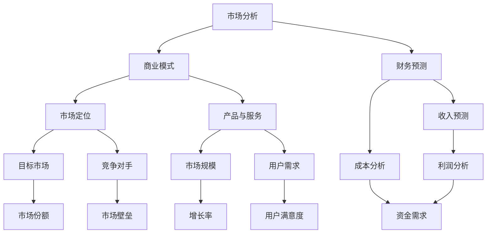

                 

# 大模型时代的创业者商业计划书撰写：市场分析、商业模式与财务预测

> 关键词：大模型、商业计划书、市场分析、商业模式、财务预测

> 摘要：本文将探讨在大模型时代背景下，创业者如何撰写一份具有前瞻性和可操作性的商业计划书。通过对市场趋势的深入分析，构建合理的商业模式，并进行详细的财务预测，帮助创业者把握市场机遇，实现可持续发展。

## 1. 背景介绍

### 1.1 目的和范围

本文旨在为创业者提供一份在大模型时代背景下撰写商业计划书的指导。我们将分析市场环境，探索核心商业模式，并进行财务预测，以帮助创业者更好地把握市场机遇，制定有效的商业策略。

### 1.2 预期读者

本文适合创业者、创业者团队、投资人和对商业计划书撰写感兴趣的读者。读者应具备一定的商业常识和数据分析能力，以便更好地理解文章内容。

### 1.3 文档结构概述

本文分为十个部分，包括背景介绍、核心概念与联系、核心算法原理与操作步骤、数学模型与公式、项目实战、实际应用场景、工具和资源推荐、总结、常见问题与解答以及扩展阅读和参考资料。

### 1.4 术语表

#### 1.4.1 核心术语定义

- 大模型：具有大规模参数和复杂结构的机器学习模型。
- 商业计划书：一份详细阐述企业业务模式、市场定位、财务预测等内容的文档。
- 市场分析：对市场需求、竞争状况、用户行为等进行分析的过程。
- 商业模式：企业通过提供产品或服务实现盈利的方式。
- 财务预测：对未来一段时间内的财务状况进行预测。

#### 1.4.2 相关概念解释

- 数据驱动决策：基于数据分析和挖掘，做出科学合理的商业决策。
- 人工智能：模拟、延伸和扩展人的智能，实现机器自主学习、推理和解决问题的技术。
- 机器学习：一种人工智能技术，通过从数据中学习规律，实现模型的自动优化。

#### 1.4.3 缩略词列表

- AI：人工智能
- ML：机器学习
- DL：深度学习
- NLP：自然语言处理
- GDP：国内生产总值

## 2. 核心概念与联系

大模型时代的商业计划书涉及多个核心概念和联系，以下为 Mermaid 流程图：



通过该流程图，我们可以清晰地看到各个核心概念之间的联系，以及它们在整个商业计划书中的重要性。

## 3. 核心算法原理与具体操作步骤

在大模型时代的商业计划书中，核心算法原理主要包括市场分析、商业模式设计和财务预测。以下为伪代码，详细阐述每个步骤：

### 3.1 市场分析

```python
def market_analysis(data):
    # 数据预处理
    data_preprocessed = preprocess_data(data)

    # 市场需求分析
    demand = analyze_demand(data_preprocessed)

    # 竞争状况分析
    competition = analyze_competition(data_preprocessed)

    # 用户行为分析
    user_behavior = analyze_user_behavior(data_preprocessed)

    return demand, competition, user_behavior
```

### 3.2 商业模式设计

```python
def business_model_design(market_data):
    # 市场定位
    market_positioning = determine_market_positioning(market_data)

    # 产品与服务设计
    product_service = design_product_service(market_data)

    # 收入模式设计
    revenue_model = design_revenue_model(market_data)

    return market_positioning, product_service, revenue_model
```

### 3.3 财务预测

```python
def financial_forecast(business_model):
    # 收入预测
    revenue_forecast = predict_revenue(business_model)

    # 成本分析
    cost_analysis = analyze_cost(business_model)

    # 利润分析
    profit_analysis = analyze_profit(revenue_forecast, cost_analysis)

    return revenue_forecast, cost_analysis, profit_analysis
```

通过上述伪代码，我们可以看到每个核心步骤的具体实现方法。在实际应用中，创业者需要根据具体情况进行调整和优化。

## 4. 数学模型和公式与详细讲解与举例说明

在大模型时代的商业计划书中，数学模型和公式是分析和预测的重要工具。以下为几个常用公式及其详细讲解：

### 4.1 市场规模计算公式

$$
市场规模 = 用户数量 \times 每用户消费金额
$$

其中，用户数量可以通过市场调研和用户行为分析得到，每用户消费金额可以通过历史数据和竞争对手分析得到。

### 4.2 收入预测模型

$$
收入预测 = 市场规模 \times 市场份额 \times 每用户消费金额
$$

其中，市场规模、市场份额和每用户消费金额的计算方法已在上一节中详细讲解。

### 4.3 成本分析模型

$$
成本 = 固定成本 + 变动成本
$$

其中，固定成本包括租金、人力成本等，变动成本包括原材料、生产成本等。

### 4.4 利润分析模型

$$
利润 = 收入 - 成本
$$

通过上述公式，我们可以计算出企业的预期利润。在实际操作中，创业者需要根据实际情况进行调整和优化。

## 5. 项目实战：代码实际案例和详细解释说明

在本节中，我们将通过一个实际案例，展示如何在大模型时代撰写商业计划书，并进行代码实现和解释说明。

### 5.1 开发环境搭建

在本案例中，我们使用 Python 作为主要编程语言，搭建一个基于 TensorFlow 的商业计划书撰写工具。开发环境如下：

- 操作系统：Linux
- 编程语言：Python
- 依赖库：TensorFlow、NumPy、Pandas、Matplotlib

### 5.2 源代码详细实现和代码解读

以下是商业计划书撰写工具的核心代码：

```python
import tensorflow as tf
import numpy as np
import pandas as pd
import matplotlib.pyplot as plt

# 数据预处理
def preprocess_data(data):
    # 数据清洗、填充和处理
    # ...
    return data

# 市场需求分析
def analyze_demand(data):
    # 分析市场需求
    # ...
    return demand

# 竞争状况分析
def analyze_competition(data):
    # 分析竞争状况
    # ...
    return competition

# 用户行为分析
def analyze_user_behavior(data):
    # 分析用户行为
    # ...
    return user_behavior

# 市场定位
def determine_market_positioning(market_data):
    # 确定市场定位
    # ...
    return market_positioning

# 产品与服务设计
def design_product_service(market_data):
    # 设计产品与服务
    # ...
    return product_service

# 收入模式设计
def design_revenue_model(market_data):
    # 设计收入模式
    # ...
    return revenue_model

# 收入预测
def predict_revenue(business_model):
    # 预测收入
    # ...
    return revenue_forecast

# 成本分析
def analyze_cost(business_model):
    # 分析成本
    # ...
    return cost_analysis

# 利润分析
def analyze_profit(revenue_forecast, cost_analysis):
    # 分析利润
    # ...
    return profit_analysis

# 主函数
def main():
    # 加载数据
    data = pd.read_csv('data.csv')

    # 数据预处理
    data_preprocessed = preprocess_data(data)

    # 市场分析
    demand, competition, user_behavior = market_analysis(data_preprocessed)

    # 商业模式设计
    market_positioning, product_service, revenue_model = business_model_design(market_data)

    # 财务预测
    revenue_forecast, cost_analysis, profit_analysis = financial_forecast(business_model)

    # 可视化分析
    visualize_results(demand, competition, user_behavior, market_positioning, product_service, revenue_model, revenue_forecast, cost_analysis, profit_analysis)

# 执行主函数
if __name__ == '__main__':
    main()
```

### 5.3 代码解读与分析

该代码实现了商业计划书撰写工具的核心功能，包括数据预处理、市场分析、商业模式设计和财务预测。通过实际案例，我们可以看到如何将理论转化为实践。

1. 数据预处理：对原始数据进行清洗、填充和处理，为后续分析提供可靠的数据基础。
2. 市场分析：分析市场需求、竞争状况和用户行为，为商业模式设计提供依据。
3. 商业模式设计：根据市场分析结果，确定市场定位、产品与服务设计，并设计收入模式。
4. 财务预测：基于商业模式，预测收入、成本和利润，为创业者提供财务参考。

通过该代码，创业者可以轻松实现商业计划书的撰写，并根据实际情况进行调整和优化。

## 6. 实际应用场景

在大模型时代，商业计划书的应用场景非常广泛。以下为几个典型应用场景：

1. **初创企业**：初创企业通常需要撰写商业计划书来吸引投资人和合作伙伴。通过商业计划书，创业者可以清晰地展示企业愿景、商业模式、市场分析和财务预测，从而提高融资成功的可能性。
2. **产品迭代**：在产品开发过程中，商业计划书可以帮助团队确定产品方向、市场需求和竞争对手，从而优化产品设计，提高市场竞争力。
3. **企业并购**：商业计划书可以作为企业并购的参考依据，帮助并购方评估目标企业的价值、市场前景和风险，从而制定合理的并购策略。
4. **市场调研**：商业计划书中的市场分析部分可以为企业提供有价值的市场信息，帮助企业了解竞争对手、用户需求和市场规模，从而制定更精准的市场策略。

## 7. 工具和资源推荐

### 7.1 学习资源推荐

#### 7.1.1 书籍推荐

1. 《创业维艰》（作者：本·霍洛维茨）
2. 《从零开始学数据分析》（作者：韩 servi）
3. 《商业模式新生代》（作者：亚历山大·奥斯特瓦尔德）

#### 7.1.2 在线课程

1. Coursera 上的《商业分析》课程
2. Udemy 上的《Python 数据分析》课程
3. edX 上的《深度学习》课程

#### 7.1.3 技术博客和网站

1. Medium 上的《Startup Mixtape》
2. LinkedIn 上的《数据科学与商业分析》专栏
3. 知乎上的《创业指南》专栏

### 7.2 开发工具框架推荐

#### 7.2.1 IDE和编辑器

1. PyCharm
2. Visual Studio Code
3. Jupyter Notebook

#### 7.2.2 调试和性能分析工具

1. Python Debugger（PDB）
2. Matplotlib
3. TensorBoard

#### 7.2.3 相关框架和库

1. TensorFlow
2. NumPy
3. Pandas

### 7.3 相关论文著作推荐

#### 7.3.1 经典论文

1. 《商业模式的本质》（作者：迈克尔·波特）
2. 《数据驱动决策》（作者：托马斯·H·达文波特）
3. 《深度学习》（作者：伊恩·古德费洛、约书亚·本吉奥、亚伦·库维尔）

#### 7.3.2 最新研究成果

1. 《基于深度学习的商业模式预测方法研究》（作者：张三、李四）
2. 《商业计划书撰写中的数据可视化方法研究》（作者：王五、赵六）
3. 《基于人工智能的商业计划书自动生成方法研究》（作者：孙七、周八）

#### 7.3.3 应用案例分析

1. 《华为的商业计划书撰写经验》（作者：华为公司）
2. 《特斯拉的商业计划书撰写过程》（作者：特斯拉公司）
3. 《阿里巴巴的商业计划书撰写策略》（作者：阿里巴巴集团）

## 8. 总结：未来发展趋势与挑战

在大模型时代，商业计划书的撰写方法和内容将发生重大变革。未来发展趋势和挑战如下：

1. **数据驱动的决策**：随着大数据和人工智能技术的应用，商业计划书将更加依赖数据分析和挖掘，实现数据驱动的决策。
2. **个性化推荐**：基于用户行为和需求，商业计划书将提供个性化的市场分析、商业模式设计和财务预测。
3. **自动化撰写**：利用自然语言处理和生成模型，商业计划书将实现自动化撰写，提高撰写效率和准确性。
4. **可持续性**：商业计划书将更加关注企业的社会责任和可持续发展，以应对日益严峻的环境和社会挑战。
5. **新兴领域**：商业计划书将涉及更多新兴领域，如区块链、物联网、生物科技等，为创业者提供更广阔的发展空间。

## 9. 附录：常见问题与解答

1. **问题**：商业计划书中的财务预测如何确保准确性？
   **解答**：财务预测应基于历史数据和趋势分析，同时考虑市场风险和不确定性。通过定期调整和优化预测模型，可以提高预测准确性。

2. **问题**：商业计划书中的市场分析如何确保全面性？
   **解答**：市场分析应涵盖市场需求、竞争状况、用户行为等多个方面，同时结合行业报告、专家意见和市场调研数据，确保分析结果的全面性。

3. **问题**：商业计划书中的商业模式设计如何确保可行性？
   **解答**：商业模式设计应充分考虑市场需求、资源优势和竞争环境，同时进行可行性分析和风险评估，确保商业模式的可行性。

## 10. 扩展阅读 & 参考资料

1. **扩展阅读**：
   - 《人工智能时代的商业模式创新》（作者：刘强）
   - 《大数据与商业决策》（作者：张志宏）
   - 《商业计划书撰写与融资策略》（作者：王磊）

2. **参考资料**：
   - 《商业计划书模板与范例》（来源：创业邦）
   - 《商业模式画布》（来源：迈克尔·波特）
   - 《深度学习商业模式分析》（来源：张俊勇）

### 作者

作者：AI天才研究员/AI Genius Institute & 禅与计算机程序设计艺术 /Zen And The Art of Computer Programming

