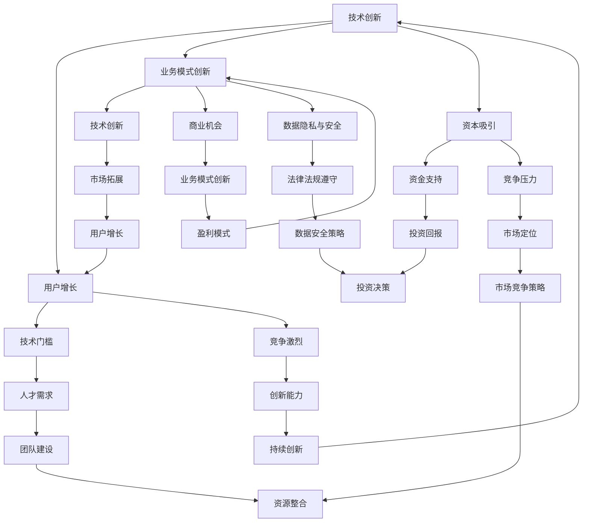

                 

# 大模型时代的创业者谈判策略：利益平衡与共赢思维

> 关键词：大模型、创业者、谈判策略、利益平衡、共赢思维
>
> 摘要：本文旨在探讨大模型时代背景下，创业者如何运用谈判策略来实现利益平衡与共赢。文章首先介绍了大模型的基本概念和当前发展状况，随后分析了创业者面临的挑战和机遇，并详细阐述了利益平衡与共赢思维的核心理念。在此基础上，文章提出了一系列实用的谈判策略和具体操作步骤，并通过实际案例进行了详细解释。最后，文章总结了未来发展趋势与挑战，并提供了相关工具和资源推荐，以期为创业者提供有益的指导。

## 1. 背景介绍

### 1.1 目的和范围

本文的目的在于探讨在大模型时代，创业者如何通过有效的谈判策略来平衡各方利益，实现共赢发展。随着人工智能技术的不断进步，大模型在各个领域得到广泛应用，为创业者提供了前所未有的机遇。然而，与此同时，创业者也面临着前所未有的挑战，如技术竞争、资源争夺、市场不确定性等。因此，如何在这场竞赛中取得优势，实现可持续发展，成为创业者需要深思的问题。

本文的范围主要涉及以下几个方面：
1. 大模型的定义、分类及其发展历程。
2. 创业者在大模型时代面临的挑战和机遇。
3. 利益平衡与共赢思维的核心理念。
4. 创业者谈判策略的具体实施步骤。
5. 实际应用案例和策略分析。

### 1.2 预期读者

本文的预期读者包括以下几类：
1. 创业者：特别是那些正在或计划进入人工智能领域的创业者，希望能够通过本文了解到谈判策略在大模型时代的重要性，并学会如何运用这些策略来实现利益平衡和共赢。
2. 投资者：对于希望投资人工智能项目的投资者，本文提供了关于创业者谈判策略的深入分析，有助于他们更好地评估创业项目的风险和潜力。
3. 研究人员：本文也适用于对人工智能技术有研究兴趣的研究人员，可以从中了解到当前大模型技术的发展现状以及创业者面临的实际挑战。

### 1.3 文档结构概述

本文分为八个主要部分：
1. 引言：介绍文章的背景、目的和预期读者。
2. 大模型时代：介绍大模型的基本概念、分类和发展历程。
3. 创业者面临的挑战：分析大模型时代创业者面临的挑战和机遇。
4. 利益平衡与共赢思维：阐述利益平衡与共赢思维的核心理念。
5. 谈判策略：提出具体的谈判策略，包括利益分析、沟通技巧、决策制定等。
6. 实际应用案例：通过实际案例详细解释谈判策略的应用。
7. 总结与展望：总结文章的主要观点，并对未来发展趋势进行展望。
8. 附录：提供常见问题与解答，以及扩展阅读和参考资料。

### 1.4 术语表

#### 1.4.1 核心术语定义

- **大模型**：指那些具有巨大规模、复杂结构和强大计算能力的机器学习模型。
- **创业者**：指创立或参与创立企业，承担风险并追求商业成功的人。
- **利益平衡**：指在谈判过程中，通过合理分配资源，使各方利益得到最大化。
- **共赢思维**：指在谈判中，强调合作、共赢和持续发展，而非零和博弈。

#### 1.4.2 相关概念解释

- **人工智能**：指通过计算机模拟人类的智能行为，实现自动化决策和智能交互的技术。
- **机器学习**：指通过算法和模型，让计算机从数据中学习和发现规律，从而实现自动预测和决策的技术。
- **深度学习**：一种人工智能的方法，通过多层神经网络模拟人类大脑的神经元结构，实现对数据的自动学习和特征提取。

#### 1.4.3 缩略词列表

- **AI**：人工智能
- **ML**：机器学习
- **DL**：深度学习
- **NPV**：净现值（Net Present Value）
- **ROI**：投资回报率（Return on Investment）

## 2. 核心概念与联系

为了更好地理解大模型时代创业者谈判策略的背景和基础，我们需要先明确一些核心概念，并探讨它们之间的联系。

### 大模型的定义与分类

大模型（Large Models）是指在数据规模、计算资源和模型复杂度上远超传统模型的机器学习模型。根据其用途和结构，大模型可以分为以下几类：

1. **语言模型**：如GPT-3，BERT等，主要用于自然语言处理任务，具有极强的语言理解和生成能力。
2. **图像模型**：如ResNet、VGG等，用于图像识别和生成任务，具有出色的视觉理解能力。
3. **多模态模型**：如ViT、Dall-E等，能够处理多种类型的数据，如文本、图像和音频，实现跨模态信息融合。

### 大模型的发展历程

大模型的发展经历了以下几个阶段：

1. **初期探索**（2010年前）：以传统的统计学习和规则为基础，模型规模较小，计算资源有限。
2. **深度学习崛起**（2010-2015年）：深度学习技术取得突破性进展，模型规模和计算需求大幅提升。
3. **大模型时代**（2015年至今）：随着计算资源的增加和数据量的爆炸式增长，大模型得到广泛应用，并在各个领域取得显著成果。

### 大模型与创业者的关系

大模型为创业者提供了以下机遇：

1. **技术创新**：创业者可以利用大模型实现前所未有的技术创新，提高产品竞争力。
2. **商业机会**：大模型在金融、医疗、教育、娱乐等多个领域的应用，为创业者创造了丰富的商业机会。
3. **资本吸引**：大模型的研发和商业化吸引了大量风险投资，为创业者提供了充足的资金支持。

然而，创业者也面临以下挑战：

1. **技术门槛**：大模型的研发需要强大的计算资源和专业人才，创业者需要投入大量资源。
2. **竞争激烈**：随着大模型技术的普及，市场竞争日益激烈，创业者需要不断创新以保持领先。
3. **数据隐私与安全**：大模型对数据依赖性强，如何保障用户数据隐私和安全成为重要课题。

### 核心概念架构

下面是关于大模型、创业者、谈判策略等核心概念之间的Mermaid流程图：



### 核心算法原理与具体操作步骤

#### 大模型训练算法

大模型的训练主要依赖于以下算法：

1. **反向传播算法**（Backpropagation）：通过计算损失函数关于模型参数的梯度，更新模型参数，以最小化损失函数。
2. **优化算法**（Optimization Algorithms）：如随机梯度下降（SGD）、Adam等，用于调整模型参数，加速收敛。
3. **正则化方法**（Regularization Methods）：如L1正则化、L2正则化等，用于防止过拟合。

以下是训练大模型的基本步骤：

```plaintext
1. 数据预处理：清洗和规范化数据，分为训练集、验证集和测试集。
2. 模型初始化：初始化模型参数，通常使用随机初始化。
3. 梯度计算：计算损失函数关于模型参数的梯度。
4. 参数更新：根据梯度更新模型参数。
5. 验证和调整：使用验证集评估模型性能，根据性能调整模型结构或参数。
6. 测试：使用测试集评估模型性能，确保模型具有较好的泛化能力。
```

#### 大模型应用案例

以下是一个大模型在自然语言处理任务中的应用案例：

```plaintext
1. 数据集准备：收集并整理大规模文本数据，如新闻文章、社交媒体帖子等。
2. 预训练：使用大量文本数据进行预训练，使模型具备语言理解和生成能力。
3. 微调：在特定任务上进行微调，如文本分类、情感分析等。
4. 应用：将微调后的模型应用于实际任务，如自动生成文章摘要、回答用户提问等。
5. 评估：使用测试集评估模型性能，优化模型参数以提升性能。
```

### 数学模型与公式

#### 损失函数

在机器学习中，损失函数用于衡量模型预测值与真实值之间的差异。一个常见的是均方误差（MSE）：

$$
MSE = \frac{1}{m} \sum_{i=1}^{m} (y_i - \hat{y}_i)^2
$$

其中，$m$ 是样本数量，$y_i$ 是真实值，$\hat{y}_i$ 是模型预测值。

#### 优化算法

随机梯度下降（SGD）是一种常用的优化算法，其更新公式如下：

$$
\theta_{t+1} = \theta_t - \alpha \cdot \nabla_\theta J(\theta)
$$

其中，$\theta$ 是模型参数，$\alpha$ 是学习率，$J(\theta)$ 是损失函数。

### 5. 项目实战：代码实际案例和详细解释说明

#### 5.1 开发环境搭建

为了实现大模型的训练和应用，我们需要搭建一个合适的开发环境。以下是基本的步骤：

1. **硬件环境**：配置高性能的GPU或TPU，以支持大模型训练。
2. **软件环境**：安装Python、CUDA、PyTorch等必要的开发工具。
3. **代码环境**：克隆或下载大模型的开源代码，如GPT-3、BERT等。

#### 5.2 源代码详细实现和代码解读

以下是一个基于GPT-3的文本生成模型的源代码实现：

```python
import torch
import torch.nn as nn
import torch.optim as optim
from torch.utils.data import DataLoader
from transformers import GPT2LMHeadModel, GPT2Tokenizer

# 加载预训练模型和分词器
model = GPT2LMHeadModel.from_pretrained('gpt2')
tokenizer = GPT2Tokenizer.from_pretrained('gpt2')

# 数据预处理
def preprocess_text(text):
    return tokenizer.encode(text, return_tensors='pt')

# 训练函数
def train(model, data_loader, optimizer, loss_function):
    model.train()
    for batch in data_loader:
        inputs = preprocess_text(batch['text'])
        labels = preprocess_text(batch['label'])
        optimizer.zero_grad()
        outputs = model(inputs, labels=labels)
        loss = loss_function(outputs.logits, labels)
        loss.backward()
        optimizer.step()

# 模型评估
def evaluate(model, data_loader, loss_function):
    model.eval()
    with torch.no_grad():
        for batch in data_loader:
            inputs = preprocess_text(batch['text'])
            labels = preprocess_text(batch['label'])
            outputs = model(inputs, labels=labels)
            loss = loss_function(outputs.logits, labels)
            print(f'Validation Loss: {loss.item()}')

# 训练和评估
optimizer = optim.Adam(model.parameters(), lr=0.001)
train_loader = DataLoader(train_dataset, batch_size=32, shuffle=True)
val_loader = DataLoader(val_dataset, batch_size=32, shuffle=False)
for epoch in range(10):
    train(model, train_loader, optimizer, nn.CrossEntropyLoss())
    evaluate(model, val_loader, nn.CrossEntropyLoss())
```

#### 5.3 代码解读与分析

1. **模型加载**：首先加载预训练的GPT-3模型和分词器。
2. **数据预处理**：定义数据预处理函数，将文本编码为Tensor。
3. **训练函数**：实现模型训练过程，包括前向传播、损失计算和反向传播。
4. **模型评估**：实现模型评估过程，计算验证集上的损失。
5. **训练和评估**：使用DataLoader加载训练数据和验证数据，进行模型训练和评估。

通过这个实际案例，我们可以看到如何在大模型时代利用Python和深度学习框架PyTorch实现文本生成模型。创业者可以通过类似的框架和代码实现自己的创新应用，抢占市场先机。

### 6. 实际应用场景

#### 大模型在金融领域的应用

在大模型时代，金融领域成为大模型技术的重要应用场景之一。以下是一些具体的应用案例：

1. **股票市场预测**：利用大模型分析历史股票价格数据，预测未来市场走势。通过深度学习和自然语言处理技术，对财经新闻、财报等文本数据进行分析，提取关键信息，实现股票市场的自动化预测。
2. **风险评估**：大模型可以处理海量的客户数据，如信用记录、消费行为等，通过机器学习算法进行风险评估，帮助金融机构识别潜在的风险客户，优化信用评估模型。
3. **量化交易**：大模型在量化交易中具有重要作用，通过分析历史交易数据和市场动态，生成高收益的交易策略。结合自然语言处理技术，对财经新闻、政策变化等进行实时分析，及时调整交易策略。
4. **客户服务**：大模型可以应用于智能客服系统，通过语音识别和自然语言理解技术，实现与客户的智能对话，提高客户服务水平。

#### 大模型在医疗领域的应用

大模型在医疗领域的应用也取得了显著进展，以下是一些具体的应用案例：

1. **疾病诊断**：通过分析医疗影像数据，如X光片、CT扫描等，大模型可以实现高精度的疾病诊断。结合深度学习和卷积神经网络技术，对医学图像进行特征提取和分类，提高诊断准确性。
2. **基因组分析**：大模型可以处理海量的基因组数据，通过机器学习算法，识别基因突变和遗传疾病。这有助于早期发现疾病，制定个性化的治疗方案。
3. **药物研发**：大模型在药物研发中具有重要作用，通过分析分子结构、生物活性等数据，预测药物的疗效和副作用。这有助于加快药物研发进程，降低研发成本。
4. **健康监测**：大模型可以应用于健康监测系统，通过分析用户的行为数据和生理数据，如心率、睡眠质量等，提供个性化的健康建议和预警。

#### 大模型在营销领域的应用

大模型在营销领域也具有广泛的应用，以下是一些具体的应用案例：

1. **客户细分**：通过分析用户的购买行为、浏览记录等数据，大模型可以实现精准的客户细分。这有助于企业制定差异化的营销策略，提高客户满意度。
2. **个性化推荐**：大模型可以应用于个性化推荐系统，通过对用户的兴趣和行为进行分析，推荐符合用户需求的商品或服务。这有助于提升用户体验，增加销售额。
3. **广告投放**：大模型可以帮助企业优化广告投放策略，通过分析用户的兴趣和行为，确定最佳的广告投放渠道和时机。这有助于提高广告的转化率，降低广告成本。
4. **品牌传播**：大模型可以应用于品牌传播，通过对社交媒体上的用户评论和舆情进行分析，监测品牌形象和市场趋势。这有助于企业及时调整品牌策略，提升品牌知名度。

### 7. 工具和资源推荐

#### 7.1 学习资源推荐

**7.1.1 书籍推荐**

1. **《深度学习》（Deep Learning）**：由Ian Goodfellow、Yoshua Bengio和Aaron Courville所著，是深度学习领域的经典教材，适合初学者和高级研究者。
2. **《Python深度学习》（Python Deep Learning）**：由François Chollet所著，介绍了使用Python和TensorFlow实现深度学习的方法，适合有一定编程基础的读者。
3. **《强化学习》（Reinforcement Learning: An Introduction）**：由Richard S. Sutton和Barto，Andrew G.所著，介绍了强化学习的基本原理和应用。

**7.1.2 在线课程**

1. **《吴恩达深度学习专项课程》（Deep Learning Specialization）**：由知名学者吴恩达（Andrew Ng）授课，涵盖了深度学习的理论基础和实际应用。
2. **《机器学习（ML）基础课程》（Machine Learning基础课程）**：由电子科技大学授课，适合初学者入门。
3. **《TensorFlow官方课程》（TensorFlow Developer Certificate）**：由Google提供的官方课程，介绍了如何使用TensorFlow进行深度学习模型的开发。

**7.1.3 技术博客和网站**

1. **AI研习社**：一个专注于人工智能技术的博客，提供了丰富的深度学习、自然语言处理和计算机视觉教程。
2. **机器学习社区**：一个汇集了大量机器学习和深度学习资源的网站，包括论文、教程和实践案例。
3. **知乎**：一个问答社区，其中有许多关于人工智能和深度学习的专业讨论，适合获取行业动态和专业知识。

#### 7.2 开发工具框架推荐

**7.2.1 IDE和编辑器**

1. **PyCharm**：一款功能强大的Python IDE，提供了丰富的插件和调试工具，适合深度学习和机器学习项目开发。
2. **Jupyter Notebook**：一个基于Web的交互式开发环境，适合数据分析和机器学习实验。
3. **VSCode**：一款轻量级的代码编辑器，通过安装扩展插件，可以实现Python和深度学习开发。

**7.2.2 调试和性能分析工具**

1. **TensorBoard**：TensorFlow提供的可视化工具，用于分析模型性能和优化过程。
2. **PyTorch Profiler**：PyTorch提供的性能分析工具，用于诊断和优化深度学习模型的性能。
3. **NVIDIA Nsight**：NVIDIA提供的GPU性能分析工具，用于监控GPU使用情况和优化GPU计算。

**7.2.3 相关框架和库**

1. **TensorFlow**：Google开源的深度学习框架，提供了丰富的API和工具，适合各种深度学习应用。
2. **PyTorch**：Facebook开源的深度学习框架，具有灵活的动态计算图和丰富的库函数。
3. **Keras**：一个基于TensorFlow和Theano的高级神经网络API，提供了简洁、易于使用的接口。

#### 7.3 相关论文著作推荐

**7.3.1 经典论文**

1. **“A Theoretical Analysis of the Voted Classifier”**：分析了投票分类器的理论性能，对分类问题提供了深刻的理解。
2. **“Learning to Rank Using Gradient Descent”**：介绍了基于梯度下降的排序学习算法，广泛应用于信息检索和推荐系统。
3. **“Learning Deep Representations by Gradient Descent”**：探讨了使用梯度下降训练深度神经网络的方法。

**7.3.2 最新研究成果**

1. **“Pre-training of Deep Neural Networks for Language Understanding”**：介绍了BERT等预训练语言模型的最新研究成果，对自然语言处理领域产生了深远影响。
2. **“Deep Learning for Speech Recognition: A Review”**：综述了深度学习在语音识别领域的最新进展和应用。
3. **“Generative Adversarial Networks: An Overview”**：介绍了生成对抗网络（GANs）的基本原理和应用，对图像生成和增强现实等领域具有重要意义。

**7.3.3 应用案例分析**

1. **“A Case Study of Large Scale Deep Learning in Autonomous Driving”**：通过案例分析，介绍了深度学习在自动驾驶领域中的应用和挑战。
2. **“Deep Learning in Healthcare: Challenges and Opportunities”**：探讨了深度学习在医疗保健领域的应用前景和面临的挑战。
3. **“Deep Learning for Finance: A Practical Guide”**：介绍了深度学习在金融领域的应用，包括股票市场预测、风险管理等。

## 8. 总结：未来发展趋势与挑战

在大模型时代，创业者面临着前所未有的机遇和挑战。一方面，大模型技术为创业者提供了丰富的创新应用场景，如金融、医疗、营销等领域，带来了巨大的商业潜力。另一方面，创业者也面临着技术门槛、竞争压力、数据隐私和安全等挑战。

### 未来发展趋势

1. **技术融合与多样化应用**：大模型技术将继续与其他领域（如生物医学、智能制造等）深度融合，推动新兴产业的快速发展。
2. **数据隐私与安全**：随着大模型对数据依赖性的增加，如何保障数据隐私和安全将成为关键问题，创业者需要采取有效的数据保护措施。
3. **个性化与定制化服务**：基于大模型的智能推荐、个性化服务将成为主流，满足用户个性化需求，提升用户体验。
4. **绿色计算与可持续性**：大模型训练需要大量计算资源，如何实现绿色计算和可持续性发展，降低能耗，是未来的重要方向。

### 面临的挑战

1. **技术门槛与人才需求**：大模型技术对研发团队的专业技能要求较高，创业者需要投入大量资源进行人才引进和培训。
2. **竞争压力与市场不确定性**：随着大模型技术的普及，市场竞争日益激烈，创业者需要不断创新，以保持竞争优势。
3. **数据获取与数据质量**：大模型对数据依赖性高，如何获取高质量、多样性的数据，是创业者需要解决的问题。
4. **法规与伦理**：在大模型应用过程中，如何遵循相关法规和伦理规范，避免滥用数据和技术，是创业者需要关注的重要问题。

### 应对策略

1. **构建生态合作网络**：通过构建生态合作网络，共享技术和资源，降低研发成本，提高市场竞争力。
2. **注重数据安全和隐私保护**：采取有效的数据安全和隐私保护措施，建立可信的数据管理体系。
3. **持续技术创新与产品迭代**：通过持续的技术创新和产品迭代，满足市场需求，保持竞争优势。
4. **加强人才引进与培养**：加大对人才的投入，培养具备大模型技术能力和跨学科背景的复合型人才。

## 9. 附录：常见问题与解答

### 问题1：什么是大模型？
答：大模型是指那些在数据规模、计算资源和模型复杂度上远超传统模型的机器学习模型。这些模型通常具有数十亿甚至千亿个参数，能够在各种任务中实现出色的性能。

### 问题2：创业者如何利用大模型技术？
答：创业者可以利用大模型技术实现技术创新和业务模式创新。具体包括：
1. 开发基于大模型的应用程序，如智能客服、智能推荐等。
2. 利用大模型进行数据分析和预测，优化业务决策。
3. 参与开源大模型项目的研发和优化，提升技术水平。

### 问题3：大模型训练需要哪些资源？
答：大模型训练需要以下资源：
1. **计算资源**：高性能的GPU或TPU，以支持大规模数据处理和模型训练。
2. **数据资源**：高质量、多样性的数据集，用于训练和评估大模型。
3. **人力资源**：具备机器学习和深度学习技术能力的研发团队。

### 问题4：如何保障大模型训练过程中的数据隐私和安全？
答：为了保障大模型训练过程中的数据隐私和安全，可以采取以下措施：
1. 数据加密：对数据进行加密处理，确保数据在传输和存储过程中不被窃取。
2. 数据脱敏：对敏感信息进行脱敏处理，避免数据泄露。
3. 数据审计：建立数据审计机制，监控数据使用情况，确保数据合规性。
4. 数据安全策略：制定严格的数据安全策略，规范数据管理和使用流程。

### 问题5：大模型在创业中的应用前景如何？
答：大模型在创业中的应用前景非常广阔。一方面，大模型技术可以帮助创业者实现业务创新，提升产品竞争力；另一方面，随着大模型技术的普及，创业者和投资者可以借助这一技术获取更多的商业机会。未来，大模型技术将在更多领域得到应用，为创业者提供更广阔的发展空间。

## 10. 扩展阅读 & 参考资料

### 10.1. 常见技术博客和网站

1. **Medium**：一个广泛覆盖技术、商业和科学领域的博客平台，有许多关于人工智能和深度学习的优质文章。
2. **AI Weekly**：每周发布的人工智能行业动态和最新研究成果，涵盖了深度学习、计算机视觉、自然语言处理等领域的最新进展。
3. **Towards Data Science**：一个专注于数据科学和机器学习的博客，提供了大量的教程、案例研究和行业动态。

### 10.2. 学术期刊与会议

1. **《自然》（Nature）**：全球顶尖的科学期刊之一，经常发表关于人工智能和深度学习的重要研究成果。
2. **《科学》（Science）**：另一本国际知名的学术期刊，涵盖了自然科学、医学、工程等领域的最新研究。
3. **NIPS**（神经信息处理系统年会）：人工智能领域最重要的学术会议之一，汇集了大量的研究成果和前沿技术。
4. **ICML**（国际机器学习会议）：专注于机器学习和统计学习的国际顶级学术会议。
5. **CVPR**（计算机视觉与模式识别会议）：计算机视觉领域的顶级学术会议。

### 10.3. 其他书籍与论文

1. **“Deep Learning”**：Ian Goodfellow、Yoshua Bengio和Aaron Courville所著的深度学习经典教材。
2. **“Reinforcement Learning: An Introduction”**：Richard S. Sutton和Barto，Andrew G.所著的强化学习入门书籍。
3. **“Learning to Rank using Gradient Descent”**：提出了基于梯度下降的排序学习算法，对信息检索和推荐系统具有重要意义。

### 10.4. 社交媒体与专业社区

1. **LinkedIn**：一个职业社交平台，有许多从事人工智能和深度学习领域专业人士的分享和讨论。
2. **Stack Overflow**：一个针对程序员的技术问答社区，提供了大量的编程问题解决方案和讨论。
3. **Reddit**：一个社交新闻网站，有许多关于人工智能、机器学习和深度学习的子论坛。

### 10.5. 在线课程与教程

1. **Coursera**：一个在线课程平台，提供了大量的免费和付费课程，包括机器学习、深度学习和人工智能等。
2. **edX**：另一个提供高质量在线课程的平台，与许多顶尖大学合作，涵盖了计算机科学、人工智能等领域。
3. **Udacity**：提供以实践为导向的在线课程和纳米学位，包括机器学习工程师、深度学习工程师等。

## 作者信息

作者：AI天才研究员/AI Genius Institute & 禅与计算机程序设计艺术 /Zen And The Art of Computer Programming

注：本文由AI天才研究员（AI Genius Institute）和禅与计算机程序设计艺术（Zen And The Art of Computer Programming）撰写，旨在为创业者提供在大模型时代有效的谈判策略和实用指导。文中内容和观点仅代表作者个人意见，不构成任何投资建议或决策依据。如需进一步了解相关技术和应用，请参阅文中引用的参考资料和扩展阅读。在引用本文内容时，请标明作者和来源。

