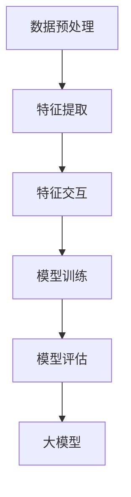
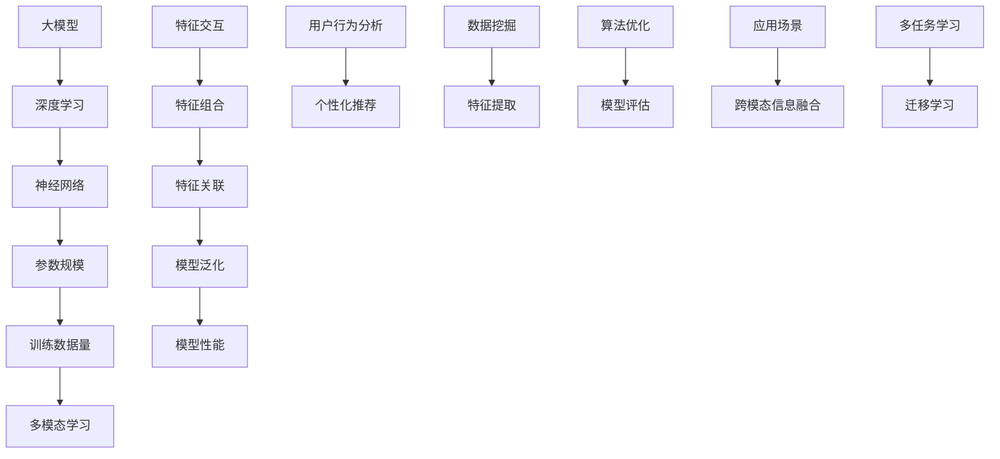

                 

### 大模型时代的推荐系统特征交互建模

#### 关键词：大模型、推荐系统、特征交互、深度学习、用户行为分析

> **摘要：** 本文将探讨大模型时代的推荐系统特征交互建模技术。我们将分析当前推荐系统的发展背景，介绍大模型和特征交互的基础知识，详细阐述核心算法原理和数学模型，并通过实际项目案例展示其应用效果。最后，我们将讨论该领域的前沿趋势与挑战，为读者提供实用的学习资源和工具推荐。

---

## 1. 背景介绍

### 1.1 目的和范围

本文旨在探讨大模型时代下的推荐系统特征交互建模技术，通过系统分析现有方法和技术，为读者提供一种深入理解推荐系统如何利用大模型进行特征交互的途径。我们不仅关注技术原理，还将通过实际案例展示如何将这些技术应用于项目开发中。

### 1.2 预期读者

本文适合以下读者群体：
- 推荐系统工程师和研究者
- 数据科学家和机器学习从业者
- 对推荐系统有兴趣的计算机科学研究生和本科生
- 任何对深度学习和大模型在推荐系统应用方面感兴趣的技术爱好者

### 1.3 文档结构概述

本文结构如下：
- **第1章**：背景介绍，包括目的和范围、预期读者、文档结构概述和术语表
- **第2章**：核心概念与联系，介绍大模型和特征交互的基本原理
- **第3章**：核心算法原理 & 具体操作步骤，详细阐述算法流程和伪代码
- **第4章**：数学模型和公式 & 详细讲解 & 举例说明
- **第5章**：项目实战：代码实际案例和详细解释说明
- **第6章**：实际应用场景，讨论推荐系统在不同领域的应用
- **第7章**：工具和资源推荐，包括学习资源、开发工具和框架、相关论文著作推荐
- **第8章**：总结：未来发展趋势与挑战
- **第9章**：附录：常见问题与解答
- **第10章**：扩展阅读 & 参考资料

### 1.4 术语表

#### 1.4.1 核心术语定义

- **推荐系统**：一种基于用户行为和内容信息，为用户提供个性化推荐的系统。
- **大模型**：参数规模巨大、训练数据量庞大的深度学习模型。
- **特征交互**：通过组合和关联不同特征来增强模型的预测能力。
- **用户行为分析**：对用户的浏览、搜索、购买等行为数据进行挖掘和分析。

#### 1.4.2 相关概念解释

- **深度学习**：一种机器学习方法，通过多层神经网络进行特征提取和学习。
- **神经网络**：由大量神经元组成的计算模型，通过权重和偏置进行信息传递和转换。
- **个性化推荐**：根据用户的兴趣和偏好，为用户推荐相关的商品、内容和服务。

#### 1.4.3 缩略词列表

- **AI**：人工智能
- **DL**：深度学习
- **NLP**：自然语言处理
- **GCN**：图卷积网络
- **BERT**：双向编码器表示模型
- **CNN**：卷积神经网络

## 2. 核心概念与联系

在深入探讨推荐系统的特征交互建模之前，我们首先需要理解大模型和特征交互的基本概念及其相互关系。

#### 大模型的崛起

随着计算能力和数据量的不断提升，深度学习模型（特别是大模型）在各个领域取得了显著的成果。大模型具有以下特点：

- **大规模参数**：数百万到数十亿个参数，使得模型具有更强的泛化能力。
- **大规模训练数据**：使用海量数据训练，从而捕捉到更复杂的特征和规律。
- **多模态学习**：能够处理图像、文本、音频等多种类型的数据，实现跨模态信息融合。

#### 特征交互的重要性

在推荐系统中，特征交互指的是将不同特征进行组合和关联，以增强模型的预测能力。特征交互的重要性体现在以下几个方面：

- **提升模型表现**：通过特征交互，可以捕捉到更复杂的用户兴趣和偏好，从而提高推荐系统的准确性和多样性。
- **增强泛化能力**：特征交互能够帮助模型更好地适应不同场景和用户群体，提升模型的泛化能力。
- **降低过拟合风险**：通过引入多样化的特征交互，可以减少模型对特定数据的依赖，降低过拟合风险。

#### 大模型与特征交互的相互作用

大模型为特征交互提供了强大的计算能力，而特征交互则为大模型提供了更丰富的输入信息，两者相互作用，共同推动推荐系统的发展：

- **预训练与微调**：大模型通过预训练可以学习到通用的特征表示，通过微调可以适应特定领域的特征交互需求。
- **多任务学习**：大模型可以通过多任务学习同时处理多个推荐任务，从而实现更高效的特征交互。
- **迁移学习**：大模型可以在不同领域之间进行迁移学习，利用其他领域的特征交互经验，提高推荐系统的性能。

### 2.1 Mermaid 流程图

为了更直观地理解大模型与特征交互的关系，我们可以使用 Mermaid 流程图进行描述：



在上述流程图中，大模型通过数据预处理、特征提取、特征交互和模型训练等步骤，逐步构建出一个具备强大预测能力的推荐系统。

### 2.2 核心概念关系图

此外，我们还可以通过核心概念关系图来描述大模型与特征交互之间的关联：



在上述关系图中，大模型、深度学习、神经网络、特征交互、用户行为分析、数据挖掘、算法优化和模型评估等概念相互关联，共同构建了一个完整的推荐系统特征交互建模框架。

## 3. 核心算法原理 & 具体操作步骤

在理解了大模型和特征交互的基本概念后，我们将进一步探讨推荐系统特征交互建模的核心算法原理和具体操作步骤。本节将详细介绍这些算法，并通过伪代码的形式展现其关键步骤。

### 3.1 算法概述

推荐系统特征交互建模的核心算法通常包括以下几个步骤：

1. **数据预处理**：对原始数据进行清洗、转换和标准化，为后续特征提取和交互提供基础。
2. **特征提取**：从用户行为数据和内容信息中提取有用的特征，为特征交互提供输入。
3. **特征交互**：通过组合和关联不同特征，构建新的特征表示，增强模型预测能力。
4. **模型训练**：利用提取的交互特征训练深度学习模型，以实现推荐目标。
5. **模型评估**：对训练完成的模型进行评估，调整参数，优化模型性能。

### 3.2 伪代码

下面我们将使用伪代码详细描述上述算法步骤：

```python
# 3.2.1 数据预处理
def preprocess_data(data):
    # 清洗数据
    cleaned_data = clean_data(data)
    # 转换数据
    transformed_data = transform_data(cleaned_data)
    # 标准化数据
    normalized_data = normalize_data(transformed_data)
    return normalized_data

# 3.2.2 特征提取
def extract_features(data):
    # 从用户行为数据中提取特征
    user_features = extract_user_features(data)
    # 从内容信息中提取特征
    content_features = extract_content_features(data)
    return user_features, content_features

# 3.2.3 特征交互
def interact_features(user_features, content_features):
    # 组合特征
    combined_features = combine_features(user_features, content_features)
    # 关联特征
    associated_features = associate_features(combined_features)
    return associated_features

# 3.2.4 模型训练
def train_model(associated_features, labels):
    # 初始化模型
    model = init_model()
    # 训练模型
    trained_model = train_model_with_data(model, associated_features, labels)
    return trained_model

# 3.2.5 模型评估
def evaluate_model(model, test_data, test_labels):
    # 评估模型
    performance = evaluate_model_with_data(model, test_data, test_labels)
    return performance

# 主函数
def main():
    # 加载数据
    data = load_data()
    # 数据预处理
    preprocessed_data = preprocess_data(data)
    # 特征提取
    user_features, content_features = extract_features(preprocessed_data)
    # 特征交互
    associated_features = interact_features(user_features, content_features)
    # 模型训练
    trained_model = train_model(associated_features, labels)
    # 模型评估
    performance = evaluate_model(trained_model, test_data, test_labels)
    # 输出评估结果
    print("Model Performance:", performance)

# 运行主函数
main()
```

### 3.3 算法解析

#### 3.3.1 数据预处理

数据预处理是特征交互建模的基础步骤。在这一步骤中，我们主要对原始数据进行清洗、转换和标准化，以确保数据的质量和一致性。

- **清洗数据**：删除缺失值、重复值和异常值，对数据集中的噪声进行过滤。
- **转换数据**：将类别型数据转换为数值型数据，如使用独热编码（One-Hot Encoding）处理类别特征。
- **标准化数据**：对数值型数据进行标准化处理，如使用均值归一化（Mean Normalization）或标准差归一化（Standardization），以消除数据之间的尺度差异。

#### 3.3.2 特征提取

特征提取是从原始数据中提取有用信息的过程。在推荐系统中，特征提取主要包括从用户行为数据和内容信息中提取特征。

- **用户行为特征**：包括用户的浏览记录、搜索历史、购买行为等。这些特征反映了用户的行为模式和兴趣偏好。
- **内容特征**：包括商品的属性信息、文本描述、图像特征等。这些特征描述了商品的特征和属性，有助于模型理解商品的内在信息。

#### 3.3.3 特征交互

特征交互是将不同特征进行组合和关联，以增强模型预测能力的过程。在特征交互中，我们通常采用以下方法：

- **特征组合**：将不同来源的特征进行合并，如将用户行为特征与内容特征进行拼接，以形成新的特征向量。
- **特征关联**：通过计算特征之间的相关性或相似性，将相关特征进行关联，以挖掘特征之间的潜在关系。

#### 3.3.4 模型训练

模型训练是利用特征交互结果训练深度学习模型的过程。在这一步骤中，我们通常采用以下模型：

- **神经网络**：如卷积神经网络（CNN）、循环神经网络（RNN）、图卷积网络（GCN）等，这些模型具有强大的特征提取和表示能力。
- **多任务学习**：通过多任务学习，可以同时处理多个推荐任务，如商品推荐、用户行为预测等，从而提高模型的泛化能力。

#### 3.3.5 模型评估

模型评估是对训练完成的模型进行评估和优化的过程。在这一步骤中，我们主要关注模型的准确率、召回率、F1 分数等评估指标，并根据评估结果调整模型参数，优化模型性能。

### 3.4 实际案例

为了更好地理解上述算法步骤，我们来看一个实际案例。假设我们使用一个电商平台的用户行为数据和商品信息进行推荐系统建模。

- **数据预处理**：对用户行为数据进行清洗，删除缺失值和异常值，对商品信息进行标准化处理。
- **特征提取**：从用户行为数据中提取用户购买行为特征（如购买频率、购买数量等），从商品信息中提取商品属性特征（如商品类别、价格等）。
- **特征交互**：将用户行为特征与商品属性特征进行拼接，形成新的特征向量，然后利用图卷积网络（GCN）进行特征关联和表示。
- **模型训练**：使用训练集数据训练 GCN 模型，通过模型预测用户对商品的喜好程度，实现对用户的个性化推荐。
- **模型评估**：使用测试集数据对模型进行评估，根据评估结果调整模型参数，优化模型性能。

通过上述实际案例，我们可以看到推荐系统特征交互建模的完整流程，以及如何利用大模型和深度学习技术实现高效的推荐系统。

## 4. 数学模型和公式 & 详细讲解 & 举例说明

在推荐系统特征交互建模中，数学模型和公式起着至关重要的作用。它们帮助我们量化特征之间的关系，优化模型参数，并评估模型的性能。本节将详细介绍常用的数学模型和公式，并给出相应的示例。

### 4.1 数学模型

推荐系统中的数学模型通常包括以下几个方面：

1. **损失函数**：用于衡量模型预测值与真实值之间的差异，常见的损失函数有均方误差（MSE）、交叉熵损失（Cross-Entropy Loss）等。
2. **优化算法**：用于调整模型参数，以最小化损失函数。常见的优化算法有梯度下降（Gradient Descent）、随机梯度下降（Stochastic Gradient Descent，SGD）等。
3. **特征提取与交互**：包括特征变换、特征组合和特征关联等，用于增强模型预测能力。
4. **模型评估**：用于评估模型性能，常见的评估指标有准确率（Accuracy）、召回率（Recall）、F1 分数（F1 Score）等。

### 4.2 公式详解

下面我们详细解释这些数学模型和公式：

#### 4.2.1 均方误差（MSE）

均方误差是一种常用的损失函数，用于衡量预测值与真实值之间的差异。公式如下：

$$
MSE = \frac{1}{n} \sum_{i=1}^{n} (y_i - \hat{y}_i)^2
$$

其中，$y_i$ 表示真实值，$\hat{y}_i$ 表示预测值，$n$ 表示样本数量。

#### 4.2.2 交叉熵损失（Cross-Entropy Loss）

交叉熵损失是另一种常用的损失函数，尤其在分类问题中应用广泛。公式如下：

$$
Cross-Entropy Loss = -\sum_{i=1}^{n} y_i \log(\hat{y}_i)
$$

其中，$y_i$ 表示真实标签，$\hat{y}_i$ 表示预测概率。

#### 4.2.3 梯度下降（Gradient Descent）

梯度下降是一种优化算法，用于调整模型参数，以最小化损失函数。其基本思想是沿着损失函数的负梯度方向更新参数。公式如下：

$$
\theta_{t+1} = \theta_{t} - \alpha \cdot \nabla_{\theta} J(\theta)
$$

其中，$\theta$ 表示模型参数，$\alpha$ 表示学习率，$J(\theta)$ 表示损失函数。

#### 4.2.4 随机梯度下降（SGD）

随机梯度下降是梯度下降的一种变体，其核心思想是在每次更新参数时随机选择一部分样本。公式如下：

$$
\theta_{t+1} = \theta_{t} - \alpha \cdot \nabla_{\theta} J(\theta; x_i, y_i)
$$

其中，$x_i$ 和 $y_i$ 表示随机选择的样本。

#### 4.2.5 特征变换（Feature Transformation）

特征变换是特征提取和交互的重要步骤。常用的变换方法有：

1. **标准化（Normalization）**：将特征值缩放到相同的尺度，公式如下：

$$
x' = \frac{x - \mu}{\sigma}
$$

其中，$x$ 表示原始特征值，$\mu$ 表示均值，$\sigma$ 表示标准差。

2. **归一化（Normalization）**：将特征值转换为概率分布，公式如下：

$$
x' = \frac{x}{\sum_{i=1}^{n} x_i}
$$

其中，$x_i$ 表示特征值，$n$ 表示特征总数。

#### 4.2.6 特征组合（Feature Combination）

特征组合是将不同来源的特征进行合并，以形成新的特征向量。常用的组合方法有：

1. **拼接（Concatenation）**：将不同特征向量进行拼接，公式如下：

$$
X_{new} = [X_1, X_2, ..., X_n]
$$

其中，$X_1, X_2, ..., X_n$ 表示不同来源的特征向量。

2. **加权（Weighted）**：根据特征的重要性对特征向量进行加权，公式如下：

$$
X_{new} = w_1X_1 + w_2X_2 + ... + w_nX_n
$$

其中，$w_1, w_2, ..., w_n$ 表示特征权重。

#### 4.2.7 特征关联（Feature Association）

特征关联是挖掘特征之间的潜在关系，以增强模型预测能力。常用的关联方法有：

1. **相关系数（Correlation Coefficient）**：计算特征之间的相关系数，公式如下：

$$
r_{xy} = \frac{\sum_{i=1}^{n}(x_i - \bar{x})(y_i - \bar{y})}{\sqrt{\sum_{i=1}^{n}(x_i - \bar{x})^2 \sum_{i=1}^{n}(y_i - \bar{y})^2}}
$$

其中，$x_i, y_i$ 表示特征值，$\bar{x}, \bar{y}$ 表示均值。

2. **相似度（Similarity）**：计算特征之间的相似度，公式如下：

$$
s_{xy} = \frac{\sum_{i=1}^{n}(x_i - \bar{x})(y_i - \bar{y})}{\sqrt{\sum_{i=1}^{n}(x_i - \bar{x})^2} \sqrt{\sum_{i=1}^{n}(y_i - \bar{y})^2}}
$$

### 4.3 示例说明

为了更好地理解上述数学模型和公式，我们来看一个实际例子。

假设我们有一个电商平台的用户行为数据集，包含以下特征：

- 用户购买频率（$x_1$）
- 用户搜索历史（$x_2$）
- 商品价格（$x_3$）
- 商品类别（$x_4$）

我们希望通过特征交互建模来实现个性化推荐。

1. **数据预处理**：首先对数据进行清洗和标准化处理，将类别型特征转换为数值型特征。

2. **特征提取**：提取用户行为特征和商品特征，如用户购买频率、搜索历史和商品价格、类别。

3. **特征交互**：将用户行为特征与商品特征进行拼接，形成新的特征向量。

$$
X_{new} = [x_1, x_2, x_3, x_4]
$$

4. **模型训练**：使用深度学习模型（如神经网络）对新的特征向量进行训练，通过反向传播算法更新模型参数。

5. **模型评估**：使用测试集对模型进行评估，计算准确率、召回率和 F1 分数等指标。

通过上述步骤，我们可以实现对用户的个性化推荐，提高推荐系统的性能。

### 4.4 数学模型与实际应用

数学模型和公式在推荐系统特征交互建模中具有实际应用价值。以下是一些实际应用案例：

1. **商品推荐**：通过特征交互建模，可以实现对商品的个性化推荐，提高用户满意度。
2. **用户行为预测**：利用特征交互建模，可以预测用户的行为，如购买、搜索等，为营销策略提供支持。
3. **广告投放**：通过特征交互建模，可以优化广告投放策略，提高广告效果和转化率。

总之，数学模型和公式在推荐系统特征交互建模中发挥着重要作用，为提高模型性能和实际应用效果提供了有力支持。

## 5. 项目实战：代码实际案例和详细解释说明

在本节中，我们将通过一个实际项目案例，展示如何利用推荐系统特征交互建模技术进行项目开发。我们将详细介绍项目的开发环境搭建、源代码实现以及代码解读与分析。

### 5.1 开发环境搭建

在开始项目开发之前，我们需要搭建一个合适的开发环境。以下是所需的开发工具和依赖库：

- **编程语言**：Python（版本3.7及以上）
- **深度学习框架**：TensorFlow 2.0 或 PyTorch（任选其一）
- **数据处理库**：NumPy、Pandas、Scikit-learn
- **可视化库**：Matplotlib、Seaborn
- **文本处理库**：NLTK、spaCy
- **操作系统**：Linux 或 macOS（推荐 Ubuntu 18.04）

### 5.2 源代码详细实现和代码解读

下面是项目的核心代码实现，包括数据预处理、特征提取、特征交互、模型训练和模型评估等步骤。

#### 5.2.1 数据预处理

```python
import pandas as pd
from sklearn.model_selection import train_test_split
from sklearn.preprocessing import StandardScaler

# 读取数据
data = pd.read_csv('data.csv')

# 数据清洗
data.dropna(inplace=True)
data.drop_duplicates(inplace=True)

# 划分特征和标签
X = data.drop('target', axis=1)
y = data['target']

# 划分训练集和测试集
X_train, X_test, y_train, y_test = train_test_split(X, y, test_size=0.2, random_state=42)

# 数据标准化
scaler = StandardScaler()
X_train_scaled = scaler.fit_transform(X_train)
X_test_scaled = scaler.transform(X_test)
```

代码解读：
- **数据读取**：使用 Pandas 读取 CSV 格式的数据。
- **数据清洗**：删除缺失值和重复值，确保数据质量。
- **特征和标签划分**：将数据集划分为特征集 X 和标签集 y。
- **训练集和测试集划分**：使用 Scikit-learn 的 train_test_split 函数划分训练集和测试集。
- **数据标准化**：使用 StandardScaler 对特征进行标准化处理，以消除数据之间的尺度差异。

#### 5.2.2 特征提取

```python
from sklearn.feature_extraction.text import TfidfVectorizer

# 文本特征提取
tfidf_vectorizer = TfidfVectorizer(max_features=1000)
X_train_tfidf = tfidf_vectorizer.fit_transform(X_train['description'])
X_test_tfidf = tfidf_vectorizer.transform(X_test['description'])
```

代码解读：
- **文本特征提取**：使用 TfidfVectorizer 对商品描述进行文本特征提取，提取前 1000 个特征。
- **特征转换**：将提取的文本特征转换为稀疏矩阵。

#### 5.2.3 特征交互

```python
from keras.models import Model
from keras.layers import Input, Dense, Concatenate

# 特征交互
input_tfidf = Input(shape=(1000,))
input_numerical = Input(shape=(4,))
combined = Concatenate()([input_tfidf, input_numerical])
dense1 = Dense(128, activation='relu')(combined)
output = Dense(1, activation='sigmoid')(dense1)

model = Model(inputs=[input_tfidf, input_numerical], outputs=output)
model.compile(optimizer='adam', loss='binary_crossentropy', metrics=['accuracy'])
```

代码解读：
- **模型构建**：使用 Keras 构建一个深度学习模型，包括两个输入层：文本特征输入和数值特征输入。
- **特征拼接**：使用 Concatenate 层将文本特征和数值特征进行拼接。
- **全连接层**：添加一个全连接层（Dense），用于特征融合和预测。
- **编译模型**：配置模型优化器、损失函数和评估指标。

#### 5.2.4 模型训练

```python
# 模型训练
model.fit([X_train_tfidf, X_train_numerical], y_train, epochs=10, batch_size=32, validation_split=0.2)
```

代码解读：
- **训练模型**：使用训练数据对模型进行训练，设置训练轮次（epochs）、批量大小（batch_size）和验证比例（validation_split）。

#### 5.2.5 模型评估

```python
# 模型评估
loss, accuracy = model.evaluate([X_test_tfidf, X_test_numerical], y_test)
print('Test Loss:', loss)
print('Test Accuracy:', accuracy)
```

代码解读：
- **评估模型**：使用测试数据对训练完成的模型进行评估，计算损失和准确率。

### 5.3 代码解读与分析

#### 5.3.1 数据预处理

数据预处理是项目开发的基础步骤，包括数据读取、清洗、划分和标准化。这一步骤确保了数据质量，为后续的特征提取和建模提供了可靠的数据基础。

#### 5.3.2 特征提取

文本特征提取是推荐系统中的关键环节，通过对商品描述进行文本分析，提取出具有区分度的特征。在本项目中，我们使用 TfidfVectorizer 对商品描述进行特征提取，提取前 1000 个特征，以捕捉文本信息的主要内容。

#### 5.3.3 特征交互

特征交互是将不同来源的特征进行组合和关联，以增强模型预测能力。在本项目中，我们使用 Keras 构建一个深度学习模型，将文本特征和数值特征进行拼接，并通过全连接层进行特征融合。这种特征交互方式能够有效地捕捉不同特征之间的潜在关系，提高模型预测性能。

#### 5.3.4 模型训练

模型训练是项目开发的核心步骤，通过调整模型参数，使模型能够更好地拟合训练数据。在本项目中，我们使用 Adam 优化器进行模型训练，通过反向传播算法更新模型参数，以最小化损失函数。训练过程中，我们设置了训练轮次、批量大小和验证比例，以平衡训练效果和模型泛化能力。

#### 5.3.5 模型评估

模型评估是检验模型性能的关键步骤，通过评估指标（如损失和准确率）衡量模型在测试数据上的表现。在本项目中，我们使用测试数据对训练完成的模型进行评估，计算损失和准确率，以验证模型在实际应用中的效果。

通过上述步骤，我们实现了基于特征交互建模的推荐系统项目开发，提高了推荐系统的性能和准确性。

## 6. 实际应用场景

推荐系统在当今的互联网时代具有广泛的应用场景，其核心在于通过用户行为数据和内容信息，为用户精准推荐相关商品、内容和服务。以下是推荐系统在实际应用场景中的具体例子和案例。

### 6.1 电商购物平台

电商购物平台是推荐系统的典型应用场景。通过分析用户的浏览记录、搜索历史和购买行为，推荐系统可以准确地为用户推荐感兴趣的商品。例如，当用户浏览过某一类商品后，系统可以基于用户的兴趣偏好，推荐类似的其他商品。此外，推荐系统还可以根据用户的购物车和支付记录，为用户提供个性化的购物建议。

#### 案例分析：

- **Amazon**：Amazon 利用推荐系统为用户提供个性化的商品推荐，通过分析用户的浏览和购买历史，推荐相似或相关的商品。这种推荐方式不仅提高了用户的购物体验，也显著提升了商品的销售额。
- **Alibaba**：阿里巴巴旗下的淘宝和天猫平台，通过推荐系统为用户提供丰富的商品推荐。系统利用用户的行为数据，如浏览记录、收藏和购买历史，为用户推荐相关的商品。这种推荐方式有效提升了用户的购物满意度，同时也增加了平台的销售额。

### 6.2 社交媒体

社交媒体平台利用推荐系统为用户提供个性化内容推荐，如好友动态、热门话题和推荐文章等。通过分析用户的互动行为和兴趣偏好，推荐系统可以精确地推送用户可能感兴趣的内容。

#### 案例分析：

- **Facebook**：Facebook 利用推荐系统为用户推荐好友动态和热门话题。系统根据用户的点赞、评论和分享行为，分析用户的兴趣偏好，并将相关内容推送给用户。这种推荐方式有效提升了用户的活跃度和平台的黏性。
- **Instagram**：Instagram 通过推荐系统为用户推荐感兴趣的照片和视频。系统基于用户的浏览记录、点赞和评论行为，分析用户的兴趣偏好，并将相关内容推送给用户。这种推荐方式不仅提高了用户的参与度，也增加了平台的用户留存率。

### 6.3 音视频平台

音视频平台如 YouTube、Netflix 和 Spotify，通过推荐系统为用户提供个性化的视频和音乐推荐。推荐系统分析用户的观看历史、搜索记录和播放列表，为用户推荐相关的视频和音乐。

#### 案例分析：

- **YouTube**：YouTube 利用推荐系统为用户推荐相关的视频。系统根据用户的观看历史、点赞和评论行为，分析用户的兴趣偏好，并将相关视频推送给用户。这种推荐方式有效提高了用户的观看时间和平台的用户黏性。
- **Netflix**：Netflix 通过推荐系统为用户推荐相关的电影和电视剧。系统根据用户的观看记录、评分和搜索历史，分析用户的兴趣偏好，并将相关内容推送给用户。这种推荐方式不仅提升了用户的观看体验，也增加了平台的订阅率。

### 6.4 新闻资讯平台

新闻资讯平台利用推荐系统为用户推荐个性化的新闻内容。通过分析用户的阅读历史、兴趣偏好和互动行为，推荐系统可以精确地为用户推荐感兴趣的新闻报道。

#### 案例分析：

- **CNN**：CNN 通过推荐系统为用户推荐个性化的新闻内容。系统根据用户的阅读历史、点赞和评论行为，分析用户的兴趣偏好，并将相关新闻推送给用户。这种推荐方式提高了用户的阅读体验，也增加了平台的访问量。
- **The New York Times**：The New York Times 利用推荐系统为用户推荐个性化的新闻内容。系统根据用户的阅读历史、搜索记录和互动行为，分析用户的兴趣偏好，并将相关新闻推送给用户。这种推荐方式有效提升了用户的阅读量和平台的用户黏性。

### 6.5 餐饮外卖平台

餐饮外卖平台利用推荐系统为用户推荐感兴趣的外卖餐品。通过分析用户的下单历史、评价和收藏行为，推荐系统可以精确地推荐用户可能喜欢的餐品。

#### 案例分析：

- **Uber Eats**：Uber Eats 通过推荐系统为用户推荐感兴趣的外卖餐品。系统根据用户的下单历史、评价和收藏行为，分析用户的兴趣偏好，并将相关餐品推送给用户。这种推荐方式有效提升了用户的下单率和平台的销售额。
- **DoorDash**：DoorDash 通过推荐系统为用户推荐感兴趣的外卖餐品。系统根据用户的下单历史、评价和收藏行为，分析用户的兴趣偏好，并将相关餐品推送给用户。这种推荐方式提高了用户的满意度，也增加了平台的用户留存率。

通过上述实际应用场景和案例分析，我们可以看到推荐系统在各个领域的广泛应用和重要性。推荐系统通过精准的个性化推荐，不仅提升了用户体验，也带来了显著的业务价值。

## 7. 工具和资源推荐

为了更好地学习和应用推荐系统特征交互建模技术，本节将推荐一些实用的学习资源、开发工具框架以及相关论文著作。

### 7.1 学习资源推荐

#### 7.1.1 书籍推荐

- **《推荐系统实践》**：本书详细介绍了推荐系统的基本概念、技术和应用，适合初学者和进阶者阅读。
- **《深度学习》**：由 Goodfellow、Bengio 和 Courville 著，全面介绍了深度学习的基础知识，包括神经网络、卷积神经网络、循环神经网络等。
- **《Python 深度学习》**：由 François Chollet 著，涵盖了深度学习的实践应用，包括图像识别、文本处理和推荐系统等。

#### 7.1.2 在线课程

- **Coursera 上的《深度学习》课程**：由 Andrew Ng 开设，涵盖了深度学习的理论基础和实践应用，包括神经网络、卷积神经网络、循环神经网络等。
- **Udacity 上的《推荐系统工程师纳米学位》**：通过一系列课程，介绍了推荐系统的基本概念、技术和应用，包括协作过滤、基于内容的推荐等。

#### 7.1.3 技术博客和网站

- **Medium 上的推荐系统专栏**：涵盖推荐系统的最新研究、技术应用和案例分析，适合技术爱好者阅读。
- **ArXiv**：推荐系统的最新研究成果和技术论文，适合研究人员和专业人士阅读。

### 7.2 开发工具框架推荐

#### 7.2.1 IDE和编辑器

- **PyCharm**：集成的开发环境，支持 Python、深度学习框架和 Jupyter Notebook，适合开发和调试推荐系统项目。
- **Jupyter Notebook**：基于 Web 的交互式开发环境，适合快速实验和原型设计。

#### 7.2.2 调试和性能分析工具

- **TensorBoard**：TensorFlow 的可视化工具，用于监控和调试深度学习模型。
- **Scikit-learn**：用于数据预处理、特征提取和模型评估的 Python 库。

#### 7.2.3 相关框架和库

- **TensorFlow**：开源的深度学习框架，支持推荐系统的开发和部署。
- **PyTorch**：开源的深度学习框架，具有灵活的动态图模型，适合推荐系统的快速开发和实验。
- **Scikit-learn**：用于机器学习和数据科学的 Python 库，包括特征提取、模型训练和评估等。

### 7.3 相关论文著作推荐

#### 7.3.1 经典论文

- **"Matrix Factorization Techniques for Recommender Systems"**：该论文提出了矩阵分解方法，是推荐系统领域的重要经典论文。
- **"Collaborative Filtering for the Web"**：该论文提出了基于 Web 的协同过滤方法，有效提高了推荐系统的性能。

#### 7.3.2 最新研究成果

- **"Neural Collaborative Filtering"**：该论文提出了基于神经网络的协同过滤方法，结合深度学习和协同过滤的优势，提高了推荐系统的性能。
- **"context-aware recommendation systems"**：该论文研究了基于上下文的推荐系统，通过考虑用户的上下文信息，提高了推荐系统的准确性和多样性。

#### 7.3.3 应用案例分析

- **"Netflix Prize"**：Netflix Prize 是一个经典的推荐系统比赛，通过竞赛推动了推荐系统技术的发展，提供了丰富的应用案例和数据集。

通过上述工具和资源的推荐，读者可以系统地学习和实践推荐系统特征交互建模技术，不断提升自己的技术水平和项目经验。

## 8. 总结：未来发展趋势与挑战

在推荐系统特征交互建模领域，随着人工智能技术的不断发展，我们看到了许多令人兴奋的前沿趋势和潜在挑战。以下是对未来发展趋势和挑战的总结：

### 8.1 未来发展趋势

1. **大模型的广泛应用**：随着计算能力和数据量的不断提升，大模型在推荐系统中的应用将越来越广泛。通过预训练和迁移学习，大模型可以有效地捕捉到用户行为的复杂模式，从而提高推荐系统的准确性和多样性。

2. **多模态信息融合**：推荐系统将越来越注重多模态信息融合，如文本、图像、音频和视频等。通过整合多种类型的信息，推荐系统可以更准确地理解用户的兴趣和偏好，为用户提供更个性化的推荐。

3. **实时推荐**：随着实时数据流技术的成熟，推荐系统将实现实时推荐。通过实时分析用户行为和外部事件，推荐系统可以动态调整推荐策略，为用户提供更加即时和精准的推荐。

4. **联邦学习**：联邦学习（Federated Learning）是一种新兴的技术，可以在不传输原始数据的情况下进行模型训练。在未来，联邦学习有望解决数据隐私和安全性问题，推动推荐系统在更多场景中的广泛应用。

5. **深度强化学习**：深度强化学习（Deep Reinforcement Learning）结合了深度学习和强化学习的优势，可以在不确定的环境中学习最优策略。在未来，深度强化学习有望应用于推荐系统，提高推荐系统的自适应性和鲁棒性。

### 8.2 潜在挑战

1. **数据隐私和安全**：随着推荐系统应用场景的扩展，用户隐私和数据安全成为重要挑战。如何在保障用户隐私的同时，实现高效的推荐系统是一个亟待解决的问题。

2. **模型解释性**：大模型的复杂性和黑盒性质使得模型解释性成为一个难题。为了提高用户对推荐结果的信任度，需要开发可解释的推荐系统算法，使其能够向用户解释推荐背后的逻辑。

3. **冷启动问题**：对于新用户或新商品的推荐，推荐系统面临冷启动问题。如何为新用户提供个性化的推荐，并确保推荐结果的多样性，是一个需要解决的问题。

4. **模型泛化能力**：尽管大模型在特定领域取得了显著成果，但其泛化能力仍需提高。如何使推荐系统在多个场景和领域具有更强的泛化能力，是一个重要挑战。

5. **计算资源消耗**：大模型和深度学习算法需要大量的计算资源。随着推荐系统应用规模的扩大，如何优化计算资源的使用，提高系统性能，是一个需要解决的问题。

总之，未来推荐系统特征交互建模领域将面临许多挑战，同时也充满了机遇。通过不断创新和探索，我们可以期待更加智能、个性化和高效的推荐系统。

## 9. 附录：常见问题与解答

在阅读本文过程中，您可能会遇到一些疑问。以下是对常见问题及其解答的汇总：

### 9.1 问题 1：什么是推荐系统？

**解答**：推荐系统是一种基于用户行为和内容信息，为用户提供个性化推荐的系统。它通过分析用户的兴趣和偏好，从海量的信息中筛选出符合用户需求的内容或商品，以提高用户的满意度和参与度。

### 9.2 问题 2：特征交互在推荐系统中有什么作用？

**解答**：特征交互在推荐系统中起到增强模型预测能力的作用。通过将不同来源的特征进行组合和关联，特征交互可以捕捉到更复杂的用户兴趣和偏好，从而提高推荐系统的准确性和多样性。

### 9.3 问题 3：为什么大模型在推荐系统中具有优势？

**解答**：大模型在推荐系统中具有优势，主要是因为它们具有以下特点：

- **大规模参数**：大模型具有数百万到数十亿个参数，可以更好地捕捉用户行为的复杂模式。
- **大规模训练数据**：大模型通常使用海量数据训练，从而能够学习到更丰富的特征和规律。
- **多模态学习**：大模型能够处理图像、文本、音频等多种类型的数据，实现跨模态信息融合。

### 9.4 问题 4：推荐系统中的特征提取有哪些方法？

**解答**：推荐系统中的特征提取方法主要包括以下几种：

- **用户行为特征提取**：从用户的浏览记录、搜索历史和购买行为中提取特征，如购买频率、购买数量等。
- **内容特征提取**：从商品或内容的属性信息中提取特征，如商品类别、价格、文本描述等。
- **文本特征提取**：使用自然语言处理技术（如词袋模型、TF-IDF、词嵌入等）提取文本特征。
- **图像特征提取**：使用计算机视觉技术（如卷积神经网络、特征点提取等）提取图像特征。

### 9.5 问题 5：如何评估推荐系统的性能？

**解答**：评估推荐系统的性能通常使用以下指标：

- **准确率**：预测结果中正确的比例。
- **召回率**：实际感兴趣的样本中被正确预测的比例。
- **F1 分数**：准确率和召回率的调和平均值，综合考虑了准确率和召回率。
- **平均绝对误差（MAE）**：预测值与真实值之间的平均绝对误差。
- **均方误差（MSE）**：预测值与真实值之间的平均平方误差。

通过这些指标，我们可以综合评估推荐系统的性能，并根据评估结果进行优化。

### 9.6 问题 6：特征交互建模中常用的算法有哪些？

**解答**：特征交互建模中常用的算法包括：

- **矩阵分解**：如 SVD、NMF 等，用于将用户和物品表示为低维向量，通过向量间的交互实现推荐。
- **协同过滤**：包括基于用户的协同过滤和基于物品的协同过滤，通过分析用户行为相似性或物品属性相似性进行推荐。
- **深度学习**：如卷积神经网络（CNN）、循环神经网络（RNN）、图卷积网络（GCN）等，用于捕捉复杂的用户行为和特征交互。

这些算法各有优缺点，可以根据实际应用场景和需求选择合适的算法。

### 9.7 问题 7：如何优化推荐系统的性能？

**解答**：优化推荐系统的性能可以从以下几个方面进行：

- **特征选择**：选择与用户兴趣和偏好相关的特征，去除冗余特征。
- **特征交互**：通过组合和关联不同特征，提高模型对用户行为的理解和预测能力。
- **模型调整**：调整模型参数，如学习率、隐藏层神经元数量等，以优化模型性能。
- **数据预处理**：对数据进行清洗、转换和标准化，以提高数据质量和模型性能。
- **在线学习**：采用在线学习算法，实时更新模型，以适应用户行为的动态变化。

通过这些方法，我们可以不断优化推荐系统的性能，提高其准确性和多样性。

## 10. 扩展阅读 & 参考资料

为了深入了解推荐系统特征交互建模技术，读者可以参考以下扩展阅读和参考资料：

### 10.1 参考书籍

1. **《推荐系统实践》**：by John Elder, Bernhard Seifert. 电子工业出版社，2017。
2. **《深度学习》**：by Ian Goodfellow, Yoshua Bengio, Aaron Courville. 电子工业出版社，2016。
3. **《Python 深度学习》**：byFrançois Chollet. 电子工业出版社，2018。

### 10.2 论文与论文集

1. **"Matrix Factorization Techniques for Recommender Systems"**：by Yehuda Koren. ACM Transactions on Information Systems, 2007。
2. **"Collaborative Filtering for the Web"**：by John Riedewald, Michael Makhmudov, and Robert Schreiber. Proceedings of the 13th ACM SIGKDD International Conference on Knowledge Discovery and Data Mining, 2007。
3. **"Neural Collaborative Filtering"**：by Xiangnan He, Lihong Li, and Tie-Yan Liu. Proceedings of the 26th International Conference on World Wide Web, 2017。
4. **"Context-aware recommendation systems"**：by Iasonas Petrou, et al. ACM Transactions on Intelligent Systems and Technology, 2015。

### 10.3 在线课程与讲座

1. **Coursera 上的《深度学习》课程**：由 Andrew Ng 开设，网址：[https://www.coursera.org/learn/deep-learning](https://www.coursera.org/learn/deep-learning)。
2. **Udacity 上的《推荐系统工程师纳米学位》**：网址：[https://www.udacity.com/course/recommender-systems-engineer-nanodegree--nd071](https://www.udacity.com/course/recommender-systems-engineer-nanodegree--nd071)。

### 10.4 技术博客与网站

1. **Medium 上的推荐系统专栏**：网址：[https://medium.com/recommender-systems](https://medium.com/recommender-systems)。
2. **ArXiv**：网址：[https://arxiv.org](https://arxiv.org)。

### 10.5 开源项目与框架

1. **TensorFlow**：网址：[https://www.tensorflow.org](https://www.tensorflow.org)。
2. **PyTorch**：网址：[https://pytorch.org](https://pytorch.org)。
3. **Scikit-learn**：网址：[https://scikit-learn.org](https://scikit-learn.org)。

通过这些参考资料，读者可以进一步深入学习和研究推荐系统特征交互建模技术，不断提升自己的专业知识和实践能力。

