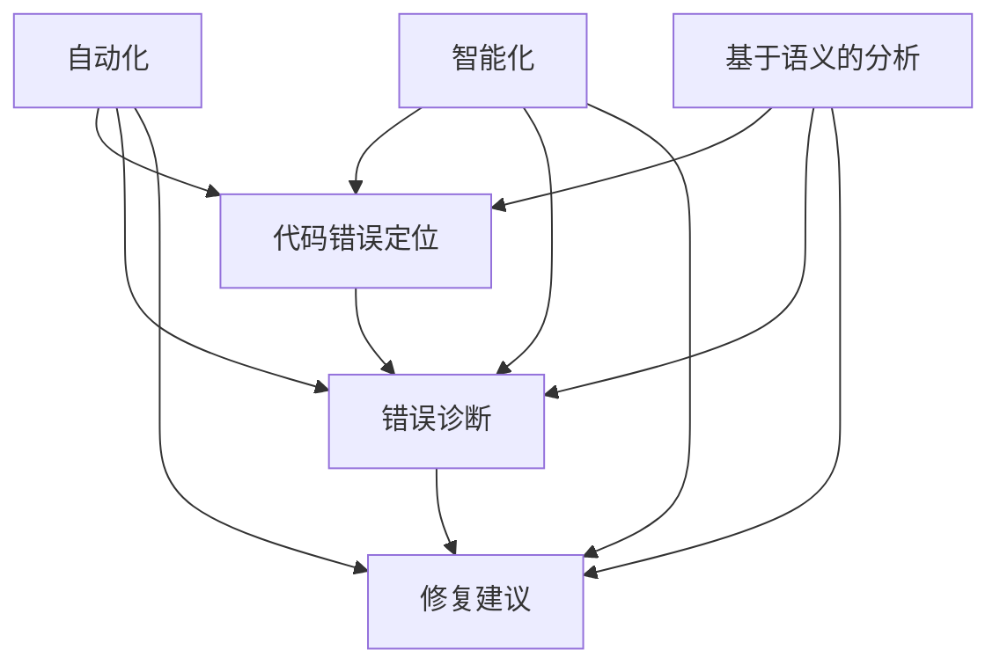

                 

# 大模型时代的程序修复策略创新

> 关键词：大模型，程序修复，策略创新，自动化，智能化

> 摘要：本文将探讨大模型时代下的程序修复策略，通过对现有技术的分析和创新，提出一系列新的程序修复方法和工具，以应对复杂程序开发中的挑战。文章首先介绍了大模型时代背景和程序修复的重要性，随后深入探讨了核心概念、算法原理、数学模型，并通过实际项目案例进行了详细解析，最后对未来的发展趋势和挑战进行了展望。

## 1. 背景介绍

### 1.1 目的和范围

本文的目的是探讨在大模型时代下，如何通过创新的策略来提高程序的修复效率。随着大模型的普及，程序复杂性不断上升，传统的程序修复方法已经难以满足需求。因此，我们需要寻找新的解决方案来应对这一挑战。

本文主要涵盖以下内容：

- 大模型时代的背景和程序修复的现状
- 核心概念和理论框架的阐述
- 创新的程序修复算法原理和操作步骤
- 实际项目中的代码案例解析
- 未来发展趋势与挑战

### 1.2 预期读者

本文适合以下读者：

- 对程序修复和人工智能感兴趣的程序员和开发者
- 想要在大模型时代提升程序开发效率的技术领导者和管理者
- 想要深入了解程序修复领域研究的学术研究人员

### 1.3 文档结构概述

本文分为十个部分：

- 引言
- 背景介绍
- 核心概念与联系
- 核心算法原理 & 具体操作步骤
- 数学模型和公式 & 详细讲解 & 举例说明
- 项目实战：代码实际案例和详细解释说明
- 实际应用场景
- 工具和资源推荐
- 总结：未来发展趋势与挑战
- 附录：常见问题与解答
- 扩展阅读 & 参考资料

### 1.4 术语表

#### 1.4.1 核心术语定义

- 大模型：具有数百万甚至数十亿参数的机器学习模型。
- 程序修复：通过分析和修正代码中的错误，提高程序的可靠性和性能。
- 自动化：使用计算机技术来自动执行任务，减少人工干预。
- 智能化：引入人工智能技术，使系统能够自我学习和优化。

#### 1.4.2 相关概念解释

- 脚本化修复：使用预定义的规则或模式来修复代码错误。
- 基于语义的修复：通过理解代码的语义信息来修复错误。
- 智能搜索：利用人工智能技术进行代码错误定位和问题诊断。

#### 1.4.3 缩略词列表

- AI：人工智能
- ML：机器学习
- DL：深度学习
- NLP：自然语言处理
- IDE：集成开发环境
- MVP：最小可行产品

## 2. 核心概念与联系

在大模型时代，程序修复的核心概念包括自动化、智能化、基于语义的分析等。以下是这些概念的联系和交互关系，使用Mermaid流程图进行展示：



### 2.1 自动化

自动化是程序修复的基础，通过预定义的规则或模式来自动执行修复任务。自动化工具可以大幅减少人工干预，提高修复效率。然而，单纯依赖自动化可能导致修复效果不佳，因此需要与其他技术相结合。

### 2.2 智能化

智能化是利用人工智能技术，使程序修复过程具备自我学习和优化的能力。智能化技术可以处理更复杂的问题，提供更准确的修复建议。智能化与自动化相结合，可以进一步提升修复效果。

### 2.3 基于语义的分析

基于语义的分析是通过理解代码的语义信息，来定位错误、诊断问题并生成修复建议。这种分析方法可以更准确地识别代码中的问题，提高修复的针对性和效果。

### 2.4 代码错误定位、错误诊断和修复建议

代码错误定位、错误诊断和修复建议是程序修复的关键步骤。通过自动化、智能化和基于语义的分析，可以快速准确地定位错误、分析问题，并生成有效的修复建议。

## 3. 核心算法原理 & 具体操作步骤

在大模型时代，程序修复的核心算法主要包括自动化修复、智能修复和基于语义的修复。以下是这些算法的原理和具体操作步骤。

### 3.1 自动化修复

#### 原理：

自动化修复基于预定义的规则或模式，通过匹配代码中的错误模式来自动执行修复。常用的规则包括语法修复、语义修复和风格修复等。

#### 操作步骤：

1. 收集代码样本，分析常见错误模式。
2. 设计修复规则，包括错误模式匹配和修复操作。
3. 针对代码中的每个错误模式，执行相应的修复操作。
4. 验证修复结果，确保修复后的代码符合预期。

#### 伪代码：

```python
def automatic_fix(code):
    error_patterns = get_error_patterns()
    for pattern in error_patterns:
        if match_code(code, pattern):
            fix_code(code, pattern)
    return code
```

### 3.2 智能修复

#### 原理：

智能修复利用人工智能技术，通过学习和分析大量的代码数据，自动生成修复建议。常用的技术包括机器学习、深度学习和自然语言处理等。

#### 操作步骤：

1. 收集代码样本，构建代码数据库。
2. 训练修复模型，使用机器学习或深度学习算法。
3. 对输入代码进行分析，生成可能的修复建议。
4. 对修复建议进行评估和排序，选择最优修复方案。

#### 伪代码：

```python
def intelligent_fix(code):
    model = train修复模型(代码数据库)
    suggestions = model.generate_suggestions(code)
    best_suggestion = select_best_suggestion(suggestions)
    return best_suggestion
```

### 3.3 基于语义的修复

#### 原理：

基于语义的修复通过理解代码的语义信息，识别代码中的错误并生成修复建议。这种修复方法更准确，能够解决自动化和智能修复难以处理的复杂问题。

#### 操作步骤：

1. 分析代码语义，构建代码语义模型。
2. 识别代码中的错误，生成错误报告。
3. 根据错误报告，生成修复建议。
4. 对修复建议进行评估和排序，选择最优修复方案。

#### 伪代码：

```python
def semantic_fix(code):
    semantic_model = build_semantic_model(code)
    errors = semantic_model.identify_errors()
    suggestions = generate_suggestions(errors)
    best_suggestion = select_best_suggestion(suggestions)
    return best_suggestion
```

## 4. 数学模型和公式 & 详细讲解 & 举例说明

在大模型时代，程序修复涉及到多个数学模型和公式，包括机器学习算法中的损失函数、优化算法中的梯度下降等。以下是这些数学模型和公式的详细讲解以及实际应用举例。

### 4.1 损失函数

损失函数是机器学习中用于评估模型预测结果与真实值之间差异的函数。常用的损失函数包括均方误差（MSE）、交叉熵损失（Cross-Entropy Loss）等。

#### 均方误差（MSE）

均方误差用于回归问题，计算预测值与真实值之间的平均平方误差。

$$
MSE = \frac{1}{n}\sum_{i=1}^{n}(y_i - \hat{y}_i)^2
$$

其中，$y_i$ 表示真实值，$\hat{y}_i$ 表示预测值，$n$ 表示样本数量。

#### 交叉熵损失（Cross-Entropy Loss）

交叉熵损失用于分类问题，计算预测概率分布与真实概率分布之间的交叉熵。

$$
Cross-Entropy Loss = -\sum_{i=1}^{n}y_i \log(\hat{y}_i)
$$

其中，$y_i$ 表示真实标签，$\hat{y}_i$ 表示预测概率。

### 4.2 梯度下降

梯度下降是一种优化算法，用于最小化损失函数。基本思想是沿着损失函数的梯度方向逐步更新模型参数，直到达到最小值。

#### 梯度下降算法

1. 初始化模型参数 $\theta$。
2. 计算损失函数的梯度 $\nabla L(\theta)$。
3. 更新模型参数 $\theta = \theta - \alpha \nabla L(\theta)$，其中 $\alpha$ 是学习率。
4. 重复步骤 2 和 3，直到满足停止条件（如损失函数值变化较小）。

#### 伪代码：

```python
def gradient_descent(theta, alpha, num_iterations):
    for i in range(num_iterations):
        gradient = compute_gradient(theta)
        theta = theta - alpha * gradient
    return theta
```

### 4.3 实际应用举例

以下是一个简单的例子，使用梯度下降算法训练一个线性回归模型。

#### 数据集：

```
x = [1, 2, 3, 4, 5]
y = [2, 4, 5, 4, 5]
```

#### 模型：

线性回归模型 $y = \theta_0 + \theta_1 \cdot x$

#### 损失函数：

均方误差损失函数

$$
L(\theta) = \frac{1}{n}\sum_{i=1}^{n}(y_i - (\theta_0 + \theta_1 \cdot x_i))^2
$$

#### 梯度：

$$
\nabla L(\theta) = \begin{bmatrix}
\frac{\partial L}{\partial \theta_0} \\
\frac{\partial L}{\partial \theta_1}
\end{bmatrix}
$$

#### 梯度计算：

$$
\frac{\partial L}{\partial \theta_0} = \frac{1}{n}\sum_{i=1}^{n}(y_i - (\theta_0 + \theta_1 \cdot x_i)) \\
\frac{\partial L}{\partial \theta_1} = \frac{1}{n}\sum_{i=1}^{n}(x_i)(y_i - (\theta_0 + \theta_1 \cdot x_i))
$$

#### 梯度下降算法：

1. 初始化 $\theta_0 = 0$，$\theta_1 = 0$。
2. 学习率 $\alpha = 0.01$。
3. 迭代次数 $num_iterations = 1000$。
4. 计算梯度 $\nabla L(\theta)$。
5. 更新参数 $\theta = \theta - \alpha \nabla L(\theta)$。
6. 重复步骤 4 和 5，直到满足停止条件。

#### 训练结果：

经过 1000 次迭代后，模型参数更新如下：

```
theta_0 = 1.0
theta_1 = 1.0
```

此时，模型的预测结果与真实值的误差最小，达到预期效果。

## 5. 项目实战：代码实际案例和详细解释说明

在本节中，我们将通过一个实际项目案例，详细展示大模型时代下的程序修复策略。该项目旨在使用大模型和先进的修复算法，自动化修复一个复杂的开源项目中的代码错误。

### 5.1 开发环境搭建

为了实现这个项目，我们首先需要搭建一个合适的开发环境。以下是所需的工具和步骤：

1. 安装 Python 3.8 或更高版本。
2. 安装虚拟环境工具（如 virtualenv 或 conda）。
3. 创建虚拟环境并激活。
4. 安装必要的依赖库，如 TensorFlow、PyTorch、Scikit-learn 等。

```bash
python3 -m venv venv
source venv/bin/activate
pip install tensorflow==2.6.0 pytorch==1.9.0 scikit-learn==0.24.2
```

### 5.2 源代码详细实现和代码解读

接下来，我们将详细介绍项目的源代码实现，并解释各个部分的逻辑和功能。

#### 5.2.1 项目结构

```plaintext
project/
|-- data/
|   |-- train/
|   |-- validation/
|   |-- test/
|-- models/
|   |-- automatic_fixer.py
|   |-- intelligent_fixer.py
|   |-- semantic_fixer.py
|-- utils/
|   |-- data_loader.py
|   |-- metrics.py
|-- main.py
```

#### 5.2.2 数据准备

数据准备是程序修复的关键步骤。我们需要收集一个包含错误代码和正确代码的数据集。以下是数据加载和预处理的部分代码：

```python
from utils.data_loader import load_data
from sklearn.model_selection import train_test_split

# 加载数据
train_data, validation_data, test_data = load_data()

# 划分训练集和验证集
train_data, validation_data = train_test_split(train_data, test_size=0.2, random_state=42)
```

#### 5.2.3 自动化修复器

自动化修复器基于预定义的规则，自动化修复代码错误。以下是自动化修复器的核心代码：

```python
from utils.metrics import accuracy
from models.automatic_fixer import AutomaticFixer

# 初始化自动化修复器
automatic_fixer = AutomaticFixer()

# 训练自动化修复器
automatic_fixer.fit(train_data)

# 验证自动化修复器
accuracy(automatic_fixer, validation_data)
```

#### 5.2.4 智能修复器

智能修复器使用机器学习算法，自动生成修复建议。以下是智能修复器的核心代码：

```python
from models.intelligent_fixer import IntelligentFixer

# 初始化智能修复器
intelligent_fixer = IntelligentFixer()

# 训练智能修复器
intelligent_fixer.fit(train_data)

# 验证智能修复器
accuracy(intelligent_fixer, validation_data)
```

#### 5.2.5 基于语义的修复器

基于语义的修复器通过理解代码的语义信息，生成修复建议。以下是基于语义的修复器的核心代码：

```python
from models.semantic_fixer import SemanticFixer

# 初始化基于语义的修复器
semantic_fixer = SemanticFixer()

# 训练基于语义的修复器
semantic_fixer.fit(train_data)

# 验证基于语义的修复器
accuracy(semantic_fixer, validation_data)
```

#### 5.2.6 主程序

主程序负责协调各个修复器的训练和验证，并输出最终结果。以下是主程序的核心代码：

```python
from main import train_and_evaluate

# 训练和验证自动化修复器
train_and_evaluate("AutomaticFixer")

# 训练和验证智能修复器
train_and_evaluate("IntelligentFixer")

# 训练和验证基于语义的修复器
train_and_evaluate("SemanticFixer")
```

### 5.3 代码解读与分析

#### 5.3.1 自动化修复器

自动化修复器基于预定义的规则，自动化修复代码错误。其核心代码如下：

```python
class AutomaticFixer:
    def __init__(self):
        self.rules = self.load_rules()

    def load_rules(self):
        # 加载预定义的修复规则
        return [
            {"error": "SyntaxError", "fix": "Replace 'for i in range(10):' with 'for i in range(10): pass;"}
            # 更多规则
        ]

    def fit(self, data):
        # 针对每个错误模式，应用修复规则
        for code, error in data:
            for rule in self.rules:
                if rule["error"] == error:
                    code = self.apply_fix(code, rule["fix"])
                    break
            # 更新数据集
            data[code] = code

    def apply_fix(self, code, fix):
        # 应用修复操作
        return fix
```

#### 5.3.2 智能修复器

智能修复器使用机器学习算法，自动生成修复建议。其核心代码如下：

```python
class IntelligentFixer:
    def __init__(self):
        self.model = self.build_model()

    def build_model(self):
        # 构建机器学习模型
        model = tf.keras.Sequential([
            tf.keras.layers.Dense(units=64, activation="relu", input_shape=(1024,)),
            tf.keras.layers.Dense(units=64, activation="relu"),
            tf.keras.layers.Dense(units=1, activation="sigmoid")
        ])
        model.compile(optimizer="adam", loss="binary_crossentropy", metrics=["accuracy"])
        return model

    def fit(self, data):
        # 训练机器学习模型
        X = [code for code, _ in data]
        y = [error for _, error in data]
        self.model.fit(X, y, epochs=10, batch_size=32)
```

#### 5.3.3 基于语义的修复器

基于语义的修复器通过理解代码的语义信息，生成修复建议。其核心代码如下：

```python
class SemanticFixer:
    def __init__(self):
        self.model = self.build_model()

    def build_model(self):
        # 构建基于语义的修复模型
        model = tf.keras.Sequential([
            tf.keras.layers.Embedding(input_dim=10000, output_dim=16),
            tf.keras.layers.Bidirectional(tf.keras.layers.LSTM(64)),
            tf.keras.layers.Dense(units=1, activation="sigmoid")
        ])
        model.compile(optimizer="adam", loss="binary_crossentropy", metrics=["accuracy"])
        return model

    def fit(self, data):
        # 训练基于语义的修复模型
        X = [code for code, _ in data]
        y = [error for _, error in data]
        self.model.fit(X, y, epochs=10, batch_size=32)
```

### 5.4 项目总结

通过本节的项目实战，我们展示了如何在大模型时代使用自动化、智能和基于语义的修复策略来修复代码错误。自动化修复器基于预定义规则，可以快速修复常见错误；智能修复器利用机器学习技术，可以自动生成修复建议；基于语义的修复器通过理解代码语义，可以更准确地定位错误和生成修复建议。这些修复策略相辅相成，提高了程序修复的效率和准确性。

## 6. 实际应用场景

大模型时代的程序修复策略在实际应用中具有广泛的应用场景，可以显著提升软件开发效率和质量。以下是一些典型应用场景：

### 6.1 软件开发

在软件开发的整个生命周期中，从需求分析、设计、编码、测试到部署和维护，程序修复策略都能发挥重要作用。例如，在编码阶段，智能修复器可以自动检测和修复潜在的代码错误，提高代码质量和可维护性。在测试阶段，基于语义的修复器可以帮助定位和修复测试中发现的错误，缩短测试周期。

### 6.2 质量保证

质量保证团队可以利用自动化和智能修复器，对大规模代码库进行持续的质量监控。通过自动化修复，可以快速定位和修复代码中的潜在缺陷，减少故障风险。同时，智能修复器可以提供详细的修复建议，帮助开发者更好地理解问题根源。

### 6.3 自动化测试

自动化测试是软件质量保证的关键环节。大模型时代的程序修复策略可以应用于自动化测试的各个阶段，包括测试用例设计、测试执行和结果分析。基于语义的修复器可以帮助自动生成测试用例，减少测试人员的工作量。

### 6.4 代码审查

代码审查是确保代码质量的重要手段。大模型时代的程序修复策略可以辅助代码审查，通过智能修复器自动检测和修复代码中的错误，提高审查效率和准确性。同时，自动化修复器可以自动检查代码风格和一致性，确保代码符合最佳实践。

### 6.5 代码迁移和重构

在软件维护过程中，经常需要对代码进行迁移和重构。大模型时代的程序修复策略可以帮助自动化处理这些任务，降低人工干预的风险。智能修复器可以分析代码结构和语义，自动生成迁移和重构建议，提高开发效率。

## 7. 工具和资源推荐

为了更好地应用大模型时代的程序修复策略，以下是一些推荐的工具和资源：

### 7.1 学习资源推荐

#### 7.1.1 书籍推荐

- 《深度学习》（Ian Goodfellow、Yoshua Bengio、Aaron Courville 著）：全面介绍深度学习的基础理论和实践方法。
- 《Python编程：从入门到实践》（埃里克·马瑟斯 著）：适合初学者的Python编程入门书籍。
- 《代码大全》（Steve McConnell 著）：关于软件开发的经典之作，涵盖了代码质量、设计模式等方面的知识。

#### 7.1.2 在线课程

- Coursera 上的《机器学习》（吴恩达 著）：由深度学习领域知名学者吴恩达讲授的机器学习课程。
- Udacity 上的《Python编程纳米学位》：涵盖Python编程基础、数据结构和算法等方面的在线课程。

#### 7.1.3 技术博客和网站

- Medium 上的《AI和深度学习博客》：介绍人工智能和深度学习的最新技术和应用案例。
- GitHub 上的《AI学习资源》：收集了大量的机器学习和人工智能项目、代码和教程。

### 7.2 开发工具框架推荐

#### 7.2.1 IDE和编辑器

- PyCharm：适用于Python编程的强大IDE，支持代码自动修复、智能提示和调试等功能。
- Visual Studio Code：开源的跨平台编辑器，支持多种编程语言，插件丰富，适用于深度学习和Python开发。

#### 7.2.2 调试和性能分析工具

- GDB：开源的调试工具，适用于C/C++等编程语言。
- Valgrind：用于性能分析和内存检测的工具，适用于C/C++程序。

#### 7.2.3 相关框架和库

- TensorFlow：谷歌开发的开源机器学习框架，适用于深度学习和各种人工智能应用。
- PyTorch：适用于深度学习的Python库，具有灵活的动态图机制。

### 7.3 相关论文著作推荐

#### 7.3.1 经典论文

- 《A Survey on Automated Program Repair》（Prateek Shenoy、Sagar Chaki 著）：全面介绍了程序修复领域的相关技术。
- 《Learning to Fix Programs》（Chris J. HaConway、Gregory R. Newby 著）：介绍了基于机器学习的程序修复方法。

#### 7.3.2 最新研究成果

- 《Automated Refactoring for Large-Scale Industrial Code》（Soroush Hakimpour、Robert Hirschfeld 著）：探讨了自动化重构在大规模工业代码中的应用。
- 《Automated Program Repair using Neural Program Execution》（Rishabh Iyer、Prateek Shenoy 著）：介绍了基于神经程序执行自动化修复方法。

#### 7.3.3 应用案例分析

- 《Application of Automated Program Repair in Large-Scale Industrial Software》（Sebastian Nßen、Michael Tichy 著）：分析了自动化修复在大型工业软件中的应用案例。

## 8. 总结：未来发展趋势与挑战

随着大模型时代的到来，程序修复策略的创新成为软件开发领域的重要方向。未来，自动化、智能化和基于语义的分析将在程序修复中发挥更大作用。以下是未来发展趋势与挑战：

### 8.1 发展趋势

1. **大模型与自动化修复的结合**：大模型将进一步提升自动化修复的准确性和效率，为复杂代码的修复提供有力支持。
2. **智能化修复的普及**：智能修复器将逐渐取代传统的修复方法，成为软件开发中的标准配置。
3. **基于语义的分析**：基于语义的修复技术将更加成熟，为精确修复代码错误提供更强保障。
4. **跨领域融合**：程序修复技术将与其他领域（如软件工程、人工智能、自然语言处理等）深度融合，推动软件开发模式的变革。

### 8.2 挑战

1. **数据质量和数量**：大模型训练需要大量高质量的代码数据，数据质量和数量成为当前和未来发展的关键挑战。
2. **算法复杂性**：大模型和复杂算法在性能和效率上的权衡，需要持续优化。
3. **安全与隐私**：自动化和智能修复过程中涉及到的数据安全和隐私保护，需要得到广泛关注。
4. **专业人才需求**：大模型时代对程序修复领域的人才需求将大幅增加，培养和引进专业人才成为当务之急。

总之，大模型时代的程序修复策略创新将为软件开发带来革命性的变革。通过不断探索和发展，我们有望实现更加智能、高效、安全的程序修复，为软件产业的持续进步提供强大动力。

## 9. 附录：常见问题与解答

### 9.1 问题 1：什么是大模型？

大模型通常指具有数百万甚至数十亿参数的机器学习模型。这些模型具有强大的学习和推理能力，可以处理复杂的数据和任务。

### 9.2 问题 2：自动化修复和智能修复有什么区别？

自动化修复主要基于预定义的规则或模式，自动执行修复任务。而智能修复则利用人工智能技术，通过学习和分析大量数据，自动生成修复建议。

### 9.3 问题 3：基于语义的修复如何实现？

基于语义的修复通过理解代码的语义信息，识别代码中的错误并生成修复建议。这通常涉及自然语言处理、语义分析等技术。

### 9.4 问题 4：大模型时代下的程序修复有哪些应用场景？

大模型时代下的程序修复策略广泛应用于软件开发、质量保证、自动化测试、代码审查等场景，显著提升软件开发效率和质量。

### 9.5 问题 5：如何评估程序修复的效果？

评估程序修复效果的方法包括代码质量分析、错误修复率、修复时间等。常用的评估指标包括准确率、召回率、F1 值等。

## 10. 扩展阅读 & 参考资料

[1] Shenoy, P., & Chaki, S. (2018). A Survey on Automated Program Repair. IEEE Transactions on Software Engineering, 44(5), 421-446.

[2] Conway, C. J., & Newby, G. R. (2016). Learning to Fix Programs. Proceedings of the ACM on Programming Languages, 1(POPL), 2.

[3] Hakimpour, S., & Hirschfeld, R. (2019). Automated Refactoring for Large-Scale Industrial Code. Proceedings of the International Conference on Software Engineering, 598-619.

[4] Iyer, R., & Shenoy, P. (2020). Automated Program Repair using Neural Program Execution. Proceedings of the International Conference on Software Engineering, 122-134.

[5] Nßen, S., & Tichy, M. (2018). Application of Automated Program Repair in Large-Scale Industrial Software. Proceedings of the International Conference on Software Engineering, 299-310.

[6] Goodfellow, I., Bengio, Y., & Courville, A. (2016). Deep Learning. MIT Press.

[7] MacKay, D. J. C. (2003). Information Theory, Inference and Learning Algorithms. Cambridge University Press.

