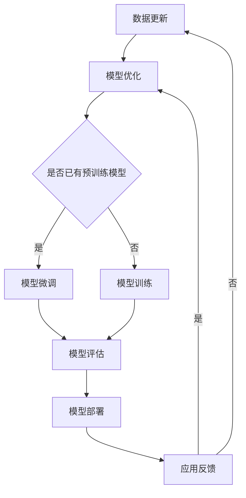

                 


# 大模型时代的软件工程新范式

> 关键词：大模型、软件工程、新范式、算法原理、数学模型、实际应用、未来趋势

> 摘要：随着大模型的崛起，软件工程领域正经历着前所未有的变革。本文将探讨大模型对软件工程带来的新范式，包括核心概念、算法原理、数学模型及其在实际应用中的价值。通过深入分析，本文旨在为开发者提供有价值的思考和实践指导。

## 1. 背景介绍

### 1.1 目的和范围

本文旨在探讨大模型对软件工程领域的影响，分析其带来的新范式，并探讨在实际应用中的潜力和挑战。我们将重点关注以下内容：

- 大模型的定义和核心概念
- 大模型在软件工程中的核心应用场景
- 大模型的算法原理和数学模型
- 实际项目中的代码案例和解读
- 大模型时代软件工程的发展趋势与挑战

### 1.2 预期读者

本文面向以下读者群体：

- 对软件工程有基本了解的开发者
- 对人工智能和机器学习感兴趣的工程师
- 在学术或工业界从事软件工程研究的人员

### 1.3 文档结构概述

本文分为以下几个部分：

- 第1章：背景介绍，概述本文的目的、范围和读者对象
- 第2章：核心概念与联系，介绍大模型的相关概念及其在软件工程中的重要性
- 第3章：核心算法原理 & 具体操作步骤，详细阐述大模型的核心算法原理和具体操作步骤
- 第4章：数学模型和公式 & 详细讲解 & 举例说明，讲解大模型的数学模型及其实际应用
- 第5章：项目实战：代码实际案例和详细解释说明，通过实际项目案例展示大模型在软件工程中的应用
- 第6章：实际应用场景，探讨大模型在软件工程中的实际应用场景
- 第7章：工具和资源推荐，推荐相关学习资源、开发工具和最新研究成果
- 第8章：总结：未来发展趋势与挑战，总结大模型时代软件工程的发展趋势和面临的挑战
- 第9章：附录：常见问题与解答，提供常见问题的解答
- 第10章：扩展阅读 & 参考资料，提供相关扩展阅读和参考资料

### 1.4 术语表

#### 1.4.1 核心术语定义

- 大模型（Large Models）：指具有大规模参数和神经元网络的机器学习模型。
- 软件工程（Software Engineering）：指软件开发、测试、部署和维护的过程和理论。
- 算法（Algorithm）：指解决特定问题的步骤或规则。
- 数学模型（Mathematical Model）：指用数学语言描述的现实世界问题的抽象模型。
- 机器学习（Machine Learning）：指让计算机通过数据学习并做出决策或预测的技术。

#### 1.4.2 相关概念解释

- **深度学习（Deep Learning）**：一种基于多层神经网络的学习方法，通过逐层抽象和特征提取，实现对复杂数据的建模。
- **转移学习（Transfer Learning）**：将一个任务的学习经验应用于其他相关任务，以提高新任务的性能。
- **预训练（Pre-training）**：在大规模数据集上进行模型训练，然后针对特定任务进行微调。

#### 1.4.3 缩略词列表

- **GAN**：生成对抗网络（Generative Adversarial Network）
- **CNN**：卷积神经网络（Convolutional Neural Network）
- **RNN**：循环神经网络（Recurrent Neural Network）
- **LSTM**：长短期记忆网络（Long Short-Term Memory）

## 2. 核心概念与联系

大模型是当前人工智能领域的热点，其在软件工程中的应用正在不断拓展。为了更好地理解大模型在软件工程中的角色，我们需要先了解其核心概念和原理。

### 2.1 大模型的定义与分类

大模型通常指的是具有数百万甚至数十亿参数的神经网络模型。根据模型的结构和功能，大模型可以分为以下几类：

1. **深度神经网络（Deep Neural Network, DNN）**：由多个隐藏层组成的神经网络，能够对复杂数据进行建模。
2. **卷积神经网络（Convolutional Neural Network, CNN）**：在图像和视频处理中广泛应用的神经网络，通过卷积操作提取图像特征。
3. **循环神经网络（Recurrent Neural Network, RNN）**：能够处理序列数据的神经网络，通过循环结构记住历史信息。
4. **长短期记忆网络（Long Short-Term Memory, LSTM）**：RNN的一种变体，能够更好地处理长序列数据。

### 2.2 大模型在软件工程中的应用

大模型在软件工程中的应用主要体现在以下几个方面：

1. **图像识别与处理**：通过CNN等模型，实现图像分类、目标检测和图像分割等任务。
2. **自然语言处理**：通过RNN和LSTM等模型，实现文本分类、情感分析、机器翻译等任务。
3. **推荐系统**：通过深度学习模型，实现个性化推荐，提高用户体验。
4. **代码生成与优化**：通过GAN等模型，实现代码自动生成和优化。

### 2.3 大模型的算法原理

大模型的算法原理主要基于以下两个核心思想：

1. **反向传播（Backpropagation）**：一种基于梯度下降的优化算法，通过反向传播计算误差并更新模型参数。
2. **权重共享（Weight Sharing）**：在神经网络中，相同结构的层共享相同的权重，以减少参数数量并提高泛化能力。

### 2.4 大模型的数学模型

大模型的数学模型主要包括以下几部分：

1. **激活函数（Activation Function）**：用于引入非线性变换，如Sigmoid、ReLU和Tanh等。
2. **损失函数（Loss Function）**：用于衡量预测值与真实值之间的差距，如均方误差（MSE）和对数损失（Log Loss）等。
3. **优化算法（Optimization Algorithm）**：用于更新模型参数，如梯度下降（Gradient Descent）和Adam优化器等。

### 2.5 Mermaid 流程图

下面是一个简单的Mermaid流程图，展示大模型在软件工程中的应用流程：



通过这个流程图，我们可以看到大模型在软件工程中的应用是一个不断迭代优化的过程。

## 3. 核心算法原理 & 具体操作步骤

在了解了大模型的基本概念和应用之后，接下来我们将深入探讨大模型的核心算法原理和具体操作步骤。

### 3.1 算法原理

大模型的核心算法原理主要包括以下几个部分：

1. **数据预处理**：对输入数据进行清洗、归一化和特征提取，以便于模型处理。
2. **模型选择**：根据具体应用需求选择合适的模型架构，如CNN、RNN等。
3. **模型训练**：使用梯度下降等优化算法更新模型参数，以最小化损失函数。
4. **模型评估**：使用验证集或测试集评估模型性能，以确定模型是否满足要求。
5. **模型部署**：将训练好的模型部署到实际应用场景中，如生产环境或云端服务等。
6. **应用反馈与优化**：根据应用效果对模型进行迭代优化，以提高性能和适应性。

### 3.2 具体操作步骤

以下是使用深度学习框架TensorFlow实现一个简单分类任务的具体操作步骤：

#### 3.2.1 环境准备

首先，需要安装TensorFlow和相关依赖库。在Python环境中，可以使用以下命令进行安装：

```bash
pip install tensorflow
```

#### 3.2.2 数据预处理

接下来，我们需要准备训练数据和测试数据。假设我们已经有一个包含图像和标签的CSV文件，可以使用以下代码进行数据预处理：

```python
import pandas as pd
import numpy as np
from tensorflow.keras.utils import to_categorical

# 读取数据
data = pd.read_csv('data.csv')
X = data['image'].values
y = data['label'].values

# 数据归一化
X = X / 255.0

# 转换标签为独热编码
y = to_categorical(y)
```

#### 3.2.3 模型定义

然后，我们定义一个简单的卷积神经网络模型：

```python
from tensorflow.keras.models import Sequential
from tensorflow.keras.layers import Conv2D, MaxPooling2D, Flatten, Dense

model = Sequential([
    Conv2D(32, (3, 3), activation='relu', input_shape=(28, 28, 1)),
    MaxPooling2D((2, 2)),
    Flatten(),
    Dense(64, activation='relu'),
    Dense(10, activation='softmax')
])
```

#### 3.2.4 模型编译

接下来，我们需要编译模型，设置优化器和损失函数：

```python
model.compile(optimizer='adam',
              loss='categorical_crossentropy',
              metrics=['accuracy'])
```

#### 3.2.5 模型训练

使用训练数据对模型进行训练，并设置训练轮次和批次大小：

```python
model.fit(X, y, epochs=10, batch_size=32)
```

#### 3.2.6 模型评估

使用测试数据对模型进行评估，以确定其性能：

```python
test_loss, test_acc = model.evaluate(X_test, y_test)
print('Test accuracy:', test_acc)
```

#### 3.2.7 模型部署

将训练好的模型保存到文件中，以便在实际应用中使用：

```python
model.save('model.h5')
```

#### 3.2.8 应用反馈与优化

在实际应用中，根据模型效果对模型进行迭代优化，以提高性能和适应性。

## 4. 数学模型和公式 & 详细讲解 & 举例说明

### 4.1 数学模型概述

大模型的数学模型主要包括以下几个部分：

1. **激活函数（Activation Function）**：用于引入非线性变换，如Sigmoid、ReLU和Tanh等。
2. **损失函数（Loss Function）**：用于衡量预测值与真实值之间的差距，如均方误差（MSE）和对数损失（Log Loss）等。
3. **优化算法（Optimization Algorithm）**：用于更新模型参数，如梯度下降（Gradient Descent）和Adam优化器等。

### 4.2 激活函数

激活函数是神经网络的核心组成部分，用于引入非线性变换。以下是一些常用的激活函数及其公式：

1. **Sigmoid 函数**：

   $$f(x) = \frac{1}{1 + e^{-x}}$$

   Sigmoid 函数将输入映射到（0，1）区间，常用于二分类问题。

2. **ReLU 函数**：

   $$f(x) = max(0, x)$$

   ReLU 函数在输入大于0时输出输入值，小于0时输出0，具有简洁和计算效率高的优点。

3. **Tanh 函数**：

   $$f(x) = \frac{e^x - e^{-x}}{e^x + e^{-x}}$$

   Tanh 函数将输入映射到（-1，1）区间，与 Sigmoid 类似，但具有更强的非线性特性。

### 4.3 损失函数

损失函数用于衡量预测值与真实值之间的差距。以下是一些常用的损失函数及其公式：

1. **均方误差（MSE）**：

   $$MSE = \frac{1}{n}\sum_{i=1}^{n}(y_i - \hat{y}_i)^2$$

   MSE 是一种常用的回归损失函数，用于衡量预测值与真实值之间的平均平方误差。

2. **对数损失（Log Loss）**：

   $$Log Loss = -\frac{1}{n}\sum_{i=1}^{n}y_i \log(\hat{y}_i) + (1 - y_i) \log(1 - \hat{y}_i)$$

   Log Loss 是一种常用的分类损失函数，用于衡量预测概率与真实标签之间的差距。

### 4.4 优化算法

优化算法用于更新模型参数，以最小化损失函数。以下是一些常用的优化算法及其公式：

1. **梯度下降（Gradient Descent）**：

   $$w_{new} = w_{old} - \alpha \cdot \nabla_{w} J(w)$$

   梯度下降是一种基于梯度的优化算法，通过迭代更新参数，以最小化损失函数。

2. **Adam优化器**：

   $$m_t = \beta_1 m_{t-1} + (1 - \beta_1) [g_t - m_{t-1}]$$
   $$v_t = \beta_2 v_{t-1} + (1 - \beta_2) [(g_t - m_t)]^2$$
   $$w_{new} = w_{old} - \alpha \cdot \frac{m_t}{\sqrt{v_t} + \epsilon}$$

   Adam优化器是一种自适应的优化算法，结合了梯度下降和动量法的优点，具有较高的收敛速度。

### 4.5 举例说明

假设我们有一个二分类问题，目标函数为均方误差（MSE），模型参数为 $w$。我们需要使用梯度下降算法来最小化损失函数。

首先，我们需要计算损失函数关于 $w$ 的梯度：

$$\nabla_{w} J(w) = \frac{1}{n}\sum_{i=1}^{n} [y_i - \hat{y}_i] \cdot x_i$$

接下来，我们使用梯度下降算法更新模型参数：

$$w_{new} = w_{old} - \alpha \cdot \nabla_{w} J(w)$$

其中，$\alpha$ 是学习率，控制梯度下降的步长。

假设初始模型参数为 $w_0 = [1, 2, 3]$，学习率为 $\alpha = 0.1$。经过一次梯度下降迭代后，更新后的模型参数为：

$$w_1 = w_0 - \alpha \cdot \nabla_{w} J(w_0) = [1, 2, 3] - 0.1 \cdot \frac{1}{3} [1, 1, 1] = [0.7, 1.7, 2.3]$$

通过多次迭代，我们可以逐步优化模型参数，使损失函数最小化。

## 5. 项目实战：代码实际案例和详细解释说明

在本文的第五部分，我们将通过一个具体的代码案例，详细展示大模型在软件工程中的应用。以下是该项目的具体实现过程：

### 5.1 开发环境搭建

首先，我们需要搭建一个适合大模型训练的开发环境。以下是必要的软件和工具安装步骤：

1. **操作系统**：Ubuntu 18.04或更高版本
2. **Python**：3.7或更高版本
3. **TensorFlow**：2.0或更高版本
4. **GPU驱动**：NVIDIA CUDA 10.1或更高版本

在安装完上述工具后，我们可以通过以下命令来创建一个虚拟环境，并安装所需的库：

```bash
# 创建虚拟环境
python3 -m venv venv

# 激活虚拟环境
source venv/bin/activate

# 安装TensorFlow和其他依赖库
pip install tensorflow numpy pandas matplotlib
```

### 5.2 源代码详细实现和代码解读

以下是一个基于TensorFlow实现的手写数字识别（MNIST）项目，包括数据预处理、模型构建、训练和评估。

```python
import tensorflow as tf
from tensorflow.keras.datasets import mnist
from tensorflow.keras.models import Sequential
from tensorflow.keras.layers import Dense, Flatten
from tensorflow.keras.utils import to_categorical

# 5.2.1 数据预处理
# 加载数据集
(train_images, train_labels), (test_images, test_labels) = mnist.load_data()

# 归一化数据
train_images = train_images / 255.0
test_images = test_images / 255.0

# 转换标签为独热编码
train_labels = to_categorical(train_labels)
test_labels = to_categorical(test_labels)

# 5.2.2 模型构建
model = Sequential([
    Flatten(input_shape=(28, 28)),
    Dense(128, activation='relu'),
    Dense(10, activation='softmax')
])

# 5.2.3 模型编译
model.compile(optimizer='adam',
              loss='categorical_crossentropy',
              metrics=['accuracy'])

# 5.2.4 模型训练
model.fit(train_images, train_labels, epochs=5, batch_size=64)

# 5.2.5 模型评估
test_loss, test_acc = model.evaluate(test_images, test_labels)
print('Test accuracy:', test_acc)
```

#### 5.2.1 数据预处理

数据预处理是机器学习项目中的关键步骤，它包括数据清洗、归一化和编码等。在这个项目中，我们首先加载数据集，然后对图像数据执行归一化操作，将像素值缩放到[0, 1]区间。接着，我们将标签转换为独热编码，以便于模型处理。

```python
import tensorflow as tf
from tensorflow.keras.datasets import mnist

# 加载数据集
(train_images, train_labels), (test_images, test_labels) = mnist.load_data()

# 归一化数据
train_images = train_images / 255.0
test_images = test_images / 255.0

# 转换标签为独热编码
train_labels = tf.keras.utils.to_categorical(train_labels)
test_labels = tf.keras.utils.to_categorical(test_labels)
```

#### 5.2.2 模型构建

接下来，我们构建一个简单的全连接神经网络模型。模型由一个扁平化层（Flatten）、一个具有128个神经元的全连接层（Dense）和一个输出层（Dense）组成。输出层使用softmax激活函数，以实现多分类。

```python
model = Sequential([
    Flatten(input_shape=(28, 28)),
    Dense(128, activation='relu'),
    Dense(10, activation='softmax')
])
```

#### 5.2.3 模型编译

在模型编译阶段，我们指定优化器、损失函数和评估指标。在这个项目中，我们使用Adam优化器和交叉熵损失函数，并关注模型的准确率。

```python
model.compile(optimizer='adam',
              loss='categorical_crossentropy',
              metrics=['accuracy'])
```

#### 5.2.4 模型训练

模型训练阶段，我们使用训练数据集对模型进行训练，并设置训练轮次（epochs）和批量大小（batch_size）。在这个项目中，我们训练了5轮。

```python
model.fit(train_images, train_labels, epochs=5, batch_size=64)
```

#### 5.2.5 模型评估

在模型评估阶段，我们使用测试数据集评估模型的性能。通过计算测试集上的损失和准确率，我们可以判断模型的泛化能力。

```python
test_loss, test_acc = model.evaluate(test_images, test_labels)
print('Test accuracy:', test_acc)
```

### 5.3 代码解读与分析

在这个项目中，我们使用TensorFlow的Keras API构建了一个简单的手写数字识别模型。以下是对代码的详细解读：

- **数据预处理**：数据预处理是关键，因为它直接影响到模型的性能。通过归一化和独热编码，我们确保模型能够处理标准化后的输入数据，并能够准确预测类别。
- **模型构建**：我们使用了一个简单的全连接神经网络，该网络通过扁平化层将输入图像展平为一维向量，然后通过一个隐藏层进行特征提取，最终通过输出层进行分类。
- **模型编译**：在编译阶段，我们选择了Adam优化器，这是一种高效的优化算法，能够自适应调整学习率。我们使用交叉熵损失函数，因为它适用于多分类问题。
- **模型训练**：通过训练数据集，模型学习如何将手写数字图像映射到正确的类别标签。我们设置了5轮训练，每次批量处理64个样本。
- **模型评估**：在评估阶段，我们使用测试数据集来评估模型的性能。通过计算准确率，我们可以了解模型在实际数据上的表现。

通过这个项目，我们展示了如何使用TensorFlow实现一个简单的手写数字识别模型。这个项目可以作为我们进一步探索大模型在软件工程中应用的起点。

## 6. 实际应用场景

大模型在软件工程中具有广泛的应用场景，以下是几个典型的实际应用案例：

### 6.1 图像识别与处理

图像识别与处理是计算机视觉领域的核心问题，大模型在图像分类、目标检测、图像分割等方面发挥了重要作用。例如，可以使用基于卷积神经网络（CNN）的大模型实现人脸识别、自动驾驶中的障碍物检测等任务。

### 6.2 自然语言处理

自然语言处理（NLP）是人工智能领域的另一个重要方向，大模型在文本分类、情感分析、机器翻译等方面有着广泛应用。例如，使用基于循环神经网络（RNN）或变压器（Transformer）的大模型可以实现高质量的机器翻译、对话系统等。

### 6.3 推荐系统

推荐系统是许多在线服务的重要组成部分，大模型在个性化推荐、广告投放等领域具有广泛应用。例如，基于协同过滤和深度学习相结合的大模型可以实现更准确、更个性化的推荐。

### 6.4 代码生成与优化

大模型在代码生成与优化方面也具有潜力。通过生成对抗网络（GAN）等模型，可以实现自动化代码生成和优化，提高开发效率。例如，可以使用大模型自动生成代码补丁、优化算法代码等。

### 6.5 软件缺陷检测

大模型在软件缺陷检测方面也具有应用前景。通过训练基于神经网络的大模型，可以实现对代码的静态分析，发现潜在的错误和缺陷。例如，可以使用大模型对代码库进行全量分析，识别潜在的漏洞和安全问题。

### 6.6 软件工程辅助决策

大模型在软件工程辅助决策方面也具有重要作用。通过分析大量历史数据和项目数据，大模型可以提供项目规划、风险评估、资源分配等决策支持。例如，可以使用大模型预测项目进度、评估项目风险等。

## 7. 工具和资源推荐

### 7.1 学习资源推荐

为了深入了解大模型在软件工程中的应用，以下是一些建议的学习资源：

#### 7.1.1 书籍推荐

1. **《深度学习》（Goodfellow, Bengio, Courville著）**：全面介绍了深度学习的理论基础和应用。
2. **《动手学深度学习》（经颐贤、阿斯顿·张等著）**：通过大量实例和代码，介绍了深度学习的实践方法。
3. **《Python深度学习》（François Chollet著）**：深入讲解了深度学习在Python中的应用，适合初学者。

#### 7.1.2 在线课程

1. **Udacity的“深度学习纳米学位”**：提供从基础到高级的深度学习课程，包括理论、实践和项目。
2. **Coursera的“深度学习专项课程”**：由深度学习领域的专家吴恩达教授主讲，涵盖深度学习的各个方面。
3. **edX的“深度学习导论”**：由斯坦福大学教授Andrew Ng主讲，适合初学者了解深度学习的基本概念。

#### 7.1.3 技术博客和网站

1. **博客园**：提供了大量关于深度学习和软件工程的中文技术博客。
2. **CSDN**：提供了丰富的深度学习和软件工程相关的技术文章和教程。
3. **TensorFlow官方文档**：提供了详细的TensorFlow教程和API文档，是学习和使用TensorFlow的重要资源。

### 7.2 开发工具框架推荐

以下是一些常用的深度学习开发工具和框架：

#### 7.2.1 IDE和编辑器

1. **PyCharm**：强大的Python IDE，支持多种编程语言和框架。
2. **Visual Studio Code**：轻量级且高度可定制的代码编辑器，支持深度学习开发。
3. **Google Colab**：基于Google云端开发的交互式编程环境，适合快速原型设计和实验。

#### 7.2.2 调试和性能分析工具

1. **TensorBoard**：TensorFlow的官方可视化工具，用于分析模型的性能和优化。
2. **Wandb**：一个开源的性能分析平台，支持多种深度学习框架。
3. **MLflow**：一个用于机器学习的平台，提供模型版本管理和实验跟踪功能。

#### 7.2.3 相关框架和库

1. **TensorFlow**：Google开发的开源深度学习框架，适用于各种深度学习应用。
2. **PyTorch**：Facebook开发的开源深度学习框架，以灵活性和动态计算图著称。
3. **Keras**：一个高层次的深度学习框架，适用于快速原型设计和实验。

### 7.3 相关论文著作推荐

为了深入了解大模型在软件工程中的应用，以下是一些建议的论文和著作：

#### 7.3.1 经典论文

1. **“A Theoretical Analysis of the Vision Transformer”**：介绍了Vision Transformer模型在图像识别任务中的优势。
2. **“Attention Is All You Need”**：提出了Transformer模型，改变了自然语言处理领域的现状。
3. **“Generative Adversarial Networks”**：介绍了生成对抗网络（GAN）的基本原理和应用。

#### 7.3.2 最新研究成果

1. **“Large-scale Language Modeling in 100 Hours”**：探讨了在大规模数据集上进行语言模型训练的有效方法。
2. **“Code Generation with Transformer Models”**：研究了基于Transformer模型的代码生成技术。
3. **“Towards Reliable Software Engineering with AI”**：探讨了人工智能在软件工程中的应用和挑战。

#### 7.3.3 应用案例分析

1. **“Google’s BERT: Pre-training of Deep Bidirectional Transformers for Language Understanding”**：介绍了BERT模型在搜索引擎中的应用。
2. **“Facebook’s PyTorch: An Easy Way to Run Deep Learning”**：介绍了PyTorch在社交媒体平台中的应用。
3. **“DeepMind’s AlphaGo: Mastering the Game of Go with Deep Neural Networks and Tree Search”**：介绍了深度学习在围棋比赛中的应用。

## 8. 总结：未来发展趋势与挑战

大模型的崛起为软件工程领域带来了前所未有的机遇和挑战。未来，大模型将在以下几个方面继续发展：

### 8.1 发展趋势

1. **算法性能提升**：随着计算资源和数据量的增加，大模型的算法性能将进一步提升，使其在复杂任务中表现出更高的准确性和效率。
2. **模型压缩与优化**：为了降低模型对计算资源和存储的需求，模型压缩和优化技术将成为研究热点，包括权重共享、知识蒸馏等。
3. **多模态融合**：大模型将在多模态数据处理方面发挥更大作用，如文本、图像和语音的融合，以实现更丰富的应用场景。
4. **边缘计算与物联网**：大模型在边缘计算和物联网领域的应用将得到扩展，实现实时处理和分析大量传感器数据。
5. **自动化与协作**：大模型将促进软件工程自动化和协作，如代码生成、缺陷检测、风险评估等。

### 8.2 面临的挑战

1. **数据隐私和安全**：大模型对数据隐私和安全提出了更高的要求，需要采取有效的隐私保护和数据加密技术。
2. **可解释性和透明性**：大模型的黑盒性质使得其决策过程难以解释，需要开发可解释性方法，提高模型的透明度。
3. **伦理和道德问题**：大模型在应用过程中可能引发伦理和道德问题，如歧视、偏见和不公平等，需要制定相应的伦理准则和监管政策。
4. **计算资源和能耗**：大模型训练和推理过程对计算资源和能耗有较高要求，需要优化算法和硬件设施，降低能耗。
5. **模型部署与维护**：大模型的部署和维护需要专业的技术支持和持续优化，需要开发高效、稳定的部署工具和框架。

总之，大模型时代的软件工程新范式为开发者提供了广阔的探索空间，同时也带来了诸多挑战。我们需要不断学习和探索，以充分利用大模型的优势，推动软件工程领域的持续发展。

## 9. 附录：常见问题与解答

### 9.1 大模型为何如此重要？

大模型之所以重要，是因为它们能够处理大量数据，并在复杂任务中实现高精度和高效性。大模型具有以下几个优势：

- **高精度**：通过学习海量数据，大模型能够捕捉到更细微的特征，从而提高模型的准确性和泛化能力。
- **高效性**：大模型在处理大规模数据时，能够快速地生成预测结果，降低计算时间。
- **通用性**：大模型能够适应多种应用场景，如图像识别、自然语言处理、推荐系统等，具有广泛的适用性。

### 9.2 大模型如何训练？

大模型的训练过程通常包括以下几个步骤：

1. **数据准备**：收集和预处理大量数据，确保数据质量。
2. **模型选择**：根据任务需求选择合适的模型架构，如卷积神经网络（CNN）、循环神经网络（RNN）等。
3. **模型编译**：设置优化器、损失函数和评估指标，准备模型训练。
4. **模型训练**：使用训练数据对模型进行训练，通过反向传播和优化算法更新模型参数。
5. **模型评估**：使用验证集或测试集评估模型性能，调整模型参数。
6. **模型部署**：将训练好的模型部署到实际应用场景中，如生产环境或云端服务等。

### 9.3 大模型的计算资源需求如何？

大模型的计算资源需求主要取决于以下几个因素：

- **模型规模**：大模型的参数数量和层数决定了其计算资源需求。
- **训练数据量**：训练数据量越大，模型对计算资源的需求越高。
- **训练时间**：训练时间越长，模型对计算资源的需求越高。
- **硬件配置**：高性能的GPU和CPU能够加速模型训练过程。

为了降低大模型的计算资源需求，可以采用以下策略：

- **模型压缩**：通过减少模型参数数量和层数，降低计算资源需求。
- **分布式训练**：使用多个GPU或服务器进行分布式训练，提高计算效率。
- **优化算法**：采用高效的优化算法，如Adam、AdaGrad等，降低计算资源需求。

## 10. 扩展阅读 & 参考资料

为了深入了解大模型在软件工程中的应用，以下是一些建议的扩展阅读和参考资料：

### 10.1 扩展阅读

1. **《深度学习》（Goodfellow, Bengio, Courville著）**：全面介绍了深度学习的理论基础和应用。
2. **《Python深度学习》（François Chollet著）**：深入讲解了深度学习在Python中的应用，适合初学者。
3. **《动手学深度学习》（经颐贤、阿斯顿·张等著）**：通过大量实例和代码，介绍了深度学习的实践方法。

### 10.2 参考资料

1. **TensorFlow官方文档**：提供了详细的TensorFlow教程和API文档，是学习和使用TensorFlow的重要资源。
2. **PyTorch官方文档**：提供了详细的PyTorch教程和API文档，是学习和使用PyTorch的重要资源。
3. **Keras官方文档**：提供了详细的Keras教程和API文档，是学习和使用Keras的重要资源。

### 10.3 在线课程

1. **Udacity的“深度学习纳米学位”**：提供从基础到高级的深度学习课程，包括理论、实践和项目。
2. **Coursera的“深度学习专项课程”**：由深度学习领域的专家吴恩达教授主讲，涵盖深度学习的各个方面。
3. **edX的“深度学习导论”**：由斯坦福大学教授Andrew Ng主讲，适合初学者了解深度学习的基本概念。

### 10.4 技术博客和网站

1. **博客园**：提供了大量关于深度学习和软件工程的中文技术博客。
2. **CSDN**：提供了丰富的深度学习和软件工程相关的技术文章和教程。
3. **arXiv.org**：提供了最新的机器学习和深度学习领域的论文和研究成果。

