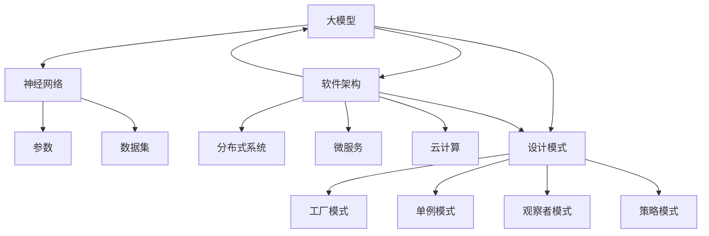

                 

# 大模型时代的软件架构设计模式

> 关键词：大模型、软件架构、设计模式、AI、深度学习、分布式系统、系统优化、云计算、微服务、容器化、DevOps

> 摘要：随着人工智能和深度学习的快速发展，大模型在各个领域的应用日益广泛。本文将探讨大模型时代的软件架构设计模式，分析其核心概念、算法原理、数学模型以及实际应用场景。旨在为开发者提供有针对性的架构设计方案，助力大模型在实际项目中的高效实现。

## 1. 背景介绍

### 1.1 目的和范围

本文旨在探讨大模型时代的软件架构设计模式，通过分析核心概念、算法原理、数学模型以及实际应用场景，为开发者提供有针对性的架构设计方案。本文涵盖了以下几个方面的内容：

1. 大模型的核心概念与联系。
2. 大模型的核心算法原理与具体操作步骤。
3. 大模型相关的数学模型和公式。
4. 大模型在实际项目中的应用场景。
5. 大模型开发中的工具和资源推荐。
6. 大模型未来发展趋势与挑战。

### 1.2 预期读者

本文面向具有一定编程基础和计算机科学背景的开发者，特别是对人工智能和深度学习感兴趣的读者。通过本文的学习，读者可以了解大模型时代的软件架构设计模式，掌握大模型的相关技术和实现方法，为实际项目提供有价值的参考。

### 1.3 文档结构概述

本文结构如下：

1. 引言
2. 大模型的核心概念与联系
3. 大模型的核心算法原理与具体操作步骤
4. 大模型相关的数学模型和公式
5. 大模型在实际项目中的应用场景
6. 大模型开发中的工具和资源推荐
7. 未来发展趋势与挑战
8. 附录：常见问题与解答
9. 扩展阅读 & 参考资料

### 1.4 术语表

#### 1.4.1 核心术语定义

- 大模型：指具有大规模参数量和训练数据的深度学习模型。
- 软件架构：指软件开发过程中，关于系统整体结构和组成部分的规划与设计。
- 设计模式：指解决软件开发中常见问题的通用解决方案。

#### 1.4.2 相关概念解释

- 深度学习：一种基于多层级神经网络进行特征提取和学习的技术。
- 分布式系统：指由多个节点组成的系统，各个节点通过通信进行协同工作。
- 云计算：指通过互联网提供计算资源、存储资源和网络服务的计算模式。
- 微服务：一种将应用程序分解为多个小型、独立服务的架构风格。

#### 1.4.3 缩略词列表

- AI：人工智能
- ML：机器学习
- DL：深度学习
- CPU：中央处理器
- GPU：图形处理器
- DevOps：开发与运维一体化
- Docker：容器化技术
- Kubernetes：容器编排系统

## 2. 核心概念与联系

大模型时代的软件架构设计模式涉及多个核心概念和联系，下面将介绍这些概念及其关系。

### 2.1 大模型

大模型是一种具有大规模参数量和训练数据的深度学习模型。其核心思想是通过多层级神经网络进行特征提取和学习，从而实现对复杂数据的高效表示和建模。

大模型的关键组成部分包括：

- **神经网络**：大模型的基础结构，由多个层级和神经元组成，用于对数据进行特征提取和建模。
- **参数**：大模型中的权重和偏置等可学习参数，用于调整模型在训练过程中的性能。
- **数据集**：用于训练和验证大模型的原始数据，通常包含大量的样本和标签。

### 2.2 软件架构

软件架构是指在软件开发过程中，关于系统整体结构和组成部分的规划与设计。在大模型时代，软件架构的设计需要充分考虑大模型的特性，以实现高效、可扩展和可维护的系统。

常见的软件架构设计模式包括：

- **分布式系统**：通过将系统分解为多个节点，实现分布式计算和存储，提高系统性能和可扩展性。
- **微服务**：将应用程序分解为多个小型、独立的服务，实现模块化、高内聚、低耦合的系统架构。
- **云计算**：利用云计算资源，实现弹性、高效和可扩展的部署和运维。

### 2.3 设计模式

设计模式是指解决软件开发中常见问题的通用解决方案。在大模型时代，设计模式可以帮助开发者更好地应对大模型相关的挑战，提高系统的性能、可维护性和可扩展性。

常见的设计模式包括：

- **工厂模式**：用于创建对象，降低对象创建的复杂性，提高系统的可扩展性。
- **单例模式**：确保一个类只有一个实例，并提供一个访问它的全局访问点。
- **观察者模式**：实现对象之间的解耦，实现事件驱动的系统架构。
- **策略模式**：封装可变的算法，实现算法与使用算法的分离。

### 2.4 Mermaid 流程图

下面是一个 Mermaid 流程图，展示了大模型、软件架构和设计模式之间的联系：



通过上述流程图，我们可以清晰地看到大模型、软件架构和设计模式之间的联系。大模型作为核心，驱动软件架构和设计模式的发展；软件架构为开发大模型提供支持，设计模式则优化和提升大模型的性能。

## 3. 核心算法原理 & 具体操作步骤

在本文的第三部分，我们将详细讲解大模型的核心算法原理以及具体的操作步骤。首先，我们将介绍深度学习的基本概念，然后逐步阐述大模型的训练过程和优化方法。

### 3.1 深度学习的基本概念

深度学习是一种基于多层级神经网络进行特征提取和学习的技术。其核心思想是通过多层级神经网络对数据进行层层抽象，最终实现复杂数据的表示和建模。

#### 3.1.1 神经网络

神经网络是由多个层级和神经元组成的计算模型。每个神经元都接收来自前一层的输入，通过权重和激活函数进行处理，输出给下一层。

- **层级**：神经网络可以分为输入层、隐藏层和输出层。每一层都对数据进行一定的特征提取和变换。
- **神经元**：神经网络的基本单元，接收输入信号，通过权重和激活函数产生输出。
- **权重**：连接神经元的参数，用于调整神经元之间的连接强度。
- **激活函数**：用于引入非线性变换，使神经网络具有表达能力。

#### 3.1.2 激活函数

常见的激活函数包括：

- **sigmoid函数**：\( f(x) = \frac{1}{1 + e^{-x}} \)
- **ReLU函数**：\( f(x) = \max(0, x) \)
- **Tanh函数**：\( f(x) = \frac{e^x - e^{-x}}{e^x + e^{-x}} \)

#### 3.1.3 前向传播

前向传播是指将输入数据从输入层传递到输出层的过程。具体步骤如下：

1. **初始化参数**：随机初始化权重和偏置。
2. **计算输入**：将输入数据乘以权重，加上偏置，得到每个神经元的输入。
3. **应用激活函数**：对输入数据进行激活函数处理，得到当前层的输出。
4. **传递输出**：将当前层的输出作为输入传递到下一层。
5. **重复步骤2-4**，直到输出层。

### 3.2 大模型的训练过程

大模型的训练过程主要包括数据预处理、模型初始化、前向传播、反向传播和参数更新等步骤。

#### 3.2.1 数据预处理

数据预处理是训练大模型的重要环节，主要包括以下步骤：

1. **数据清洗**：去除噪声数据、缺失数据和异常值。
2. **数据标准化**：将数据缩放到一定的范围，便于模型训练。
3. **数据增强**：通过旋转、缩放、裁剪等操作，增加数据多样性，提高模型的泛化能力。

#### 3.2.2 模型初始化

模型初始化是指随机初始化权重和偏置。常见的初始化方法包括：

1. **随机初始化**：随机分配权重和偏置的值。
2. **高斯初始化**：根据正态分布初始化权重和偏置的值。
3. **Xavier初始化**：根据 Xavier-Glorot 初始化方法，自适应地初始化权重和偏置的值。

#### 3.2.3 前向传播

前向传播是指将输入数据从输入层传递到输出层的过程。具体步骤如下：

1. **初始化参数**：随机初始化权重和偏置。
2. **计算输入**：将输入数据乘以权重，加上偏置，得到每个神经元的输入。
3. **应用激活函数**：对输入数据进行激活函数处理，得到当前层的输出。
4. **传递输出**：将当前层的输出作为输入传递到下一层。
5. **重复步骤2-4**，直到输出层。

#### 3.2.4 反向传播

反向传播是指将输出误差反向传播到输入层，更新权重和偏置的过程。具体步骤如下：

1. **计算误差**：计算输出层与实际输出之间的误差。
2. **计算梯度**：计算每个参数的梯度，用于指导参数的更新。
3. **更新参数**：根据梯度下降方法，更新权重和偏置的值。

#### 3.2.5 参数更新

参数更新是指根据梯度更新权重和偏置的值，以减少输出误差。常见的更新方法包括：

1. **梯度下降**：根据梯度的反方向更新参数。
2. **动量优化**：结合历史梯度信息，加速参数更新过程。
3. **自适应优化器**：自动调整学习率，提高参数更新的效率。

### 3.3 大模型的优化方法

大模型的优化方法包括模型压缩、迁移学习、模型融合等，以提高模型的性能和泛化能力。

#### 3.3.1 模型压缩

模型压缩是指通过减少模型参数的数量和计算量，降低模型存储和计算资源的需求。常见的模型压缩方法包括：

1. **剪枝**：通过删除冗余的连接和神经元，减少模型参数的数量。
2. **量化**：将模型的参数和权重从浮点数转换为低精度的整数，减少模型的存储和计算资源。
3. **知识蒸馏**：通过训练一个较小的模型（学生模型），从较大的模型（教师模型）中提取知识和知识结构。

#### 3.3.2 迁移学习

迁移学习是指利用已在大规模数据集上训练好的模型，在新任务上获得更好的性能。常见的迁移学习方法包括：

1. **模型复用**：直接将已训练好的模型应用于新任务。
2. **特征迁移**：将已训练好的模型的特征提取器应用于新任务，并通过少量样本进行微调。
3. **预训练**：在大规模数据集上预训练模型，然后在特定任务上继续训练模型。

#### 3.3.3 模型融合

模型融合是指将多个模型的结果进行融合，以获得更好的预测性能。常见的模型融合方法包括：

1. **投票**：将多个模型的预测结果进行投票，选择投票结果最多的类别作为最终预测结果。
2. **加权融合**：根据模型的性能和置信度，为每个模型分配权重，然后计算加权平均值作为最终预测结果。
3. **集成学习**：利用集成学习算法（如随机森林、支持向量机等），将多个模型融合为一个强大的预测模型。

### 3.4 伪代码

下面是大模型训练过程的伪代码：

```python
# 初始化参数
W = random_weights()
b = random_bias()

# 数据预处理
X = preprocess_data()

# 前向传播
z = X * W + b
y = activation(z)

# 计算误差
error = actual_output - y

# 反向传播
dW = dX * (1 - activation_derivative(y))
db = dX

# 更新参数
W -= learning_rate * dW
b -= learning_rate * db
```

通过上述伪代码，我们可以看到大模型训练过程的基本步骤，包括参数初始化、数据预处理、前向传播、反向传播和参数更新。

## 4. 数学模型和公式 & 详细讲解 & 举例说明

在第四部分，我们将详细讲解大模型相关的数学模型和公式，并给出具体的例子进行说明。

### 4.1 激活函数的数学公式

激活函数是神经网络中引入非线性变换的关键，常见的激活函数包括：

- **Sigmoid函数**：\( f(x) = \frac{1}{1 + e^{-x}} \)
  - 公式解释：Sigmoid函数将输入\( x \)映射到\( (0,1) \)区间，具有平滑的S型曲线。
- **ReLU函数**：\( f(x) = \max(0, x) \)
  - 公式解释：ReLU函数将负输入映射为0，正输入映射为自身，具有简单且易于计算的特性。
- **Tanh函数**：\( f(x) = \frac{e^x - e^{-x}}{e^x + e^{-x}} \)
  - 公式解释：Tanh函数将输入映射到\( (-1,1) \)区间，具有对称性，能够缓解梯度消失问题。

### 4.2 梯度下降的数学公式

梯度下降是优化神经网络参数的基本方法，其核心思想是沿着损失函数的梯度方向进行迭代更新。具体公式如下：

\[ \Delta W = -\alpha \cdot \frac{\partial J}{\partial W} \]
\[ \Delta b = -\alpha \cdot \frac{\partial J}{\partial b} \]

其中：
- \( \Delta W \)和\( \Delta b \)分别为权重和偏置的更新量。
- \( \alpha \)为学习率，用于控制更新步长。
- \( \frac{\partial J}{\partial W} \)和\( \frac{\partial J}{\partial b} \)分别为权重和偏置的梯度。

### 4.3 前向传播和反向传播的数学公式

神经网络的前向传播和反向传播过程可以分别表示为：

#### 前向传播：

\[ z^{(l)} = \sum_{j} W^{(l)}_{ij} x^{(j)} + b^{(l)} \]
\[ a^{(l)} = \text{activation}(z^{(l)}) \]

其中：
- \( z^{(l)} \)为第\( l \)层的输入。
- \( W^{(l)}_{ij} \)为第\( l \)层第\( i \)个神经元到第\( l+1 \)层第\( j \)个神经元的权重。
- \( b^{(l)} \)为第\( l \)层的偏置。
- \( a^{(l)} \)为第\( l \)层的输出。
- \( \text{activation} \)为激活函数。

#### 反向传播：

\[ \delta^{(l)} = (1 - a^{(l)}) \cdot a^{(l)} \cdot \frac{\partial J}{\partial z^{(l)}} \]
\[ \Delta W^{(l)} = \sum_{i} \delta^{(l)} a^{(l-1)} \]
\[ \Delta b^{(l)} = \sum_{i} \delta^{(l)} \]

其中：
- \( \delta^{(l)} \)为第\( l \)层的误差项。
- \( \frac{\partial J}{\partial z^{(l)}} \)为第\( l \)层输入的梯度。
- \( \Delta W^{(l)} \)和\( \Delta b^{(l)} \)分别为第\( l \)层的权重和偏置的更新量。

### 4.4 例子说明

假设我们有一个简单的神经网络，包含一个输入层、一个隐藏层和一个输出层。输入层有3个神经元，隐藏层有4个神经元，输出层有2个神经元。激活函数使用ReLU函数。

#### 前向传播：

输入数据为\( x_1 = [1, 2, 3], x_2 = [4, 5, 6], x_3 = [7, 8, 9] \)。

1. **计算隐藏层输入**：
   \[ z_1^{(1)} = W_{11}^{(1)} x_1 + b_1^{(1)} \]
   \[ z_2^{(1)} = W_{12}^{(1)} x_1 + b_2^{(1)} \]
   \[ z_3^{(1)} = W_{13}^{(1)} x_1 + b_3^{(1)} \]
   \[ z_4^{(1)} = W_{14}^{(1)} x_1 + b_4^{(1)} \]
   \[ \dots \]
   \[ z_1^{(1)} = W_{14}^{(1)} x_3 + b_4^{(1)} \]

2. **计算隐藏层输出**：
   \[ a_1^{(1)} = \text{ReLU}(z_1^{(1)}) \]
   \[ a_2^{(1)} = \text{ReLU}(z_2^{(1)}) \]
   \[ a_3^{(1)} = \text{ReLU}(z_3^{(1)}) \]
   \[ a_4^{(1)} = \text{ReLU}(z_4^{(1)}) \]
   \[ \dots \]
   \[ a_n^{(1)} = \text{ReLU}(z_n^{(1)}) \]

3. **计算输出层输入**：
   \[ z_1^{(2)} = W_{11}^{(2)} a_1^{(1)} + b_1^{(2)} \]
   \[ z_2^{(2)} = W_{12}^{(2)} a_1^{(1)} + b_2^{(2)} \]
   \[ \dots \]
   \[ z_m^{(2)} = W_{m1}^{(2)} a_n^{(1)} + b_m^{(2)} \]

4. **计算输出层输出**：
   \[ a_1^{(2)} = \text{ReLU}(z_1^{(2)}) \]
   \[ a_2^{(2)} = \text{ReLU}(z_2^{(2)}) \]
   \[ \dots \]
   \[ a_p^{(2)} = \text{ReLU}(z_p^{(2)}) \]

#### 反向传播：

假设输出层的误差为\( \delta_1^{(2)} = 0.1 \)，\( \delta_2^{(2)} = 0.2 \)。

1. **计算隐藏层误差**：
   \[ \delta_1^{(1)} = \delta_1^{(2)} \cdot \frac{\partial a_1^{(2)}}{\partial z_1^{(2)}} \]
   \[ \delta_2^{(1)} = \delta_2^{(2)} \cdot \frac{\partial a_2^{(2)}}{\partial z_2^{(2)}} \]
   \[ \dots \]
   \[ \delta_n^{(1)} = \delta_n^{(2)} \cdot \frac{\partial a_n^{(2)}}{\partial z_n^{(2)}} \]

2. **计算权重和偏置的梯度**：
   \[ \frac{\partial J}{\partial W_{11}^{(1)}} = \sum_{i} \delta_i^{(1)} x_i \]
   \[ \frac{\partial J}{\partial b_1^{(1)}} = \sum_{i} \delta_i^{(1)} \]

3. **更新权重和偏置**：
   \[ W_{11}^{(1)} -= \alpha \cdot \frac{\partial J}{\partial W_{11}^{(1)}} \]
   \[ b_1^{(1)} -= \alpha \cdot \frac{\partial J}{\partial b_1^{(1)}} \]

通过上述例子，我们可以看到神经网络的前向传播和反向传播过程，以及相关数学公式的应用。

## 5. 项目实战：代码实际案例和详细解释说明

在这一部分，我们将通过一个实际案例来展示大模型在软件架构设计中的应用。我们将使用Python编写一个简单的神经网络，实现图像分类任务，并详细解释每一步的代码实现和原理。

### 5.1 开发环境搭建

在开始之前，我们需要搭建一个合适的开发环境。以下是所需的软件和工具：

- Python 3.8 或以上版本
- TensorFlow 2.4 或以上版本
- Jupyter Notebook 或 PyCharm

安装相关软件和工具后，我们可以创建一个新的Python虚拟环境，并安装所需的依赖项。

```bash
# 创建虚拟环境
python -m venv env

# 激活虚拟环境
source env/bin/activate

# 安装 TensorFlow
pip install tensorflow
```

### 5.2 源代码详细实现和代码解读

下面是一个简单的神经网络实现，用于对MNIST手写数字数据进行分类。我们将逐步解释代码中的每一部分。

```python
import tensorflow as tf
from tensorflow.keras import layers

# 5.2.1 数据预处理
# 加载MNIST数据集
(x_train, y_train), (x_test, y_test) = tf.keras.datasets.mnist.load_data()

# 数据标准化
x_train = x_train / 255.0
x_test = x_test / 255.0

# 转换为TensorFlow数据格式
x_train = x_train.reshape(-1, 28, 28, 1)
x_test = x_test.reshape(-1, 28, 28, 1)

# 5.2.2 构建神经网络模型
model = tf.keras.Sequential([
    layers.Conv2D(32, (3, 3), activation='relu', input_shape=(28, 28, 1)),
    layers.MaxPooling2D((2, 2)),
    layers.Conv2D(64, (3, 3), activation='relu'),
    layers.MaxPooling2D((2, 2)),
    layers.Conv2D(64, (3, 3), activation='relu'),
    layers.Flatten(),
    layers.Dense(64, activation='relu'),
    layers.Dense(10, activation='softmax')
])

# 编译模型
model.compile(optimizer='adam',
              loss='sparse_categorical_crossentropy',
              metrics=['accuracy'])

# 5.2.3 训练模型
model.fit(x_train, y_train, epochs=5, batch_size=64)

# 5.2.4 评估模型
test_loss, test_acc = model.evaluate(x_test, y_test, verbose=2)
print(f'\nTest accuracy: {test_acc:.4f}')
```

### 5.3 代码解读与分析

#### 5.3.1 数据预处理

在代码中，我们首先加载了MNIST数据集，并进行了数据标准化。数据标准化是将图像的像素值缩放到\( [0, 1] \)区间，以便模型更好地训练。

```python
(x_train, y_train), (x_test, y_test) = tf.keras.datasets.mnist.load_data()
x_train = x_train / 255.0
x_test = x_test / 255.0
```

#### 5.3.2 构建神经网络模型

接下来，我们使用Keras构建了一个简单的卷积神经网络（CNN）。该网络包含三个卷积层、两个最大池化层和一个全连接层。

- **卷积层**：用于提取图像特征，通过卷积运算和激活函数（ReLU）增强特征表示能力。
- **最大池化层**：用于减少模型参数和计算量，同时保留重要特征。
- **全连接层**：用于对提取到的特征进行分类。

```python
model = tf.keras.Sequential([
    layers.Conv2D(32, (3, 3), activation='relu', input_shape=(28, 28, 1)),
    layers.MaxPooling2D((2, 2)),
    layers.Conv2D(64, (3, 3), activation='relu'),
    layers.MaxPooling2D((2, 2)),
    layers.Conv2D(64, (3, 3), activation='relu'),
    layers.Flatten(),
    layers.Dense(64, activation='relu'),
    layers.Dense(10, activation='softmax')
])
```

#### 5.3.3 训练模型

在训练过程中，我们使用了Adam优化器和稀疏分类交叉熵损失函数。这些参数是为了优化模型的训练过程，提高模型的分类准确性。

```python
model.compile(optimizer='adam',
              loss='sparse_categorical_crossentropy',
              metrics=['accuracy'])
model.fit(x_train, y_train, epochs=5, batch_size=64)
```

#### 5.3.4 评估模型

最后，我们使用测试集对模型进行评估，并打印出测试准确率。

```python
test_loss, test_acc = model.evaluate(x_test, y_test, verbose=2)
print(f'\nTest accuracy: {test_acc:.4f}')
```

通过上述代码，我们展示了如何使用TensorFlow和Keras构建和训练一个简单的卷积神经网络，实现图像分类任务。这个案例为后续更复杂的大模型应用提供了基础。

## 6. 实际应用场景

在大模型时代，软件架构设计模式在实际应用场景中发挥着重要作用。下面我们将探讨几个典型的应用场景，并分析其适用的架构设计模式和关键挑战。

### 6.1 智能推荐系统

智能推荐系统是一种利用大模型进行数据挖掘和预测的技术，广泛应用于电子商务、社交媒体和内容平台等领域。其核心挑战在于如何高效地处理海量数据，并提供个性化的推荐结果。

**适用的架构设计模式**：

- **微服务架构**：通过将推荐系统分解为多个微服务，实现模块化、高内聚、低耦合的系统设计，提高系统的可扩展性和维护性。
- **分布式计算**：利用分布式系统架构，将数据处理和计算任务分配到多个节点上，实现并行处理，提高系统性能。

**关键挑战**：

- **数据一致性**：在分布式系统中，数据的一致性和同步是关键挑战，需要采用分布式数据库和一致性算法来确保数据的一致性。
- **实时性**：推荐系统需要实时响应用户的行为，实现高效的数据处理和模型更新。

### 6.2 自然语言处理（NLP）

自然语言处理是人工智能领域的一个重要分支，广泛应用于语音识别、机器翻译、情感分析等领域。随着大模型技术的发展，NLP系统越来越复杂，需要高效的软件架构设计。

**适用的架构设计模式**：

- **容器化技术**：利用容器化技术（如Docker），实现NLP模型的快速部署和动态扩展，提高系统的部署效率。
- **微服务架构**：将NLP系统分解为多个微服务，如文本预处理、词向量生成、情感分析等，实现模块化设计和灵活部署。

**关键挑战**：

- **计算资源调度**：在大模型训练和推理过程中，需要高效地调度计算资源，实现任务的合理分配和优化。
- **模型更新和维护**：随着应用场景的变化，NLP模型需要不断更新和优化，需要设计高效的模型更新和维护机制。

### 6.3 计算机视觉

计算机视觉技术在图像识别、目标检测、图像生成等领域具有广泛的应用。随着大模型技术的发展，计算机视觉系统越来越复杂，需要高效的软件架构设计。

**适用的架构设计模式**：

- **分布式计算**：利用分布式系统架构，将图像处理和计算任务分配到多个节点上，实现并行处理，提高系统性能。
- **微服务架构**：将计算机视觉系统分解为多个微服务，如图像预处理、特征提取、目标检测等，实现模块化设计和灵活部署。

**关键挑战**：

- **数据同步和一致性**：在分布式系统中，数据同步和一致性是关键挑战，需要采用分布式数据库和一致性算法来确保数据的一致性。
- **计算资源调度**：在大模型训练和推理过程中，需要高效地调度计算资源，实现任务的合理分配和优化。

### 6.4 自动驾驶

自动驾驶技术是人工智能领域的一个重要应用，涉及感知、规划、控制等多个方面。随着大模型技术的发展，自动驾驶系统需要高效的软件架构设计。

**适用的架构设计模式**：

- **分布式计算**：利用分布式系统架构，实现自动驾驶系统的实时感知和决策，提高系统性能。
- **微服务架构**：将自动驾驶系统分解为多个微服务，如感知模块、规划模块、控制模块等，实现模块化设计和灵活部署。

**关键挑战**：

- **数据同步和一致性**：在分布式系统中，数据同步和一致性是关键挑战，需要采用分布式数据库和一致性算法来确保数据的一致性。
- **安全性和可靠性**：自动驾驶系统需要保证高安全性和可靠性，防止潜在的安全漏洞和故障。

通过以上实际应用场景的分析，我们可以看到大模型时代的软件架构设计模式在提高系统性能、可扩展性和可靠性方面具有重要意义。在实际应用中，开发者需要根据具体场景和需求，灵活选择和应用合适的架构设计模式，以实现高效、可靠的大模型应用。

## 7. 工具和资源推荐

在大模型时代，选择合适的工具和资源对于开发高效、可靠的软件系统至关重要。以下是我们推荐的几个工具和资源，涵盖学习资源、开发工具框架和论文著作。

### 7.1 学习资源推荐

#### 7.1.1 书籍推荐

1. **《深度学习》（Goodfellow, Bengio, Courville 著）**：这是一本经典的深度学习入门书籍，全面介绍了深度学习的基础理论和实践方法。
2. **《Python深度学习》（François Chollet 著）**：这本书详细介绍了使用Python和TensorFlow进行深度学习的实践技巧，适合有一定编程基础的读者。
3. **《动手学深度学习》（阿斯顿·张等著）**：这本书通过大量的代码示例和实验，帮助读者深入理解深度学习的基础理论和实践方法。

#### 7.1.2 在线课程

1. **吴恩达的《深度学习专项课程》（Udacity）**：这是一门经典的深度学习在线课程，由吴恩达亲自授课，涵盖了深度学习的基础理论和实践方法。
2. **斯坦福大学《深度学习》（Stanford University）**：这是一门由李飞飞教授讲授的深度学习在线课程，适合有一定编程基础的读者深入学习。
3. **谷歌的《机器学习》（Google）**：这是一门面向开发者的机器学习和深度学习在线课程，内容涵盖了从基础理论到实际应用的各个方面。

#### 7.1.3 技术博客和网站

1. **TensorFlow官网（TensorFlow）**：TensorFlow是当前最受欢迎的深度学习框架之一，官网提供了丰富的文档、教程和示例代码。
2. **ArXiv（arxiv.org）**：这是一个涵盖计算机科学和人工智能领域最新研究成果的学术预印本网站，适合关注最新研究动态的读者。
3. **Reddit（r/MachineLearning）**：这是一个关于机器学习和深度学习的Reddit社区，读者可以在上面交流心得、分享资源和讨论问题。

### 7.2 开发工具框架推荐

#### 7.2.1 IDE和编辑器

1. **PyCharm（JetBrains）**：这是一款功能强大的Python IDE，支持代码调试、版本控制和多种编程语言，非常适合深度学习和数据科学项目。
2. **Jupyter Notebook（Jupyter Project）**：这是一种交互式的计算环境，支持多种编程语言，特别是Python，非常适合数据分析和深度学习实验。
3. **VSCode（Microsoft）**：这是一款轻量级的跨平台代码编辑器，支持多种编程语言，包括Python、C++和Java等，非常适合深度学习和数据科学项目。

#### 7.2.2 调试和性能分析工具

1. **TensorBoard（TensorFlow）**：这是一个基于Web的调试和性能分析工具，用于可视化TensorFlow模型和训练过程。
2. **Profiling Tools（e.g., Py-Spy, Py-Virtaul）**：这些工具可以帮助开发者分析代码的性能瓶颈，优化代码效率和资源利用率。
3. **GDB（GNU Debugger）**：这是一种强大的C/C++程序调试工具，适用于深度学习和复杂软件系统的调试。

#### 7.2.3 相关框架和库

1. **TensorFlow（Google）**：这是一个广泛使用的深度学习框架，支持多种深度学习模型和算法，适合大多数深度学习和人工智能项目。
2. **PyTorch（Facebook）**：这是一个流行的深度学习框架，具有动态计算图和灵活的编程接口，适合研究和开发复杂深度学习模型。
3. **Keras（Google）**：这是一个高级深度学习框架，基于TensorFlow和Theano，提供了简洁、易用的API，适合快速原型开发和生产部署。

### 7.3 相关论文著作推荐

#### 7.3.1 经典论文

1. **“A Theoretical Analysis of the Cramer-Rao Lower Bound for Estimation of Convolutions” （A. Rajbhandari et al.）**：这是一篇关于深度学习理论的重要论文，探讨了深度学习模型估计的Cramer-Rao下界。
2. **“Deep Learning” （Y. Bengio et al.）**：这是一篇综述文章，系统地介绍了深度学习的基础理论、算法和技术。
3. **“ImageNet Classification with Deep Convolutional Neural Networks” （A. Krizhevsky et al.）**：这是一篇开创性的论文，首次展示了深度学习在图像分类任务中的突破性成果。

#### 7.3.2 最新研究成果

1. **“Adversarial Examples for Computer Vision: A Survey” （N. Carlini et al.）**：这是一篇关于对抗样本研究的综述，探讨了对抗样本在计算机视觉领域的应用和挑战。
2. **“Unsupervised Learning of Visual Representations by Solving Jigsaw Puzzles” （J. Socher et al.）**：这是一篇关于无监督视觉表示学习的重要论文，提出了一种基于拼图游戏的方法。
3. **“Distributed Machine Learning: A Hybrid Approach for Scalable and Efficient Data Analysis” （Y. Chen et al.）**：这是一篇关于分布式机器学习的研究论文，提出了一种高效的分布式机器学习算法。

#### 7.3.3 应用案例分析

1. **“AI in Drug Discovery: Challenges and Opportunities” （J. L. Justice et al.）**：这是一篇关于人工智能在药物发现领域应用的论文，探讨了深度学习在药物设计中的潜力和挑战。
2. **“Practical Applications of Deep Learning in Autonomous Driving” （Y. Liu et al.）**：这是一篇关于深度学习在自动驾驶领域应用的论文，分析了深度学习在自动驾驶中的关键技术和挑战。
3. **“Deep Learning for Natural Language Processing” （K. Simonyan et al.）**：这是一篇关于自然语言处理领域深度学习应用的论文，总结了深度学习在语言模型、机器翻译和文本分类等任务中的应用方法。

通过上述工具和资源的推荐，开发者可以更好地掌握大模型时代的技术，提升软件架构设计的能力，实现高效、可靠的大模型应用。

## 8. 总结：未来发展趋势与挑战

在大模型时代，软件架构设计面临着诸多机遇与挑战。未来，随着人工智能技术的不断进步，大模型的应用将更加广泛，软件架构设计也将呈现以下发展趋势：

### 8.1 技术趋势

1. **分布式计算**：随着大模型参数量和数据量的增长，分布式计算将成为主流。通过将计算任务分配到多个节点，可以显著提高模型训练和推理的效率。
2. **实时性优化**：实时响应成为大模型应用的关键需求。为了实现实时性，需要优化算法和系统架构，减少延迟和响应时间。
3. **模型压缩和迁移学习**：为了降低模型的存储和计算需求，模型压缩和迁移学习技术将得到广泛应用。通过剪枝、量化、知识蒸馏等方法，可以显著提高模型的性能和可扩展性。
4. **自动化模型设计**：自动化机器学习（AutoML）和自动化模型设计（AutoML Design）将逐步成熟，通过自动化工具，开发者可以更高效地设计和优化模型。

### 8.2 挑战

1. **计算资源需求**：大模型的训练和推理需要大量的计算资源，尤其是GPU和TPU等高性能计算设备。如何高效地调度和管理计算资源，成为软件开发者和运维人员面临的一大挑战。
2. **数据质量和隐私**：大模型对数据质量要求较高，数据质量和多样性将直接影响模型的性能。同时，数据隐私和安全性问题日益突出，如何保护用户隐私成为软件开发中的重要问题。
3. **模型解释性**：大模型的复杂性和黑盒特性使得其解释性较低，这对于模型的部署和应用带来了一定的困难。如何提高模型的解释性，使其更易于理解和应用，是未来研究的重要方向。
4. **系统稳定性和可靠性**：在大模型应用中，系统的稳定性和可靠性至关重要。如何确保系统在复杂环境下持续稳定运行，减少故障和错误，是开发者需要关注的重要问题。

### 8.3 解决方案与展望

1. **分布式计算优化**：通过使用分布式计算框架（如Apache Spark、Hadoop）和容器化技术（如Docker、Kubernetes），可以实现高效的数据处理和计算任务调度，提高系统性能和可扩展性。
2. **数据管理和隐私保护**：采用数据加密、匿名化等技术，确保数据的安全性和隐私。同时，引入联邦学习（Federated Learning）等技术，可以在保护数据隐私的前提下，实现多方数据的联合学习和分析。
3. **模型解释性和可解释性**：通过引入模型可视化、解释性算法（如LIME、SHAP）等技术，提高大模型的解释性。此外，开发更加直观和易用的用户界面，帮助用户更好地理解和应用模型。
4. **系统稳定性与可靠性**：采用冗余设计、故障转移、监控和告警等机制，提高系统的稳定性和可靠性。同时，引入自适应学习和优化算法，实现系统自我优化和自我修复。

总之，大模型时代的软件架构设计面临着诸多挑战，但也充满了机遇。通过不断探索和创新，开发者可以构建高效、可靠的大模型应用，推动人工智能技术的广泛应用。

## 9. 附录：常见问题与解答

### 9.1 大模型训练常见问题

**Q1：如何选择合适的激活函数？**
- **A1**：根据模型的复杂性和任务需求选择激活函数。对于简单任务，可以使用ReLU或Sigmoid函数；对于复杂任务，可以使用Tanh函数。ReLU函数计算速度快且易于优化，Tanh函数具有较好的非线性特性。

**Q2：如何解决梯度消失和梯度爆炸问题？**
- **A2**：梯度消失和梯度爆炸问题通常与深层网络有关。可以采用以下方法解决：
  - **批量归一化（Batch Normalization）**：通过标准化层间数据，缓解梯度消失和梯度爆炸问题。
  - **权重初始化**：选择合适的权重初始化方法，如Xavier初始化或He初始化。
  - **自适应优化器**：如Adam优化器，可以自动调整学习率，缓解梯度消失和爆炸问题。

### 9.2 软件架构设计常见问题

**Q1：微服务架构和分布式系统有何区别？**
- **A1**：微服务架构是一种将应用程序分解为多个小型、独立服务的设计模式，强调高内聚、低耦合。分布式系统是指由多个节点组成的系统，通过通信实现协同工作。微服务架构是分布式系统的一种实现方式。

**Q2：如何确保分布式系统中的数据一致性？**
- **A2**：确保分布式系统中的数据一致性通常采用以下方法：
  - **分布式事务**：使用分布式事务协议（如两阶段提交、三阶段提交），确保分布式系统中数据的一致性。
  - **事件溯源**：通过记录系统中所有事件，实现数据的一致性。
  - **最终一致性**：在分布式系统中，允许临时不一致，但最终会达到一致性。

### 9.3 大模型应用常见问题

**Q1：如何评估大模型的性能？**
- **A1**：评估大模型的性能通常采用以下指标：
  - **准确率（Accuracy）**：分类任务中，正确预测的样本数占总样本数的比例。
  - **召回率（Recall）**：分类任务中，正确预测的负样本数占总负样本数的比例。
  - **F1分数（F1 Score）**：综合考虑准确率和召回率的综合指标。
  - **ROC曲线和AUC（Area Under Curve）**：用于评估二分类任务的性能。

**Q2：如何优化大模型的性能？**
- **A2**：优化大模型的性能可以从以下几个方面进行：
  - **模型压缩**：通过剪枝、量化、知识蒸馏等方法，减少模型参数和计算量。
  - **数据增强**：通过旋转、缩放、裁剪等操作，增加数据的多样性，提高模型的泛化能力。
  - **迁移学习**：利用预训练模型或特征提取器，在新任务上获得更好的性能。
  - **模型融合**：将多个模型的预测结果进行融合，提高预测性能。

## 10. 扩展阅读 & 参考资料

为了更深入地了解大模型时代的软件架构设计模式，以下是一些扩展阅读和参考资料：

### 10.1 经典书籍

1. **《深度学习》（Ian Goodfellow、Yoshua Bengio、Aaron Courville 著）**
   - 地址：[https://www.deeplearningbook.org/](https://www.deeplearningbook.org/)
   - 简介：这是一本深度学习领域的经典教材，涵盖了深度学习的基础理论、算法和实践。

2. **《大规模分布式存储系统：原理解析与架构设计》（刘博、刘鑫 著）**
   - 地址：[https://book.douban.com/subject/30242697/](https://book.douban.com/subject/30242697/)
   - 简介：本书详细介绍了分布式存储系统的原理和架构设计，适合对分布式系统感兴趣的读者。

### 10.2 技术博客和论文

1. **“Distributed Deep Learning: A Survey” （Chenglong Wang et al.）**
   - 地址：[https://arxiv.org/abs/1811.03473](https://arxiv.org/abs/1811.03473)
   - 简介：本文是对分布式深度学习技术的全面综述，包括分布式训练算法、分布式存储和通信机制等方面。

2. **“Efficiently Training Deep Networks with Sublinear Memory Usage” （Shenghuo Zhu et al.）**
   - 地址：[https://arxiv.org/abs/1811.05425](https://arxiv.org/abs/1811.05425)
   - 简介：本文提出了一种高效的分布式深度学习算法，通过减少内存使用，提高训练效率。

### 10.3 开源项目和工具

1. **TensorFlow**
   - 地址：[https://www.tensorflow.org/](https://www.tensorflow.org/)
   - 简介：TensorFlow是谷歌开发的开源深度学习框架，支持多种深度学习模型和算法。

2. **PyTorch**
   - 地址：[https://pytorch.org/](https://pytorch.org/)
   - 简介：PyTorch是Facebook开发的开源深度学习框架，具有动态计算图和灵活的编程接口。

3. **Kubernetes**
   - 地址：[https://kubernetes.io/](https://kubernetes.io/)
   - 简介：Kubernetes是开源容器编排系统，用于管理和部署容器化应用程序。

通过以上扩展阅读和参考资料，读者可以更全面地了解大模型时代的软件架构设计模式，提升自身的技术水平。希望本文能为开发者提供有价值的参考和启示。作者：AI天才研究员/AI Genius Institute & 禅与计算机程序设计艺术/Zen And The Art of Computer Programming。

