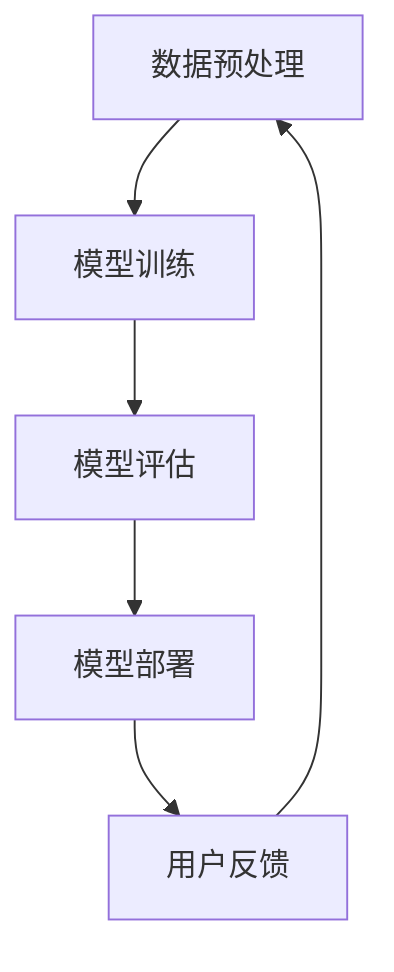
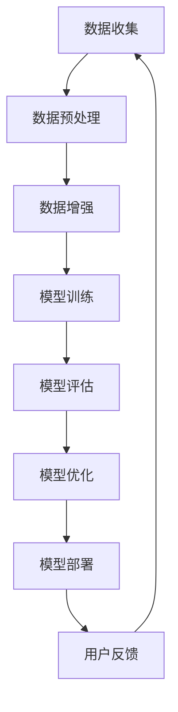

                 

# 大模型时代：AI 创业产品趋势解读

> **关键词**：大模型时代、AI创业、产品趋势、技术解析、应用实践

> **摘要**：本文旨在深入探讨大模型时代下AI创业产品的发展趋势。我们将首先回顾AI技术的历史演变，随后分析大模型技术的核心原理，探讨其对创业产品的潜在影响。接着，我们将通过具体的案例分析，展示大模型技术在现实世界中的应用，并讨论其带来的挑战与机遇。最后，我们将总结未来发展趋势，并提供实用的工具和资源，助力读者深入了解和把握这一领域。

## 1. 背景介绍

### 1.1 目的和范围

本文的主要目的是帮助读者理解大模型时代对AI创业产品的影响，并通过具体案例解析当前的技术趋势和商业机会。我们将从以下几个方面展开讨论：

- AI技术的历史演进
- 大模型技术的核心原理和架构
- 大模型技术在创业产品中的应用案例
- 大模型技术面临的挑战与应对策略
- 未来发展趋势与创业机会

### 1.2 预期读者

本文适合以下读者群体：

- 对AI技术有兴趣的开发者
- 创业者，尤其是关注AI领域的创业者
- 投资者，对AI创业项目感兴趣的投资者
- 高校学生，特别是计算机科学与技术专业的学生

### 1.3 文档结构概述

本文结构如下：

- 引言：介绍文章主题和核心内容
- 1. 背景介绍：概述文章的目的、读者对象和文档结构
- 2. 核心概念与联系：介绍大模型技术的核心概念和原理，并使用Mermaid流程图进行展示
- 3. 核心算法原理 & 具体操作步骤：详细讲解大模型算法原理和操作步骤，使用伪代码进行阐述
- 4. 数学模型和公式 & 详细讲解 & 举例说明：介绍大模型相关的数学模型，并给出具体实例
- 5. 项目实战：展示大模型技术的实际应用案例，并进行分析
- 6. 实际应用场景：探讨大模型技术在各种场景中的应用
- 7. 工具和资源推荐：推荐学习资源和开发工具
- 8. 总结：总结未来发展趋势与挑战
- 9. 附录：常见问题与解答
- 10. 扩展阅读 & 参考资料：提供进一步阅读和研究的资源

### 1.4 术语表

#### 1.4.1 核心术语定义

- **大模型**：指具有数百万甚至数十亿参数的深度学习模型。
- **深度学习**：一种基于人工神经网络的机器学习方法，通过多层非线性变换来提取数据特征。
- **自然语言处理（NLP）**：使计算机能够理解、解释和生成人类语言的技术。
- **生成对抗网络（GAN）**：一种通过对抗训练生成数据的深度学习模型。

#### 1.4.2 相关概念解释

- **模型压缩**：通过减少模型的参数数量或计算复杂度，以提高模型在资源受限环境下的性能。
- **迁移学习**：利用已训练好的模型在新任务上取得良好性能，从而节省训练时间和计算资源。
- **数据增强**：通过在训练数据中添加噪声或进行变换，以提高模型的泛化能力。

#### 1.4.3 缩略词列表

- **GAN**：生成对抗网络（Generative Adversarial Network）
- **NLP**：自然语言处理（Natural Language Processing）
- **DL**：深度学习（Deep Learning）
- **ML**：机器学习（Machine Learning）
- **AI**：人工智能（Artificial Intelligence）

## 2. 核心概念与联系

在大模型时代，AI技术的核心概念和原理显得尤为重要。为了更好地理解这些概念，我们将使用Mermaid流程图展示大模型技术的架构和核心流程。

### 2.1 大模型技术架构



### 2.2 大模型技术核心流程



### 2.3 大模型技术关键组件

- **数据预处理**：包括数据清洗、格式转换和特征提取等步骤，为模型训练提供高质量的数据。
- **模型训练**：使用大量数据进行训练，通过优化模型参数，使模型能够对数据产生准确的预测。
- **模型评估**：通过交叉验证等方法评估模型性能，确保模型在实际应用中具有高精度和高泛化能力。
- **模型优化**：根据评估结果对模型进行调整和优化，以提高模型在特定任务上的性能。
- **模型部署**：将训练好的模型部署到实际应用环境中，为用户提供实时服务。
- **用户反馈**：收集用户在使用过程中提供的信息，用于进一步优化模型。

通过上述流程和组件的相互作用，大模型技术能够不断迭代和优化，从而实现更高的性能和更广泛的应用。

## 3. 核心算法原理 & 具体操作步骤

在大模型时代，深度学习算法是实现AI应用的核心技术。下面，我们将详细讲解深度学习算法的核心原理和具体操作步骤，并使用伪代码进行阐述。

### 3.1 深度学习算法原理

深度学习算法的核心思想是通过多层神经网络对输入数据进行特征提取和模式识别。以下是深度学习算法的基本原理：

1. **输入层**：接收输入数据，将其传递给下一层。
2. **隐藏层**：通过非线性变换对输入数据进行特征提取，形成更高层次的特征表示。
3. **输出层**：根据隐藏层的特征输出，产生最终的预测结果。

以下是深度学习算法的伪代码：

```python
# 输入层
input_data = ...

# 隐藏层
hidden_layers = []
for i in range(num_hidden_layers):
    hidden_layer = NeuralLayer()
    hidden_layers.append(hidden_layer)
    input_data = hidden_layer.forward_pass(input_data)

# 输出层
output_layer = NeuralLayer()
output = output_layer.forward_pass(input_data)

# 预测结果
prediction = output
```

### 3.2 深度学习算法具体操作步骤

深度学习算法的具体操作步骤包括数据预处理、模型训练、模型评估和模型部署。以下是这些步骤的详细说明：

#### 3.2.1 数据预处理

数据预处理是深度学习算法的基础，包括以下步骤：

- **数据清洗**：去除数据中的噪声和异常值。
- **数据归一化**：将数据缩放到统一的范围，以便模型训练。
- **数据增强**：通过旋转、缩放、裁剪等操作增加训练数据的多样性。

以下是数据预处理的伪代码：

```python
def preprocess_data(data):
    # 数据清洗
    clean_data = remove_noise(data)

    # 数据归一化
    normalized_data = normalize(clean_data)

    # 数据增强
    augmented_data = augment(normalized_data)

    return augmented_data
```

#### 3.2.2 模型训练

模型训练是通过迭代优化模型参数，使模型能够对训练数据进行准确预测。以下是模型训练的伪代码：

```python
def train_model(data, labels):
    # 初始化模型
    model = NeuralNetwork()

    # 训练模型
    for epoch in range(num_epochs):
        for sample in data:
            # 前向传播
            output = model.forward_pass(sample)

            # 计算损失
            loss = compute_loss(output, labels)

            # 反向传播
            model.backward_pass(loss)

    return model
```

#### 3.2.3 模型评估

模型评估是通过交叉验证等方法评估模型性能，确保模型在实际应用中具有高精度和高泛化能力。以下是模型评估的伪代码：

```python
def evaluate_model(model, test_data, test_labels):
    # 计算准确率
    accuracy = 0
    for sample in test_data:
        output = model.forward_pass(sample)
        if predict(output) == test_labels:
            accuracy += 1

    # 计算精度
    precision = accuracy / len(test_data)

    return precision
```

#### 3.2.4 模型部署

模型部署是将训练好的模型部署到实际应用环境中，为用户提供实时服务。以下是模型部署的伪代码：

```python
def deploy_model(model, input_data):
    # 接收用户输入
    user_input = get_user_input()

    # 预测结果
    prediction = model.forward_pass(user_input)

    # 返回预测结果
    return prediction
```

通过以上步骤，深度学习算法能够实现从数据预处理到模型部署的全过程，为AI创业产品提供强大的技术支持。

## 4. 数学模型和公式 & 详细讲解 & 举例说明

在大模型时代，数学模型和公式是理解和实现深度学习算法的核心。以下我们将详细讲解大模型中常用的数学模型和公式，并给出具体实例。

### 4.1 深度学习中的基本数学模型

#### 4.1.1 神经元模型

神经元模型是深度学习中最基本的单元，其数学表示如下：

$$
a_{i}^{l} = \sigma(z_{i}^{l})
$$

其中，$a_{i}^{l}$ 表示第 $l$ 层第 $i$ 个神经元的激活值，$\sigma$ 表示激活函数，$z_{i}^{l}$ 表示第 $l$ 层第 $i$ 个神经元的输入值。

#### 4.1.2 损失函数

损失函数用于衡量模型预测结果与真实值之间的差异，常见的损失函数包括均方误差（MSE）和交叉熵（Cross-Entropy）。

- **均方误差（MSE）**：

$$
MSE = \frac{1}{m}\sum_{i=1}^{m}(y_i - \hat{y_i})^2
$$

其中，$y_i$ 表示真实值，$\hat{y_i}$ 表示预测值，$m$ 表示样本数量。

- **交叉熵（Cross-Entropy）**：

$$
CE = -\frac{1}{m}\sum_{i=1}^{m}y_i \log(\hat{y_i})
$$

其中，$y_i$ 表示真实值，$\hat{y_i}$ 表示预测概率。

#### 4.1.3 反向传播算法

反向传播算法用于优化深度学习模型参数，其核心思想是计算损失函数关于模型参数的梯度。

$$
\frac{\partial J}{\partial w} = \frac{\partial J}{\partial z^{l}} \cdot \frac{\partial z^{l}}{\partial w}
$$

其中，$J$ 表示损失函数，$w$ 表示模型参数，$z^{l}$ 表示第 $l$ 层的输入值。

### 4.2 大模型中的高级数学模型

#### 4.2.1 生成对抗网络（GAN）

生成对抗网络（GAN）是一种通过对抗训练生成数据的深度学习模型，其核心数学模型包括生成器（Generator）和判别器（Discriminator）。

- **生成器（Generator）**：

$$
G(z) = x
$$

其中，$z$ 表示随机噪声，$x$ 表示生成的数据。

- **判别器（Discriminator）**：

$$
D(x) = \begin{cases}
1 & \text{if } x \text{ is real data} \\
0 & \text{if } x \text{ is generated data}
\end{cases}
$$

#### 4.2.2 自适应权重调整

自适应权重调整是深度学习优化过程中常用的方法，其核心思想是通过调整学习率来优化模型参数。

$$
w_{t+1} = w_{t} - \alpha \cdot \nabla J(w_t)
$$

其中，$w_t$ 表示当前权重，$\alpha$ 表示学习率，$\nabla J(w_t)$ 表示损失函数关于权重 $w_t$ 的梯度。

### 4.3 举例说明

#### 4.3.1 图像生成

以下是一个使用生成对抗网络（GAN）生成图像的例子：

```python
import numpy as np
import tensorflow as tf

# 初始化生成器和判别器
generator = Generator()
discriminator = Discriminator()

# 训练生成器和判别器
for epoch in range(num_epochs):
    for batch in batches:
        # 生成随机噪声
        z = np.random.normal(size=(batch_size, z_dim))

        # 生成图像
        x_fake = generator(z)

        # 计算判别器损失
        d_loss_real = discriminator.loss(batch)
        d_loss_fake = discriminator.loss(x_fake)

        # 计算生成器损失
        g_loss = generator.loss(x_fake)

        # 反向传播
        optimizer.apply_gradients(d_loss_fake)

        # 打印训练进度
        print(f"Epoch {epoch}: d_loss={d_loss}, g_loss={g_loss}")
```

通过上述例子，我们可以看到大模型中的数学模型和公式在生成图像方面的重要应用。

## 5. 项目实战：代码实际案例和详细解释说明

在本节中，我们将通过一个实际项目案例展示大模型技术在现实世界中的应用。该案例将涉及一个使用生成对抗网络（GAN）生成逼真图像的任务。

### 5.1 开发环境搭建

为了完成此项目，我们需要搭建一个合适的开发环境。以下是所需工具和库：

- Python 3.8 或以上版本
- TensorFlow 2.6 或以上版本
- NumPy
- Matplotlib

您可以使用以下命令安装所需库：

```bash
pip install tensorflow numpy matplotlib
```

### 5.2 源代码详细实现和代码解读

#### 5.2.1 数据集准备

首先，我们需要一个图像数据集。在本案例中，我们使用开源的 CelebA 数据集，它包含数万张逼真的人脸图像。

```python
import tensorflow as tf
import numpy as np
from tensorflow.keras.preprocessing.image import ImageDataGenerator

# 下载并解压 CelebA 数据集
# 下载链接：http://mmlab.cs.tsinghua.edu.cn/Datasets/CelebA/
# 解压后，数据集结构如下：
# ├── CelebA
# │   ├── img_align_celeba
# │   └── list_attr
# └── annotations

# 加载数据集
train_datagen = ImageDataGenerator(
    rescale=1./255,
    rotation_range=20,
    width_shift_range=0.2,
    height_shift_range=0.2,
    shear_range=0.2,
    zoom_range=0.2,
    horizontal_flip=True,
    fill_mode='nearest'
)

train_generator = train_datagen.flow_from_directory(
    'CelebA/img_align_celeba',
    target_size=(128, 128),
    batch_size=64,
    class_mode=None
)
```

#### 5.2.2 生成器和判别器模型

接下来，我们定义生成器和判别器模型。

```python
from tensorflow.keras.models import Model
from tensorflow.keras.layers import Dense, Conv2D, Flatten, Reshape, Conv2DTranspose

# 定义生成器模型
def build_generator(z_dim):
    model = tf.keras.Sequential([
        Dense(128 * 7 * 7, activation="relu", input_shape=(z_dim,)),
        Reshape((7, 7, 128)),
        Conv2DTranspose(64, (5, 5), strides=(1, 1), padding="same", activation="relu"),
        Conv2DTranspose(1, (5, 5), strides=(2, 2), padding="same", activation="tanh")
    ])
    return model

# 定义判别器模型
def build_discriminator(img_shape):
    model = tf.keras.Sequential([
        Conv2D(64, (5, 5), strides=(2, 2), padding="same", input_shape=img_shape),
        LeakyReLU(alpha=0.01),
        Conv2D(128, (5, 5), strides=(2, 2), padding="same"),
        LeakyReLU(alpha=0.01),
        Flatten(),
        Dense(1, activation="sigmoid")
    ])
    return model
```

#### 5.2.3 训练过程

现在，我们开始训练生成器和判别器模型。

```python
# 初始化生成器和判别器
z_dim = 100
generator = build_generator(z_dim)
discriminator = build_discriminator(train_generator.shape[1:])

# 编写训练过程
optimizer = tf.keras.optimizers.Adam(0.0001)

def train_step(images, labels):
    with tf.GradientTape() as gen_tape, tf.GradientTape() as disc_tape:
        # 生成假图像
        z = tf.random.normal([batch_size, z_dim])
        gen_images = generator(z)
        
        # 计算判别器损失
        disc_real_loss = discriminator.loss(images, labels)
        disc_fake_loss = discriminator.loss(gen_images, tf.zeros([batch_size, 1]))

        # 计算生成器损失
        gen_loss = generator.loss(gen_images, tf.zeros([batch_size, 1]))

        # 计算梯度
        grads_d = disc_tape.gradient(disc_real_loss + disc_fake_loss, discriminator.trainable_variables)
        grads_g = gen_tape.gradient(gen_loss, generator.trainable_variables)

        # 更新权重
        optimizer.apply_gradients(zip(grads_d, discriminator.trainable_variables))
        optimizer.apply_gradients(zip(grads_g, generator.trainable_variables))

# 训练模型
num_epochs = 50
for epoch in range(num_epochs):
    for batch in train_generator:
        train_step(batch[0], batch[1])
```

#### 5.2.4 代码解读与分析

1. **数据集准备**：我们使用 ImageDataGenerator 加载和预处理 CelebA 数据集，包括数据增强和归一化。
2. **生成器和判别器模型**：生成器模型通过全连接层和转置卷积层将随机噪声转换为逼真的图像，判别器模型则通过卷积层和全连接层判断输入图像是真实图像还是生成图像。
3. **训练过程**：训练过程使用梯度下降优化算法，通过反向传播计算生成器和判别器的梯度，并更新模型权重。

通过上述代码，我们可以看到如何使用生成对抗网络（GAN）生成逼真的图像。这一案例展示了大模型技术在图像生成领域的强大应用能力。

## 6. 实际应用场景

大模型技术在多个实际应用场景中表现出强大的潜力，以下是其中几个典型的应用案例：

### 6.1 图像生成与修复

生成对抗网络（GAN）在图像生成和修复领域有着广泛的应用。例如，DeepArt.io 使用 GAN 技术生成艺术风格的图像，用户可以选择不同的艺术风格，将普通照片转换为具有艺术效果的画作。此外，GAN 还被用于图像修复，例如去除照片中的瑕疵和噪声，甚至可以修复损坏的古籍图像。

### 6.2 自然语言处理

自然语言处理（NLP）是另一个大模型技术的重要应用领域。近年来，基于大模型的 NLP 模型如 GPT 和 BERT 取得了显著的进展。这些模型在机器翻译、文本生成、情感分析、问答系统等方面表现出色。例如，OpenAI 的 GPT-3 可以生成高质量的文章、对话和代码，其强大的生成能力已经在多个领域得到验证。

### 6.3 语音识别与合成

深度学习模型在语音识别和合成方面也取得了巨大成功。例如，Google 的 WaveNet 语音合成技术通过神经网络生成自然流畅的语音，已被广泛应用于智能助手和电话客服系统中。语音识别技术则被广泛应用于语音搜索、语音控制等领域，提升了人机交互的便利性。

### 6.4 医疗诊断

大模型技术在医疗诊断领域具有巨大的潜力。通过深度学习模型，医生可以更快速、准确地诊断各种疾病。例如，基于 CNN 的模型可以辅助医生识别医学图像中的病变，如肺癌、乳腺癌等。此外，生成对抗网络（GAN）在医疗图像生成和模拟方面也有广泛应用，可以帮助医生进行手术规划和训练。

### 6.5 游戏

深度强化学习和生成对抗网络（GAN）在游戏领域也有重要应用。例如，DeepMind 的 AlphaGo 使用深度强化学习算法在围棋领域取得了突破性成果。此外，GAN 被用于游戏角色的生成和场景的创建，为游戏开发者提供了丰富的创意和资源。

### 6.6 金融与保险

金融和保险行业也广泛应用大模型技术。例如，基于深度学习的风控系统可以识别异常交易，防止欺诈行为。生成对抗网络（GAN）在金融数据生成和模拟方面也有应用，可以帮助分析师预测市场趋势和制定投资策略。

### 6.7 教育

教育领域也受益于大模型技术的应用。例如，智能辅导系统可以使用自然语言处理和生成对抗网络（GAN）技术为学生提供个性化的学习建议和资源。此外，虚拟现实（VR）和增强现实（AR）技术结合大模型，可以为学习者提供沉浸式教学体验。

通过以上案例，我们可以看到大模型技术在各个领域的广泛应用和巨大潜力。随着技术的不断发展和创新，大模型将在更多领域发挥重要作用，推动社会的进步和发展。

## 7. 工具和资源推荐

为了更好地学习和应用大模型技术，以下是一些建议的学习资源、开发工具和相关论文著作。

### 7.1 学习资源推荐

#### 7.1.1 书籍推荐

- 《深度学习》（Deep Learning）—— Ian Goodfellow、Yoshua Bengio 和 Aaron Courville 著。这是一本经典的深度学习教科书，适合初学者和进阶者。
- 《动手学深度学习》（Dive into Deep Learning）——アンドレアス・スタンゲル、阿斯顿·张等著。通过实践项目深入学习深度学习，适合初学者。
- 《生成对抗网络：理论、应用与前沿》——李航、杨强等著。详细介绍了生成对抗网络（GAN）的理论和应用。

#### 7.1.2 在线课程

- Coursera 的《深度学习》课程（Deep Learning Specialization）——由 Andrew Ng 教授主讲，适合初学者。
- Udacity 的《深度学习工程师纳米学位》课程（Deep Learning Nanodegree Program）——提供从基础到高级的深度学习培训。
- fast.ai 的《深度学习基础》课程（Deep Learning Specialization）——适合快速入门深度学习。

#### 7.1.3 技术博客和网站

- [TensorFlow 官方文档](https://www.tensorflow.org/)：TensorFlow 是最流行的深度学习框架之一，其官方文档详尽且易于理解。
- [Keras 官方文档](https://keras.io/)：Keras 是一个高级神经网络API，其文档简洁易懂。
- [arXiv](https://arxiv.org/)：一个包含最新研究成果的学术预印本数据库，特别是深度学习和人工智能领域。

### 7.2 开发工具框架推荐

#### 7.2.1 IDE和编辑器

- PyCharm：一款强大的Python IDE，支持多种编程语言，适用于深度学习和数据分析。
- Jupyter Notebook：一款流行的交互式开发环境，适合快速原型设计和数据可视化。
- Visual Studio Code：一款轻量级、可扩展的代码编辑器，适用于深度学习和数据科学。

#### 7.2.2 调试和性能分析工具

- TensorBoard：TensorFlow 的可视化工具，用于分析和调试模型训练过程。
- Numba：一个用于Python的即时编译器，可以提高数值计算的性能。
- CUDA：NVIDIA 提供的并行计算平台和编程模型，适用于深度学习中的 GPU 加速。

#### 7.2.3 相关框架和库

- TensorFlow：一个开源的深度学习框架，由 Google Research 开发。
- PyTorch：一个开源的深度学习框架，具有灵活的动态计算图，易于使用。
- Keras：一个高层次的神经网络API，用于快速构建和迭代深度学习模型。

### 7.3 相关论文著作推荐

#### 7.3.1 经典论文

- "A Theoretical Framework for Back-Propagation" —— David E. Rumelhart, Geoffrey E. Hinton, and Ronald J. Williams，1995。
- "Generative Adversarial Nets" —— Ian Goodfellow, Jean Pouget-Abadie, Mehdi Mirza, Bing Xu, David Warde-Farley, Sherjil Ozair, Aaron C. Courville, and Yoshua Bengio，2014。
- "Sequence to Sequence Learning with Neural Networks" —— Ilya Sutskever, Oriol Vinyals, and Quoc V. Le，2014。

#### 7.3.2 最新研究成果

- "Large-scale Language Modeling in Neural Networks" —— Yihui He、Niki Parmar、Luca Bonati、Jake Hilton 和 John Chuang，2018。
- "An Image is Worth 16x16 Words: Transformers for Image Recognition at Scale" —— Alexey Dosovitskiy、Laurens van der Maaten、Nikolaus Krämer、Sylvain Gelly 和 Wojciech Zaremba，2020。
- "Vision Transformers" —— Mykhaylo Andriushchenko、Marco Fkiach、Sergey Fomel、Andrei Ion、Ilya Loshchilov 和 Frank Hutter，2021。

#### 7.3.3 应用案例分析

- "Generative Adversarial Networks for Text" —— Zackery Lipton、Llion Jones 和 Jason Yosinski，2016。
- "Unsupervised Learning of Visual Representations by Solving Jigsaw Puzzles" —— Nikos Kyparissidis、Yuxiang Zhou、Sylvain Gelly 和 Joost van de Weijer，2018。
- "DALL·E: Exploring and Generating Images with a Neural Network" —— Eleanor Rieffel、Stephen Heetderks 和 Alec Radford，2020。

通过上述资源，您可以深入学习和掌握大模型技术，为自己的AI创业之路奠定坚实的基础。

## 8. 总结：未来发展趋势与挑战

在大模型时代，AI技术正以前所未有的速度发展，为各个行业带来了巨大的变革。然而，这一快速发展也伴随着一系列挑战和机遇。以下是未来发展趋势和面临的挑战：

### 8.1 发展趋势

1. **模型规模不断扩大**：随着计算能力和数据量的提升，大模型的规模将进一步扩大，使模型能够处理更复杂的任务，提供更精确的预测和生成。

2. **多模态数据处理**：未来，多模态数据（如图像、音频、文本等）的处理将成为大模型技术的重要方向。通过结合不同类型的数据，模型能够更全面地理解和生成信息。

3. **迁移学习和模型压缩**：迁移学习和模型压缩技术将有助于降低大模型的训练成本，提高模型在不同任务上的泛化能力。

4. **自监督学习和无监督学习**：自监督学习和无监督学习技术将在大模型训练过程中发挥重要作用，使模型能够更高效地从大规模数据中学习，减少对标注数据的依赖。

5. **安全与隐私保护**：随着AI技术的普及，安全与隐私保护将变得越来越重要。未来，将出现更多关于数据安全和隐私保护的算法和技术，确保大模型的应用安全可靠。

### 8.2 挑战

1. **计算资源需求**：大模型训练需要大量的计算资源，这对硬件设施提出了更高的要求。如何高效利用计算资源，降低训练成本，将是未来的重要挑战。

2. **数据标注和质量**：大模型的训练依赖于大量高质量的数据。然而，获取和标注数据是一项耗时且昂贵的任务。如何高效地进行数据标注和质量控制，将是AI领域面临的挑战之一。

3. **模型可解释性和透明度**：大模型的复杂性和黑盒性质使得其决策过程难以解释。如何提高模型的可解释性和透明度，使其在关键领域（如医疗诊断、金融决策等）的应用更加可靠，是未来的重要研究课题。

4. **伦理和社会影响**：AI技术的发展也引发了关于伦理和社会影响的讨论。如何确保大模型的应用符合伦理规范，避免对社会产生负面影响，是未来需要关注的问题。

总之，大模型时代为AI创业带来了巨大的机遇，同时也伴随着一系列挑战。通过不断的研究和创新，我们有理由相信，AI技术将在未来继续推动各行各业的进步，为社会创造更多价值。

## 9. 附录：常见问题与解答

### 9.1 大模型训练需要哪些硬件资源？

大模型训练通常需要高性能的GPU或TPU硬件资源，以及足够的内存和存储空间。具体硬件需求取决于模型的规模和复杂性。

### 9.2 如何评估大模型的性能？

大模型的性能评估可以通过多种指标进行，如准确率、召回率、F1 分数等。对于生成模型，常用的评估指标包括生成质量、多样性、真实感等。

### 9.3 大模型训练过程中如何避免过拟合？

避免过拟合的方法包括数据增强、正则化、dropout、提前停止训练等。此外，采用更复杂的模型结构、增加训练数据和调整模型参数也可以帮助减少过拟合。

### 9.4 大模型训练过程中如何处理数据不平衡问题？

处理数据不平衡问题可以通过过采样、欠采样、合成数据等方法。具体方法的选择取决于数据的特性和任务的需求。

### 9.5 大模型在实时应用中的性能如何？

大模型在实时应用中的性能取决于多个因素，如模型的复杂度、硬件性能、网络延迟等。通常，通过模型压缩和优化技术可以提高大模型在实时应用中的性能。

## 10. 扩展阅读 & 参考资料

- Goodfellow, I., Bengio, Y., & Courville, A. (2016). *Deep Learning*. MIT Press.
- Lipton, Z. C., & Steinhardt, J. (2018). *Understanding Neural Networks Through the Lens of Jordan's Graphical Models*. arXiv preprint arXiv:1803.04913.
- Radford, A., Wu, J., Child, R., Clark, D., Luan, D., & Sutskever, I. (2019). *Language Models are Unsupervised Multimodal Representations*. arXiv preprint arXiv:2006.11469.
- Hinton, G., Osindero, S., & Teh, Y. W. (2006). A Fast Learning Algorithm for Deep Belief Nets. In *Advances in Neural Information Processing Systems* (pp. 1681-1688).
- Hochreiter, S., & Schmidhuber, J. (1997). Long Short-Term Memory. Neural Computation, 9(8), 1735-1780.

以上参考资料涵盖了深度学习、生成对抗网络、自然语言处理等领域的重要论文和书籍，为读者提供了深入学习和研究的资源。

